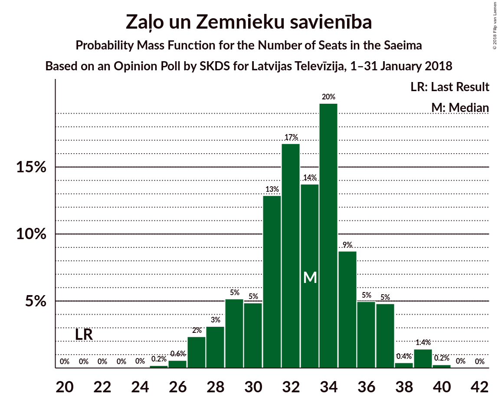
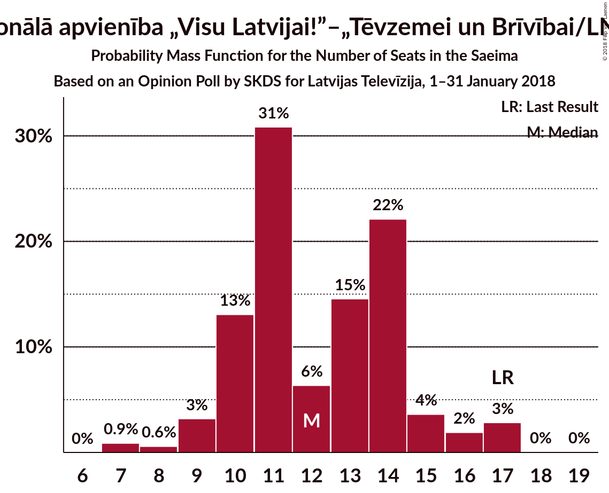
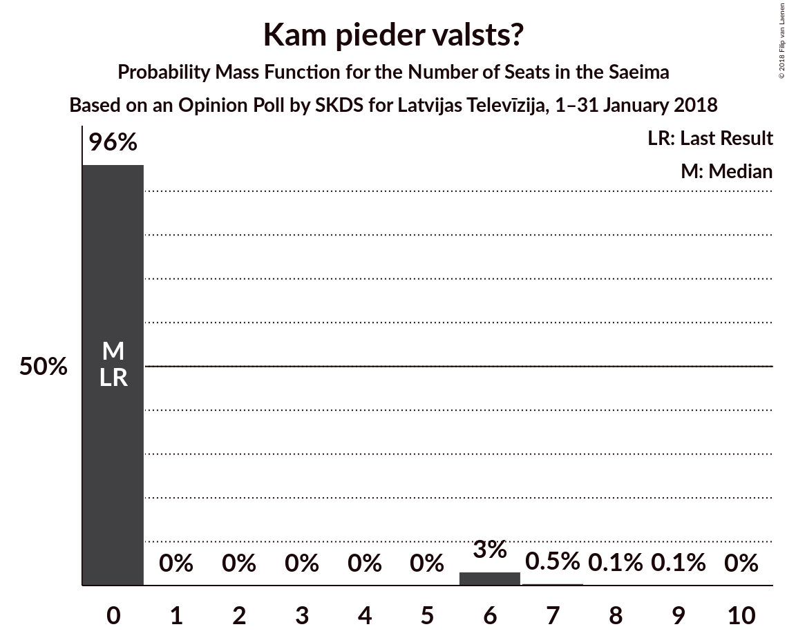
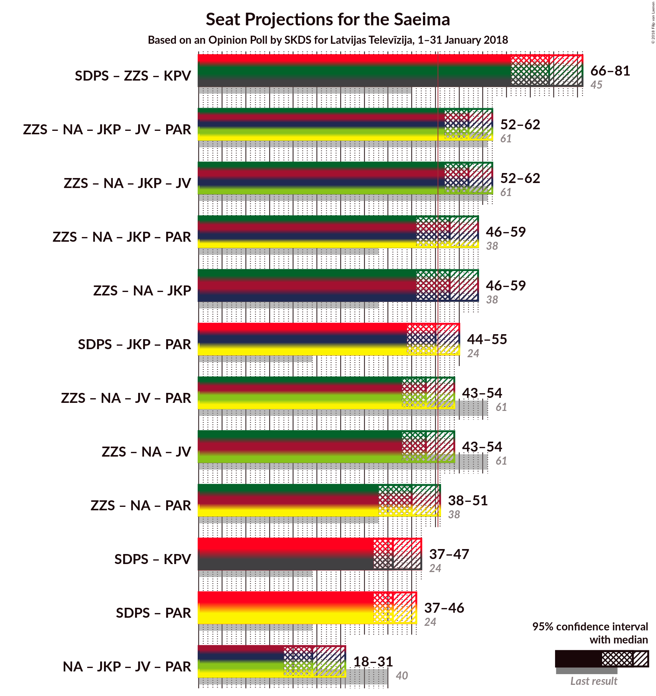

# Opinion Poll by SKDS for Latvijas Televīzija, 1–31 January 2018

<a href="#voting-intentions">Voting Intentions</a> | <a href="#seats">Seats</a> | <a href="#coalitions">Coalitions</a> | <a href="#technical-information">Technical Information</a>

## Voting Intentions

### Confidence Intervals

| Party | Last Result | Poll Result | 80% Confidence Interval | 90% Confidence Interval | 95% Confidence Interval | 99% Confidence Interval |
|:-----:|:-----------:|:-----------:|:-----------------------:|:-----------------------:|:-----------------------:|:-----------------------:|
| Sociāldemokrātiskā Partija “Saskaņa” | 23.0% | 35.5% | 33.0–38.1% |32.3–38.8% |31.7–39.5% |30.5–40.7% |
| Zaļo un Zemnieku savienība | 19.5% | 26.6% | 24.3–29.1% |23.7–29.8% |23.2–30.4% |22.1–31.6% |
| Nacionālā apvienība „Visu Latvijai!”–„Tēvzemei un Brīvībai/LNNK” | 16.6% | 10.1% | 8.6–11.9% |8.2–12.4% |7.9–12.8% |7.2–13.7% |
| Jaunā konservatīvā partija | 0.7% | 7.1% | 5.9–8.7% |5.6–9.1% |5.3–9.5% |4.8–10.3% |
| Vienotība | 21.9% | 5.0% | 4.0–6.4% |3.8–6.8% |3.5–7.2% |3.1–7.9% |
| Latvijas Reģionu apvienība | 6.7% | 4.3% | 3.4–5.7% |3.2–6.0% |3.0–6.3% |2.6–7.0% |
| Kam pieder valsts? | 0.0% | 3.5% | 2.7–4.7% |2.5–5.0% |2.3–5.3% |1.9–5.9% |
| Kustība Par! | 0.0% | 2.4% | 1.8–3.5% |1.6–3.8% |1.5–4.1% |1.2–4.6% |
| No sirds Latvijai | 6.8% | 1.7% | 1.2–2.7% |1.1–2.9% |0.9–3.2% |0.7–3.7% |

*Note:* The poll result column reflects the actual value used in the calculations. Published results may vary slightly, and in addition be rounded to fewer digits.

## Seats

### Confidence Intervals

| Party | Last Result | Median | 80% Confidence Interval | 90% Confidence Interval | 95% Confidence Interval | 99% Confidence Interval |
|:-----:|:-----------:|:------:|:-----------------------:|:-----------------------:|:-----------------------:|:-----------------------:|
| <a href="#sociāldemokrātiskā-partija-“saskaņa”">Sociāldemokrātiskā Partija “Saskaņa”</a> | 24 | 41 | 38–43 |37–45 |36–46 |35–49 |
| <a href="#zaļo-un-zemnieku-savienība">Zaļo un Zemnieku savienība</a> | 21 | 33 | 29–39 |28–39 |28–39 |26–39 |
| <a href="#nacionālā-apvienība-„visu-latvijai!”–„tēvzemei-un-brīvībai/lnnk”">Nacionālā apvienība „Visu Latvijai!”–„Tēvzemei un Brīvībai/LNNK”</a> | 17 | 11 | 10–14 |9–14 |9–15 |7–17 |
| <a href="#jaunā-konservatīvā-partija">Jaunā konservatīvā partija</a> | 0 | 8 | 7–10 |7–11 |7–11 |0–13 |
| <a href="#vienotība">Vienotība</a> | 23 | 7 | 0–8 |0–8 |0–8 |0–9 |
| <a href="#latvijas-reģionu-apvienība">Latvijas Reģionu apvienība</a> | 8 | 0 | 0–6 |0–7 |0–9 |0–9 |
| <a href="#kam-pieder-valsts?">Kam pieder valsts?</a> | 0 | 0 | 0 |0 |0 |0–7 |
| <a href="#kustība-par!">Kustība Par!</a> | 0 | 0 | 0 |0 |0 |0 |
| <a href="#no-sirds-latvijai">No sirds Latvijai</a> | 7 | 0 | 0 |0 |0 |0 |

### Sociāldemokrātiskā Partija “Saskaņa”

*For a full overview of the results for this party, see the [Sociāldemokrātiskā Partija “Saskaņa”](party-sociāldemokrātiskāpartija“saskaņa”.html) page.*

| Number of Seats | Probability | Accumulated | Special Marks |
|:---------------:|:-----------:|:-----------:|:-------------:|
| 24 | 0% | 100% | Last Result |
| 25 | 0% | 100% |  |
| 26 | 0% | 100% |  |
| 27 | 0% | 100% |  |
| 28 | 0% | 100% |  |
| 29 | 0% | 100% |  |
| 30 | 0% | 100% |  |
| 31 | 0% | 100% |  |
| 32 | 0% | 100% |  |
| 33 | 0.1% | 100% |  |
| 34 | 0.1% | 99.9% |  |
| 35 | 2% | 99.8% |  |
| 36 | 2% | 98% |  |
| 37 | 2% | 96% |  |
| 38 | 5% | 94% |  |
| 39 | 19% | 88% |  |
| 40 | 6% | 70% |  |
| 41 | 33% | 64% | Median |
| 42 | 4% | 31% |  |
| 43 | 20% | 27% |  |
| 44 | 0.4% | 7% |  |
| 45 | 4% | 7% |  |
| 46 | 1.1% | 3% |  |
| 47 | 0.5% | 2% |  |
| 48 | 0.1% | 1.1% |  |
| 49 | 0.7% | 1.0% |  |
| 50 | 0.1% | 0.4% |  |
| 51 | 0.3% | 0.3% | Majority |
| 52 | 0% | 0% |  |

### Zaļo un Zemnieku savienība

*For a full overview of the results for this party, see the [Zaļo un Zemnieku savienība](party-zaļounzemniekusavienība.html) page.*

| Number of Seats | Probability | Accumulated | Special Marks |
|:---------------:|:-----------:|:-----------:|:-------------:|
| 21 | 0% | 100% | Last Result |
| 22 | 0% | 100% |  |
| 23 | 0% | 100% |  |
| 24 | 0.3% | 100% |  |
| 25 | 0.1% | 99.7% |  |
| 26 | 0.4% | 99.6% |  |
| 27 | 1.0% | 99.2% |  |
| 28 | 5% | 98% |  |
| 29 | 27% | 94% |  |
| 30 | 2% | 67% |  |
| 31 | 5% | 65% |  |
| 32 | 9% | 60% |  |
| 33 | 17% | 51% | Median |
| 34 | 11% | 34% |  |
| 35 | 6% | 24% |  |
| 36 | 0.3% | 17% |  |
| 37 | 3% | 17% |  |
| 38 | 0.1% | 14% |  |
| 39 | 14% | 14% |  |
| 40 | 0% | 0.1% |  |
| 41 | 0% | 0% |  |

### Nacionālā apvienība „Visu Latvijai!”–„Tēvzemei un Brīvībai/LNNK”

*For a full overview of the results for this party, see the [Nacionālā apvienība „Visu Latvijai!”–„Tēvzemei un Brīvībai/LNNK”](party-nacionālāapvienība„visulatvijai”–„tēvzemeiunbrīvībailnnk”.html) page.*

| Number of Seats | Probability | Accumulated | Special Marks |
|:---------------:|:-----------:|:-----------:|:-------------:|
| 7 | 1.0% | 100% |  |
| 8 | 0.2% | 99.0% |  |
| 9 | 4% | 98.7% |  |
| 10 | 24% | 95% |  |
| 11 | 33% | 71% | Median |
| 12 | 14% | 38% |  |
| 13 | 10% | 24% |  |
| 14 | 11% | 14% |  |
| 15 | 1.0% | 3% |  |
| 16 | 0.8% | 2% |  |
| 17 | 2% | 2% | Last Result |
| 18 | 0% | 0% |  |

### Jaunā konservatīvā partija

*For a full overview of the results for this party, see the [Jaunā konservatīvā partija](party-jaunākonservatīvāpartija.html) page.*

| Number of Seats | Probability | Accumulated | Special Marks |
|:---------------:|:-----------:|:-----------:|:-------------:|
| 0 | 1.2% | 100% | Last Result |
| 1 | 0% | 98.8% |  |
| 2 | 0% | 98.8% |  |
| 3 | 0% | 98.8% |  |
| 4 | 0% | 98.8% |  |
| 5 | 0% | 98.8% |  |
| 6 | 0% | 98.8% |  |
| 7 | 44% | 98.8% |  |
| 8 | 24% | 55% | Median |
| 9 | 20% | 31% |  |
| 10 | 5% | 11% |  |
| 11 | 5% | 6% |  |
| 12 | 0.1% | 0.9% |  |
| 13 | 0.7% | 0.7% |  |
| 14 | 0% | 0.1% |  |
| 15 | 0.1% | 0.1% |  |
| 16 | 0% | 0% |  |

### Vienotība

*For a full overview of the results for this party, see the [Vienotība](party-vienotība.html) page.*

| Number of Seats | Probability | Accumulated | Special Marks |
|:---------------:|:-----------:|:-----------:|:-------------:|
| 0 | 36% | 100% |  |
| 1 | 0% | 64% |  |
| 2 | 0% | 64% |  |
| 3 | 0% | 64% |  |
| 4 | 0% | 64% |  |
| 5 | 0% | 64% |  |
| 6 | 0% | 64% |  |
| 7 | 42% | 63% | Median |
| 8 | 20% | 21% |  |
| 9 | 0.5% | 0.8% |  |
| 10 | 0.2% | 0.3% |  |
| 11 | 0.1% | 0.1% |  |
| 12 | 0% | 0% |  |
| 13 | 0% | 0% |  |
| 14 | 0% | 0% |  |
| 15 | 0% | 0% |  |
| 16 | 0% | 0% |  |
| 17 | 0% | 0% |  |
| 18 | 0% | 0% |  |
| 19 | 0% | 0% |  |
| 20 | 0% | 0% |  |
| 21 | 0% | 0% |  |
| 22 | 0% | 0% |  |
| 23 | 0% | 0% | Last Result |

### Latvijas Reģionu apvienība

*For a full overview of the results for this party, see the [Latvijas Reģionu apvienība](party-latvijasreģionuapvienība.html) page.*

| Number of Seats | Probability | Accumulated | Special Marks |
|:---------------:|:-----------:|:-----------:|:-------------:|
| 0 | 63% | 100% | Median |
| 1 | 0% | 37% |  |
| 2 | 0% | 37% |  |
| 3 | 0% | 37% |  |
| 4 | 0% | 37% |  |
| 5 | 0% | 37% |  |
| 6 | 31% | 37% |  |
| 7 | 3% | 6% |  |
| 8 | 0.5% | 3% | Last Result |
| 9 | 3% | 3% |  |
| 10 | 0% | 0% |  |

### Kam pieder valsts?

*For a full overview of the results for this party, see the [Kam pieder valsts?](party-kampiedervalsts.html) page.*

| Number of Seats | Probability | Accumulated | Special Marks |
|:---------------:|:-----------:|:-----------:|:-------------:|
| 0 | 98% | 100% | Last Result, Median |
| 1 | 0% | 2% |  |
| 2 | 0% | 2% |  |
| 3 | 0% | 2% |  |
| 4 | 0% | 2% |  |
| 5 | 0% | 2% |  |
| 6 | 2% | 2% |  |
| 7 | 0.3% | 0.5% |  |
| 8 | 0.1% | 0.2% |  |
| 9 | 0.1% | 0.1% |  |
| 10 | 0% | 0% |  |

### Kustība Par!

*For a full overview of the results for this party, see the [Kustība Par!](party-kustībapar.html) page.*

| Number of Seats | Probability | Accumulated | Special Marks |
|:---------------:|:-----------:|:-----------:|:-------------:|
| 0 | 99.9% | 100% | Last Result, Median |
| 1 | 0% | 0.1% |  |
| 2 | 0% | 0.1% |  |
| 3 | 0% | 0.1% |  |
| 4 | 0% | 0.1% |  |
| 5 | 0% | 0.1% |  |
| 6 | 0% | 0.1% |  |
| 7 | 0% | 0% |  |

### No sirds Latvijai

*For a full overview of the results for this party, see the [No sirds Latvijai](party-nosirdslatvijai.html) page.*

| Number of Seats | Probability | Accumulated | Special Marks |
|:---------------:|:-----------:|:-----------:|:-------------:|
| 0 | 100% | 100% | Median |
| 1 | 0% | 0% |  |
| 2 | 0% | 0% |  |
| 3 | 0% | 0% |  |
| 4 | 0% | 0% |  |
| 5 | 0% | 0% |  |
| 6 | 0% | 0% |  |
| 7 | 0% | 0% | Last Result |

## Coalitions

## Technical Information

### Opinion Poll

+ **Polling firm:** SKDS
+ **Commissioner(s):** Latvijas Televīzija
+ **Fieldwork period:** 1–31 January 2018

### Calculations

+ **Sample size:** 575
+ **Simulations done:** 65,536
+ **Error estimate:** 3.84%

