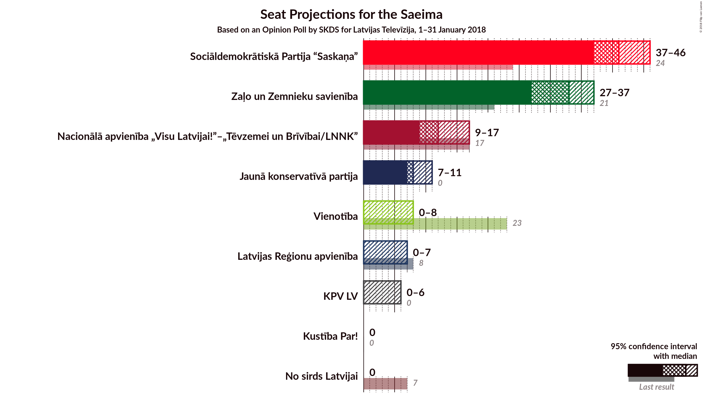
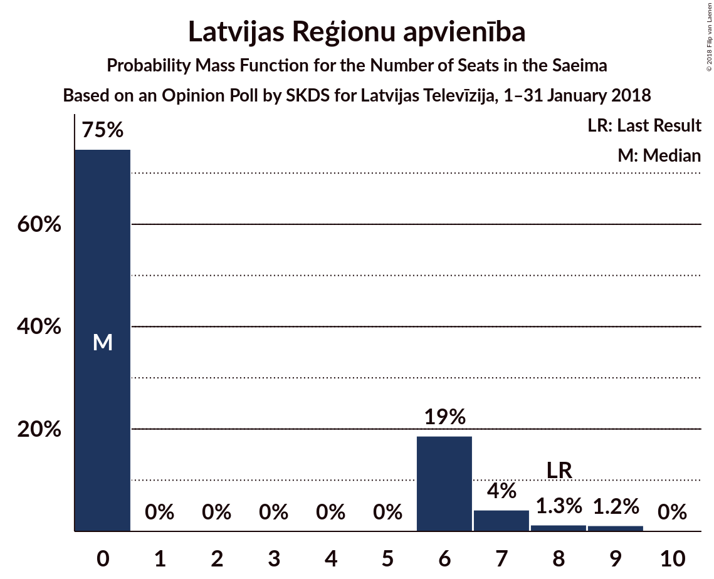

# Opinion Poll by SKDS for Latvijas Televīzija, 1–31 January 2018

<a href="#voting-intentions">Voting Intentions</a> | <a href="#seats">Seats</a> | <a href="#coalitions">Coalitions</a> | <a href="#technical-information">Technical Information</a>

## Voting Intentions

### Confidence Intervals

| Party | Last Result | Poll Result | 80% Confidence Interval | 90% Confidence Interval | 95% Confidence Interval | 99% Confidence Interval |
|:-----:|:-----------:|:-----------:|:-----------------------:|:-----------------------:|:-----------------------:|:-----------------------:|
| Sociāldemokrātiskā Partija “Saskaņa” | 23.0% | 35.5% | 33.0–38.1% |32.3–38.8% |31.7–39.5% |30.5–40.7% |
| Zaļo un Zemnieku savienība | 19.5% | 26.6% | 24.3–29.1% |23.7–29.8% |23.2–30.4% |22.1–31.6% |
| Nacionālā apvienība „Visu Latvijai!”–„Tēvzemei un Brīvībai/LNNK” | 16.6% | 10.1% | 8.6–11.9% |8.2–12.4% |7.9–12.8% |7.2–13.7% |
| Jaunā konservatīvā partija | 0.7% | 7.1% | 5.9–8.7% |5.6–9.1% |5.3–9.5% |4.8–10.3% |
| Vienotība | 21.9% | 5.0% | 4.0–6.4% |3.8–6.8% |3.5–7.2% |3.1–7.9% |
| Latvijas Reģionu apvienība | 6.7% | 4.3% | 3.4–5.7% |3.2–6.0% |3.0–6.3% |2.6–7.0% |
| Kam pieder valsts? | 0.0% | 3.5% | 2.7–4.7% |2.5–5.0% |2.3–5.3% |1.9–5.9% |
| Kustība Par! | 0.0% | 2.4% | 1.8–3.5% |1.6–3.8% |1.5–4.1% |1.2–4.6% |
| No sirds Latvijai | 6.8% | 1.7% | 1.2–2.7% |1.1–2.9% |0.9–3.2% |0.7–3.7% |

*Note:* The poll result column reflects the actual value used in the calculations. Published results may vary slightly, and in addition be rounded to fewer digits.

## Seats

### Confidence Intervals

| Party | Last Result | Median | 80% Confidence Interval | 90% Confidence Interval | 95% Confidence Interval | 99% Confidence Interval |
|:-----:|:-----------:|:------:|:-----------------------:|:-----------------------:|:-----------------------:|:-----------------------:|
| <a href="#sociāldemokrātiskā-partija-“saskaņa”">Sociāldemokrātiskā Partija “Saskaņa”</a> | 24 | 41 | 38–45 |37–46 |37–46 |35–48 |
| <a href="#zaļo-un-zemnieku-savienība">Zaļo un Zemnieku savienība</a> | 21 | 33 | 29–36 |28–37 |27–37 |26–39 |
| <a href="#nacionālā-apvienība-„visu-latvijai!”–„tēvzemei-un-brīvībai/lnnk”">Nacionālā apvienība „Visu Latvijai!”–„Tēvzemei un Brīvībai/LNNK”</a> | 17 | 12 | 10–14 |10–15 |9–17 |7–17 |
| <a href="#jaunā-konservatīvā-partija">Jaunā konservatīvā partija</a> | 0 | 8 | 7–10 |7–11 |7–11 |0–12 |
| <a href="#vienotība">Vienotība</a> | 23 | 0 | 0–8 |0–8 |0–8 |0–9 |
| <a href="#latvijas-reģionu-apvienība">Latvijas Reģionu apvienība</a> | 8 | 0 | 0–6 |0–7 |0–7 |0–9 |
| <a href="#kam-pieder-valsts?">Kam pieder valsts?</a> | 0 | 0 | 0 |0 |0–6 |0–7 |
| <a href="#kustība-par!">Kustība Par!</a> | 0 | 0 | 0 |0 |0 |0 |
| <a href="#no-sirds-latvijai">No sirds Latvijai</a> | 7 | 0 | 0 |0 |0 |0 |

### Sociāldemokrātiskā Partija “Saskaņa”

*For a full overview of the results for this party, see the [Sociāldemokrātiskā Partija “Saskaņa”](party-sociāldemokrātiskāpartija“saskaņa”.html) page.*

| Number of Seats | Probability | Accumulated | Special Marks |
|:---------------:|:-----------:|:-----------:|:-------------:|
| 24 | 0% | 100% | Last Result |
| 25 | 0% | 100% |  |
| 26 | 0% | 100% |  |
| 27 | 0% | 100% |  |
| 28 | 0% | 100% |  |
| 29 | 0% | 100% |  |
| 30 | 0% | 100% |  |
| 31 | 0% | 100% |  |
| 32 | 0% | 100% |  |
| 33 | 0.1% | 99.9% |  |
| 34 | 0.3% | 99.8% |  |
| 35 | 0.5% | 99.5% |  |
| 36 | 1.3% | 99.0% |  |
| 37 | 3% | 98% |  |
| 38 | 8% | 95% |  |
| 39 | 11% | 86% |  |
| 40 | 13% | 75% |  |
| 41 | 23% | 62% | Median |
| 42 | 12% | 38% |  |
| 43 | 11% | 26% |  |
| 44 | 3% | 15% |  |
| 45 | 5% | 12% |  |
| 46 | 6% | 8% |  |
| 47 | 0.9% | 1.5% |  |
| 48 | 0.2% | 0.5% |  |
| 49 | 0.2% | 0.3% |  |
| 50 | 0.1% | 0.2% |  |
| 51 | 0% | 0% | Majority |

### Zaļo un Zemnieku savienība

*For a full overview of the results for this party, see the [Zaļo un Zemnieku savienība](party-zaļounzemniekusavienība.html) page.*

| Number of Seats | Probability | Accumulated | Special Marks |
|:---------------:|:-----------:|:-----------:|:-------------:|
| 21 | 0% | 100% | Last Result |
| 22 | 0% | 100% |  |
| 23 | 0% | 100% |  |
| 24 | 0% | 100% |  |
| 25 | 0.2% | 100% |  |
| 26 | 0.6% | 99.8% |  |
| 27 | 2% | 99.2% |  |
| 28 | 3% | 97% |  |
| 29 | 5% | 94% |  |
| 30 | 5% | 89% |  |
| 31 | 13% | 84% |  |
| 32 | 17% | 71% |  |
| 33 | 14% | 54% | Median |
| 34 | 20% | 40% |  |
| 35 | 9% | 21% |  |
| 36 | 5% | 12% |  |
| 37 | 5% | 7% |  |
| 38 | 0.4% | 2% |  |
| 39 | 1.4% | 2% |  |
| 40 | 0.2% | 0.3% |  |
| 41 | 0% | 0.1% |  |
| 42 | 0% | 0% |  |

### Nacionālā apvienība „Visu Latvijai!”–„Tēvzemei un Brīvībai/LNNK”

*For a full overview of the results for this party, see the [Nacionālā apvienība „Visu Latvijai!”–„Tēvzemei un Brīvībai/LNNK”](party-nacionālāapvienība„visulatvijai”–„tēvzemeiunbrīvībailnnk”.html) page.*

| Number of Seats | Probability | Accumulated | Special Marks |
|:---------------:|:-----------:|:-----------:|:-------------:|
| 7 | 0.9% | 100% |  |
| 8 | 0.6% | 99.1% |  |
| 9 | 3% | 98.5% |  |
| 10 | 13% | 95% |  |
| 11 | 31% | 82% |  |
| 12 | 6% | 51% | Median |
| 13 | 15% | 45% |  |
| 14 | 22% | 31% |  |
| 15 | 4% | 8% |  |
| 16 | 2% | 5% |  |
| 17 | 3% | 3% | Last Result |
| 18 | 0% | 0.1% |  |
| 19 | 0% | 0% |  |

### Jaunā konservatīvā partija

*For a full overview of the results for this party, see the [Jaunā konservatīvā partija](party-jaunākonservatīvāpartija.html) page.*

| Number of Seats | Probability | Accumulated | Special Marks |
|:---------------:|:-----------:|:-----------:|:-------------:|
| 0 | 1.2% | 100% | Last Result |
| 1 | 0% | 98.8% |  |
| 2 | 0% | 98.8% |  |
| 3 | 0% | 98.8% |  |
| 4 | 0% | 98.8% |  |
| 5 | 0% | 98.8% |  |
| 6 | 0% | 98.8% |  |
| 7 | 17% | 98.8% |  |
| 8 | 37% | 82% | Median |
| 9 | 24% | 44% |  |
| 10 | 13% | 21% |  |
| 11 | 7% | 7% |  |
| 12 | 0.5% | 0.8% |  |
| 13 | 0.2% | 0.3% |  |
| 14 | 0.1% | 0.1% |  |
| 15 | 0% | 0% |  |

### Vienotība

*For a full overview of the results for this party, see the [Vienotība](party-vienotība.html) page.*

| Number of Seats | Probability | Accumulated | Special Marks |
|:---------------:|:-----------:|:-----------:|:-------------:|
| 0 | 51% | 100% | Median |
| 1 | 0% | 49% |  |
| 2 | 0% | 49% |  |
| 3 | 0% | 49% |  |
| 4 | 0% | 49% |  |
| 5 | 0% | 49% |  |
| 6 | 0% | 49% |  |
| 7 | 34% | 49% |  |
| 8 | 13% | 15% |  |
| 9 | 2% | 2% |  |
| 10 | 0.1% | 0.2% |  |
| 11 | 0.1% | 0.1% |  |
| 12 | 0% | 0% |  |
| 13 | 0% | 0% |  |
| 14 | 0% | 0% |  |
| 15 | 0% | 0% |  |
| 16 | 0% | 0% |  |
| 17 | 0% | 0% |  |
| 18 | 0% | 0% |  |
| 19 | 0% | 0% |  |
| 20 | 0% | 0% |  |
| 21 | 0% | 0% |  |
| 22 | 0% | 0% |  |
| 23 | 0% | 0% | Last Result |

### Latvijas Reģionu apvienība

*For a full overview of the results for this party, see the [Latvijas Reģionu apvienība](party-latvijasreģionuapvienība.html) page.*

| Number of Seats | Probability | Accumulated | Special Marks |
|:---------------:|:-----------:|:-----------:|:-------------:|
| 0 | 75% | 100% | Median |
| 1 | 0% | 25% |  |
| 2 | 0% | 25% |  |
| 3 | 0% | 25% |  |
| 4 | 0% | 25% |  |
| 5 | 0% | 25% |  |
| 6 | 19% | 25% |  |
| 7 | 4% | 7% |  |
| 8 | 1.3% | 2% | Last Result |
| 9 | 1.2% | 1.2% |  |
| 10 | 0% | 0% |  |

### Kam pieder valsts?

*For a full overview of the results for this party, see the [Kam pieder valsts?](party-kampiedervalsts.html) page.*

| Number of Seats | Probability | Accumulated | Special Marks |
|:---------------:|:-----------:|:-----------:|:-------------:|
| 0 | 96% | 100% | Last Result, Median |
| 1 | 0% | 4% |  |
| 2 | 0% | 4% |  |
| 3 | 0% | 4% |  |
| 4 | 0% | 4% |  |
| 5 | 0% | 4% |  |
| 6 | 3% | 4% |  |
| 7 | 0.5% | 0.7% |  |
| 8 | 0.1% | 0.2% |  |
| 9 | 0.1% | 0.1% |  |
| 10 | 0% | 0% |  |

### Kustība Par!

*For a full overview of the results for this party, see the [Kustība Par!](party-kustībapar.html) page.*

| Number of Seats | Probability | Accumulated | Special Marks |
|:---------------:|:-----------:|:-----------:|:-------------:|
| 0 | 99.9% | 100% | Last Result, Median |
| 1 | 0% | 0.1% |  |
| 2 | 0% | 0.1% |  |
| 3 | 0% | 0.1% |  |
| 4 | 0% | 0.1% |  |
| 5 | 0% | 0.1% |  |
| 6 | 0% | 0.1% |  |
| 7 | 0.1% | 0.1% |  |
| 8 | 0% | 0% |  |

### No sirds Latvijai

*For a full overview of the results for this party, see the [No sirds Latvijai](party-nosirdslatvijai.html) page.*

| Number of Seats | Probability | Accumulated | Special Marks |
|:---------------:|:-----------:|:-----------:|:-------------:|
| 0 | 100% | 100% | Median |
| 1 | 0% | 0% |  |
| 2 | 0% | 0% |  |
| 3 | 0% | 0% |  |
| 4 | 0% | 0% |  |
| 5 | 0% | 0% |  |
| 6 | 0% | 0% |  |
| 7 | 0% | 0% | Last Result |

## Coalitions

### Confidence Intervals

| Coalition | Last Result | Median | Majority? | 80% Confidence Interval | 90% Confidence Interval | 95% Confidence Interval | 99% Confidence Interval |
|:---------:|:-----------:|:------:|:---------:|:-----------------------:|:-----------------------:|:-----------------------:|:-----------------------:|
| Zaļo un Zemnieku savienība – Nacionālā apvienība „Visu Latvijai!”–„Tēvzemei un Brīvībai/LNNK” – Jaunā konservatīvā partija – Vienotība – Kustība Par! | 61 | 57 | 98% | 53–60 | 52–61 | 52–62 | 48–63 |
| Zaļo un Zemnieku savienība – Nacionālā apvienība „Visu Latvijai!”–„Tēvzemei un Brīvībai/LNNK” – Jaunā konservatīvā partija – Vienotība | 61 | 57 | 98% | 53–60 | 52–61 | 52–62 | 48–63 |
| Zaļo un Zemnieku savienība – Nacionālā apvienība „Visu Latvijai!”–„Tēvzemei un Brīvībai/LNNK” – Jaunā konservatīvā partija – Kustība Par! | 38 | 53 | 81% | 48–58 | 47–59 | 46–59 | 45–61 |
| Zaļo un Zemnieku savienība – Nacionālā apvienība „Visu Latvijai!”–„Tēvzemei un Brīvībai/LNNK” – Jaunā konservatīvā partija | 38 | 53 | 81% | 48–58 | 47–59 | 46–59 | 45–61 |
| Zaļo un Zemnieku savienība – Nacionālā apvienība „Visu Latvijai!”–„Tēvzemei un Brīvībai/LNNK” – Vienotība – Kustība Par! | 61 | 48 | 27% | 45–52 | 44–53 | 43–54 | 40–55 |
| Zaļo un Zemnieku savienība – Nacionālā apvienība „Visu Latvijai!”–„Tēvzemei un Brīvībai/LNNK” – Vienotība | 61 | 48 | 27% | 45–52 | 44–53 | 43–54 | 40–55 |
| Zaļo un Zemnieku savienība – Nacionālā apvienība „Visu Latvijai!”–„Tēvzemei un Brīvībai/LNNK” – Kustība Par! | 38 | 45 | 6% | 41–49 | 39–51 | 38–51 | 37–53 |

### Zaļo un Zemnieku savienība – Nacionālā apvienība „Visu Latvijai!”–„Tēvzemei un Brīvībai/LNNK” – Jaunā konservatīvā partija – Vienotība – Kustība Par!

| Number of Seats | Probability | Accumulated | Special Marks |
|:---------------:|:-----------:|:-----------:|:-------------:|
| 46 | 0.1% | 100% |  |
| 47 | 0.1% | 99.9% |  |
| 48 | 0.3% | 99.8% |  |
| 49 | 0.6% | 99.4% |  |
| 50 | 0.4% | 98.9% |  |
| 51 | 0.9% | 98% | Majority |
| 52 | 6% | 98% |  |
| 53 | 5% | 92% | Median |
| 54 | 9% | 87% |  |
| 55 | 11% | 78% |  |
| 56 | 8% | 67% |  |
| 57 | 11% | 59% |  |
| 58 | 9% | 48% |  |
| 59 | 20% | 39% |  |
| 60 | 10% | 19% |  |
| 61 | 4% | 9% | Last Result |
| 62 | 3% | 5% |  |
| 63 | 0.9% | 1.2% |  |
| 64 | 0.1% | 0.3% |  |
| 65 | 0.2% | 0.2% |  |
| 66 | 0% | 0% |  |

### Zaļo un Zemnieku savienība – Nacionālā apvienība „Visu Latvijai!”–„Tēvzemei un Brīvībai/LNNK” – Jaunā konservatīvā partija – Vienotība

| Number of Seats | Probability | Accumulated | Special Marks |
|:---------------:|:-----------:|:-----------:|:-------------:|
| 46 | 0.1% | 100% |  |
| 47 | 0.1% | 99.9% |  |
| 48 | 0.3% | 99.8% |  |
| 49 | 0.6% | 99.4% |  |
| 50 | 0.4% | 98.9% |  |
| 51 | 0.9% | 98% | Majority |
| 52 | 6% | 98% |  |
| 53 | 5% | 92% | Median |
| 54 | 9% | 87% |  |
| 55 | 11% | 78% |  |
| 56 | 8% | 67% |  |
| 57 | 11% | 59% |  |
| 58 | 9% | 48% |  |
| 59 | 20% | 39% |  |
| 60 | 10% | 19% |  |
| 61 | 4% | 9% | Last Result |
| 62 | 3% | 5% |  |
| 63 | 0.9% | 1.2% |  |
| 64 | 0.1% | 0.3% |  |
| 65 | 0.2% | 0.2% |  |
| 66 | 0% | 0% |  |

### Zaļo un Zemnieku savienība – Nacionālā apvienība „Visu Latvijai!”–„Tēvzemei un Brīvībai/LNNK” – Jaunā konservatīvā partija – Kustība Par!

| Number of Seats | Probability | Accumulated | Special Marks |
|:---------------:|:-----------:|:-----------:|:-------------:|
| 38 | 0% | 100% | Last Result |
| 39 | 0% | 100% |  |
| 40 | 0% | 100% |  |
| 41 | 0% | 100% |  |
| 42 | 0% | 100% |  |
| 43 | 0.1% | 99.9% |  |
| 44 | 0.1% | 99.9% |  |
| 45 | 0.3% | 99.7% |  |
| 46 | 3% | 99.4% |  |
| 47 | 3% | 96% |  |
| 48 | 5% | 94% |  |
| 49 | 4% | 88% |  |
| 50 | 3% | 84% |  |
| 51 | 7% | 81% | Majority |
| 52 | 18% | 74% |  |
| 53 | 9% | 56% | Median |
| 54 | 12% | 48% |  |
| 55 | 7% | 36% |  |
| 56 | 4% | 28% |  |
| 57 | 10% | 25% |  |
| 58 | 5% | 15% |  |
| 59 | 8% | 10% |  |
| 60 | 0.6% | 1.4% |  |
| 61 | 0.6% | 0.8% |  |
| 62 | 0.1% | 0.1% |  |
| 63 | 0% | 0% |  |

### Zaļo un Zemnieku savienība – Nacionālā apvienība „Visu Latvijai!”–„Tēvzemei un Brīvībai/LNNK” – Jaunā konservatīvā partija

| Number of Seats | Probability | Accumulated | Special Marks |
|:---------------:|:-----------:|:-----------:|:-------------:|
| 38 | 0% | 100% | Last Result |
| 39 | 0% | 100% |  |
| 40 | 0% | 100% |  |
| 41 | 0% | 100% |  |
| 42 | 0% | 100% |  |
| 43 | 0.1% | 99.9% |  |
| 44 | 0.1% | 99.9% |  |
| 45 | 0.3% | 99.7% |  |
| 46 | 3% | 99.4% |  |
| 47 | 3% | 96% |  |
| 48 | 5% | 94% |  |
| 49 | 4% | 88% |  |
| 50 | 3% | 84% |  |
| 51 | 7% | 81% | Majority |
| 52 | 18% | 74% |  |
| 53 | 9% | 56% | Median |
| 54 | 12% | 48% |  |
| 55 | 7% | 36% |  |
| 56 | 4% | 28% |  |
| 57 | 10% | 25% |  |
| 58 | 5% | 15% |  |
| 59 | 8% | 10% |  |
| 60 | 0.6% | 1.4% |  |
| 61 | 0.6% | 0.7% |  |
| 62 | 0.1% | 0.1% |  |
| 63 | 0% | 0% |  |

### Zaļo un Zemnieku savienība – Nacionālā apvienība „Visu Latvijai!”–„Tēvzemei un Brīvībai/LNNK” – Vienotība – Kustība Par!

| Number of Seats | Probability | Accumulated | Special Marks |
|:---------------:|:-----------:|:-----------:|:-------------:|
| 38 | 0.1% | 100% |  |
| 39 | 0.1% | 99.9% |  |
| 40 | 0.4% | 99.8% |  |
| 41 | 0.4% | 99.4% |  |
| 42 | 1.0% | 99.0% |  |
| 43 | 1.5% | 98% |  |
| 44 | 6% | 97% |  |
| 45 | 9% | 91% | Median |
| 46 | 6% | 82% |  |
| 47 | 13% | 76% |  |
| 48 | 14% | 63% |  |
| 49 | 8% | 49% |  |
| 50 | 13% | 40% |  |
| 51 | 11% | 27% | Majority |
| 52 | 9% | 16% |  |
| 53 | 3% | 7% |  |
| 54 | 3% | 4% |  |
| 55 | 1.2% | 2% |  |
| 56 | 0.2% | 0.4% |  |
| 57 | 0.1% | 0.2% |  |
| 58 | 0.1% | 0.1% |  |
| 59 | 0% | 0% |  |
| 60 | 0% | 0% |  |
| 61 | 0% | 0% | Last Result |

### Zaļo un Zemnieku savienība – Nacionālā apvienība „Visu Latvijai!”–„Tēvzemei un Brīvībai/LNNK” – Vienotība

| Number of Seats | Probability | Accumulated | Special Marks |
|:---------------:|:-----------:|:-----------:|:-------------:|
| 38 | 0.1% | 100% |  |
| 39 | 0.1% | 99.9% |  |
| 40 | 0.4% | 99.8% |  |
| 41 | 0.4% | 99.4% |  |
| 42 | 1.0% | 99.0% |  |
| 43 | 1.5% | 98% |  |
| 44 | 6% | 97% |  |
| 45 | 9% | 91% | Median |
| 46 | 6% | 82% |  |
| 47 | 13% | 76% |  |
| 48 | 14% | 63% |  |
| 49 | 8% | 49% |  |
| 50 | 13% | 40% |  |
| 51 | 11% | 27% | Majority |
| 52 | 9% | 16% |  |
| 53 | 3% | 7% |  |
| 54 | 3% | 4% |  |
| 55 | 1.2% | 2% |  |
| 56 | 0.2% | 0.4% |  |
| 57 | 0.1% | 0.2% |  |
| 58 | 0.1% | 0.1% |  |
| 59 | 0% | 0% |  |
| 60 | 0% | 0% |  |
| 61 | 0% | 0% | Last Result |

### Zaļo un Zemnieku savienība – Nacionālā apvienība „Visu Latvijai!”–„Tēvzemei un Brīvībai/LNNK” – Kustība Par!

| Number of Seats | Probability | Accumulated | Special Marks |
|:---------------:|:-----------:|:-----------:|:-------------:|
| 35 | 0.1% | 100% |  |
| 36 | 0.1% | 99.9% |  |
| 37 | 0.5% | 99.8% |  |
| 38 | 2% | 99.3% | Last Result |
| 39 | 2% | 97% |  |
| 40 | 4% | 95% |  |
| 41 | 7% | 91% |  |
| 42 | 7% | 84% |  |
| 43 | 13% | 77% |  |
| 44 | 9% | 64% |  |
| 45 | 15% | 56% | Median |
| 46 | 6% | 41% |  |
| 47 | 13% | 34% |  |
| 48 | 7% | 22% |  |
| 49 | 5% | 14% |  |
| 50 | 3% | 9% |  |
| 51 | 6% | 6% | Majority |
| 52 | 0.2% | 0.7% |  |
| 53 | 0.4% | 0.6% |  |
| 54 | 0.1% | 0.1% |  |
| 55 | 0% | 0% |  |

## Technical Information

### Opinion Poll

+ **Polling firm:** SKDS
+ **Commissioner(s):** Latvijas Televīzija
+ **Fieldwork period:** 1–31 January 2018

### Calculations

+ **Sample size:** 575
+ **Simulations done:** 1,048,576
+ **Error estimate:** 1.72%

