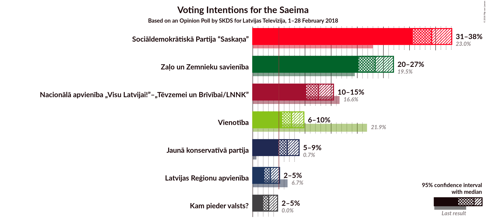
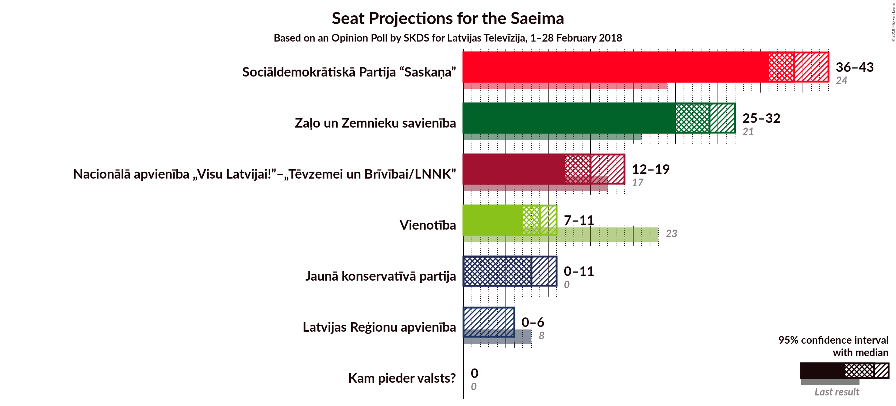

# Opinion Poll by SKDS for Latvijas Televīzija, 1–28 February 2018

<a href="#voting-intentions">Voting Intentions</a> | <a href="#seats">Seats</a> | <a href="#coalitions">Coalitions</a> | <a href="#technical-information">Technical Information</a>

## Voting Intentions

### Confidence Intervals

| Party | Last Result | Poll Result | 80% Confidence Interval | 90% Confidence Interval | 95% Confidence Interval | 99% Confidence Interval |
|:-----:|:-----------:|:-----------:|:-----------------------:|:-----------------------:|:-----------------------:|:-----------------------:|
| Sociāldemokrātiskā Partija “Saskaņa” | 23.0% | 34.2% | 31.9–36.8% |31.2–37.5% |30.6–38.1% |29.5–39.3% |
| Zaļo un Zemnieku savienība | 19.5% | 23.4% | 21.3–25.7% |20.8–26.4% |20.3–26.9% |19.3–28.0% |
| Nacionālā apvienība „Visu Latvijai!”–„Tēvzemei un Brīvībai/LNNK” | 16.6% | 12.6% | 11.0–14.5% |10.6–15.0% |10.2–15.5% |9.5–16.4% |
| Vienotība | 21.9% | 7.4% | 6.2–9.0% |5.9–9.4% |5.6–9.8% |5.1–10.6% |
| Jaunā konservatīvā partija | 0.7% | 6.6% | 5.5–8.1% |5.2–8.5% |4.9–8.9% |4.4–9.6% |
| Latvijas Reģionu apvienība | 6.7% | 3.4% | 2.6–4.5% |2.4–4.8% |2.2–5.1% |1.9–5.7% |
| Kam pieder valsts? | 0.0% | 3.1% | 2.3–4.2% |2.1–4.5% |2.0–4.8% |1.7–5.3% |

*Note:* The poll result column reflects the actual value used in the calculations. Published results may vary slightly, and in addition be rounded to fewer digits.

## Seats

### Confidence Intervals

| Party | Last Result | Median | 80% Confidence Interval | 90% Confidence Interval | 95% Confidence Interval | 99% Confidence Interval |
|:-----:|:-----------:|:------:|:-----------------------:|:-----------------------:|:-----------------------:|:-----------------------:|
| <a href="#sociāldemokrātiskā-partija-“saskaņa”">Sociāldemokrātiskā Partija “Saskaņa”</a> | 24 | N/A | N/A |N/A |N/A |N/A |
| <a href="#zaļo-un-zemnieku-savienība">Zaļo un Zemnieku savienība</a> | 21 | N/A | N/A |N/A |N/A |N/A |
| <a href="#nacionālā-apvienība-„visu-latvijai!”–„tēvzemei-un-brīvībai/lnnk”">Nacionālā apvienība „Visu Latvijai!”–„Tēvzemei un Brīvībai/LNNK”</a> | 17 | N/A | N/A |N/A |N/A |N/A |
| <a href="#vienotība">Vienotība</a> | 23 | N/A | N/A |N/A |N/A |N/A |
| <a href="#jaunā-konservatīvā-partija">Jaunā konservatīvā partija</a> | 0 | N/A | N/A |N/A |N/A |N/A |
| <a href="#latvijas-reģionu-apvienība">Latvijas Reģionu apvienība</a> | 8 | N/A | N/A |N/A |N/A |N/A |
| <a href="#kam-pieder-valsts?">Kam pieder valsts?</a> | 0 | N/A | N/A |N/A |N/A |N/A |

## Coalitions

## Technical Information

### Opinion Poll

+ **Polling firm:** SKDS
+ **Commissioner(s):** Latvijas Televīzija
+ **Fieldwork period:** 1–28 February 2018

### Calculations

+ **Sample size:** 619
+ **Simulations done:** 0
+ **Error estimate:** 100.00%

