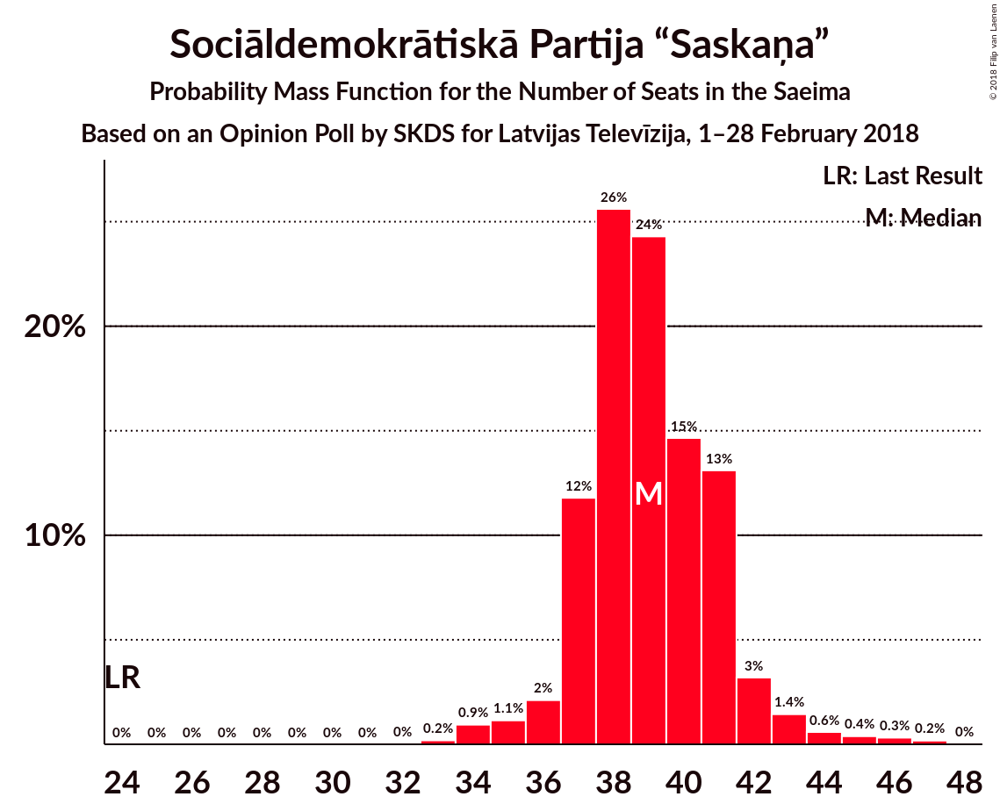
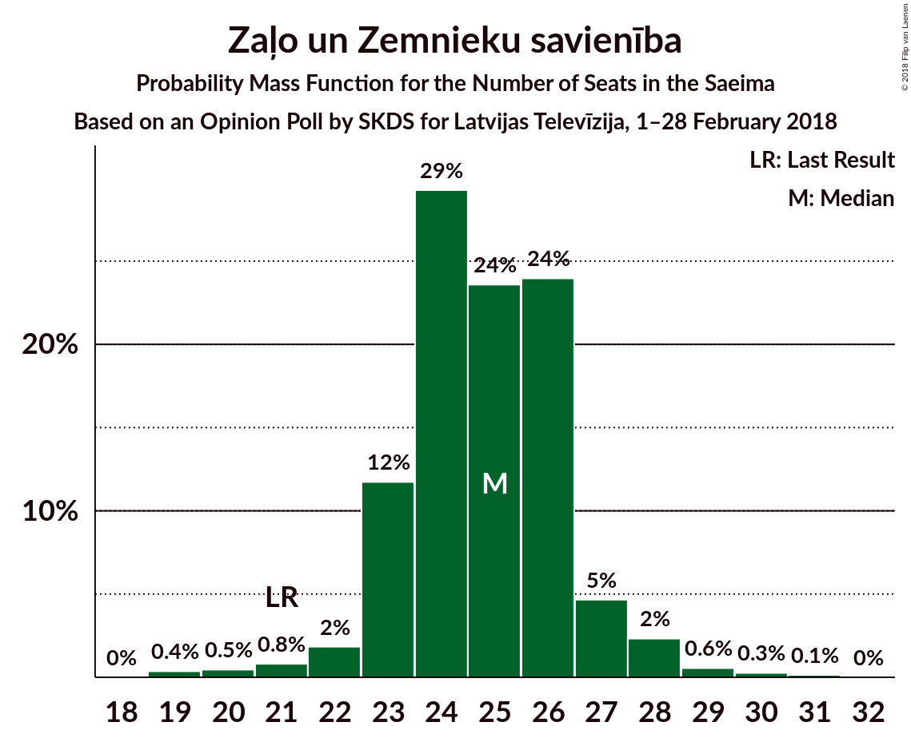
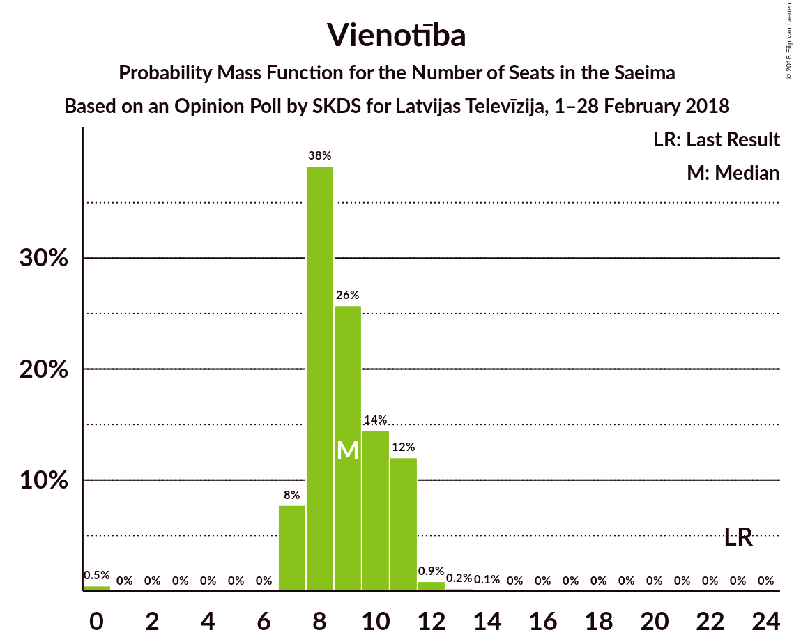
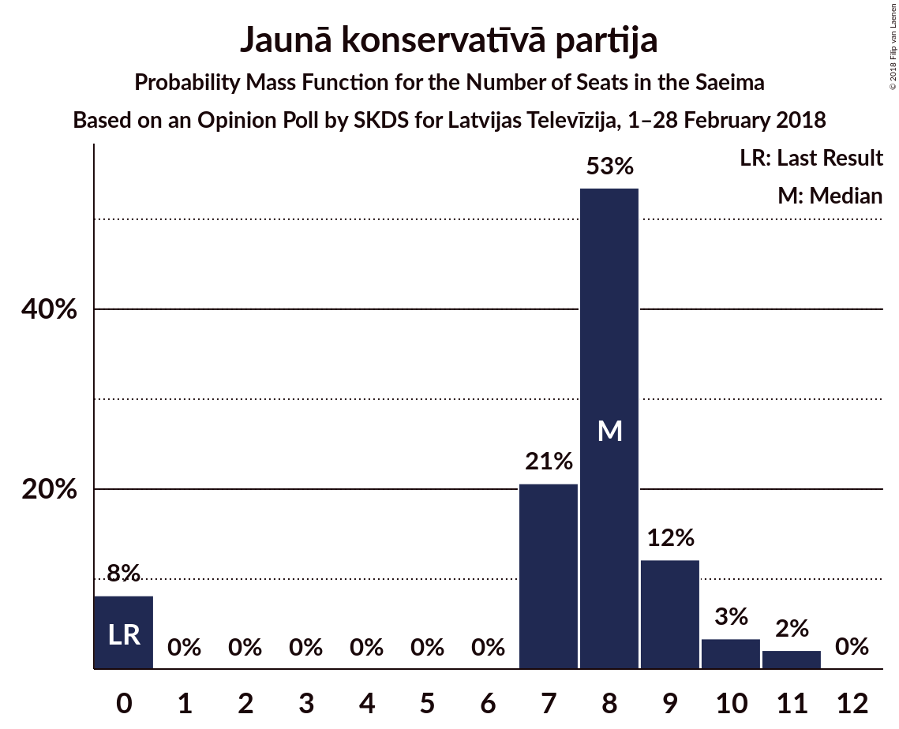
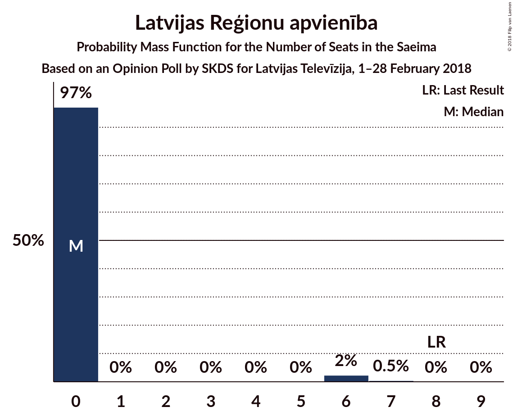
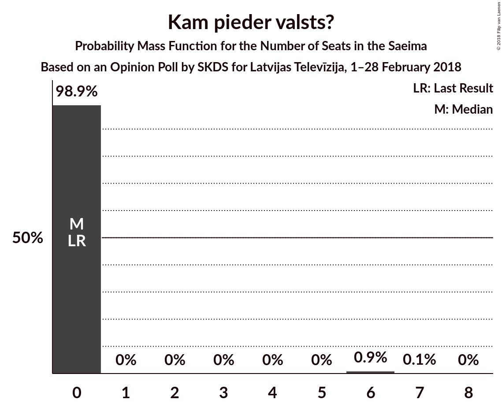

# Opinion Poll by SKDS for Latvijas Televīzija, 1–28 February 2018

<a href="#voting-intentions">Voting Intentions</a> | <a href="#seats">Seats</a> | <a href="#coalitions">Coalitions</a> | <a href="#technical-information">Technical Information</a>

## Voting Intentions

### Confidence Intervals

| Party | Last Result | Poll Result | 80% Confidence Interval | 90% Confidence Interval | 95% Confidence Interval | 99% Confidence Interval |
|:-----:|:-----------:|:-----------:|:-----------------------:|:-----------------------:|:-----------------------:|:-----------------------:|
| Sociāldemokrātiskā Partija “Saskaņa” | 23.0% | 34.2% | 31.9–36.8% |31.2–37.5% |30.6–38.1% |29.5–39.3% |
| Zaļo un Zemnieku savienība | 19.5% | 23.4% | 21.3–25.7% |20.8–26.4% |20.3–26.9% |19.3–28.0% |
| Nacionālā apvienība „Visu Latvijai!”–„Tēvzemei un Brīvībai/LNNK” | 16.6% | 12.6% | 11.0–14.5% |10.6–15.0% |10.2–15.5% |9.5–16.4% |
| Vienotība | 21.9% | 7.4% | 6.2–9.0% |5.9–9.4% |5.6–9.8% |5.1–10.6% |
| Jaunā konservatīvā partija | 0.7% | 6.6% | 5.5–8.1% |5.2–8.5% |4.9–8.9% |4.4–9.6% |
| Latvijas Reģionu apvienība | 6.7% | 3.4% | 2.6–4.5% |2.4–4.8% |2.2–5.1% |1.9–5.7% |
| Kam pieder valsts? | 0.0% | 3.1% | 2.3–4.2% |2.1–4.5% |2.0–4.8% |1.7–5.3% |

*Note:* The poll result column reflects the actual value used in the calculations. Published results may vary slightly, and in addition be rounded to fewer digits.

## Seats

### Confidence Intervals

| Party | Last Result | Median | 80% Confidence Interval | 90% Confidence Interval | 95% Confidence Interval | 99% Confidence Interval |
|:-----:|:-----------:|:------:|:-----------------------:|:-----------------------:|:-----------------------:|:-----------------------:|
| <a href="#sociāldemokrātiskā-partija-“saskaņa”">Sociāldemokrātiskā Partija “Saskaņa”</a> | 24 | 39 | 37–41 |37–42 |36–43 |34–46 |
| <a href="#zaļo-un-zemnieku-savienība">Zaļo un Zemnieku savienība</a> | 21 | 29 | 26–31 |25–32 |25–32 |24–34 |
| <a href="#nacionālā-apvienība-„visu-latvijai!”–„tēvzemei-un-brīvībai/lnnk”">Nacionālā apvienība „Visu Latvijai!”–„Tēvzemei un Brīvībai/LNNK”</a> | 17 | 15 | 14–18 |13–18 |12–19 |11–20 |
| <a href="#vienotība">Vienotība</a> | 23 | 9 | 8–11 |7–11 |7–11 |7–12 |
| <a href="#jaunā-konservatīvā-partija">Jaunā konservatīvā partija</a> | 0 | 8 | 7–9 |7–10 |0–11 |0–11 |
| <a href="#latvijas-reģionu-apvienība">Latvijas Reģionu apvienība</a> | 8 | 0 | 0 |0 |0–6 |0–6 |
| <a href="#kam-pieder-valsts?">Kam pieder valsts?</a> | 0 | 0 | 0 |0 |0 |0–6 |

### Sociāldemokrātiskā Partija “Saskaņa”

*For a full overview of the results for this party, see the [Sociāldemokrātiskā Partija “Saskaņa”](party-sociāldemokrātiskāpartija“saskaņa”.html) page.*

| Number of Seats | Probability | Accumulated | Special Marks |
|:---------------:|:-----------:|:-----------:|:-------------:|
| 24 | 0% | 100% | Last Result |
| 25 | 0% | 100% |  |
| 26 | 0% | 100% |  |
| 27 | 0% | 100% |  |
| 28 | 0% | 100% |  |
| 29 | 0% | 100% |  |
| 30 | 0% | 100% |  |
| 31 | 0% | 100% |  |
| 32 | 0% | 100% |  |
| 33 | 0.2% | 100% |  |
| 34 | 0.9% | 99.8% |  |
| 35 | 1.1% | 98.8% |  |
| 36 | 2% | 98% |  |
| 37 | 12% | 96% |  |
| 38 | 26% | 84% |  |
| 39 | 24% | 58% | Median |
| 40 | 15% | 34% |  |
| 41 | 13% | 19% |  |
| 42 | 3% | 6% |  |
| 43 | 1.4% | 3% |  |
| 44 | 0.6% | 1.5% |  |
| 45 | 0.4% | 0.9% |  |
| 46 | 0.3% | 0.5% |  |
| 47 | 0.2% | 0.2% |  |
| 48 | 0% | 0% |  |

### Zaļo un Zemnieku savienība

*For a full overview of the results for this party, see the [Zaļo un Zemnieku savienība](party-zaļounzemniekusavienība.html) page.*

| Number of Seats | Probability | Accumulated | Special Marks |
|:---------------:|:-----------:|:-----------:|:-------------:|
| 21 | 0% | 100% | Last Result |
| 22 | 0% | 100% |  |
| 23 | 0.1% | 100% |  |
| 24 | 1.0% | 99.9% |  |
| 25 | 6% | 98.9% |  |
| 26 | 9% | 93% |  |
| 27 | 8% | 84% |  |
| 28 | 20% | 76% |  |
| 29 | 22% | 55% | Median |
| 30 | 15% | 33% |  |
| 31 | 10% | 19% |  |
| 32 | 7% | 8% |  |
| 33 | 0.9% | 1.4% |  |
| 34 | 0.4% | 0.6% |  |
| 35 | 0.1% | 0.2% |  |
| 36 | 0% | 0.1% |  |
| 37 | 0% | 0% |  |

### Nacionālā apvienība „Visu Latvijai!”–„Tēvzemei un Brīvībai/LNNK”

*For a full overview of the results for this party, see the [Nacionālā apvienība „Visu Latvijai!”–„Tēvzemei un Brīvībai/LNNK”](party-nacionālāapvienība„visulatvijai”–„tēvzemeiunbrīvībailnnk”.html) page.*

| Number of Seats | Probability | Accumulated | Special Marks |
|:---------------:|:-----------:|:-----------:|:-------------:|
| 10 | 0.1% | 100% |  |
| 11 | 2% | 99.9% |  |
| 12 | 2% | 98% |  |
| 13 | 2% | 96% |  |
| 14 | 27% | 93% |  |
| 15 | 19% | 66% | Median |
| 16 | 14% | 47% |  |
| 17 | 21% | 33% | Last Result |
| 18 | 9% | 12% |  |
| 19 | 2% | 3% |  |
| 20 | 0.9% | 1.0% |  |
| 21 | 0.1% | 0.1% |  |
| 22 | 0% | 0% |  |

### Vienotība

*For a full overview of the results for this party, see the [Vienotība](party-vienotība.html) page.*

| Number of Seats | Probability | Accumulated | Special Marks |
|:---------------:|:-----------:|:-----------:|:-------------:|
| 0 | 0.5% | 100% |  |
| 1 | 0% | 99.5% |  |
| 2 | 0% | 99.5% |  |
| 3 | 0% | 99.5% |  |
| 4 | 0% | 99.5% |  |
| 5 | 0% | 99.5% |  |
| 6 | 0% | 99.5% |  |
| 7 | 8% | 99.5% |  |
| 8 | 38% | 92% |  |
| 9 | 26% | 53% | Median |
| 10 | 14% | 28% |  |
| 11 | 12% | 13% |  |
| 12 | 0.9% | 1.2% |  |
| 13 | 0.2% | 0.3% |  |
| 14 | 0.1% | 0.1% |  |
| 15 | 0% | 0% |  |
| 16 | 0% | 0% |  |
| 17 | 0% | 0% |  |
| 18 | 0% | 0% |  |
| 19 | 0% | 0% |  |
| 20 | 0% | 0% |  |
| 21 | 0% | 0% |  |
| 22 | 0% | 0% |  |
| 23 | 0% | 0% | Last Result |

### Jaunā konservatīvā partija

*For a full overview of the results for this party, see the [Jaunā konservatīvā partija](party-jaunākonservatīvāpartija.html) page.*

| Number of Seats | Probability | Accumulated | Special Marks |
|:---------------:|:-----------:|:-----------:|:-------------:|
| 0 | 4% | 100% | Last Result |
| 1 | 0% | 96% |  |
| 2 | 0% | 96% |  |
| 3 | 0% | 96% |  |
| 4 | 0% | 96% |  |
| 5 | 0% | 96% |  |
| 6 | 0% | 96% |  |
| 7 | 27% | 96% |  |
| 8 | 50% | 70% | Median |
| 9 | 13% | 20% |  |
| 10 | 5% | 7% |  |
| 11 | 3% | 3% |  |
| 12 | 0% | 0.1% |  |
| 13 | 0% | 0% |  |

### Latvijas Reģionu apvienība

*For a full overview of the results for this party, see the [Latvijas Reģionu apvienība](party-latvijasreģionuapvienība.html) page.*

| Number of Seats | Probability | Accumulated | Special Marks |
|:---------------:|:-----------:|:-----------:|:-------------:|
| 0 | 97% | 100% | Median |
| 1 | 0% | 3% |  |
| 2 | 0% | 3% |  |
| 3 | 0% | 3% |  |
| 4 | 0% | 3% |  |
| 5 | 0% | 3% |  |
| 6 | 3% | 3% |  |
| 7 | 0.3% | 0.4% |  |
| 8 | 0.1% | 0.1% | Last Result |
| 9 | 0% | 0% |  |

### Kam pieder valsts?

*For a full overview of the results for this party, see the [Kam pieder valsts?](party-kampiedervalsts.html) page.*

| Number of Seats | Probability | Accumulated | Special Marks |
|:---------------:|:-----------:|:-----------:|:-------------:|
| 0 | 98.9% | 100% | Last Result, Median |
| 1 | 0% | 1.1% |  |
| 2 | 0% | 1.1% |  |
| 3 | 0% | 1.1% |  |
| 4 | 0% | 1.1% |  |
| 5 | 0% | 1.1% |  |
| 6 | 0.9% | 1.1% |  |
| 7 | 0.1% | 0.1% |  |
| 8 | 0% | 0% |  |

## Coalitions

### Confidence Intervals

| Coalition | Last Result | Median | Majority? | 80% Confidence Interval | 90% Confidence Interval | 95% Confidence Interval | 99% Confidence Interval |
|:---------:|:-----------:|:------:|:---------:|:-----------------------:|:-----------------------:|:-----------------------:|:-----------------------:|
| Zaļo un Zemnieku savienība – Nacionālā apvienība „Visu Latvijai!”–„Tēvzemei un Brīvībai/LNNK” – Vienotība – Jaunā konservatīvā partija | 61 | 61 | 100% | 59–63 | 57–63 | 56–64 | 54–66 |
| Zaļo un Zemnieku savienība – Nacionālā apvienība „Visu Latvijai!”–„Tēvzemei un Brīvībai/LNNK” – Vienotība | 61 | 53 | 91% | 51–55 | 49–56 | 48–58 | 47–59 |
| Zaļo un Zemnieku savienība – Nacionālā apvienība „Visu Latvijai!”–„Tēvzemei un Brīvībai/LNNK” – Jaunā konservatīvā partija | 38 | 52 | 79% | 49–54 | 48–55 | 47–55 | 45–57 |

### Zaļo un Zemnieku savienība – Nacionālā apvienība „Visu Latvijai!”–„Tēvzemei un Brīvībai/LNNK” – Vienotība – Jaunā konservatīvā partija

| Number of Seats | Probability | Accumulated | Special Marks |
|:---------------:|:-----------:|:-----------:|:-------------:|
| 52 | 0.1% | 100% |  |
| 53 | 0.2% | 99.9% |  |
| 54 | 0.5% | 99.7% |  |
| 55 | 1.0% | 99.2% |  |
| 56 | 2% | 98% |  |
| 57 | 2% | 96% |  |
| 58 | 4% | 94% |  |
| 59 | 13% | 90% |  |
| 60 | 15% | 77% |  |
| 61 | 24% | 62% | Last Result, Median |
| 62 | 24% | 39% |  |
| 63 | 11% | 14% |  |
| 64 | 2% | 3% |  |
| 65 | 0.9% | 2% |  |
| 66 | 0.7% | 0.7% |  |
| 67 | 0.1% | 0.1% |  |
| 68 | 0% | 0% |  |

### Zaļo un Zemnieku savienība – Nacionālā apvienība „Visu Latvijai!”–„Tēvzemei un Brīvībai/LNNK” – Vienotība

| Number of Seats | Probability | Accumulated | Special Marks |
|:---------------:|:-----------:|:-----------:|:-------------:|
| 45 | 0.1% | 100% |  |
| 46 | 0.2% | 99.9% |  |
| 47 | 0.6% | 99.7% |  |
| 48 | 2% | 99.0% |  |
| 49 | 3% | 97% |  |
| 50 | 3% | 94% |  |
| 51 | 10% | 91% | Majority |
| 52 | 21% | 81% |  |
| 53 | 18% | 60% | Median |
| 54 | 21% | 42% |  |
| 55 | 12% | 20% |  |
| 56 | 4% | 8% |  |
| 57 | 1.4% | 4% |  |
| 58 | 1.4% | 3% |  |
| 59 | 0.9% | 1.3% |  |
| 60 | 0.2% | 0.4% |  |
| 61 | 0.2% | 0.2% | Last Result |
| 62 | 0% | 0% |  |

### Zaļo un Zemnieku savienība – Nacionālā apvienība „Visu Latvijai!”–„Tēvzemei un Brīvībai/LNNK” – Jaunā konservatīvā partija

| Number of Seats | Probability | Accumulated | Special Marks |
|:---------------:|:-----------:|:-----------:|:-------------:|
| 38 | 0% | 100% | Last Result |
| 39 | 0% | 100% |  |
| 40 | 0% | 100% |  |
| 41 | 0% | 100% |  |
| 42 | 0% | 100% |  |
| 43 | 0.1% | 99.9% |  |
| 44 | 0.2% | 99.8% |  |
| 45 | 0.5% | 99.7% |  |
| 46 | 0.7% | 99.1% |  |
| 47 | 2% | 98% |  |
| 48 | 3% | 97% |  |
| 49 | 5% | 93% |  |
| 50 | 10% | 89% |  |
| 51 | 18% | 79% | Majority |
| 52 | 15% | 61% | Median |
| 53 | 26% | 46% |  |
| 54 | 14% | 20% |  |
| 55 | 4% | 6% |  |
| 56 | 1.4% | 2% |  |
| 57 | 0.3% | 0.7% |  |
| 58 | 0.2% | 0.4% |  |
| 59 | 0.1% | 0.2% |  |
| 60 | 0% | 0% |  |

## Technical Information

### Opinion Poll

+ **Polling firm:** SKDS
+ **Commissioner(s):** Latvijas Televīzija
+ **Fieldwork period:** 1–28 February 2018

### Calculations

+ **Sample size:** 619
+ **Simulations done:** 1,048,576
+ **Error estimate:** 1.05%

