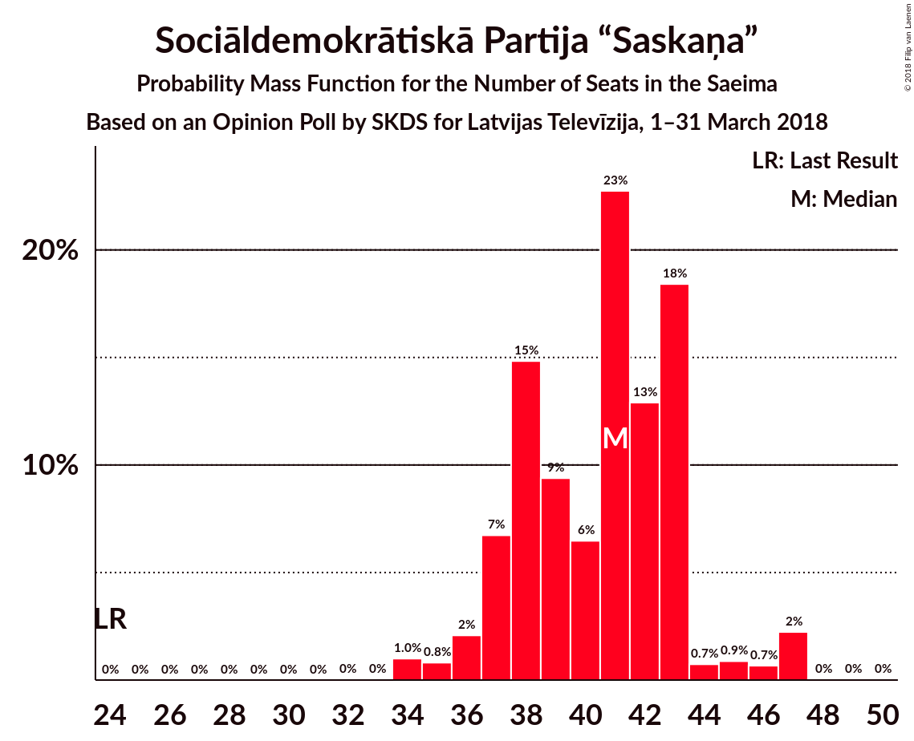
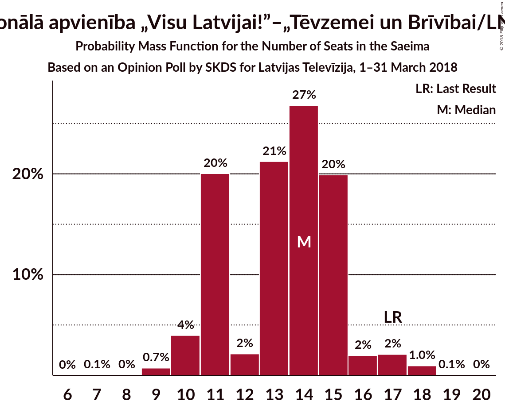

# Opinion Poll by SKDS for Latvijas Televīzija, 1–31 March 2018

<a href="#voting-intentions">Voting Intentions</a> | <a href="#seats">Seats</a> | <a href="#coalitions">Coalitions</a> | <a href="#technical-information">Technical Information</a>

## Voting Intentions

### Confidence Intervals

| Party | Last Result | Poll Result | 80% Confidence Interval | 90% Confidence Interval | 95% Confidence Interval | 99% Confidence Interval |
|:-----:|:-----------:|:-----------:|:-----------------------:|:-----------------------:|:-----------------------:|:-----------------------:|
| Sociāldemokrātiskā Partija “Saskaņa” | 23.0% | 35.7% | 33.2–38.4% |32.5–39.1% |31.9–39.8% |30.7–41.0% |
| Zaļo un Zemnieku savienība | 19.5% | 24.3% | 22.1–26.8% |21.5–27.4% |21.0–28.0% |20.0–29.2% |
| Nacionālā apvienība „Visu Latvijai!”–„Tēvzemei un Brīvībai/LNNK” | 16.6% | 11.0% | 9.5–12.9% |9.1–13.4% |8.7–13.9% |8.0–14.8% |
| Vienotība | 21.9% | 8.6% | 7.2–10.3% |6.9–10.7% |6.6–11.2% |6.0–12.0% |
| Jaunā konservatīvā partija | 0.7% | 6.3% | 5.2–7.8% |4.8–8.2% |4.6–8.6% |4.1–9.4% |
| Kam pieder valsts? | 0.0% | 3.3% | 2.5–4.5% |2.3–4.8% |2.1–5.2% |1.8–5.8% |
| Latvijas Reģionu apvienība | 6.7% | 2.8% | 2.1–3.9% |1.9–4.2% |1.7–4.5% |1.4–5.1% |
| Kustība Par! | 0.0% | 2.1% | 1.5–3.1% |1.3–3.4% |1.2–3.6% |1.0–4.2% |
| Latvijas Krievu savienība | 1.6% | 1.8% | 1.2–2.7% |1.1–3.0% |1.0–3.2% |0.7–3.7% |
| No sirds Latvijai | 6.8% | 1.6% | 1.1–2.5% |0.9–2.7% |0.8–3.0% |0.6–3.5% |
| Latvijas attīstībai | 0.9% | 1.2% | 0.8–2.1% |0.7–2.3% |0.6–2.5% |0.4–3.0% |
| Vienoti Latvijai | 1.2% | 0.5% | 0.3–1.2% |0.2–1.4% |0.2–1.5% |0.1–1.9% |

*Note:* The poll result column reflects the actual value used in the calculations. Published results may vary slightly, and in addition be rounded to fewer digits.

## Seats

### Confidence Intervals

| Party | Last Result | Median | 80% Confidence Interval | 90% Confidence Interval | 95% Confidence Interval | 99% Confidence Interval |
|:-----:|:-----------:|:------:|:-----------------------:|:-----------------------:|:-----------------------:|:-----------------------:|
| <a href="#sociāldemokrātiskā-partija-“saskaņa”">Sociāldemokrātiskā Partija “Saskaņa”</a> | 24 | 35 | 33–38 |33–38 |32–40 |29–40 |
| <a href="#zaļo-un-zemnieku-savienība">Zaļo un Zemnieku savienība</a> | 21 | 27 | 24–29 |24–29 |24–30 |22–31 |
| <a href="#nacionālā-apvienība-„visu-latvijai!”–„tēvzemei-un-brīvībai/lnnk”">Nacionālā apvienība „Visu Latvijai!”–„Tēvzemei un Brīvībai/LNNK”</a> | 17 | 11 | 10–13 |9–14 |8–15 |7–17 |
| <a href="#vienotība">Vienotība</a> | 23 | 10 | 7–10 |7–11 |7–12 |7–13 |
| <a href="#jaunā-konservatīvā-partija">Jaunā konservatīvā partija</a> | 0 | 7 | 6–8 |6–8 |6–9 |4–9 |
| <a href="#kam-pieder-valsts?">Kam pieder valsts?</a> | 0 | 2 | 2–5 |2–6 |2–6 |2–6 |
| <a href="#latvijas-reģionu-apvienība">Latvijas Reģionu apvienība</a> | 8 | 2 | 2 |1–3 |1–4 |0–6 |
| <a href="#kustība-par!">Kustība Par!</a> | 0 | 2 | 1–3 |0–3 |0–3 |0–4 |
| <a href="#latvijas-krievu-savienība">Latvijas Krievu savienība</a> | 0 | 2 | 1–2 |0–2 |0–3 |0–5 |
| <a href="#no-sirds-latvijai">No sirds Latvijai</a> | 7 | 2 | 0–2 |0–2 |0–2 |0–4 |
| <a href="#latvijas-attīstībai">Latvijas attīstībai</a> | 0 | 1 | 0–1 |0–1 |0–2 |0–3 |
| <a href="#vienoti-latvijai">Vienoti Latvijai</a> | 0 | 0 | 0 |0 |0 |0–2 |

### Sociāldemokrātiskā Partija “Saskaņa”

*For a full overview of the results for this party, see the [Sociāldemokrātiskā Partija “Saskaņa”](party-sociāldemokrātiskāpartija“saskaņa”.html) page.*

| Number of Seats | Probability | Accumulated | Special Marks |
|:---------------:|:-----------:|:-----------:|:-------------:|
| 24 | 0% | 100% | Last Result |
| 25 | 0% | 100% |  |
| 26 | 0% | 100% |  |
| 27 | 0% | 100% |  |
| 28 | 0% | 100% |  |
| 29 | 0.9% | 100% |  |
| 30 | 0.1% | 99.0% |  |
| 31 | 0.5% | 98.9% |  |
| 32 | 1.5% | 98% |  |
| 33 | 15% | 97% |  |
| 34 | 11% | 82% |  |
| 35 | 23% | 71% | Median |
| 36 | 12% | 49% |  |
| 37 | 23% | 37% |  |
| 38 | 10% | 14% |  |
| 39 | 0.6% | 4% |  |
| 40 | 3% | 3% |  |
| 41 | 0.1% | 0.2% |  |
| 42 | 0% | 0.1% |  |
| 43 | 0% | 0% |  |

### Zaļo un Zemnieku savienība

*For a full overview of the results for this party, see the [Zaļo un Zemnieku savienība](party-zaļounzemniekusavienība.html) page.*

| Number of Seats | Probability | Accumulated | Special Marks |
|:---------------:|:-----------:|:-----------:|:-------------:|
| 21 | 0.2% | 100% | Last Result |
| 22 | 0.5% | 99.8% |  |
| 23 | 1.0% | 99.3% |  |
| 24 | 35% | 98% |  |
| 25 | 6% | 63% |  |
| 26 | 6% | 58% |  |
| 27 | 17% | 52% | Median |
| 28 | 21% | 35% |  |
| 29 | 9% | 13% |  |
| 30 | 2% | 5% |  |
| 31 | 2% | 2% |  |
| 32 | 0.5% | 0.5% |  |
| 33 | 0% | 0% |  |

### Nacionālā apvienība „Visu Latvijai!”–„Tēvzemei un Brīvībai/LNNK”

*For a full overview of the results for this party, see the [Nacionālā apvienība „Visu Latvijai!”–„Tēvzemei un Brīvībai/LNNK”](party-nacionālāapvienība„visulatvijai”–„tēvzemeiunbrīvībailnnk”.html) page.*

| Number of Seats | Probability | Accumulated | Special Marks |
|:---------------:|:-----------:|:-----------:|:-------------:|
| 7 | 0.5% | 100% |  |
| 8 | 3% | 99.4% |  |
| 9 | 3% | 96% |  |
| 10 | 7% | 94% |  |
| 11 | 39% | 86% | Median |
| 12 | 17% | 47% |  |
| 13 | 23% | 30% |  |
| 14 | 4% | 7% |  |
| 15 | 2% | 3% |  |
| 16 | 0.1% | 0.9% |  |
| 17 | 0.8% | 0.8% | Last Result |
| 18 | 0% | 0% |  |

### Vienotība

*For a full overview of the results for this party, see the [Vienotība](party-vienotība.html) page.*

| Number of Seats | Probability | Accumulated | Special Marks |
|:---------------:|:-----------:|:-----------:|:-------------:|
| 7 | 25% | 100% |  |
| 8 | 9% | 75% |  |
| 9 | 10% | 66% |  |
| 10 | 48% | 57% | Median |
| 11 | 5% | 8% |  |
| 12 | 2% | 3% |  |
| 13 | 1.1% | 1.1% |  |
| 14 | 0% | 0% |  |
| 15 | 0% | 0% |  |
| 16 | 0% | 0% |  |
| 17 | 0% | 0% |  |
| 18 | 0% | 0% |  |
| 19 | 0% | 0% |  |
| 20 | 0% | 0% |  |
| 21 | 0% | 0% |  |
| 22 | 0% | 0% |  |
| 23 | 0% | 0% | Last Result |

### Jaunā konservatīvā partija

*For a full overview of the results for this party, see the [Jaunā konservatīvā partija](party-jaunākonservatīvāpartija.html) page.*

| Number of Seats | Probability | Accumulated | Special Marks |
|:---------------:|:-----------:|:-----------:|:-------------:|
| 0 | 0% | 100% | Last Result |
| 1 | 0% | 100% |  |
| 2 | 0% | 100% |  |
| 3 | 0.1% | 100% |  |
| 4 | 0.5% | 99.9% |  |
| 5 | 0.3% | 99.4% |  |
| 6 | 44% | 99.1% |  |
| 7 | 39% | 55% | Median |
| 8 | 12% | 17% |  |
| 9 | 4% | 5% |  |
| 10 | 0.3% | 0.3% |  |
| 11 | 0% | 0% |  |

### Kam pieder valsts?

*For a full overview of the results for this party, see the [Kam pieder valsts?](party-kampiedervalsts.html) page.*

| Number of Seats | Probability | Accumulated | Special Marks |
|:---------------:|:-----------:|:-----------:|:-------------:|
| 0 | 0.1% | 100% | Last Result |
| 1 | 0% | 99.9% |  |
| 2 | 59% | 99.9% | Median |
| 3 | 19% | 41% |  |
| 4 | 2% | 22% |  |
| 5 | 12% | 19% |  |
| 6 | 8% | 8% |  |
| 7 | 0.1% | 0.1% |  |
| 8 | 0% | 0% |  |

### Latvijas Reģionu apvienība

*For a full overview of the results for this party, see the [Latvijas Reģionu apvienība](party-latvijasreģionuapvienība.html) page.*

| Number of Seats | Probability | Accumulated | Special Marks |
|:---------------:|:-----------:|:-----------:|:-------------:|
| 0 | 1.3% | 100% |  |
| 1 | 6% | 98.7% |  |
| 2 | 86% | 92% | Median |
| 3 | 3% | 7% |  |
| 4 | 2% | 4% |  |
| 5 | 1.1% | 2% |  |
| 6 | 0.9% | 0.9% |  |
| 7 | 0% | 0% |  |
| 8 | 0% | 0% | Last Result |

### Kustība Par!

*For a full overview of the results for this party, see the [Kustība Par!](party-kustībapar.html) page.*

| Number of Seats | Probability | Accumulated | Special Marks |
|:---------------:|:-----------:|:-----------:|:-------------:|
| 0 | 7% | 100% | Last Result |
| 1 | 8% | 93% |  |
| 2 | 63% | 85% | Median |
| 3 | 20% | 23% |  |
| 4 | 2% | 2% |  |
| 5 | 0.2% | 0.3% |  |
| 6 | 0% | 0.1% |  |
| 7 | 0.1% | 0.1% |  |
| 8 | 0% | 0% |  |

### Latvijas Krievu savienība

*For a full overview of the results for this party, see the [Latvijas Krievu savienība](party-latvijaskrievusavienība.html) page.*

| Number of Seats | Probability | Accumulated | Special Marks |
|:---------------:|:-----------:|:-----------:|:-------------:|
| 0 | 5% | 100% | Last Result |
| 1 | 33% | 95% |  |
| 2 | 59% | 61% | Median |
| 3 | 1.1% | 3% |  |
| 4 | 0.2% | 2% |  |
| 5 | 1.5% | 1.5% |  |
| 6 | 0% | 0% |  |

### No sirds Latvijai

*For a full overview of the results for this party, see the [No sirds Latvijai](party-nosirdslatvijai.html) page.*

| Number of Seats | Probability | Accumulated | Special Marks |
|:---------------:|:-----------:|:-----------:|:-------------:|
| 0 | 24% | 100% |  |
| 1 | 18% | 76% |  |
| 2 | 56% | 58% | Median |
| 3 | 0.6% | 2% |  |
| 4 | 1.2% | 2% |  |
| 5 | 0.3% | 0.3% |  |
| 6 | 0% | 0% |  |
| 7 | 0% | 0% | Last Result |

### Latvijas attīstībai

*For a full overview of the results for this party, see the [Latvijas attīstībai](party-latvijasattīstībai.html) page.*

| Number of Seats | Probability | Accumulated | Special Marks |
|:---------------:|:-----------:|:-----------:|:-------------:|
| 0 | 37% | 100% | Last Result |
| 1 | 59% | 63% | Median |
| 2 | 2% | 4% |  |
| 3 | 2% | 2% |  |
| 4 | 0% | 0% |  |

### Vienoti Latvijai

*For a full overview of the results for this party, see the [Vienoti Latvijai](party-vienotilatvijai.html) page.*

| Number of Seats | Probability | Accumulated | Special Marks |
|:---------------:|:-----------:|:-----------:|:-------------:|
| 0 | 98% | 100% | Last Result, Median |
| 1 | 0.7% | 2% |  |
| 2 | 0.8% | 0.8% |  |
| 3 | 0% | 0% |  |

## Coalitions

## Technical Information

### Opinion Poll

+ **Polling firm:** SKDS
+ **Commissioner(s):** Latvijas Televīzija
+ **Fieldwork period:** 1–31 March 2018

### Calculations

+ **Sample size:** 571
+ **Simulations done:** 1,048,576
+ **Error estimate:** 3.29%

