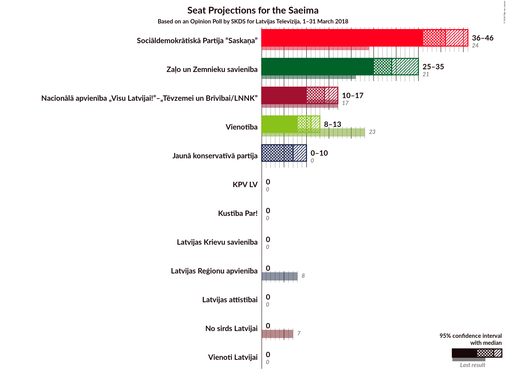
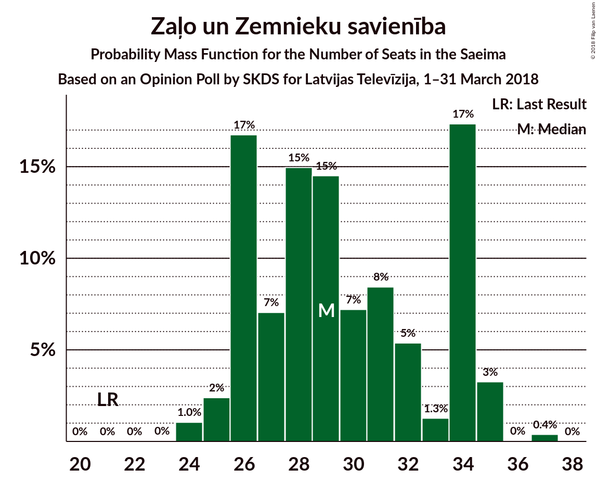
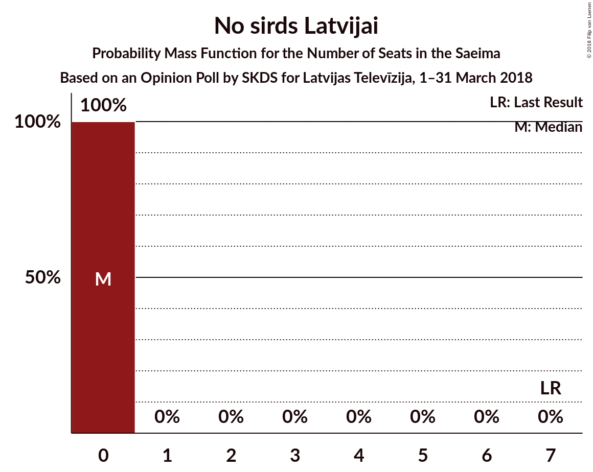

# Opinion Poll by SKDS for Latvijas Televīzija, 1–31 March 2018

<a href="#voting-intentions">Voting Intentions</a> | <a href="#seats">Seats</a> | <a href="#coalitions">Coalitions</a> | <a href="#technical-information">Technical Information</a>

## Voting Intentions

### Confidence Intervals

| Party | Last Result | Poll Result | 80% Confidence Interval | 90% Confidence Interval | 95% Confidence Interval | 99% Confidence Interval |
|:-----:|:-----------:|:-----------:|:-----------------------:|:-----------------------:|:-----------------------:|:-----------------------:|
| Sociāldemokrātiskā Partija “Saskaņa” | 23.0% | 35.7% | 33.2–38.4% |32.5–39.1% |31.9–39.8% |30.7–41.0% |
| Zaļo un Zemnieku savienība | 19.5% | 24.3% | 22.1–26.8% |21.5–27.4% |21.0–28.0% |20.0–29.2% |
| Nacionālā apvienība „Visu Latvijai!”–„Tēvzemei un Brīvībai/LNNK” | 16.6% | 11.0% | 9.5–12.9% |9.1–13.4% |8.7–13.9% |8.0–14.8% |
| Vienotība | 21.9% | 8.6% | 7.2–10.3% |6.9–10.7% |6.6–11.2% |6.0–12.0% |
| Jaunā konservatīvā partija | 0.7% | 6.3% | 5.2–7.8% |4.8–8.2% |4.6–8.6% |4.1–9.4% |
| Kam pieder valsts? | 0.0% | 3.3% | 2.5–4.5% |2.3–4.8% |2.1–5.2% |1.8–5.8% |
| Latvijas Reģionu apvienība | 6.7% | 2.8% | 2.1–3.9% |1.9–4.2% |1.7–4.5% |1.4–5.1% |
| Kustība Par! | 0.0% | 2.1% | 1.5–3.1% |1.3–3.4% |1.2–3.6% |1.0–4.2% |
| Latvijas Krievu savienība | 1.6% | 1.8% | 1.2–2.7% |1.1–3.0% |1.0–3.2% |0.7–3.7% |
| No sirds Latvijai | 6.8% | 1.6% | 1.1–2.5% |0.9–2.7% |0.8–3.0% |0.6–3.5% |
| Latvijas attīstībai | 0.9% | 1.2% | 0.8–2.1% |0.7–2.3% |0.6–2.5% |0.4–3.0% |
| Vienoti Latvijai | 1.2% | 0.5% | 0.3–1.2% |0.2–1.4% |0.2–1.5% |0.1–1.9% |

*Note:* The poll result column reflects the actual value used in the calculations. Published results may vary slightly, and in addition be rounded to fewer digits.

## Seats

### Confidence Intervals

| Party | Last Result | Median | 80% Confidence Interval | 90% Confidence Interval | 95% Confidence Interval | 99% Confidence Interval |
|:-----:|:-----------:|:------:|:-----------------------:|:-----------------------:|:-----------------------:|:-----------------------:|
| <a href="#sociāldemokrātiskā-partija-“saskaņa”">Sociāldemokrātiskā Partija “Saskaņa”</a> | 24 | 38 | 38–42 |36–43 |34–45 |34–46 |
| <a href="#zaļo-un-zemnieku-savienība">Zaļo un Zemnieku savienība</a> | 21 | 29 | 28–31 |26–33 |26–34 |25–34 |
| <a href="#nacionālā-apvienība-„visu-latvijai!”–„tēvzemei-un-brīvībai/lnnk”">Nacionālā apvienība „Visu Latvijai!”–„Tēvzemei un Brīvībai/LNNK”</a> | 17 | 14 | 11–15 |11–16 |10–16 |9–17 |
| <a href="#vienotība">Vienotība</a> | 23 | 11 | 8–11 |8–13 |7–14 |7–14 |
| <a href="#jaunā-konservatīvā-partija">Jaunā konservatīvā partija</a> | 0 | 8 | 7–8 |7–8 |0–9 |0–10 |
| <a href="#kam-pieder-valsts?">Kam pieder valsts?</a> | 0 | 0 | 0 |0 |0 |0–6 |
| <a href="#latvijas-reģionu-apvienība">Latvijas Reģionu apvienība</a> | 8 | 0 | 0 |0 |0 |0 |
| <a href="#kustība-par!">Kustība Par!</a> | 0 | 0 | 0 |0 |0 |0–7 |
| <a href="#latvijas-krievu-savienība">Latvijas Krievu savienība</a> | 0 | 0 | 0 |0 |0 |0 |
| <a href="#no-sirds-latvijai">No sirds Latvijai</a> | 7 | 0 | 0 |0 |0 |0 |
| <a href="#latvijas-attīstībai">Latvijas attīstībai</a> | 0 | 0 | 0 |0 |0 |0 |
| <a href="#vienoti-latvijai">Vienoti Latvijai</a> | 0 | 0 | 0 |0 |0 |0 |

### Sociāldemokrātiskā Partija “Saskaņa”

*For a full overview of the results for this party, see the [Sociāldemokrātiskā Partija “Saskaņa”](party-sociāldemokrātiskāpartija“saskaņa”.html) page.*

| Number of Seats | Probability | Accumulated | Special Marks |
|:---------------:|:-----------:|:-----------:|:-------------:|
| 24 | 0% | 100% | Last Result |
| 25 | 0% | 100% |  |
| 26 | 0% | 100% |  |
| 27 | 0% | 100% |  |
| 28 | 0% | 100% |  |
| 29 | 0% | 100% |  |
| 30 | 0% | 100% |  |
| 31 | 0% | 100% |  |
| 32 | 0% | 100% |  |
| 33 | 0% | 100% |  |
| 34 | 4% | 100% |  |
| 35 | 0.3% | 96% |  |
| 36 | 3% | 96% |  |
| 37 | 0.8% | 93% |  |
| 38 | 44% | 92% | Median |
| 39 | 3% | 49% |  |
| 40 | 3% | 45% |  |
| 41 | 8% | 42% |  |
| 42 | 27% | 34% |  |
| 43 | 3% | 8% |  |
| 44 | 2% | 5% |  |
| 45 | 0.4% | 3% |  |
| 46 | 2% | 2% |  |
| 47 | 0.2% | 0.3% |  |
| 48 | 0.1% | 0.1% |  |
| 49 | 0% | 0% |  |

### Zaļo un Zemnieku savienība

*For a full overview of the results for this party, see the [Zaļo un Zemnieku savienība](party-zaļounzemniekusavienība.html) page.*

| Number of Seats | Probability | Accumulated | Special Marks |
|:---------------:|:-----------:|:-----------:|:-------------:|
| 21 | 0% | 100% | Last Result |
| 22 | 0% | 100% |  |
| 23 | 0% | 100% |  |
| 24 | 0.2% | 100% |  |
| 25 | 0.6% | 99.8% |  |
| 26 | 5% | 99.1% |  |
| 27 | 1.5% | 94% |  |
| 28 | 31% | 92% |  |
| 29 | 44% | 61% | Median |
| 30 | 4% | 17% |  |
| 31 | 4% | 13% |  |
| 32 | 2% | 9% |  |
| 33 | 3% | 7% |  |
| 34 | 3% | 4% |  |
| 35 | 0.3% | 0.3% |  |
| 36 | 0% | 0% |  |

### Nacionālā apvienība „Visu Latvijai!”–„Tēvzemei un Brīvībai/LNNK”

*For a full overview of the results for this party, see the [Nacionālā apvienība „Visu Latvijai!”–„Tēvzemei un Brīvībai/LNNK”](party-nacionālāapvienība„visulatvijai”–„tēvzemeiunbrīvībailnnk”.html) page.*

| Number of Seats | Probability | Accumulated | Special Marks |
|:---------------:|:-----------:|:-----------:|:-------------:|
| 9 | 0.6% | 100% |  |
| 10 | 3% | 99.3% |  |
| 11 | 33% | 96% |  |
| 12 | 4% | 63% |  |
| 13 | 1.5% | 59% |  |
| 14 | 47% | 57% | Median |
| 15 | 3% | 10% |  |
| 16 | 5% | 7% |  |
| 17 | 1.1% | 1.5% | Last Result |
| 18 | 0.3% | 0.3% |  |
| 19 | 0.1% | 0.1% |  |
| 20 | 0% | 0% |  |

### Vienotība

*For a full overview of the results for this party, see the [Vienotība](party-vienotība.html) page.*

| Number of Seats | Probability | Accumulated | Special Marks |
|:---------------:|:-----------:|:-----------:|:-------------:|
| 7 | 4% | 100% |  |
| 8 | 7% | 96% |  |
| 9 | 4% | 89% |  |
| 10 | 0.8% | 84% |  |
| 11 | 77% | 83% | Median |
| 12 | 0.5% | 7% |  |
| 13 | 3% | 6% |  |
| 14 | 4% | 4% |  |
| 15 | 0% | 0% |  |
| 16 | 0% | 0% |  |
| 17 | 0% | 0% |  |
| 18 | 0% | 0% |  |
| 19 | 0% | 0% |  |
| 20 | 0% | 0% |  |
| 21 | 0% | 0% |  |
| 22 | 0% | 0% |  |
| 23 | 0% | 0% | Last Result |

### Jaunā konservatīvā partija

*For a full overview of the results for this party, see the [Jaunā konservatīvā partija](party-jaunākonservatīvāpartija.html) page.*

| Number of Seats | Probability | Accumulated | Special Marks |
|:---------------:|:-----------:|:-----------:|:-------------:|
| 0 | 3% | 100% | Last Result |
| 1 | 0% | 97% |  |
| 2 | 0% | 97% |  |
| 3 | 0% | 97% |  |
| 4 | 0% | 97% |  |
| 5 | 0% | 97% |  |
| 6 | 0% | 97% |  |
| 7 | 13% | 97% |  |
| 8 | 80% | 84% | Median |
| 9 | 1.0% | 3% |  |
| 10 | 2% | 2% |  |
| 11 | 0.1% | 0.1% |  |
| 12 | 0% | 0% |  |

### Kam pieder valsts?

*For a full overview of the results for this party, see the [Kam pieder valsts?](party-kampiedervalsts.html) page.*

| Number of Seats | Probability | Accumulated | Special Marks |
|:---------------:|:-----------:|:-----------:|:-------------:|
| 0 | 99.1% | 100% | Last Result, Median |
| 1 | 0% | 0.9% |  |
| 2 | 0% | 0.9% |  |
| 3 | 0% | 0.9% |  |
| 4 | 0% | 0.9% |  |
| 5 | 0% | 0.9% |  |
| 6 | 0.5% | 0.9% |  |
| 7 | 0.1% | 0.4% |  |
| 8 | 0.3% | 0.3% |  |
| 9 | 0% | 0% |  |

### Latvijas Reģionu apvienība

*For a full overview of the results for this party, see the [Latvijas Reģionu apvienība](party-latvijasreģionuapvienība.html) page.*

| Number of Seats | Probability | Accumulated | Special Marks |
|:---------------:|:-----------:|:-----------:|:-------------:|
| 0 | 99.8% | 100% | Median |
| 1 | 0% | 0.2% |  |
| 2 | 0% | 0.2% |  |
| 3 | 0% | 0.2% |  |
| 4 | 0% | 0.2% |  |
| 5 | 0% | 0.2% |  |
| 6 | 0.2% | 0.2% |  |
| 7 | 0% | 0% |  |
| 8 | 0% | 0% | Last Result |

### Kustība Par!

*For a full overview of the results for this party, see the [Kustība Par!](party-kustībapar.html) page.*

| Number of Seats | Probability | Accumulated | Special Marks |
|:---------------:|:-----------:|:-----------:|:-------------:|
| 0 | 99.4% | 100% | Last Result, Median |
| 1 | 0% | 0.6% |  |
| 2 | 0% | 0.6% |  |
| 3 | 0% | 0.6% |  |
| 4 | 0% | 0.6% |  |
| 5 | 0% | 0.6% |  |
| 6 | 0% | 0.6% |  |
| 7 | 0.6% | 0.6% |  |
| 8 | 0% | 0% |  |

### Latvijas Krievu savienība

*For a full overview of the results for this party, see the [Latvijas Krievu savienība](party-latvijaskrievusavienība.html) page.*

| Number of Seats | Probability | Accumulated | Special Marks |
|:---------------:|:-----------:|:-----------:|:-------------:|
| 0 | 100% | 100% | Last Result, Median |

### No sirds Latvijai

*For a full overview of the results for this party, see the [No sirds Latvijai](party-nosirdslatvijai.html) page.*

| Number of Seats | Probability | Accumulated | Special Marks |
|:---------------:|:-----------:|:-----------:|:-------------:|
| 0 | 100% | 100% | Median |
| 1 | 0% | 0% |  |
| 2 | 0% | 0% |  |
| 3 | 0% | 0% |  |
| 4 | 0% | 0% |  |
| 5 | 0% | 0% |  |
| 6 | 0% | 0% |  |
| 7 | 0% | 0% | Last Result |

### Latvijas attīstībai

*For a full overview of the results for this party, see the [Latvijas attīstībai](party-latvijasattīstībai.html) page.*

| Number of Seats | Probability | Accumulated | Special Marks |
|:---------------:|:-----------:|:-----------:|:-------------:|
| 0 | 100% | 100% | Last Result, Median |

### Vienoti Latvijai

*For a full overview of the results for this party, see the [Vienoti Latvijai](party-vienotilatvijai.html) page.*

| Number of Seats | Probability | Accumulated | Special Marks |
|:---------------:|:-----------:|:-----------:|:-------------:|
| 0 | 100% | 100% | Last Result, Median |

## Coalitions

### Confidence Intervals

| Coalition | Last Result | Median | Majority? | 80% Confidence Interval | 90% Confidence Interval | 95% Confidence Interval | 99% Confidence Interval |
|:---------:|:-----------:|:------:|:---------:|:-----------------------:|:-----------------------:|:-----------------------:|:-----------------------:|
| Zaļo un Zemnieku savienība – Nacionālā apvienība „Visu Latvijai!”–„Tēvzemei un Brīvībai/LNNK” – Vienotība | 61 | 54 | 67% | 50–54 | 48–57 | 47–58 | 46–60 |

### Zaļo un Zemnieku savienība – Nacionālā apvienība „Visu Latvijai!”–„Tēvzemei un Brīvībai/LNNK” – Vienotība

| Number of Seats | Probability | Accumulated | Special Marks |
|:---------------:|:-----------:|:-----------:|:-------------:|
| 45 | 0.1% | 100% |  |
| 46 | 2% | 99.9% |  |
| 47 | 2% | 98% |  |
| 48 | 0.7% | 95% |  |
| 49 | 0.3% | 95% |  |
| 50 | 27% | 94% |  |
| 51 | 0.9% | 67% | Majority |
| 52 | 10% | 66% |  |
| 53 | 3% | 56% |  |
| 54 | 43% | 53% | Median |
| 55 | 1.0% | 10% |  |
| 56 | 2% | 9% |  |
| 57 | 2% | 7% |  |
| 58 | 4% | 5% |  |
| 59 | 0.1% | 0.8% |  |
| 60 | 0.6% | 0.7% |  |
| 61 | 0.1% | 0.1% | Last Result |
| 62 | 0% | 0% |  |

## Technical Information

### Opinion Poll

+ **Polling firm:** SKDS
+ **Commissioner(s):** Latvijas Televīzija
+ **Fieldwork period:** 1–31 March 2018

### Calculations

+ **Sample size:** 571
+ **Simulations done:** 262,144
+ **Error estimate:** 2.99%

