# Opinion Poll by SKDS for Latvijas Televīzija, 1–30 April 2018

<a href="#voting-intentions">Voting Intentions</a> | <a href="#seats">Seats</a> | <a href="#coalitions">Coalitions</a> | <a href="#technical-information">Technical Information</a>

## Voting Intentions

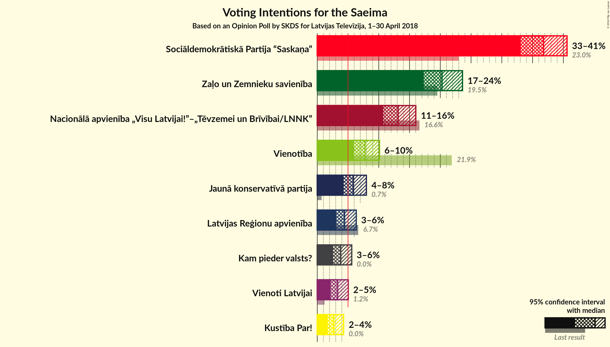

### Confidence Intervals

| Party | Last Result | Poll Result | 80% Confidence Interval | 90% Confidence Interval | 95% Confidence Interval | 99% Confidence Interval |
|:-----:|:-----------:|:-----------:|:-----------------------:|:-----------------------:|:-----------------------:|:-----------------------:|
| Sociāldemokrātiskā Partija “Saskaņa” | 23.0% | 36.8% | 34.4–39.3% |33.7–40.0% |33.1–40.6% |32.0–41.8% |
| Zaļo un Zemnieku savienība | 19.5% | 20.3% | 18.3–22.5% |17.8–23.1% |17.3–23.6% |16.4–24.7% |
| Nacionālā apvienība „Visu Latvijai!”–„Tēvzemei un Brīvībai/LNNK” | 16.6% | 13.2% | 11.6–15.0% |11.1–15.6% |10.7–16.0% |10.0–17.0% |
| Vienotība | 21.9% | 7.8% | 6.6–9.3% |6.2–9.7% |5.9–10.1% |5.4–10.9% |
| Jaunā konservatīvā partija | 0.7% | 5.9% | 4.8–7.2% |4.5–7.6% |4.3–8.0% |3.8–8.7% |
| Latvijas Reģionu apvienība | 6.7% | 4.4% | 3.6–5.7% |3.3–6.0% |3.1–6.3% |2.7–7.0% |
| KPV LV | 0.0% | 3.8% | 3.0–5.0% |2.8–5.3% |2.6–5.6% |2.2–6.2% |
| Vienoti Latvijai | 1.2% | 3.3% | 2.6–4.4% |2.4–4.8% |2.2–5.0% |1.9–5.6% |
| Kustība Par! | 0.0% | 2.7% | 2.0–3.7% |1.8–4.0% |1.7–4.3% |1.4–4.8% |

*Note:* The poll result column reflects the actual value used in the calculations. Published results may vary slightly, and in addition be rounded to fewer digits.

## Seats

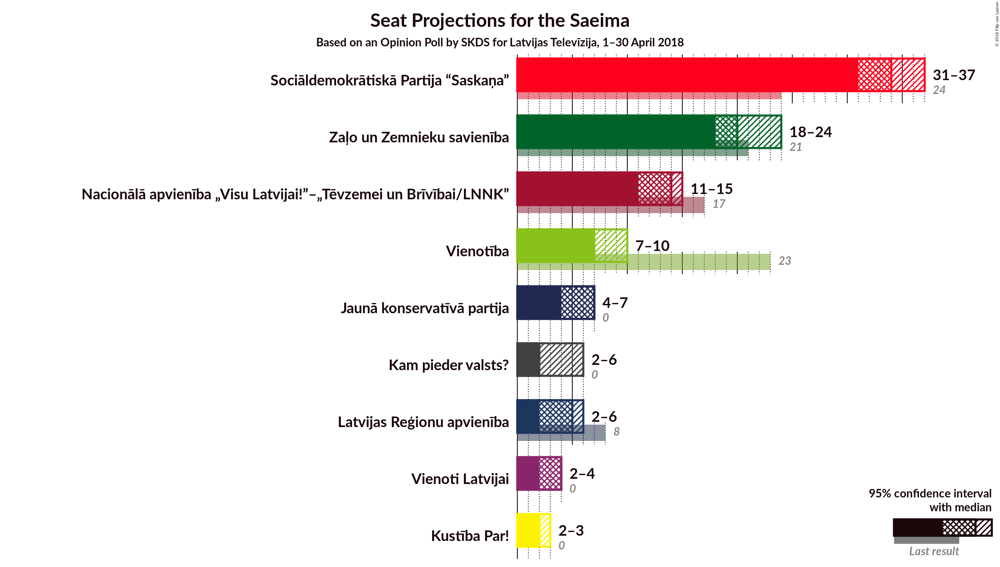

### Confidence Intervals

| Party | Last Result | Median | 80% Confidence Interval | 90% Confidence Interval | 95% Confidence Interval | 99% Confidence Interval |
|:-----:|:-----------:|:------:|:-----------------------:|:-----------------------:|:-----------------------:|:-----------------------:|
| <a href="#sociāldemokrātiskā-partija-“saskaņa”">Sociāldemokrātiskā Partija “Saskaņa”</a> | 24 | 41 | 38–45 |38–46 |37–46 |36–47 |
| <a href="#zaļo-un-zemnieku-savienība">Zaļo un Zemnieku savienība</a> | 21 | 25 | 23–28 |23–28 |22–29 |19–31 |
| <a href="#nacionālā-apvienība-„visu-latvijai!”–„tēvzemei-un-brīvībai/lnnk”">Nacionālā apvienība „Visu Latvijai!”–„Tēvzemei un Brīvībai/LNNK”</a> | 17 | 16 | 14–19 |13–19 |12–19 |11–20 |
| <a href="#vienotība">Vienotība</a> | 23 | 10 | 8–11 |8–11 |7–11 |7–13 |
| <a href="#jaunā-konservatīvā-partija">Jaunā konservatīvā partija</a> | 0 | 7 | 0–8 |0–8 |0–9 |0–10 |
| <a href="#latvijas-reģionu-apvienība">Latvijas Reģionu apvienība</a> | 8 | 0 | 0–6 |0–6 |0–7 |0–9 |
| <a href="#kpv-lv">KPV LV</a> | 0 | 0 | 0 |0 |0–6 |0–7 |
| <a href="#vienoti-latvijai">Vienoti Latvijai</a> | 0 | 0 | 0 |0 |0 |0–7 |
| <a href="#kustība-par!">Kustība Par!</a> | 0 | 0 | 0 |0 |0 |0 |

### Sociāldemokrātiskā Partija “Saskaņa”

*For a full overview of the results for this party, see the [Sociāldemokrātiskā Partija “Saskaņa”](party-sociāldemokrātiskāpartija“saskaņa”.html) page.*

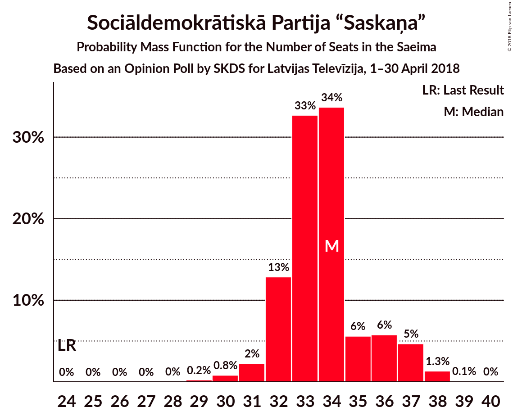

| Number of Seats | Probability | Accumulated | Special Marks |
|:---------------:|:-----------:|:-----------:|:-------------:|
| 24 | 0% | 100% | Last Result |
| 25 | 0% | 100% |  |
| 26 | 0% | 100% |  |
| 27 | 0% | 100% |  |
| 28 | 0% | 100% |  |
| 29 | 0% | 100% |  |
| 30 | 0% | 100% |  |
| 31 | 0% | 100% |  |
| 32 | 0% | 100% |  |
| 33 | 0% | 100% |  |
| 34 | 0.1% | 99.9% |  |
| 35 | 0.2% | 99.8% |  |
| 36 | 1.3% | 99.6% |  |
| 37 | 2% | 98% |  |
| 38 | 9% | 96% |  |
| 39 | 6% | 87% |  |
| 40 | 22% | 81% |  |
| 41 | 23% | 59% | Median |
| 42 | 9% | 36% |  |
| 43 | 11% | 27% |  |
| 44 | 4% | 16% |  |
| 45 | 5% | 12% |  |
| 46 | 5% | 7% |  |
| 47 | 2% | 2% |  |
| 48 | 0.1% | 0.3% |  |
| 49 | 0.1% | 0.1% |  |
| 50 | 0% | 0% |  |

### Zaļo un Zemnieku savienība

*For a full overview of the results for this party, see the [Zaļo un Zemnieku savienība](party-zaļounzemniekusavienība.html) page.*

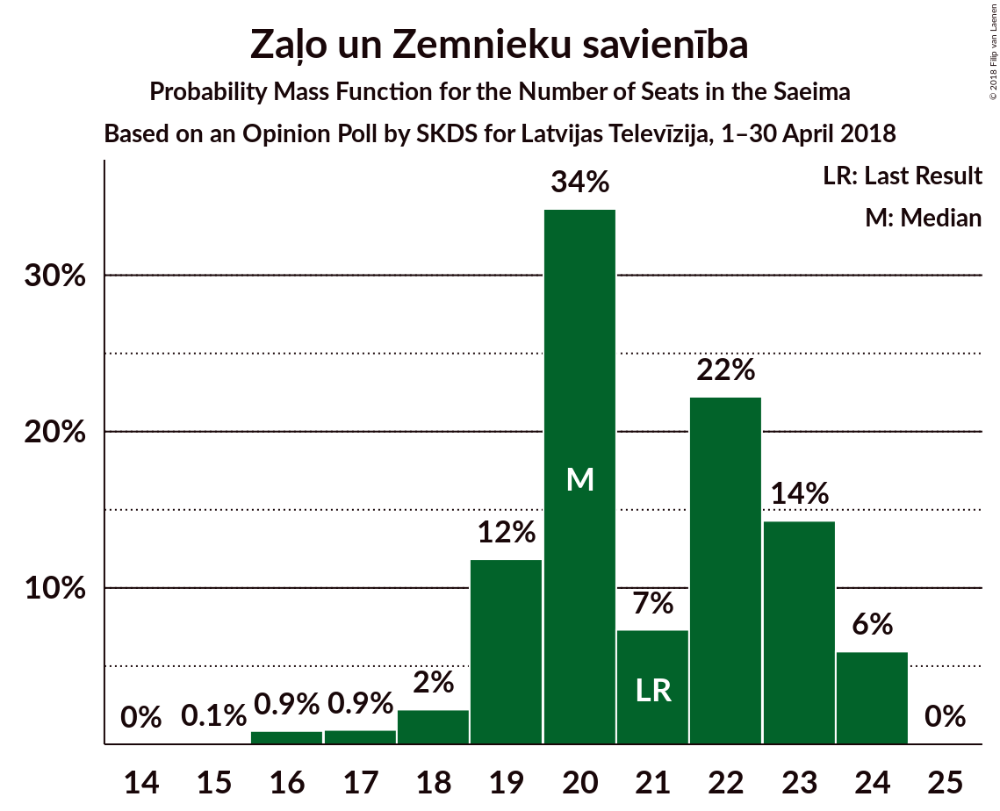

| Number of Seats | Probability | Accumulated | Special Marks |
|:---------------:|:-----------:|:-----------:|:-------------:|
| 19 | 0.6% | 100% |  |
| 20 | 0.8% | 99.3% |  |
| 21 | 0.8% | 98.5% | Last Result |
| 22 | 1.4% | 98% |  |
| 23 | 7% | 96% |  |
| 24 | 25% | 89% |  |
| 25 | 27% | 64% | Median |
| 26 | 9% | 37% |  |
| 27 | 15% | 28% |  |
| 28 | 10% | 13% |  |
| 29 | 2% | 3% |  |
| 30 | 0.5% | 1.1% |  |
| 31 | 0.2% | 0.6% |  |
| 32 | 0.3% | 0.4% |  |
| 33 | 0% | 0.1% |  |
| 34 | 0% | 0% |  |

### Nacionālā apvienība „Visu Latvijai!”–„Tēvzemei un Brīvībai/LNNK”

*For a full overview of the results for this party, see the [Nacionālā apvienība „Visu Latvijai!”–„Tēvzemei un Brīvībai/LNNK”](party-nacionālāapvienība„visulatvijai”–„tēvzemeiunbrīvībailnnk”.html) page.*

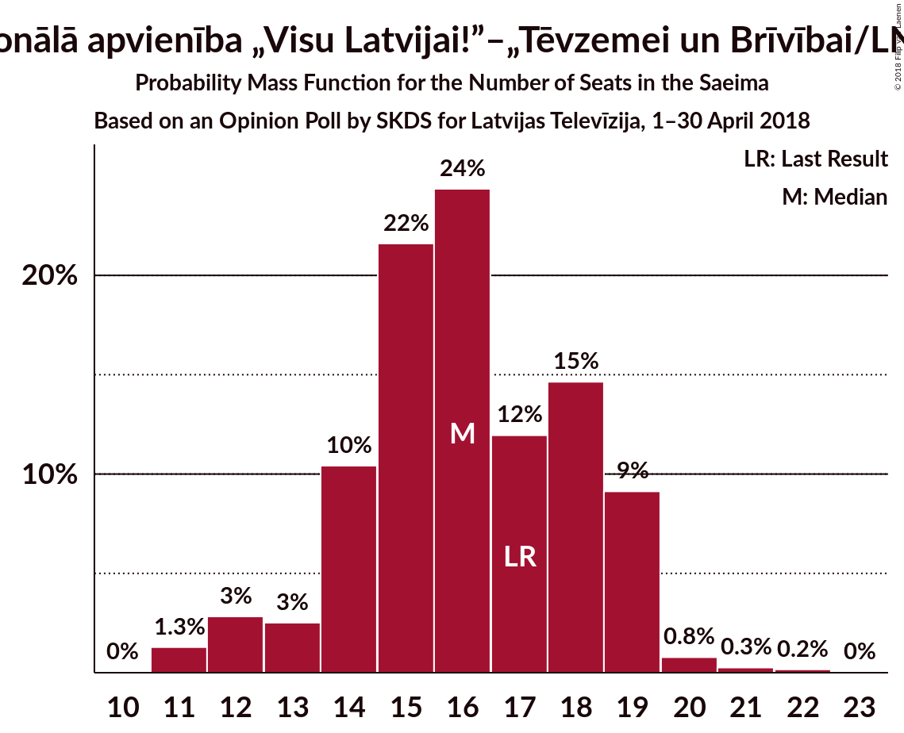

| Number of Seats | Probability | Accumulated | Special Marks |
|:---------------:|:-----------:|:-----------:|:-------------:|
| 11 | 1.3% | 100% |  |
| 12 | 3% | 98.7% |  |
| 13 | 3% | 96% |  |
| 14 | 10% | 93% |  |
| 15 | 22% | 83% |  |
| 16 | 24% | 61% | Median |
| 17 | 12% | 37% | Last Result |
| 18 | 15% | 25% |  |
| 19 | 9% | 10% |  |
| 20 | 0.8% | 1.2% |  |
| 21 | 0.3% | 0.4% |  |
| 22 | 0.2% | 0.2% |  |
| 23 | 0% | 0% |  |

### Vienotība

*For a full overview of the results for this party, see the [Vienotība](party-vienotība.html) page.*

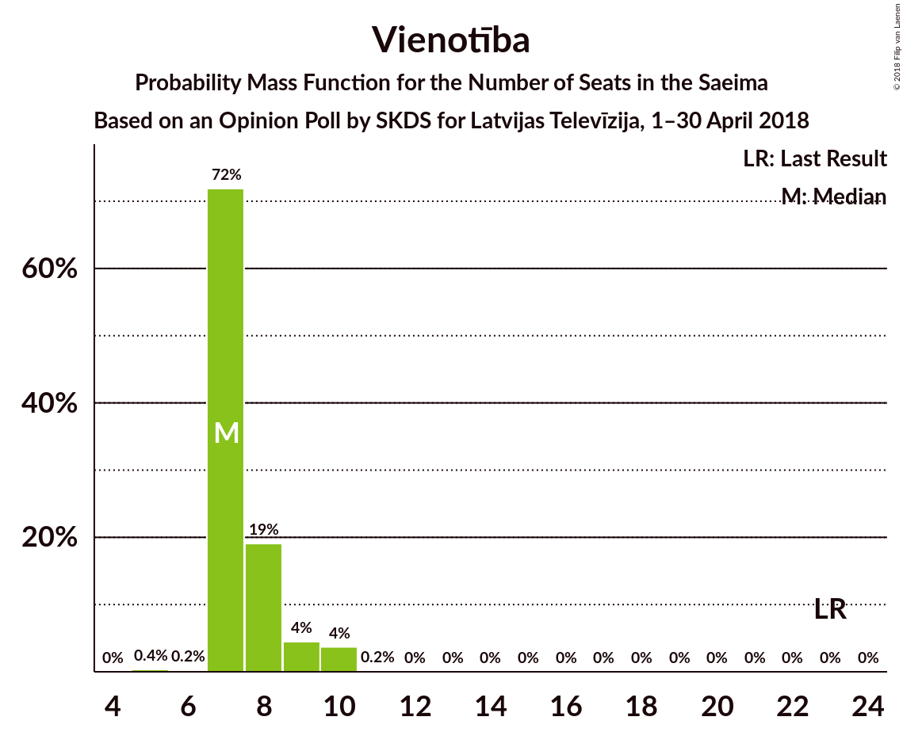

| Number of Seats | Probability | Accumulated | Special Marks |
|:---------------:|:-----------:|:-----------:|:-------------:|
| 0 | 0.1% | 100% |  |
| 1 | 0% | 99.9% |  |
| 2 | 0% | 99.9% |  |
| 3 | 0% | 99.9% |  |
| 4 | 0% | 99.9% |  |
| 5 | 0% | 99.9% |  |
| 6 | 0% | 99.9% |  |
| 7 | 3% | 99.9% |  |
| 8 | 30% | 97% |  |
| 9 | 16% | 67% |  |
| 10 | 24% | 51% | Median |
| 11 | 24% | 27% |  |
| 12 | 1.4% | 2% |  |
| 13 | 0.6% | 0.9% |  |
| 14 | 0.3% | 0.3% |  |
| 15 | 0% | 0% |  |
| 16 | 0% | 0% |  |
| 17 | 0% | 0% |  |
| 18 | 0% | 0% |  |
| 19 | 0% | 0% |  |
| 20 | 0% | 0% |  |
| 21 | 0% | 0% |  |
| 22 | 0% | 0% |  |
| 23 | 0% | 0% | Last Result |

### Jaunā konservatīvā partija

*For a full overview of the results for this party, see the [Jaunā konservatīvā partija](party-jaunākonservatīvāpartija.html) page.*

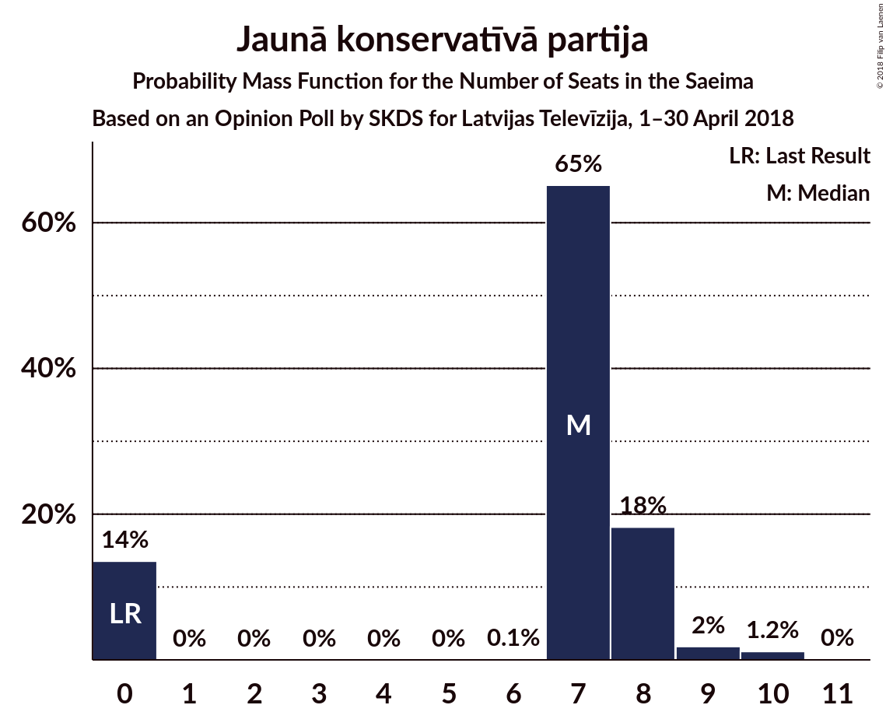

| Number of Seats | Probability | Accumulated | Special Marks |
|:---------------:|:-----------:|:-----------:|:-------------:|
| 0 | 15% | 100% | Last Result |
| 1 | 0% | 85% |  |
| 2 | 0% | 85% |  |
| 3 | 0% | 85% |  |
| 4 | 0% | 85% |  |
| 5 | 0% | 85% |  |
| 6 | 0% | 85% |  |
| 7 | 66% | 85% | Median |
| 8 | 16% | 20% |  |
| 9 | 2% | 4% |  |
| 10 | 1.2% | 1.3% |  |
| 11 | 0% | 0% |  |

### Latvijas Reģionu apvienība

*For a full overview of the results for this party, see the [Latvijas Reģionu apvienība](party-latvijasreģionuapvienība.html) page.*

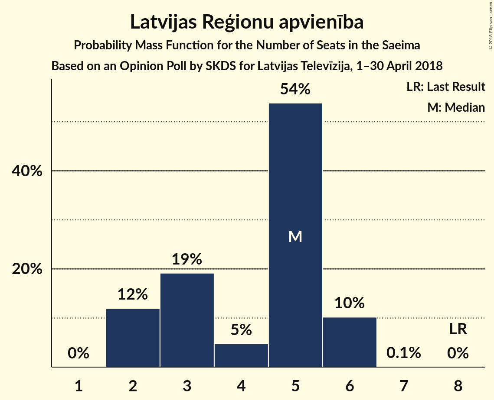

| Number of Seats | Probability | Accumulated | Special Marks |
|:---------------:|:-----------:|:-----------:|:-------------:|
| 0 | 77% | 100% | Median |
| 1 | 0% | 23% |  |
| 2 | 0% | 23% |  |
| 3 | 0% | 23% |  |
| 4 | 0% | 23% |  |
| 5 | 0% | 23% |  |
| 6 | 20% | 23% |  |
| 7 | 2% | 3% |  |
| 8 | 0.5% | 1.5% | Last Result |
| 9 | 1.0% | 1.0% |  |
| 10 | 0% | 0% |  |

### KPV LV

*For a full overview of the results for this party, see the [KPV LV](party-kpvlv.html) page.*

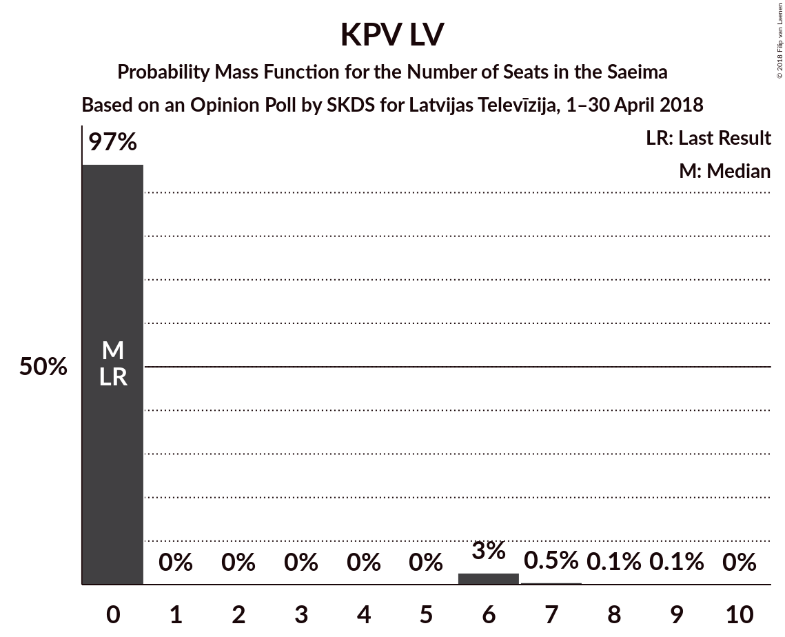

| Number of Seats | Probability | Accumulated | Special Marks |
|:---------------:|:-----------:|:-----------:|:-------------:|
| 0 | 97% | 100% | Last Result, Median |
| 1 | 0% | 3% |  |
| 2 | 0% | 3% |  |
| 3 | 0% | 3% |  |
| 4 | 0% | 3% |  |
| 5 | 0% | 3% |  |
| 6 | 3% | 3% |  |
| 7 | 0.5% | 0.7% |  |
| 8 | 0.1% | 0.2% |  |
| 9 | 0.1% | 0.1% |  |
| 10 | 0% | 0% |  |

### Vienoti Latvijai

*For a full overview of the results for this party, see the [Vienoti Latvijai](party-vienotilatvijai.html) page.*

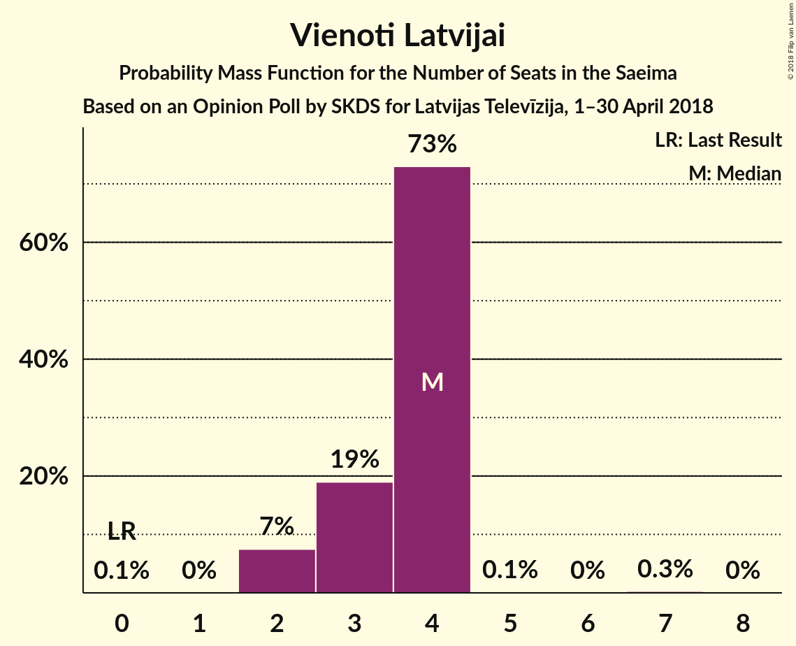

| Number of Seats | Probability | Accumulated | Special Marks |
|:---------------:|:-----------:|:-----------:|:-------------:|
| 0 | 98% | 100% | Last Result, Median |
| 1 | 0% | 2% |  |
| 2 | 0% | 2% |  |
| 3 | 0% | 2% |  |
| 4 | 0% | 2% |  |
| 5 | 0% | 2% |  |
| 6 | 0% | 2% |  |
| 7 | 2% | 2% |  |
| 8 | 0% | 0% |  |

### Kustība Par!

*For a full overview of the results for this party, see the [Kustība Par!](party-kustībapar.html) page.*

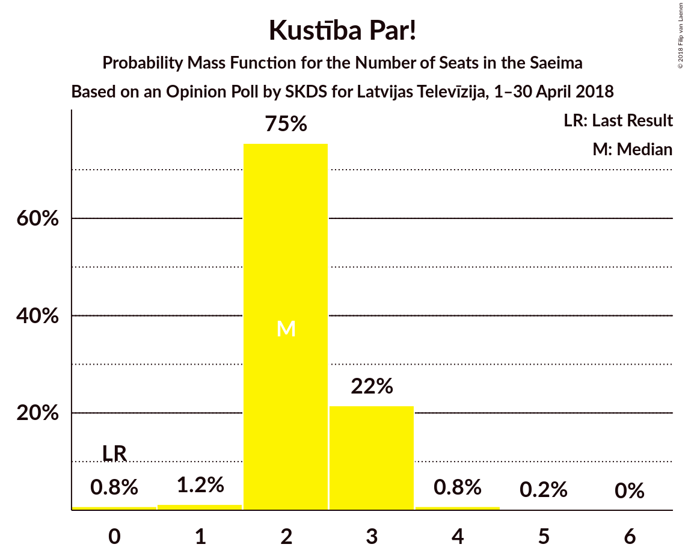

| Number of Seats | Probability | Accumulated | Special Marks |
|:---------------:|:-----------:|:-----------:|:-------------:|
| 0 | 99.9% | 100% | Last Result, Median |
| 1 | 0% | 0.1% |  |
| 2 | 0% | 0.1% |  |
| 3 | 0% | 0.1% |  |
| 4 | 0% | 0.1% |  |
| 5 | 0% | 0.1% |  |
| 6 | 0% | 0.1% |  |
| 7 | 0.1% | 0.1% |  |
| 8 | 0% | 0% |  |

## Coalitions

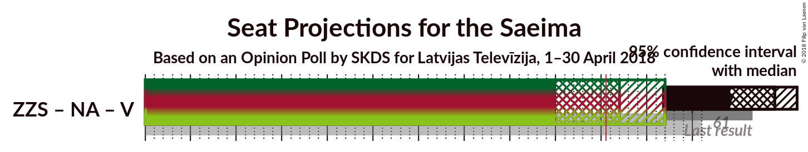

### Confidence Intervals

| Coalition | Last Result | Median | Majority? | 80% Confidence Interval | 90% Confidence Interval | 95% Confidence Interval | 99% Confidence Interval |
|:---------:|:-----------:|:------:|:---------:|:-----------------------:|:-----------------------:|:-----------------------:|:-----------------------:|
| Zaļo un Zemnieku savienība – Nacionālā apvienība „Visu Latvijai!”–„Tēvzemei un Brīvībai/LNNK” – Vienotība – Jaunā konservatīvā partija – Kustība Par! | 61 | 57 | 98% | 53–60 | 52–61 | 51–61 | 49–62 |
| Zaļo un Zemnieku savienība – Nacionālā apvienība „Visu Latvijai!”–„Tēvzemei un Brīvībai/LNNK” – Vienotība – Jaunā konservatīvā partija | 61 | 57 | 98% | 53–60 | 52–61 | 51–61 | 49–62 |
| Zaļo un Zemnieku savienība – Nacionālā apvienība „Visu Latvijai!”–„Tēvzemei un Brīvībai/LNNK” – Vienotība – Kustība Par! | 61 | 51 | 60% | 47–54 | 46–57 | 45–57 | 43–58 |
| Zaļo un Zemnieku savienība – Nacionālā apvienība „Visu Latvijai!”–„Tēvzemei un Brīvībai/LNNK” – Vienotība | 61 | 51 | 60% | 47–54 | 46–57 | 45–57 | 43–58 |
| Zaļo un Zemnieku savienība – Nacionālā apvienība „Visu Latvijai!”–„Tēvzemei un Brīvībai/LNNK” – Jaunā konservatīvā partija – Kustība Par! | 38 | 48 | 8% | 44–50 | 43–51 | 42–51 | 40–53 |
| Zaļo un Zemnieku savienība – Nacionālā apvienība „Visu Latvijai!”–„Tēvzemei un Brīvībai/LNNK” – Jaunā konservatīvā partija | 38 | 48 | 8% | 44–50 | 43–51 | 42–51 | 40–53 |
| Zaļo un Zemnieku savienība – Nacionālā apvienība „Visu Latvijai!”–„Tēvzemei un Brīvībai/LNNK” – Kustība Par! | 38 | 41 | 0.1% | 38–44 | 37–46 | 36–47 | 34–47 |

### Zaļo un Zemnieku savienība – Nacionālā apvienība „Visu Latvijai!”–„Tēvzemei un Brīvībai/LNNK” – Vienotība – Jaunā konservatīvā partija – Kustība Par!

| Number of Seats | Probability | Accumulated | Special Marks |
|:---------------:|:-----------:|:-----------:|:-------------:|
| 46 | 0.1% | 100% |  |
| 47 | 0.1% | 99.9% |  |
| 48 | 0.2% | 99.7% |  |
| 49 | 0.9% | 99.5% |  |
| 50 | 0.6% | 98.6% |  |
| 51 | 2% | 98% | Majority |
| 52 | 2% | 96% |  |
| 53 | 5% | 94% |  |
| 54 | 11% | 89% |  |
| 55 | 6% | 77% |  |
| 56 | 11% | 71% |  |
| 57 | 11% | 60% |  |
| 58 | 8% | 49% | Median |
| 59 | 21% | 41% |  |
| 60 | 15% | 21% |  |
| 61 | 4% | 5% | Last Result |
| 62 | 1.4% | 2% |  |
| 63 | 0.1% | 0.1% |  |
| 64 | 0% | 0% |  |

### Zaļo un Zemnieku savienība – Nacionālā apvienība „Visu Latvijai!”–„Tēvzemei un Brīvībai/LNNK” – Vienotība – Jaunā konservatīvā partija

| Number of Seats | Probability | Accumulated | Special Marks |
|:---------------:|:-----------:|:-----------:|:-------------:|
| 46 | 0.1% | 100% |  |
| 47 | 0.1% | 99.9% |  |
| 48 | 0.2% | 99.7% |  |
| 49 | 0.9% | 99.5% |  |
| 50 | 0.6% | 98.6% |  |
| 51 | 2% | 98% | Majority |
| 52 | 2% | 96% |  |
| 53 | 5% | 94% |  |
| 54 | 11% | 89% |  |
| 55 | 6% | 77% |  |
| 56 | 11% | 71% |  |
| 57 | 11% | 60% |  |
| 58 | 8% | 49% | Median |
| 59 | 21% | 41% |  |
| 60 | 15% | 20% |  |
| 61 | 4% | 5% | Last Result |
| 62 | 1.4% | 2% |  |
| 63 | 0.1% | 0.1% |  |
| 64 | 0% | 0% |  |

### Zaļo un Zemnieku savienība – Nacionālā apvienība „Visu Latvijai!”–„Tēvzemei un Brīvībai/LNNK” – Vienotība – Kustība Par!

| Number of Seats | Probability | Accumulated | Special Marks |
|:---------------:|:-----------:|:-----------:|:-------------:|
| 41 | 0.1% | 100% |  |
| 42 | 0.2% | 99.9% |  |
| 43 | 0.4% | 99.7% |  |
| 44 | 1.4% | 99.3% |  |
| 45 | 1.5% | 98% |  |
| 46 | 3% | 96% |  |
| 47 | 9% | 94% |  |
| 48 | 7% | 85% |  |
| 49 | 11% | 77% |  |
| 50 | 7% | 66% |  |
| 51 | 13% | 60% | Median, Majority |
| 52 | 21% | 46% |  |
| 53 | 13% | 26% |  |
| 54 | 5% | 12% |  |
| 55 | 0.8% | 7% |  |
| 56 | 0.7% | 6% |  |
| 57 | 5% | 6% |  |
| 58 | 0.6% | 0.8% |  |
| 59 | 0.1% | 0.2% |  |
| 60 | 0.1% | 0.1% |  |
| 61 | 0% | 0% | Last Result |

### Zaļo un Zemnieku savienība – Nacionālā apvienība „Visu Latvijai!”–„Tēvzemei un Brīvībai/LNNK” – Vienotība

| Number of Seats | Probability | Accumulated | Special Marks |
|:---------------:|:-----------:|:-----------:|:-------------:|
| 41 | 0.1% | 100% |  |
| 42 | 0.2% | 99.9% |  |
| 43 | 0.4% | 99.7% |  |
| 44 | 1.4% | 99.3% |  |
| 45 | 1.5% | 98% |  |
| 46 | 3% | 96% |  |
| 47 | 9% | 94% |  |
| 48 | 7% | 85% |  |
| 49 | 11% | 77% |  |
| 50 | 7% | 66% |  |
| 51 | 13% | 60% | Median, Majority |
| 52 | 21% | 46% |  |
| 53 | 13% | 25% |  |
| 54 | 5% | 12% |  |
| 55 | 0.8% | 7% |  |
| 56 | 0.7% | 6% |  |
| 57 | 5% | 6% |  |
| 58 | 0.6% | 0.8% |  |
| 59 | 0.1% | 0.2% |  |
| 60 | 0.1% | 0.1% |  |
| 61 | 0% | 0% | Last Result |

### Zaļo un Zemnieku savienība – Nacionālā apvienība „Visu Latvijai!”–„Tēvzemei un Brīvībai/LNNK” – Jaunā konservatīvā partija – Kustība Par!

| Number of Seats | Probability | Accumulated | Special Marks |
|:---------------:|:-----------:|:-----------:|:-------------:|
| 36 | 0% | 100% |  |
| 37 | 0.1% | 99.9% |  |
| 38 | 0.1% | 99.9% | Last Result |
| 39 | 0.2% | 99.7% |  |
| 40 | 0.6% | 99.6% |  |
| 41 | 1.4% | 98.9% |  |
| 42 | 2% | 98% |  |
| 43 | 4% | 96% |  |
| 44 | 4% | 92% |  |
| 45 | 7% | 88% |  |
| 46 | 10% | 82% |  |
| 47 | 21% | 71% |  |
| 48 | 9% | 50% | Median |
| 49 | 11% | 41% |  |
| 50 | 22% | 30% |  |
| 51 | 6% | 8% | Majority |
| 52 | 1.2% | 2% |  |
| 53 | 0.6% | 0.8% |  |
| 54 | 0.2% | 0.2% |  |
| 55 | 0% | 0% |  |

### Zaļo un Zemnieku savienība – Nacionālā apvienība „Visu Latvijai!”–„Tēvzemei un Brīvībai/LNNK” – Jaunā konservatīvā partija

| Number of Seats | Probability | Accumulated | Special Marks |
|:---------------:|:-----------:|:-----------:|:-------------:|
| 36 | 0% | 100% |  |
| 37 | 0.1% | 99.9% |  |
| 38 | 0.1% | 99.9% | Last Result |
| 39 | 0.2% | 99.7% |  |
| 40 | 0.6% | 99.5% |  |
| 41 | 1.4% | 98.9% |  |
| 42 | 2% | 98% |  |
| 43 | 4% | 96% |  |
| 44 | 4% | 92% |  |
| 45 | 7% | 88% |  |
| 46 | 10% | 81% |  |
| 47 | 21% | 71% |  |
| 48 | 9% | 50% | Median |
| 49 | 11% | 41% |  |
| 50 | 22% | 30% |  |
| 51 | 6% | 8% | Majority |
| 52 | 1.2% | 2% |  |
| 53 | 0.6% | 0.8% |  |
| 54 | 0.2% | 0.2% |  |
| 55 | 0% | 0% |  |

### Zaļo un Zemnieku savienība – Nacionālā apvienība „Visu Latvijai!”–„Tēvzemei un Brīvībai/LNNK” – Kustība Par!

| Number of Seats | Probability | Accumulated | Special Marks |
|:---------------:|:-----------:|:-----------:|:-------------:|
| 32 | 0.1% | 100% |  |
| 33 | 0.1% | 99.9% |  |
| 34 | 0.3% | 99.8% |  |
| 35 | 0.4% | 99.5% |  |
| 36 | 3% | 99.0% |  |
| 37 | 2% | 96% |  |
| 38 | 6% | 95% | Last Result |
| 39 | 9% | 88% |  |
| 40 | 19% | 80% |  |
| 41 | 14% | 61% | Median |
| 42 | 10% | 47% |  |
| 43 | 25% | 37% |  |
| 44 | 4% | 13% |  |
| 45 | 3% | 9% |  |
| 46 | 2% | 6% |  |
| 47 | 4% | 5% |  |
| 48 | 0.3% | 0.5% |  |
| 49 | 0.1% | 0.2% |  |
| 50 | 0.1% | 0.1% |  |
| 51 | 0% | 0.1% | Majority |
| 52 | 0% | 0% |  |

## Technical Information

### Opinion Poll

+ **Polling firm:** SKDS
+ **Commissioner(s):** Latvijas Televīzija
+ **Fieldwork period:** 1–30 April 2018

### Calculations

+ **Sample size:** 631
+ **Simulations done:** 1,048,576
+ **Error estimate:** 2.24%

