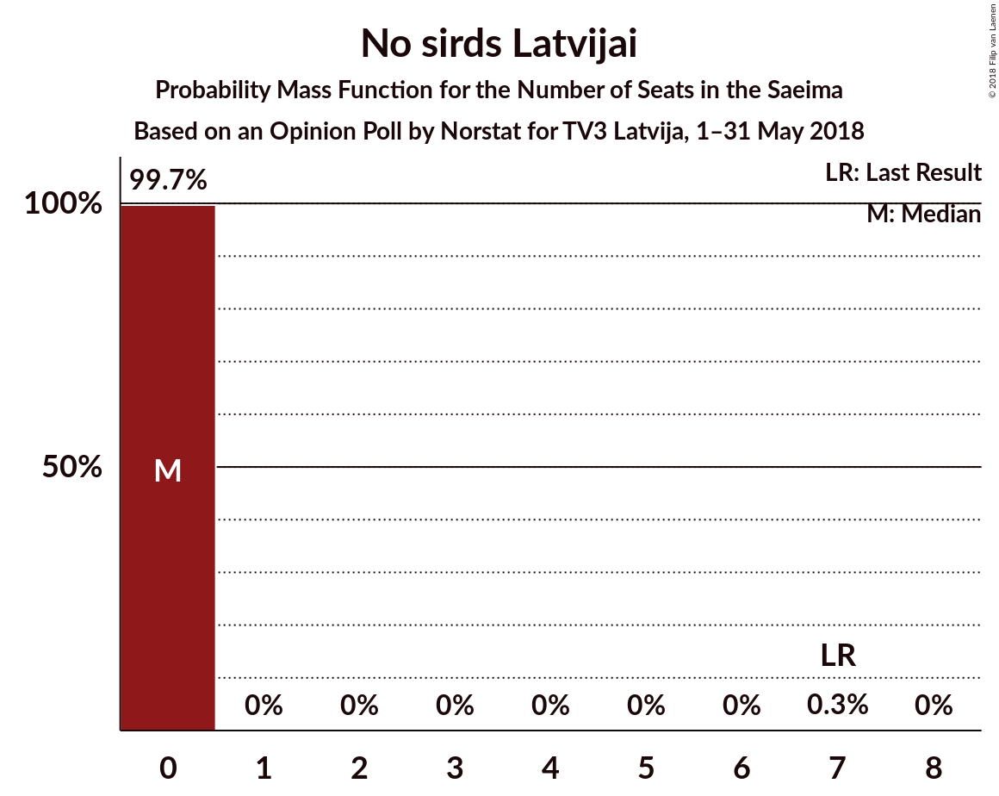

# Opinion Poll by Norstat for TV3 Latvija, 1–31 May 2018

<a href="#voting-intentions">Voting Intentions</a> | <a href="#seats">Seats</a> | <a href="#coalitions">Coalitions</a> | <a href="#technical-information">Technical Information</a>

## Voting Intentions

### Confidence Intervals

| Party | Last Result | Poll Result | 80% Confidence Interval | 90% Confidence Interval | 95% Confidence Interval | 99% Confidence Interval |
|:-----:|:-----------:|:-----------:|:-----------------------:|:-----------------------:|:-----------------------:|:-----------------------:|
| Zaļo un Zemnieku savienība | 19.5% | 23.9% | 21.9–26.0% |21.4–26.7% |20.9–27.2% |20.0–28.2% |
| Sociāldemokrātiskā Partija “Saskaņa” | 23.0% | 22.8% | 20.9–24.9% |20.3–25.5% |19.9–26.0% |19.0–27.1% |
| Nacionālā apvienība „Visu Latvijai!”–„Tēvzemei un Brīvībai/LNNK” | 16.6% | 12.7% | 11.2–14.5% |10.8–15.0% |10.5–15.4% |9.8–16.2% |
| Vienotība | 21.9% | 8.7% | 7.5–10.2% |7.1–10.6% |6.8–11.0% |6.3–11.7% |
| Jaunā konservatīvā partija | 0.7% | 8.5% | 7.3–10.0% |7.0–10.4% |6.7–10.8% |6.2–11.6% |
| Kustība Par! | 0.0% | 5.0% | 4.1–6.2% |3.9–6.6% |3.7–6.9% |3.3–7.5% |
| KPV LV | 0.0% | 4.9% | 4.0–6.1% |3.7–6.4% |3.5–6.7% |3.2–7.4% |
| Latvijas Reģionu apvienība | 6.7% | 4.5% | 3.6–5.6% |3.4–6.0% |3.2–6.3% |2.8–6.9% |
| No sirds Latvijai | 6.8% | 2.9% | 2.3–3.9% |2.1–4.2% |1.9–4.5% |1.6–5.0% |
| Latvijas attīstībai | 0.9% | 2.5% | 1.9–3.4% |1.7–3.7% |1.6–3.9% |1.3–4.5% |

*Note:* The poll result column reflects the actual value used in the calculations. Published results may vary slightly, and in addition be rounded to fewer digits.

## Seats

### Confidence Intervals

| Party | Last Result | Median | 80% Confidence Interval | 90% Confidence Interval | 95% Confidence Interval | 99% Confidence Interval |
|:-----:|:-----------:|:------:|:-----------------------:|:-----------------------:|:-----------------------:|:-----------------------:|
| <a href="#zaļo-un-zemnieku-savienība">Zaļo un Zemnieku savienība</a> | 21 | 29 | 25–32 |24–33 |23–34 |23–36 |
| <a href="#sociāldemokrātiskā-partija-“saskaņa”">Sociāldemokrātiskā Partija “Saskaņa”</a> | 24 | 27 | 24–30 |24–31 |23–33 |22–33 |
| <a href="#nacionālā-apvienība-„visu-latvijai!”–„tēvzemei-un-brīvībai/lnnk”">Nacionālā apvienība „Visu Latvijai!”–„Tēvzemei un Brīvībai/LNNK”</a> | 17 | 15 | 13–17 |13–18 |13–18 |11–20 |
| <a href="#vienotība">Vienotība</a> | 23 | 9 | 9–12 |8–12 |7–13 |7–14 |
| <a href="#jaunā-konservatīvā-partija">Jaunā konservatīvā partija</a> | 0 | 10 | 8–13 |8–13 |8–13 |8–15 |
| <a href="#kustība-par!">Kustība Par!</a> | 0 | 7 | 0–7 |0–7 |0–8 |0–9 |
| <a href="#kpv-lv">KPV LV</a> | 0 | 0 | 0–8 |0–8 |0–8 |0–9 |
| <a href="#latvijas-reģionu-apvienība">Latvijas Reģionu apvienība</a> | 8 | 0 | 0–7 |0–8 |0–8 |0–8 |
| <a href="#no-sirds-latvijai">No sirds Latvijai</a> | 7 | 0 | 0 |0 |0 |0 |
| <a href="#latvijas-attīstībai">Latvijas attīstībai</a> | 0 | 0 | 0 |0 |0 |0 |

### Zaļo un Zemnieku savienība

*For a full overview of the results for this party, see the [Zaļo un Zemnieku savienība](party-zaļounzemniekusavienība.html) page.*

| Number of Seats | Probability | Accumulated | Special Marks |
|:---------------:|:-----------:|:-----------:|:-------------:|
| 21 | 0.1% | 100% | Last Result |
| 22 | 0.2% | 99.9% |  |
| 23 | 3% | 99.7% |  |
| 24 | 6% | 97% |  |
| 25 | 5% | 91% |  |
| 26 | 2% | 86% |  |
| 27 | 14% | 84% |  |
| 28 | 14% | 70% |  |
| 29 | 13% | 56% | Median |
| 30 | 27% | 43% |  |
| 31 | 5% | 15% |  |
| 32 | 4% | 11% |  |
| 33 | 2% | 7% |  |
| 34 | 3% | 4% |  |
| 35 | 0.2% | 0.8% |  |
| 36 | 0.5% | 0.6% |  |
| 37 | 0.1% | 0.1% |  |
| 38 | 0% | 0% |  |

### Sociāldemokrātiskā Partija “Saskaņa”

*For a full overview of the results for this party, see the [Sociāldemokrātiskā Partija “Saskaņa”](party-sociāldemokrātiskāpartija“saskaņa”.html) page.*

| Number of Seats | Probability | Accumulated | Special Marks |
|:---------------:|:-----------:|:-----------:|:-------------:|
| 21 | 0.1% | 100% |  |
| 22 | 1.1% | 99.8% |  |
| 23 | 1.3% | 98.7% |  |
| 24 | 12% | 97% | Last Result |
| 25 | 3% | 85% |  |
| 26 | 9% | 83% |  |
| 27 | 25% | 74% | Median |
| 28 | 29% | 49% |  |
| 29 | 10% | 20% |  |
| 30 | 3% | 10% |  |
| 31 | 4% | 7% |  |
| 32 | 0.6% | 3% |  |
| 33 | 2% | 3% |  |
| 34 | 0.2% | 0.2% |  |
| 35 | 0% | 0% |  |

### Nacionālā apvienība „Visu Latvijai!”–„Tēvzemei un Brīvībai/LNNK”

*For a full overview of the results for this party, see the [Nacionālā apvienība „Visu Latvijai!”–„Tēvzemei un Brīvībai/LNNK”](party-nacionālāapvienība„visulatvijai”–„tēvzemeiunbrīvībailnnk”.html) page.*

| Number of Seats | Probability | Accumulated | Special Marks |
|:---------------:|:-----------:|:-----------:|:-------------:|
| 9 | 0.4% | 100% |  |
| 10 | 0.1% | 99.6% |  |
| 11 | 0.5% | 99.5% |  |
| 12 | 1.0% | 99.0% |  |
| 13 | 16% | 98% |  |
| 14 | 18% | 82% |  |
| 15 | 33% | 64% | Median |
| 16 | 11% | 31% |  |
| 17 | 11% | 20% | Last Result |
| 18 | 7% | 9% |  |
| 19 | 1.2% | 2% |  |
| 20 | 0.4% | 0.5% |  |
| 21 | 0% | 0.1% |  |
| 22 | 0% | 0% |  |

### Vienotība

*For a full overview of the results for this party, see the [Vienotība](party-vienotība.html) page.*

| Number of Seats | Probability | Accumulated | Special Marks |
|:---------------:|:-----------:|:-----------:|:-------------:|
| 7 | 3% | 100% |  |
| 8 | 3% | 97% |  |
| 9 | 44% | 94% | Median |
| 10 | 20% | 50% |  |
| 11 | 9% | 30% |  |
| 12 | 17% | 21% |  |
| 13 | 4% | 5% |  |
| 14 | 0.3% | 0.6% |  |
| 15 | 0.1% | 0.4% |  |
| 16 | 0.3% | 0.3% |  |
| 17 | 0% | 0% |  |
| 18 | 0% | 0% |  |
| 19 | 0% | 0% |  |
| 20 | 0% | 0% |  |
| 21 | 0% | 0% |  |
| 22 | 0% | 0% |  |
| 23 | 0% | 0% | Last Result |

### Jaunā konservatīvā partija

*For a full overview of the results for this party, see the [Jaunā konservatīvā partija](party-jaunākonservatīvāpartija.html) page.*

| Number of Seats | Probability | Accumulated | Special Marks |
|:---------------:|:-----------:|:-----------:|:-------------:|
| 0 | 0% | 100% | Last Result |
| 1 | 0% | 100% |  |
| 2 | 0% | 100% |  |
| 3 | 0% | 100% |  |
| 4 | 0% | 100% |  |
| 5 | 0% | 100% |  |
| 6 | 0% | 100% |  |
| 7 | 0.2% | 100% |  |
| 8 | 34% | 99.8% |  |
| 9 | 12% | 66% |  |
| 10 | 13% | 54% | Median |
| 11 | 27% | 40% |  |
| 12 | 2% | 13% |  |
| 13 | 10% | 11% |  |
| 14 | 0.8% | 2% |  |
| 15 | 0.7% | 0.8% |  |
| 16 | 0% | 0% |  |

### Kustība Par!

*For a full overview of the results for this party, see the [Kustība Par!](party-kustībapar.html) page.*

| Number of Seats | Probability | Accumulated | Special Marks |
|:---------------:|:-----------:|:-----------:|:-------------:|
| 0 | 47% | 100% | Last Result |
| 1 | 0% | 53% |  |
| 2 | 0% | 53% |  |
| 3 | 0% | 53% |  |
| 4 | 0% | 53% |  |
| 5 | 0% | 53% |  |
| 6 | 0% | 53% |  |
| 7 | 49% | 53% | Median |
| 8 | 3% | 5% |  |
| 9 | 2% | 2% |  |
| 10 | 0% | 0% |  |

### KPV LV

*For a full overview of the results for this party, see the [KPV LV](party-kpvlv.html) page.*

| Number of Seats | Probability | Accumulated | Special Marks |
|:---------------:|:-----------:|:-----------:|:-------------:|
| 0 | 54% | 100% | Last Result, Median |
| 1 | 0% | 46% |  |
| 2 | 0% | 46% |  |
| 3 | 0% | 46% |  |
| 4 | 0% | 46% |  |
| 5 | 0% | 46% |  |
| 6 | 3% | 46% |  |
| 7 | 20% | 43% |  |
| 8 | 22% | 23% |  |
| 9 | 0.9% | 1.0% |  |
| 10 | 0.1% | 0.1% |  |
| 11 | 0% | 0% |  |

### Latvijas Reģionu apvienība

*For a full overview of the results for this party, see the [Latvijas Reģionu apvienība](party-latvijasreģionuapvienība.html) page.*

| Number of Seats | Probability | Accumulated | Special Marks |
|:---------------:|:-----------:|:-----------:|:-------------:|
| 0 | 73% | 100% | Median |
| 1 | 0% | 27% |  |
| 2 | 0% | 27% |  |
| 3 | 0% | 27% |  |
| 4 | 0% | 27% |  |
| 5 | 0% | 27% |  |
| 6 | 8% | 27% |  |
| 7 | 12% | 20% |  |
| 8 | 8% | 8% | Last Result |
| 9 | 0.2% | 0.2% |  |
| 10 | 0% | 0% |  |

### No sirds Latvijai

*For a full overview of the results for this party, see the [No sirds Latvijai](party-nosirdslatvijai.html) page.*

| Number of Seats | Probability | Accumulated | Special Marks |
|:---------------:|:-----------:|:-----------:|:-------------:|
| 0 | 99.7% | 100% | Median |
| 1 | 0% | 0.3% |  |
| 2 | 0% | 0.3% |  |
| 3 | 0% | 0.3% |  |
| 4 | 0% | 0.3% |  |
| 5 | 0% | 0.3% |  |
| 6 | 0% | 0.3% |  |
| 7 | 0.3% | 0.3% | Last Result |
| 8 | 0% | 0% |  |

### Latvijas attīstībai

*For a full overview of the results for this party, see the [Latvijas attīstībai](party-latvijasattīstībai.html) page.*

| Number of Seats | Probability | Accumulated | Special Marks |
|:---------------:|:-----------:|:-----------:|:-------------:|
| 0 | 99.9% | 100% | Last Result, Median |
| 1 | 0% | 0.1% |  |
| 2 | 0% | 0.1% |  |
| 3 | 0% | 0.1% |  |
| 4 | 0% | 0.1% |  |
| 5 | 0% | 0.1% |  |
| 6 | 0% | 0.1% |  |
| 7 | 0.1% | 0.1% |  |
| 8 | 0% | 0% |  |

## Coalitions

### Confidence Intervals

| Coalition | Last Result | Median | Majority? | 80% Confidence Interval | 90% Confidence Interval | 95% Confidence Interval | 99% Confidence Interval |
|:---------:|:-----------:|:------:|:---------:|:-----------------------:|:-----------------------:|:-----------------------:|:-----------------------:|
| Zaļo un Zemnieku savienība – Nacionālā apvienība „Visu Latvijai!”–„Tēvzemei un Brīvībai/LNNK” – Vienotība – Jaunā konservatīvā partija – Kustība Par! | 61 | 67 | 100% | 62–73 | 59–73 | 59–73 | 58–75 |
| Zaļo un Zemnieku savienība – Nacionālā apvienība „Visu Latvijai!”–„Tēvzemei un Brīvībai/LNNK” – Vienotība – Jaunā konservatīvā partija | 61 | 64 | 100% | 58–69 | 57–71 | 53–72 | 53–72 |
| Zaļo un Zemnieku savienība – Sociāldemokrātiskā Partija “Saskaņa” – KPV LV | 45 | 59 | 99.6% | 54–65 | 52–65 | 51–66 | 51–67 |
| Zaļo un Zemnieku savienība – Nacionālā apvienība „Visu Latvijai!”–„Tēvzemei un Brīvībai/LNNK” – Vienotība – Kustība Par! | 61 | 57 | 95% | 52–63 | 50–64 | 50–64 | 47–65 |
| Zaļo un Zemnieku savienība – Nacionālā apvienība „Visu Latvijai!”–„Tēvzemei un Brīvībai/LNNK” – Jaunā konservatīvā partija – Kustība Par! | 38 | 58 | 96% | 52–63 | 51–63 | 50–63 | 49–65 |
| Zaļo un Zemnieku savienība – Nacionālā apvienība „Visu Latvijai!”–„Tēvzemei un Brīvībai/LNNK” – Vienotība | 61 | 53 | 77% | 49–58 | 48–62 | 45–62 | 45–63 |
| Zaļo un Zemnieku savienība – Nacionālā apvienība „Visu Latvijai!”–„Tēvzemei un Brīvībai/LNNK” – Jaunā konservatīvā partija | 38 | 54 | 80% | 49–58 | 47–59 | 44–60 | 44–63 |
| Zaļo un Zemnieku savienība – Nacionālā apvienība „Visu Latvijai!”–„Tēvzemei un Brīvībai/LNNK” – Kustība Par! | 38 | 48 | 16% | 43–52 | 41–53 | 41–54 | 38–55 |
| Sociāldemokrātiskā Partija “Saskaņa” – Jaunā konservatīvā partija – Kustība Par! | 24 | 41 | 0% | 36–47 | 36–47 | 35–48 | 33–49 |
| Nacionālā apvienība „Visu Latvijai!”–„Tēvzemei un Brīvībai/LNNK” – Vienotība – Jaunā konservatīvā partija – Kustība Par! | 40 | 39 | 0% | 34–44 | 33–44 | 31–46 | 31–48 |
| Sociāldemokrātiskā Partija “Saskaņa” – KPV LV | 24 | 30 | 0% | 27–35 | 26–36 | 24–37 | 24–38 |
| Sociāldemokrātiskā Partija “Saskaņa” – Kustība Par! | 24 | 31 | 0% | 27–35 | 26–36 | 24–37 | 24–38 |

### Zaļo un Zemnieku savienība – Nacionālā apvienība „Visu Latvijai!”–„Tēvzemei un Brīvībai/LNNK” – Vienotība – Jaunā konservatīvā partija – Kustība Par!

| Number of Seats | Probability | Accumulated | Special Marks |
|:---------------:|:-----------:|:-----------:|:-------------:|
| 55 | 0% | 100% |  |
| 56 | 0% | 99.9% |  |
| 57 | 0% | 99.9% |  |
| 58 | 1.0% | 99.9% |  |
| 59 | 4% | 98.9% |  |
| 60 | 3% | 95% |  |
| 61 | 0.6% | 92% | Last Result |
| 62 | 3% | 91% |  |
| 63 | 1.4% | 88% |  |
| 64 | 8% | 87% |  |
| 65 | 17% | 79% |  |
| 66 | 7% | 63% |  |
| 67 | 8% | 55% |  |
| 68 | 11% | 48% |  |
| 69 | 4% | 37% |  |
| 70 | 3% | 33% | Median |
| 71 | 8% | 30% |  |
| 72 | 10% | 22% |  |
| 73 | 10% | 11% |  |
| 74 | 0.6% | 1.4% |  |
| 75 | 0.6% | 0.9% |  |
| 76 | 0% | 0.2% |  |
| 77 | 0.2% | 0.2% |  |
| 78 | 0% | 0% |  |

### Zaļo un Zemnieku savienība – Nacionālā apvienība „Visu Latvijai!”–„Tēvzemei un Brīvībai/LNNK” – Vienotība – Jaunā konservatīvā partija

| Number of Seats | Probability | Accumulated | Special Marks |
|:---------------:|:-----------:|:-----------:|:-------------:|
| 52 | 0.1% | 100% |  |
| 53 | 3% | 99.9% |  |
| 54 | 0.2% | 97% |  |
| 55 | 0.2% | 97% |  |
| 56 | 0.9% | 97% |  |
| 57 | 2% | 96% |  |
| 58 | 5% | 94% |  |
| 59 | 10% | 89% |  |
| 60 | 4% | 79% |  |
| 61 | 9% | 75% | Last Result |
| 62 | 5% | 66% |  |
| 63 | 5% | 62% | Median |
| 64 | 9% | 57% |  |
| 65 | 19% | 47% |  |
| 66 | 11% | 29% |  |
| 67 | 4% | 18% |  |
| 68 | 3% | 14% |  |
| 69 | 2% | 11% |  |
| 70 | 1.5% | 9% |  |
| 71 | 3% | 8% |  |
| 72 | 4% | 5% |  |
| 73 | 0.3% | 0.4% |  |
| 74 | 0% | 0.1% |  |
| 75 | 0% | 0% |  |

### Zaļo un Zemnieku savienība – Sociāldemokrātiskā Partija “Saskaņa” – KPV LV

| Number of Seats | Probability | Accumulated | Special Marks |
|:---------------:|:-----------:|:-----------:|:-------------:|
| 45 | 0% | 100% | Last Result |
| 46 | 0% | 100% |  |
| 47 | 0% | 100% |  |
| 48 | 0% | 100% |  |
| 49 | 0% | 99.9% |  |
| 50 | 0.3% | 99.9% |  |
| 51 | 4% | 99.6% | Majority |
| 52 | 2% | 96% |  |
| 53 | 3% | 94% |  |
| 54 | 3% | 91% |  |
| 55 | 2% | 88% |  |
| 56 | 11% | 86% | Median |
| 57 | 7% | 75% |  |
| 58 | 12% | 68% |  |
| 59 | 10% | 56% |  |
| 60 | 8% | 46% |  |
| 61 | 7% | 39% |  |
| 62 | 6% | 31% |  |
| 63 | 6% | 25% |  |
| 64 | 1.5% | 19% |  |
| 65 | 13% | 18% |  |
| 66 | 4% | 5% |  |
| 67 | 0.9% | 1.2% |  |
| 68 | 0% | 0.3% |  |
| 69 | 0.2% | 0.2% |  |
| 70 | 0% | 0% |  |

### Zaļo un Zemnieku savienība – Nacionālā apvienība „Visu Latvijai!”–„Tēvzemei un Brīvībai/LNNK” – Vienotība – Kustība Par!

| Number of Seats | Probability | Accumulated | Special Marks |
|:---------------:|:-----------:|:-----------:|:-------------:|
| 47 | 0.6% | 100% |  |
| 48 | 0.2% | 99.3% |  |
| 49 | 2% | 99.1% |  |
| 50 | 3% | 98% |  |
| 51 | 0.7% | 95% | Majority |
| 52 | 4% | 94% |  |
| 53 | 3% | 90% |  |
| 54 | 13% | 86% |  |
| 55 | 6% | 73% |  |
| 56 | 8% | 67% |  |
| 57 | 10% | 58% |  |
| 58 | 5% | 48% |  |
| 59 | 5% | 43% |  |
| 60 | 17% | 37% | Median |
| 61 | 4% | 21% | Last Result |
| 62 | 4% | 17% |  |
| 63 | 6% | 13% |  |
| 64 | 5% | 7% |  |
| 65 | 0.7% | 1.1% |  |
| 66 | 0.3% | 0.4% |  |
| 67 | 0% | 0.1% |  |
| 68 | 0% | 0% |  |

### Zaļo un Zemnieku savienība – Nacionālā apvienība „Visu Latvijai!”–„Tēvzemei un Brīvībai/LNNK” – Jaunā konservatīvā partija – Kustība Par!

| Number of Seats | Probability | Accumulated | Special Marks |
|:---------------:|:-----------:|:-----------:|:-------------:|
| 38 | 0% | 100% | Last Result |
| 39 | 0% | 100% |  |
| 40 | 0% | 100% |  |
| 41 | 0% | 100% |  |
| 42 | 0% | 100% |  |
| 43 | 0% | 100% |  |
| 44 | 0% | 100% |  |
| 45 | 0% | 100% |  |
| 46 | 0.1% | 100% |  |
| 47 | 0.2% | 99.9% |  |
| 48 | 0.2% | 99.7% |  |
| 49 | 0.8% | 99.5% |  |
| 50 | 3% | 98.8% |  |
| 51 | 5% | 96% | Majority |
| 52 | 2% | 91% |  |
| 53 | 4% | 89% |  |
| 54 | 6% | 85% |  |
| 55 | 5% | 79% |  |
| 56 | 15% | 74% |  |
| 57 | 9% | 60% |  |
| 58 | 12% | 51% |  |
| 59 | 12% | 39% |  |
| 60 | 8% | 27% |  |
| 61 | 3% | 18% | Median |
| 62 | 4% | 15% |  |
| 63 | 10% | 11% |  |
| 64 | 0.5% | 1.2% |  |
| 65 | 0.6% | 0.7% |  |
| 66 | 0% | 0.1% |  |
| 67 | 0% | 0% |  |

### Zaļo un Zemnieku savienība – Nacionālā apvienība „Visu Latvijai!”–„Tēvzemei un Brīvībai/LNNK” – Vienotība

| Number of Seats | Probability | Accumulated | Special Marks |
|:---------------:|:-----------:|:-----------:|:-------------:|
| 43 | 0.1% | 100% |  |
| 44 | 0.1% | 99.9% |  |
| 45 | 3% | 99.8% |  |
| 46 | 0.2% | 97% |  |
| 47 | 1.2% | 97% |  |
| 48 | 4% | 96% |  |
| 49 | 7% | 92% |  |
| 50 | 8% | 85% |  |
| 51 | 5% | 77% | Majority |
| 52 | 6% | 73% |  |
| 53 | 18% | 67% | Median |
| 54 | 15% | 49% |  |
| 55 | 5% | 35% |  |
| 56 | 7% | 30% |  |
| 57 | 11% | 23% |  |
| 58 | 2% | 12% |  |
| 59 | 2% | 10% |  |
| 60 | 0.4% | 8% |  |
| 61 | 2% | 7% | Last Result |
| 62 | 3% | 5% |  |
| 63 | 2% | 2% |  |
| 64 | 0% | 0.1% |  |
| 65 | 0% | 0% |  |

### Zaļo un Zemnieku savienība – Nacionālā apvienība „Visu Latvijai!”–„Tēvzemei un Brīvībai/LNNK” – Jaunā konservatīvā partija

| Number of Seats | Probability | Accumulated | Special Marks |
|:---------------:|:-----------:|:-----------:|:-------------:|
| 38 | 0% | 100% | Last Result |
| 39 | 0% | 100% |  |
| 40 | 0% | 100% |  |
| 41 | 0% | 100% |  |
| 42 | 0% | 100% |  |
| 43 | 0.1% | 100% |  |
| 44 | 2% | 99.9% |  |
| 45 | 0.2% | 97% |  |
| 46 | 1.1% | 97% |  |
| 47 | 4% | 96% |  |
| 48 | 1.1% | 93% |  |
| 49 | 3% | 91% |  |
| 50 | 8% | 88% |  |
| 51 | 12% | 80% | Majority |
| 52 | 9% | 68% |  |
| 53 | 8% | 59% |  |
| 54 | 5% | 51% | Median |
| 55 | 7% | 46% |  |
| 56 | 21% | 38% |  |
| 57 | 4% | 17% |  |
| 58 | 5% | 13% |  |
| 59 | 4% | 8% |  |
| 60 | 3% | 5% |  |
| 61 | 0.4% | 2% |  |
| 62 | 0.4% | 1.3% |  |
| 63 | 0.8% | 1.0% |  |
| 64 | 0.1% | 0.1% |  |
| 65 | 0% | 0.1% |  |
| 66 | 0% | 0% |  |

### Zaļo un Zemnieku savienība – Nacionālā apvienība „Visu Latvijai!”–„Tēvzemei un Brīvībai/LNNK” – Kustība Par!

| Number of Seats | Probability | Accumulated | Special Marks |
|:---------------:|:-----------:|:-----------:|:-------------:|
| 38 | 0.7% | 100% | Last Result |
| 39 | 0.5% | 99.3% |  |
| 40 | 0.6% | 98.8% |  |
| 41 | 4% | 98% |  |
| 42 | 3% | 95% |  |
| 43 | 6% | 92% |  |
| 44 | 3% | 85% |  |
| 45 | 13% | 82% |  |
| 46 | 10% | 69% |  |
| 47 | 8% | 59% |  |
| 48 | 10% | 52% |  |
| 49 | 5% | 42% |  |
| 50 | 21% | 37% |  |
| 51 | 4% | 16% | Median, Majority |
| 52 | 6% | 12% |  |
| 53 | 1.2% | 5% |  |
| 54 | 3% | 4% |  |
| 55 | 0.3% | 0.7% |  |
| 56 | 0.1% | 0.4% |  |
| 57 | 0.3% | 0.3% |  |
| 58 | 0% | 0% |  |

### Sociāldemokrātiskā Partija “Saskaņa” – Jaunā konservatīvā partija – Kustība Par!

| Number of Seats | Probability | Accumulated | Special Marks |
|:---------------:|:-----------:|:-----------:|:-------------:|
| 24 | 0% | 100% | Last Result |
| 25 | 0% | 100% |  |
| 26 | 0% | 100% |  |
| 27 | 0% | 100% |  |
| 28 | 0% | 100% |  |
| 29 | 0% | 100% |  |
| 30 | 0% | 100% |  |
| 31 | 0% | 100% |  |
| 32 | 0.3% | 100% |  |
| 33 | 0.3% | 99.6% |  |
| 34 | 0.8% | 99.3% |  |
| 35 | 3% | 98.6% |  |
| 36 | 8% | 96% |  |
| 37 | 5% | 87% |  |
| 38 | 7% | 82% |  |
| 39 | 21% | 75% |  |
| 40 | 3% | 54% |  |
| 41 | 6% | 51% |  |
| 42 | 8% | 45% |  |
| 43 | 12% | 37% |  |
| 44 | 7% | 26% | Median |
| 45 | 5% | 18% |  |
| 46 | 2% | 13% |  |
| 47 | 8% | 11% |  |
| 48 | 2% | 3% |  |
| 49 | 0.5% | 0.7% |  |
| 50 | 0.1% | 0.2% |  |
| 51 | 0% | 0% | Majority |

### Nacionālā apvienība „Visu Latvijai!”–„Tēvzemei un Brīvībai/LNNK” – Vienotība – Jaunā konservatīvā partija – Kustība Par!

| Number of Seats | Probability | Accumulated | Special Marks |
|:---------------:|:-----------:|:-----------:|:-------------:|
| 30 | 0.3% | 100% |  |
| 31 | 4% | 99.7% |  |
| 32 | 0.2% | 96% |  |
| 33 | 2% | 95% |  |
| 34 | 5% | 93% |  |
| 35 | 17% | 88% |  |
| 36 | 3% | 70% |  |
| 37 | 7% | 68% |  |
| 38 | 6% | 60% |  |
| 39 | 8% | 54% |  |
| 40 | 9% | 46% | Last Result |
| 41 | 11% | 37% | Median |
| 42 | 11% | 26% |  |
| 43 | 2% | 15% |  |
| 44 | 9% | 13% |  |
| 45 | 0.5% | 4% |  |
| 46 | 2% | 3% |  |
| 47 | 0.2% | 0.8% |  |
| 48 | 0.5% | 0.6% |  |
| 49 | 0.1% | 0.1% |  |
| 50 | 0% | 0% |  |

### Sociāldemokrātiskā Partija “Saskaņa” – KPV LV

| Number of Seats | Probability | Accumulated | Special Marks |
|:---------------:|:-----------:|:-----------:|:-------------:|
| 22 | 0.2% | 100% |  |
| 23 | 0.3% | 99.8% |  |
| 24 | 2% | 99.5% | Last Result |
| 25 | 1.3% | 97% |  |
| 26 | 3% | 96% |  |
| 27 | 14% | 93% | Median |
| 28 | 17% | 78% |  |
| 29 | 8% | 62% |  |
| 30 | 4% | 53% |  |
| 31 | 5% | 49% |  |
| 32 | 8% | 45% |  |
| 33 | 6% | 36% |  |
| 34 | 8% | 30% |  |
| 35 | 16% | 23% |  |
| 36 | 4% | 7% |  |
| 37 | 0.7% | 3% |  |
| 38 | 2% | 2% |  |
| 39 | 0.1% | 0.3% |  |
| 40 | 0.2% | 0.2% |  |
| 41 | 0% | 0% |  |

### Sociāldemokrātiskā Partija “Saskaņa” – Kustība Par!

| Number of Seats | Probability | Accumulated | Special Marks |
|:---------------:|:-----------:|:-----------:|:-------------:|
| 22 | 0.1% | 100% |  |
| 23 | 0.2% | 99.8% |  |
| 24 | 3% | 99.7% | Last Result |
| 25 | 0.6% | 97% |  |
| 26 | 3% | 96% |  |
| 27 | 7% | 93% |  |
| 28 | 20% | 86% |  |
| 29 | 5% | 66% |  |
| 30 | 3% | 61% |  |
| 31 | 13% | 58% |  |
| 32 | 3% | 45% |  |
| 33 | 8% | 43% |  |
| 34 | 18% | 35% | Median |
| 35 | 9% | 17% |  |
| 36 | 4% | 8% |  |
| 37 | 4% | 5% |  |
| 38 | 0.8% | 1.0% |  |
| 39 | 0.1% | 0.2% |  |
| 40 | 0% | 0.1% |  |
| 41 | 0% | 0% |  |

## Technical Information

### Opinion Poll

+ **Polling firm:** Norstat
+ **Commissioner(s):** TV3 Latvija
+ **Fieldwork period:** 1–31 May 2018

### Calculations

+ **Sample size:** 715
+ **Simulations done:** 524,288
+ **Error estimate:** 2.93%

