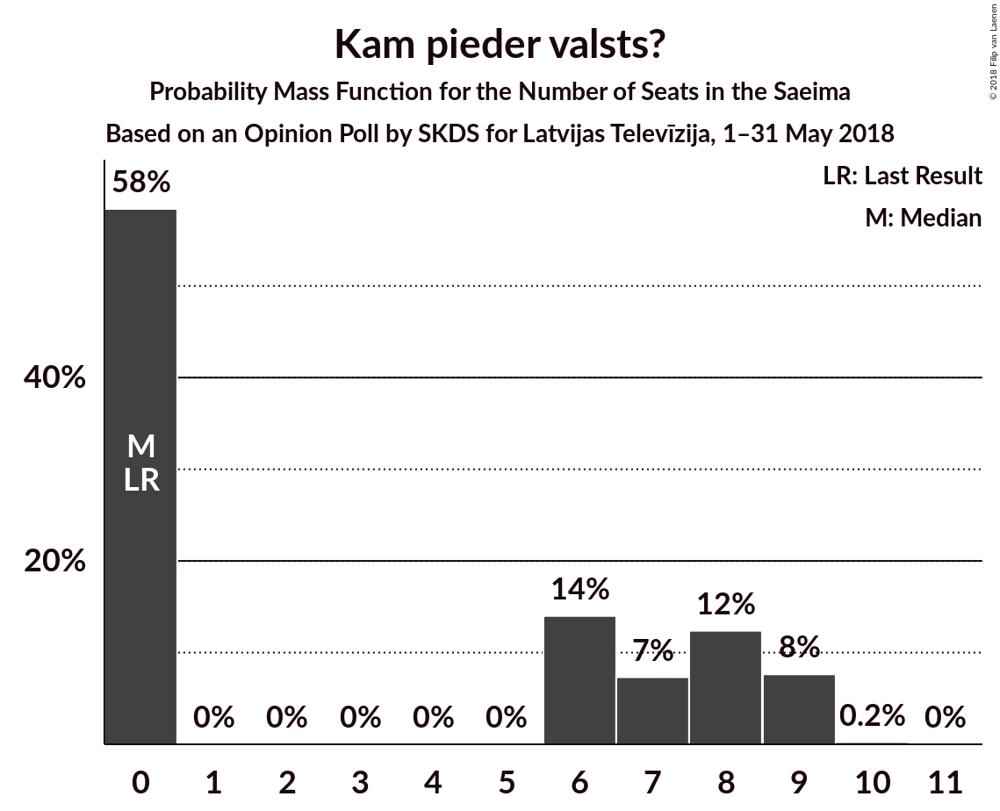

# Opinion Poll by SKDS for Latvijas Televīzija, 1–31 May 2018

<a href="#voting-intentions">Voting Intentions</a> | <a href="#seats">Seats</a> | <a href="#coalitions">Coalitions</a> | <a href="#technical-information">Technical Information</a>

## Voting Intentions

### Confidence Intervals

| Party | Last Result | Poll Result | 80% Confidence Interval | 90% Confidence Interval | 95% Confidence Interval | 99% Confidence Interval |
|:-----:|:-----------:|:-----------:|:-----------------------:|:-----------------------:|:-----------------------:|:-----------------------:|
| Sociāldemokrātiskā Partija “Saskaņa” | 23.0% | 32.5% | 30.1–35.0% |29.4–35.8% |28.8–36.4% |27.7–37.6% |
| Zaļo un Zemnieku savienība | 19.5% | 24.8% | 22.6–27.2% |22.0–27.9% |21.5–28.5% |20.5–29.7% |
| Nacionālā apvienība „Visu Latvijai!”–„Tēvzemei un Brīvībai/LNNK” | 16.6% | 11.9% | 10.3–13.8% |9.9–14.3% |9.5–14.8% |8.8–15.7% |
| Vienotība | 21.9% | 6.3% | 5.2–7.8% |4.9–8.2% |4.6–8.6% |4.1–9.3% |
| Kam pieder valsts? | 0.0% | 5.1% | 4.1–6.5% |3.8–6.9% |3.6–7.2% |3.2–7.9% |
| Kustība Par! | 0.0% | 5.1% | 4.1–6.5% |3.8–6.9% |3.6–7.2% |3.2–7.9% |
| Jaunā konservatīvā partija | 0.7% | 4.1% | 3.2–5.3% |3.0–5.7% |2.8–6.0% |2.4–6.7% |
| Latvijas Reģionu apvienība | 6.7% | 2.9% | 2.2–4.0% |2.0–4.3% |1.8–4.6% |1.5–5.2% |
| No sirds Latvijai | 6.8% | 2.7% | 2.0–3.8% |1.8–4.1% |1.7–4.4% |1.4–5.0% |
| Latvijas Krievu savienība | 1.6% | 2.2% | 1.6–3.2% |1.4–3.5% |1.3–3.7% |1.1–4.3% |

*Note:* The poll result column reflects the actual value used in the calculations. Published results may vary slightly, and in addition be rounded to fewer digits.

## Seats

### Confidence Intervals

| Party | Last Result | Median | 80% Confidence Interval | 90% Confidence Interval | 95% Confidence Interval | 99% Confidence Interval |
|:-----:|:-----------:|:------:|:-----------------------:|:-----------------------:|:-----------------------:|:-----------------------:|
| <a href="#sociāldemokrātiskā-partija-“saskaņa”">Sociāldemokrātiskā Partija “Saskaņa”</a> | 24 | 32 | 29–36 |28–37 |28–37 |27–37 |
| <a href="#zaļo-un-zemnieku-savienība">Zaļo un Zemnieku savienība</a> | 21 | 25 | 24–28 |23–29 |23–30 |21–30 |
| <a href="#nacionālā-apvienība-„visu-latvijai!”–„tēvzemei-un-brīvībai/lnnk”">Nacionālā apvienība „Visu Latvijai!”–„Tēvzemei un Brīvībai/LNNK”</a> | 17 | 12 | 11–15 |11–15 |10–15 |9–16 |
| <a href="#vienotība">Vienotība</a> | 23 | 7 | 7 |5–8 |5–8 |4–9 |
| <a href="#kam-pieder-valsts?">Kam pieder valsts?</a> | 0 | 6 | 4–7 |2–8 |2–8 |2–8 |
| <a href="#kustība-par!">Kustība Par!</a> | 0 | 6 | 3–7 |3–7 |3–7 |3–8 |
| <a href="#jaunā-konservatīvā-partija">Jaunā konservatīvā partija</a> | 0 | 3 | 2–6 |2–7 |2–7 |2–7 |
| <a href="#latvijas-reģionu-apvienība">Latvijas Reģionu apvienība</a> | 8 | 2 | 2–3 |2–4 |2–5 |1–6 |
| <a href="#no-sirds-latvijai">No sirds Latvijai</a> | 7 | 2 | 1–5 |1–5 |0–5 |0–5 |
| <a href="#latvijas-krievu-savienība">Latvijas Krievu savienība</a> | 0 | 2 | 1–2 |1–2 |1–4 |0–6 |

### Sociāldemokrātiskā Partija “Saskaņa”

*For a full overview of the results for this party, see the [Sociāldemokrātiskā Partija “Saskaņa”](party-sociāldemokrātiskāpartija“saskaņa”.html) page.*

| Number of Seats | Probability | Accumulated | Special Marks |
|:---------------:|:-----------:|:-----------:|:-------------:|
| 24 | 0% | 100% | Last Result |
| 25 | 0% | 100% |  |
| 26 | 0.1% | 100% |  |
| 27 | 1.2% | 99.9% |  |
| 28 | 5% | 98.7% |  |
| 29 | 7% | 94% |  |
| 30 | 3% | 87% |  |
| 31 | 9% | 83% |  |
| 32 | 32% | 74% | Median |
| 33 | 12% | 43% |  |
| 34 | 1.4% | 31% |  |
| 35 | 19% | 30% |  |
| 36 | 2% | 11% |  |
| 37 | 9% | 9% |  |
| 38 | 0.1% | 0.5% |  |
| 39 | 0.3% | 0.3% |  |
| 40 | 0% | 0% |  |

### Zaļo un Zemnieku savienība

*For a full overview of the results for this party, see the [Zaļo un Zemnieku savienība](party-zaļounzemniekusavienība.html) page.*

| Number of Seats | Probability | Accumulated | Special Marks |
|:---------------:|:-----------:|:-----------:|:-------------:|
| 19 | 0.1% | 100% |  |
| 20 | 0.4% | 99.9% |  |
| 21 | 1.1% | 99.5% | Last Result |
| 22 | 0.2% | 98% |  |
| 23 | 6% | 98% |  |
| 24 | 21% | 93% |  |
| 25 | 30% | 71% | Median |
| 26 | 10% | 42% |  |
| 27 | 9% | 32% |  |
| 28 | 13% | 23% |  |
| 29 | 6% | 9% |  |
| 30 | 3% | 3% |  |
| 31 | 0.2% | 0.3% |  |
| 32 | 0.1% | 0.1% |  |
| 33 | 0% | 0% |  |

### Nacionālā apvienība „Visu Latvijai!”–„Tēvzemei un Brīvībai/LNNK”

*For a full overview of the results for this party, see the [Nacionālā apvienība „Visu Latvijai!”–„Tēvzemei un Brīvībai/LNNK”](party-nacionālāapvienība„visulatvijai”–„tēvzemeiunbrīvībailnnk”.html) page.*

| Number of Seats | Probability | Accumulated | Special Marks |
|:---------------:|:-----------:|:-----------:|:-------------:|
| 7 | 0.2% | 100% |  |
| 8 | 0.1% | 99.8% |  |
| 9 | 1.4% | 99.7% |  |
| 10 | 3% | 98% |  |
| 11 | 40% | 95% |  |
| 12 | 5% | 55% | Median |
| 13 | 21% | 50% |  |
| 14 | 14% | 29% |  |
| 15 | 12% | 14% |  |
| 16 | 2% | 2% |  |
| 17 | 0.1% | 0.3% | Last Result |
| 18 | 0.2% | 0.2% |  |
| 19 | 0% | 0% |  |

### Vienotība

*For a full overview of the results for this party, see the [Vienotība](party-vienotība.html) page.*

| Number of Seats | Probability | Accumulated | Special Marks |
|:---------------:|:-----------:|:-----------:|:-------------:|
| 3 | 0.4% | 100% |  |
| 4 | 1.2% | 99.6% |  |
| 5 | 6% | 98% |  |
| 6 | 0.6% | 93% |  |
| 7 | 83% | 92% | Median |
| 8 | 7% | 9% |  |
| 9 | 1.3% | 1.5% |  |
| 10 | 0.1% | 0.1% |  |
| 11 | 0% | 0% |  |
| 12 | 0% | 0% |  |
| 13 | 0% | 0% |  |
| 14 | 0% | 0% |  |
| 15 | 0% | 0% |  |
| 16 | 0% | 0% |  |
| 17 | 0% | 0% |  |
| 18 | 0% | 0% |  |
| 19 | 0% | 0% |  |
| 20 | 0% | 0% |  |
| 21 | 0% | 0% |  |
| 22 | 0% | 0% |  |
| 23 | 0% | 0% | Last Result |

### Kam pieder valsts?

*For a full overview of the results for this party, see the [Kam pieder valsts?](party-kampiedervalsts.html) page.*

| Number of Seats | Probability | Accumulated | Special Marks |
|:---------------:|:-----------:|:-----------:|:-------------:|
| 0 | 0% | 100% | Last Result |
| 1 | 0% | 100% |  |
| 2 | 5% | 100% |  |
| 3 | 3% | 95% |  |
| 4 | 5% | 91% |  |
| 5 | 8% | 86% |  |
| 6 | 41% | 77% | Median |
| 7 | 30% | 36% |  |
| 8 | 6% | 6% |  |
| 9 | 0.5% | 0.5% |  |
| 10 | 0% | 0% |  |

### Kustība Par!

*For a full overview of the results for this party, see the [Kustība Par!](party-kustībapar.html) page.*

| Number of Seats | Probability | Accumulated | Special Marks |
|:---------------:|:-----------:|:-----------:|:-------------:|
| 0 | 0% | 100% | Last Result |
| 1 | 0% | 100% |  |
| 2 | 0.5% | 100% |  |
| 3 | 16% | 99.5% |  |
| 4 | 2% | 84% |  |
| 5 | 22% | 81% |  |
| 6 | 18% | 59% | Median |
| 7 | 40% | 42% |  |
| 8 | 1.2% | 1.3% |  |
| 9 | 0.1% | 0.1% |  |
| 10 | 0% | 0% |  |

### Jaunā konservatīvā partija

*For a full overview of the results for this party, see the [Jaunā konservatīvā partija](party-jaunākonservatīvāpartija.html) page.*

| Number of Seats | Probability | Accumulated | Special Marks |
|:---------------:|:-----------:|:-----------:|:-------------:|
| 0 | 0% | 100% | Last Result |
| 1 | 0.1% | 100% |  |
| 2 | 26% | 99.9% |  |
| 3 | 38% | 73% | Median |
| 4 | 2% | 36% |  |
| 5 | 3% | 34% |  |
| 6 | 23% | 31% |  |
| 7 | 8% | 8% |  |
| 8 | 0.1% | 0.1% |  |
| 9 | 0% | 0% |  |

### Latvijas Reģionu apvienība

*For a full overview of the results for this party, see the [Latvijas Reģionu apvienība](party-latvijasreģionuapvienība.html) page.*

| Number of Seats | Probability | Accumulated | Special Marks |
|:---------------:|:-----------:|:-----------:|:-------------:|
| 0 | 0.1% | 100% |  |
| 1 | 0.6% | 99.9% |  |
| 2 | 89% | 99.3% | Median |
| 3 | 1.0% | 11% |  |
| 4 | 7% | 10% |  |
| 5 | 0.6% | 3% |  |
| 6 | 2% | 2% |  |
| 7 | 0% | 0% |  |
| 8 | 0% | 0% | Last Result |

### No sirds Latvijai

*For a full overview of the results for this party, see the [No sirds Latvijai](party-nosirdslatvijai.html) page.*

| Number of Seats | Probability | Accumulated | Special Marks |
|:---------------:|:-----------:|:-----------:|:-------------:|
| 0 | 3% | 100% |  |
| 1 | 18% | 97% |  |
| 2 | 37% | 79% | Median |
| 3 | 3% | 43% |  |
| 4 | 25% | 40% |  |
| 5 | 15% | 15% |  |
| 6 | 0.3% | 0.3% |  |
| 7 | 0% | 0% | Last Result |

### Latvijas Krievu savienība

*For a full overview of the results for this party, see the [Latvijas Krievu savienība](party-latvijaskrievusavienība.html) page.*

| Number of Seats | Probability | Accumulated | Special Marks |
|:---------------:|:-----------:|:-----------:|:-------------:|
| 0 | 1.2% | 100% | Last Result |
| 1 | 12% | 98.8% |  |
| 2 | 83% | 87% | Median |
| 3 | 0.5% | 4% |  |
| 4 | 2% | 3% |  |
| 5 | 0.9% | 2% |  |
| 6 | 0.6% | 0.7% |  |
| 7 | 0% | 0% |  |

## Coalitions

## Technical Information

### Opinion Poll

+ **Polling firm:** SKDS
+ **Commissioner(s):** Latvijas Televīzija
+ **Fieldwork period:** 1–31 May 2018

### Calculations

+ **Sample size:** 588
+ **Simulations done:** 131,072
+ **Error estimate:** 3.48%

