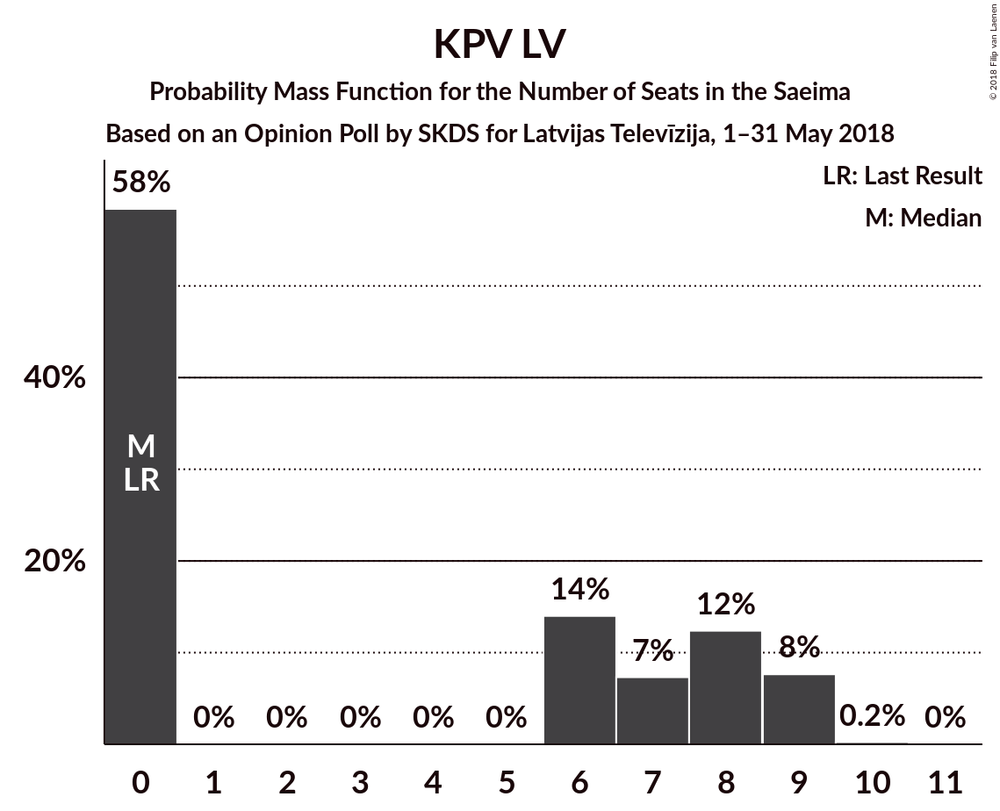

# Opinion Poll by SKDS for Latvijas Televīzija, 1–31 May 2018

<a href="#voting-intentions">Voting Intentions</a> | <a href="#seats">Seats</a> | <a href="#coalitions">Coalitions</a> | <a href="#technical-information">Technical Information</a>

## Voting Intentions

### Confidence Intervals

| Party | Last Result | Poll Result | 80% Confidence Interval | 90% Confidence Interval | 95% Confidence Interval | 99% Confidence Interval |
|:-----:|:-----------:|:-----------:|:-----------------------:|:-----------------------:|:-----------------------:|:-----------------------:|
| Sociāldemokrātiskā Partija “Saskaņa” | 23.0% | 32.5% | 30.1–35.0% |29.4–35.8% |28.8–36.4% |27.7–37.6% |
| Zaļo un Zemnieku savienība | 19.5% | 24.8% | 22.6–27.2% |22.0–27.9% |21.5–28.5% |20.5–29.7% |
| Nacionālā apvienība „Visu Latvijai!”–„Tēvzemei un Brīvībai/LNNK” | 16.6% | 11.9% | 10.3–13.8% |9.9–14.3% |9.5–14.8% |8.8–15.7% |
| Vienotība | 21.9% | 6.3% | 5.2–7.8% |4.9–8.2% |4.6–8.6% |4.1–9.3% |
| KPV LV | 0.0% | 5.1% | 4.1–6.5% |3.8–6.9% |3.6–7.2% |3.2–7.9% |
| Kustība Par! | 0.0% | 5.1% | 4.1–6.5% |3.8–6.9% |3.6–7.2% |3.2–7.9% |
| Jaunā konservatīvā partija | 0.7% | 4.1% | 3.2–5.3% |3.0–5.7% |2.8–6.0% |2.4–6.7% |
| Latvijas Reģionu apvienība | 6.7% | 2.9% | 2.2–4.0% |2.0–4.3% |1.8–4.6% |1.5–5.2% |
| No sirds Latvijai | 6.8% | 2.7% | 2.0–3.8% |1.8–4.1% |1.7–4.4% |1.4–5.0% |
| Latvijas Krievu savienība | 1.6% | 2.2% | 1.6–3.2% |1.4–3.5% |1.3–3.7% |1.1–4.3% |

*Note:* The poll result column reflects the actual value used in the calculations. Published results may vary slightly, and in addition be rounded to fewer digits.

## Seats

### Confidence Intervals

| Party | Last Result | Median | 80% Confidence Interval | 90% Confidence Interval | 95% Confidence Interval | 99% Confidence Interval |
|:-----:|:-----------:|:------:|:-----------------------:|:-----------------------:|:-----------------------:|:-----------------------:|
| <a href="#sociāldemokrātiskā-partija-“saskaņa”">Sociāldemokrātiskā Partija “Saskaņa”</a> | 24 | 39 | 35–41 |32–42 |32–42 |32–46 |
| <a href="#zaļo-un-zemnieku-savienība">Zaļo un Zemnieku savienība</a> | 21 | 30 | 27–34 |27–34 |25–35 |24–36 |
| <a href="#nacionālā-apvienība-„visu-latvijai!”–„tēvzemei-un-brīvībai/lnnk”">Nacionālā apvienība „Visu Latvijai!”–„Tēvzemei un Brīvībai/LNNK”</a> | 17 | 14 | 13–17 |12–17 |11–18 |10–20 |
| <a href="#vienotība">Vienotība</a> | 23 | 8 | 7–9 |0–9 |0–10 |0–11 |
| <a href="#kpv-lv">KPV LV</a> | 0 | 6 | 0–9 |0–9 |0–9 |0–9 |
| <a href="#kustība-par!">Kustība Par!</a> | 0 | 0 | 0–7 |0–8 |0–8 |0–10 |
| <a href="#jaunā-konservatīvā-partija">Jaunā konservatīvā partija</a> | 0 | 0 | 0–7 |0–7 |0–8 |0–8 |
| <a href="#latvijas-reģionu-apvienība">Latvijas Reģionu apvienība</a> | 8 | 0 | 0 |0 |0 |0 |
| <a href="#no-sirds-latvijai">No sirds Latvijai</a> | 7 | 0 | 0 |0 |0 |0 |
| <a href="#latvijas-krievu-savienība">Latvijas Krievu savienība</a> | 0 | 0 | 0 |0 |0 |0 |

### Sociāldemokrātiskā Partija “Saskaņa”

*For a full overview of the results for this party, see the [Sociāldemokrātiskā Partija “Saskaņa”](party-sociāldemokrātiskāpartija“saskaņa”.html) page.*

| Number of Seats | Probability | Accumulated | Special Marks |
|:---------------:|:-----------:|:-----------:|:-------------:|
| 24 | 0% | 100% | Last Result |
| 25 | 0% | 100% |  |
| 26 | 0% | 100% |  |
| 27 | 0% | 100% |  |
| 28 | 0% | 100% |  |
| 29 | 0% | 100% |  |
| 30 | 0.1% | 99.9% |  |
| 31 | 0.2% | 99.8% |  |
| 32 | 5% | 99.6% |  |
| 33 | 3% | 95% |  |
| 34 | 0.7% | 92% |  |
| 35 | 12% | 91% |  |
| 36 | 9% | 80% |  |
| 37 | 15% | 71% |  |
| 38 | 3% | 56% |  |
| 39 | 20% | 53% | Median |
| 40 | 15% | 33% |  |
| 41 | 12% | 18% |  |
| 42 | 5% | 6% |  |
| 43 | 0.2% | 1.5% |  |
| 44 | 0.4% | 1.3% |  |
| 45 | 0.1% | 0.9% |  |
| 46 | 0.7% | 0.8% |  |
| 47 | 0.1% | 0.1% |  |
| 48 | 0% | 0% |  |

### Zaļo un Zemnieku savienība

*For a full overview of the results for this party, see the [Zaļo un Zemnieku savienība](party-zaļounzemniekusavienība.html) page.*

| Number of Seats | Probability | Accumulated | Special Marks |
|:---------------:|:-----------:|:-----------:|:-------------:|
| 21 | 0% | 100% | Last Result |
| 22 | 0% | 100% |  |
| 23 | 0% | 100% |  |
| 24 | 2% | 100% |  |
| 25 | 2% | 98% |  |
| 26 | 1.1% | 96% |  |
| 27 | 6% | 95% |  |
| 28 | 6% | 89% |  |
| 29 | 16% | 83% |  |
| 30 | 21% | 67% | Median |
| 31 | 16% | 46% |  |
| 32 | 13% | 30% |  |
| 33 | 1.2% | 17% |  |
| 34 | 11% | 16% |  |
| 35 | 3% | 5% |  |
| 36 | 1.4% | 2% |  |
| 37 | 0.2% | 0.3% |  |
| 38 | 0.1% | 0.2% |  |
| 39 | 0% | 0% |  |

### Nacionālā apvienība „Visu Latvijai!”–„Tēvzemei un Brīvībai/LNNK”

*For a full overview of the results for this party, see the [Nacionālā apvienība „Visu Latvijai!”–„Tēvzemei un Brīvībai/LNNK”](party-nacionālāapvienība„visulatvijai”–„tēvzemeiunbrīvībailnnk”.html) page.*

| Number of Seats | Probability | Accumulated | Special Marks |
|:---------------:|:-----------:|:-----------:|:-------------:|
| 9 | 0.1% | 100% |  |
| 10 | 1.0% | 99.9% |  |
| 11 | 1.5% | 99.0% |  |
| 12 | 3% | 97% |  |
| 13 | 11% | 94% |  |
| 14 | 34% | 84% | Median |
| 15 | 5% | 49% |  |
| 16 | 8% | 45% |  |
| 17 | 33% | 36% | Last Result |
| 18 | 1.3% | 4% |  |
| 19 | 1.0% | 2% |  |
| 20 | 1.2% | 1.3% |  |
| 21 | 0.1% | 0.1% |  |
| 22 | 0% | 0% |  |

### Vienotība

*For a full overview of the results for this party, see the [Vienotība](party-vienotība.html) page.*

| Number of Seats | Probability | Accumulated | Special Marks |
|:---------------:|:-----------:|:-----------:|:-------------:|
| 0 | 8% | 100% |  |
| 1 | 0% | 92% |  |
| 2 | 0% | 92% |  |
| 3 | 0% | 92% |  |
| 4 | 0% | 92% |  |
| 5 | 0% | 92% |  |
| 6 | 0% | 92% |  |
| 7 | 27% | 92% |  |
| 8 | 44% | 65% | Median |
| 9 | 18% | 22% |  |
| 10 | 3% | 4% |  |
| 11 | 0.9% | 1.1% |  |
| 12 | 0.2% | 0.3% |  |
| 13 | 0% | 0% |  |
| 14 | 0% | 0% |  |
| 15 | 0% | 0% |  |
| 16 | 0% | 0% |  |
| 17 | 0% | 0% |  |
| 18 | 0% | 0% |  |
| 19 | 0% | 0% |  |
| 20 | 0% | 0% |  |
| 21 | 0% | 0% |  |
| 22 | 0% | 0% |  |
| 23 | 0% | 0% | Last Result |

### KPV LV

*For a full overview of the results for this party, see the [KPV LV](party-kpvlv.html) page.*

| Number of Seats | Probability | Accumulated | Special Marks |
|:---------------:|:-----------:|:-----------:|:-------------:|
| 0 | 39% | 100% | Last Result |
| 1 | 0% | 61% |  |
| 2 | 0% | 61% |  |
| 3 | 0% | 61% |  |
| 4 | 0% | 61% |  |
| 5 | 0% | 61% |  |
| 6 | 14% | 61% | Median |
| 7 | 3% | 47% |  |
| 8 | 24% | 44% |  |
| 9 | 20% | 20% |  |
| 10 | 0.1% | 0.2% |  |
| 11 | 0% | 0% |  |

### Kustība Par!

*For a full overview of the results for this party, see the [Kustība Par!](party-kustībapar.html) page.*

| Number of Seats | Probability | Accumulated | Special Marks |
|:---------------:|:-----------:|:-----------:|:-------------:|
| 0 | 56% | 100% | Last Result, Median |
| 1 | 0% | 44% |  |
| 2 | 0% | 44% |  |
| 3 | 0% | 44% |  |
| 4 | 0% | 44% |  |
| 5 | 0% | 44% |  |
| 6 | 0% | 44% |  |
| 7 | 36% | 44% |  |
| 8 | 5% | 7% |  |
| 9 | 1.4% | 2% |  |
| 10 | 0.7% | 0.8% |  |
| 11 | 0.1% | 0.1% |  |
| 12 | 0% | 0% |  |

### Jaunā konservatīvā partija

*For a full overview of the results for this party, see the [Jaunā konservatīvā partija](party-jaunākonservatīvāpartija.html) page.*

| Number of Seats | Probability | Accumulated | Special Marks |
|:---------------:|:-----------:|:-----------:|:-------------:|
| 0 | 85% | 100% | Last Result, Median |
| 1 | 0% | 15% |  |
| 2 | 0% | 15% |  |
| 3 | 0% | 15% |  |
| 4 | 0% | 15% |  |
| 5 | 0% | 15% |  |
| 6 | 2% | 15% |  |
| 7 | 9% | 13% |  |
| 8 | 4% | 4% |  |
| 9 | 0% | 0% |  |

### Latvijas Reģionu apvienība

*For a full overview of the results for this party, see the [Latvijas Reģionu apvienība](party-latvijasreģionuapvienība.html) page.*

| Number of Seats | Probability | Accumulated | Special Marks |
|:---------------:|:-----------:|:-----------:|:-------------:|
| 0 | 99.6% | 100% | Median |
| 1 | 0% | 0.4% |  |
| 2 | 0% | 0.4% |  |
| 3 | 0% | 0.4% |  |
| 4 | 0% | 0.4% |  |
| 5 | 0% | 0.4% |  |
| 6 | 0.3% | 0.4% |  |
| 7 | 0.1% | 0.1% |  |
| 8 | 0% | 0% | Last Result |

### No sirds Latvijai

*For a full overview of the results for this party, see the [No sirds Latvijai](party-nosirdslatvijai.html) page.*

| Number of Seats | Probability | Accumulated | Special Marks |
|:---------------:|:-----------:|:-----------:|:-------------:|
| 0 | 99.8% | 100% | Median |
| 1 | 0% | 0.2% |  |
| 2 | 0% | 0.2% |  |
| 3 | 0% | 0.2% |  |
| 4 | 0% | 0.2% |  |
| 5 | 0% | 0.2% |  |
| 6 | 0.1% | 0.2% |  |
| 7 | 0.1% | 0.1% | Last Result |
| 8 | 0% | 0% |  |

### Latvijas Krievu savienība

*For a full overview of the results for this party, see the [Latvijas Krievu savienība](party-latvijaskrievusavienība.html) page.*

| Number of Seats | Probability | Accumulated | Special Marks |
|:---------------:|:-----------:|:-----------:|:-------------:|
| 0 | 100% | 100% | Last Result, Median |

## Coalitions

### Confidence Intervals

| Coalition | Last Result | Median | Majority? | 80% Confidence Interval | 90% Confidence Interval | 95% Confidence Interval | 99% Confidence Interval |
|:---------:|:-----------:|:------:|:---------:|:-----------------------:|:-----------------------:|:-----------------------:|:-----------------------:|
| Zaļo un Zemnieku savienība – Nacionālā apvienība „Visu Latvijai!”–„Tēvzemei un Brīvībai/LNNK” – Vienotība – Kustība Par! – Jaunā konservatīvā partija | 61 | 58 | 98% | 53–61 | 53–62 | 52–65 | 50–67 |
| Zaļo un Zemnieku savienība – Nacionālā apvienība „Visu Latvijai!”–„Tēvzemei un Brīvībai/LNNK” – Vienotība – Kustība Par! | 61 | 56 | 94% | 52–60 | 50–61 | 48–61 | 44–64 |
| Zaļo un Zemnieku savienība – Nacionālā apvienība „Visu Latvijai!”–„Tēvzemei un Brīvībai/LNNK” – Vienotība – Jaunā konservatīvā partija | 61 | 53 | 87% | 50–60 | 48–60 | 48–60 | 46–61 |
| Zaļo un Zemnieku savienība – Nacionālā apvienība „Visu Latvijai!”–„Tēvzemei un Brīvībai/LNNK” – Vienotība | 61 | 53 | 81% | 49–60 | 46–60 | 44–60 | 41–61 |
| Zaļo un Zemnieku savienība – Nacionālā apvienība „Visu Latvijai!”–„Tēvzemei un Brīvībai/LNNK” – Kustība Par! – Jaunā konservatīvā partija | 38 | 50 | 46% | 45–55 | 45–58 | 44–59 | 43–62 |
| Zaļo un Zemnieku savienība – Nacionālā apvienība „Visu Latvijai!”–„Tēvzemei un Brīvībai/LNNK” – Kustība Par! | 38 | 49 | 38% | 45–52 | 44–53 | 43–55 | 40–58 |
| Zaļo un Zemnieku savienība – Nacionālā apvienība „Visu Latvijai!”–„Tēvzemei un Brīvībai/LNNK” – Jaunā konservatīvā partija | 38 | 46 | 20% | 43–51 | 42–53 | 41–54 | 37–58 |
| Sociāldemokrātiskā Partija “Saskaņa” – Kustība Par! – Jaunā konservatīvā partija | 24 | 41 | 2% | 37–49 | 36–50 | 35–50 | 35–53 |
| Sociāldemokrātiskā Partija “Saskaņa” – Kustība Par! | 24 | 40 | 0.7% | 37–48 | 35–48 | 35–48 | 35–52 |
| Nacionālā apvienība „Visu Latvijai!”–„Tēvzemei un Brīvībai/LNNK” – Vienotība – Kustība Par! – Jaunā konservatīvā partija | 40 | 26 | 0% | 22–32 | 22–34 | 22–37 | 19–38 |

### Zaļo un Zemnieku savienība – Nacionālā apvienība „Visu Latvijai!”–„Tēvzemei un Brīvībai/LNNK” – Vienotība – Kustība Par! – Jaunā konservatīvā partija

| Number of Seats | Probability | Accumulated | Special Marks |
|:---------------:|:-----------:|:-----------:|:-------------:|
| 46 | 0.1% | 100% |  |
| 47 | 0% | 99.9% |  |
| 48 | 0% | 99.9% |  |
| 49 | 0% | 99.9% |  |
| 50 | 2% | 99.8% |  |
| 51 | 0.2% | 98% | Majority |
| 52 | 2% | 98% | Median |
| 53 | 16% | 96% |  |
| 54 | 14% | 80% |  |
| 55 | 3% | 66% |  |
| 56 | 6% | 63% |  |
| 57 | 5% | 57% |  |
| 58 | 11% | 52% |  |
| 59 | 12% | 41% |  |
| 60 | 17% | 30% |  |
| 61 | 5% | 13% | Last Result |
| 62 | 3% | 8% |  |
| 63 | 1.2% | 5% |  |
| 64 | 0.3% | 4% |  |
| 65 | 1.0% | 3% |  |
| 66 | 0.6% | 2% |  |
| 67 | 2% | 2% |  |
| 68 | 0% | 0.1% |  |
| 69 | 0% | 0% |  |

### Zaļo un Zemnieku savienība – Nacionālā apvienība „Visu Latvijai!”–„Tēvzemei un Brīvībai/LNNK” – Vienotība – Kustība Par!

| Number of Seats | Probability | Accumulated | Special Marks |
|:---------------:|:-----------:|:-----------:|:-------------:|
| 44 | 1.3% | 100% |  |
| 45 | 0% | 98.6% |  |
| 46 | 0.5% | 98.6% |  |
| 47 | 0.1% | 98% |  |
| 48 | 1.2% | 98% |  |
| 49 | 0.6% | 97% |  |
| 50 | 2% | 96% |  |
| 51 | 4% | 94% | Majority |
| 52 | 2% | 90% | Median |
| 53 | 15% | 89% |  |
| 54 | 14% | 73% |  |
| 55 | 2% | 59% |  |
| 56 | 7% | 57% |  |
| 57 | 5% | 49% |  |
| 58 | 9% | 44% |  |
| 59 | 10% | 35% |  |
| 60 | 18% | 24% |  |
| 61 | 4% | 7% | Last Result |
| 62 | 1.0% | 2% |  |
| 63 | 0.7% | 1.4% |  |
| 64 | 0.2% | 0.6% |  |
| 65 | 0.2% | 0.4% |  |
| 66 | 0.2% | 0.2% |  |
| 67 | 0% | 0% |  |

### Zaļo un Zemnieku savienība – Nacionālā apvienība „Visu Latvijai!”–„Tēvzemei un Brīvībai/LNNK” – Vienotība – Jaunā konservatīvā partija

| Number of Seats | Probability | Accumulated | Special Marks |
|:---------------:|:-----------:|:-----------:|:-------------:|
| 44 | 0% | 100% |  |
| 45 | 0.1% | 99.9% |  |
| 46 | 0.8% | 99.8% |  |
| 47 | 1.1% | 99.0% |  |
| 48 | 3% | 98% |  |
| 49 | 5% | 95% |  |
| 50 | 3% | 90% |  |
| 51 | 8% | 87% | Majority |
| 52 | 12% | 79% | Median |
| 53 | 19% | 67% |  |
| 54 | 17% | 48% |  |
| 55 | 3% | 31% |  |
| 56 | 1.0% | 27% |  |
| 57 | 5% | 26% |  |
| 58 | 4% | 21% |  |
| 59 | 2% | 17% |  |
| 60 | 14% | 15% |  |
| 61 | 1.0% | 1.2% | Last Result |
| 62 | 0.1% | 0.2% |  |
| 63 | 0% | 0.1% |  |
| 64 | 0% | 0% |  |

### Zaļo un Zemnieku savienība – Nacionālā apvienība „Visu Latvijai!”–„Tēvzemei un Brīvībai/LNNK” – Vienotība

| Number of Seats | Probability | Accumulated | Special Marks |
|:---------------:|:-----------:|:-----------:|:-------------:|
| 40 | 0.1% | 100% |  |
| 41 | 1.2% | 99.9% |  |
| 42 | 0.1% | 98.7% |  |
| 43 | 0% | 98.6% |  |
| 44 | 2% | 98.6% |  |
| 45 | 0.2% | 96% |  |
| 46 | 1.2% | 96% |  |
| 47 | 2% | 95% |  |
| 48 | 2% | 93% |  |
| 49 | 7% | 91% |  |
| 50 | 3% | 84% |  |
| 51 | 12% | 81% | Majority |
| 52 | 11% | 69% | Median |
| 53 | 20% | 58% |  |
| 54 | 17% | 38% |  |
| 55 | 1.2% | 21% |  |
| 56 | 0.4% | 19% |  |
| 57 | 5% | 19% |  |
| 58 | 0.6% | 14% |  |
| 59 | 1.4% | 13% |  |
| 60 | 11% | 12% |  |
| 61 | 0.6% | 0.6% | Last Result |
| 62 | 0% | 0% |  |

### Zaļo un Zemnieku savienība – Nacionālā apvienība „Visu Latvijai!”–„Tēvzemei un Brīvībai/LNNK” – Kustība Par! – Jaunā konservatīvā partija

| Number of Seats | Probability | Accumulated | Special Marks |
|:---------------:|:-----------:|:-----------:|:-------------:|
| 38 | 0% | 100% | Last Result |
| 39 | 0% | 100% |  |
| 40 | 0.1% | 100% |  |
| 41 | 0.1% | 99.9% |  |
| 42 | 0.1% | 99.8% |  |
| 43 | 2% | 99.7% |  |
| 44 | 0.9% | 98% | Median |
| 45 | 14% | 97% |  |
| 46 | 3% | 83% |  |
| 47 | 12% | 80% |  |
| 48 | 3% | 67% |  |
| 49 | 10% | 64% |  |
| 50 | 7% | 53% |  |
| 51 | 20% | 46% | Majority |
| 52 | 10% | 26% |  |
| 53 | 3% | 16% |  |
| 54 | 3% | 13% |  |
| 55 | 2% | 10% |  |
| 56 | 1.4% | 8% |  |
| 57 | 0.3% | 6% |  |
| 58 | 3% | 6% |  |
| 59 | 0.5% | 3% |  |
| 60 | 2% | 2% |  |
| 61 | 0.1% | 0.6% |  |
| 62 | 0.5% | 0.5% |  |
| 63 | 0% | 0% |  |

### Zaļo un Zemnieku savienība – Nacionālā apvienība „Visu Latvijai!”–„Tēvzemei un Brīvībai/LNNK” – Kustība Par!

| Number of Seats | Probability | Accumulated | Special Marks |
|:---------------:|:-----------:|:-----------:|:-------------:|
| 38 | 0% | 100% | Last Result |
| 39 | 0.4% | 100% |  |
| 40 | 0.6% | 99.6% |  |
| 41 | 0.6% | 99.0% |  |
| 42 | 0.2% | 98% |  |
| 43 | 2% | 98% |  |
| 44 | 3% | 96% | Median |
| 45 | 15% | 93% |  |
| 46 | 3% | 77% |  |
| 47 | 12% | 75% |  |
| 48 | 6% | 63% |  |
| 49 | 11% | 57% |  |
| 50 | 7% | 45% |  |
| 51 | 22% | 38% | Majority |
| 52 | 8% | 16% |  |
| 53 | 4% | 8% |  |
| 54 | 0.9% | 4% |  |
| 55 | 2% | 3% |  |
| 56 | 0.2% | 1.4% |  |
| 57 | 0.2% | 1.2% |  |
| 58 | 0.6% | 1.0% |  |
| 59 | 0.1% | 0.4% |  |
| 60 | 0.2% | 0.2% |  |
| 61 | 0.1% | 0.1% |  |
| 62 | 0% | 0% |  |

### Zaļo un Zemnieku savienība – Nacionālā apvienība „Visu Latvijai!”–„Tēvzemei un Brīvībai/LNNK” – Jaunā konservatīvā partija

| Number of Seats | Probability | Accumulated | Special Marks |
|:---------------:|:-----------:|:-----------:|:-------------:|
| 36 | 0.5% | 100% |  |
| 37 | 0% | 99.5% |  |
| 38 | 0.1% | 99.5% | Last Result |
| 39 | 0.8% | 99.4% |  |
| 40 | 1.0% | 98.6% |  |
| 41 | 2% | 98% |  |
| 42 | 5% | 95% |  |
| 43 | 9% | 91% |  |
| 44 | 9% | 82% | Median |
| 45 | 22% | 73% |  |
| 46 | 4% | 50% |  |
| 47 | 15% | 47% |  |
| 48 | 3% | 31% |  |
| 49 | 7% | 29% |  |
| 50 | 1.2% | 22% |  |
| 51 | 11% | 20% | Majority |
| 52 | 4% | 10% |  |
| 53 | 3% | 6% |  |
| 54 | 0.7% | 3% |  |
| 55 | 0.1% | 2% |  |
| 56 | 0% | 2% |  |
| 57 | 0% | 2% |  |
| 58 | 2% | 2% |  |
| 59 | 0% | 0.1% |  |
| 60 | 0% | 0.1% |  |
| 61 | 0% | 0.1% |  |
| 62 | 0% | 0% |  |

### Sociāldemokrātiskā Partija “Saskaņa” – Kustība Par! – Jaunā konservatīvā partija

| Number of Seats | Probability | Accumulated | Special Marks |
|:---------------:|:-----------:|:-----------:|:-------------:|
| 24 | 0% | 100% | Last Result |
| 25 | 0% | 100% |  |
| 26 | 0% | 100% |  |
| 27 | 0% | 100% |  |
| 28 | 0% | 100% |  |
| 29 | 0% | 100% |  |
| 30 | 0% | 100% |  |
| 31 | 0% | 100% |  |
| 32 | 0% | 100% |  |
| 33 | 0% | 100% |  |
| 34 | 0% | 100% |  |
| 35 | 5% | 99.9% |  |
| 36 | 0.1% | 95% |  |
| 37 | 12% | 95% |  |
| 38 | 0.5% | 83% |  |
| 39 | 19% | 82% | Median |
| 40 | 13% | 63% |  |
| 41 | 3% | 50% |  |
| 42 | 5% | 47% |  |
| 43 | 7% | 42% |  |
| 44 | 2% | 35% |  |
| 45 | 3% | 32% |  |
| 46 | 4% | 29% |  |
| 47 | 3% | 24% |  |
| 48 | 11% | 21% |  |
| 49 | 4% | 10% |  |
| 50 | 4% | 6% |  |
| 51 | 0.2% | 2% | Majority |
| 52 | 0.7% | 2% |  |
| 53 | 0.5% | 1.0% |  |
| 54 | 0.4% | 0.5% |  |
| 55 | 0.1% | 0.1% |  |
| 56 | 0% | 0% |  |

### Sociāldemokrātiskā Partija “Saskaņa” – Kustība Par!

| Number of Seats | Probability | Accumulated | Special Marks |
|:---------------:|:-----------:|:-----------:|:-------------:|
| 24 | 0% | 100% | Last Result |
| 25 | 0% | 100% |  |
| 26 | 0% | 100% |  |
| 27 | 0% | 100% |  |
| 28 | 0% | 100% |  |
| 29 | 0% | 100% |  |
| 30 | 0% | 100% |  |
| 31 | 0% | 100% |  |
| 32 | 0% | 99.9% |  |
| 33 | 0.1% | 99.9% |  |
| 34 | 0.1% | 99.8% |  |
| 35 | 5% | 99.7% |  |
| 36 | 0.6% | 95% |  |
| 37 | 12% | 94% |  |
| 38 | 1.0% | 82% |  |
| 39 | 21% | 81% | Median |
| 40 | 16% | 60% |  |
| 41 | 4% | 44% |  |
| 42 | 10% | 40% |  |
| 43 | 8% | 30% |  |
| 44 | 3% | 22% |  |
| 45 | 2% | 19% |  |
| 46 | 4% | 18% |  |
| 47 | 0.8% | 13% |  |
| 48 | 10% | 12% |  |
| 49 | 1.0% | 2% |  |
| 50 | 0.7% | 1.4% |  |
| 51 | 0% | 0.7% | Majority |
| 52 | 0.4% | 0.7% |  |
| 53 | 0% | 0.3% |  |
| 54 | 0.3% | 0.3% |  |
| 55 | 0% | 0% |  |

### Nacionālā apvienība „Visu Latvijai!”–„Tēvzemei un Brīvībai/LNNK” – Vienotība – Kustība Par! – Jaunā konservatīvā partija

| Number of Seats | Probability | Accumulated | Special Marks |
|:---------------:|:-----------:|:-----------:|:-------------:|
| 14 | 0.2% | 100% |  |
| 15 | 0% | 99.8% |  |
| 16 | 0.1% | 99.8% |  |
| 17 | 0.1% | 99.7% |  |
| 18 | 0.1% | 99.6% |  |
| 19 | 0.2% | 99.5% |  |
| 20 | 0.3% | 99.4% |  |
| 21 | 0.4% | 99.0% |  |
| 22 | 17% | 98.6% | Median |
| 23 | 3% | 82% |  |
| 24 | 15% | 79% |  |
| 25 | 6% | 64% |  |
| 26 | 11% | 58% |  |
| 27 | 7% | 47% |  |
| 28 | 6% | 40% |  |
| 29 | 16% | 34% |  |
| 30 | 4% | 19% |  |
| 31 | 1.2% | 14% |  |
| 32 | 4% | 13% |  |
| 33 | 4% | 9% |  |
| 34 | 0.5% | 5% |  |
| 35 | 2% | 5% |  |
| 36 | 0.1% | 3% |  |
| 37 | 1.2% | 3% |  |
| 38 | 2% | 2% |  |
| 39 | 0.1% | 0.2% |  |
| 40 | 0% | 0.1% | Last Result |
| 41 | 0.1% | 0.1% |  |
| 42 | 0% | 0% |  |

## Technical Information

### Opinion Poll

+ **Polling firm:** SKDS
+ **Commissioner(s):** Latvijas Televīzija
+ **Fieldwork period:** 1–31 May 2018

### Calculations

+ **Sample size:** 588
+ **Simulations done:** 131,072
+ **Error estimate:** 3.48%

