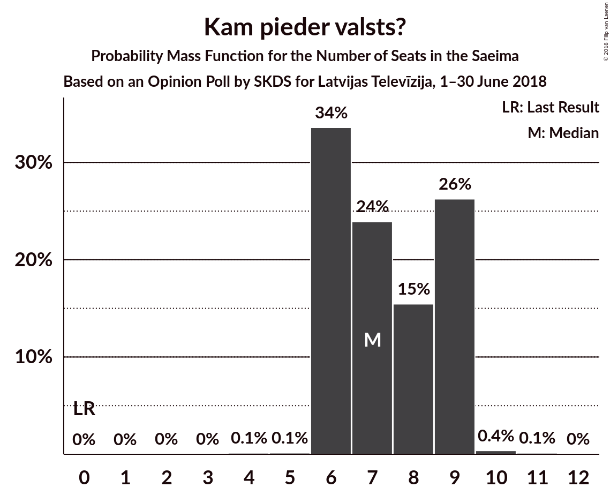

# Opinion Poll by SKDS for Latvijas Televīzija, 1–30 June 2018

<a href="#voting-intentions">Voting Intentions</a> | <a href="#seats">Seats</a> | <a href="#coalitions">Coalitions</a> | <a href="#technical-information">Technical Information</a>

## Voting Intentions

### Confidence Intervals

| Party | Last Result | Poll Result | 80% Confidence Interval | 90% Confidence Interval | 95% Confidence Interval | 99% Confidence Interval |
|:-----:|:-----------:|:-----------:|:-----------------------:|:-----------------------:|:-----------------------:|:-----------------------:|
| Sociāldemokrātiskā Partija “Saskaņa” | 23.0% | 33.3% | 30.9–35.8% |30.3–36.4% |29.7–37.1% |28.6–38.3% |
| Zaļo un Zemnieku savienība | 19.5% | 22.8% | 20.8–25.1% |20.2–25.7% |19.7–26.3% |18.8–27.4% |
| Nacionālā apvienība „Visu Latvijai!”–„Tēvzemei un Brīvībai/LNNK” | 16.6% | 9.7% | 8.3–11.3% |7.9–11.8% |7.6–12.2% |7.0–13.1% |
| Kustība Par! | 0.0% | 7.4% | 6.3–9.0% |5.9–9.4% |5.6–9.8% |5.1–10.5% |
| Kam pieder valsts? | 0.0% | 7.0% | 5.8–8.4% |5.5–8.9% |5.2–9.2% |4.7–10.0% |
| Jaunā konservatīvā partija | 0.7% | 6.3% | 5.2–7.8% |4.9–8.2% |4.7–8.5% |4.2–9.3% |
| Vienotība | 21.9% | 4.3% | 3.4–5.5% |3.2–5.9% |3.0–6.2% |2.6–6.8% |
| Latvijas Reģionu apvienība | 6.7% | 2.7% | 2.0–3.7% |1.8–4.0% |1.7–4.3% |1.4–4.8% |
| No sirds Latvijai | 6.8% | 2.4% | 1.8–3.4% |1.6–3.6% |1.4–3.9% |1.2–4.4% |
| Latvijas Krievu savienība | 1.6% | 1.9% | 1.4–2.8% |1.2–3.1% |1.1–3.3% |0.9–3.8% |

*Note:* The poll result column reflects the actual value used in the calculations. Published results may vary slightly, and in addition be rounded to fewer digits.

## Seats

### Confidence Intervals

| Party | Last Result | Median | 80% Confidence Interval | 90% Confidence Interval | 95% Confidence Interval | 99% Confidence Interval |
|:-----:|:-----------:|:------:|:-----------------------:|:-----------------------:|:-----------------------:|:-----------------------:|
| <a href="#sociāldemokrātiskā-partija-“saskaņa”">Sociāldemokrātiskā Partija “Saskaņa”</a> | 24 | 34 | 31–36 |30–37 |29–37 |28–37 |
| <a href="#zaļo-un-zemnieku-savienība">Zaļo un Zemnieku savienība</a> | 21 | 24 | 23–26 |22–28 |21–28 |20–30 |
| <a href="#nacionālā-apvienība-„visu-latvijai!”–„tēvzemei-un-brīvībai/lnnk”">Nacionālā apvienība „Visu Latvijai!”–„Tēvzemei un Brīvībai/LNNK”</a> | 17 | 9 | 7–11 |7–12 |7–13 |6–14 |
| <a href="#kustība-par!">Kustība Par!</a> | 0 | 8 | 7–9 |7–10 |7–10 |6–11 |
| <a href="#kam-pieder-valsts?">Kam pieder valsts?</a> | 0 | 7 | 6–9 |6–9 |6–9 |6–10 |
| <a href="#jaunā-konservatīvā-partija">Jaunā konservatīvā partija</a> | 0 | 7 | 6–8 |6–8 |6–8 |4–9 |
| <a href="#vienotība">Vienotība</a> | 23 | 4 | 3–7 |2–7 |2–7 |2–7 |
| <a href="#latvijas-reģionu-apvienība">Latvijas Reģionu apvienība</a> | 8 | 2 | 2 |2–4 |2–4 |0–6 |
| <a href="#no-sirds-latvijai">No sirds Latvijai</a> | 7 | 2 | 1–4 |0–5 |0–5 |0–5 |
| <a href="#latvijas-krievu-savienība">Latvijas Krievu savienība</a> | 0 | 2 | 1–2 |1–2 |0–2 |0–3 |

### Sociāldemokrātiskā Partija “Saskaņa”

*For a full overview of the results for this party, see the [Sociāldemokrātiskā Partija “Saskaņa”](party-sociāldemokrātiskāpartija“saskaņa”.html) page.*

| Number of Seats | Probability | Accumulated | Special Marks |
|:---------------:|:-----------:|:-----------:|:-------------:|
| 24 | 0% | 100% | Last Result |
| 25 | 0% | 100% |  |
| 26 | 0% | 100% |  |
| 27 | 0.1% | 100% |  |
| 28 | 1.3% | 99.8% |  |
| 29 | 1.5% | 98.5% |  |
| 30 | 2% | 97% |  |
| 31 | 12% | 95% |  |
| 32 | 11% | 83% |  |
| 33 | 18% | 72% |  |
| 34 | 29% | 54% | Median |
| 35 | 14% | 25% |  |
| 36 | 6% | 11% |  |
| 37 | 5% | 5% |  |
| 38 | 0.2% | 0.2% |  |
| 39 | 0% | 0% |  |

### Zaļo un Zemnieku savienība

*For a full overview of the results for this party, see the [Zaļo un Zemnieku savienība](party-zaļounzemniekusavienība.html) page.*

| Number of Seats | Probability | Accumulated | Special Marks |
|:---------------:|:-----------:|:-----------:|:-------------:|
| 18 | 0.1% | 100% |  |
| 19 | 0.4% | 99.9% |  |
| 20 | 1.3% | 99.6% |  |
| 21 | 2% | 98% | Last Result |
| 22 | 4% | 96% |  |
| 23 | 13% | 92% |  |
| 24 | 30% | 79% | Median |
| 25 | 27% | 50% |  |
| 26 | 14% | 23% |  |
| 27 | 4% | 9% |  |
| 28 | 5% | 6% |  |
| 29 | 0.2% | 0.8% |  |
| 30 | 0.5% | 0.5% |  |
| 31 | 0% | 0% |  |

### Nacionālā apvienība „Visu Latvijai!”–„Tēvzemei un Brīvībai/LNNK”

*For a full overview of the results for this party, see the [Nacionālā apvienība „Visu Latvijai!”–„Tēvzemei un Brīvībai/LNNK”](party-nacionālāapvienība„visulatvijai”–„tēvzemeiunbrīvībailnnk”.html) page.*

| Number of Seats | Probability | Accumulated | Special Marks |
|:---------------:|:-----------:|:-----------:|:-------------:|
| 6 | 0.6% | 100% |  |
| 7 | 14% | 99.4% |  |
| 8 | 12% | 86% |  |
| 9 | 32% | 73% | Median |
| 10 | 12% | 41% |  |
| 11 | 23% | 29% |  |
| 12 | 3% | 6% |  |
| 13 | 2% | 3% |  |
| 14 | 0.5% | 0.6% |  |
| 15 | 0.1% | 0.1% |  |
| 16 | 0% | 0% |  |
| 17 | 0% | 0% | Last Result |

### Kustība Par!

*For a full overview of the results for this party, see the [Kustība Par!](party-kustībapar.html) page.*

| Number of Seats | Probability | Accumulated | Special Marks |
|:---------------:|:-----------:|:-----------:|:-------------:|
| 0 | 0% | 100% | Last Result |
| 1 | 0% | 100% |  |
| 2 | 0% | 100% |  |
| 3 | 0% | 100% |  |
| 4 | 0% | 100% |  |
| 5 | 0.3% | 100% |  |
| 6 | 0.2% | 99.7% |  |
| 7 | 44% | 99.4% |  |
| 8 | 43% | 56% | Median |
| 9 | 4% | 13% |  |
| 10 | 8% | 8% |  |
| 11 | 0.7% | 0.7% |  |
| 12 | 0% | 0% |  |

### Kam pieder valsts?

*For a full overview of the results for this party, see the [Kam pieder valsts?](party-kampiedervalsts.html) page.*

| Number of Seats | Probability | Accumulated | Special Marks |
|:---------------:|:-----------:|:-----------:|:-------------:|
| 0 | 0% | 100% | Last Result |
| 1 | 0% | 100% |  |
| 2 | 0% | 100% |  |
| 3 | 0% | 100% |  |
| 4 | 0.1% | 100% |  |
| 5 | 0.1% | 99.8% |  |
| 6 | 34% | 99.7% |  |
| 7 | 24% | 66% | Median |
| 8 | 15% | 42% |  |
| 9 | 26% | 27% |  |
| 10 | 0.4% | 0.5% |  |
| 11 | 0.1% | 0.1% |  |
| 12 | 0% | 0% |  |

### Jaunā konservatīvā partija

*For a full overview of the results for this party, see the [Jaunā konservatīvā partija](party-jaunākonservatīvāpartija.html) page.*

| Number of Seats | Probability | Accumulated | Special Marks |
|:---------------:|:-----------:|:-----------:|:-------------:|
| 0 | 0% | 100% | Last Result |
| 1 | 0% | 100% |  |
| 2 | 0% | 100% |  |
| 3 | 0.1% | 100% |  |
| 4 | 1.0% | 99.9% |  |
| 5 | 1.0% | 98.8% |  |
| 6 | 14% | 98% |  |
| 7 | 68% | 84% | Median |
| 8 | 15% | 16% |  |
| 9 | 0.3% | 0.7% |  |
| 10 | 0.3% | 0.3% |  |
| 11 | 0% | 0% |  |

### Vienotība

*For a full overview of the results for this party, see the [Vienotība](party-vienotība.html) page.*

| Number of Seats | Probability | Accumulated | Special Marks |
|:---------------:|:-----------:|:-----------:|:-------------:|
| 2 | 8% | 100% |  |
| 3 | 25% | 92% |  |
| 4 | 18% | 67% | Median |
| 5 | 33% | 48% |  |
| 6 | 5% | 15% |  |
| 7 | 11% | 11% |  |
| 8 | 0.1% | 0.1% |  |
| 9 | 0% | 0% |  |
| 10 | 0% | 0% |  |
| 11 | 0% | 0% |  |
| 12 | 0% | 0% |  |
| 13 | 0% | 0% |  |
| 14 | 0% | 0% |  |
| 15 | 0% | 0% |  |
| 16 | 0% | 0% |  |
| 17 | 0% | 0% |  |
| 18 | 0% | 0% |  |
| 19 | 0% | 0% |  |
| 20 | 0% | 0% |  |
| 21 | 0% | 0% |  |
| 22 | 0% | 0% |  |
| 23 | 0% | 0% | Last Result |

### Latvijas Reģionu apvienība

*For a full overview of the results for this party, see the [Latvijas Reģionu apvienība](party-latvijasreģionuapvienība.html) page.*

| Number of Seats | Probability | Accumulated | Special Marks |
|:---------------:|:-----------:|:-----------:|:-------------:|
| 0 | 0.7% | 100% |  |
| 1 | 0.8% | 99.3% |  |
| 2 | 92% | 98.6% | Median |
| 3 | 1.3% | 6% |  |
| 4 | 4% | 5% |  |
| 5 | 0.3% | 1.0% |  |
| 6 | 0.7% | 0.7% |  |
| 7 | 0% | 0% |  |
| 8 | 0% | 0% | Last Result |

### No sirds Latvijai

*For a full overview of the results for this party, see the [No sirds Latvijai](party-nosirdslatvijai.html) page.*

| Number of Seats | Probability | Accumulated | Special Marks |
|:---------------:|:-----------:|:-----------:|:-------------:|
| 0 | 7% | 100% |  |
| 1 | 12% | 93% |  |
| 2 | 53% | 81% | Median |
| 3 | 7% | 28% |  |
| 4 | 14% | 21% |  |
| 5 | 8% | 8% |  |
| 6 | 0.1% | 0.1% |  |
| 7 | 0% | 0% | Last Result |

### Latvijas Krievu savienība

*For a full overview of the results for this party, see the [Latvijas Krievu savienība](party-latvijaskrievusavienība.html) page.*

| Number of Seats | Probability | Accumulated | Special Marks |
|:---------------:|:-----------:|:-----------:|:-------------:|
| 0 | 4% | 100% | Last Result |
| 1 | 12% | 96% |  |
| 2 | 82% | 84% | Median |
| 3 | 1.3% | 2% |  |
| 4 | 0.2% | 0.5% |  |
| 5 | 0.2% | 0.3% |  |
| 6 | 0% | 0% |  |

## Coalitions

## Technical Information

### Opinion Poll

+ **Polling firm:** SKDS
+ **Commissioner(s):** Latvijas Televīzija
+ **Fieldwork period:** 1–30 June 2018

### Calculations

+ **Sample size:** 631
+ **Simulations done:** 1,048,576
+ **Error estimate:** 1.95%

