# Opinion Poll by SKDS for Latvijas Televīzija, 1–30 June 2018

<a href="#voting-intentions">Voting Intentions</a> | <a href="#seats">Seats</a> | <a href="#coalitions">Coalitions</a> | <a href="#technical-information">Technical Information</a>

## Voting Intentions

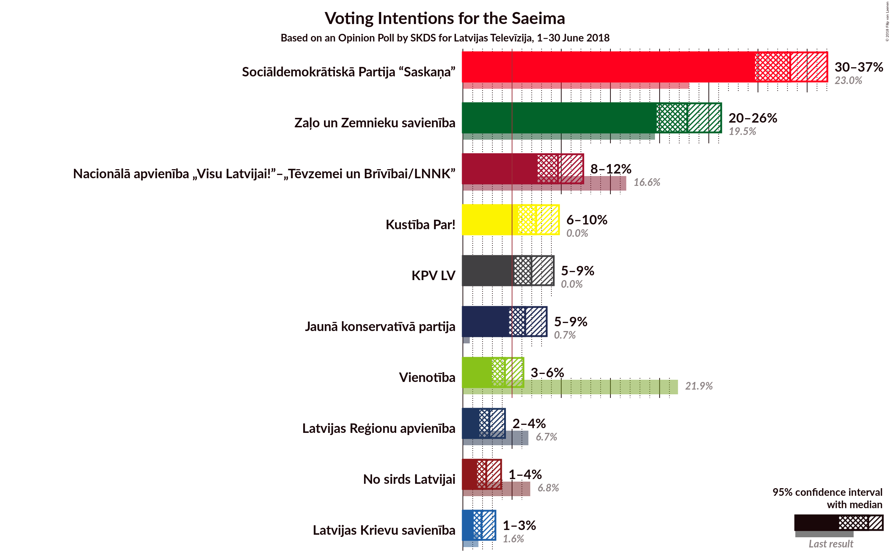

### Confidence Intervals

| Party | Last Result | Poll Result | 80% Confidence Interval | 90% Confidence Interval | 95% Confidence Interval | 99% Confidence Interval |
|:-----:|:-----------:|:-----------:|:-----------------------:|:-----------------------:|:-----------------------:|:-----------------------:|
| Sociāldemokrātiskā Partija “Saskaņa” | 23.0% | 33.4% | 31.1–35.9% |30.4–36.6% |29.9–37.2% |28.8–38.4% |
| Zaļo un Zemnieku savienība | 19.5% | 23.0% | 20.9–25.2% |20.4–25.9% |19.9–26.4% |18.9–27.5% |
| Nacionālā apvienība „Visu Latvijai!”–„Tēvzemei un Brīvībai/LNNK” | 16.6% | 9.7% | 8.3–11.3% |7.9–11.8% |7.6–12.2% |7.0–13.1% |
| Kustība Par! | 0.0% | 7.4% | 6.3–9.0% |5.9–9.4% |5.6–9.8% |5.1–10.5% |
| KPV LV | 0.0% | 7.0% | 5.8–8.4% |5.5–8.9% |5.2–9.2% |4.7–10.0% |
| Jaunā konservatīvā partija | 0.7% | 6.3% | 5.2–7.8% |4.9–8.2% |4.7–8.5% |4.2–9.3% |
| Vienotība | 21.9% | 4.3% | 3.4–5.5% |3.2–5.9% |3.0–6.2% |2.6–6.8% |
| Latvijas Reģionu apvienība | 6.7% | 2.7% | 2.0–3.7% |1.8–4.0% |1.7–4.3% |1.4–4.8% |
| No sirds Latvijai | 6.8% | 2.4% | 1.8–3.4% |1.6–3.6% |1.4–3.9% |1.2–4.4% |
| Latvijas Krievu savienība | 1.6% | 1.9% | 1.4–2.8% |1.2–3.1% |1.1–3.3% |0.9–3.8% |
| Progresīvie | 0.0% | 1.7% | 1.2–2.6% |1.1–2.9% |1.0–3.1% |0.8–3.6% |

*Note:* The poll result column reflects the actual value used in the calculations. Published results may vary slightly, and in addition be rounded to fewer digits.

## Seats

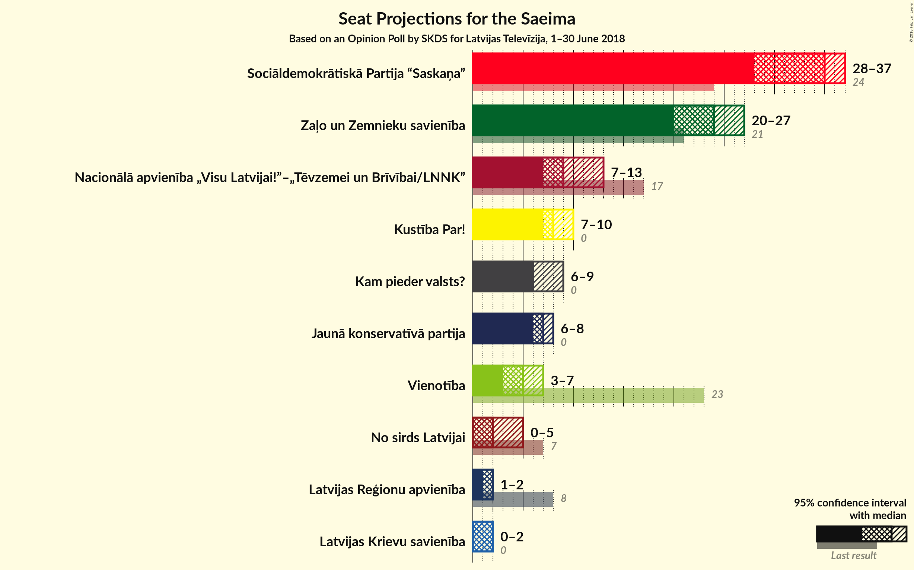

### Confidence Intervals

| Party | Last Result | Median | 80% Confidence Interval | 90% Confidence Interval | 95% Confidence Interval | 99% Confidence Interval |
|:-----:|:-----------:|:------:|:-----------------------:|:-----------------------:|:-----------------------:|:-----------------------:|
| <a href="#sociāldemokrātiskā-partija-“saskaņa”">Sociāldemokrātiskā Partija “Saskaņa”</a> | 24 | 35 | 33–39 |33–40 |32–41 |30–43 |
| <a href="#zaļo-un-zemnieku-savienība">Zaļo un Zemnieku savienība</a> | 21 | 26 | 24–29 |24–30 |24–30 |23–32 |
| <a href="#nacionālā-apvienība-„visu-latvijai!”–„tēvzemei-un-brīvībai/lnnk”">Nacionālā apvienība „Visu Latvijai!”–„Tēvzemei un Brīvībai/LNNK”</a> | 17 | 11 | 9–13 |8–14 |8–14 |7–15 |
| <a href="#kustība-par!">Kustība Par!</a> | 0 | 9 | 7–11 |7–11 |7–11 |7–12 |
| <a href="#kpv-lv">KPV LV</a> | 0 | 8 | 7–9 |6–9 |6–10 |6–11 |
| <a href="#jaunā-konservatīvā-partija">Jaunā konservatīvā partija</a> | 0 | 7 | 7–8 |7–8 |0–9 |0–10 |
| <a href="#vienotība">Vienotība</a> | 23 | 0 | 0–7 |0–7 |0–7 |0–7 |
| <a href="#latvijas-reģionu-apvienība">Latvijas Reģionu apvienība</a> | 8 | 0 | 0 |0 |0 |0 |
| <a href="#no-sirds-latvijai">No sirds Latvijai</a> | 7 | 0 | 0 |0 |0 |0 |
| <a href="#latvijas-krievu-savienība">Latvijas Krievu savienība</a> | 0 | 0 | 0 |0 |0 |0 |
| <a href="#progresīvie">Progresīvie</a> | 0 | 0 | 0 |0 |0 |0 |

### Sociāldemokrātiskā Partija “Saskaņa”

*For a full overview of the results for this party, see the [Sociāldemokrātiskā Partija “Saskaņa”](party-sociāldemokrātiskāpartija“saskaņa”.html) page.*

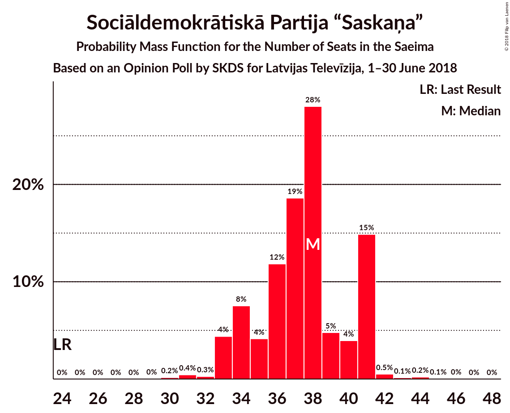

| Number of Seats | Probability | Accumulated | Special Marks |
|:---------------:|:-----------:|:-----------:|:-------------:|
| 24 | 0% | 100% | Last Result |
| 25 | 0% | 100% |  |
| 26 | 0% | 100% |  |
| 27 | 0% | 100% |  |
| 28 | 0% | 100% |  |
| 29 | 0% | 100% |  |
| 30 | 1.4% | 100% |  |
| 31 | 0.2% | 98.5% |  |
| 32 | 2% | 98% |  |
| 33 | 10% | 96% |  |
| 34 | 12% | 86% |  |
| 35 | 28% | 74% | Median |
| 36 | 14% | 46% |  |
| 37 | 5% | 32% |  |
| 38 | 12% | 26% |  |
| 39 | 7% | 15% |  |
| 40 | 4% | 7% |  |
| 41 | 1.1% | 3% |  |
| 42 | 1.2% | 2% |  |
| 43 | 0.6% | 0.7% |  |
| 44 | 0% | 0.1% |  |
| 45 | 0.1% | 0.1% |  |
| 46 | 0% | 0% |  |

### Zaļo un Zemnieku savienība

*For a full overview of the results for this party, see the [Zaļo un Zemnieku savienība](party-zaļounzemniekusavienība.html) page.*

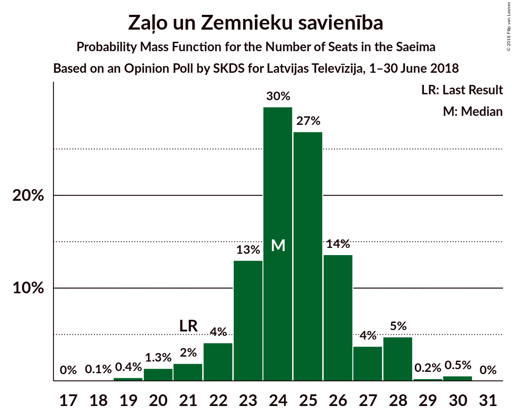

| Number of Seats | Probability | Accumulated | Special Marks |
|:---------------:|:-----------:|:-----------:|:-------------:|
| 21 | 0% | 100% | Last Result |
| 22 | 0.2% | 99.9% |  |
| 23 | 2% | 99.7% |  |
| 24 | 27% | 98% |  |
| 25 | 18% | 71% |  |
| 26 | 12% | 53% | Median |
| 27 | 11% | 41% |  |
| 28 | 7% | 30% |  |
| 29 | 18% | 23% |  |
| 30 | 3% | 5% |  |
| 31 | 0.7% | 2% |  |
| 32 | 1.0% | 1.3% |  |
| 33 | 0.1% | 0.4% |  |
| 34 | 0.1% | 0.3% |  |
| 35 | 0.2% | 0.3% |  |
| 36 | 0% | 0% |  |

### Nacionālā apvienība „Visu Latvijai!”–„Tēvzemei un Brīvībai/LNNK”

*For a full overview of the results for this party, see the [Nacionālā apvienība „Visu Latvijai!”–„Tēvzemei un Brīvībai/LNNK”](party-nacionālāapvienība„visulatvijai”–„tēvzemeiunbrīvībailnnk”.html) page.*

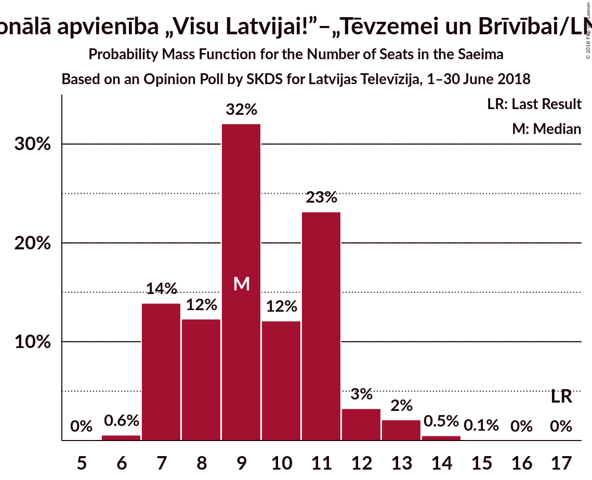

| Number of Seats | Probability | Accumulated | Special Marks |
|:---------------:|:-----------:|:-----------:|:-------------:|
| 6 | 0.1% | 100% |  |
| 7 | 1.1% | 99.9% |  |
| 8 | 6% | 98.8% |  |
| 9 | 20% | 93% |  |
| 10 | 7% | 73% |  |
| 11 | 33% | 66% | Median |
| 12 | 21% | 33% |  |
| 13 | 6% | 11% |  |
| 14 | 4% | 6% |  |
| 15 | 1.4% | 2% |  |
| 16 | 0.1% | 0.1% |  |
| 17 | 0.1% | 0.1% | Last Result |
| 18 | 0% | 0% |  |

### Kustība Par!

*For a full overview of the results for this party, see the [Kustība Par!](party-kustībapar.html) page.*

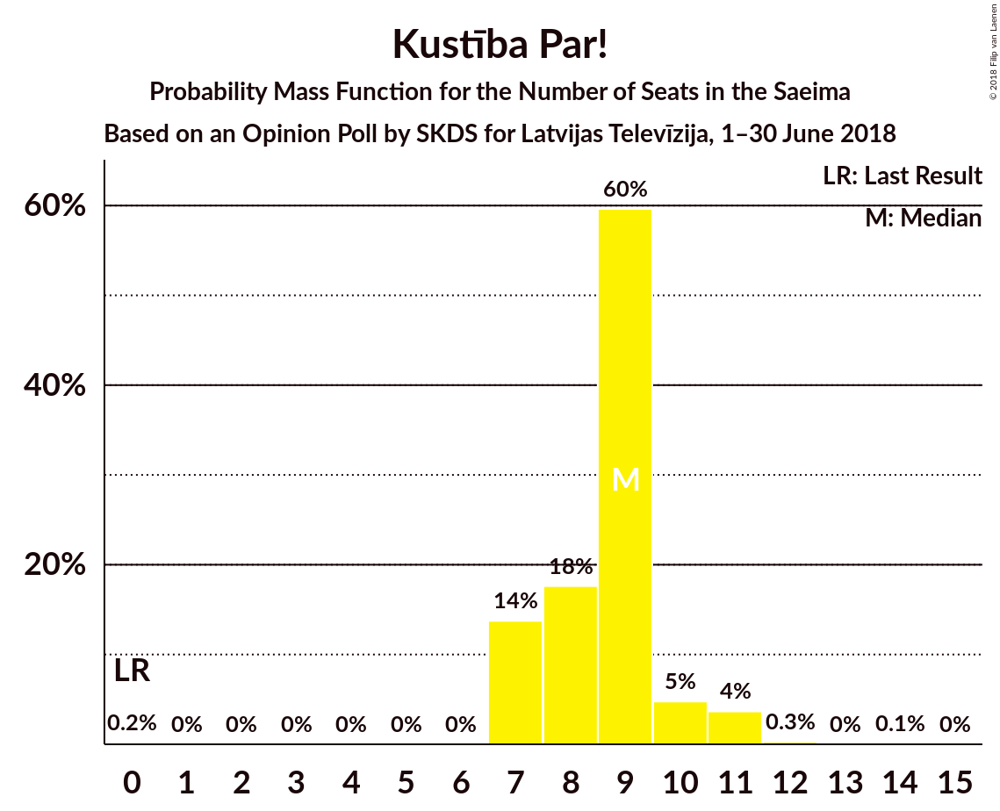

| Number of Seats | Probability | Accumulated | Special Marks |
|:---------------:|:-----------:|:-----------:|:-------------:|
| 0 | 0.3% | 100% | Last Result |
| 1 | 0% | 99.7% |  |
| 2 | 0% | 99.7% |  |
| 3 | 0% | 99.7% |  |
| 4 | 0% | 99.7% |  |
| 5 | 0% | 99.7% |  |
| 6 | 0% | 99.7% |  |
| 7 | 29% | 99.7% |  |
| 8 | 15% | 71% |  |
| 9 | 34% | 56% | Median |
| 10 | 12% | 22% |  |
| 11 | 10% | 10% |  |
| 12 | 0.5% | 0.6% |  |
| 13 | 0.1% | 0.1% |  |
| 14 | 0% | 0% |  |

### KPV LV

*For a full overview of the results for this party, see the [KPV LV](party-kpvlv.html) page.*

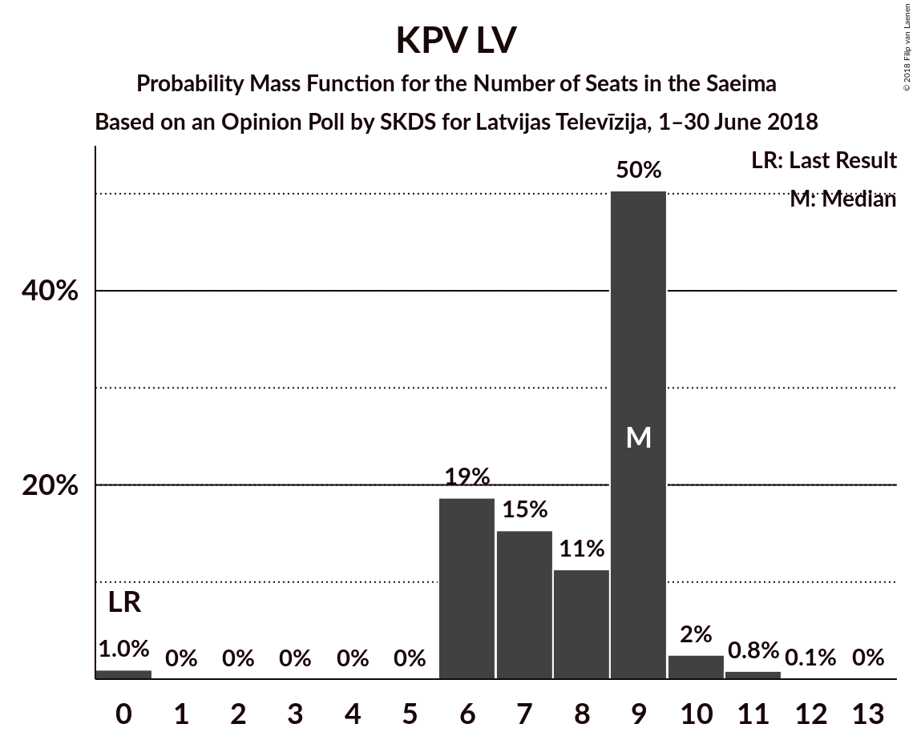

| Number of Seats | Probability | Accumulated | Special Marks |
|:---------------:|:-----------:|:-----------:|:-------------:|
| 0 | 0.4% | 100% | Last Result |
| 1 | 0% | 99.6% |  |
| 2 | 0% | 99.6% |  |
| 3 | 0% | 99.6% |  |
| 4 | 0% | 99.6% |  |
| 5 | 0% | 99.6% |  |
| 6 | 9% | 99.6% |  |
| 7 | 20% | 91% |  |
| 8 | 28% | 70% | Median |
| 9 | 40% | 43% |  |
| 10 | 1.0% | 3% |  |
| 11 | 2% | 2% |  |
| 12 | 0.1% | 0.1% |  |
| 13 | 0% | 0% |  |

### Jaunā konservatīvā partija

*For a full overview of the results for this party, see the [Jaunā konservatīvā partija](party-jaunākonservatīvāpartija.html) page.*

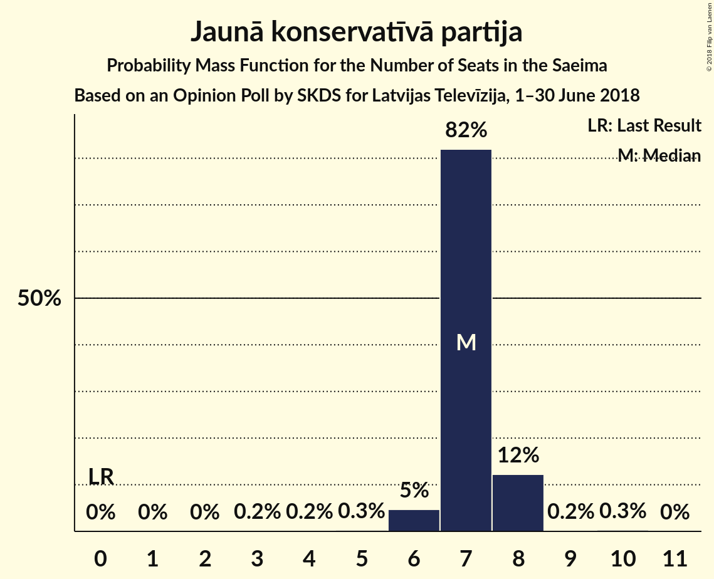

| Number of Seats | Probability | Accumulated | Special Marks |
|:---------------:|:-----------:|:-----------:|:-------------:|
| 0 | 4% | 100% | Last Result |
| 1 | 0% | 96% |  |
| 2 | 0% | 96% |  |
| 3 | 0% | 96% |  |
| 4 | 0% | 96% |  |
| 5 | 0% | 96% |  |
| 6 | 0.2% | 96% |  |
| 7 | 63% | 96% | Median |
| 8 | 28% | 33% |  |
| 9 | 3% | 5% |  |
| 10 | 1.3% | 1.5% |  |
| 11 | 0.1% | 0.1% |  |
| 12 | 0% | 0% |  |

### Vienotība

*For a full overview of the results for this party, see the [Vienotība](party-vienotība.html) page.*

| Number of Seats | Probability | Accumulated | Special Marks |
|:---------------:|:-----------:|:-----------:|:-------------:|
| 0 | 53% | 100% | Median |
| 1 | 0% | 47% |  |
| 2 | 0% | 47% |  |
| 3 | 0% | 47% |  |
| 4 | 0% | 47% |  |
| 5 | 0.1% | 47% |  |
| 6 | 0.1% | 47% |  |
| 7 | 46% | 47% |  |
| 8 | 0.2% | 0.2% |  |
| 9 | 0% | 0% |  |
| 10 | 0% | 0% |  |
| 11 | 0% | 0% |  |
| 12 | 0% | 0% |  |
| 13 | 0% | 0% |  |
| 14 | 0% | 0% |  |
| 15 | 0% | 0% |  |
| 16 | 0% | 0% |  |
| 17 | 0% | 0% |  |
| 18 | 0% | 0% |  |
| 19 | 0% | 0% |  |
| 20 | 0% | 0% |  |
| 21 | 0% | 0% |  |
| 22 | 0% | 0% |  |
| 23 | 0% | 0% | Last Result |

### Latvijas Reģionu apvienība

*For a full overview of the results for this party, see the [Latvijas Reģionu apvienība](party-latvijasreģionuapvienība.html) page.*

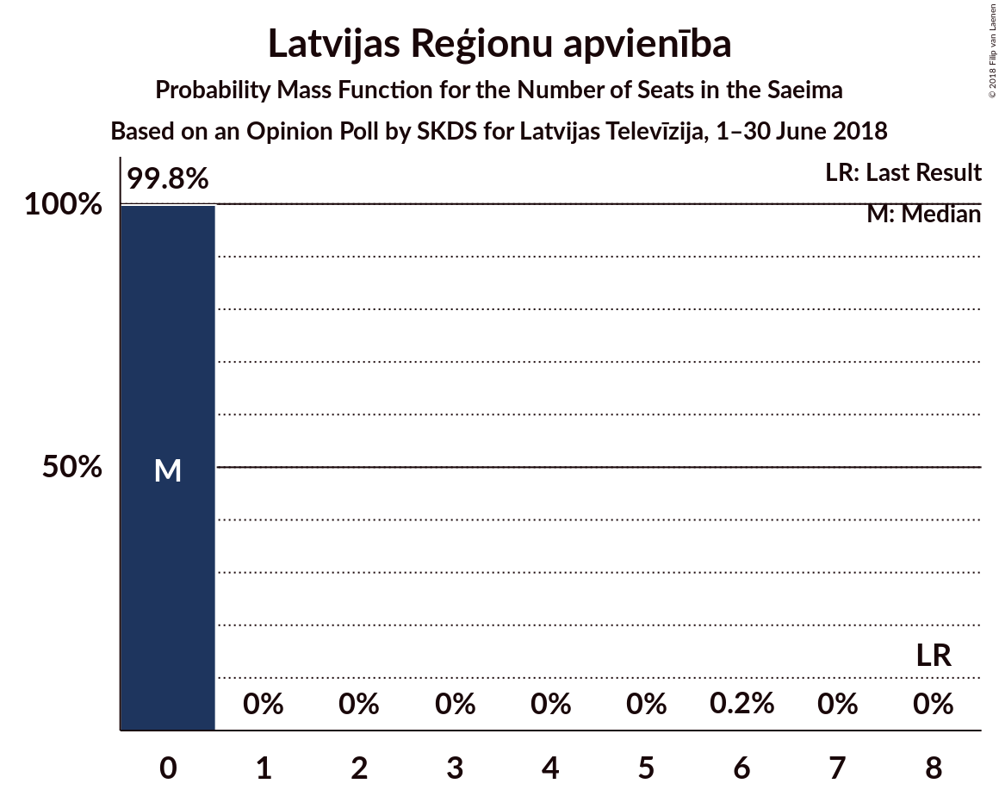

| Number of Seats | Probability | Accumulated | Special Marks |
|:---------------:|:-----------:|:-----------:|:-------------:|
| 0 | 99.6% | 100% | Median |
| 1 | 0% | 0.4% |  |
| 2 | 0% | 0.4% |  |
| 3 | 0% | 0.4% |  |
| 4 | 0% | 0.4% |  |
| 5 | 0% | 0.4% |  |
| 6 | 0.4% | 0.4% |  |
| 7 | 0% | 0% |  |
| 8 | 0% | 0% | Last Result |

### No sirds Latvijai

*For a full overview of the results for this party, see the [No sirds Latvijai](party-nosirdslatvijai.html) page.*

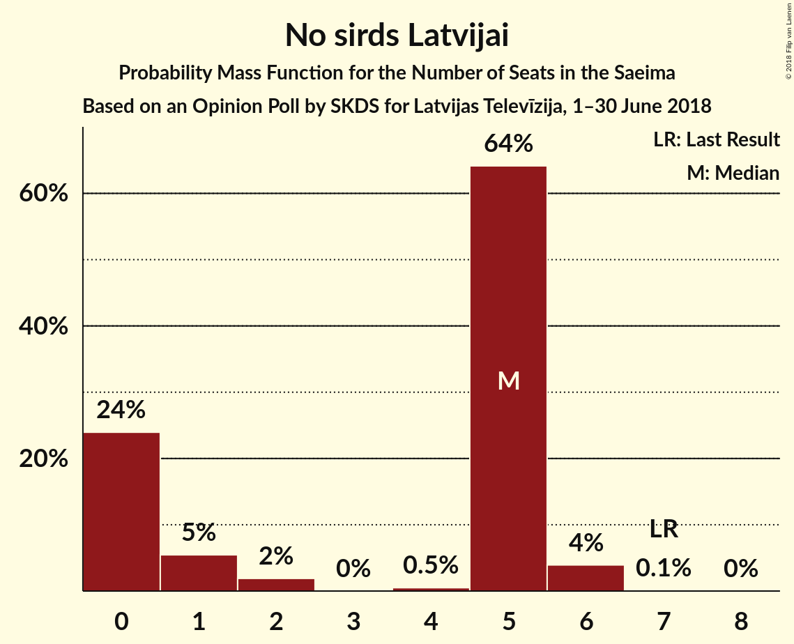

| Number of Seats | Probability | Accumulated | Special Marks |
|:---------------:|:-----------:|:-----------:|:-------------:|
| 0 | 100% | 100% | Median |
| 1 | 0% | 0% |  |
| 2 | 0% | 0% |  |
| 3 | 0% | 0% |  |
| 4 | 0% | 0% |  |
| 5 | 0% | 0% |  |
| 6 | 0% | 0% |  |
| 7 | 0% | 0% | Last Result |

### Latvijas Krievu savienība

*For a full overview of the results for this party, see the [Latvijas Krievu savienība](party-latvijaskrievusavienība.html) page.*

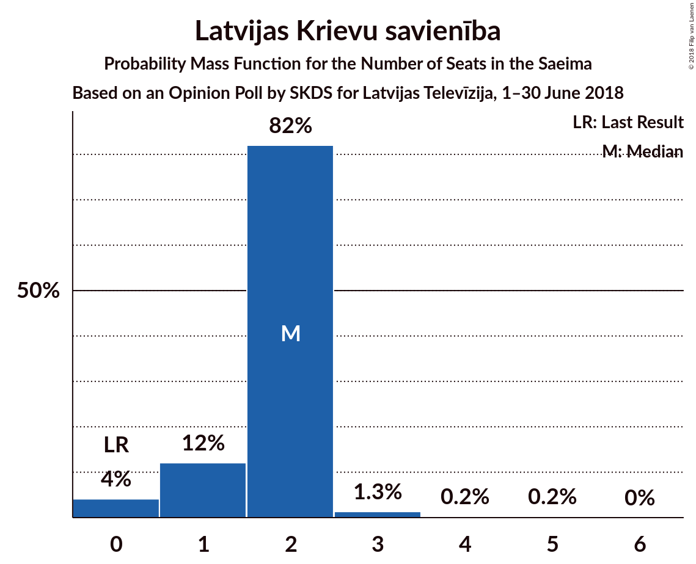

| Number of Seats | Probability | Accumulated | Special Marks |
|:---------------:|:-----------:|:-----------:|:-------------:|
| 0 | 100% | 100% | Last Result, Median |

### Progresīvie

*For a full overview of the results for this party, see the [Progresīvie](party-progresīvie.html) page.*

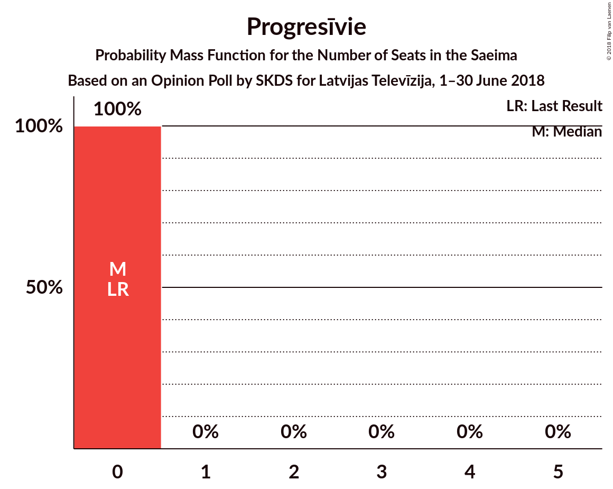

| Number of Seats | Probability | Accumulated | Special Marks |
|:---------------:|:-----------:|:-----------:|:-------------:|
| 0 | 100% | 100% | Last Result, Median |

## Coalitions

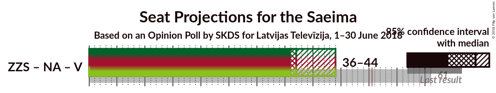

### Confidence Intervals

| Coalition | Last Result | Median | Majority? | 80% Confidence Interval | 90% Confidence Interval | 95% Confidence Interval | 99% Confidence Interval |
|:---------:|:-----------:|:------:|:---------:|:-----------------------:|:-----------------------:|:-----------------------:|:-----------------------:|
| Sociāldemokrātiskā Partija “Saskaņa” – Zaļo un Zemnieku savienība – KPV LV | 45 | 70 | 100% | 67–74 | 65–75 | 63–79 | 63–81 |
| Zaļo un Zemnieku savienība – Nacionālā apvienība „Visu Latvijai!”–„Tēvzemei un Brīvībai/LNNK” – Kustība Par! – Jaunā konservatīvā partija – Vienotība | 61 | 57 | 98% | 52–59 | 51–60 | 51–61 | 49–62 |
| Zaļo un Zemnieku savienība – Nacionālā apvienība „Visu Latvijai!”–„Tēvzemei un Brīvībai/LNNK” – Kustība Par! – Jaunā konservatīvā partija | 38 | 52 | 64% | 50–57 | 50–57 | 49–58 | 48–59 |
| Sociāldemokrātiskā Partija “Saskaņa” – Kustība Par! – Jaunā konservatīvā partija | 24 | 51 | 53% | 49–56 | 48–57 | 47–57 | 45–60 |
| Zaļo un Zemnieku savienība – Nacionālā apvienība „Visu Latvijai!”–„Tēvzemei un Brīvībai/LNNK” – Kustība Par! – Vienotība | 61 | 49 | 16% | 45–52 | 45–53 | 44–54 | 42–55 |
| Zaļo un Zemnieku savienība – Nacionālā apvienība „Visu Latvijai!”–„Tēvzemei un Brīvībai/LNNK” – Jaunā konservatīvā partija – Vienotība | 61 | 48 | 9% | 44–50 | 42–51 | 41–52 | 40–54 |
| Zaļo un Zemnieku savienība – Nacionālā apvienība „Visu Latvijai!”–„Tēvzemei un Brīvībai/LNNK” – Kustība Par! | 38 | 45 | 3% | 43–49 | 42–49 | 42–51 | 41–54 |
| Sociāldemokrātiskā Partija “Saskaņa” – Kustība Par! | 24 | 44 | 2% | 42–49 | 41–49 | 40–50 | 38–52 |
| Sociāldemokrātiskā Partija “Saskaņa” – KPV LV | 24 | 43 | 1.4% | 41–48 | 40–49 | 39–49 | 38–51 |
| Zaļo un Zemnieku savienība – Nacionālā apvienība „Visu Latvijai!”–„Tēvzemei un Brīvībai/LNNK” – Jaunā konservatīvā partija | 38 | 44 | 0.6% | 41–48 | 41–48 | 41–48 | 39–51 |
| Zaļo un Zemnieku savienība – Nacionālā apvienība „Visu Latvijai!”–„Tēvzemei un Brīvībai/LNNK” – Vienotība | 61 | 41 | 0% | 36–43 | 36–44 | 35–45 | 34–47 |
| Nacionālā apvienība „Visu Latvijai!”–„Tēvzemei un Brīvībai/LNNK” – Kustība Par! – Jaunā konservatīvā partija – Vienotība | 40 | 30 | 0% | 26–33 | 25–35 | 21–37 | 19–37 |

### Sociāldemokrātiskā Partija “Saskaņa” – Zaļo un Zemnieku savienība – KPV LV

| Number of Seats | Probability | Accumulated | Special Marks |
|:---------------:|:-----------:|:-----------:|:-------------:|
| 45 | 0% | 100% | Last Result |
| 46 | 0% | 100% |  |
| 47 | 0% | 100% |  |
| 48 | 0% | 100% |  |
| 49 | 0% | 100% |  |
| 50 | 0% | 100% |  |
| 51 | 0% | 100% | Majority |
| 52 | 0% | 100% |  |
| 53 | 0% | 100% |  |
| 54 | 0% | 100% |  |
| 55 | 0% | 100% |  |
| 56 | 0% | 100% |  |
| 57 | 0% | 100% |  |
| 58 | 0% | 100% |  |
| 59 | 0% | 100% |  |
| 60 | 0% | 100% |  |
| 61 | 0% | 100% |  |
| 62 | 0% | 100% |  |
| 63 | 3% | 100% |  |
| 64 | 0.9% | 97% |  |
| 65 | 2% | 96% |  |
| 66 | 0.6% | 94% |  |
| 67 | 21% | 94% |  |
| 68 | 16% | 73% |  |
| 69 | 5% | 57% | Median |
| 70 | 4% | 52% |  |
| 71 | 3% | 48% |  |
| 72 | 22% | 45% |  |
| 73 | 11% | 24% |  |
| 74 | 5% | 13% |  |
| 75 | 3% | 7% |  |
| 76 | 0.9% | 5% |  |
| 77 | 0.7% | 4% |  |
| 78 | 0.4% | 3% |  |
| 79 | 0.7% | 3% |  |
| 80 | 0.8% | 2% |  |
| 81 | 1.1% | 1.2% |  |
| 82 | 0.1% | 0.1% |  |
| 83 | 0% | 0.1% |  |
| 84 | 0% | 0% |  |

### Zaļo un Zemnieku savienība – Nacionālā apvienība „Visu Latvijai!”–„Tēvzemei un Brīvībai/LNNK” – Kustība Par! – Jaunā konservatīvā partija – Vienotība

| Number of Seats | Probability | Accumulated | Special Marks |
|:---------------:|:-----------:|:-----------:|:-------------:|
| 46 | 0.1% | 100% |  |
| 47 | 0% | 99.9% |  |
| 48 | 0.3% | 99.9% |  |
| 49 | 1.3% | 99.6% |  |
| 50 | 0.5% | 98% |  |
| 51 | 4% | 98% | Majority |
| 52 | 7% | 94% |  |
| 53 | 3% | 87% | Median |
| 54 | 5% | 84% |  |
| 55 | 9% | 79% |  |
| 56 | 12% | 70% |  |
| 57 | 42% | 58% |  |
| 58 | 6% | 16% |  |
| 59 | 2% | 10% |  |
| 60 | 3% | 8% |  |
| 61 | 2% | 4% | Last Result |
| 62 | 2% | 2% |  |
| 63 | 0.1% | 0.2% |  |
| 64 | 0.1% | 0.1% |  |
| 65 | 0% | 0% |  |

### Zaļo un Zemnieku savienība – Nacionālā apvienība „Visu Latvijai!”–„Tēvzemei un Brīvībai/LNNK” – Kustība Par! – Jaunā konservatīvā partija

| Number of Seats | Probability | Accumulated | Special Marks |
|:---------------:|:-----------:|:-----------:|:-------------:|
| 38 | 0% | 100% | Last Result |
| 39 | 0% | 100% |  |
| 40 | 0% | 100% |  |
| 41 | 0% | 100% |  |
| 42 | 0% | 100% |  |
| 43 | 0% | 100% |  |
| 44 | 0.1% | 100% |  |
| 45 | 0.1% | 99.9% |  |
| 46 | 0.2% | 99.9% |  |
| 47 | 0.1% | 99.7% |  |
| 48 | 0.7% | 99.6% |  |
| 49 | 3% | 98.9% |  |
| 50 | 32% | 96% |  |
| 51 | 7% | 64% | Majority |
| 52 | 9% | 57% |  |
| 53 | 6% | 47% | Median |
| 54 | 7% | 42% |  |
| 55 | 11% | 34% |  |
| 56 | 10% | 24% |  |
| 57 | 11% | 14% |  |
| 58 | 2% | 3% |  |
| 59 | 0.3% | 0.7% |  |
| 60 | 0.1% | 0.4% |  |
| 61 | 0.1% | 0.2% |  |
| 62 | 0.1% | 0.2% |  |
| 63 | 0.1% | 0.1% |  |
| 64 | 0% | 0% |  |

### Sociāldemokrātiskā Partija “Saskaņa” – Kustība Par! – Jaunā konservatīvā partija

| Number of Seats | Probability | Accumulated | Special Marks |
|:---------------:|:-----------:|:-----------:|:-------------:|
| 24 | 0% | 100% | Last Result |
| 25 | 0% | 100% |  |
| 26 | 0% | 100% |  |
| 27 | 0% | 100% |  |
| 28 | 0% | 100% |  |
| 29 | 0% | 100% |  |
| 30 | 0% | 100% |  |
| 31 | 0% | 100% |  |
| 32 | 0% | 100% |  |
| 33 | 0% | 100% |  |
| 34 | 0% | 100% |  |
| 35 | 0% | 100% |  |
| 36 | 0% | 100% |  |
| 37 | 0% | 100% |  |
| 38 | 0% | 100% |  |
| 39 | 0% | 100% |  |
| 40 | 0% | 100% |  |
| 41 | 0% | 100% |  |
| 42 | 0% | 100% |  |
| 43 | 0% | 100% |  |
| 44 | 0.1% | 100% |  |
| 45 | 2% | 99.9% |  |
| 46 | 0.7% | 98% |  |
| 47 | 2% | 98% |  |
| 48 | 3% | 95% |  |
| 49 | 21% | 93% |  |
| 50 | 19% | 71% |  |
| 51 | 7% | 53% | Median, Majority |
| 52 | 6% | 45% |  |
| 53 | 14% | 39% |  |
| 54 | 10% | 25% |  |
| 55 | 2% | 15% |  |
| 56 | 4% | 13% |  |
| 57 | 8% | 9% |  |
| 58 | 0.7% | 1.3% |  |
| 59 | 0.1% | 0.7% |  |
| 60 | 0.5% | 0.6% |  |
| 61 | 0% | 0.1% |  |
| 62 | 0.1% | 0.1% |  |
| 63 | 0% | 0% |  |

### Zaļo un Zemnieku savienība – Nacionālā apvienība „Visu Latvijai!”–„Tēvzemei un Brīvībai/LNNK” – Kustība Par! – Vienotība

| Number of Seats | Probability | Accumulated | Special Marks |
|:---------------:|:-----------:|:-----------:|:-------------:|
| 40 | 0% | 100% |  |
| 41 | 0.2% | 99.9% |  |
| 42 | 0.4% | 99.8% |  |
| 43 | 0.8% | 99.3% |  |
| 44 | 3% | 98.6% |  |
| 45 | 9% | 95% |  |
| 46 | 3% | 86% | Median |
| 47 | 9% | 83% |  |
| 48 | 4% | 74% |  |
| 49 | 26% | 70% |  |
| 50 | 29% | 44% |  |
| 51 | 5% | 16% | Majority |
| 52 | 4% | 11% |  |
| 53 | 3% | 7% |  |
| 54 | 2% | 5% |  |
| 55 | 2% | 2% |  |
| 56 | 0.1% | 0.1% |  |
| 57 | 0% | 0.1% |  |
| 58 | 0% | 0% |  |
| 59 | 0% | 0% |  |
| 60 | 0% | 0% |  |
| 61 | 0% | 0% | Last Result |

### Zaļo un Zemnieku savienība – Nacionālā apvienība „Visu Latvijai!”–„Tēvzemei un Brīvībai/LNNK” – Jaunā konservatīvā partija – Vienotība

| Number of Seats | Probability | Accumulated | Special Marks |
|:---------------:|:-----------:|:-----------:|:-------------:|
| 37 | 0.2% | 100% |  |
| 38 | 0.1% | 99.8% |  |
| 39 | 0.2% | 99.7% |  |
| 40 | 0.6% | 99.6% |  |
| 41 | 2% | 99.0% |  |
| 42 | 4% | 97% |  |
| 43 | 2% | 93% |  |
| 44 | 12% | 91% | Median |
| 45 | 3% | 79% |  |
| 46 | 6% | 76% |  |
| 47 | 9% | 70% |  |
| 48 | 25% | 61% |  |
| 49 | 5% | 36% |  |
| 50 | 22% | 31% |  |
| 51 | 4% | 9% | Majority |
| 52 | 2% | 5% |  |
| 53 | 0.3% | 2% |  |
| 54 | 2% | 2% |  |
| 55 | 0.4% | 0.5% |  |
| 56 | 0% | 0% |  |
| 57 | 0% | 0% |  |
| 58 | 0% | 0% |  |
| 59 | 0% | 0% |  |
| 60 | 0% | 0% |  |
| 61 | 0% | 0% | Last Result |

### Zaļo un Zemnieku savienība – Nacionālā apvienība „Visu Latvijai!”–„Tēvzemei un Brīvībai/LNNK” – Kustība Par!

| Number of Seats | Probability | Accumulated | Special Marks |
|:---------------:|:-----------:|:-----------:|:-------------:|
| 38 | 0% | 100% | Last Result |
| 39 | 0.1% | 99.9% |  |
| 40 | 0.3% | 99.9% |  |
| 41 | 0.9% | 99.6% |  |
| 42 | 5% | 98.7% |  |
| 43 | 28% | 93% |  |
| 44 | 7% | 65% |  |
| 45 | 12% | 58% |  |
| 46 | 5% | 46% | Median |
| 47 | 11% | 41% |  |
| 48 | 5% | 30% |  |
| 49 | 21% | 25% |  |
| 50 | 1.2% | 4% |  |
| 51 | 1.1% | 3% | Majority |
| 52 | 0.7% | 1.4% |  |
| 53 | 0.2% | 0.8% |  |
| 54 | 0.3% | 0.6% |  |
| 55 | 0.3% | 0.3% |  |
| 56 | 0% | 0% |  |

### Sociāldemokrātiskā Partija “Saskaņa” – Kustība Par!

| Number of Seats | Probability | Accumulated | Special Marks |
|:---------------:|:-----------:|:-----------:|:-------------:|
| 24 | 0% | 100% | Last Result |
| 25 | 0% | 100% |  |
| 26 | 0% | 100% |  |
| 27 | 0% | 100% |  |
| 28 | 0% | 100% |  |
| 29 | 0% | 100% |  |
| 30 | 0% | 100% |  |
| 31 | 0% | 100% |  |
| 32 | 0% | 100% |  |
| 33 | 0% | 100% |  |
| 34 | 0% | 100% |  |
| 35 | 0% | 100% |  |
| 36 | 0.1% | 100% |  |
| 37 | 0% | 99.9% |  |
| 38 | 2% | 99.9% |  |
| 39 | 0.8% | 98% |  |
| 40 | 2% | 98% |  |
| 41 | 2% | 96% |  |
| 42 | 23% | 93% |  |
| 43 | 17% | 70% |  |
| 44 | 8% | 53% | Median |
| 45 | 16% | 45% |  |
| 46 | 4% | 28% |  |
| 47 | 8% | 25% |  |
| 48 | 3% | 17% |  |
| 49 | 11% | 14% |  |
| 50 | 1.0% | 3% |  |
| 51 | 0.9% | 2% | Majority |
| 52 | 0.7% | 1.0% |  |
| 53 | 0% | 0.3% |  |
| 54 | 0.2% | 0.2% |  |
| 55 | 0.1% | 0.1% |  |
| 56 | 0% | 0% |  |

### Sociāldemokrātiskā Partija “Saskaņa” – KPV LV

| Number of Seats | Probability | Accumulated | Special Marks |
|:---------------:|:-----------:|:-----------:|:-------------:|
| 24 | 0% | 100% | Last Result |
| 25 | 0% | 100% |  |
| 26 | 0% | 100% |  |
| 27 | 0% | 100% |  |
| 28 | 0% | 100% |  |
| 29 | 0% | 100% |  |
| 30 | 0% | 100% |  |
| 31 | 0% | 100% |  |
| 32 | 0% | 100% |  |
| 33 | 0% | 100% |  |
| 34 | 0% | 100% |  |
| 35 | 0% | 100% |  |
| 36 | 0.1% | 100% |  |
| 37 | 0.1% | 99.9% |  |
| 38 | 2% | 99.8% |  |
| 39 | 2% | 98% |  |
| 40 | 3% | 96% |  |
| 41 | 3% | 92% |  |
| 42 | 6% | 90% |  |
| 43 | 42% | 84% | Median |
| 44 | 12% | 42% |  |
| 45 | 9% | 30% |  |
| 46 | 5% | 21% |  |
| 47 | 3% | 16% |  |
| 48 | 7% | 13% |  |
| 49 | 4% | 6% |  |
| 50 | 0.5% | 2% |  |
| 51 | 1.0% | 1.4% | Majority |
| 52 | 0.3% | 0.4% |  |
| 53 | 0% | 0.1% |  |
| 54 | 0.1% | 0.1% |  |
| 55 | 0% | 0% |  |

### Zaļo un Zemnieku savienība – Nacionālā apvienība „Visu Latvijai!”–„Tēvzemei un Brīvībai/LNNK” – Jaunā konservatīvā partija

| Number of Seats | Probability | Accumulated | Special Marks |
|:---------------:|:-----------:|:-----------:|:-------------:|
| 36 | 0.1% | 100% |  |
| 37 | 0.2% | 99.8% |  |
| 38 | 0.1% | 99.6% | Last Result |
| 39 | 0.3% | 99.5% |  |
| 40 | 1.4% | 99.2% |  |
| 41 | 14% | 98% |  |
| 42 | 8% | 84% |  |
| 43 | 24% | 76% |  |
| 44 | 16% | 52% | Median |
| 45 | 5% | 37% |  |
| 46 | 6% | 31% |  |
| 47 | 10% | 26% |  |
| 48 | 13% | 16% |  |
| 49 | 0.8% | 2% |  |
| 50 | 0.8% | 1.5% |  |
| 51 | 0.2% | 0.6% | Majority |
| 52 | 0.3% | 0.4% |  |
| 53 | 0% | 0.1% |  |
| 54 | 0.1% | 0.1% |  |
| 55 | 0% | 0% |  |

### Zaļo un Zemnieku savienība – Nacionālā apvienība „Visu Latvijai!”–„Tēvzemei un Brīvībai/LNNK” – Vienotība

| Number of Seats | Probability | Accumulated | Special Marks |
|:---------------:|:-----------:|:-----------:|:-------------:|
| 33 | 0.2% | 100% |  |
| 34 | 1.1% | 99.7% |  |
| 35 | 3% | 98.6% |  |
| 36 | 9% | 95% |  |
| 37 | 7% | 86% | Median |
| 38 | 3% | 79% |  |
| 39 | 6% | 76% |  |
| 40 | 20% | 70% |  |
| 41 | 17% | 50% |  |
| 42 | 4% | 33% |  |
| 43 | 20% | 29% |  |
| 44 | 5% | 9% |  |
| 45 | 2% | 5% |  |
| 46 | 0.4% | 2% |  |
| 47 | 2% | 2% |  |
| 48 | 0.4% | 0.4% |  |
| 49 | 0% | 0% |  |
| 50 | 0% | 0% |  |
| 51 | 0% | 0% | Majority |
| 52 | 0% | 0% |  |
| 53 | 0% | 0% |  |
| 54 | 0% | 0% |  |
| 55 | 0% | 0% |  |
| 56 | 0% | 0% |  |
| 57 | 0% | 0% |  |
| 58 | 0% | 0% |  |
| 59 | 0% | 0% |  |
| 60 | 0% | 0% |  |
| 61 | 0% | 0% | Last Result |

### Nacionālā apvienība „Visu Latvijai!”–„Tēvzemei un Brīvībai/LNNK” – Kustība Par! – Jaunā konservatīvā partija – Vienotība

| Number of Seats | Probability | Accumulated | Special Marks |
|:---------------:|:-----------:|:-----------:|:-------------:|
| 17 | 0.1% | 100% |  |
| 18 | 0.1% | 99.9% |  |
| 19 | 1.1% | 99.9% |  |
| 20 | 0.8% | 98.8% |  |
| 21 | 0.7% | 98% |  |
| 22 | 0.4% | 97% |  |
| 23 | 0.7% | 97% |  |
| 24 | 0.9% | 96% |  |
| 25 | 3% | 95% |  |
| 26 | 6% | 93% |  |
| 27 | 11% | 87% | Median |
| 28 | 22% | 76% |  |
| 29 | 3% | 54% |  |
| 30 | 4% | 52% |  |
| 31 | 5% | 48% |  |
| 32 | 16% | 43% |  |
| 33 | 21% | 27% |  |
| 34 | 0.6% | 6% |  |
| 35 | 2% | 6% |  |
| 36 | 0.9% | 4% |  |
| 37 | 3% | 3% |  |
| 38 | 0% | 0% |  |
| 39 | 0% | 0% |  |
| 40 | 0% | 0% | Last Result |

## Technical Information

### Opinion Poll

+ **Polling firm:** SKDS
+ **Commissioner(s):** Latvijas Televīzija
+ **Fieldwork period:** 1–30 June 2018

### Calculations

+ **Sample size:** 631
+ **Simulations done:** 1,048,576
+ **Error estimate:** 1.97%

