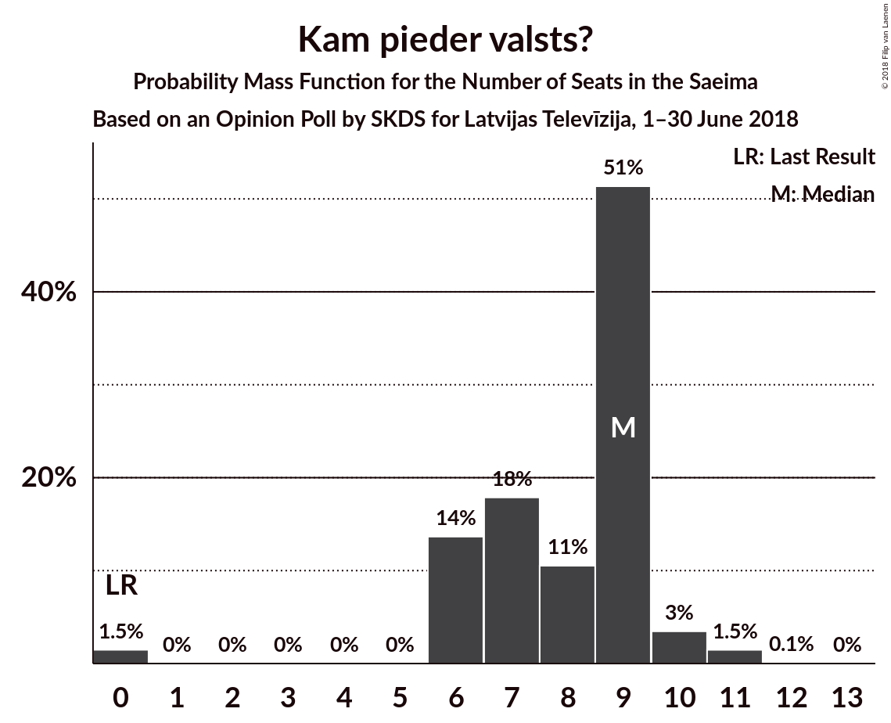
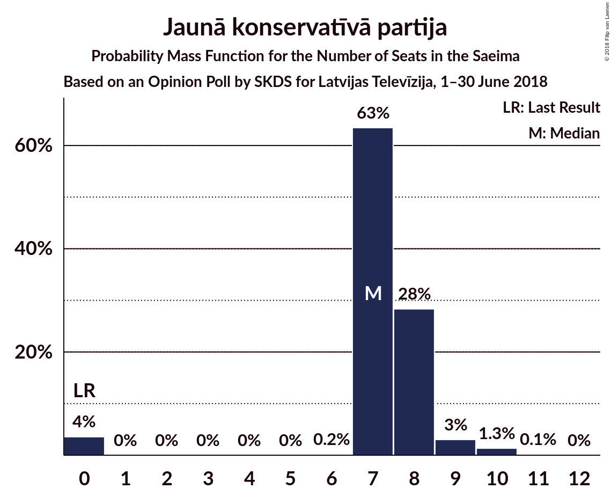
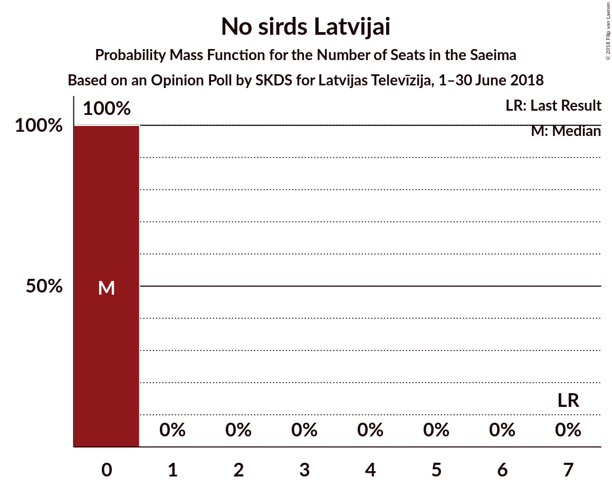
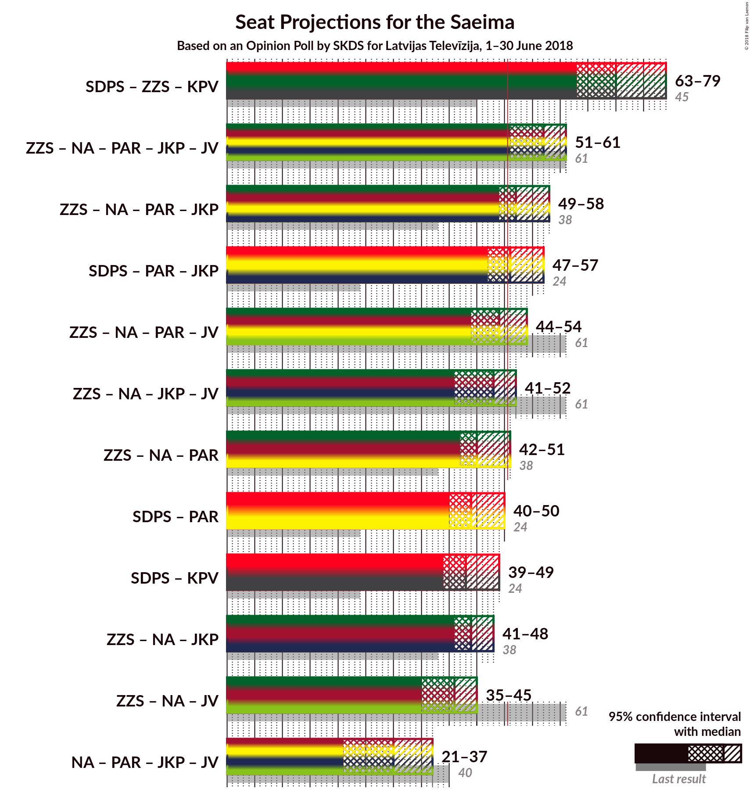

# Opinion Poll by SKDS for Latvijas Televīzija, 1–30 June 2018

<a href="#voting-intentions">Voting Intentions</a> | <a href="#seats">Seats</a> | <a href="#coalitions">Coalitions</a> | <a href="#technical-information">Technical Information</a>

## Voting Intentions

### Confidence Intervals

| Party | Last Result | Poll Result | 80% Confidence Interval | 90% Confidence Interval | 95% Confidence Interval | 99% Confidence Interval |
|:-----:|:-----------:|:-----------:|:-----------------------:|:-----------------------:|:-----------------------:|:-----------------------:|
| Sociāldemokrātiskā Partija “Saskaņa” | 23.0% | 33.3% | 30.9–35.8% |30.3–36.4% |29.7–37.1% |28.6–38.3% |
| Zaļo un Zemnieku savienība | 19.5% | 22.8% | 20.8–25.1% |20.2–25.7% |19.7–26.3% |18.8–27.4% |
| Nacionālā apvienība „Visu Latvijai!”–„Tēvzemei un Brīvībai/LNNK” | 16.6% | 9.7% | 8.3–11.3% |7.9–11.8% |7.6–12.2% |7.0–13.1% |
| Kustība Par! | 0.0% | 7.4% | 6.3–9.0% |5.9–9.4% |5.6–9.8% |5.1–10.5% |
| Kam pieder valsts? | 0.0% | 7.0% | 5.8–8.4% |5.5–8.9% |5.2–9.2% |4.7–10.0% |
| Jaunā konservatīvā partija | 0.7% | 6.3% | 5.2–7.8% |4.9–8.2% |4.7–8.5% |4.2–9.3% |
| Vienotība | 21.9% | 4.3% | 3.4–5.5% |3.2–5.9% |3.0–6.2% |2.6–6.8% |
| Latvijas Reģionu apvienība | 6.7% | 2.7% | 2.0–3.7% |1.8–4.0% |1.7–4.3% |1.4–4.8% |
| No sirds Latvijai | 6.8% | 2.4% | 1.8–3.4% |1.6–3.6% |1.4–3.9% |1.2–4.4% |
| Latvijas Krievu savienība | 1.6% | 1.9% | 1.4–2.8% |1.2–3.1% |1.1–3.3% |0.9–3.8% |

*Note:* The poll result column reflects the actual value used in the calculations. Published results may vary slightly, and in addition be rounded to fewer digits.

## Seats

### Confidence Intervals

| Party | Last Result | Median | 80% Confidence Interval | 90% Confidence Interval | 95% Confidence Interval | 99% Confidence Interval |
|:-----:|:-----------:|:------:|:-----------------------:|:-----------------------:|:-----------------------:|:-----------------------:|
| <a href="#sociāldemokrātiskā-partija-“saskaņa”">Sociāldemokrātiskā Partija “Saskaņa”</a> | 24 | 40 | 35–41 |34–41 |33–41 |31–42 |
| <a href="#zaļo-un-zemnieku-savienība">Zaļo un Zemnieku savienība</a> | 21 | 26 | 24–30 |24–30 |23–30 |23–32 |
| <a href="#nacionālā-apvienība-„visu-latvijai!”–„tēvzemei-un-brīvībai/lnnk”">Nacionālā apvienība „Visu Latvijai!”–„Tēvzemei un Brīvībai/LNNK”</a> | 17 | 11 | 9–13 |9–14 |9–15 |8–15 |
| <a href="#kustība-par!">Kustība Par!</a> | 0 | 9 | 7–9 |7–10 |7–11 |7–11 |
| <a href="#kam-pieder-valsts?">Kam pieder valsts?</a> | 0 | 6 | 6–9 |6–9 |6–10 |0–11 |
| <a href="#jaunā-konservatīvā-partija">Jaunā konservatīvā partija</a> | 0 | 7 | 7–8 |7–9 |0–9 |0–10 |
| <a href="#vienotība">Vienotība</a> | 23 | 0 | 0–7 |0–7 |0–7 |0–7 |
| <a href="#latvijas-reģionu-apvienība">Latvijas Reģionu apvienība</a> | 8 | 0 | 0 |0 |0 |0 |
| <a href="#no-sirds-latvijai">No sirds Latvijai</a> | 7 | 0 | 0 |0 |0 |0 |
| <a href="#latvijas-krievu-savienība">Latvijas Krievu savienība</a> | 0 | 0 | 0 |0 |0 |0 |

### Sociāldemokrātiskā Partija “Saskaņa”

*For a full overview of the results for this party, see the [Sociāldemokrātiskā Partija “Saskaņa”](party-sociāldemokrātiskāpartija“saskaņa”.html) page.*

| Number of Seats | Probability | Accumulated | Special Marks |
|:---------------:|:-----------:|:-----------:|:-------------:|
| 24 | 0% | 100% | Last Result |
| 25 | 0% | 100% |  |
| 26 | 0% | 100% |  |
| 27 | 0% | 100% |  |
| 28 | 0% | 100% |  |
| 29 | 0% | 100% |  |
| 30 | 0.1% | 100% |  |
| 31 | 1.0% | 99.9% |  |
| 32 | 0.2% | 98.8% |  |
| 33 | 4% | 98.6% |  |
| 34 | 4% | 95% |  |
| 35 | 4% | 91% |  |
| 36 | 13% | 86% |  |
| 37 | 4% | 73% |  |
| 38 | 6% | 69% |  |
| 39 | 4% | 62% |  |
| 40 | 9% | 59% | Median |
| 41 | 49% | 49% |  |
| 42 | 0.3% | 0.6% |  |
| 43 | 0% | 0.2% |  |
| 44 | 0.2% | 0.2% |  |
| 45 | 0% | 0.1% |  |
| 46 | 0% | 0% |  |

### Zaļo un Zemnieku savienība

*For a full overview of the results for this party, see the [Zaļo un Zemnieku savienība](party-zaļounzemniekusavienība.html) page.*

| Number of Seats | Probability | Accumulated | Special Marks |
|:---------------:|:-----------:|:-----------:|:-------------:|
| 21 | 0% | 100% | Last Result |
| 22 | 0.2% | 99.9% |  |
| 23 | 3% | 99.7% |  |
| 24 | 8% | 97% |  |
| 25 | 4% | 89% |  |
| 26 | 59% | 85% | Median |
| 27 | 5% | 26% |  |
| 28 | 8% | 21% |  |
| 29 | 3% | 13% |  |
| 30 | 9% | 10% |  |
| 31 | 0.4% | 1.1% |  |
| 32 | 0.4% | 0.7% |  |
| 33 | 0.2% | 0.3% |  |
| 34 | 0% | 0% |  |

### Nacionālā apvienība „Visu Latvijai!”–„Tēvzemei un Brīvībai/LNNK”

*For a full overview of the results for this party, see the [Nacionālā apvienība „Visu Latvijai!”–„Tēvzemei un Brīvībai/LNNK”](party-nacionālāapvienība„visulatvijai”–„tēvzemeiunbrīvībailnnk”.html) page.*

| Number of Seats | Probability | Accumulated | Special Marks |
|:---------------:|:-----------:|:-----------:|:-------------:|
| 7 | 0.4% | 100% |  |
| 8 | 0.2% | 99.6% |  |
| 9 | 11% | 99.3% |  |
| 10 | 13% | 89% |  |
| 11 | 60% | 76% | Median |
| 12 | 4% | 16% |  |
| 13 | 4% | 12% |  |
| 14 | 3% | 8% |  |
| 15 | 5% | 5% |  |
| 16 | 0% | 0.1% |  |
| 17 | 0% | 0% | Last Result |

### Kustība Par!

*For a full overview of the results for this party, see the [Kustība Par!](party-kustībapar.html) page.*

| Number of Seats | Probability | Accumulated | Special Marks |
|:---------------:|:-----------:|:-----------:|:-------------:|
| 0 | 0.2% | 100% | Last Result |
| 1 | 0% | 99.8% |  |
| 2 | 0% | 99.8% |  |
| 3 | 0% | 99.8% |  |
| 4 | 0% | 99.8% |  |
| 5 | 0% | 99.8% |  |
| 6 | 0% | 99.8% |  |
| 7 | 14% | 99.8% |  |
| 8 | 18% | 86% |  |
| 9 | 60% | 68% | Median |
| 10 | 5% | 9% |  |
| 11 | 4% | 4% |  |
| 12 | 0.3% | 0.4% |  |
| 13 | 0% | 0.1% |  |
| 14 | 0.1% | 0.1% |  |
| 15 | 0% | 0% |  |

### Kam pieder valsts?

*For a full overview of the results for this party, see the [Kam pieder valsts?](party-kampiedervalsts.html) page.*

| Number of Seats | Probability | Accumulated | Special Marks |
|:---------------:|:-----------:|:-----------:|:-------------:|
| 0 | 1.1% | 100% | Last Result |
| 1 | 0% | 98.9% |  |
| 2 | 0% | 98.9% |  |
| 3 | 0% | 98.9% |  |
| 4 | 0% | 98.9% |  |
| 5 | 0% | 98.9% |  |
| 6 | 52% | 98.9% | Median |
| 7 | 9% | 47% |  |
| 8 | 3% | 38% |  |
| 9 | 32% | 34% |  |
| 10 | 2% | 3% |  |
| 11 | 0.5% | 0.6% |  |
| 12 | 0% | 0.1% |  |
| 13 | 0% | 0.1% |  |
| 14 | 0% | 0% |  |

### Jaunā konservatīvā partija

*For a full overview of the results for this party, see the [Jaunā konservatīvā partija](party-jaunākonservatīvāpartija.html) page.*

| Number of Seats | Probability | Accumulated | Special Marks |
|:---------------:|:-----------:|:-----------:|:-------------:|
| 0 | 4% | 100% | Last Result |
| 1 | 0% | 96% |  |
| 2 | 0% | 96% |  |
| 3 | 0% | 96% |  |
| 4 | 0% | 96% |  |
| 5 | 0% | 96% |  |
| 6 | 0% | 96% |  |
| 7 | 71% | 96% | Median |
| 8 | 20% | 25% |  |
| 9 | 4% | 5% |  |
| 10 | 0.8% | 0.9% |  |
| 11 | 0.1% | 0.1% |  |
| 12 | 0% | 0% |  |

### Vienotība

*For a full overview of the results for this party, see the [Vienotība](party-vienotība.html) page.*

| Number of Seats | Probability | Accumulated | Special Marks |
|:---------------:|:-----------:|:-----------:|:-------------:|
| 0 | 88% | 100% | Median |
| 1 | 0% | 12% |  |
| 2 | 0% | 12% |  |
| 3 | 0% | 12% |  |
| 4 | 0% | 12% |  |
| 5 | 0% | 12% |  |
| 6 | 0.2% | 12% |  |
| 7 | 11% | 12% |  |
| 8 | 0.2% | 0.2% |  |
| 9 | 0% | 0% |  |
| 10 | 0% | 0% |  |
| 11 | 0% | 0% |  |
| 12 | 0% | 0% |  |
| 13 | 0% | 0% |  |
| 14 | 0% | 0% |  |
| 15 | 0% | 0% |  |
| 16 | 0% | 0% |  |
| 17 | 0% | 0% |  |
| 18 | 0% | 0% |  |
| 19 | 0% | 0% |  |
| 20 | 0% | 0% |  |
| 21 | 0% | 0% |  |
| 22 | 0% | 0% |  |
| 23 | 0% | 0% | Last Result |

### Latvijas Reģionu apvienība

*For a full overview of the results for this party, see the [Latvijas Reģionu apvienība](party-latvijasreģionuapvienība.html) page.*

| Number of Seats | Probability | Accumulated | Special Marks |
|:---------------:|:-----------:|:-----------:|:-------------:|
| 0 | 99.9% | 100% | Median |
| 1 | 0% | 0.1% |  |
| 2 | 0% | 0.1% |  |
| 3 | 0% | 0.1% |  |
| 4 | 0% | 0.1% |  |
| 5 | 0% | 0.1% |  |
| 6 | 0% | 0.1% |  |
| 7 | 0% | 0% |  |
| 8 | 0% | 0% | Last Result |

### No sirds Latvijai

*For a full overview of the results for this party, see the [No sirds Latvijai](party-nosirdslatvijai.html) page.*

| Number of Seats | Probability | Accumulated | Special Marks |
|:---------------:|:-----------:|:-----------:|:-------------:|
| 0 | 100% | 100% | Median |
| 1 | 0% | 0% |  |
| 2 | 0% | 0% |  |
| 3 | 0% | 0% |  |
| 4 | 0% | 0% |  |
| 5 | 0% | 0% |  |
| 6 | 0% | 0% |  |
| 7 | 0% | 0% | Last Result |

### Latvijas Krievu savienība

*For a full overview of the results for this party, see the [Latvijas Krievu savienība](party-latvijaskrievusavienība.html) page.*

| Number of Seats | Probability | Accumulated | Special Marks |
|:---------------:|:-----------:|:-----------:|:-------------:|
| 0 | 100% | 100% | Last Result, Median |

## Coalitions

## Technical Information

### Opinion Poll

+ **Polling firm:** SKDS
+ **Commissioner(s):** Latvijas Televīzija
+ **Fieldwork period:** 1–30 June 2018

### Calculations

+ **Sample size:** 631
+ **Simulations done:** 131,072
+ **Error estimate:** 2.16%

