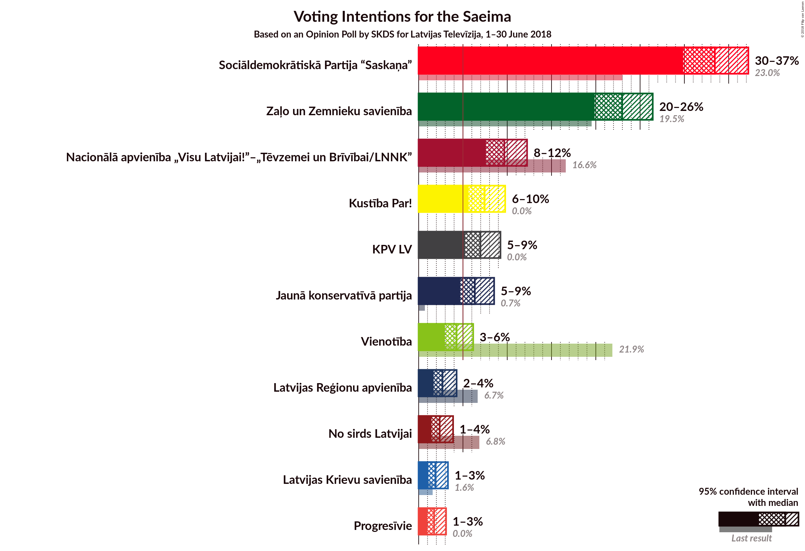
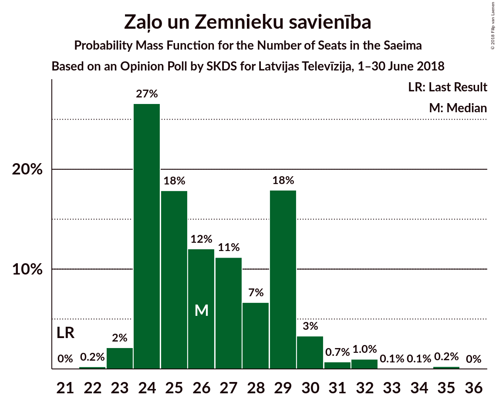
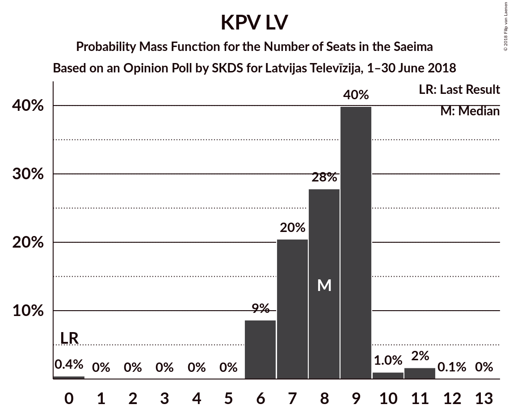

# Opinion Poll by SKDS for Latvijas Televīzija, 1–30 June 2018

<a href="#voting-intentions">Voting Intentions</a> | <a href="#seats">Seats</a> | <a href="#coalitions">Coalitions</a> | <a href="#technical-information">Technical Information</a>

## Voting Intentions

### Confidence Intervals

| Party | Last Result | Poll Result | 80% Confidence Interval | 90% Confidence Interval | 95% Confidence Interval | 99% Confidence Interval |
|:-----:|:-----------:|:-----------:|:-----------------------:|:-----------------------:|:-----------------------:|:-----------------------:|
| Sociāldemokrātiskā Partija “Saskaņa” | 23.0% | 33.4% | 30.9–35.8% |30.3–36.4% |29.7–37.1% |28.6–38.3% |
| Zaļo un Zemnieku savienība | 19.5% | 23.0% | 20.8–25.1% |20.2–25.7% |19.7–26.3% |18.8–27.4% |
| Nacionālā apvienība „Visu Latvijai!”–„Tēvzemei un Brīvībai/LNNK” | 16.6% | 9.7% | 8.3–11.3% |7.9–11.8% |7.6–12.2% |7.0–13.1% |
| Kustība Par! | 0.0% | 7.4% | 6.3–9.0% |5.9–9.4% |5.6–9.8% |5.1–10.5% |
| KPV LV | 0.0% | 7.0% | 5.8–8.4% |5.5–8.9% |5.2–9.2% |4.7–10.0% |
| Jaunā konservatīvā partija | 0.7% | 6.3% | 5.2–7.8% |4.9–8.2% |4.7–8.5% |4.2–9.3% |
| Vienotība | 21.9% | 4.3% | 3.4–5.5% |3.2–5.9% |3.0–6.2% |2.6–6.8% |
| Latvijas Reģionu apvienība | 6.7% | 2.7% | 2.0–3.7% |1.8–4.0% |1.7–4.3% |1.4–4.8% |
| No sirds Latvijai | 6.8% | 2.4% | 1.8–3.4% |1.6–3.6% |1.4–3.9% |1.2–4.4% |
| Latvijas Krievu savienība | 1.6% | 1.9% | 1.4–2.8% |1.2–3.1% |1.1–3.3% |0.9–3.8% |
| Progresīvie | 0.0% | 1.7% | N/A |N/A |N/A |N/A |

*Note:* The poll result column reflects the actual value used in the calculations. Published results may vary slightly, and in addition be rounded to fewer digits.

## Seats

### Confidence Intervals

| Party | Last Result | Median | 80% Confidence Interval | 90% Confidence Interval | 95% Confidence Interval | 99% Confidence Interval |
|:-----:|:-----------:|:------:|:-----------------------:|:-----------------------:|:-----------------------:|:-----------------------:|
| <a href="#sociāldemokrātiskā-partija-“saskaņa”">Sociāldemokrātiskā Partija “Saskaņa”</a> | 24 | 38 | 34–41 |33–41 |33–41 |31–42 |
| <a href="#zaļo-un-zemnieku-savienība">Zaļo un Zemnieku savienība</a> | 21 | 27 | 24–30 |24–30 |23–31 |23–33 |
| <a href="#nacionālā-apvienība-„visu-latvijai!”–„tēvzemei-un-brīvībai/lnnk”">Nacionālā apvienība „Visu Latvijai!”–„Tēvzemei un Brīvībai/LNNK”</a> | 17 | 11 | 9–14 |9–14 |7–14 |7–15 |
| <a href="#kustība-par!">Kustība Par!</a> | 0 | 8 | 7–10 |7–11 |7–11 |7–12 |
| <a href="#kpv-lv">KPV LV</a> | 0 | 9 | 6–9 |6–9 |6–10 |0–11 |
| <a href="#jaunā-konservatīvā-partija">Jaunā konservatīvā partija</a> | 0 | 7 | 7–8 |7–8 |0–9 |0–10 |
| <a href="#vienotība">Vienotība</a> | 23 | 0 | 0–7 |0–7 |0–7 |0–7 |
| <a href="#latvijas-reģionu-apvienība">Latvijas Reģionu apvienība</a> | 8 | 0 | 0 |0 |0 |0 |
| <a href="#no-sirds-latvijai">No sirds Latvijai</a> | 7 | 0 | 0 |0 |0 |0 |
| <a href="#latvijas-krievu-savienība">Latvijas Krievu savienība</a> | 0 | 0 | 0 |0 |0 |0 |
| <a href="#progresīvie">Progresīvie</a> | 0 | N/A | N/A |N/A |N/A |N/A |

### Sociāldemokrātiskā Partija “Saskaņa”

*For a full overview of the results for this party, see the [Sociāldemokrātiskā Partija “Saskaņa”](party-sociāldemokrātiskāpartija“saskaņa”.html) page.*

| Number of Seats | Probability | Accumulated | Special Marks |
|:---------------:|:-----------:|:-----------:|:-------------:|
| 24 | 0% | 100% | Last Result |
| 25 | 0% | 100% |  |
| 26 | 0% | 100% |  |
| 27 | 0% | 100% |  |
| 28 | 0% | 100% |  |
| 29 | 0% | 100% |  |
| 30 | 0.2% | 100% |  |
| 31 | 0.4% | 99.8% |  |
| 32 | 0.3% | 99.4% |  |
| 33 | 4% | 99.1% |  |
| 34 | 8% | 95% |  |
| 35 | 4% | 87% |  |
| 36 | 12% | 83% |  |
| 37 | 19% | 71% |  |
| 38 | 28% | 53% | Median |
| 39 | 5% | 25% |  |
| 40 | 4% | 20% |  |
| 41 | 15% | 16% |  |
| 42 | 0.5% | 1.0% |  |
| 43 | 0.1% | 0.5% |  |
| 44 | 0.2% | 0.3% |  |
| 45 | 0.1% | 0.1% |  |
| 46 | 0% | 0.1% |  |
| 47 | 0% | 0% |  |

### Zaļo un Zemnieku savienība

*For a full overview of the results for this party, see the [Zaļo un Zemnieku savienība](party-zaļounzemniekusavienība.html) page.*

| Number of Seats | Probability | Accumulated | Special Marks |
|:---------------:|:-----------:|:-----------:|:-------------:|
| 20 | 0.1% | 100% |  |
| 21 | 0.1% | 99.9% | Last Result |
| 22 | 0.2% | 99.8% |  |
| 23 | 5% | 99.7% |  |
| 24 | 8% | 95% |  |
| 25 | 7% | 87% |  |
| 26 | 29% | 80% |  |
| 27 | 7% | 51% | Median |
| 28 | 22% | 44% |  |
| 29 | 8% | 22% |  |
| 30 | 12% | 14% |  |
| 31 | 1.0% | 3% |  |
| 32 | 0.7% | 2% |  |
| 33 | 0.7% | 0.8% |  |
| 34 | 0% | 0.1% |  |
| 35 | 0% | 0.1% |  |
| 36 | 0% | 0% |  |

### Nacionālā apvienība „Visu Latvijai!”–„Tēvzemei un Brīvībai/LNNK”

*For a full overview of the results for this party, see the [Nacionālā apvienība „Visu Latvijai!”–„Tēvzemei un Brīvībai/LNNK”](party-nacionālāapvienība„visulatvijai”–„tēvzemeiunbrīvībailnnk”.html) page.*

| Number of Seats | Probability | Accumulated | Special Marks |
|:---------------:|:-----------:|:-----------:|:-------------:|
| 7 | 3% | 100% |  |
| 8 | 2% | 97% |  |
| 9 | 16% | 95% |  |
| 10 | 27% | 80% |  |
| 11 | 37% | 53% | Median |
| 12 | 2% | 16% |  |
| 13 | 4% | 14% |  |
| 14 | 8% | 10% |  |
| 15 | 2% | 2% |  |
| 16 | 0% | 0.1% |  |
| 17 | 0.1% | 0.1% | Last Result |
| 18 | 0% | 0% |  |

### Kustība Par!

*For a full overview of the results for this party, see the [Kustība Par!](party-kustībapar.html) page.*

| Number of Seats | Probability | Accumulated | Special Marks |
|:---------------:|:-----------:|:-----------:|:-------------:|
| 0 | 0.3% | 100% | Last Result |
| 1 | 0% | 99.7% |  |
| 2 | 0% | 99.7% |  |
| 3 | 0% | 99.7% |  |
| 4 | 0% | 99.7% |  |
| 5 | 0% | 99.7% |  |
| 6 | 0% | 99.7% |  |
| 7 | 29% | 99.7% |  |
| 8 | 26% | 70% | Median |
| 9 | 30% | 45% |  |
| 10 | 8% | 15% |  |
| 11 | 7% | 7% |  |
| 12 | 0.4% | 0.6% |  |
| 13 | 0.1% | 0.2% |  |
| 14 | 0.1% | 0.1% |  |
| 15 | 0% | 0% |  |

### KPV LV

*For a full overview of the results for this party, see the [KPV LV](party-kpvlv.html) page.*

| Number of Seats | Probability | Accumulated | Special Marks |
|:---------------:|:-----------:|:-----------:|:-------------:|
| 0 | 1.0% | 100% | Last Result |
| 1 | 0% | 99.0% |  |
| 2 | 0% | 99.0% |  |
| 3 | 0% | 99.0% |  |
| 4 | 0% | 99.0% |  |
| 5 | 0% | 99.0% |  |
| 6 | 19% | 99.0% |  |
| 7 | 15% | 80% |  |
| 8 | 11% | 65% |  |
| 9 | 50% | 54% | Median |
| 10 | 2% | 3% |  |
| 11 | 0.8% | 0.9% |  |
| 12 | 0.1% | 0.1% |  |
| 13 | 0% | 0% |  |

### Jaunā konservatīvā partija

*For a full overview of the results for this party, see the [Jaunā konservatīvā partija](party-jaunākonservatīvāpartija.html) page.*

| Number of Seats | Probability | Accumulated | Special Marks |
|:---------------:|:-----------:|:-----------:|:-------------:|
| 0 | 5% | 100% | Last Result |
| 1 | 0% | 95% |  |
| 2 | 0% | 95% |  |
| 3 | 0% | 95% |  |
| 4 | 0% | 95% |  |
| 5 | 0% | 95% |  |
| 6 | 0.4% | 95% |  |
| 7 | 49% | 95% | Median |
| 8 | 41% | 46% |  |
| 9 | 3% | 4% |  |
| 10 | 1.0% | 1.1% |  |
| 11 | 0.2% | 0.2% |  |
| 12 | 0% | 0% |  |

### Vienotība

*For a full overview of the results for this party, see the [Vienotība](party-vienotība.html) page.*

| Number of Seats | Probability | Accumulated | Special Marks |
|:---------------:|:-----------:|:-----------:|:-------------:|
| 0 | 80% | 100% | Median |
| 1 | 0% | 20% |  |
| 2 | 0% | 20% |  |
| 3 | 0% | 20% |  |
| 4 | 0% | 20% |  |
| 5 | 0% | 20% |  |
| 6 | 4% | 20% |  |
| 7 | 15% | 15% |  |
| 8 | 0.4% | 0.4% |  |
| 9 | 0% | 0% |  |
| 10 | 0% | 0% |  |
| 11 | 0% | 0% |  |
| 12 | 0% | 0% |  |
| 13 | 0% | 0% |  |
| 14 | 0% | 0% |  |
| 15 | 0% | 0% |  |
| 16 | 0% | 0% |  |
| 17 | 0% | 0% |  |
| 18 | 0% | 0% |  |
| 19 | 0% | 0% |  |
| 20 | 0% | 0% |  |
| 21 | 0% | 0% |  |
| 22 | 0% | 0% |  |
| 23 | 0% | 0% | Last Result |

### Latvijas Reģionu apvienība

*For a full overview of the results for this party, see the [Latvijas Reģionu apvienība](party-latvijasreģionuapvienība.html) page.*

| Number of Seats | Probability | Accumulated | Special Marks |
|:---------------:|:-----------:|:-----------:|:-------------:|
| 0 | 99.8% | 100% | Median |
| 1 | 0% | 0.2% |  |
| 2 | 0% | 0.2% |  |
| 3 | 0% | 0.2% |  |
| 4 | 0% | 0.2% |  |
| 5 | 0% | 0.2% |  |
| 6 | 0.2% | 0.2% |  |
| 7 | 0% | 0% |  |
| 8 | 0% | 0% | Last Result |

### No sirds Latvijai

*For a full overview of the results for this party, see the [No sirds Latvijai](party-nosirdslatvijai.html) page.*

| Number of Seats | Probability | Accumulated | Special Marks |
|:---------------:|:-----------:|:-----------:|:-------------:|
| 0 | 100% | 100% | Median |
| 1 | 0% | 0% |  |
| 2 | 0% | 0% |  |
| 3 | 0% | 0% |  |
| 4 | 0% | 0% |  |
| 5 | 0% | 0% |  |
| 6 | 0% | 0% |  |
| 7 | 0% | 0% | Last Result |

### Latvijas Krievu savienība

*For a full overview of the results for this party, see the [Latvijas Krievu savienība](party-latvijaskrievusavienība.html) page.*

| Number of Seats | Probability | Accumulated | Special Marks |
|:---------------:|:-----------:|:-----------:|:-------------:|
| 0 | 100% | 100% | Last Result, Median |

## Coalitions

### Confidence Intervals

| Coalition | Last Result | Median | Majority? | 80% Confidence Interval | 90% Confidence Interval | 95% Confidence Interval | 99% Confidence Interval |
|:---------:|:-----------:|:------:|:---------:|:-----------------------:|:-----------------------:|:-----------------------:|:-----------------------:|
| Zaļo un Zemnieku savienība – Nacionālā apvienība „Visu Latvijai!”–„Tēvzemei un Brīvībai/LNNK” – Kustība Par! – Jaunā konservatīvā partija – Vienotība | 61 | 54 | 98.7% | 53–58 | 52–58 | 51–59 | 49–61 |
| Zaļo un Zemnieku savienība – Nacionālā apvienība „Visu Latvijai!”–„Tēvzemei un Brīvībai/LNNK” – Kustība Par! – Jaunā konservatīvā partija | 38 | 53 | 88% | 50–56 | 50–57 | 48–58 | 45–61 |
| Sociāldemokrātiskā Partija “Saskaņa” – Kustība Par! – Jaunā konservatīvā partija | 24 | 53 | 83% | 49–57 | 48–57 | 48–57 | 45–58 |
| Zaļo un Zemnieku savienība – Nacionālā apvienība „Visu Latvijai!”–„Tēvzemei un Brīvībai/LNNK” – Kustība Par! – Vienotība | 61 | 46 | 14% | 45–51 | 44–52 | 44–52 | 43–55 |
| Zaļo un Zemnieku savienība – Nacionālā apvienība „Visu Latvijai!”–„Tēvzemei un Brīvībai/LNNK” – Kustība Par! | 38 | 46 | 4% | 43–48 | 42–50 | 42–52 | 40–54 |
| Zaļo un Zemnieku savienība – Nacionālā apvienība „Visu Latvijai!”–„Tēvzemei un Brīvībai/LNNK” – Jaunā konservatīvā partija – Vienotība | 61 | 46 | 8% | 43–50 | 42–51 | 42–51 | 40–53 |
| Sociāldemokrātiskā Partija “Saskaņa” – Kustība Par! | 24 | 45 | 1.1% | 43–50 | 41–50 | 41–50 | 40–52 |
| Zaļo un Zemnieku savienība – Nacionālā apvienība „Visu Latvijai!”–„Tēvzemei un Brīvībai/LNNK” – Jaunā konservatīvā partija | 38 | 45 | 1.2% | 42–48 | 41–48 | 40–49 | 37–52 |
| Zaļo un Zemnieku savienība – Nacionālā apvienība „Visu Latvijai!”–„Tēvzemei un Brīvībai/LNNK” – Vienotība | 61 | 38 | 0% | 36–43 | 36–44 | 35–44 | 34–46 |
| Nacionālā apvienība „Visu Latvijai!”–„Tēvzemei un Brīvībai/LNNK” – Kustība Par! – Jaunā konservatīvā partija – Vienotība | 40 | 27 | 0% | 25–33 | 24–34 | 23–34 | 19–36 |

### Zaļo un Zemnieku savienība – Nacionālā apvienība „Visu Latvijai!”–„Tēvzemei un Brīvībai/LNNK” – Kustība Par! – Jaunā konservatīvā partija – Vienotība

| Number of Seats | Probability | Accumulated | Special Marks |
|:---------------:|:-----------:|:-----------:|:-------------:|
| 45 | 0% | 100% |  |
| 46 | 0% | 99.9% |  |
| 47 | 0.2% | 99.9% |  |
| 48 | 0.2% | 99.7% |  |
| 49 | 0.2% | 99.5% |  |
| 50 | 0.6% | 99.3% |  |
| 51 | 3% | 98.7% | Majority |
| 52 | 5% | 96% |  |
| 53 | 39% | 91% | Median |
| 54 | 12% | 53% |  |
| 55 | 8% | 40% |  |
| 56 | 12% | 33% |  |
| 57 | 9% | 21% |  |
| 58 | 7% | 12% |  |
| 59 | 3% | 5% |  |
| 60 | 0.5% | 2% |  |
| 61 | 0.7% | 1.2% | Last Result |
| 62 | 0.2% | 0.4% |  |
| 63 | 0.2% | 0.2% |  |
| 64 | 0% | 0% |  |

### Zaļo un Zemnieku savienība – Nacionālā apvienība „Visu Latvijai!”–„Tēvzemei un Brīvībai/LNNK” – Kustība Par! – Jaunā konservatīvā partija

| Number of Seats | Probability | Accumulated | Special Marks |
|:---------------:|:-----------:|:-----------:|:-------------:|
| 38 | 0% | 100% | Last Result |
| 39 | 0% | 100% |  |
| 40 | 0% | 100% |  |
| 41 | 0% | 100% |  |
| 42 | 0% | 100% |  |
| 43 | 0% | 100% |  |
| 44 | 0.2% | 100% |  |
| 45 | 0.6% | 99.8% |  |
| 46 | 0.1% | 99.1% |  |
| 47 | 0.6% | 99.0% |  |
| 48 | 1.4% | 98% |  |
| 49 | 2% | 97% |  |
| 50 | 7% | 95% |  |
| 51 | 4% | 88% | Majority |
| 52 | 10% | 84% |  |
| 53 | 39% | 74% | Median |
| 54 | 12% | 35% |  |
| 55 | 7% | 22% |  |
| 56 | 11% | 16% |  |
| 57 | 2% | 5% |  |
| 58 | 1.1% | 3% |  |
| 59 | 1.2% | 2% |  |
| 60 | 0.1% | 0.7% |  |
| 61 | 0.4% | 0.6% |  |
| 62 | 0.1% | 0.2% |  |
| 63 | 0.1% | 0.1% |  |
| 64 | 0% | 0% |  |

### Sociāldemokrātiskā Partija “Saskaņa” – Kustība Par! – Jaunā konservatīvā partija

| Number of Seats | Probability | Accumulated | Special Marks |
|:---------------:|:-----------:|:-----------:|:-------------:|
| 24 | 0% | 100% | Last Result |
| 25 | 0% | 100% |  |
| 26 | 0% | 100% |  |
| 27 | 0% | 100% |  |
| 28 | 0% | 100% |  |
| 29 | 0% | 100% |  |
| 30 | 0% | 100% |  |
| 31 | 0% | 100% |  |
| 32 | 0% | 100% |  |
| 33 | 0% | 100% |  |
| 34 | 0% | 100% |  |
| 35 | 0% | 100% |  |
| 36 | 0% | 100% |  |
| 37 | 0% | 100% |  |
| 38 | 0% | 100% |  |
| 39 | 0% | 100% |  |
| 40 | 0% | 100% |  |
| 41 | 0% | 100% |  |
| 42 | 0% | 100% |  |
| 43 | 0% | 100% |  |
| 44 | 0.1% | 99.9% |  |
| 45 | 0.4% | 99.8% |  |
| 46 | 0.2% | 99.4% |  |
| 47 | 0.6% | 99.2% |  |
| 48 | 8% | 98.6% |  |
| 49 | 1.4% | 90% |  |
| 50 | 7% | 89% |  |
| 51 | 9% | 83% | Majority |
| 52 | 8% | 73% |  |
| 53 | 28% | 66% | Median |
| 54 | 11% | 38% |  |
| 55 | 6% | 27% |  |
| 56 | 2% | 21% |  |
| 57 | 18% | 19% |  |
| 58 | 0.7% | 1.1% |  |
| 59 | 0.2% | 0.4% |  |
| 60 | 0.1% | 0.2% |  |
| 61 | 0.1% | 0.1% |  |
| 62 | 0% | 0% |  |

### Zaļo un Zemnieku savienība – Nacionālā apvienība „Visu Latvijai!”–„Tēvzemei un Brīvībai/LNNK” – Kustība Par! – Vienotība

| Number of Seats | Probability | Accumulated | Special Marks |
|:---------------:|:-----------:|:-----------:|:-------------:|
| 41 | 0.1% | 100% |  |
| 42 | 0.2% | 99.9% |  |
| 43 | 0.4% | 99.7% |  |
| 44 | 5% | 99.3% |  |
| 45 | 16% | 94% |  |
| 46 | 29% | 79% | Median |
| 47 | 10% | 50% |  |
| 48 | 11% | 39% |  |
| 49 | 10% | 28% |  |
| 50 | 4% | 18% |  |
| 51 | 6% | 14% | Majority |
| 52 | 5% | 8% |  |
| 53 | 1.3% | 2% |  |
| 54 | 0.5% | 1.0% |  |
| 55 | 0.2% | 0.6% |  |
| 56 | 0.3% | 0.4% |  |
| 57 | 0% | 0.1% |  |
| 58 | 0% | 0.1% |  |
| 59 | 0% | 0% |  |
| 60 | 0% | 0% |  |
| 61 | 0% | 0% | Last Result |

### Zaļo un Zemnieku savienība – Nacionālā apvienība „Visu Latvijai!”–„Tēvzemei un Brīvībai/LNNK” – Kustība Par!

| Number of Seats | Probability | Accumulated | Special Marks |
|:---------------:|:-----------:|:-----------:|:-------------:|
| 38 | 0% | 100% | Last Result |
| 39 | 0.1% | 100% |  |
| 40 | 0.5% | 99.9% |  |
| 41 | 0.8% | 99.3% |  |
| 42 | 8% | 98.5% |  |
| 43 | 2% | 91% |  |
| 44 | 7% | 89% |  |
| 45 | 22% | 83% |  |
| 46 | 30% | 60% | Median |
| 47 | 10% | 31% |  |
| 48 | 11% | 21% |  |
| 49 | 3% | 10% |  |
| 50 | 2% | 7% |  |
| 51 | 0.4% | 4% | Majority |
| 52 | 3% | 4% |  |
| 53 | 0.8% | 1.3% |  |
| 54 | 0.3% | 0.5% |  |
| 55 | 0.1% | 0.2% |  |
| 56 | 0.1% | 0.1% |  |
| 57 | 0% | 0% |  |

### Zaļo un Zemnieku savienība – Nacionālā apvienība „Visu Latvijai!”–„Tēvzemei un Brīvībai/LNNK” – Jaunā konservatīvā partija – Vienotība

| Number of Seats | Probability | Accumulated | Special Marks |
|:---------------:|:-----------:|:-----------:|:-------------:|
| 36 | 0.2% | 100% |  |
| 37 | 0.1% | 99.8% |  |
| 38 | 0.1% | 99.8% |  |
| 39 | 0.2% | 99.7% |  |
| 40 | 0.2% | 99.6% |  |
| 41 | 0.5% | 99.4% |  |
| 42 | 5% | 98.9% |  |
| 43 | 5% | 94% |  |
| 44 | 22% | 89% |  |
| 45 | 9% | 67% | Median |
| 46 | 19% | 58% |  |
| 47 | 9% | 39% |  |
| 48 | 11% | 30% |  |
| 49 | 6% | 18% |  |
| 50 | 5% | 12% |  |
| 51 | 6% | 8% | Majority |
| 52 | 0.8% | 1.4% |  |
| 53 | 0.3% | 0.6% |  |
| 54 | 0.1% | 0.2% |  |
| 55 | 0.1% | 0.1% |  |
| 56 | 0% | 0% |  |
| 57 | 0% | 0% |  |
| 58 | 0% | 0% |  |
| 59 | 0% | 0% |  |
| 60 | 0% | 0% |  |
| 61 | 0% | 0% | Last Result |

### Sociāldemokrātiskā Partija “Saskaņa” – Kustība Par!

| Number of Seats | Probability | Accumulated | Special Marks |
|:---------------:|:-----------:|:-----------:|:-------------:|
| 24 | 0% | 100% | Last Result |
| 25 | 0% | 100% |  |
| 26 | 0% | 100% |  |
| 27 | 0% | 100% |  |
| 28 | 0% | 100% |  |
| 29 | 0% | 100% |  |
| 30 | 0% | 100% |  |
| 31 | 0% | 100% |  |
| 32 | 0% | 100% |  |
| 33 | 0% | 100% |  |
| 34 | 0% | 100% |  |
| 35 | 0% | 100% |  |
| 36 | 0% | 100% |  |
| 37 | 0.1% | 100% |  |
| 38 | 0.1% | 99.9% |  |
| 39 | 0.2% | 99.8% |  |
| 40 | 1.3% | 99.5% |  |
| 41 | 5% | 98% |  |
| 42 | 2% | 93% |  |
| 43 | 9% | 91% |  |
| 44 | 10% | 82% |  |
| 45 | 25% | 72% |  |
| 46 | 12% | 47% | Median |
| 47 | 8% | 35% |  |
| 48 | 7% | 27% |  |
| 49 | 4% | 21% |  |
| 50 | 15% | 17% |  |
| 51 | 0.6% | 1.1% | Majority |
| 52 | 0.1% | 0.5% |  |
| 53 | 0.2% | 0.4% |  |
| 54 | 0.1% | 0.2% |  |
| 55 | 0.1% | 0.1% |  |
| 56 | 0% | 0% |  |

### Zaļo un Zemnieku savienība – Nacionālā apvienība „Visu Latvijai!”–„Tēvzemei un Brīvībai/LNNK” – Jaunā konservatīvā partija

| Number of Seats | Probability | Accumulated | Special Marks |
|:---------------:|:-----------:|:-----------:|:-------------:|
| 36 | 0.4% | 100% |  |
| 37 | 0.6% | 99.6% |  |
| 38 | 0.3% | 99.0% | Last Result |
| 39 | 0.5% | 98.7% |  |
| 40 | 1.3% | 98% |  |
| 41 | 3% | 97% |  |
| 42 | 9% | 94% |  |
| 43 | 9% | 85% |  |
| 44 | 23% | 77% |  |
| 45 | 14% | 54% | Median |
| 46 | 19% | 40% |  |
| 47 | 8% | 20% |  |
| 48 | 9% | 13% |  |
| 49 | 2% | 4% |  |
| 50 | 0.3% | 2% |  |
| 51 | 0.7% | 1.2% | Majority |
| 52 | 0.3% | 0.5% |  |
| 53 | 0.2% | 0.2% |  |
| 54 | 0% | 0% |  |

### Zaļo un Zemnieku savienība – Nacionālā apvienība „Visu Latvijai!”–„Tēvzemei un Brīvībai/LNNK” – Vienotība

| Number of Seats | Probability | Accumulated | Special Marks |
|:---------------:|:-----------:|:-----------:|:-------------:|
| 33 | 0.1% | 100% |  |
| 34 | 2% | 99.9% |  |
| 35 | 2% | 98% |  |
| 36 | 6% | 95% |  |
| 37 | 25% | 89% |  |
| 38 | 18% | 64% | Median |
| 39 | 7% | 47% |  |
| 40 | 14% | 39% |  |
| 41 | 7% | 25% |  |
| 42 | 8% | 18% |  |
| 43 | 3% | 11% |  |
| 44 | 6% | 7% |  |
| 45 | 0.7% | 1.4% |  |
| 46 | 0.3% | 0.7% |  |
| 47 | 0.2% | 0.3% |  |
| 48 | 0% | 0.1% |  |
| 49 | 0% | 0.1% |  |
| 50 | 0% | 0% |  |
| 51 | 0% | 0% | Majority |
| 52 | 0% | 0% |  |
| 53 | 0% | 0% |  |
| 54 | 0% | 0% |  |
| 55 | 0% | 0% |  |
| 56 | 0% | 0% |  |
| 57 | 0% | 0% |  |
| 58 | 0% | 0% |  |
| 59 | 0% | 0% |  |
| 60 | 0% | 0% |  |
| 61 | 0% | 0% | Last Result |

### Nacionālā apvienība „Visu Latvijai!”–„Tēvzemei un Brīvībai/LNNK” – Kustība Par! – Jaunā konservatīvā partija – Vienotība

| Number of Seats | Probability | Accumulated | Special Marks |
|:---------------:|:-----------:|:-----------:|:-------------:|
| 17 | 0% | 100% |  |
| 18 | 0.3% | 99.9% |  |
| 19 | 0.8% | 99.6% |  |
| 20 | 0.1% | 98.8% |  |
| 21 | 0.4% | 98.7% |  |
| 22 | 0.7% | 98% |  |
| 23 | 0.3% | 98% |  |
| 24 | 5% | 97% |  |
| 25 | 21% | 93% |  |
| 26 | 13% | 71% | Median |
| 27 | 18% | 59% |  |
| 28 | 10% | 41% |  |
| 29 | 9% | 30% |  |
| 30 | 4% | 21% |  |
| 31 | 4% | 18% |  |
| 32 | 3% | 13% |  |
| 33 | 4% | 10% |  |
| 34 | 4% | 6% |  |
| 35 | 1.4% | 2% |  |
| 36 | 0.4% | 0.6% |  |
| 37 | 0.1% | 0.2% |  |
| 38 | 0% | 0.1% |  |
| 39 | 0.1% | 0.1% |  |
| 40 | 0% | 0% | Last Result |

## Technical Information

### Opinion Poll

+ **Polling firm:** SKDS
+ **Commissioner(s):** Latvijas Televīzija
+ **Fieldwork period:** 1–30 June 2018

### Calculations

+ **Sample size:** 631
+ **Simulations done:** 524,288
+ **Error estimate:** 2.61%

