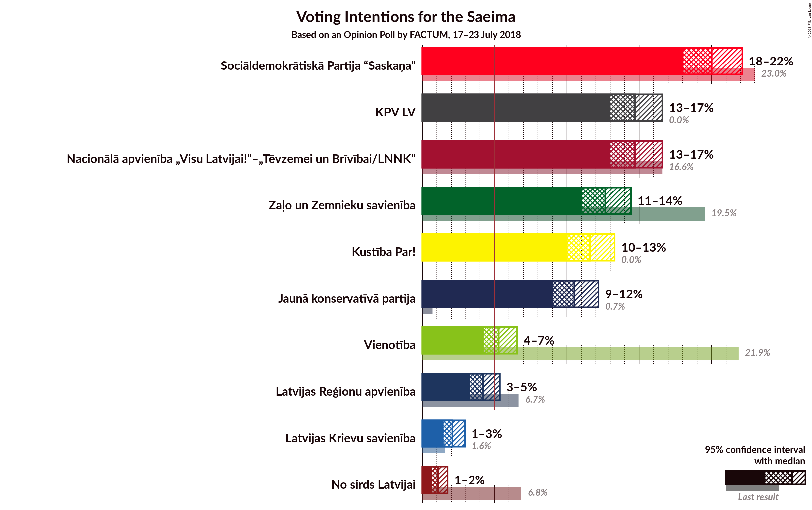
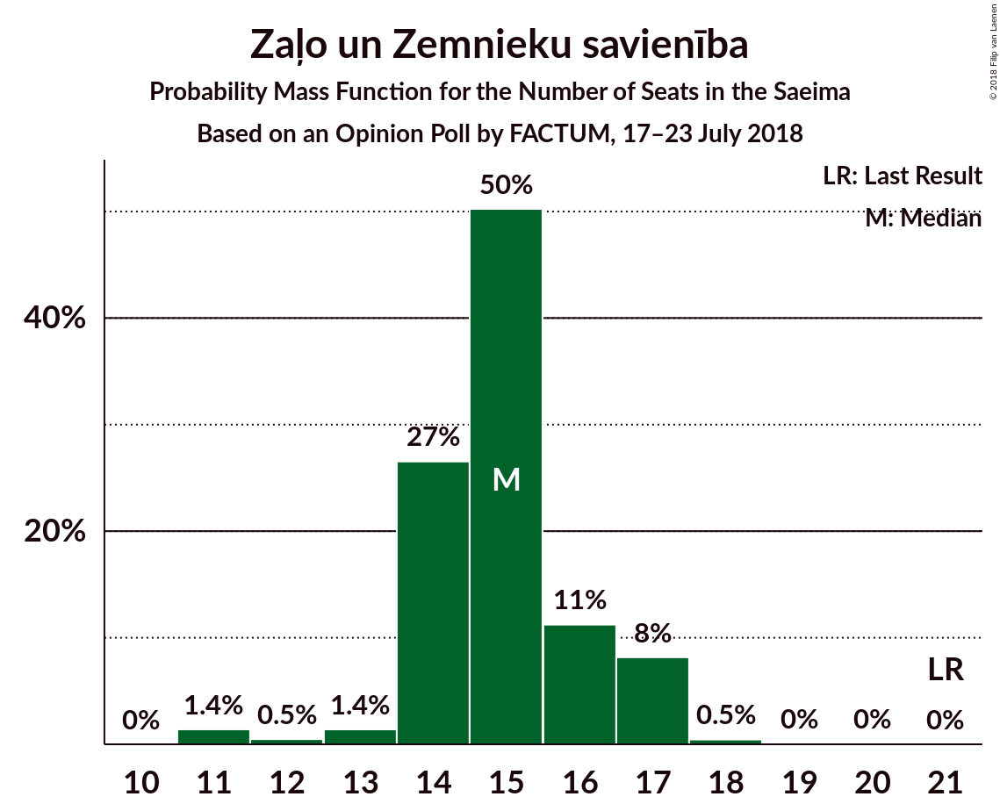
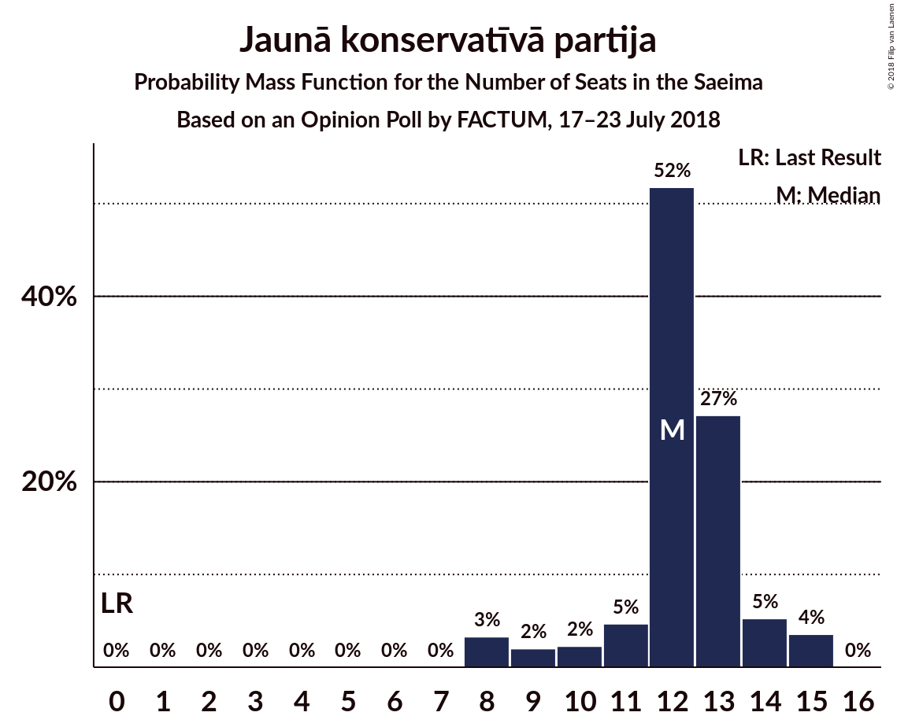
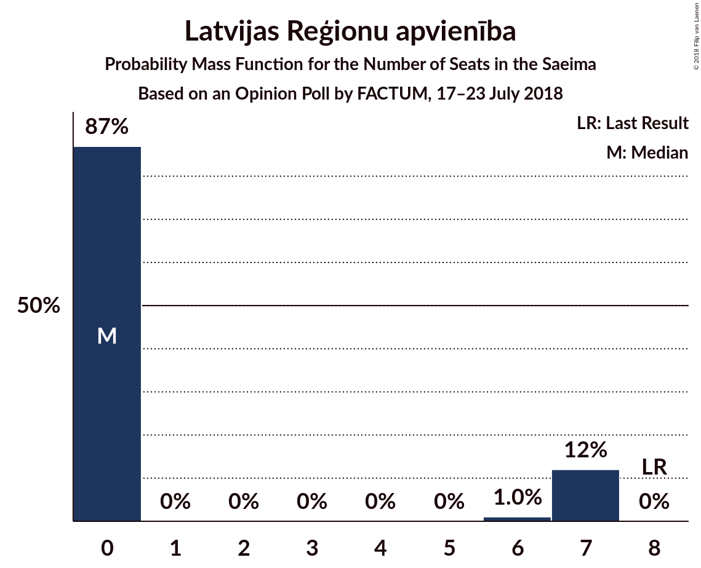
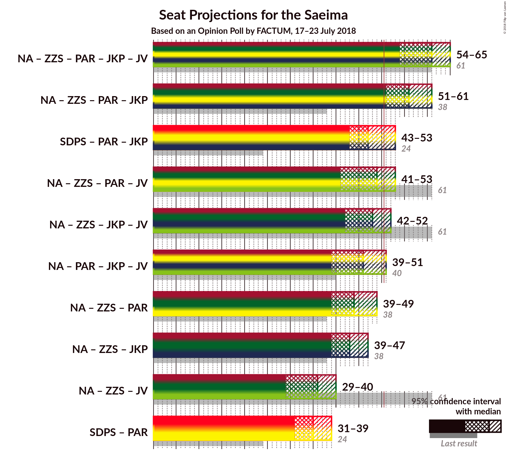

# Opinion Poll by FACTUM, 17–23 July 2018

<a href="#voting-intentions">Voting Intentions</a> | <a href="#seats">Seats</a> | <a href="#coalitions">Coalitions</a> | <a href="#technical-information">Technical Information</a>

## Voting Intentions

### Confidence Intervals

| Party | Last Result | Poll Result | 80% Confidence Interval | 90% Confidence Interval | 95% Confidence Interval | 99% Confidence Interval |
|:-----:|:-----------:|:-----------:|:-----------------------:|:-----------------------:|:-----------------------:|:-----------------------:|
| Sociāldemokrātiskā Partija “Saskaņa” | 23.0% | 20.0% | 18.7–21.4% |18.4–21.8% |18.1–22.1% |17.5–22.8% |
| Nacionālā apvienība „Visu Latvijai!”–„Tēvzemei un Brīvībai/LNNK” | 16.6% | 14.7% | 13.6–16.0% |13.3–16.3% |13.0–16.6% |12.5–17.2% |
| Kam pieder valsts? | 0.0% | 14.7% | 13.6–16.0% |13.3–16.3% |13.0–16.6% |12.5–17.2% |
| Zaļo un Zemnieku savienība | 19.5% | 12.7% | 11.6–13.8% |11.3–14.1% |11.1–14.4% |10.6–15.0% |
| Kustība Par! | 0.0% | 11.6% | 10.6–12.7% |10.3–13.0% |10.0–13.3% |9.6–13.9% |
| Jaunā konservatīvā partija | 0.7% | 10.5% | 9.5–11.6% |9.3–11.9% |9.1–12.2% |8.6–12.7% |
| Vienotība | 21.9% | 5.3% | 4.6–6.1% |4.4–6.3% |4.3–6.6% |4.0–7.0% |
| Latvijas Reģionu apvienība | 6.7% | 4.2% | 3.6–5.0% |3.4–5.2% |3.3–5.4% |3.0–5.7% |
| Latvijas Krievu savienība | 1.6% | 2.1% | 1.7–2.6% |1.6–2.8% |1.5–2.9% |1.3–3.2% |
| No sirds Latvijai | 6.8% | 1.1% | 0.8–1.5% |0.7–1.6% |0.7–1.7% |0.5–2.0% |

*Note:* The poll result column reflects the actual value used in the calculations. Published results may vary slightly, and in addition be rounded to fewer digits.

## Seats

### Confidence Intervals

| Party | Last Result | Median | 80% Confidence Interval | 90% Confidence Interval | 95% Confidence Interval | 99% Confidence Interval |
|:-----:|:-----------:|:------:|:-----------------------:|:-----------------------:|:-----------------------:|:-----------------------:|
| <a href="#sociāldemokrātiskā-partija-“saskaņa”">Sociāldemokrātiskā Partija “Saskaņa”</a> | 24 | 23 | 21–24 |21–25 |20–26 |19–26 |
| <a href="#nacionālā-apvienība-„visu-latvijai!”–„tēvzemei-un-brīvībai/lnnk”">Nacionālā apvienība „Visu Latvijai!”–„Tēvzemei un Brīvībai/LNNK”</a> | 17 | 15 | 14–18 |14–18 |14–18 |13–19 |
| <a href="#kam-pieder-valsts?">Kam pieder valsts?</a> | 0 | 16 | 15–17 |14–18 |14–18 |13–19 |
| <a href="#zaļo-un-zemnieku-savienība">Zaļo un Zemnieku savienība</a> | 21 | 15 | 14–16 |14–16 |12–17 |11–18 |
| <a href="#kustība-par!">Kustība Par!</a> | 0 | 13 | 12–14 |11–15 |10–15 |10–16 |
| <a href="#jaunā-konservatīvā-partija">Jaunā konservatīvā partija</a> | 0 | 12 | 10–13 |8–15 |8–15 |8–15 |
| <a href="#vienotība">Vienotība</a> | 23 | 7 | 0–7 |0–7 |0–7 |0–7 |
| <a href="#latvijas-reģionu-apvienība">Latvijas Reģionu apvienība</a> | 8 | 0 | 0 |0–7 |0–7 |0–7 |
| <a href="#latvijas-krievu-savienība">Latvijas Krievu savienība</a> | 0 | 0 | 0 |0 |0 |0 |
| <a href="#no-sirds-latvijai">No sirds Latvijai</a> | 7 | 0 | 0 |0 |0 |0 |

### Sociāldemokrātiskā Partija “Saskaņa”

*For a full overview of the results for this party, see the [Sociāldemokrātiskā Partija “Saskaņa”](party-sociāldemokrātiskāpartija“saskaņa”.html) page.*

| Number of Seats | Probability | Accumulated | Special Marks |
|:---------------:|:-----------:|:-----------:|:-------------:|
| 18 | 0.1% | 100% |  |
| 19 | 2% | 99.9% |  |
| 20 | 3% | 98% |  |
| 21 | 22% | 95% |  |
| 22 | 16% | 73% |  |
| 23 | 10% | 57% | Median |
| 24 | 40% | 47% | Last Result |
| 25 | 5% | 8% |  |
| 26 | 3% | 3% |  |
| 27 | 0.5% | 0.5% |  |
| 28 | 0% | 0% |  |

### Nacionālā apvienība „Visu Latvijai!”–„Tēvzemei un Brīvībai/LNNK”

*For a full overview of the results for this party, see the [Nacionālā apvienība „Visu Latvijai!”–„Tēvzemei un Brīvībai/LNNK”](party-nacionālāapvienība„visulatvijai”–„tēvzemeiunbrīvībailnnk”.html) page.*

| Number of Seats | Probability | Accumulated | Special Marks |
|:---------------:|:-----------:|:-----------:|:-------------:|
| 13 | 2% | 100% |  |
| 14 | 39% | 98% |  |
| 15 | 13% | 58% | Median |
| 16 | 16% | 45% |  |
| 17 | 12% | 30% | Last Result |
| 18 | 17% | 18% |  |
| 19 | 0.6% | 0.7% |  |
| 20 | 0.1% | 0.1% |  |
| 21 | 0% | 0% |  |

### Kam pieder valsts?

*For a full overview of the results for this party, see the [Kam pieder valsts?](party-kampiedervalsts.html) page.*

| Number of Seats | Probability | Accumulated | Special Marks |
|:---------------:|:-----------:|:-----------:|:-------------:|
| 0 | 0% | 100% | Last Result |
| 1 | 0% | 100% |  |
| 2 | 0% | 100% |  |
| 3 | 0% | 100% |  |
| 4 | 0% | 100% |  |
| 5 | 0% | 100% |  |
| 6 | 0% | 100% |  |
| 7 | 0% | 100% |  |
| 8 | 0% | 100% |  |
| 9 | 0% | 100% |  |
| 10 | 0% | 100% |  |
| 11 | 0% | 100% |  |
| 12 | 0.1% | 100% |  |
| 13 | 0.5% | 99.8% |  |
| 14 | 8% | 99.4% |  |
| 15 | 40% | 91% |  |
| 16 | 6% | 51% | Median |
| 17 | 40% | 45% |  |
| 18 | 3% | 6% |  |
| 19 | 2% | 2% |  |
| 20 | 0.4% | 0.4% |  |
| 21 | 0% | 0% |  |

### Zaļo un Zemnieku savienība

*For a full overview of the results for this party, see the [Zaļo un Zemnieku savienība](party-zaļounzemniekusavienība.html) page.*

| Number of Seats | Probability | Accumulated | Special Marks |
|:---------------:|:-----------:|:-----------:|:-------------:|
| 11 | 2% | 100% |  |
| 12 | 0.7% | 98% |  |
| 13 | 2% | 97% |  |
| 14 | 30% | 96% |  |
| 15 | 53% | 66% | Median |
| 16 | 9% | 13% |  |
| 17 | 3% | 4% |  |
| 18 | 0.8% | 0.9% |  |
| 19 | 0.1% | 0.1% |  |
| 20 | 0% | 0% |  |
| 21 | 0% | 0% | Last Result |

### Kustība Par!

*For a full overview of the results for this party, see the [Kustība Par!](party-kustībapar.html) page.*

| Number of Seats | Probability | Accumulated | Special Marks |
|:---------------:|:-----------:|:-----------:|:-------------:|
| 0 | 0% | 100% | Last Result |
| 1 | 0% | 100% |  |
| 2 | 0% | 100% |  |
| 3 | 0% | 100% |  |
| 4 | 0% | 100% |  |
| 5 | 0% | 100% |  |
| 6 | 0% | 100% |  |
| 7 | 0% | 100% |  |
| 8 | 0% | 100% |  |
| 9 | 0.1% | 100% |  |
| 10 | 4% | 99.9% |  |
| 11 | 6% | 96% |  |
| 12 | 6% | 90% |  |
| 13 | 58% | 84% | Median |
| 14 | 20% | 26% |  |
| 15 | 5% | 6% |  |
| 16 | 0.5% | 0.6% |  |
| 17 | 0.1% | 0.1% |  |
| 18 | 0% | 0% |  |

### Jaunā konservatīvā partija

*For a full overview of the results for this party, see the [Jaunā konservatīvā partija](party-jaunākonservatīvāpartija.html) page.*

| Number of Seats | Probability | Accumulated | Special Marks |
|:---------------:|:-----------:|:-----------:|:-------------:|
| 0 | 0% | 100% | Last Result |
| 1 | 0% | 100% |  |
| 2 | 0% | 100% |  |
| 3 | 0% | 100% |  |
| 4 | 0% | 100% |  |
| 5 | 0% | 100% |  |
| 6 | 0% | 100% |  |
| 7 | 0% | 100% |  |
| 8 | 6% | 100% |  |
| 9 | 3% | 94% |  |
| 10 | 3% | 91% |  |
| 11 | 5% | 88% |  |
| 12 | 54% | 83% | Median |
| 13 | 22% | 29% |  |
| 14 | 2% | 7% |  |
| 15 | 5% | 5% |  |
| 16 | 0% | 0% |  |

### Vienotība

*For a full overview of the results for this party, see the [Vienotība](party-vienotība.html) page.*

| Number of Seats | Probability | Accumulated | Special Marks |
|:---------------:|:-----------:|:-----------:|:-------------:|
| 0 | 21% | 100% |  |
| 1 | 0% | 79% |  |
| 2 | 0% | 79% |  |
| 3 | 0% | 79% |  |
| 4 | 0% | 79% |  |
| 5 | 0% | 79% |  |
| 6 | 0% | 79% |  |
| 7 | 79% | 79% | Median |
| 8 | 0.1% | 0.1% |  |
| 9 | 0% | 0% |  |
| 10 | 0% | 0% |  |
| 11 | 0% | 0% |  |
| 12 | 0% | 0% |  |
| 13 | 0% | 0% |  |
| 14 | 0% | 0% |  |
| 15 | 0% | 0% |  |
| 16 | 0% | 0% |  |
| 17 | 0% | 0% |  |
| 18 | 0% | 0% |  |
| 19 | 0% | 0% |  |
| 20 | 0% | 0% |  |
| 21 | 0% | 0% |  |
| 22 | 0% | 0% |  |
| 23 | 0% | 0% | Last Result |

### Latvijas Reģionu apvienība

*For a full overview of the results for this party, see the [Latvijas Reģionu apvienība](party-latvijasreģionuapvienība.html) page.*

| Number of Seats | Probability | Accumulated | Special Marks |
|:---------------:|:-----------:|:-----------:|:-------------:|
| 0 | 93% | 100% | Median |
| 1 | 0% | 7% |  |
| 2 | 0% | 7% |  |
| 3 | 0% | 7% |  |
| 4 | 0% | 7% |  |
| 5 | 0% | 7% |  |
| 6 | 0.4% | 7% |  |
| 7 | 7% | 7% |  |
| 8 | 0% | 0% | Last Result |

### Latvijas Krievu savienība

*For a full overview of the results for this party, see the [Latvijas Krievu savienība](party-latvijaskrievusavienība.html) page.*

| Number of Seats | Probability | Accumulated | Special Marks |
|:---------------:|:-----------:|:-----------:|:-------------:|
| 0 | 100% | 100% | Last Result, Median |

### No sirds Latvijai

*For a full overview of the results for this party, see the [No sirds Latvijai](party-nosirdslatvijai.html) page.*

| Number of Seats | Probability | Accumulated | Special Marks |
|:---------------:|:-----------:|:-----------:|:-------------:|
| 0 | 100% | 100% | Median |
| 1 | 0% | 0% |  |
| 2 | 0% | 0% |  |
| 3 | 0% | 0% |  |
| 4 | 0% | 0% |  |
| 5 | 0% | 0% |  |
| 6 | 0% | 0% |  |
| 7 | 0% | 0% | Last Result |

## Coalitions

### Confidence Intervals

| Coalition | Last Result | Median | Majority? | 80% Confidence Interval | 90% Confidence Interval | 95% Confidence Interval | 99% Confidence Interval |
|:---------:|:-----------:|:------:|:---------:|:-----------------------:|:-----------------------:|:-----------------------:|:-----------------------:|
| Nacionālā apvienība „Visu Latvijai!”–„Tēvzemei un Brīvībai/LNNK” – Zaļo un Zemnieku savienība – Kustība Par! – Jaunā konservatīvā partija – Vienotība | 61 | 61 | 100% | 58–64 | 57–64 | 54–65 | 54–65 |
| Nacionālā apvienība „Visu Latvijai!”–„Tēvzemei un Brīvībai/LNNK” – Zaļo un Zemnieku savienība – Kustība Par! – Jaunā konservatīvā partija | 38 | 54 | 96% | 53–59 | 52–60 | 50–61 | 47–61 |
| Nacionālā apvienība „Visu Latvijai!”–„Tēvzemei un Brīvībai/LNNK” – Zaļo un Zemnieku savienība – Kustība Par! – Vienotība | 61 | 49 | 23% | 46–52 | 44–52 | 44–53 | 43–53 |
| Nacionālā apvienība „Visu Latvijai!”–„Tēvzemei un Brīvībai/LNNK” – Zaļo un Zemnieku savienība – Jaunā konservatīvā partija – Vienotība | 61 | 48 | 8% | 45–50 | 43–51 | 43–52 | 40–53 |
| Nacionālā apvienība „Visu Latvijai!”–„Tēvzemei un Brīvībai/LNNK” – Zaļo un Zemnieku savienība – Kustība Par! | 38 | 42 | 0% | 41–46 | 40–47 | 39–48 | 38–49 |
| Nacionālā apvienība „Visu Latvijai!”–„Tēvzemei un Brīvībai/LNNK” – Zaļo un Zemnieku savienība – Jaunā konservatīvā partija | 38 | 41 | 0% | 40–46 | 39–46 | 37–47 | 36–49 |
| Nacionālā apvienība „Visu Latvijai!”–„Tēvzemei un Brīvībai/LNNK” – Zaļo un Zemnieku savienība – Vienotība | 61 | 36 | 0% | 32–38 | 31–39 | 31–39 | 29–41 |

### Nacionālā apvienība „Visu Latvijai!”–„Tēvzemei un Brīvībai/LNNK” – Zaļo un Zemnieku savienība – Kustība Par! – Jaunā konservatīvā partija – Vienotība

| Number of Seats | Probability | Accumulated | Special Marks |
|:---------------:|:-----------:|:-----------:|:-------------:|
| 51 | 0.2% | 100% | Majority |
| 52 | 0% | 99.8% |  |
| 53 | 0.2% | 99.8% |  |
| 54 | 2% | 99.6% |  |
| 55 | 1.2% | 97% |  |
| 56 | 0.8% | 96% |  |
| 57 | 4% | 95% |  |
| 58 | 2% | 91% |  |
| 59 | 9% | 89% |  |
| 60 | 8% | 80% |  |
| 61 | 44% | 72% | Last Result |
| 62 | 12% | 28% | Median |
| 63 | 4% | 15% |  |
| 64 | 8% | 11% |  |
| 65 | 3% | 3% |  |
| 66 | 0.1% | 0.1% |  |
| 67 | 0% | 0% |  |

### Nacionālā apvienība „Visu Latvijai!”–„Tēvzemei un Brīvībai/LNNK” – Zaļo un Zemnieku savienība – Kustība Par! – Jaunā konservatīvā partija

| Number of Seats | Probability | Accumulated | Special Marks |
|:---------------:|:-----------:|:-----------:|:-------------:|
| 38 | 0% | 100% | Last Result |
| 39 | 0% | 100% |  |
| 40 | 0% | 100% |  |
| 41 | 0% | 100% |  |
| 42 | 0% | 100% |  |
| 43 | 0% | 100% |  |
| 44 | 0% | 100% |  |
| 45 | 0% | 100% |  |
| 46 | 0% | 100% |  |
| 47 | 2% | 100% |  |
| 48 | 0.2% | 98% |  |
| 49 | 0.1% | 98% |  |
| 50 | 2% | 98% |  |
| 51 | 0.9% | 96% | Majority |
| 52 | 2% | 95% |  |
| 53 | 4% | 93% |  |
| 54 | 42% | 90% |  |
| 55 | 13% | 47% | Median |
| 56 | 5% | 35% |  |
| 57 | 10% | 30% |  |
| 58 | 5% | 19% |  |
| 59 | 7% | 14% |  |
| 60 | 4% | 7% |  |
| 61 | 2% | 3% |  |
| 62 | 0.4% | 0.4% |  |
| 63 | 0.1% | 0.1% |  |
| 64 | 0% | 0% |  |

### Nacionālā apvienība „Visu Latvijai!”–„Tēvzemei un Brīvībai/LNNK” – Zaļo un Zemnieku savienība – Kustība Par! – Vienotība

| Number of Seats | Probability | Accumulated | Special Marks |
|:---------------:|:-----------:|:-----------:|:-------------:|
| 40 | 0.2% | 100% |  |
| 41 | 0.1% | 99.8% |  |
| 42 | 0.2% | 99.7% |  |
| 43 | 0.9% | 99.5% |  |
| 44 | 5% | 98.6% |  |
| 45 | 3% | 94% |  |
| 46 | 8% | 91% |  |
| 47 | 6% | 83% |  |
| 48 | 8% | 77% |  |
| 49 | 43% | 70% |  |
| 50 | 4% | 26% | Median |
| 51 | 9% | 23% | Majority |
| 52 | 10% | 14% |  |
| 53 | 4% | 4% |  |
| 54 | 0.1% | 0.1% |  |
| 55 | 0% | 0% |  |
| 56 | 0% | 0% |  |
| 57 | 0% | 0% |  |
| 58 | 0% | 0% |  |
| 59 | 0% | 0% |  |
| 60 | 0% | 0% |  |
| 61 | 0% | 0% | Last Result |

### Nacionālā apvienība „Visu Latvijai!”–„Tēvzemei un Brīvībai/LNNK” – Zaļo un Zemnieku savienība – Jaunā konservatīvā partija – Vienotība

| Number of Seats | Probability | Accumulated | Special Marks |
|:---------------:|:-----------:|:-----------:|:-------------:|
| 39 | 0.1% | 100% |  |
| 40 | 0.4% | 99.8% |  |
| 41 | 1.0% | 99.4% |  |
| 42 | 0.5% | 98% |  |
| 43 | 3% | 98% |  |
| 44 | 4% | 95% |  |
| 45 | 5% | 91% |  |
| 46 | 8% | 86% |  |
| 47 | 8% | 78% |  |
| 48 | 41% | 70% |  |
| 49 | 14% | 29% | Median |
| 50 | 7% | 15% |  |
| 51 | 3% | 8% | Majority |
| 52 | 3% | 5% |  |
| 53 | 2% | 2% |  |
| 54 | 0% | 0% |  |
| 55 | 0% | 0% |  |
| 56 | 0% | 0% |  |
| 57 | 0% | 0% |  |
| 58 | 0% | 0% |  |
| 59 | 0% | 0% |  |
| 60 | 0% | 0% |  |
| 61 | 0% | 0% | Last Result |

### Nacionālā apvienība „Visu Latvijai!”–„Tēvzemei un Brīvībai/LNNK” – Zaļo un Zemnieku savienība – Kustība Par!

| Number of Seats | Probability | Accumulated | Special Marks |
|:---------------:|:-----------:|:-----------:|:-------------:|
| 37 | 0.1% | 100% |  |
| 38 | 0.9% | 99.9% | Last Result |
| 39 | 4% | 98.9% |  |
| 40 | 1.0% | 95% |  |
| 41 | 4% | 94% |  |
| 42 | 43% | 90% |  |
| 43 | 5% | 47% | Median |
| 44 | 14% | 42% |  |
| 45 | 12% | 29% |  |
| 46 | 8% | 17% |  |
| 47 | 5% | 9% |  |
| 48 | 3% | 4% |  |
| 49 | 0.7% | 0.8% |  |
| 50 | 0.1% | 0.1% |  |
| 51 | 0% | 0% | Majority |

### Nacionālā apvienība „Visu Latvijai!”–„Tēvzemei un Brīvībai/LNNK” – Zaļo un Zemnieku savienība – Jaunā konservatīvā partija

| Number of Seats | Probability | Accumulated | Special Marks |
|:---------------:|:-----------:|:-----------:|:-------------:|
| 35 | 0.1% | 100% |  |
| 36 | 2% | 99.9% |  |
| 37 | 0.4% | 98% |  |
| 38 | 1.0% | 97% | Last Result |
| 39 | 1.4% | 96% |  |
| 40 | 6% | 95% |  |
| 41 | 41% | 89% |  |
| 42 | 14% | 48% | Median |
| 43 | 8% | 34% |  |
| 44 | 6% | 26% |  |
| 45 | 7% | 19% |  |
| 46 | 9% | 13% |  |
| 47 | 2% | 4% |  |
| 48 | 0.7% | 1.4% |  |
| 49 | 0.4% | 0.7% |  |
| 50 | 0.3% | 0.3% |  |
| 51 | 0% | 0% | Majority |

### Nacionālā apvienība „Visu Latvijai!”–„Tēvzemei un Brīvībai/LNNK” – Zaļo un Zemnieku savienība – Vienotība

| Number of Seats | Probability | Accumulated | Special Marks |
|:---------------:|:-----------:|:-----------:|:-------------:|
| 28 | 0.1% | 100% |  |
| 29 | 0.6% | 99.9% |  |
| 30 | 2% | 99.4% |  |
| 31 | 5% | 98% |  |
| 32 | 4% | 92% |  |
| 33 | 3% | 88% |  |
| 34 | 7% | 85% |  |
| 35 | 6% | 78% |  |
| 36 | 44% | 72% |  |
| 37 | 5% | 28% | Median |
| 38 | 14% | 23% |  |
| 39 | 7% | 9% |  |
| 40 | 0.6% | 2% |  |
| 41 | 1.2% | 1.2% |  |
| 42 | 0% | 0% |  |
| 43 | 0% | 0% |  |
| 44 | 0% | 0% |  |
| 45 | 0% | 0% |  |
| 46 | 0% | 0% |  |
| 47 | 0% | 0% |  |
| 48 | 0% | 0% |  |
| 49 | 0% | 0% |  |
| 50 | 0% | 0% |  |
| 51 | 0% | 0% | Majority |
| 52 | 0% | 0% |  |
| 53 | 0% | 0% |  |
| 54 | 0% | 0% |  |
| 55 | 0% | 0% |  |
| 56 | 0% | 0% |  |
| 57 | 0% | 0% |  |
| 58 | 0% | 0% |  |
| 59 | 0% | 0% |  |
| 60 | 0% | 0% |  |
| 61 | 0% | 0% | Last Result |

## Technical Information

### Opinion Poll

+ **Polling firm:** FACTUM
+ **Commissioner(s):** —
+ **Fieldwork period:** 17–23 July 2018

### Calculations

+ **Sample size:** 1494
+ **Simulations done:** 524,288
+ **Error estimate:** 2.48%

