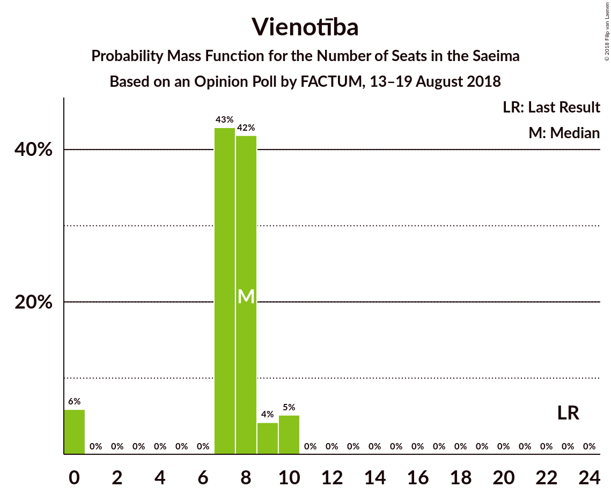

# Opinion Poll by FACTUM, 13–19 August 2018

<a href="#voting-intentions">Voting Intentions</a> | <a href="#seats">Seats</a> | <a href="#coalitions">Coalitions</a> | <a href="#technical-information">Technical Information</a>

## Voting Intentions

### Confidence Intervals

| Party | Last Result | Poll Result | 80% Confidence Interval | 90% Confidence Interval | 95% Confidence Interval | 99% Confidence Interval |
|:-----:|:-----------:|:-----------:|:-----------------------:|:-----------------------:|:-----------------------:|:-----------------------:|
| Sociāldemokrātiskā Partija “Saskaņa” | 23.0% | 21.0% | 19.7–22.4% |19.3–22.8% |19.0–23.2% |18.4–23.9% |
| KPV LV | 0.0% | 16.0% | 14.8–17.3% |14.4–17.6% |14.2–18.0% |13.6–18.6% |
| Zaļo un Zemnieku savienība | 19.5% | 12.0% | 11.0–13.2% |10.7–13.5% |10.4–13.8% |9.9–14.4% |
| Nacionālā apvienība „Visu Latvijai!”–„Tēvzemei un Brīvībai/LNNK” | 16.6% | 12.0% | 11.0–13.2% |10.7–13.5% |10.4–13.8% |9.9–14.4% |
| Jaunā konservatīvā partija | 0.7% | 10.0% | 9.0–11.1% |8.8–11.4% |8.5–11.6% |8.1–12.2% |
| Attīstībai–Par! | 0.9% | 10.0% | 9.0–11.1% |8.8–11.4% |8.5–11.6% |8.1–12.2% |
| Vienotība | 21.9% | 6.0% | 5.3–6.9% |5.1–7.1% |4.9–7.4% |4.6–7.8% |
| Latvijas Reģionu apvienība | 6.7% | 4.0% | 3.4–4.7% |3.2–4.9% |3.1–5.1% |2.8–5.5% |
| Latvijas Krievu savienība | 1.6% | 4.0% | 3.4–4.7% |3.2–4.9% |3.1–5.1% |2.8–5.5% |
| No sirds Latvijai | 6.8% | 1.0% | 0.7–1.4% |0.6–1.5% |0.6–1.6% |0.5–1.9% |

*Note:* The poll result column reflects the actual value used in the calculations. Published results may vary slightly, and in addition be rounded to fewer digits.

## Seats

### Confidence Intervals

| Party | Last Result | Median | 80% Confidence Interval | 90% Confidence Interval | 95% Confidence Interval | 99% Confidence Interval |
|:-----:|:-----------:|:------:|:-----------------------:|:-----------------------:|:-----------------------:|:-----------------------:|
| <a href="#sociāldemokrātiskā-partija-“saskaņa”">Sociāldemokrātiskā Partija “Saskaņa”</a> | 24 | 23 | 23–26 |22–26 |22–26 |21–27 |
| <a href="#kpv-lv">KPV LV</a> | 0 | 18 | 17–19 |16–20 |16–20 |15–20 |
| <a href="#zaļo-un-zemnieku-savienība">Zaļo un Zemnieku savienība</a> | 21 | 15 | 14–15 |14–16 |12–16 |11–17 |
| <a href="#nacionālā-apvienība-„visu-latvijai!”–„tēvzemei-un-brīvībai/lnnk”">Nacionālā apvienība „Visu Latvijai!”–„Tēvzemei un Brīvībai/LNNK”</a> | 17 | 13 | 13–14 |12–14 |12–15 |12–17 |
| <a href="#jaunā-konservatīvā-partija">Jaunā konservatīvā partija</a> | 0 | 13 | 10–13 |9–13 |9–13 |8–14 |
| <a href="#attīstībai–par!">Attīstībai–Par!</a> | 0 | 11 | 10–12 |10–13 |10–13 |9–14 |
| <a href="#vienotība">Vienotība</a> | 23 | 7 | 7 |7 |7–8 |0–8 |
| <a href="#latvijas-reģionu-apvienība">Latvijas Reģionu apvienība</a> | 8 | 0 | 0 |0 |0 |0–7 |
| <a href="#latvijas-krievu-savienība">Latvijas Krievu savienība</a> | 0 | 0 | 0 |0 |0 |0–6 |
| <a href="#no-sirds-latvijai">No sirds Latvijai</a> | 7 | 0 | 0 |0 |0 |0 |

### Sociāldemokrātiskā Partija “Saskaņa”

*For a full overview of the results for this party, see the [Sociāldemokrātiskā Partija “Saskaņa”](party-sociāldemokrātiskāpartija“saskaņa”.html) page.*

| Number of Seats | Probability | Accumulated | Special Marks |
|:---------------:|:-----------:|:-----------:|:-------------:|
| 19 | 0.1% | 100% |  |
| 20 | 0.2% | 99.9% |  |
| 21 | 0.7% | 99.7% |  |
| 22 | 4% | 99.0% |  |
| 23 | 56% | 95% | Median |
| 24 | 15% | 39% | Last Result |
| 25 | 13% | 24% |  |
| 26 | 9% | 10% |  |
| 27 | 1.2% | 1.3% |  |
| 28 | 0.1% | 0.1% |  |
| 29 | 0% | 0% |  |

### KPV LV

*For a full overview of the results for this party, see the [KPV LV](party-kpvlv.html) page.*

| Number of Seats | Probability | Accumulated | Special Marks |
|:---------------:|:-----------:|:-----------:|:-------------:|
| 0 | 0% | 100% | Last Result |
| 1 | 0% | 100% |  |
| 2 | 0% | 100% |  |
| 3 | 0% | 100% |  |
| 4 | 0% | 100% |  |
| 5 | 0% | 100% |  |
| 6 | 0% | 100% |  |
| 7 | 0% | 100% |  |
| 8 | 0% | 100% |  |
| 9 | 0% | 100% |  |
| 10 | 0% | 100% |  |
| 11 | 0% | 100% |  |
| 12 | 0% | 100% |  |
| 13 | 0% | 100% |  |
| 14 | 0.3% | 100% |  |
| 15 | 1.3% | 99.7% |  |
| 16 | 5% | 98% |  |
| 17 | 32% | 94% |  |
| 18 | 46% | 62% | Median |
| 19 | 8% | 16% |  |
| 20 | 7% | 7% |  |
| 21 | 0.3% | 0.4% |  |
| 22 | 0.1% | 0.1% |  |
| 23 | 0% | 0% |  |

### Zaļo un Zemnieku savienība

*For a full overview of the results for this party, see the [Zaļo un Zemnieku savienība](party-zaļounzemniekusavienība.html) page.*

| Number of Seats | Probability | Accumulated | Special Marks |
|:---------------:|:-----------:|:-----------:|:-------------:|
| 11 | 0.9% | 100% |  |
| 12 | 2% | 99.1% |  |
| 13 | 0.7% | 97% |  |
| 14 | 13% | 96% |  |
| 15 | 76% | 83% | Median |
| 16 | 7% | 7% |  |
| 17 | 0.7% | 0.8% |  |
| 18 | 0% | 0.1% |  |
| 19 | 0% | 0% |  |
| 20 | 0% | 0% |  |
| 21 | 0% | 0% | Last Result |

### Nacionālā apvienība „Visu Latvijai!”–„Tēvzemei un Brīvībai/LNNK”

*For a full overview of the results for this party, see the [Nacionālā apvienība „Visu Latvijai!”–„Tēvzemei un Brīvībai/LNNK”](party-nacionālāapvienība„visulatvijai”–„tēvzemeiunbrīvībailnnk”.html) page.*

| Number of Seats | Probability | Accumulated | Special Marks |
|:---------------:|:-----------:|:-----------:|:-------------:|
| 11 | 0.2% | 100% |  |
| 12 | 5% | 99.8% |  |
| 13 | 62% | 95% | Median |
| 14 | 28% | 32% |  |
| 15 | 3% | 4% |  |
| 16 | 0.5% | 1.4% |  |
| 17 | 0.9% | 0.9% | Last Result |
| 18 | 0.1% | 0.1% |  |
| 19 | 0% | 0% |  |

### Jaunā konservatīvā partija

*For a full overview of the results for this party, see the [Jaunā konservatīvā partija](party-jaunākonservatīvāpartija.html) page.*

| Number of Seats | Probability | Accumulated | Special Marks |
|:---------------:|:-----------:|:-----------:|:-------------:|
| 0 | 0% | 100% | Last Result |
| 1 | 0% | 100% |  |
| 2 | 0% | 100% |  |
| 3 | 0% | 100% |  |
| 4 | 0% | 100% |  |
| 5 | 0% | 100% |  |
| 6 | 0% | 100% |  |
| 7 | 0% | 100% |  |
| 8 | 1.1% | 100% |  |
| 9 | 5% | 98.9% |  |
| 10 | 13% | 94% |  |
| 11 | 7% | 80% |  |
| 12 | 12% | 74% |  |
| 13 | 61% | 62% | Median |
| 14 | 0.4% | 0.5% |  |
| 15 | 0.2% | 0.2% |  |
| 16 | 0% | 0% |  |

### Attīstībai–Par!

*For a full overview of the results for this party, see the [Attīstībai–Par!](party-attīstībai–par.html) page.*

| Number of Seats | Probability | Accumulated | Special Marks |
|:---------------:|:-----------:|:-----------:|:-------------:|
| 0 | 0% | 100% | Last Result |
| 1 | 0% | 100% |  |
| 2 | 0% | 100% |  |
| 3 | 0% | 100% |  |
| 4 | 0% | 100% |  |
| 5 | 0% | 100% |  |
| 6 | 0% | 100% |  |
| 7 | 0% | 100% |  |
| 8 | 0.1% | 100% |  |
| 9 | 1.3% | 99.9% |  |
| 10 | 24% | 98.6% |  |
| 11 | 39% | 74% | Median |
| 12 | 28% | 35% |  |
| 13 | 7% | 7% |  |
| 14 | 0.5% | 0.6% |  |
| 15 | 0.1% | 0.1% |  |
| 16 | 0% | 0% |  |

### Vienotība

*For a full overview of the results for this party, see the [Vienotība](party-vienotība.html) page.*

| Number of Seats | Probability | Accumulated | Special Marks |
|:---------------:|:-----------:|:-----------:|:-------------:|
| 0 | 2% | 100% |  |
| 1 | 0% | 98% |  |
| 2 | 0% | 98% |  |
| 3 | 0% | 98% |  |
| 4 | 0% | 98% |  |
| 5 | 0% | 98% |  |
| 6 | 0% | 98% |  |
| 7 | 94% | 98% | Median |
| 8 | 4% | 4% |  |
| 9 | 0.2% | 0.2% |  |
| 10 | 0% | 0% |  |
| 11 | 0% | 0% |  |
| 12 | 0% | 0% |  |
| 13 | 0% | 0% |  |
| 14 | 0% | 0% |  |
| 15 | 0% | 0% |  |
| 16 | 0% | 0% |  |
| 17 | 0% | 0% |  |
| 18 | 0% | 0% |  |
| 19 | 0% | 0% |  |
| 20 | 0% | 0% |  |
| 21 | 0% | 0% |  |
| 22 | 0% | 0% |  |
| 23 | 0% | 0% | Last Result |

### Latvijas Reģionu apvienība

*For a full overview of the results for this party, see the [Latvijas Reģionu apvienība](party-latvijasreģionuapvienība.html) page.*

| Number of Seats | Probability | Accumulated | Special Marks |
|:---------------:|:-----------:|:-----------:|:-------------:|
| 0 | 98.9% | 100% | Median |
| 1 | 0% | 1.1% |  |
| 2 | 0% | 1.1% |  |
| 3 | 0% | 1.1% |  |
| 4 | 0% | 1.1% |  |
| 5 | 0% | 1.1% |  |
| 6 | 0.3% | 1.1% |  |
| 7 | 0.8% | 0.8% |  |
| 8 | 0% | 0% | Last Result |

### Latvijas Krievu savienība

*For a full overview of the results for this party, see the [Latvijas Krievu savienība](party-latvijaskrievusavienība.html) page.*

| Number of Seats | Probability | Accumulated | Special Marks |
|:---------------:|:-----------:|:-----------:|:-------------:|
| 0 | 98% | 100% | Last Result, Median |
| 1 | 0% | 2% |  |
| 2 | 0% | 2% |  |
| 3 | 0% | 2% |  |
| 4 | 0% | 2% |  |
| 5 | 0% | 2% |  |
| 6 | 2% | 2% |  |
| 7 | 0.4% | 0.4% |  |
| 8 | 0% | 0% |  |

### No sirds Latvijai

*For a full overview of the results for this party, see the [No sirds Latvijai](party-nosirdslatvijai.html) page.*

| Number of Seats | Probability | Accumulated | Special Marks |
|:---------------:|:-----------:|:-----------:|:-------------:|
| 0 | 100% | 100% | Median |
| 1 | 0% | 0% |  |
| 2 | 0% | 0% |  |
| 3 | 0% | 0% |  |
| 4 | 0% | 0% |  |
| 5 | 0% | 0% |  |
| 6 | 0% | 0% |  |
| 7 | 0% | 0% | Last Result |

## Coalitions

### Confidence Intervals

| Coalition | Last Result | Median | Majority? | 80% Confidence Interval | 90% Confidence Interval | 95% Confidence Interval | 99% Confidence Interval |
|:---------:|:-----------:|:------:|:---------:|:-----------------------:|:-----------------------:|:-----------------------:|:-----------------------:|
| Nacionālā apvienība „Visu Latvijai!”–„Tēvzemei un Brīvībai/LNNK” – Zaļo un Zemnieku savienība – Jaunā konservatīvā partija – Attīstībai–Par! – Vienotība | 61 | 59 | 99.9% | 56–60 | 55–60 | 55–60 | 53–61 |
| Nacionālā apvienība „Visu Latvijai!”–„Tēvzemei un Brīvībai/LNNK” – Zaļo un Zemnieku savienība – Jaunā konservatīvā partija – Attīstībai–Par! | 38 | 52 | 78% | 49–53 | 48–53 | 48–53 | 47–56 |
| Nacionālā apvienība „Visu Latvijai!”–„Tēvzemei un Brīvībai/LNNK” – Zaļo un Zemnieku savienība – Attīstībai–Par! – Vienotība | 61 | 46 | 0.1% | 45–47 | 44–48 | 44–49 | 41–50 |
| Nacionālā apvienība „Visu Latvijai!”–„Tēvzemei un Brīvībai/LNNK” – Zaļo un Zemnieku savienība – Jaunā konservatīvā partija – Vienotība | 61 | 48 | 0.3% | 45–49 | 44–49 | 43–49 | 41–50 |
| Nacionālā apvienība „Visu Latvijai!”–„Tēvzemei un Brīvībai/LNNK” – Zaļo un Zemnieku savienība – Jaunā konservatīvā partija | 38 | 41 | 0% | 38–42 | 37–42 | 36–43 | 36–44 |
| Nacionālā apvienība „Visu Latvijai!”–„Tēvzemei un Brīvībai/LNNK” – Zaļo un Zemnieku savienība – Attīstībai–Par! | 38 | 39 | 0% | 38–40 | 38–42 | 37–42 | 35–43 |
| Nacionālā apvienība „Visu Latvijai!”–„Tēvzemei un Brīvībai/LNNK” – Zaļo un Zemnieku savienība – Vienotība | 61 | 35 | 0% | 34–36 | 33–36 | 32–37 | 30–39 |

### Nacionālā apvienība „Visu Latvijai!”–„Tēvzemei un Brīvībai/LNNK” – Zaļo un Zemnieku savienība – Jaunā konservatīvā partija – Attīstībai–Par! – Vienotība

| Number of Seats | Probability | Accumulated | Special Marks |
|:---------------:|:-----------:|:-----------:|:-------------:|
| 50 | 0% | 100% |  |
| 51 | 0% | 99.9% | Majority |
| 52 | 0.2% | 99.9% |  |
| 53 | 0.3% | 99.7% |  |
| 54 | 1.0% | 99.4% |  |
| 55 | 8% | 98% |  |
| 56 | 6% | 91% |  |
| 57 | 8% | 85% |  |
| 58 | 11% | 77% |  |
| 59 | 51% | 67% | Median |
| 60 | 15% | 16% |  |
| 61 | 1.1% | 1.3% | Last Result |
| 62 | 0.2% | 0.2% |  |
| 63 | 0% | 0% |  |

### Nacionālā apvienība „Visu Latvijai!”–„Tēvzemei un Brīvībai/LNNK” – Zaļo un Zemnieku savienība – Jaunā konservatīvā partija – Attīstībai–Par!

| Number of Seats | Probability | Accumulated | Special Marks |
|:---------------:|:-----------:|:-----------:|:-------------:|
| 38 | 0% | 100% | Last Result |
| 39 | 0% | 100% |  |
| 40 | 0% | 100% |  |
| 41 | 0% | 100% |  |
| 42 | 0% | 100% |  |
| 43 | 0% | 100% |  |
| 44 | 0% | 100% |  |
| 45 | 0.1% | 100% |  |
| 46 | 0.1% | 99.8% |  |
| 47 | 0.9% | 99.7% |  |
| 48 | 8% | 98.8% |  |
| 49 | 5% | 91% |  |
| 50 | 8% | 86% |  |
| 51 | 11% | 78% | Majority |
| 52 | 53% | 68% | Median |
| 53 | 12% | 14% |  |
| 54 | 1.2% | 2% |  |
| 55 | 0.3% | 1.2% |  |
| 56 | 0.6% | 0.9% |  |
| 57 | 0.2% | 0.3% |  |
| 58 | 0.1% | 0.1% |  |
| 59 | 0% | 0% |  |

### Nacionālā apvienība „Visu Latvijai!”–„Tēvzemei un Brīvībai/LNNK” – Zaļo un Zemnieku savienība – Attīstībai–Par! – Vienotība

| Number of Seats | Probability | Accumulated | Special Marks |
|:---------------:|:-----------:|:-----------:|:-------------:|
| 39 | 0.1% | 100% |  |
| 40 | 0.1% | 99.9% |  |
| 41 | 0.3% | 99.8% |  |
| 42 | 0.6% | 99.4% |  |
| 43 | 1.3% | 98.8% |  |
| 44 | 3% | 98% |  |
| 45 | 8% | 95% |  |
| 46 | 53% | 87% | Median |
| 47 | 26% | 35% |  |
| 48 | 4% | 8% |  |
| 49 | 3% | 4% |  |
| 50 | 0.8% | 0.9% |  |
| 51 | 0.1% | 0.1% | Majority |
| 52 | 0% | 0% |  |
| 53 | 0% | 0% |  |
| 54 | 0% | 0% |  |
| 55 | 0% | 0% |  |
| 56 | 0% | 0% |  |
| 57 | 0% | 0% |  |
| 58 | 0% | 0% |  |
| 59 | 0% | 0% |  |
| 60 | 0% | 0% |  |
| 61 | 0% | 0% | Last Result |

### Nacionālā apvienība „Visu Latvijai!”–„Tēvzemei un Brīvībai/LNNK” – Zaļo un Zemnieku savienība – Jaunā konservatīvā partija – Vienotība

| Number of Seats | Probability | Accumulated | Special Marks |
|:---------------:|:-----------:|:-----------:|:-------------:|
| 39 | 0% | 100% |  |
| 40 | 0.1% | 99.9% |  |
| 41 | 0.3% | 99.8% |  |
| 42 | 0.5% | 99.5% |  |
| 43 | 3% | 99.0% |  |
| 44 | 4% | 96% |  |
| 45 | 13% | 92% |  |
| 46 | 6% | 79% |  |
| 47 | 13% | 73% |  |
| 48 | 44% | 61% | Median |
| 49 | 15% | 17% |  |
| 50 | 2% | 2% |  |
| 51 | 0.2% | 0.3% | Majority |
| 52 | 0% | 0% |  |
| 53 | 0% | 0% |  |
| 54 | 0% | 0% |  |
| 55 | 0% | 0% |  |
| 56 | 0% | 0% |  |
| 57 | 0% | 0% |  |
| 58 | 0% | 0% |  |
| 59 | 0% | 0% |  |
| 60 | 0% | 0% |  |
| 61 | 0% | 0% | Last Result |

### Nacionālā apvienība „Visu Latvijai!”–„Tēvzemei un Brīvībai/LNNK” – Zaļo un Zemnieku savienība – Jaunā konservatīvā partija

| Number of Seats | Probability | Accumulated | Special Marks |
|:---------------:|:-----------:|:-----------:|:-------------:|
| 34 | 0.1% | 100% |  |
| 35 | 0.3% | 99.9% |  |
| 36 | 2% | 99.5% |  |
| 37 | 4% | 97% |  |
| 38 | 13% | 93% | Last Result |
| 39 | 6% | 80% |  |
| 40 | 13% | 74% |  |
| 41 | 45% | 61% | Median |
| 42 | 13% | 16% |  |
| 43 | 2% | 3% |  |
| 44 | 0.4% | 0.5% |  |
| 45 | 0.1% | 0.2% |  |
| 46 | 0.1% | 0.1% |  |
| 47 | 0% | 0% |  |

### Nacionālā apvienība „Visu Latvijai!”–„Tēvzemei un Brīvībai/LNNK” – Zaļo un Zemnieku savienība – Attīstībai–Par!

| Number of Seats | Probability | Accumulated | Special Marks |
|:---------------:|:-----------:|:-----------:|:-------------:|
| 34 | 0.2% | 100% |  |
| 35 | 0.6% | 99.8% |  |
| 36 | 0.5% | 99.2% |  |
| 37 | 3% | 98.7% |  |
| 38 | 8% | 96% | Last Result |
| 39 | 55% | 88% | Median |
| 40 | 25% | 34% |  |
| 41 | 4% | 9% |  |
| 42 | 3% | 5% |  |
| 43 | 2% | 2% |  |
| 44 | 0.3% | 0.4% |  |
| 45 | 0.1% | 0.1% |  |
| 46 | 0% | 0% |  |

### Nacionālā apvienība „Visu Latvijai!”–„Tēvzemei un Brīvībai/LNNK” – Zaļo un Zemnieku savienība – Vienotība

| Number of Seats | Probability | Accumulated | Special Marks |
|:---------------:|:-----------:|:-----------:|:-------------:|
| 27 | 0% | 100% |  |
| 28 | 0.2% | 99.9% |  |
| 29 | 0.2% | 99.8% |  |
| 30 | 0.7% | 99.6% |  |
| 31 | 0.5% | 98.8% |  |
| 32 | 2% | 98% |  |
| 33 | 2% | 96% |  |
| 34 | 8% | 94% |  |
| 35 | 55% | 86% | Median |
| 36 | 26% | 31% |  |
| 37 | 4% | 5% |  |
| 38 | 0.4% | 1.1% |  |
| 39 | 0.6% | 0.7% |  |
| 40 | 0.1% | 0.1% |  |
| 41 | 0% | 0% |  |
| 42 | 0% | 0% |  |
| 43 | 0% | 0% |  |
| 44 | 0% | 0% |  |
| 45 | 0% | 0% |  |
| 46 | 0% | 0% |  |
| 47 | 0% | 0% |  |
| 48 | 0% | 0% |  |
| 49 | 0% | 0% |  |
| 50 | 0% | 0% |  |
| 51 | 0% | 0% | Majority |
| 52 | 0% | 0% |  |
| 53 | 0% | 0% |  |
| 54 | 0% | 0% |  |
| 55 | 0% | 0% |  |
| 56 | 0% | 0% |  |
| 57 | 0% | 0% |  |
| 58 | 0% | 0% |  |
| 59 | 0% | 0% |  |
| 60 | 0% | 0% |  |
| 61 | 0% | 0% | Last Result |

## Technical Information

### Opinion Poll

+ **Polling firm:** FACTUM
+ **Commissioner(s):** —
+ **Fieldwork period:** 13–19 August 2018

### Calculations

+ **Sample size:** 1433
+ **Simulations done:** 1,048,575
+ **Error estimate:** 0.88%

