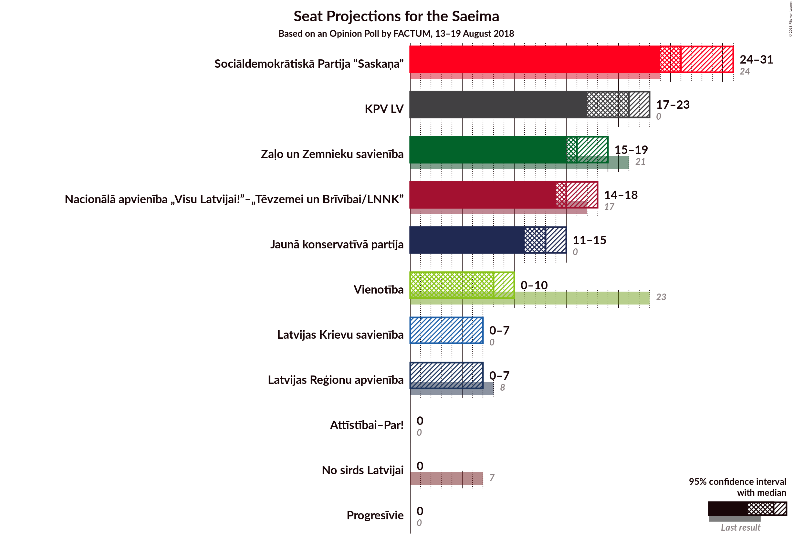

# Opinion Poll by FACTUM, 13–19 August 2018

<a href="#voting-intentions">Voting Intentions</a> | <a href="#seats">Seats</a> | <a href="#coalitions">Coalitions</a> | <a href="#technical-information">Technical Information</a>

## Voting Intentions

### Confidence Intervals

| Party | Last Result | Poll Result | 80% Confidence Interval | 90% Confidence Interval | 95% Confidence Interval | 99% Confidence Interval |
|:-----:|:-----------:|:-----------:|:-----------------------:|:-----------------------:|:-----------------------:|:-----------------------:|
| Sociāldemokrātiskā Partija “Saskaņa” | 23.0% | 21.0% | 19.7–22.4% |19.3–22.8% |19.0–23.2% |18.4–23.9% |
| KPV LV | 0.0% | 16.0% | 14.8–17.3% |14.4–17.6% |14.2–18.0% |13.6–18.6% |
| Zaļo un Zemnieku savienība | 19.5% | 12.0% | 11.0–13.2% |10.7–13.5% |10.4–13.8% |9.9–14.4% |
| Nacionālā apvienība „Visu Latvijai!”–„Tēvzemei un Brīvībai/LNNK” | 16.6% | 12.0% | 11.0–13.2% |10.7–13.5% |10.4–13.8% |9.9–14.4% |
| Jaunā konservatīvā partija | 0.7% | 10.0% | 9.0–11.1% |8.8–11.4% |8.5–11.6% |8.1–12.2% |
| Kustība Par! | 0.0% | 10.0% | N/A |N/A |N/A |N/A |
| Vienotība | 21.9% | 6.0% | 5.3–6.9% |5.1–7.1% |4.9–7.4% |4.6–7.8% |
| Latvijas Reģionu apvienība | 6.7% | 4.0% | 3.4–4.7% |3.2–4.9% |3.1–5.1% |2.8–5.5% |
| Latvijas Krievu savienība | 1.6% | 4.0% | 3.4–4.7% |3.2–4.9% |3.1–5.1% |2.8–5.5% |
| No sirds Latvijai | 6.8% | 1.0% | 0.7–1.4% |0.6–1.5% |0.6–1.6% |0.5–1.9% |

*Note:* The poll result column reflects the actual value used in the calculations. Published results may vary slightly, and in addition be rounded to fewer digits.

## Seats

### Confidence Intervals

| Party | Last Result | Median | 80% Confidence Interval | 90% Confidence Interval | 95% Confidence Interval | 99% Confidence Interval |
|:-----:|:-----------:|:------:|:-----------------------:|:-----------------------:|:-----------------------:|:-----------------------:|
| <a href="#sociāldemokrātiskā-partija-“saskaņa”">Sociāldemokrātiskā Partija “Saskaņa”</a> | 24 | 23 | 23–26 |22–26 |22–26 |21–27 |
| <a href="#kpv-lv">KPV LV</a> | 0 | 18 | 17–19 |16–20 |16–20 |15–20 |
| <a href="#zaļo-un-zemnieku-savienība">Zaļo un Zemnieku savienība</a> | 21 | 15 | 14–15 |14–16 |12–16 |11–17 |
| <a href="#nacionālā-apvienība-„visu-latvijai!”–„tēvzemei-un-brīvībai/lnnk”">Nacionālā apvienība „Visu Latvijai!”–„Tēvzemei un Brīvībai/LNNK”</a> | 17 | 13 | 13–14 |12–14 |12–15 |12–17 |
| <a href="#jaunā-konservatīvā-partija">Jaunā konservatīvā partija</a> | 0 | 13 | 10–13 |9–13 |9–13 |8–14 |
| <a href="#kustība-par!">Kustība Par!</a> | 0 | N/A | N/A |N/A |N/A |N/A |
| <a href="#vienotība">Vienotība</a> | 23 | 7 | 7 |7 |7–8 |0–8 |
| <a href="#latvijas-reģionu-apvienība">Latvijas Reģionu apvienība</a> | 8 | 0 | 0 |0 |0 |0–7 |
| <a href="#latvijas-krievu-savienība">Latvijas Krievu savienība</a> | 0 | 0 | 0 |0 |0 |0–6 |
| <a href="#no-sirds-latvijai">No sirds Latvijai</a> | 7 | 0 | 0 |0 |0 |0 |

