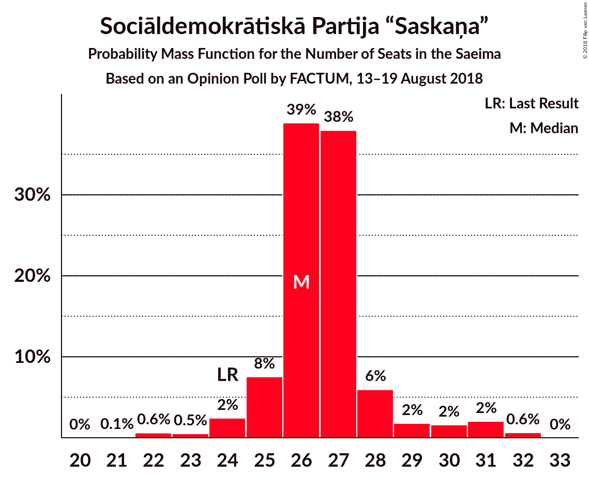
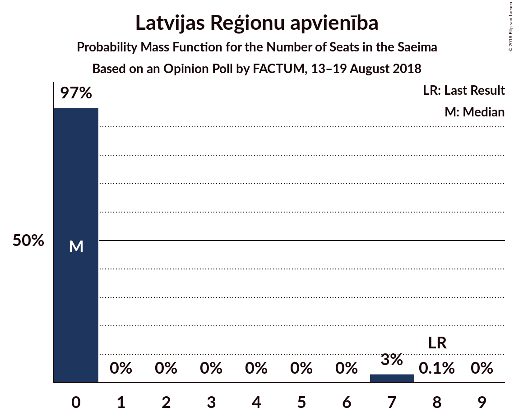
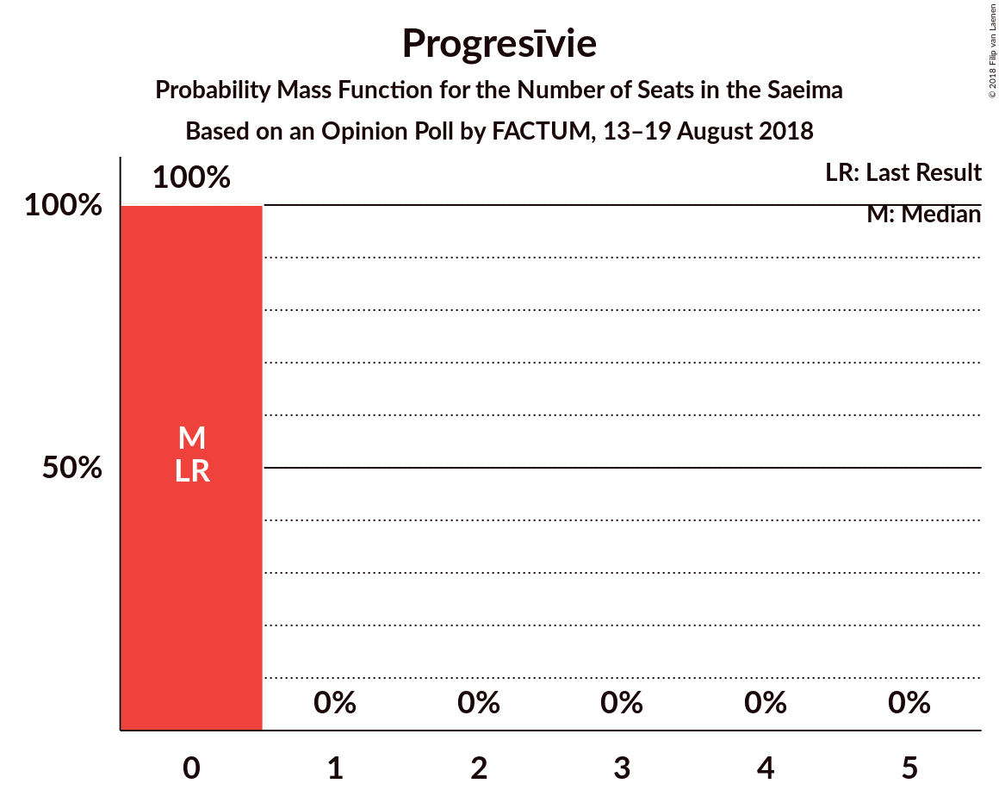
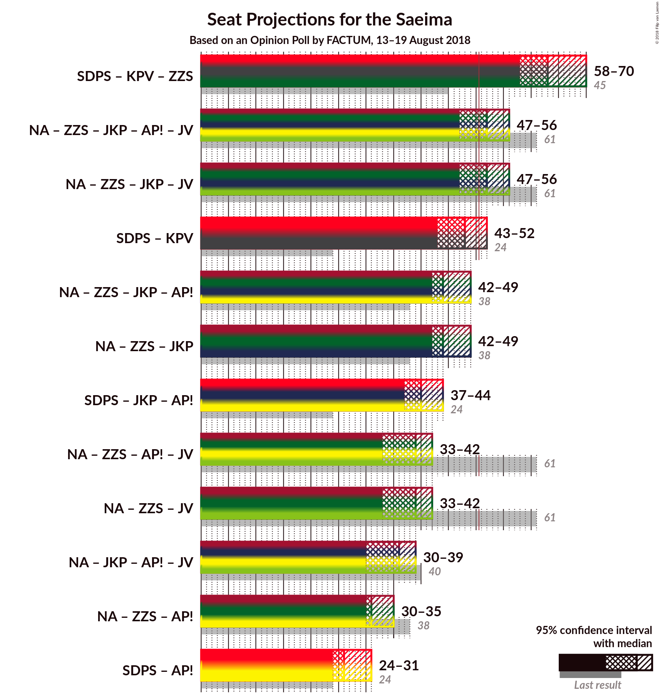

# Opinion Poll by FACTUM, 13–19 August 2018

<a href="#voting-intentions">Voting Intentions</a> | <a href="#seats">Seats</a> | <a href="#coalitions">Coalitions</a> | <a href="#technical-information">Technical Information</a>

## Voting Intentions

### Confidence Intervals

| Party | Last Result | Poll Result | 80% Confidence Interval | 90% Confidence Interval | 95% Confidence Interval | 99% Confidence Interval |
|:-----:|:-----------:|:-----------:|:-----------------------:|:-----------------------:|:-----------------------:|:-----------------------:|
| Sociāldemokrātiskā Partija “Saskaņa” | 23.0% | 20.4% | 19.1–21.8% |18.7–22.2% |18.4–22.5% |17.8–23.2% |
| KPV LV | 0.0% | 15.6% | 14.4–16.9% |14.1–17.2% |13.8–17.5% |13.2–18.2% |
| Zaļo un Zemnieku savienība | 19.5% | 11.7% | 10.6–12.8% |10.3–13.1% |10.1–13.4% |9.6–14.0% |
| Nacionālā apvienība „Visu Latvijai!”–„Tēvzemei un Brīvībai/LNNK” | 16.6% | 11.7% | 10.6–12.8% |10.3–13.1% |10.1–13.4% |9.6–14.0% |
| Jaunā konservatīvā partija | 0.7% | 9.7% | 8.8–10.8% |8.5–11.1% |8.3–11.4% |7.8–11.9% |
| Attīstībai–Par! | 0.9% | 9.7% | 8.8–10.8% |8.5–11.1% |8.3–11.4% |7.8–11.9% |
| Vienotība | 21.9% | 5.8% | 5.1–6.7% |4.9–6.9% |4.7–7.1% |4.4–7.6% |
| Latvijas Reģionu apvienība | 6.7% | 3.9% | 3.3–4.6% |3.2–4.9% |3.0–5.0% |2.8–5.4% |
| Latvijas Krievu savienība | 1.6% | 3.9% | 3.3–4.6% |3.2–4.9% |3.0–5.0% |2.8–5.4% |
| Progresīvie | 0.0% | 2.9% | 2.4–3.6% |2.3–3.8% |2.2–3.9% |2.0–4.3% |
| No sirds Latvijai | 6.8% | 1.0% | 0.7–1.4% |0.6–1.5% |0.6–1.6% |0.5–1.9% |

*Note:* The poll result column reflects the actual value used in the calculations. Published results may vary slightly, and in addition be rounded to fewer digits.

## Seats

### Confidence Intervals

| Party | Last Result | Median | 80% Confidence Interval | 90% Confidence Interval | 95% Confidence Interval | 99% Confidence Interval |
|:-----:|:-----------:|:------:|:-----------------------:|:-----------------------:|:-----------------------:|:-----------------------:|
| <a href="#sociāldemokrātiskā-partija-“saskaņa”">Sociāldemokrātiskā Partija “Saskaņa”</a> | 24 | 26 | 25–28 |25–29 |24–31 |22–32 |
| <a href="#kpv-lv">KPV LV</a> | 0 | 21 | 19–23 |18–23 |17–23 |17–24 |
| <a href="#zaļo-un-zemnieku-savienība">Zaļo un Zemnieku savienība</a> | 21 | 16 | 15–17 |15–18 |15–19 |14–20 |
| <a href="#nacionālā-apvienība-„visu-latvijai!”–„tēvzemei-un-brīvībai/lnnk”">Nacionālā apvienība „Visu Latvijai!”–„Tēvzemei un Brīvībai/LNNK”</a> | 17 | 15 | 14–18 |14–18 |14–18 |13–18 |
| <a href="#jaunā-konservatīvā-partija">Jaunā konservatīvā partija</a> | 0 | 13 | 12–15 |12–15 |11–15 |10–16 |
| <a href="#attīstībai–par!">Attīstībai–Par!</a> | 0 | 0 | 0 |0 |0 |0 |
| <a href="#vienotība">Vienotība</a> | 23 | 8 | 7–8 |0–10 |0–10 |0–10 |
| <a href="#latvijas-reģionu-apvienība">Latvijas Reģionu apvienība</a> | 8 | 0 | 0 |0 |0–7 |0–7 |
| <a href="#latvijas-krievu-savienība">Latvijas Krievu savienība</a> | 0 | 0 | 0 |0 |0–7 |0–7 |
| <a href="#progresīvie">Progresīvie</a> | 0 | 0 | 0 |0 |0 |0 |
| <a href="#no-sirds-latvijai">No sirds Latvijai</a> | 7 | 0 | 0 |0 |0 |0 |

### Sociāldemokrātiskā Partija “Saskaņa”

*For a full overview of the results for this party, see the [Sociāldemokrātiskā Partija “Saskaņa”](party-sociāldemokrātiskāpartija“saskaņa”.html) page.*

| Number of Seats | Probability | Accumulated | Special Marks |
|:---------------:|:-----------:|:-----------:|:-------------:|
| 21 | 0.1% | 100% |  |
| 22 | 0.6% | 99.9% |  |
| 23 | 0.5% | 99.3% |  |
| 24 | 2% | 98.8% | Last Result |
| 25 | 8% | 96% |  |
| 26 | 39% | 89% | Median |
| 27 | 38% | 50% |  |
| 28 | 6% | 12% |  |
| 29 | 2% | 6% |  |
| 30 | 2% | 4% |  |
| 31 | 2% | 3% |  |
| 32 | 0.6% | 0.6% |  |
| 33 | 0% | 0% |  |

### KPV LV

*For a full overview of the results for this party, see the [KPV LV](party-kpvlv.html) page.*

| Number of Seats | Probability | Accumulated | Special Marks |
|:---------------:|:-----------:|:-----------:|:-------------:|
| 0 | 0% | 100% | Last Result |
| 1 | 0% | 100% |  |
| 2 | 0% | 100% |  |
| 3 | 0% | 100% |  |
| 4 | 0% | 100% |  |
| 5 | 0% | 100% |  |
| 6 | 0% | 100% |  |
| 7 | 0% | 100% |  |
| 8 | 0% | 100% |  |
| 9 | 0% | 100% |  |
| 10 | 0% | 100% |  |
| 11 | 0% | 100% |  |
| 12 | 0% | 100% |  |
| 13 | 0% | 100% |  |
| 14 | 0% | 100% |  |
| 15 | 0% | 100% |  |
| 16 | 0.3% | 100% |  |
| 17 | 3% | 99.7% |  |
| 18 | 3% | 97% |  |
| 19 | 19% | 93% |  |
| 20 | 13% | 74% |  |
| 21 | 26% | 61% | Median |
| 22 | 16% | 35% |  |
| 23 | 18% | 20% |  |
| 24 | 0.9% | 1.2% |  |
| 25 | 0.3% | 0.3% |  |
| 26 | 0% | 0% |  |

### Zaļo un Zemnieku savienība

*For a full overview of the results for this party, see the [Zaļo un Zemnieku savienība](party-zaļounzemniekusavienība.html) page.*

| Number of Seats | Probability | Accumulated | Special Marks |
|:---------------:|:-----------:|:-----------:|:-------------:|
| 13 | 0.1% | 100% |  |
| 14 | 2% | 99.9% |  |
| 15 | 32% | 98% |  |
| 16 | 19% | 67% | Median |
| 17 | 40% | 48% |  |
| 18 | 4% | 7% |  |
| 19 | 2% | 3% |  |
| 20 | 0.8% | 1.0% |  |
| 21 | 0.1% | 0.1% | Last Result |
| 22 | 0% | 0% |  |

### Nacionālā apvienība „Visu Latvijai!”–„Tēvzemei un Brīvībai/LNNK”

*For a full overview of the results for this party, see the [Nacionālā apvienība „Visu Latvijai!”–„Tēvzemei un Brīvībai/LNNK”](party-nacionālāapvienība„visulatvijai”–„tēvzemeiunbrīvībailnnk”.html) page.*

| Number of Seats | Probability | Accumulated | Special Marks |
|:---------------:|:-----------:|:-----------:|:-------------:|
| 12 | 0.5% | 100% |  |
| 13 | 2% | 99.5% |  |
| 14 | 23% | 98% |  |
| 15 | 34% | 74% | Median |
| 16 | 20% | 41% |  |
| 17 | 6% | 21% | Last Result |
| 18 | 14% | 15% |  |
| 19 | 0.1% | 0.2% |  |
| 20 | 0% | 0.1% |  |
| 21 | 0% | 0% |  |

### Jaunā konservatīvā partija

*For a full overview of the results for this party, see the [Jaunā konservatīvā partija](party-jaunākonservatīvāpartija.html) page.*

| Number of Seats | Probability | Accumulated | Special Marks |
|:---------------:|:-----------:|:-----------:|:-------------:|
| 0 | 0% | 100% | Last Result |
| 1 | 0% | 100% |  |
| 2 | 0% | 100% |  |
| 3 | 0% | 100% |  |
| 4 | 0% | 100% |  |
| 5 | 0% | 100% |  |
| 6 | 0% | 100% |  |
| 7 | 0% | 100% |  |
| 8 | 0% | 100% |  |
| 9 | 0.1% | 100% |  |
| 10 | 2% | 99.9% |  |
| 11 | 2% | 98% |  |
| 12 | 7% | 97% |  |
| 13 | 69% | 90% | Median |
| 14 | 6% | 21% |  |
| 15 | 14% | 15% |  |
| 16 | 0.9% | 1.0% |  |
| 17 | 0.1% | 0.1% |  |
| 18 | 0% | 0% |  |

### Attīstībai–Par!

*For a full overview of the results for this party, see the [Attīstībai–Par!](party-attīstībai–par.html) page.*

| Number of Seats | Probability | Accumulated | Special Marks |
|:---------------:|:-----------:|:-----------:|:-------------:|
| 0 | 100% | 100% | Last Result, Median |

### Vienotība

*For a full overview of the results for this party, see the [Vienotība](party-vienotība.html) page.*

| Number of Seats | Probability | Accumulated | Special Marks |
|:---------------:|:-----------:|:-----------:|:-------------:|
| 0 | 6% | 100% |  |
| 1 | 0% | 94% |  |
| 2 | 0% | 94% |  |
| 3 | 0% | 94% |  |
| 4 | 0% | 94% |  |
| 5 | 0% | 94% |  |
| 6 | 0% | 94% |  |
| 7 | 43% | 94% |  |
| 8 | 42% | 51% | Median |
| 9 | 4% | 9% |  |
| 10 | 5% | 5% |  |
| 11 | 0% | 0% |  |
| 12 | 0% | 0% |  |
| 13 | 0% | 0% |  |
| 14 | 0% | 0% |  |
| 15 | 0% | 0% |  |
| 16 | 0% | 0% |  |
| 17 | 0% | 0% |  |
| 18 | 0% | 0% |  |
| 19 | 0% | 0% |  |
| 20 | 0% | 0% |  |
| 21 | 0% | 0% |  |
| 22 | 0% | 0% |  |
| 23 | 0% | 0% | Last Result |

### Latvijas Reģionu apvienība

*For a full overview of the results for this party, see the [Latvijas Reģionu apvienība](party-latvijasreģionuapvienība.html) page.*

| Number of Seats | Probability | Accumulated | Special Marks |
|:---------------:|:-----------:|:-----------:|:-------------:|
| 0 | 97% | 100% | Median |
| 1 | 0% | 3% |  |
| 2 | 0% | 3% |  |
| 3 | 0% | 3% |  |
| 4 | 0% | 3% |  |
| 5 | 0% | 3% |  |
| 6 | 0% | 3% |  |
| 7 | 3% | 3% |  |
| 8 | 0.1% | 0.1% | Last Result |
| 9 | 0% | 0% |  |

### Latvijas Krievu savienība

*For a full overview of the results for this party, see the [Latvijas Krievu savienība](party-latvijaskrievusavienība.html) page.*

| Number of Seats | Probability | Accumulated | Special Marks |
|:---------------:|:-----------:|:-----------:|:-------------:|
| 0 | 97% | 100% | Last Result, Median |
| 1 | 0% | 3% |  |
| 2 | 0% | 3% |  |
| 3 | 0% | 3% |  |
| 4 | 0% | 3% |  |
| 5 | 0% | 3% |  |
| 6 | 0.2% | 3% |  |
| 7 | 3% | 3% |  |
| 8 | 0% | 0% |  |

### Progresīvie

*For a full overview of the results for this party, see the [Progresīvie](party-progresīvie.html) page.*

| Number of Seats | Probability | Accumulated | Special Marks |
|:---------------:|:-----------:|:-----------:|:-------------:|
| 0 | 100% | 100% | Last Result, Median |

### No sirds Latvijai

*For a full overview of the results for this party, see the [No sirds Latvijai](party-nosirdslatvijai.html) page.*

| Number of Seats | Probability | Accumulated | Special Marks |
|:---------------:|:-----------:|:-----------:|:-------------:|
| 0 | 100% | 100% | Median |
| 1 | 0% | 0% |  |
| 2 | 0% | 0% |  |
| 3 | 0% | 0% |  |
| 4 | 0% | 0% |  |
| 5 | 0% | 0% |  |
| 6 | 0% | 0% |  |
| 7 | 0% | 0% | Last Result |

## Coalitions

### Confidence Intervals

| Coalition | Last Result | Median | Majority? | 80% Confidence Interval | 90% Confidence Interval | 95% Confidence Interval | 99% Confidence Interval |
|:---------:|:-----------:|:------:|:---------:|:-----------------------:|:-----------------------:|:-----------------------:|:-----------------------:|
| Sociāldemokrātiskā Partija “Saskaņa” – KPV LV – Zaļo un Zemnieku savienība | 45 | 63 | 100% | 61–66 | 60–68 | 58–70 | 57–72 |
| Nacionālā apvienība „Visu Latvijai!”–„Tēvzemei un Brīvībai/LNNK” – Zaļo un Zemnieku savienība – Jaunā konservatīvā partija – Attīstībai–Par! – Vienotība | 61 | 52 | 88% | 50–55 | 49–55 | 47–56 | 45–56 |
| Nacionālā apvienība „Visu Latvijai!”–„Tēvzemei un Brīvībai/LNNK” – Zaļo un Zemnieku savienība – Jaunā konservatīvā partija – Vienotība | 61 | 52 | 88% | 50–55 | 49–55 | 47–56 | 45–56 |
| Sociāldemokrātiskā Partija “Saskaņa” – KPV LV | 24 | 48 | 6% | 45–49 | 43–51 | 43–52 | 42–55 |
| Nacionālā apvienība „Visu Latvijai!”–„Tēvzemei un Brīvībai/LNNK” – Zaļo un Zemnieku savienība – Jaunā konservatīvā partija – Attīstībai–Par! | 38 | 44 | 0.8% | 43–48 | 43–48 | 42–49 | 40–51 |
| Nacionālā apvienība „Visu Latvijai!”–„Tēvzemei un Brīvībai/LNNK” – Zaļo un Zemnieku savienība – Jaunā konservatīvā partija | 38 | 44 | 0.8% | 43–48 | 43–48 | 42–49 | 40–51 |
| Sociāldemokrātiskā Partija “Saskaņa” – Jaunā konservatīvā partija – Attīstībai–Par! | 24 | 40 | 0% | 38–42 | 38–43 | 37–44 | 35–46 |
| Nacionālā apvienība „Visu Latvijai!”–„Tēvzemei un Brīvībai/LNNK” – Zaļo un Zemnieku savienība – Attīstībai–Par! – Vienotība | 61 | 39 | 0% | 37–42 | 35–42 | 33–42 | 31–43 |
| Nacionālā apvienība „Visu Latvijai!”–„Tēvzemei un Brīvībai/LNNK” – Zaļo un Zemnieku savienība – Vienotība | 61 | 39 | 0% | 37–42 | 35–42 | 33–42 | 31–43 |
| Nacionālā apvienība „Visu Latvijai!”–„Tēvzemei un Brīvībai/LNNK” – Jaunā konservatīvā partija – Attīstībai–Par! – Vienotība | 40 | 36 | 0% | 34–38 | 32–39 | 30–39 | 28–40 |
| Nacionālā apvienība „Visu Latvijai!”–„Tēvzemei un Brīvībai/LNNK” – Zaļo un Zemnieku savienība – Attīstībai–Par! | 38 | 31 | 0% | 30–35 | 30–35 | 30–35 | 29–36 |
| Sociāldemokrātiskā Partija “Saskaņa” – Attīstībai–Par! | 24 | 26 | 0% | 25–28 | 25–29 | 24–31 | 22–32 |

### Sociāldemokrātiskā Partija “Saskaņa” – KPV LV – Zaļo un Zemnieku savienība

| Number of Seats | Probability | Accumulated | Special Marks |
|:---------------:|:-----------:|:-----------:|:-------------:|
| 45 | 0% | 100% | Last Result |
| 46 | 0% | 100% |  |
| 47 | 0% | 100% |  |
| 48 | 0% | 100% |  |
| 49 | 0% | 100% |  |
| 50 | 0% | 100% |  |
| 51 | 0% | 100% | Majority |
| 52 | 0% | 100% |  |
| 53 | 0% | 100% |  |
| 54 | 0% | 100% |  |
| 55 | 0% | 100% |  |
| 56 | 0.2% | 99.9% |  |
| 57 | 0.4% | 99.8% |  |
| 58 | 2% | 99.4% |  |
| 59 | 1.0% | 97% |  |
| 60 | 3% | 96% |  |
| 61 | 6% | 93% |  |
| 62 | 12% | 87% |  |
| 63 | 28% | 75% | Median |
| 64 | 14% | 47% |  |
| 65 | 17% | 33% |  |
| 66 | 10% | 16% |  |
| 67 | 0.9% | 6% |  |
| 68 | 1.4% | 5% |  |
| 69 | 1.5% | 4% |  |
| 70 | 2% | 3% |  |
| 71 | 0.2% | 0.9% |  |
| 72 | 0.7% | 0.7% |  |
| 73 | 0% | 0% |  |

### Nacionālā apvienība „Visu Latvijai!”–„Tēvzemei un Brīvībai/LNNK” – Zaļo un Zemnieku savienība – Jaunā konservatīvā partija – Attīstībai–Par! – Vienotība

| Number of Seats | Probability | Accumulated | Special Marks |
|:---------------:|:-----------:|:-----------:|:-------------:|
| 43 | 0.1% | 100% |  |
| 44 | 0.1% | 99.9% |  |
| 45 | 0.7% | 99.8% |  |
| 46 | 0.6% | 99.1% |  |
| 47 | 1.2% | 98.5% |  |
| 48 | 1.2% | 97% |  |
| 49 | 3% | 96% |  |
| 50 | 5% | 93% |  |
| 51 | 21% | 88% | Majority |
| 52 | 33% | 67% | Median |
| 53 | 10% | 34% |  |
| 54 | 6% | 24% |  |
| 55 | 16% | 18% |  |
| 56 | 2% | 3% |  |
| 57 | 0.3% | 0.5% |  |
| 58 | 0.1% | 0.1% |  |
| 59 | 0% | 0% |  |
| 60 | 0% | 0% |  |
| 61 | 0% | 0% | Last Result |

### Nacionālā apvienība „Visu Latvijai!”–„Tēvzemei un Brīvībai/LNNK” – Zaļo un Zemnieku savienība – Jaunā konservatīvā partija – Vienotība

| Number of Seats | Probability | Accumulated | Special Marks |
|:---------------:|:-----------:|:-----------:|:-------------:|
| 43 | 0.1% | 100% |  |
| 44 | 0.1% | 99.9% |  |
| 45 | 0.7% | 99.8% |  |
| 46 | 0.6% | 99.1% |  |
| 47 | 1.2% | 98.5% |  |
| 48 | 1.2% | 97% |  |
| 49 | 3% | 96% |  |
| 50 | 5% | 93% |  |
| 51 | 21% | 88% | Majority |
| 52 | 33% | 67% | Median |
| 53 | 10% | 34% |  |
| 54 | 6% | 24% |  |
| 55 | 16% | 18% |  |
| 56 | 2% | 3% |  |
| 57 | 0.3% | 0.5% |  |
| 58 | 0.1% | 0.1% |  |
| 59 | 0% | 0% |  |
| 60 | 0% | 0% |  |
| 61 | 0% | 0% | Last Result |

### Sociāldemokrātiskā Partija “Saskaņa” – KPV LV

| Number of Seats | Probability | Accumulated | Special Marks |
|:---------------:|:-----------:|:-----------:|:-------------:|
| 24 | 0% | 100% | Last Result |
| 25 | 0% | 100% |  |
| 26 | 0% | 100% |  |
| 27 | 0% | 100% |  |
| 28 | 0% | 100% |  |
| 29 | 0% | 100% |  |
| 30 | 0% | 100% |  |
| 31 | 0% | 100% |  |
| 32 | 0% | 100% |  |
| 33 | 0% | 100% |  |
| 34 | 0% | 100% |  |
| 35 | 0% | 100% |  |
| 36 | 0% | 100% |  |
| 37 | 0% | 100% |  |
| 38 | 0% | 100% |  |
| 39 | 0% | 100% |  |
| 40 | 0% | 100% |  |
| 41 | 0.2% | 99.9% |  |
| 42 | 1.2% | 99.7% |  |
| 43 | 4% | 98% |  |
| 44 | 3% | 95% |  |
| 45 | 16% | 92% |  |
| 46 | 6% | 76% |  |
| 47 | 10% | 70% | Median |
| 48 | 33% | 61% |  |
| 49 | 20% | 28% |  |
| 50 | 2% | 7% |  |
| 51 | 3% | 6% | Majority |
| 52 | 0.8% | 3% |  |
| 53 | 1.1% | 2% |  |
| 54 | 0.5% | 1.0% |  |
| 55 | 0.6% | 0.6% |  |
| 56 | 0% | 0% |  |

### Nacionālā apvienība „Visu Latvijai!”–„Tēvzemei un Brīvībai/LNNK” – Zaļo un Zemnieku savienība – Jaunā konservatīvā partija – Attīstībai–Par!

| Number of Seats | Probability | Accumulated | Special Marks |
|:---------------:|:-----------:|:-----------:|:-------------:|
| 38 | 0.1% | 100% | Last Result |
| 39 | 0.2% | 99.9% |  |
| 40 | 0.3% | 99.7% |  |
| 41 | 1.4% | 99.3% |  |
| 42 | 1.2% | 98% |  |
| 43 | 13% | 97% |  |
| 44 | 40% | 84% | Median |
| 45 | 11% | 43% |  |
| 46 | 12% | 32% |  |
| 47 | 6% | 20% |  |
| 48 | 10% | 14% |  |
| 49 | 2% | 4% |  |
| 50 | 0.6% | 1.4% |  |
| 51 | 0.7% | 0.8% | Majority |
| 52 | 0% | 0.1% |  |
| 53 | 0% | 0% |  |

### Nacionālā apvienība „Visu Latvijai!”–„Tēvzemei un Brīvībai/LNNK” – Zaļo un Zemnieku savienība – Jaunā konservatīvā partija

| Number of Seats | Probability | Accumulated | Special Marks |
|:---------------:|:-----------:|:-----------:|:-------------:|
| 38 | 0.1% | 100% | Last Result |
| 39 | 0.2% | 99.9% |  |
| 40 | 0.3% | 99.7% |  |
| 41 | 1.4% | 99.3% |  |
| 42 | 1.2% | 98% |  |
| 43 | 13% | 97% |  |
| 44 | 40% | 84% | Median |
| 45 | 11% | 43% |  |
| 46 | 12% | 32% |  |
| 47 | 6% | 20% |  |
| 48 | 10% | 14% |  |
| 49 | 2% | 4% |  |
| 50 | 0.6% | 1.4% |  |
| 51 | 0.7% | 0.8% | Majority |
| 52 | 0% | 0.1% |  |
| 53 | 0% | 0% |  |

### Sociāldemokrātiskā Partija “Saskaņa” – Jaunā konservatīvā partija – Attīstībai–Par!

| Number of Seats | Probability | Accumulated | Special Marks |
|:---------------:|:-----------:|:-----------:|:-------------:|
| 24 | 0% | 100% | Last Result |
| 25 | 0% | 100% |  |
| 26 | 0% | 100% |  |
| 27 | 0% | 100% |  |
| 28 | 0% | 100% |  |
| 29 | 0% | 100% |  |
| 30 | 0% | 100% |  |
| 31 | 0% | 100% |  |
| 32 | 0% | 100% |  |
| 33 | 0.1% | 99.9% |  |
| 34 | 0% | 99.9% |  |
| 35 | 1.0% | 99.8% |  |
| 36 | 0.4% | 98.8% |  |
| 37 | 3% | 98% |  |
| 38 | 8% | 96% |  |
| 39 | 32% | 88% | Median |
| 40 | 37% | 56% |  |
| 41 | 6% | 19% |  |
| 42 | 7% | 13% |  |
| 43 | 2% | 6% |  |
| 44 | 2% | 4% |  |
| 45 | 1.1% | 2% |  |
| 46 | 1.1% | 1.2% |  |
| 47 | 0.1% | 0.1% |  |
| 48 | 0% | 0% |  |

### Nacionālā apvienība „Visu Latvijai!”–„Tēvzemei un Brīvībai/LNNK” – Zaļo un Zemnieku savienība – Attīstībai–Par! – Vienotība

| Number of Seats | Probability | Accumulated | Special Marks |
|:---------------:|:-----------:|:-----------:|:-------------:|
| 31 | 0.7% | 100% |  |
| 32 | 2% | 99.3% |  |
| 33 | 0.3% | 98% |  |
| 34 | 1.2% | 97% |  |
| 35 | 1.4% | 96% |  |
| 36 | 1.5% | 95% |  |
| 37 | 4% | 93% |  |
| 38 | 32% | 90% |  |
| 39 | 28% | 57% | Median |
| 40 | 8% | 29% |  |
| 41 | 3% | 21% |  |
| 42 | 16% | 18% |  |
| 43 | 2% | 2% |  |
| 44 | 0.4% | 0.4% |  |
| 45 | 0% | 0% |  |
| 46 | 0% | 0% |  |
| 47 | 0% | 0% |  |
| 48 | 0% | 0% |  |
| 49 | 0% | 0% |  |
| 50 | 0% | 0% |  |
| 51 | 0% | 0% | Majority |
| 52 | 0% | 0% |  |
| 53 | 0% | 0% |  |
| 54 | 0% | 0% |  |
| 55 | 0% | 0% |  |
| 56 | 0% | 0% |  |
| 57 | 0% | 0% |  |
| 58 | 0% | 0% |  |
| 59 | 0% | 0% |  |
| 60 | 0% | 0% |  |
| 61 | 0% | 0% | Last Result |

### Nacionālā apvienība „Visu Latvijai!”–„Tēvzemei un Brīvībai/LNNK” – Zaļo un Zemnieku savienība – Vienotība

| Number of Seats | Probability | Accumulated | Special Marks |
|:---------------:|:-----------:|:-----------:|:-------------:|
| 31 | 0.7% | 100% |  |
| 32 | 2% | 99.3% |  |
| 33 | 0.3% | 98% |  |
| 34 | 1.2% | 97% |  |
| 35 | 1.4% | 96% |  |
| 36 | 1.5% | 95% |  |
| 37 | 4% | 93% |  |
| 38 | 32% | 90% |  |
| 39 | 28% | 57% | Median |
| 40 | 8% | 29% |  |
| 41 | 3% | 21% |  |
| 42 | 16% | 18% |  |
| 43 | 2% | 2% |  |
| 44 | 0.4% | 0.4% |  |
| 45 | 0% | 0% |  |
| 46 | 0% | 0% |  |
| 47 | 0% | 0% |  |
| 48 | 0% | 0% |  |
| 49 | 0% | 0% |  |
| 50 | 0% | 0% |  |
| 51 | 0% | 0% | Majority |
| 52 | 0% | 0% |  |
| 53 | 0% | 0% |  |
| 54 | 0% | 0% |  |
| 55 | 0% | 0% |  |
| 56 | 0% | 0% |  |
| 57 | 0% | 0% |  |
| 58 | 0% | 0% |  |
| 59 | 0% | 0% |  |
| 60 | 0% | 0% |  |
| 61 | 0% | 0% | Last Result |

### Nacionālā apvienība „Visu Latvijai!”–„Tēvzemei un Brīvībai/LNNK” – Jaunā konservatīvā partija – Attīstībai–Par! – Vienotība

| Number of Seats | Probability | Accumulated | Special Marks |
|:---------------:|:-----------:|:-----------:|:-------------:|
| 27 | 0.1% | 100% |  |
| 28 | 0.8% | 99.9% |  |
| 29 | 0.2% | 99.1% |  |
| 30 | 2% | 98.9% |  |
| 31 | 2% | 97% |  |
| 32 | 2% | 96% |  |
| 33 | 3% | 94% |  |
| 34 | 11% | 91% |  |
| 35 | 19% | 80% |  |
| 36 | 14% | 62% | Median |
| 37 | 28% | 48% |  |
| 38 | 12% | 19% |  |
| 39 | 6% | 7% |  |
| 40 | 1.3% | 2% | Last Result |
| 41 | 0.3% | 0.3% |  |
| 42 | 0% | 0% |  |

### Nacionālā apvienība „Visu Latvijai!”–„Tēvzemei un Brīvībai/LNNK” – Zaļo un Zemnieku savienība – Attīstībai–Par!

| Number of Seats | Probability | Accumulated | Special Marks |
|:---------------:|:-----------:|:-----------:|:-------------:|
| 26 | 0.1% | 100% |  |
| 27 | 0.1% | 99.9% |  |
| 28 | 0.2% | 99.8% |  |
| 29 | 2% | 99.5% |  |
| 30 | 15% | 98% |  |
| 31 | 46% | 83% | Median |
| 32 | 13% | 37% |  |
| 33 | 7% | 24% |  |
| 34 | 5% | 17% |  |
| 35 | 10% | 12% |  |
| 36 | 1.1% | 2% |  |
| 37 | 0.3% | 0.5% |  |
| 38 | 0.1% | 0.1% | Last Result |
| 39 | 0% | 0% |  |

### Sociāldemokrātiskā Partija “Saskaņa” – Attīstībai–Par!

| Number of Seats | Probability | Accumulated | Special Marks |
|:---------------:|:-----------:|:-----------:|:-------------:|
| 21 | 0.1% | 100% |  |
| 22 | 0.6% | 99.9% |  |
| 23 | 0.5% | 99.3% |  |
| 24 | 2% | 98.8% | Last Result |
| 25 | 8% | 96% |  |
| 26 | 39% | 89% | Median |
| 27 | 38% | 50% |  |
| 28 | 6% | 12% |  |
| 29 | 2% | 6% |  |
| 30 | 2% | 4% |  |
| 31 | 2% | 3% |  |
| 32 | 0.6% | 0.6% |  |
| 33 | 0% | 0% |  |

## Technical Information

### Opinion Poll

+ **Polling firm:** FACTUM
+ **Commissioner(s):** —
+ **Fieldwork period:** 13–19 August 2018

### Calculations

+ **Sample size:** 1433
+ **Simulations done:** 1,048,576
+ **Error estimate:** 1.75%

