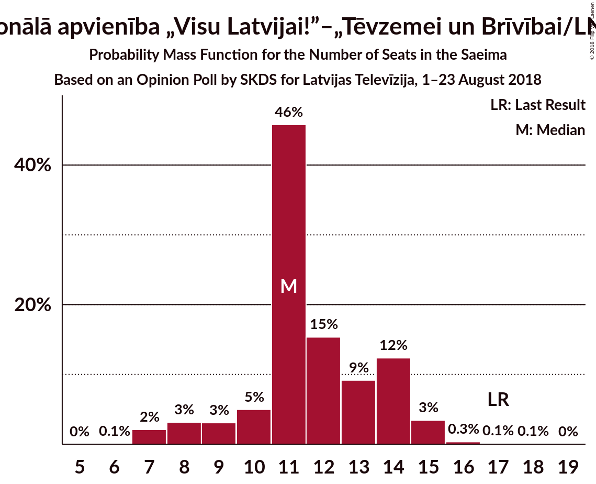
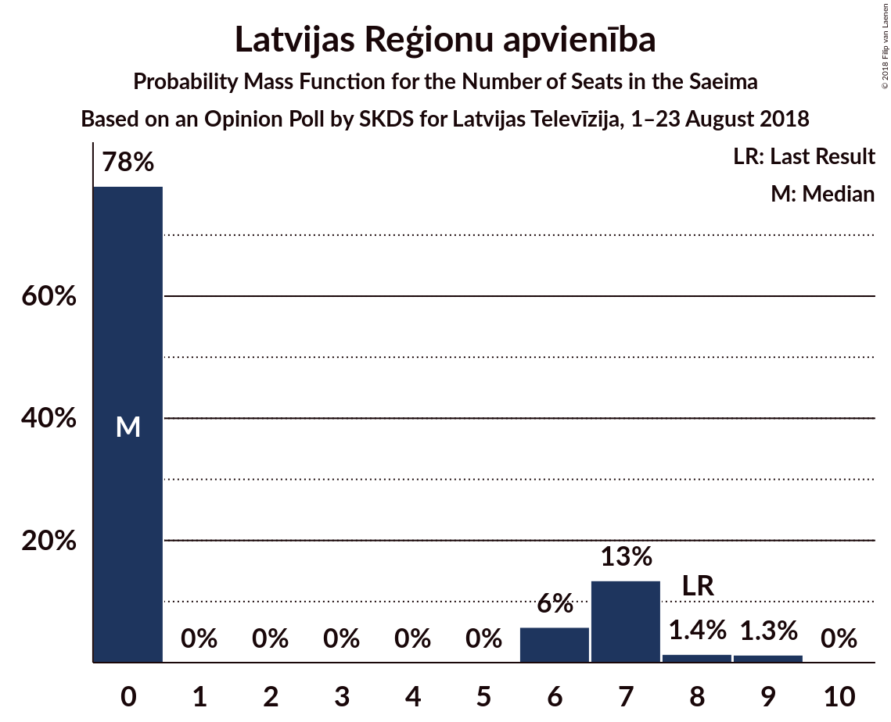

# Opinion Poll by SKDS for Latvijas Televīzija, 1–23 August 2018

<a href="#voting-intentions">Voting Intentions</a> | <a href="#seats">Seats</a> | <a href="#coalitions">Coalitions</a> | <a href="#technical-information">Technical Information</a>

## Voting Intentions

### Confidence Intervals

| Party | Last Result | Poll Result | 80% Confidence Interval | 90% Confidence Interval | 95% Confidence Interval | 99% Confidence Interval |
|:-----:|:-----------:|:-----------:|:-----------------------:|:-----------------------:|:-----------------------:|:-----------------------:|
| Sociāldemokrātiskā Partija “Saskaņa” | 23.0% | 33.2% | 30.7–35.7% |30.1–36.5% |29.5–37.1% |28.3–38.3% |
| Zaļo un Zemnieku savienība | 19.5% | 17.8% | 15.9–19.9% |15.3–20.6% |14.9–21.1% |14.0–22.2% |
| Kam pieder valsts? | 0.0% | 11.6% | 10.1–13.5% |9.6–14.0% |9.3–14.5% |8.6–15.4% |
| Nacionālā apvienība „Visu Latvijai!”–„Tēvzemei un Brīvībai/LNNK” | 16.6% | 9.4% | 8.0–11.1% |7.6–11.6% |7.3–12.0% |6.7–12.9% |
| Vienotība | 21.9% | 7.9% | 6.6–9.5% |6.2–9.9% |5.9–10.3% |5.4–11.2% |
| Kustība Par! | 0.0% | 4.8% | 3.8–6.1% |3.6–6.5% |3.3–6.8% |2.9–7.5% |
| Latvijas Reģionu apvienība | 6.7% | 4.4% | 3.5–5.7% |3.3–6.1% |3.0–6.4% |2.7–7.1% |
| Jaunā konservatīvā partija | 0.7% | 4.4% | 3.5–5.7% |3.3–6.1% |3.0–6.4% |2.7–7.1% |
| No sirds Latvijai | 6.8% | 2.7% | 2.0–3.8% |1.8–4.1% |1.7–4.4% |1.4–5.0% |
| Latvijas Krievu savienība | 1.6% | 1.9% | 1.3–2.8% |1.2–3.1% |1.1–3.3% |0.8–3.9% |

*Note:* The poll result column reflects the actual value used in the calculations. Published results may vary slightly, and in addition be rounded to fewer digits.

## Seats

### Confidence Intervals

| Party | Last Result | Median | 80% Confidence Interval | 90% Confidence Interval | 95% Confidence Interval | 99% Confidence Interval |
|:-----:|:-----------:|:------:|:-----------------------:|:-----------------------:|:-----------------------:|:-----------------------:|
| <a href="#sociāldemokrātiskā-partija-“saskaņa”">Sociāldemokrātiskā Partija “Saskaņa”</a> | 24 | 37 | 34–40 |34–41 |32–42 |31–44 |
| <a href="#zaļo-un-zemnieku-savienība">Zaļo un Zemnieku savienība</a> | 21 | 23 | 19–24 |17–25 |17–26 |16–27 |
| <a href="#kam-pieder-valsts?">Kam pieder valsts?</a> | 0 | 15 | 11–15 |11–16 |10–17 |9–17 |
| <a href="#nacionālā-apvienība-„visu-latvijai!”–„tēvzemei-un-brīvībai/lnnk”">Nacionālā apvienība „Visu Latvijai!”–„Tēvzemei un Brīvībai/LNNK”</a> | 17 | 11 | 9–14 |8–14 |7–15 |7–15 |
| <a href="#vienotība">Vienotība</a> | 23 | 9 | 8–11 |7–11 |7–12 |7–13 |
| <a href="#kustība-par!">Kustība Par!</a> | 0 | 0 | 0–7 |0–7 |0–8 |0–8 |
| <a href="#latvijas-reģionu-apvienība">Latvijas Reģionu apvienība</a> | 8 | 0 | 0–7 |0–7 |0–7 |0–9 |
| <a href="#jaunā-konservatīvā-partija">Jaunā konservatīvā partija</a> | 0 | 0 | 0–7 |0–7 |0–7 |0–8 |
| <a href="#no-sirds-latvijai">No sirds Latvijai</a> | 7 | 0 | 0 |0 |0 |0 |
| <a href="#latvijas-krievu-savienība">Latvijas Krievu savienība</a> | 0 | 0 | 0 |0 |0 |0 |

### Sociāldemokrātiskā Partija “Saskaņa”

*For a full overview of the results for this party, see the [Sociāldemokrātiskā Partija “Saskaņa”](party-sociāldemokrātiskāpartija“saskaņa”.html) page.*

| Number of Seats | Probability | Accumulated | Special Marks |
|:---------------:|:-----------:|:-----------:|:-------------:|
| 24 | 0% | 100% | Last Result |
| 25 | 0% | 100% |  |
| 26 | 0% | 100% |  |
| 27 | 0.1% | 100% |  |
| 28 | 0.1% | 99.9% |  |
| 29 | 0.1% | 99.8% |  |
| 30 | 0.2% | 99.7% |  |
| 31 | 0.6% | 99.5% |  |
| 32 | 2% | 98.9% |  |
| 33 | 2% | 97% |  |
| 34 | 6% | 95% |  |
| 35 | 7% | 89% |  |
| 36 | 8% | 82% |  |
| 37 | 29% | 74% | Median |
| 38 | 24% | 45% |  |
| 39 | 5% | 21% |  |
| 40 | 9% | 16% |  |
| 41 | 4% | 7% |  |
| 42 | 1.4% | 4% |  |
| 43 | 2% | 2% |  |
| 44 | 0.1% | 0.5% |  |
| 45 | 0.1% | 0.4% |  |
| 46 | 0.2% | 0.3% |  |
| 47 | 0.1% | 0.1% |  |
| 48 | 0% | 0% |  |

### Zaļo un Zemnieku savienība

*For a full overview of the results for this party, see the [Zaļo un Zemnieku savienība](party-zaļounzemniekusavienība.html) page.*

| Number of Seats | Probability | Accumulated | Special Marks |
|:---------------:|:-----------:|:-----------:|:-------------:|
| 16 | 0.8% | 100% |  |
| 17 | 4% | 99.2% |  |
| 18 | 2% | 95% |  |
| 19 | 16% | 93% |  |
| 20 | 8% | 77% |  |
| 21 | 9% | 69% | Last Result |
| 22 | 7% | 60% |  |
| 23 | 25% | 53% | Median |
| 24 | 23% | 28% |  |
| 25 | 3% | 6% |  |
| 26 | 2% | 3% |  |
| 27 | 1.0% | 1.3% |  |
| 28 | 0.2% | 0.3% |  |
| 29 | 0% | 0.1% |  |
| 30 | 0% | 0% |  |

### Kam pieder valsts?

*For a full overview of the results for this party, see the [Kam pieder valsts?](party-kampiedervalsts.html) page.*

| Number of Seats | Probability | Accumulated | Special Marks |
|:---------------:|:-----------:|:-----------:|:-------------:|
| 0 | 0% | 100% | Last Result |
| 1 | 0% | 100% |  |
| 2 | 0% | 100% |  |
| 3 | 0% | 100% |  |
| 4 | 0% | 100% |  |
| 5 | 0% | 100% |  |
| 6 | 0% | 100% |  |
| 7 | 0% | 100% |  |
| 8 | 0% | 100% |  |
| 9 | 2% | 100% |  |
| 10 | 2% | 98% |  |
| 11 | 9% | 97% |  |
| 12 | 6% | 88% |  |
| 13 | 24% | 82% |  |
| 14 | 7% | 58% |  |
| 15 | 43% | 51% | Median |
| 16 | 5% | 8% |  |
| 17 | 3% | 4% |  |
| 18 | 0.2% | 0.3% |  |
| 19 | 0% | 0.1% |  |
| 20 | 0% | 0.1% |  |
| 21 | 0% | 0% |  |

### Nacionālā apvienība „Visu Latvijai!”–„Tēvzemei un Brīvībai/LNNK”

*For a full overview of the results for this party, see the [Nacionālā apvienība „Visu Latvijai!”–„Tēvzemei un Brīvībai/LNNK”](party-nacionālāapvienība„visulatvijai”–„tēvzemeiunbrīvībailnnk”.html) page.*

| Number of Seats | Probability | Accumulated | Special Marks |
|:---------------:|:-----------:|:-----------:|:-------------:|
| 6 | 0.2% | 100% |  |
| 7 | 3% | 99.8% |  |
| 8 | 4% | 97% |  |
| 9 | 7% | 93% |  |
| 10 | 15% | 86% |  |
| 11 | 36% | 72% | Median |
| 12 | 12% | 35% |  |
| 13 | 8% | 23% |  |
| 14 | 12% | 15% |  |
| 15 | 3% | 3% |  |
| 16 | 0.3% | 0.3% |  |
| 17 | 0.1% | 0.1% | Last Result |
| 18 | 0% | 0% |  |

### Vienotība

*For a full overview of the results for this party, see the [Vienotība](party-vienotība.html) page.*

| Number of Seats | Probability | Accumulated | Special Marks |
|:---------------:|:-----------:|:-----------:|:-------------:|
| 0 | 0.1% | 100% |  |
| 1 | 0% | 99.9% |  |
| 2 | 0% | 99.9% |  |
| 3 | 0% | 99.9% |  |
| 4 | 0% | 99.9% |  |
| 5 | 0% | 99.9% |  |
| 6 | 0% | 99.9% |  |
| 7 | 8% | 99.8% |  |
| 8 | 40% | 92% |  |
| 9 | 9% | 52% | Median |
| 10 | 18% | 43% |  |
| 11 | 22% | 26% |  |
| 12 | 2% | 3% |  |
| 13 | 0.8% | 1.0% |  |
| 14 | 0.2% | 0.2% |  |
| 15 | 0% | 0% |  |
| 16 | 0% | 0% |  |
| 17 | 0% | 0% |  |
| 18 | 0% | 0% |  |
| 19 | 0% | 0% |  |
| 20 | 0% | 0% |  |
| 21 | 0% | 0% |  |
| 22 | 0% | 0% |  |
| 23 | 0% | 0% | Last Result |

### Kustība Par!

*For a full overview of the results for this party, see the [Kustība Par!](party-kustībapar.html) page.*

| Number of Seats | Probability | Accumulated | Special Marks |
|:---------------:|:-----------:|:-----------:|:-------------:|
| 0 | 52% | 100% | Last Result, Median |
| 1 | 0% | 48% |  |
| 2 | 0% | 48% |  |
| 3 | 0% | 48% |  |
| 4 | 0% | 48% |  |
| 5 | 0% | 48% |  |
| 6 | 0.1% | 48% |  |
| 7 | 46% | 48% |  |
| 8 | 3% | 3% |  |
| 9 | 0.1% | 0.2% |  |
| 10 | 0.1% | 0.1% |  |
| 11 | 0% | 0% |  |

### Latvijas Reģionu apvienība

*For a full overview of the results for this party, see the [Latvijas Reģionu apvienība](party-latvijasreģionuapvienība.html) page.*

| Number of Seats | Probability | Accumulated | Special Marks |
|:---------------:|:-----------:|:-----------:|:-------------:|
| 0 | 78% | 100% | Median |
| 1 | 0% | 22% |  |
| 2 | 0% | 22% |  |
| 3 | 0% | 22% |  |
| 4 | 0% | 22% |  |
| 5 | 0% | 22% |  |
| 6 | 9% | 22% |  |
| 7 | 11% | 13% |  |
| 8 | 1.0% | 2% | Last Result |
| 9 | 0.5% | 0.5% |  |
| 10 | 0% | 0% |  |

### Jaunā konservatīvā partija

*For a full overview of the results for this party, see the [Jaunā konservatīvā partija](party-jaunākonservatīvāpartija.html) page.*

| Number of Seats | Probability | Accumulated | Special Marks |
|:---------------:|:-----------:|:-----------:|:-------------:|
| 0 | 76% | 100% | Last Result, Median |
| 1 | 0% | 24% |  |
| 2 | 0% | 24% |  |
| 3 | 0% | 24% |  |
| 4 | 0% | 24% |  |
| 5 | 0% | 24% |  |
| 6 | 1.0% | 24% |  |
| 7 | 22% | 23% |  |
| 8 | 0.8% | 0.9% |  |
| 9 | 0% | 0% |  |

### No sirds Latvijai

*For a full overview of the results for this party, see the [No sirds Latvijai](party-nosirdslatvijai.html) page.*

| Number of Seats | Probability | Accumulated | Special Marks |
|:---------------:|:-----------:|:-----------:|:-------------:|
| 0 | 99.7% | 100% | Median |
| 1 | 0% | 0.3% |  |
| 2 | 0% | 0.3% |  |
| 3 | 0% | 0.3% |  |
| 4 | 0% | 0.3% |  |
| 5 | 0% | 0.3% |  |
| 6 | 0.2% | 0.3% |  |
| 7 | 0.1% | 0.1% | Last Result |
| 8 | 0% | 0% |  |

### Latvijas Krievu savienība

*For a full overview of the results for this party, see the [Latvijas Krievu savienība](party-latvijaskrievusavienība.html) page.*

| Number of Seats | Probability | Accumulated | Special Marks |
|:---------------:|:-----------:|:-----------:|:-------------:|
| 0 | 100% | 100% | Last Result, Median |

## Coalitions

### Confidence Intervals

| Coalition | Last Result | Median | Majority? | 80% Confidence Interval | 90% Confidence Interval | 95% Confidence Interval | 99% Confidence Interval |
|:---------:|:-----------:|:------:|:---------:|:-----------------------:|:-----------------------:|:-----------------------:|:-----------------------:|
| Zaļo un Zemnieku savienība – Nacionālā apvienība „Visu Latvijai!”–„Tēvzemei un Brīvībai/LNNK” – Vienotība – Kustība Par! – Jaunā konservatīvā partija | 61 | 48 | 12% | 43–51 | 42–53 | 40–53 | 39–56 |
| Zaļo un Zemnieku savienība – Nacionālā apvienība „Visu Latvijai!”–„Tēvzemei un Brīvībai/LNNK” – Vienotība – Jaunā konservatīvā partija | 61 | 43 | 4% | 40–48 | 39–50 | 37–52 | 35–53 |
| Zaļo un Zemnieku savienība – Nacionālā apvienība „Visu Latvijai!”–„Tēvzemei un Brīvībai/LNNK” – Vienotība – Kustība Par! | 61 | 47 | 4% | 41–49 | 39–50 | 38–51 | 36–54 |
| Zaļo un Zemnieku savienība – Nacionālā apvienība „Visu Latvijai!”–„Tēvzemei un Brīvībai/LNNK” – Vienotība | 61 | 42 | 0.2% | 38–48 | 36–48 | 35–49 | 34–50 |
| Zaļo un Zemnieku savienība – Nacionālā apvienība „Visu Latvijai!”–„Tēvzemei un Brīvībai/LNNK” – Kustība Par! – Jaunā konservatīvā partija | 38 | 38 | 0% | 34–42 | 32–44 | 32–45 | 30–47 |
| Zaļo un Zemnieku savienība – Nacionālā apvienība „Visu Latvijai!”–„Tēvzemei un Brīvībai/LNNK” – Jaunā konservatīvā partija | 38 | 34 | 0% | 29–39 | 29–41 | 29–42 | 27–44 |
| Zaļo un Zemnieku savienība – Nacionālā apvienība „Visu Latvijai!”–„Tēvzemei un Brīvībai/LNNK” – Kustība Par! | 38 | 37 | 0% | 32–41 | 31–41 | 29–42 | 26–44 |
| Nacionālā apvienība „Visu Latvijai!”–„Tēvzemei un Brīvībai/LNNK” – Vienotība – Kustība Par! – Jaunā konservatīvā partija | 40 | 25 | 0% | 20–30 | 19–32 | 19–33 | 16–35 |

### Zaļo un Zemnieku savienība – Nacionālā apvienība „Visu Latvijai!”–„Tēvzemei un Brīvībai/LNNK” – Vienotība – Kustība Par! – Jaunā konservatīvā partija

| Number of Seats | Probability | Accumulated | Special Marks |
|:---------------:|:-----------:|:-----------:|:-------------:|
| 37 | 0.1% | 100% |  |
| 38 | 0.3% | 99.9% |  |
| 39 | 0.9% | 99.7% |  |
| 40 | 2% | 98.8% |  |
| 41 | 1.1% | 97% |  |
| 42 | 4% | 96% |  |
| 43 | 3% | 92% | Median |
| 44 | 7% | 88% |  |
| 45 | 5% | 82% |  |
| 46 | 5% | 77% |  |
| 47 | 21% | 72% |  |
| 48 | 22% | 51% |  |
| 49 | 12% | 29% |  |
| 50 | 5% | 17% |  |
| 51 | 4% | 12% | Majority |
| 52 | 2% | 9% |  |
| 53 | 4% | 7% |  |
| 54 | 1.3% | 2% |  |
| 55 | 0.7% | 1.2% |  |
| 56 | 0.3% | 0.6% |  |
| 57 | 0.1% | 0.2% |  |
| 58 | 0.1% | 0.1% |  |
| 59 | 0% | 0% |  |
| 60 | 0% | 0% |  |
| 61 | 0% | 0% | Last Result |

### Zaļo un Zemnieku savienība – Nacionālā apvienība „Visu Latvijai!”–„Tēvzemei un Brīvībai/LNNK” – Vienotība – Jaunā konservatīvā partija

| Number of Seats | Probability | Accumulated | Special Marks |
|:---------------:|:-----------:|:-----------:|:-------------:|
| 34 | 0% | 100% |  |
| 35 | 0.5% | 99.9% |  |
| 36 | 0.8% | 99.4% |  |
| 37 | 1.2% | 98.6% |  |
| 38 | 2% | 97% |  |
| 39 | 2% | 96% |  |
| 40 | 15% | 93% |  |
| 41 | 11% | 78% |  |
| 42 | 12% | 68% |  |
| 43 | 6% | 56% | Median |
| 44 | 8% | 50% |  |
| 45 | 5% | 41% |  |
| 46 | 6% | 37% |  |
| 47 | 9% | 31% |  |
| 48 | 13% | 22% |  |
| 49 | 3% | 9% |  |
| 50 | 1.5% | 5% |  |
| 51 | 0.8% | 4% | Majority |
| 52 | 0.5% | 3% |  |
| 53 | 2% | 2% |  |
| 54 | 0.2% | 0.3% |  |
| 55 | 0.1% | 0.1% |  |
| 56 | 0% | 0% |  |
| 57 | 0% | 0% |  |
| 58 | 0% | 0% |  |
| 59 | 0% | 0% |  |
| 60 | 0% | 0% |  |
| 61 | 0% | 0% | Last Result |

### Zaļo un Zemnieku savienība – Nacionālā apvienība „Visu Latvijai!”–„Tēvzemei un Brīvībai/LNNK” – Vienotība – Kustība Par!

| Number of Seats | Probability | Accumulated | Special Marks |
|:---------------:|:-----------:|:-----------:|:-------------:|
| 35 | 0.1% | 100% |  |
| 36 | 0.7% | 99.8% |  |
| 37 | 0.6% | 99.2% |  |
| 38 | 1.2% | 98.6% |  |
| 39 | 3% | 97% |  |
| 40 | 3% | 95% |  |
| 41 | 6% | 92% |  |
| 42 | 7% | 86% |  |
| 43 | 6% | 79% | Median |
| 44 | 8% | 74% |  |
| 45 | 5% | 66% |  |
| 46 | 7% | 61% |  |
| 47 | 21% | 54% |  |
| 48 | 18% | 34% |  |
| 49 | 10% | 16% |  |
| 50 | 2% | 6% |  |
| 51 | 2% | 4% | Majority |
| 52 | 1.0% | 2% |  |
| 53 | 0.7% | 1.2% |  |
| 54 | 0.2% | 0.5% |  |
| 55 | 0.2% | 0.3% |  |
| 56 | 0.1% | 0.1% |  |
| 57 | 0% | 0% |  |
| 58 | 0% | 0% |  |
| 59 | 0% | 0% |  |
| 60 | 0% | 0% |  |
| 61 | 0% | 0% | Last Result |

### Zaļo un Zemnieku savienība – Nacionālā apvienība „Visu Latvijai!”–„Tēvzemei un Brīvībai/LNNK” – Vienotība

| Number of Seats | Probability | Accumulated | Special Marks |
|:---------------:|:-----------:|:-----------:|:-------------:|
| 31 | 0.1% | 100% |  |
| 32 | 0% | 99.9% |  |
| 33 | 0.1% | 99.9% |  |
| 34 | 0.4% | 99.9% |  |
| 35 | 2% | 99.4% |  |
| 36 | 4% | 97% |  |
| 37 | 3% | 94% |  |
| 38 | 3% | 91% |  |
| 39 | 6% | 88% |  |
| 40 | 16% | 82% |  |
| 41 | 16% | 66% |  |
| 42 | 12% | 50% |  |
| 43 | 4% | 38% | Median |
| 44 | 7% | 34% |  |
| 45 | 4% | 27% |  |
| 46 | 5% | 23% |  |
| 47 | 8% | 19% |  |
| 48 | 8% | 11% |  |
| 49 | 2% | 3% |  |
| 50 | 0.7% | 0.9% |  |
| 51 | 0.2% | 0.2% | Majority |
| 52 | 0% | 0% |  |
| 53 | 0% | 0% |  |
| 54 | 0% | 0% |  |
| 55 | 0% | 0% |  |
| 56 | 0% | 0% |  |
| 57 | 0% | 0% |  |
| 58 | 0% | 0% |  |
| 59 | 0% | 0% |  |
| 60 | 0% | 0% |  |
| 61 | 0% | 0% | Last Result |

### Zaļo un Zemnieku savienība – Nacionālā apvienība „Visu Latvijai!”–„Tēvzemei un Brīvībai/LNNK” – Kustība Par! – Jaunā konservatīvā partija

| Number of Seats | Probability | Accumulated | Special Marks |
|:---------------:|:-----------:|:-----------:|:-------------:|
| 27 | 0% | 100% |  |
| 28 | 0.1% | 99.9% |  |
| 29 | 0.1% | 99.9% |  |
| 30 | 1.0% | 99.7% |  |
| 31 | 1.1% | 98.7% |  |
| 32 | 3% | 98% |  |
| 33 | 2% | 95% |  |
| 34 | 6% | 93% | Median |
| 35 | 5% | 87% |  |
| 36 | 14% | 83% |  |
| 37 | 17% | 69% |  |
| 38 | 8% | 51% | Last Result |
| 39 | 6% | 43% |  |
| 40 | 10% | 37% |  |
| 41 | 13% | 27% |  |
| 42 | 5% | 14% |  |
| 43 | 2% | 9% |  |
| 44 | 4% | 7% |  |
| 45 | 0.8% | 3% |  |
| 46 | 1.1% | 2% |  |
| 47 | 0.5% | 0.7% |  |
| 48 | 0.1% | 0.3% |  |
| 49 | 0.1% | 0.2% |  |
| 50 | 0.1% | 0.1% |  |
| 51 | 0% | 0% | Majority |

### Zaļo un Zemnieku savienība – Nacionālā apvienība „Visu Latvijai!”–„Tēvzemei un Brīvībai/LNNK” – Jaunā konservatīvā partija

| Number of Seats | Probability | Accumulated | Special Marks |
|:---------------:|:-----------:|:-----------:|:-------------:|
| 26 | 0.2% | 100% |  |
| 27 | 0.8% | 99.8% |  |
| 28 | 1.1% | 99.0% |  |
| 29 | 9% | 98% |  |
| 30 | 4% | 89% |  |
| 31 | 3% | 85% |  |
| 32 | 7% | 81% |  |
| 33 | 10% | 74% |  |
| 34 | 15% | 64% | Median |
| 35 | 7% | 50% |  |
| 36 | 7% | 42% |  |
| 37 | 16% | 35% |  |
| 38 | 7% | 19% | Last Result |
| 39 | 2% | 12% |  |
| 40 | 2% | 9% |  |
| 41 | 4% | 7% |  |
| 42 | 1.1% | 4% |  |
| 43 | 0.4% | 2% |  |
| 44 | 2% | 2% |  |
| 45 | 0.1% | 0.1% |  |
| 46 | 0% | 0.1% |  |
| 47 | 0% | 0% |  |

### Zaļo un Zemnieku savienība – Nacionālā apvienība „Visu Latvijai!”–„Tēvzemei un Brīvībai/LNNK” – Kustība Par!

| Number of Seats | Probability | Accumulated | Special Marks |
|:---------------:|:-----------:|:-----------:|:-------------:|
| 25 | 0.1% | 100% |  |
| 26 | 0.4% | 99.9% |  |
| 27 | 0.3% | 99.4% |  |
| 28 | 1.0% | 99.2% |  |
| 29 | 0.9% | 98% |  |
| 30 | 2% | 97% |  |
| 31 | 4% | 95% |  |
| 32 | 4% | 91% |  |
| 33 | 3% | 88% |  |
| 34 | 10% | 85% | Median |
| 35 | 7% | 75% |  |
| 36 | 15% | 68% |  |
| 37 | 20% | 53% |  |
| 38 | 6% | 34% | Last Result |
| 39 | 7% | 28% |  |
| 40 | 8% | 21% |  |
| 41 | 9% | 12% |  |
| 42 | 2% | 4% |  |
| 43 | 0.9% | 2% |  |
| 44 | 0.4% | 0.9% |  |
| 45 | 0.4% | 0.5% |  |
| 46 | 0.1% | 0.1% |  |
| 47 | 0% | 0% |  |

### Nacionālā apvienība „Visu Latvijai!”–„Tēvzemei un Brīvībai/LNNK” – Vienotība – Kustība Par! – Jaunā konservatīvā partija

| Number of Seats | Probability | Accumulated | Special Marks |
|:---------------:|:-----------:|:-----------:|:-------------:|
| 13 | 0% | 100% |  |
| 14 | 0% | 99.9% |  |
| 15 | 0% | 99.9% |  |
| 16 | 0.6% | 99.9% |  |
| 17 | 0.2% | 99.3% |  |
| 18 | 0.6% | 99.1% |  |
| 19 | 6% | 98.5% |  |
| 20 | 4% | 93% | Median |
| 21 | 4% | 88% |  |
| 22 | 3% | 85% |  |
| 23 | 3% | 82% |  |
| 24 | 20% | 78% |  |
| 25 | 9% | 58% |  |
| 26 | 16% | 49% |  |
| 27 | 4% | 33% |  |
| 28 | 13% | 29% |  |
| 29 | 3% | 17% |  |
| 30 | 4% | 14% |  |
| 31 | 2% | 9% |  |
| 32 | 3% | 7% |  |
| 33 | 3% | 5% |  |
| 34 | 1.1% | 2% |  |
| 35 | 0.6% | 0.9% |  |
| 36 | 0.1% | 0.3% |  |
| 37 | 0.1% | 0.2% |  |
| 38 | 0.1% | 0.1% |  |
| 39 | 0% | 0% |  |
| 40 | 0% | 0% | Last Result |

## Technical Information

### Opinion Poll

+ **Polling firm:** SKDS
+ **Commissioner(s):** Latvijas Televīzija
+ **Fieldwork period:** 1–23 August 2018

### Calculations

+ **Sample size:** 585
+ **Simulations done:** 1,048,576
+ **Error estimate:** 3.81%

