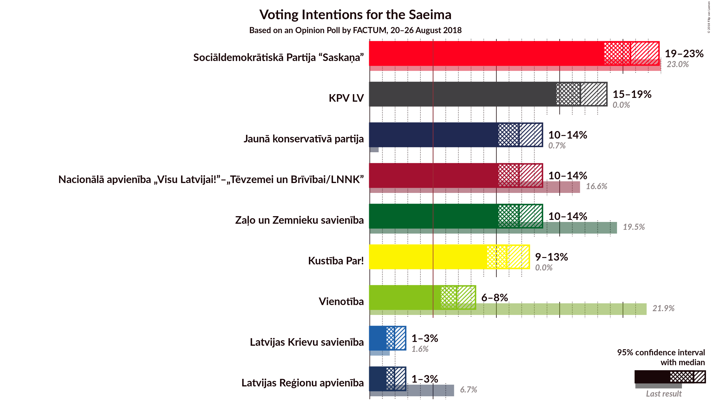
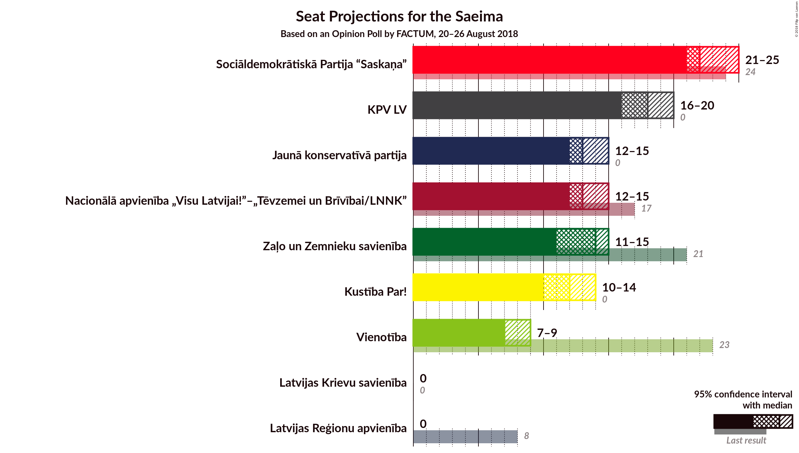

# Opinion Poll by FACTUM, 20–26 August 2018

<a href="#voting-intentions">Voting Intentions</a> | <a href="#seats">Seats</a> | <a href="#coalitions">Coalitions</a> | <a href="#technical-information">Technical Information</a>

## Voting Intentions

### Confidence Intervals

| Party | Last Result | Poll Result | 80% Confidence Interval | 90% Confidence Interval | 95% Confidence Interval | 99% Confidence Interval |
|:-----:|:-----------:|:-----------:|:-----------------------:|:-----------------------:|:-----------------------:|:-----------------------:|
| Sociāldemokrātiskā Partija “Saskaņa” | 23.0% | 20.6% | 19.2–22.1% |18.8–22.5% |18.5–22.8% |17.9–23.6% |
| KPV LV | 0.0% | 16.6% | 15.4–18.0% |15.0–18.4% |14.7–18.7% |14.2–19.4% |
| Zaļo un Zemnieku savienība | 19.5% | 11.8% | 10.7–13.0% |10.4–13.3% |10.2–13.6% |9.7–14.2% |
| Nacionālā apvienība „Visu Latvijai!”–„Tēvzemei un Brīvībai/LNNK” | 16.6% | 11.8% | 10.7–13.0% |10.4–13.3% |10.2–13.6% |9.7–14.2% |
| Jaunā konservatīvā partija | 0.7% | 11.8% | 10.7–13.0% |10.4–13.3% |10.2–13.6% |9.7–14.2% |
| Attīstībai–Par! | 0.9% | 10.8% | 9.8–12.0% |9.5–12.3% |9.3–12.6% |8.8–13.2% |
| Vienotība | 21.9% | 6.9% | 6.1–7.8% |5.8–8.1% |5.6–8.4% |5.3–8.8% |
| Latvijas Reģionu apvienība | 6.7% | 1.9% | 1.5–2.5% |1.4–2.7% |1.3–2.8% |1.2–3.1% |
| Latvijas Krievu savienība | 1.6% | 1.9% | 1.5–2.5% |1.4–2.7% |1.3–2.8% |1.2–3.1% |

*Note:* The poll result column reflects the actual value used in the calculations. Published results may vary slightly, and in addition be rounded to fewer digits.

## Seats

### Confidence Intervals

| Party | Last Result | Median | 80% Confidence Interval | 90% Confidence Interval | 95% Confidence Interval | 99% Confidence Interval |
|:-----:|:-----------:|:------:|:-----------------------:|:-----------------------:|:-----------------------:|:-----------------------:|
| <a href="#sociāldemokrātiskā-partija-“saskaņa”">Sociāldemokrātiskā Partija “Saskaņa”</a> | 24 | 23 | 21–25 |20–26 |20–26 |19–26 |
| <a href="#kpv-lv">KPV LV</a> | 0 | 17 | 16–20 |16–20 |15–20 |15–21 |
| <a href="#zaļo-un-zemnieku-savienība">Zaļo un Zemnieku savienība</a> | 21 | 14 | 12–15 |12–15 |11–15 |11–16 |
| <a href="#nacionālā-apvienība-„visu-latvijai!”–„tēvzemei-un-brīvībai/lnnk”">Nacionālā apvienība „Visu Latvijai!”–„Tēvzemei un Brīvībai/LNNK”</a> | 17 | 13 | 12–14 |12–15 |12–15 |10–16 |
| <a href="#jaunā-konservatīvā-partija">Jaunā konservatīvā partija</a> | 0 | 13 | 11–15 |11–15 |11–15 |11–15 |
| <a href="#attīstībai–par!">Attīstībai–Par!</a> | 0 | N/A | N/A |N/A |N/A |N/A |
| <a href="#vienotība">Vienotība</a> | 23 | 7 | 7–9 |7–9 |7–9 |7–10 |
| <a href="#latvijas-reģionu-apvienība">Latvijas Reģionu apvienība</a> | 8 | 0 | 0 |0 |0 |0 |
| <a href="#latvijas-krievu-savienība">Latvijas Krievu savienība</a> | 0 | 0 | 0 |0 |0 |0 |

