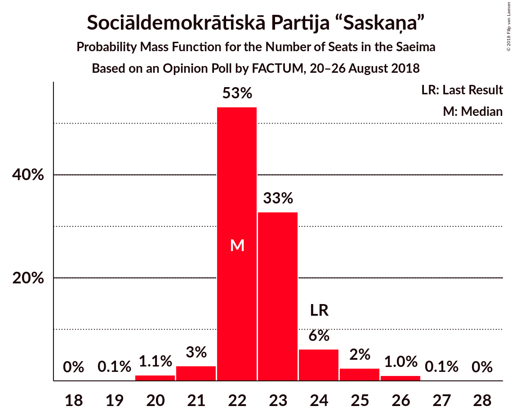
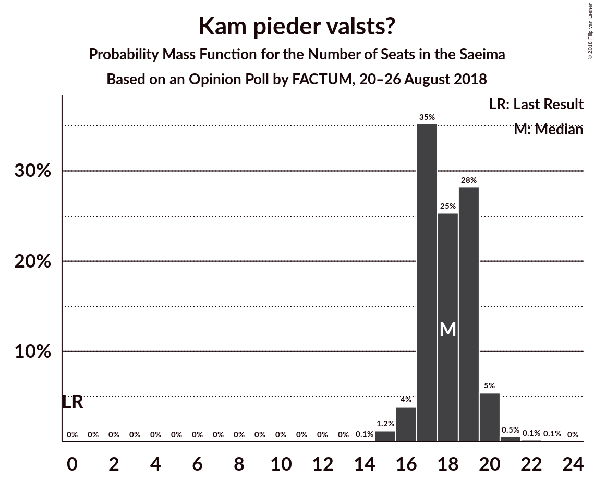
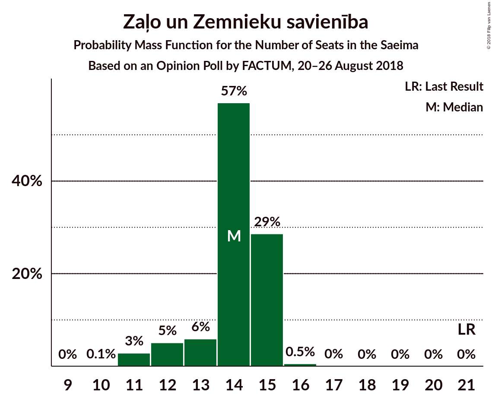
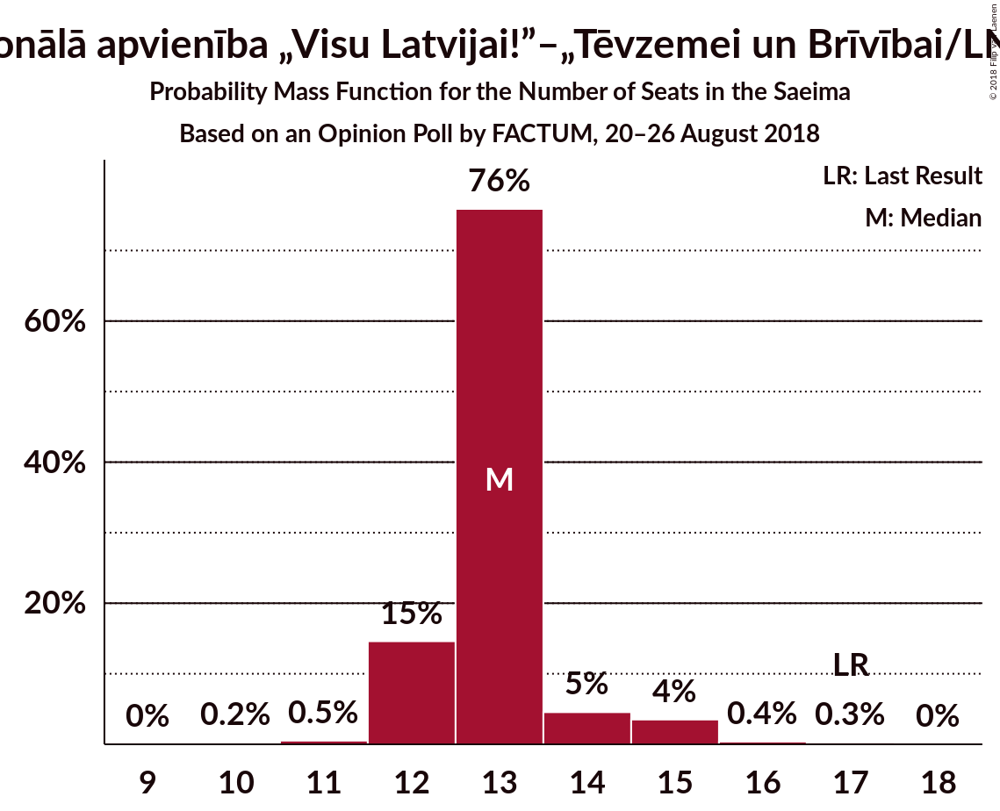
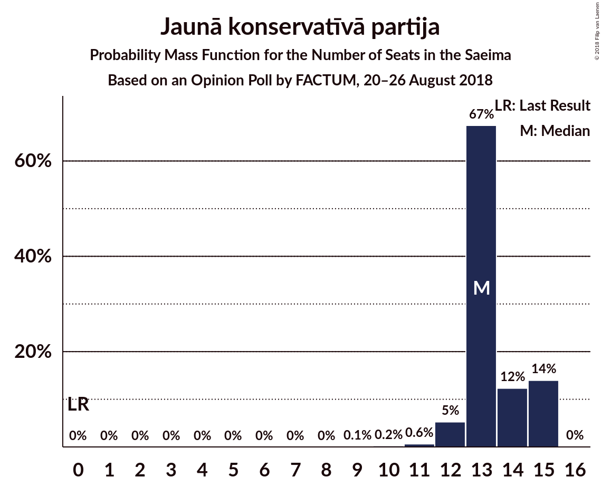

# Opinion Poll by FACTUM, 20–26 August 2018

<a href="#voting-intentions">Voting Intentions</a> | <a href="#seats">Seats</a> | <a href="#coalitions">Coalitions</a> | <a href="#technical-information">Technical Information</a>

## Voting Intentions

### Confidence Intervals

| Party | Last Result | Poll Result | 80% Confidence Interval | 90% Confidence Interval | 95% Confidence Interval | 99% Confidence Interval |
|:-----:|:-----------:|:-----------:|:-----------------------:|:-----------------------:|:-----------------------:|:-----------------------:|
| Sociāldemokrātiskā Partija “Saskaņa” | 23.0% | 20.6% | 19.2–22.1% |18.8–22.5% |18.5–22.8% |17.9–23.6% |
| Kam pieder valsts? | 0.0% | 16.6% | 15.4–18.0% |15.0–18.4% |14.7–18.7% |14.2–19.4% |
| Zaļo un Zemnieku savienība | 19.5% | 11.8% | 10.7–13.0% |10.4–13.3% |10.2–13.6% |9.7–14.2% |
| Nacionālā apvienība „Visu Latvijai!”–„Tēvzemei un Brīvībai/LNNK” | 16.6% | 11.8% | 10.7–13.0% |10.4–13.3% |10.2–13.6% |9.7–14.2% |
| Jaunā konservatīvā partija | 0.7% | 11.8% | 10.7–13.0% |10.4–13.3% |10.2–13.6% |9.7–14.2% |
| Kustība Par! | 0.0% | 10.8% | 9.8–12.0% |9.5–12.3% |9.3–12.6% |8.8–13.2% |
| Vienotība | 21.9% | 6.9% | 6.1–7.8% |5.8–8.1% |5.6–8.4% |5.3–8.8% |
| Latvijas Reģionu apvienība | 6.7% | 1.9% | 1.5–2.5% |1.4–2.7% |1.3–2.8% |1.2–3.1% |
| Latvijas Krievu savienība | 1.6% | 1.9% | 1.5–2.5% |1.4–2.7% |1.3–2.8% |1.2–3.1% |

*Note:* The poll result column reflects the actual value used in the calculations. Published results may vary slightly, and in addition be rounded to fewer digits.

## Seats

### Confidence Intervals

| Party | Last Result | Median | 80% Confidence Interval | 90% Confidence Interval | 95% Confidence Interval | 99% Confidence Interval |
|:-----:|:-----------:|:------:|:-----------------------:|:-----------------------:|:-----------------------:|:-----------------------:|
| <a href="#sociāldemokrātiskā-partija-“saskaņa”">Sociāldemokrātiskā Partija “Saskaņa”</a> | 24 | 22 | 22–23 |22–24 |21–25 |20–26 |
| <a href="#kam-pieder-valsts?">Kam pieder valsts?</a> | 0 | 18 | 17–19 |16–20 |16–20 |15–21 |
| <a href="#zaļo-un-zemnieku-savienība">Zaļo un Zemnieku savienība</a> | 21 | 14 | 13–15 |12–15 |11–15 |11–16 |
| <a href="#nacionālā-apvienība-„visu-latvijai!”–„tēvzemei-un-brīvībai/lnnk”">Nacionālā apvienība „Visu Latvijai!”–„Tēvzemei un Brīvībai/LNNK”</a> | 17 | 13 | 12–13 |12–14 |12–15 |11–16 |
| <a href="#jaunā-konservatīvā-partija">Jaunā konservatīvā partija</a> | 0 | 13 | 13–15 |12–15 |12–15 |11–15 |
| <a href="#kustība-par!">Kustība Par!</a> | 0 | 12 | 10–13 |10–13 |10–14 |10–15 |
| <a href="#vienotība">Vienotība</a> | 23 | 7 | 7–8 |7–9 |7–9 |7–9 |
| <a href="#latvijas-reģionu-apvienība">Latvijas Reģionu apvienība</a> | 8 | 0 | 0 |0 |0 |0 |
| <a href="#latvijas-krievu-savienība">Latvijas Krievu savienība</a> | 0 | 0 | 0 |0 |0 |0 |

### Sociāldemokrātiskā Partija “Saskaņa”

*For a full overview of the results for this party, see the [Sociāldemokrātiskā Partija “Saskaņa”](party-sociāldemokrātiskāpartija“saskaņa”.html) page.*

| Number of Seats | Probability | Accumulated | Special Marks |
|:---------------:|:-----------:|:-----------:|:-------------:|
| 19 | 0.1% | 100% |  |
| 20 | 1.1% | 99.8% |  |
| 21 | 3% | 98.7% |  |
| 22 | 53% | 96% | Median |
| 23 | 33% | 43% |  |
| 24 | 6% | 10% | Last Result |
| 25 | 2% | 4% |  |
| 26 | 1.0% | 1.2% |  |
| 27 | 0.1% | 0.1% |  |
| 28 | 0% | 0% |  |

### Kam pieder valsts?

*For a full overview of the results for this party, see the [Kam pieder valsts?](party-kampiedervalsts.html) page.*

| Number of Seats | Probability | Accumulated | Special Marks |
|:---------------:|:-----------:|:-----------:|:-------------:|
| 0 | 0% | 100% | Last Result |
| 1 | 0% | 100% |  |
| 2 | 0% | 100% |  |
| 3 | 0% | 100% |  |
| 4 | 0% | 100% |  |
| 5 | 0% | 100% |  |
| 6 | 0% | 100% |  |
| 7 | 0% | 100% |  |
| 8 | 0% | 100% |  |
| 9 | 0% | 100% |  |
| 10 | 0% | 100% |  |
| 11 | 0% | 100% |  |
| 12 | 0% | 100% |  |
| 13 | 0% | 100% |  |
| 14 | 0.1% | 100% |  |
| 15 | 1.2% | 99.9% |  |
| 16 | 4% | 98.8% |  |
| 17 | 35% | 95% |  |
| 18 | 25% | 60% | Median |
| 19 | 28% | 34% |  |
| 20 | 5% | 6% |  |
| 21 | 0.5% | 0.7% |  |
| 22 | 0.1% | 0.2% |  |
| 23 | 0.1% | 0.1% |  |
| 24 | 0% | 0% |  |

### Zaļo un Zemnieku savienība

*For a full overview of the results for this party, see the [Zaļo un Zemnieku savienība](party-zaļounzemniekusavienība.html) page.*

| Number of Seats | Probability | Accumulated | Special Marks |
|:---------------:|:-----------:|:-----------:|:-------------:|
| 10 | 0.1% | 100% |  |
| 11 | 3% | 99.9% |  |
| 12 | 5% | 97% |  |
| 13 | 6% | 92% |  |
| 14 | 57% | 86% | Median |
| 15 | 29% | 29% |  |
| 16 | 0.5% | 0.6% |  |
| 17 | 0% | 0.1% |  |
| 18 | 0% | 0% |  |
| 19 | 0% | 0% |  |
| 20 | 0% | 0% |  |
| 21 | 0% | 0% | Last Result |

### Nacionālā apvienība „Visu Latvijai!”–„Tēvzemei un Brīvībai/LNNK”

*For a full overview of the results for this party, see the [Nacionālā apvienība „Visu Latvijai!”–„Tēvzemei un Brīvībai/LNNK”](party-nacionālāapvienība„visulatvijai”–„tēvzemeiunbrīvībailnnk”.html) page.*

| Number of Seats | Probability | Accumulated | Special Marks |
|:---------------:|:-----------:|:-----------:|:-------------:|
| 10 | 0.2% | 100% |  |
| 11 | 0.5% | 99.8% |  |
| 12 | 15% | 99.2% |  |
| 13 | 76% | 85% | Median |
| 14 | 5% | 9% |  |
| 15 | 4% | 4% |  |
| 16 | 0.4% | 0.6% |  |
| 17 | 0.3% | 0.3% | Last Result |
| 18 | 0% | 0% |  |

### Jaunā konservatīvā partija

*For a full overview of the results for this party, see the [Jaunā konservatīvā partija](party-jaunākonservatīvāpartija.html) page.*

| Number of Seats | Probability | Accumulated | Special Marks |
|:---------------:|:-----------:|:-----------:|:-------------:|
| 0 | 0% | 100% | Last Result |
| 1 | 0% | 100% |  |
| 2 | 0% | 100% |  |
| 3 | 0% | 100% |  |
| 4 | 0% | 100% |  |
| 5 | 0% | 100% |  |
| 6 | 0% | 100% |  |
| 7 | 0% | 100% |  |
| 8 | 0% | 100% |  |
| 9 | 0.1% | 100% |  |
| 10 | 0.2% | 99.9% |  |
| 11 | 0.6% | 99.7% |  |
| 12 | 5% | 99.0% |  |
| 13 | 67% | 94% | Median |
| 14 | 12% | 26% |  |
| 15 | 14% | 14% |  |
| 16 | 0% | 0% |  |

### Kustība Par!

*For a full overview of the results for this party, see the [Kustība Par!](party-kustībapar.html) page.*

| Number of Seats | Probability | Accumulated | Special Marks |
|:---------------:|:-----------:|:-----------:|:-------------:|
| 0 | 0% | 100% | Last Result |
| 1 | 0% | 100% |  |
| 2 | 0% | 100% |  |
| 3 | 0% | 100% |  |
| 4 | 0% | 100% |  |
| 5 | 0% | 100% |  |
| 6 | 0% | 100% |  |
| 7 | 0% | 100% |  |
| 8 | 0% | 100% |  |
| 9 | 0.1% | 100% |  |
| 10 | 17% | 99.9% |  |
| 11 | 15% | 83% |  |
| 12 | 40% | 68% | Median |
| 13 | 25% | 27% |  |
| 14 | 2% | 3% |  |
| 15 | 0.7% | 0.7% |  |
| 16 | 0% | 0% |  |

### Vienotība

*For a full overview of the results for this party, see the [Vienotība](party-vienotība.html) page.*

| Number of Seats | Probability | Accumulated | Special Marks |
|:---------------:|:-----------:|:-----------:|:-------------:|
| 0 | 0.1% | 100% |  |
| 1 | 0% | 99.9% |  |
| 2 | 0% | 99.9% |  |
| 3 | 0% | 99.9% |  |
| 4 | 0% | 99.9% |  |
| 5 | 0% | 99.9% |  |
| 6 | 0% | 99.9% |  |
| 7 | 69% | 99.9% | Median |
| 8 | 24% | 31% |  |
| 9 | 6% | 6% |  |
| 10 | 0.5% | 0.5% |  |
| 11 | 0% | 0% |  |
| 12 | 0% | 0% |  |
| 13 | 0% | 0% |  |
| 14 | 0% | 0% |  |
| 15 | 0% | 0% |  |
| 16 | 0% | 0% |  |
| 17 | 0% | 0% |  |
| 18 | 0% | 0% |  |
| 19 | 0% | 0% |  |
| 20 | 0% | 0% |  |
| 21 | 0% | 0% |  |
| 22 | 0% | 0% |  |
| 23 | 0% | 0% | Last Result |

### Latvijas Reģionu apvienība

*For a full overview of the results for this party, see the [Latvijas Reģionu apvienība](party-latvijasreģionuapvienība.html) page.*

| Number of Seats | Probability | Accumulated | Special Marks |
|:---------------:|:-----------:|:-----------:|:-------------:|
| 0 | 100% | 100% | Median |
| 1 | 0% | 0% |  |
| 2 | 0% | 0% |  |
| 3 | 0% | 0% |  |
| 4 | 0% | 0% |  |
| 5 | 0% | 0% |  |
| 6 | 0% | 0% |  |
| 7 | 0% | 0% |  |
| 8 | 0% | 0% | Last Result |

### Latvijas Krievu savienība

*For a full overview of the results for this party, see the [Latvijas Krievu savienība](party-latvijaskrievusavienība.html) page.*

| Number of Seats | Probability | Accumulated | Special Marks |
|:---------------:|:-----------:|:-----------:|:-------------:|
| 0 | 100% | 100% | Last Result, Median |

## Coalitions

### Confidence Intervals

| Coalition | Last Result | Median | Majority? | 80% Confidence Interval | 90% Confidence Interval | 95% Confidence Interval | 99% Confidence Interval |
|:---------:|:-----------:|:------:|:---------:|:-----------------------:|:-----------------------:|:-----------------------:|:-----------------------:|
| Jaunā konservatīvā partija – Nacionālā apvienība „Visu Latvijai!”–„Tēvzemei un Brīvībai/LNNK” – Zaļo un Zemnieku savienība – Kustība Par! – Vienotība | 61 | 59 | 100% | 58–61 | 58–61 | 57–62 | 56–63 |
| Jaunā konservatīvā partija – Nacionālā apvienība „Visu Latvijai!”–„Tēvzemei un Brīvībai/LNNK” – Zaļo un Zemnieku savienība – Kustība Par! | 38 | 52 | 93% | 51–54 | 50–54 | 50–54 | 49–55 |
| Jaunā konservatīvā partija – Nacionālā apvienība „Visu Latvijai!”–„Tēvzemei un Brīvībai/LNNK” – Zaļo un Zemnieku savienība – Vienotība | 61 | 47 | 2% | 46–49 | 46–50 | 45–50 | 44–51 |
| Nacionālā apvienība „Visu Latvijai!”–„Tēvzemei un Brīvībai/LNNK” – Zaļo un Zemnieku savienība – Kustība Par! – Vienotība | 61 | 46 | 0% | 45–48 | 44–48 | 43–49 | 42–49 |
| Jaunā konservatīvā partija – Nacionālā apvienība „Visu Latvijai!”–„Tēvzemei un Brīvībai/LNNK” – Zaļo un Zemnieku savienība | 38 | 40 | 0% | 39–42 | 39–42 | 38–43 | 37–44 |
| Nacionālā apvienība „Visu Latvijai!”–„Tēvzemei un Brīvībai/LNNK” – Zaļo un Zemnieku savienība – Kustība Par! | 38 | 39 | 0% | 37–40 | 37–40 | 36–41 | 35–42 |
| Nacionālā apvienība „Visu Latvijai!”–„Tēvzemei un Brīvībai/LNNK” – Zaļo un Zemnieku savienība – Vienotība | 61 | 34 | 0% | 33–36 | 33–36 | 31–36 | 31–37 |

### Jaunā konservatīvā partija – Nacionālā apvienība „Visu Latvijai!”–„Tēvzemei un Brīvībai/LNNK” – Zaļo un Zemnieku savienība – Kustība Par! – Vienotība

| Number of Seats | Probability | Accumulated | Special Marks |
|:---------------:|:-----------:|:-----------:|:-------------:|
| 54 | 0.1% | 100% |  |
| 55 | 0.1% | 99.9% |  |
| 56 | 1.2% | 99.8% |  |
| 57 | 2% | 98.6% |  |
| 58 | 9% | 97% |  |
| 59 | 41% | 87% | Median |
| 60 | 25% | 46% |  |
| 61 | 18% | 21% | Last Result |
| 62 | 3% | 3% |  |
| 63 | 0.5% | 0.5% |  |
| 64 | 0.1% | 0.1% |  |
| 65 | 0% | 0% |  |

### Jaunā konservatīvā partija – Nacionālā apvienība „Visu Latvijai!”–„Tēvzemei un Brīvībai/LNNK” – Zaļo un Zemnieku savienība – Kustība Par!

| Number of Seats | Probability | Accumulated | Special Marks |
|:---------------:|:-----------:|:-----------:|:-------------:|
| 38 | 0% | 100% | Last Result |
| 39 | 0% | 100% |  |
| 40 | 0% | 100% |  |
| 41 | 0% | 100% |  |
| 42 | 0% | 100% |  |
| 43 | 0% | 100% |  |
| 44 | 0% | 100% |  |
| 45 | 0% | 100% |  |
| 46 | 0% | 100% |  |
| 47 | 0.1% | 100% |  |
| 48 | 0.3% | 99.9% |  |
| 49 | 1.5% | 99.7% |  |
| 50 | 6% | 98% |  |
| 51 | 14% | 93% | Majority |
| 52 | 45% | 78% | Median |
| 53 | 22% | 34% |  |
| 54 | 10% | 12% |  |
| 55 | 2% | 2% |  |
| 56 | 0.3% | 0.3% |  |
| 57 | 0.1% | 0.1% |  |
| 58 | 0% | 0% |  |

### Jaunā konservatīvā partija – Nacionālā apvienība „Visu Latvijai!”–„Tēvzemei un Brīvībai/LNNK” – Zaļo un Zemnieku savienība – Vienotība

| Number of Seats | Probability | Accumulated | Special Marks |
|:---------------:|:-----------:|:-----------:|:-------------:|
| 42 | 0% | 100% |  |
| 43 | 0.1% | 99.9% |  |
| 44 | 0.5% | 99.8% |  |
| 45 | 2% | 99.3% |  |
| 46 | 8% | 97% |  |
| 47 | 40% | 89% | Median |
| 48 | 21% | 50% |  |
| 49 | 23% | 29% |  |
| 50 | 4% | 6% |  |
| 51 | 1.5% | 2% | Majority |
| 52 | 0.1% | 0.1% |  |
| 53 | 0% | 0% |  |
| 54 | 0% | 0% |  |
| 55 | 0% | 0% |  |
| 56 | 0% | 0% |  |
| 57 | 0% | 0% |  |
| 58 | 0% | 0% |  |
| 59 | 0% | 0% |  |
| 60 | 0% | 0% |  |
| 61 | 0% | 0% | Last Result |

### Nacionālā apvienība „Visu Latvijai!”–„Tēvzemei un Brīvībai/LNNK” – Zaļo un Zemnieku savienība – Kustība Par! – Vienotība

| Number of Seats | Probability | Accumulated | Special Marks |
|:---------------:|:-----------:|:-----------:|:-------------:|
| 41 | 0.4% | 100% |  |
| 42 | 0.2% | 99.6% |  |
| 43 | 2% | 99.4% |  |
| 44 | 5% | 97% |  |
| 45 | 11% | 92% |  |
| 46 | 44% | 81% | Median |
| 47 | 27% | 37% |  |
| 48 | 7% | 10% |  |
| 49 | 3% | 3% |  |
| 50 | 0.4% | 0.4% |  |
| 51 | 0% | 0% | Majority |
| 52 | 0% | 0% |  |
| 53 | 0% | 0% |  |
| 54 | 0% | 0% |  |
| 55 | 0% | 0% |  |
| 56 | 0% | 0% |  |
| 57 | 0% | 0% |  |
| 58 | 0% | 0% |  |
| 59 | 0% | 0% |  |
| 60 | 0% | 0% |  |
| 61 | 0% | 0% | Last Result |

### Jaunā konservatīvā partija – Nacionālā apvienība „Visu Latvijai!”–„Tēvzemei un Brīvībai/LNNK” – Zaļo un Zemnieku savienība

| Number of Seats | Probability | Accumulated | Special Marks |
|:---------------:|:-----------:|:-----------:|:-------------:|
| 36 | 0.2% | 100% |  |
| 37 | 1.0% | 99.8% |  |
| 38 | 3% | 98.7% | Last Result |
| 39 | 11% | 96% |  |
| 40 | 46% | 85% | Median |
| 41 | 25% | 38% |  |
| 42 | 9% | 13% |  |
| 43 | 4% | 4% |  |
| 44 | 0.6% | 0.6% |  |
| 45 | 0% | 0.1% |  |
| 46 | 0% | 0% |  |

### Nacionālā apvienība „Visu Latvijai!”–„Tēvzemei un Brīvībai/LNNK” – Zaļo un Zemnieku savienība – Kustība Par!

| Number of Seats | Probability | Accumulated | Special Marks |
|:---------------:|:-----------:|:-----------:|:-------------:|
| 33 | 0.1% | 100% |  |
| 34 | 0.4% | 99.9% |  |
| 35 | 0.5% | 99.5% |  |
| 36 | 3% | 99.0% |  |
| 37 | 9% | 96% |  |
| 38 | 17% | 88% | Last Result |
| 39 | 48% | 71% | Median |
| 40 | 18% | 23% |  |
| 41 | 3% | 5% |  |
| 42 | 1.2% | 1.4% |  |
| 43 | 0.1% | 0.2% |  |
| 44 | 0% | 0.1% |  |
| 45 | 0% | 0% |  |

### Nacionālā apvienība „Visu Latvijai!”–„Tēvzemei un Brīvībai/LNNK” – Zaļo un Zemnieku savienība – Vienotība

| Number of Seats | Probability | Accumulated | Special Marks |
|:---------------:|:-----------:|:-----------:|:-------------:|
| 30 | 0.2% | 100% |  |
| 31 | 2% | 99.8% |  |
| 32 | 2% | 97% |  |
| 33 | 10% | 95% |  |
| 34 | 45% | 85% | Median |
| 35 | 21% | 40% |  |
| 36 | 17% | 19% |  |
| 37 | 1.5% | 2% |  |
| 38 | 0.4% | 0.5% |  |
| 39 | 0.1% | 0.1% |  |
| 40 | 0% | 0% |  |
| 41 | 0% | 0% |  |
| 42 | 0% | 0% |  |
| 43 | 0% | 0% |  |
| 44 | 0% | 0% |  |
| 45 | 0% | 0% |  |
| 46 | 0% | 0% |  |
| 47 | 0% | 0% |  |
| 48 | 0% | 0% |  |
| 49 | 0% | 0% |  |
| 50 | 0% | 0% |  |
| 51 | 0% | 0% | Majority |
| 52 | 0% | 0% |  |
| 53 | 0% | 0% |  |
| 54 | 0% | 0% |  |
| 55 | 0% | 0% |  |
| 56 | 0% | 0% |  |
| 57 | 0% | 0% |  |
| 58 | 0% | 0% |  |
| 59 | 0% | 0% |  |
| 60 | 0% | 0% |  |
| 61 | 0% | 0% | Last Result |

## Technical Information

### Opinion Poll

+ **Polling firm:** FACTUM
+ **Commissioner(s):** —
+ **Fieldwork period:** 20–26 August 2018

### Calculations

+ **Sample size:** 1340
+ **Simulations done:** 1,048,576
+ **Error estimate:** 2.10%

