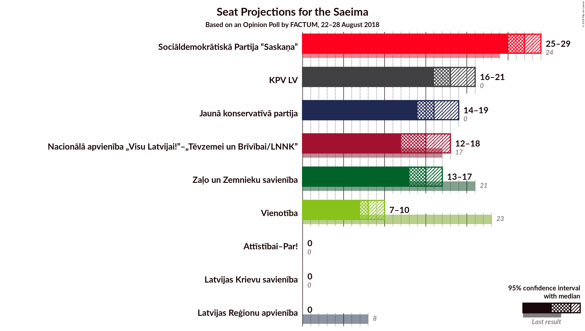

# Opinion Poll by FACTUM, 22–28 August 2018

<a href="#voting-intentions">Voting Intentions</a> | <a href="#seats">Seats</a> | <a href="#coalitions">Coalitions</a> | <a href="#technical-information">Technical Information</a>

## Voting Intentions

### Confidence Intervals

| Party | Last Result | Poll Result | 80% Confidence Interval | 90% Confidence Interval | 95% Confidence Interval | 99% Confidence Interval |
|:-----:|:-----------:|:-----------:|:-----------------------:|:-----------------------:|:-----------------------:|:-----------------------:|
| Sociāldemokrātiskā Partija “Saskaņa” | 23.0% | 22.0% | 20.6–23.5% |20.2–23.9% |19.8–24.3% |19.2–25.0% |
| KPV LV | 0.0% | 15.0% | 13.8–16.4% |13.5–16.7% |13.2–17.1% |12.7–17.7% |
| Jaunā konservatīvā partija | 0.7% | 13.0% | 11.9–14.3% |11.6–14.6% |11.3–14.9% |10.8–15.5% |
| Nacionālā apvienība „Visu Latvijai!”–„Tēvzemei un Brīvībai/LNNK” | 16.6% | 12.0% | 10.9–13.2% |10.6–13.5% |10.3–13.8% |9.8–14.4% |
| Zaļo un Zemnieku savienība | 19.5% | 11.0% | 10.0–12.2% |9.7–12.5% |9.4–12.8% |8.9–13.4% |
| Kustība Par! | 0.0% | 11.0% | N/A |N/A |N/A |N/A |
| Vienotība | 21.9% | 7.0% | 6.2–8.0% |6.0–8.3% |5.8–8.5% |5.4–9.0% |
| Latvijas Krievu savienība | 1.6% | 3.0% | 2.5–3.7% |2.3–3.9% |2.2–4.1% |2.0–4.4% |
| Latvijas Reģionu apvienība | 6.7% | 2.0% | 1.6–2.6% |1.5–2.8% |1.4–2.9% |1.2–3.2% |

*Note:* The poll result column reflects the actual value used in the calculations. Published results may vary slightly, and in addition be rounded to fewer digits.

## Seats

### Confidence Intervals

| Party | Last Result | Median | 80% Confidence Interval | 90% Confidence Interval | 95% Confidence Interval | 99% Confidence Interval |
|:-----:|:-----------:|:------:|:-----------------------:|:-----------------------:|:-----------------------:|:-----------------------:|
| <a href="#sociāldemokrātiskā-partija-“saskaņa”">Sociāldemokrātiskā Partija “Saskaņa”</a> | 24 | 24 | 22–25 |22–26 |22–26 |22–27 |
| <a href="#kpv-lv">KPV LV</a> | 0 | 16 | 15–17 |14–17 |14–18 |14–19 |
| <a href="#jaunā-konservatīvā-partija">Jaunā konservatīvā partija</a> | 0 | 14 | 13–15 |13–15 |13–16 |13–17 |
| <a href="#nacionālā-apvienība-„visu-latvijai!”–„tēvzemei-un-brīvībai/lnnk”">Nacionālā apvienība „Visu Latvijai!”–„Tēvzemei un Brīvībai/LNNK”</a> | 17 | 13 | 12–14 |12–15 |12–15 |11–16 |
| <a href="#zaļo-un-zemnieku-savienība">Zaļo un Zemnieku savienība</a> | 21 | 14 | 11–15 |11–15 |11–15 |10–15 |
| <a href="#kustība-par!">Kustība Par!</a> | 0 | N/A | N/A |N/A |N/A |N/A |
| <a href="#vienotība">Vienotība</a> | 23 | 7 | 7–8 |7–9 |7–9 |7–10 |
| <a href="#latvijas-krievu-savienība">Latvijas Krievu savienība</a> | 0 | 0 | 0 |0 |0 |0 |
| <a href="#latvijas-reģionu-apvienība">Latvijas Reģionu apvienība</a> | 8 | 0 | 0 |0 |0 |0 |

