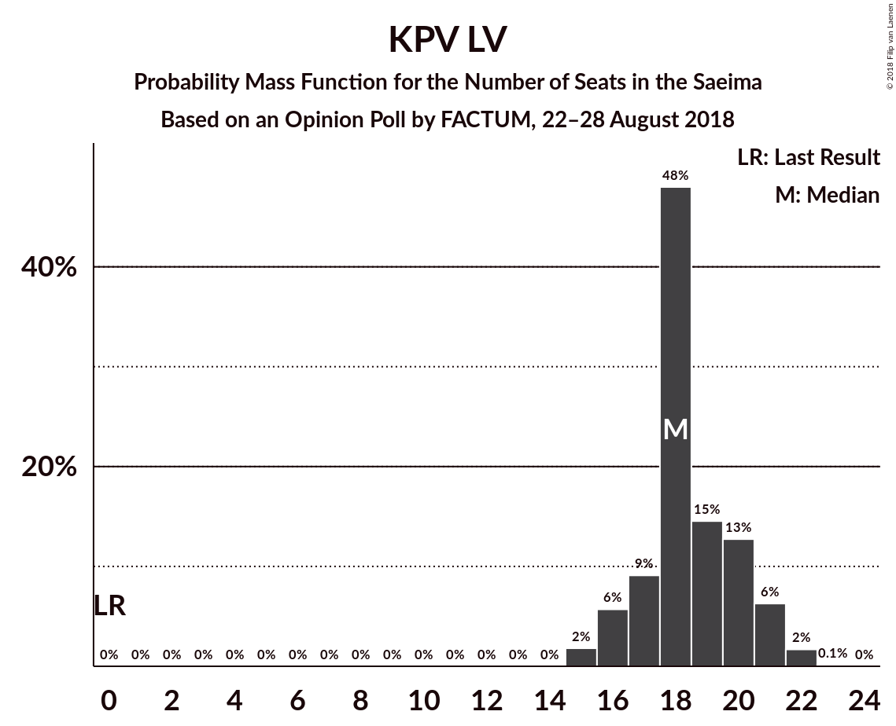
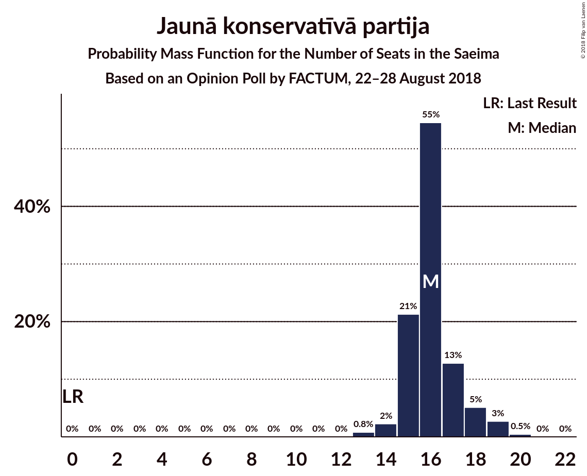
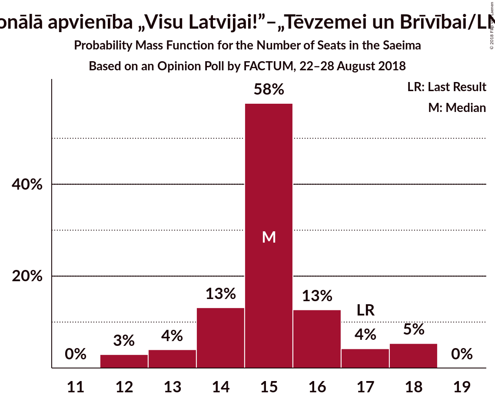
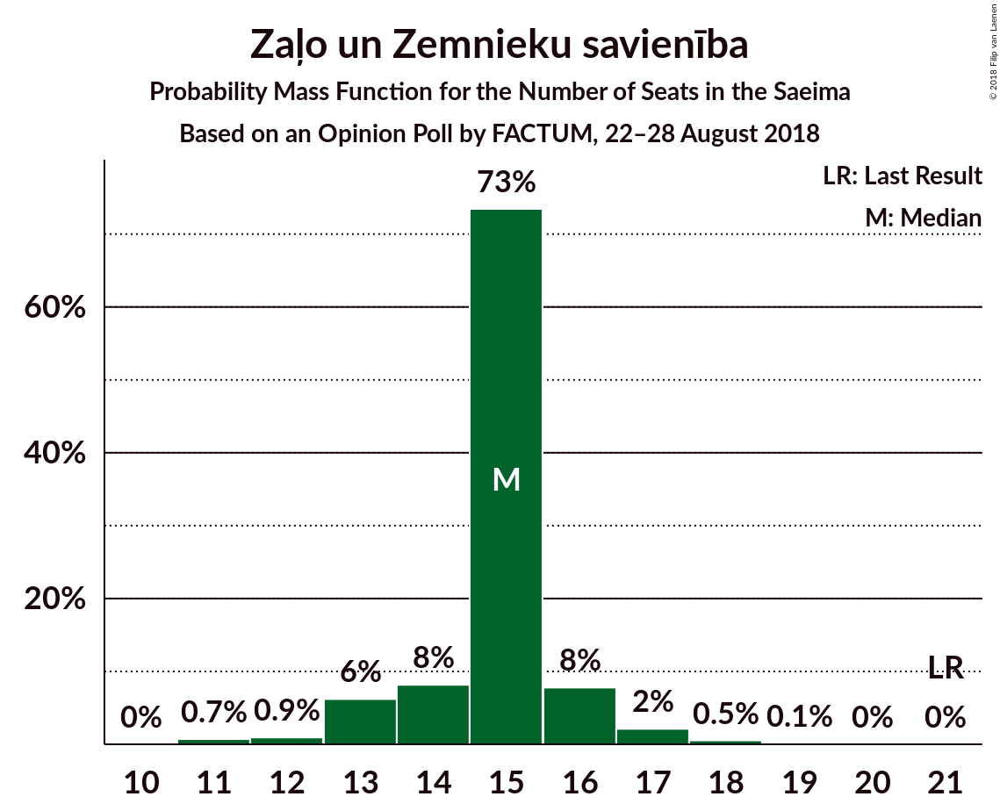
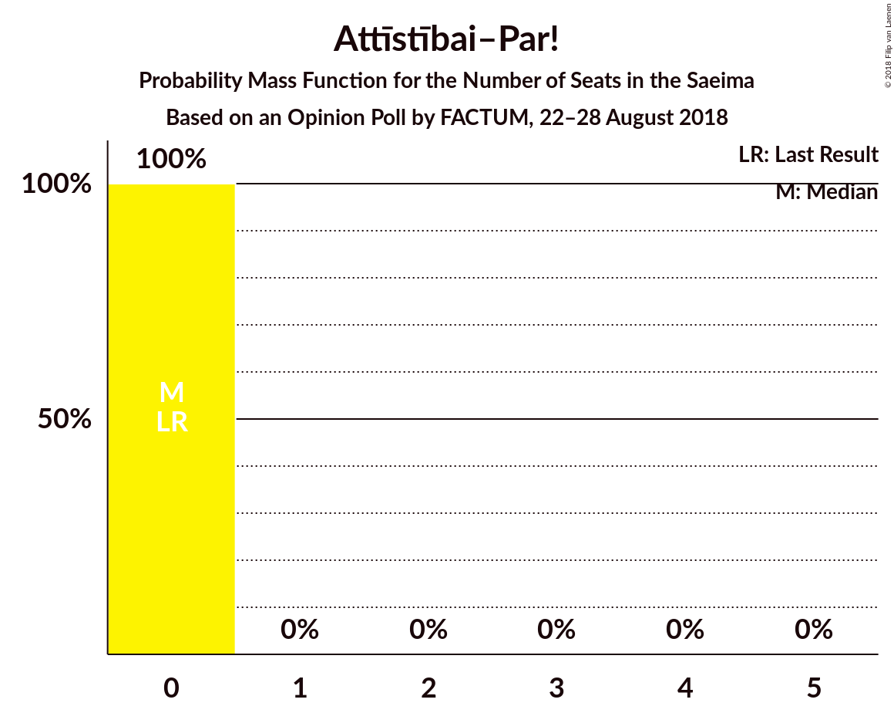
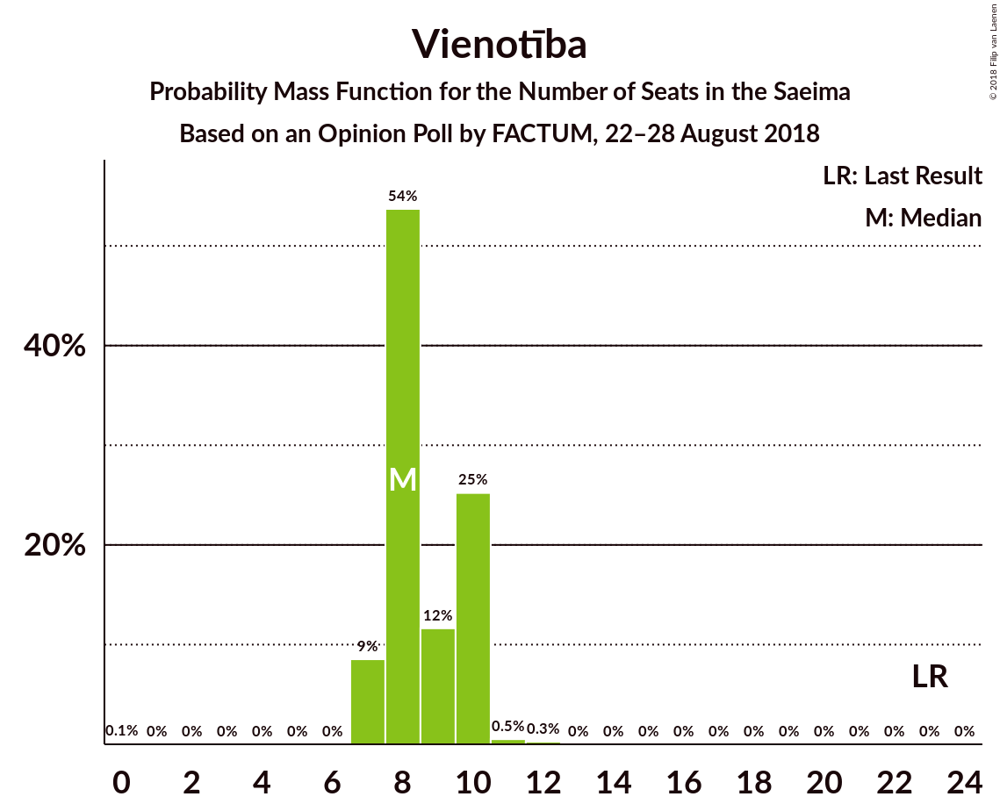
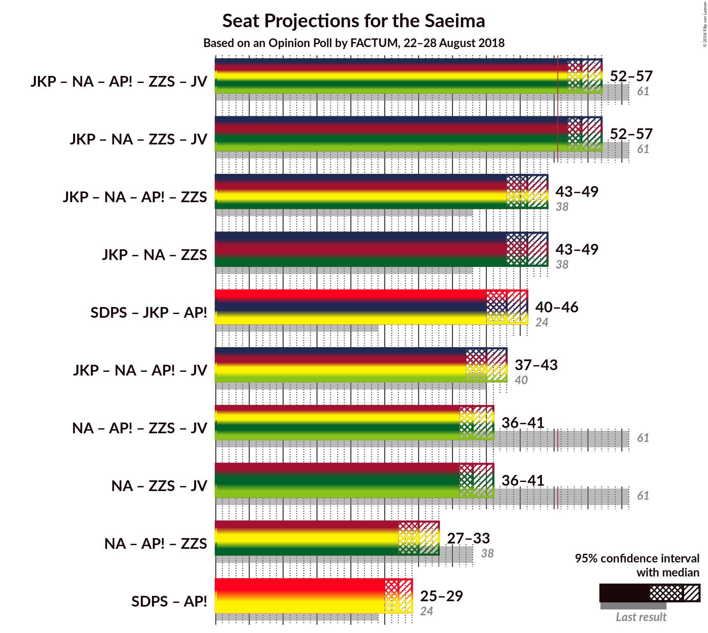

# Opinion Poll by FACTUM, 22–28 August 2018

<a href="#voting-intentions">Voting Intentions</a> | <a href="#seats">Seats</a> | <a href="#coalitions">Coalitions</a> | <a href="#technical-information">Technical Information</a>

## Voting Intentions

### Confidence Intervals

| Party | Last Result | Poll Result | 80% Confidence Interval | 90% Confidence Interval | 95% Confidence Interval | 99% Confidence Interval |
|:-----:|:-----------:|:-----------:|:-----------------------:|:-----------------------:|:-----------------------:|:-----------------------:|
| Sociāldemokrātiskā Partija “Saskaņa” | 23.0% | 22.0% | 20.6–23.5% |20.2–23.9% |19.8–24.3% |19.2–25.0% |
| KPV LV | 0.0% | 15.0% | 13.8–16.4% |13.5–16.7% |13.2–17.1% |12.7–17.7% |
| Jaunā konservatīvā partija | 0.7% | 13.0% | 11.9–14.3% |11.6–14.6% |11.3–14.9% |10.8–15.5% |
| Nacionālā apvienība „Visu Latvijai!”–„Tēvzemei un Brīvībai/LNNK” | 16.6% | 12.0% | 10.9–13.2% |10.6–13.5% |10.3–13.8% |9.8–14.4% |
| Zaļo un Zemnieku savienība | 19.5% | 11.0% | 10.0–12.2% |9.7–12.5% |9.4–12.8% |8.9–13.4% |
| Attīstībai–Par! | 0.9% | 11.0% | 10.0–12.2% |9.7–12.5% |9.4–12.8% |8.9–13.4% |
| Vienotība | 21.9% | 7.0% | 6.2–8.0% |6.0–8.3% |5.8–8.5% |5.4–9.0% |
| Latvijas Krievu savienība | 1.6% | 3.0% | 2.5–3.7% |2.3–3.9% |2.2–4.1% |2.0–4.4% |
| Latvijas Reģionu apvienība | 6.7% | 2.0% | 1.6–2.6% |1.5–2.8% |1.4–2.9% |1.2–3.2% |

*Note:* The poll result column reflects the actual value used in the calculations. Published results may vary slightly, and in addition be rounded to fewer digits.

## Seats

### Confidence Intervals

| Party | Last Result | Median | 80% Confidence Interval | 90% Confidence Interval | 95% Confidence Interval | 99% Confidence Interval |
|:-----:|:-----------:|:------:|:-----------------------:|:-----------------------:|:-----------------------:|:-----------------------:|
| <a href="#sociāldemokrātiskā-partija-“saskaņa”">Sociāldemokrātiskā Partija “Saskaņa”</a> | 24 | 27 | 26–28 |25–29 |25–29 |24–31 |
| <a href="#kpv-lv">KPV LV</a> | 0 | 18 | 17–20 |16–21 |16–21 |15–22 |
| <a href="#jaunā-konservatīvā-partija">Jaunā konservatīvā partija</a> | 0 | 16 | 15–17 |15–18 |14–19 |13–19 |
| <a href="#nacionālā-apvienība-„visu-latvijai!”–„tēvzemei-un-brīvībai/lnnk”">Nacionālā apvienība „Visu Latvijai!”–„Tēvzemei un Brīvībai/LNNK”</a> | 17 | 15 | 14–16 |13–18 |12–18 |12–18 |
| <a href="#zaļo-un-zemnieku-savienība">Zaļo un Zemnieku savienība</a> | 21 | 15 | 14–16 |13–16 |13–17 |11–18 |
| <a href="#attīstībai–par!">Attīstībai–Par!</a> | 0 | 0 | 0 |0 |0 |0 |
| <a href="#vienotība">Vienotība</a> | 23 | 8 | 8–10 |7–10 |7–10 |7–11 |
| <a href="#latvijas-krievu-savienība">Latvijas Krievu savienība</a> | 0 | 0 | 0 |0 |0 |0 |
| <a href="#latvijas-reģionu-apvienība">Latvijas Reģionu apvienība</a> | 8 | 0 | 0 |0 |0 |0 |

### Sociāldemokrātiskā Partija “Saskaņa”

*For a full overview of the results for this party, see the [Sociāldemokrātiskā Partija “Saskaņa”](party-sociāldemokrātiskāpartija“saskaņa”.html) page.*

| Number of Seats | Probability | Accumulated | Special Marks |
|:---------------:|:-----------:|:-----------:|:-------------:|
| 22 | 0.1% | 100% |  |
| 23 | 0.2% | 99.9% |  |
| 24 | 0.7% | 99.8% | Last Result |
| 25 | 8% | 99.1% |  |
| 26 | 23% | 91% |  |
| 27 | 33% | 69% | Median |
| 28 | 28% | 36% |  |
| 29 | 6% | 8% |  |
| 30 | 1.2% | 2% |  |
| 31 | 0.5% | 0.6% |  |
| 32 | 0.1% | 0.1% |  |
| 33 | 0% | 0% |  |

### KPV LV

*For a full overview of the results for this party, see the [KPV LV](party-kpvlv.html) page.*

| Number of Seats | Probability | Accumulated | Special Marks |
|:---------------:|:-----------:|:-----------:|:-------------:|
| 0 | 0% | 100% | Last Result |
| 1 | 0% | 100% |  |
| 2 | 0% | 100% |  |
| 3 | 0% | 100% |  |
| 4 | 0% | 100% |  |
| 5 | 0% | 100% |  |
| 6 | 0% | 100% |  |
| 7 | 0% | 100% |  |
| 8 | 0% | 100% |  |
| 9 | 0% | 100% |  |
| 10 | 0% | 100% |  |
| 11 | 0% | 100% |  |
| 12 | 0% | 100% |  |
| 13 | 0% | 100% |  |
| 14 | 0% | 100% |  |
| 15 | 2% | 100% |  |
| 16 | 6% | 98% |  |
| 17 | 9% | 92% |  |
| 18 | 48% | 83% | Median |
| 19 | 15% | 35% |  |
| 20 | 13% | 21% |  |
| 21 | 6% | 8% |  |
| 22 | 2% | 2% |  |
| 23 | 0.1% | 0.1% |  |
| 24 | 0% | 0% |  |

### Jaunā konservatīvā partija

*For a full overview of the results for this party, see the [Jaunā konservatīvā partija](party-jaunākonservatīvāpartija.html) page.*

| Number of Seats | Probability | Accumulated | Special Marks |
|:---------------:|:-----------:|:-----------:|:-------------:|
| 0 | 0% | 100% | Last Result |
| 1 | 0% | 100% |  |
| 2 | 0% | 100% |  |
| 3 | 0% | 100% |  |
| 4 | 0% | 100% |  |
| 5 | 0% | 100% |  |
| 6 | 0% | 100% |  |
| 7 | 0% | 100% |  |
| 8 | 0% | 100% |  |
| 9 | 0% | 100% |  |
| 10 | 0% | 100% |  |
| 11 | 0% | 100% |  |
| 12 | 0% | 100% |  |
| 13 | 0.8% | 100% |  |
| 14 | 2% | 99.2% |  |
| 15 | 21% | 97% |  |
| 16 | 55% | 76% | Median |
| 17 | 13% | 21% |  |
| 18 | 5% | 8% |  |
| 19 | 3% | 3% |  |
| 20 | 0.5% | 0.5% |  |
| 21 | 0% | 0% |  |

### Nacionālā apvienība „Visu Latvijai!”–„Tēvzemei un Brīvībai/LNNK”

*For a full overview of the results for this party, see the [Nacionālā apvienība „Visu Latvijai!”–„Tēvzemei un Brīvībai/LNNK”](party-nacionālāapvienība„visulatvijai”–„tēvzemeiunbrīvībailnnk”.html) page.*

| Number of Seats | Probability | Accumulated | Special Marks |
|:---------------:|:-----------:|:-----------:|:-------------:|
| 12 | 3% | 100% |  |
| 13 | 4% | 97% |  |
| 14 | 13% | 93% |  |
| 15 | 58% | 80% | Median |
| 16 | 13% | 22% |  |
| 17 | 4% | 10% | Last Result |
| 18 | 5% | 5% |  |
| 19 | 0% | 0% |  |

### Zaļo un Zemnieku savienība

*For a full overview of the results for this party, see the [Zaļo un Zemnieku savienība](party-zaļounzemniekusavienība.html) page.*

| Number of Seats | Probability | Accumulated | Special Marks |
|:---------------:|:-----------:|:-----------:|:-------------:|
| 11 | 0.7% | 100% |  |
| 12 | 0.9% | 99.3% |  |
| 13 | 6% | 98% |  |
| 14 | 8% | 92% |  |
| 15 | 73% | 84% | Median |
| 16 | 8% | 11% |  |
| 17 | 2% | 3% |  |
| 18 | 0.5% | 0.6% |  |
| 19 | 0.1% | 0.1% |  |
| 20 | 0% | 0% |  |
| 21 | 0% | 0% | Last Result |

### Attīstībai–Par!

*For a full overview of the results for this party, see the [Attīstībai–Par!](party-attīstībai–par.html) page.*

| Number of Seats | Probability | Accumulated | Special Marks |
|:---------------:|:-----------:|:-----------:|:-------------:|
| 0 | 100% | 100% | Last Result, Median |

### Vienotība

*For a full overview of the results for this party, see the [Vienotība](party-vienotība.html) page.*

| Number of Seats | Probability | Accumulated | Special Marks |
|:---------------:|:-----------:|:-----------:|:-------------:|
| 0 | 0.1% | 100% |  |
| 1 | 0% | 99.9% |  |
| 2 | 0% | 99.9% |  |
| 3 | 0% | 99.9% |  |
| 4 | 0% | 99.9% |  |
| 5 | 0% | 99.9% |  |
| 6 | 0% | 99.9% |  |
| 7 | 9% | 99.9% |  |
| 8 | 54% | 91% | Median |
| 9 | 12% | 38% |  |
| 10 | 25% | 26% |  |
| 11 | 0.5% | 0.8% |  |
| 12 | 0.3% | 0.3% |  |
| 13 | 0% | 0% |  |
| 14 | 0% | 0% |  |
| 15 | 0% | 0% |  |
| 16 | 0% | 0% |  |
| 17 | 0% | 0% |  |
| 18 | 0% | 0% |  |
| 19 | 0% | 0% |  |
| 20 | 0% | 0% |  |
| 21 | 0% | 0% |  |
| 22 | 0% | 0% |  |
| 23 | 0% | 0% | Last Result |

### Latvijas Krievu savienība

*For a full overview of the results for this party, see the [Latvijas Krievu savienība](party-latvijaskrievusavienība.html) page.*

| Number of Seats | Probability | Accumulated | Special Marks |
|:---------------:|:-----------:|:-----------:|:-------------:|
| 0 | 100% | 100% | Last Result, Median |

### Latvijas Reģionu apvienība

*For a full overview of the results for this party, see the [Latvijas Reģionu apvienība](party-latvijasreģionuapvienība.html) page.*

| Number of Seats | Probability | Accumulated | Special Marks |
|:---------------:|:-----------:|:-----------:|:-------------:|
| 0 | 100% | 100% | Median |
| 1 | 0% | 0% |  |
| 2 | 0% | 0% |  |
| 3 | 0% | 0% |  |
| 4 | 0% | 0% |  |
| 5 | 0% | 0% |  |
| 6 | 0% | 0% |  |
| 7 | 0% | 0% |  |
| 8 | 0% | 0% | Last Result |

## Coalitions

### Confidence Intervals

| Coalition | Last Result | Median | Majority? | 80% Confidence Interval | 90% Confidence Interval | 95% Confidence Interval | 99% Confidence Interval |
|:---------:|:-----------:|:------:|:---------:|:-----------------------:|:-----------------------:|:-----------------------:|:-----------------------:|
| Jaunā konservatīvā partija – Nacionālā apvienība „Visu Latvijai!”–„Tēvzemei un Brīvībai/LNNK” – Attīstībai–Par! – Zaļo un Zemnieku savienība – Vienotība | 61 | 54 | 99.3% | 53–56 | 52–57 | 52–57 | 50–58 |
| Jaunā konservatīvā partija – Nacionālā apvienība „Visu Latvijai!”–„Tēvzemei un Brīvībai/LNNK” – Zaļo un Zemnieku savienība – Vienotība | 61 | 54 | 99.3% | 53–56 | 52–57 | 52–57 | 50–58 |
| Jaunā konservatīvā partija – Nacionālā apvienība „Visu Latvijai!”–„Tēvzemei un Brīvībai/LNNK” – Attīstībai–Par! – Zaļo un Zemnieku savienība | 38 | 46 | 0.2% | 44–48 | 44–49 | 43–49 | 42–50 |
| Jaunā konservatīvā partija – Nacionālā apvienība „Visu Latvijai!”–„Tēvzemei un Brīvībai/LNNK” – Zaļo un Zemnieku savienība | 38 | 46 | 0.2% | 44–48 | 44–49 | 43–49 | 42–50 |
| Sociāldemokrātiskā Partija “Saskaņa” – Jaunā konservatīvā partija – Attīstībai–Par! | 24 | 43 | 0% | 41–45 | 41–46 | 40–46 | 40–47 |
| Jaunā konservatīvā partija – Nacionālā apvienība „Visu Latvijai!”–„Tēvzemei un Brīvībai/LNNK” – Attīstībai–Par! – Vienotība | 40 | 40 | 0% | 38–41 | 38–42 | 37–43 | 36–44 |
| Nacionālā apvienība „Visu Latvijai!”–„Tēvzemei un Brīvībai/LNNK” – Attīstībai–Par! – Zaļo un Zemnieku savienība – Vienotība | 61 | 38 | 0% | 37–40 | 36–41 | 36–41 | 34–43 |
| Nacionālā apvienība „Visu Latvijai!”–„Tēvzemei un Brīvībai/LNNK” – Zaļo un Zemnieku savienība – Vienotība | 61 | 38 | 0% | 37–40 | 36–41 | 36–41 | 34–43 |
| Nacionālā apvienība „Visu Latvijai!”–„Tēvzemei un Brīvībai/LNNK” – Attīstībai–Par! – Zaļo un Zemnieku savienība | 38 | 30 | 0% | 28–32 | 28–33 | 27–33 | 26–34 |
| Sociāldemokrātiskā Partija “Saskaņa” – Attīstībai–Par! | 24 | 27 | 0% | 26–28 | 25–29 | 25–29 | 24–31 |

### Jaunā konservatīvā partija – Nacionālā apvienība „Visu Latvijai!”–„Tēvzemei un Brīvībai/LNNK” – Attīstībai–Par! – Zaļo un Zemnieku savienība – Vienotība

| Number of Seats | Probability | Accumulated | Special Marks |
|:---------------:|:-----------:|:-----------:|:-------------:|
| 49 | 0.1% | 100% |  |
| 50 | 0.7% | 99.9% |  |
| 51 | 1.5% | 99.3% | Majority |
| 52 | 3% | 98% |  |
| 53 | 9% | 95% |  |
| 54 | 40% | 86% | Median |
| 55 | 26% | 46% |  |
| 56 | 12% | 20% |  |
| 57 | 6% | 8% |  |
| 58 | 2% | 2% |  |
| 59 | 0.3% | 0.4% |  |
| 60 | 0% | 0.1% |  |
| 61 | 0% | 0% | Last Result |

### Jaunā konservatīvā partija – Nacionālā apvienība „Visu Latvijai!”–„Tēvzemei un Brīvībai/LNNK” – Zaļo un Zemnieku savienība – Vienotība

| Number of Seats | Probability | Accumulated | Special Marks |
|:---------------:|:-----------:|:-----------:|:-------------:|
| 49 | 0.1% | 100% |  |
| 50 | 0.7% | 99.9% |  |
| 51 | 1.5% | 99.3% | Majority |
| 52 | 3% | 98% |  |
| 53 | 9% | 95% |  |
| 54 | 40% | 86% | Median |
| 55 | 26% | 46% |  |
| 56 | 12% | 20% |  |
| 57 | 6% | 8% |  |
| 58 | 2% | 2% |  |
| 59 | 0.3% | 0.4% |  |
| 60 | 0% | 0.1% |  |
| 61 | 0% | 0% | Last Result |

### Jaunā konservatīvā partija – Nacionālā apvienība „Visu Latvijai!”–„Tēvzemei un Brīvībai/LNNK” – Attīstībai–Par! – Zaļo un Zemnieku savienība

| Number of Seats | Probability | Accumulated | Special Marks |
|:---------------:|:-----------:|:-----------:|:-------------:|
| 38 | 0% | 100% | Last Result |
| 39 | 0% | 100% |  |
| 40 | 0% | 100% |  |
| 41 | 0.3% | 100% |  |
| 42 | 0.8% | 99.7% |  |
| 43 | 3% | 98.9% |  |
| 44 | 8% | 96% |  |
| 45 | 23% | 88% |  |
| 46 | 36% | 65% | Median |
| 47 | 13% | 29% |  |
| 48 | 8% | 15% |  |
| 49 | 6% | 7% |  |
| 50 | 0.8% | 1.1% |  |
| 51 | 0.1% | 0.2% | Majority |
| 52 | 0.1% | 0.1% |  |
| 53 | 0% | 0% |  |

### Jaunā konservatīvā partija – Nacionālā apvienība „Visu Latvijai!”–„Tēvzemei un Brīvībai/LNNK” – Zaļo un Zemnieku savienība

| Number of Seats | Probability | Accumulated | Special Marks |
|:---------------:|:-----------:|:-----------:|:-------------:|
| 38 | 0% | 100% | Last Result |
| 39 | 0% | 100% |  |
| 40 | 0% | 100% |  |
| 41 | 0.3% | 100% |  |
| 42 | 0.8% | 99.7% |  |
| 43 | 3% | 98.9% |  |
| 44 | 8% | 96% |  |
| 45 | 23% | 88% |  |
| 46 | 36% | 65% | Median |
| 47 | 13% | 29% |  |
| 48 | 8% | 15% |  |
| 49 | 6% | 7% |  |
| 50 | 0.8% | 1.1% |  |
| 51 | 0.1% | 0.2% | Majority |
| 52 | 0.1% | 0.1% |  |
| 53 | 0% | 0% |  |

### Sociāldemokrātiskā Partija “Saskaņa” – Jaunā konservatīvā partija – Attīstībai–Par!

| Number of Seats | Probability | Accumulated | Special Marks |
|:---------------:|:-----------:|:-----------:|:-------------:|
| 24 | 0% | 100% | Last Result |
| 25 | 0% | 100% |  |
| 26 | 0% | 100% |  |
| 27 | 0% | 100% |  |
| 28 | 0% | 100% |  |
| 29 | 0% | 100% |  |
| 30 | 0% | 100% |  |
| 31 | 0% | 100% |  |
| 32 | 0% | 100% |  |
| 33 | 0% | 100% |  |
| 34 | 0% | 100% |  |
| 35 | 0% | 100% |  |
| 36 | 0% | 100% |  |
| 37 | 0% | 100% |  |
| 38 | 0% | 100% |  |
| 39 | 0.3% | 100% |  |
| 40 | 3% | 99.7% |  |
| 41 | 8% | 97% |  |
| 42 | 26% | 89% |  |
| 43 | 24% | 64% | Median |
| 44 | 27% | 39% |  |
| 45 | 5% | 12% |  |
| 46 | 6% | 7% |  |
| 47 | 0.9% | 1.3% |  |
| 48 | 0.3% | 0.4% |  |
| 49 | 0% | 0.1% |  |
| 50 | 0% | 0% |  |

### Jaunā konservatīvā partija – Nacionālā apvienība „Visu Latvijai!”–„Tēvzemei un Brīvībai/LNNK” – Attīstībai–Par! – Vienotība

| Number of Seats | Probability | Accumulated | Special Marks |
|:---------------:|:-----------:|:-----------:|:-------------:|
| 34 | 0.1% | 100% |  |
| 35 | 0.1% | 99.9% |  |
| 36 | 0.9% | 99.8% |  |
| 37 | 3% | 98.9% |  |
| 38 | 9% | 96% |  |
| 39 | 36% | 87% | Median |
| 40 | 29% | 51% | Last Result |
| 41 | 13% | 22% |  |
| 42 | 7% | 9% |  |
| 43 | 2% | 3% |  |
| 44 | 0.6% | 0.7% |  |
| 45 | 0.1% | 0.1% |  |
| 46 | 0.1% | 0.1% |  |
| 47 | 0% | 0% |  |

### Nacionālā apvienība „Visu Latvijai!”–„Tēvzemei un Brīvībai/LNNK” – Attīstībai–Par! – Zaļo un Zemnieku savienība – Vienotība

| Number of Seats | Probability | Accumulated | Special Marks |
|:---------------:|:-----------:|:-----------:|:-------------:|
| 32 | 0% | 100% |  |
| 33 | 0.1% | 99.9% |  |
| 34 | 0.6% | 99.9% |  |
| 35 | 1.5% | 99.3% |  |
| 36 | 4% | 98% |  |
| 37 | 8% | 94% |  |
| 38 | 44% | 85% | Median |
| 39 | 20% | 41% |  |
| 40 | 13% | 21% |  |
| 41 | 6% | 8% |  |
| 42 | 1.5% | 2% |  |
| 43 | 0.8% | 0.9% |  |
| 44 | 0.1% | 0.1% |  |
| 45 | 0% | 0% |  |
| 46 | 0% | 0% |  |
| 47 | 0% | 0% |  |
| 48 | 0% | 0% |  |
| 49 | 0% | 0% |  |
| 50 | 0% | 0% |  |
| 51 | 0% | 0% | Majority |
| 52 | 0% | 0% |  |
| 53 | 0% | 0% |  |
| 54 | 0% | 0% |  |
| 55 | 0% | 0% |  |
| 56 | 0% | 0% |  |
| 57 | 0% | 0% |  |
| 58 | 0% | 0% |  |
| 59 | 0% | 0% |  |
| 60 | 0% | 0% |  |
| 61 | 0% | 0% | Last Result |

### Nacionālā apvienība „Visu Latvijai!”–„Tēvzemei un Brīvībai/LNNK” – Zaļo un Zemnieku savienība – Vienotība

| Number of Seats | Probability | Accumulated | Special Marks |
|:---------------:|:-----------:|:-----------:|:-------------:|
| 32 | 0% | 100% |  |
| 33 | 0.1% | 99.9% |  |
| 34 | 0.6% | 99.9% |  |
| 35 | 1.5% | 99.3% |  |
| 36 | 4% | 98% |  |
| 37 | 8% | 94% |  |
| 38 | 44% | 85% | Median |
| 39 | 20% | 41% |  |
| 40 | 13% | 21% |  |
| 41 | 6% | 8% |  |
| 42 | 1.5% | 2% |  |
| 43 | 0.8% | 0.9% |  |
| 44 | 0.1% | 0.1% |  |
| 45 | 0% | 0% |  |
| 46 | 0% | 0% |  |
| 47 | 0% | 0% |  |
| 48 | 0% | 0% |  |
| 49 | 0% | 0% |  |
| 50 | 0% | 0% |  |
| 51 | 0% | 0% | Majority |
| 52 | 0% | 0% |  |
| 53 | 0% | 0% |  |
| 54 | 0% | 0% |  |
| 55 | 0% | 0% |  |
| 56 | 0% | 0% |  |
| 57 | 0% | 0% |  |
| 58 | 0% | 0% |  |
| 59 | 0% | 0% |  |
| 60 | 0% | 0% |  |
| 61 | 0% | 0% | Last Result |

### Nacionālā apvienība „Visu Latvijai!”–„Tēvzemei un Brīvībai/LNNK” – Attīstībai–Par! – Zaļo un Zemnieku savienība

| Number of Seats | Probability | Accumulated | Special Marks |
|:---------------:|:-----------:|:-----------:|:-------------:|
| 25 | 0.1% | 100% |  |
| 26 | 0.9% | 99.9% |  |
| 27 | 3% | 99.0% |  |
| 28 | 7% | 96% |  |
| 29 | 17% | 89% |  |
| 30 | 50% | 72% | Median |
| 31 | 12% | 22% |  |
| 32 | 5% | 10% |  |
| 33 | 5% | 5% |  |
| 34 | 0.5% | 0.6% |  |
| 35 | 0.1% | 0.1% |  |
| 36 | 0% | 0% |  |
| 37 | 0% | 0% |  |
| 38 | 0% | 0% | Last Result |

### Sociāldemokrātiskā Partija “Saskaņa” – Attīstībai–Par!

| Number of Seats | Probability | Accumulated | Special Marks |
|:---------------:|:-----------:|:-----------:|:-------------:|
| 22 | 0.1% | 100% |  |
| 23 | 0.2% | 99.9% |  |
| 24 | 0.7% | 99.8% | Last Result |
| 25 | 8% | 99.1% |  |
| 26 | 23% | 91% |  |
| 27 | 33% | 69% | Median |
| 28 | 28% | 36% |  |
| 29 | 6% | 8% |  |
| 30 | 1.2% | 2% |  |
| 31 | 0.5% | 0.6% |  |
| 32 | 0.1% | 0.1% |  |
| 33 | 0% | 0% |  |

## Technical Information

### Opinion Poll

+ **Polling firm:** FACTUM
+ **Commissioner(s):** —
+ **Fieldwork period:** 22–28 August 2018

### Calculations

+ **Sample size:** 1337
+ **Simulations done:** 1,048,576
+ **Error estimate:** 1.98%

