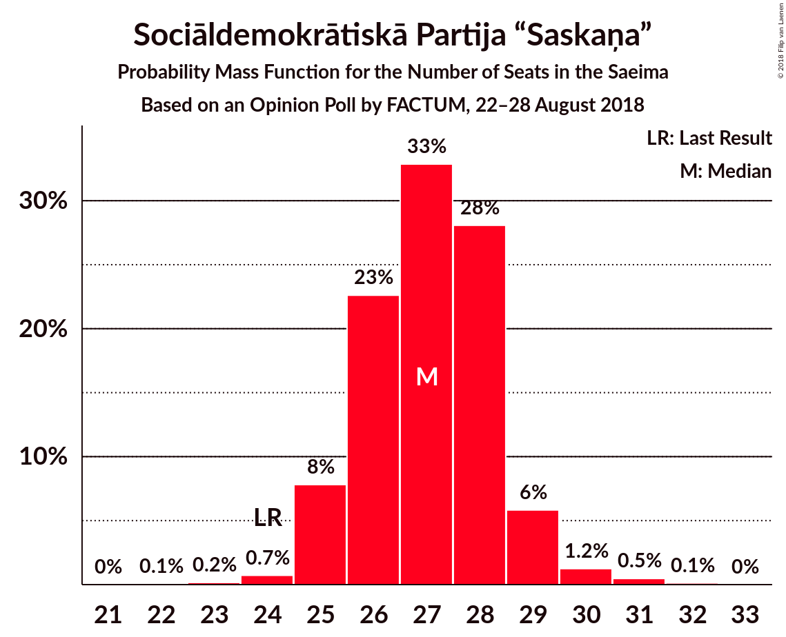

# Opinion Poll by FACTUM, 22–28 August 2018

<a href="#voting-intentions">Voting Intentions</a> | <a href="#seats">Seats</a> | <a href="#coalitions">Coalitions</a> | <a href="#technical-information">Technical Information</a>

## Voting Intentions

### Confidence Intervals

| Party | Last Result | Poll Result | 80% Confidence Interval | 90% Confidence Interval | 95% Confidence Interval | 99% Confidence Interval |
|:-----:|:-----------:|:-----------:|:-----------------------:|:-----------------------:|:-----------------------:|:-----------------------:|
| Sociāldemokrātiskā Partija “Saskaņa” | 23.0% | 22.0% | 20.6–23.5% |20.2–23.9% |19.8–24.3% |19.2–25.0% |
| Kam pieder valsts? | 0.0% | 15.0% | 13.8–16.4% |13.5–16.7% |13.2–17.1% |12.7–17.7% |
| Jaunā konservatīvā partija | 0.7% | 13.0% | 11.9–14.3% |11.6–14.6% |11.3–14.9% |10.8–15.5% |
| Nacionālā apvienība „Visu Latvijai!”–„Tēvzemei un Brīvībai/LNNK” | 16.6% | 12.0% | 10.9–13.2% |10.6–13.5% |10.3–13.8% |9.8–14.4% |
| Zaļo un Zemnieku savienība | 19.5% | 11.0% | 10.0–12.2% |9.7–12.5% |9.4–12.8% |8.9–13.4% |
| Kustība Par! | 0.0% | 11.0% | 10.0–12.2% |9.7–12.5% |9.4–12.8% |8.9–13.4% |
| Vienotība | 21.9% | 7.0% | 6.2–8.0% |6.0–8.3% |5.8–8.5% |5.4–9.0% |
| Latvijas Krievu savienība | 1.6% | 3.0% | 2.5–3.7% |2.3–3.9% |2.2–4.1% |2.0–4.4% |
| Latvijas Reģionu apvienība | 6.7% | 2.0% | 1.6–2.6% |1.5–2.8% |1.4–2.9% |1.2–3.2% |

*Note:* The poll result column reflects the actual value used in the calculations. Published results may vary slightly, and in addition be rounded to fewer digits.

## Seats

### Confidence Intervals

| Party | Last Result | Median | 80% Confidence Interval | 90% Confidence Interval | 95% Confidence Interval | 99% Confidence Interval |
|:-----:|:-----------:|:------:|:-----------------------:|:-----------------------:|:-----------------------:|:-----------------------:|
| <a href="#sociāldemokrātiskā-partija-“saskaņa”">Sociāldemokrātiskā Partija “Saskaņa”</a> | 24 | 24 | 22–25 |22–26 |22–26 |22–27 |
| <a href="#kam-pieder-valsts?">Kam pieder valsts?</a> | 0 | 16 | 15–17 |14–17 |14–18 |14–19 |
| <a href="#jaunā-konservatīvā-partija">Jaunā konservatīvā partija</a> | 0 | 14 | 13–15 |13–15 |13–16 |13–17 |
| <a href="#nacionālā-apvienība-„visu-latvijai!”–„tēvzemei-un-brīvībai/lnnk”">Nacionālā apvienība „Visu Latvijai!”–„Tēvzemei un Brīvībai/LNNK”</a> | 17 | 13 | 12–14 |12–15 |12–15 |11–16 |
| <a href="#zaļo-un-zemnieku-savienība">Zaļo un Zemnieku savienība</a> | 21 | 14 | 11–15 |11–15 |11–15 |10–15 |
| <a href="#kustība-par!">Kustība Par!</a> | 0 | 12 | 10–13 |10–14 |10–14 |10–15 |
| <a href="#vienotība">Vienotība</a> | 23 | 7 | 7–8 |7–9 |7–9 |7–10 |
| <a href="#latvijas-krievu-savienība">Latvijas Krievu savienība</a> | 0 | 0 | 0 |0 |0 |0 |
| <a href="#latvijas-reģionu-apvienība">Latvijas Reģionu apvienība</a> | 8 | 0 | 0 |0 |0 |0 |

### Sociāldemokrātiskā Partija “Saskaņa”

*For a full overview of the results for this party, see the [Sociāldemokrātiskā Partija “Saskaņa”](party-sociāldemokrātiskāpartija“saskaņa”.html) page.*

| Number of Seats | Probability | Accumulated | Special Marks |
|:---------------:|:-----------:|:-----------:|:-------------:|
| 21 | 0.3% | 100% |  |
| 22 | 14% | 99.7% |  |
| 23 | 34% | 86% |  |
| 24 | 26% | 52% | Last Result, Median |
| 25 | 16% | 25% |  |
| 26 | 7% | 10% |  |
| 27 | 2% | 2% |  |
| 28 | 0.3% | 0.4% |  |
| 29 | 0% | 0% |  |

### Kam pieder valsts?

*For a full overview of the results for this party, see the [Kam pieder valsts?](party-kampiedervalsts.html) page.*

| Number of Seats | Probability | Accumulated | Special Marks |
|:---------------:|:-----------:|:-----------:|:-------------:|
| 0 | 0% | 100% | Last Result |
| 1 | 0% | 100% |  |
| 2 | 0% | 100% |  |
| 3 | 0% | 100% |  |
| 4 | 0% | 100% |  |
| 5 | 0% | 100% |  |
| 6 | 0% | 100% |  |
| 7 | 0% | 100% |  |
| 8 | 0% | 100% |  |
| 9 | 0% | 100% |  |
| 10 | 0% | 100% |  |
| 11 | 0% | 100% |  |
| 12 | 0% | 100% |  |
| 13 | 0% | 100% |  |
| 14 | 7% | 99.9% |  |
| 15 | 30% | 93% |  |
| 16 | 17% | 64% | Median |
| 17 | 42% | 47% |  |
| 18 | 3% | 4% |  |
| 19 | 1.2% | 1.5% |  |
| 20 | 0.2% | 0.2% |  |
| 21 | 0% | 0% |  |

### Jaunā konservatīvā partija

*For a full overview of the results for this party, see the [Jaunā konservatīvā partija](party-jaunākonservatīvāpartija.html) page.*

| Number of Seats | Probability | Accumulated | Special Marks |
|:---------------:|:-----------:|:-----------:|:-------------:|
| 0 | 0% | 100% | Last Result |
| 1 | 0% | 100% |  |
| 2 | 0% | 100% |  |
| 3 | 0% | 100% |  |
| 4 | 0% | 100% |  |
| 5 | 0% | 100% |  |
| 6 | 0% | 100% |  |
| 7 | 0% | 100% |  |
| 8 | 0% | 100% |  |
| 9 | 0% | 100% |  |
| 10 | 0% | 100% |  |
| 11 | 0% | 100% |  |
| 12 | 0.2% | 100% |  |
| 13 | 34% | 99.8% |  |
| 14 | 23% | 66% | Median |
| 15 | 39% | 43% |  |
| 16 | 4% | 5% |  |
| 17 | 0.9% | 1.0% |  |
| 18 | 0% | 0.1% |  |
| 19 | 0% | 0% |  |

### Nacionālā apvienība „Visu Latvijai!”–„Tēvzemei un Brīvībai/LNNK”

*For a full overview of the results for this party, see the [Nacionālā apvienība „Visu Latvijai!”–„Tēvzemei un Brīvībai/LNNK”](party-nacionālāapvienība„visulatvijai”–„tēvzemeiunbrīvībailnnk”.html) page.*

| Number of Seats | Probability | Accumulated | Special Marks |
|:---------------:|:-----------:|:-----------:|:-------------:|
| 10 | 0.1% | 100% |  |
| 11 | 0.5% | 99.9% |  |
| 12 | 25% | 99.4% |  |
| 13 | 50% | 75% | Median |
| 14 | 19% | 25% |  |
| 15 | 5% | 6% |  |
| 16 | 0.8% | 0.9% |  |
| 17 | 0.1% | 0.1% | Last Result |
| 18 | 0% | 0% |  |

### Zaļo un Zemnieku savienība

*For a full overview of the results for this party, see the [Zaļo un Zemnieku savienība](party-zaļounzemniekusavienība.html) page.*

| Number of Seats | Probability | Accumulated | Special Marks |
|:---------------:|:-----------:|:-----------:|:-------------:|
| 10 | 1.3% | 100% |  |
| 11 | 10% | 98.7% |  |
| 12 | 12% | 88% |  |
| 13 | 14% | 77% |  |
| 14 | 49% | 63% | Median |
| 15 | 14% | 14% |  |
| 16 | 0.1% | 0.1% |  |
| 17 | 0% | 0% |  |
| 18 | 0% | 0% |  |
| 19 | 0% | 0% |  |
| 20 | 0% | 0% |  |
| 21 | 0% | 0% | Last Result |

### Kustība Par!

*For a full overview of the results for this party, see the [Kustība Par!](party-kustībapar.html) page.*

| Number of Seats | Probability | Accumulated | Special Marks |
|:---------------:|:-----------:|:-----------:|:-------------:|
| 0 | 0% | 100% | Last Result |
| 1 | 0% | 100% |  |
| 2 | 0% | 100% |  |
| 3 | 0% | 100% |  |
| 4 | 0% | 100% |  |
| 5 | 0% | 100% |  |
| 6 | 0% | 100% |  |
| 7 | 0% | 100% |  |
| 8 | 0% | 100% |  |
| 9 | 0.1% | 100% |  |
| 10 | 14% | 99.9% |  |
| 11 | 10% | 86% |  |
| 12 | 38% | 76% | Median |
| 13 | 32% | 37% |  |
| 14 | 3% | 5% |  |
| 15 | 2% | 2% |  |
| 16 | 0% | 0% |  |

### Vienotība

*For a full overview of the results for this party, see the [Vienotība](party-vienotība.html) page.*

| Number of Seats | Probability | Accumulated | Special Marks |
|:---------------:|:-----------:|:-----------:|:-------------:|
| 0 | 0.1% | 100% |  |
| 1 | 0% | 99.9% |  |
| 2 | 0% | 99.9% |  |
| 3 | 0% | 99.9% |  |
| 4 | 0% | 99.9% |  |
| 5 | 0% | 99.9% |  |
| 6 | 0% | 99.9% |  |
| 7 | 60% | 99.9% | Median |
| 8 | 30% | 39% |  |
| 9 | 8% | 9% |  |
| 10 | 1.2% | 1.2% |  |
| 11 | 0% | 0% |  |
| 12 | 0% | 0% |  |
| 13 | 0% | 0% |  |
| 14 | 0% | 0% |  |
| 15 | 0% | 0% |  |
| 16 | 0% | 0% |  |
| 17 | 0% | 0% |  |
| 18 | 0% | 0% |  |
| 19 | 0% | 0% |  |
| 20 | 0% | 0% |  |
| 21 | 0% | 0% |  |
| 22 | 0% | 0% |  |
| 23 | 0% | 0% | Last Result |

### Latvijas Krievu savienība

*For a full overview of the results for this party, see the [Latvijas Krievu savienība](party-latvijaskrievusavienība.html) page.*

| Number of Seats | Probability | Accumulated | Special Marks |
|:---------------:|:-----------:|:-----------:|:-------------:|
| 0 | 100% | 100% | Last Result, Median |

### Latvijas Reģionu apvienība

*For a full overview of the results for this party, see the [Latvijas Reģionu apvienība](party-latvijasreģionuapvienība.html) page.*

| Number of Seats | Probability | Accumulated | Special Marks |
|:---------------:|:-----------:|:-----------:|:-------------:|
| 0 | 100% | 100% | Median |
| 1 | 0% | 0% |  |
| 2 | 0% | 0% |  |
| 3 | 0% | 0% |  |
| 4 | 0% | 0% |  |
| 5 | 0% | 0% |  |
| 6 | 0% | 0% |  |
| 7 | 0% | 0% |  |
| 8 | 0% | 0% | Last Result |

## Coalitions

### Confidence Intervals

| Coalition | Last Result | Median | Majority? | 80% Confidence Interval | 90% Confidence Interval | 95% Confidence Interval | 99% Confidence Interval |
|:---------:|:-----------:|:------:|:---------:|:-----------------------:|:-----------------------:|:-----------------------:|:-----------------------:|
| Jaunā konservatīvā partija – Nacionālā apvienība „Visu Latvijai!”–„Tēvzemei un Brīvībai/LNNK” – Kustība Par! – Zaļo un Zemnieku savienība – Vienotība | 61 | 60 | 100% | 59–61 | 58–62 | 58–62 | 56–63 |
| Jaunā konservatīvā partija – Nacionālā apvienība „Visu Latvijai!”–„Tēvzemei un Brīvībai/LNNK” – Kustība Par! – Zaļo un Zemnieku savienība | 38 | 53 | 95% | 51–54 | 51–54 | 50–55 | 48–56 |
| Jaunā konservatīvā partija – Nacionālā apvienība „Visu Latvijai!”–„Tēvzemei un Brīvībai/LNNK” – Zaļo un Zemnieku savienība – Vienotība | 61 | 48 | 3% | 46–50 | 46–50 | 46–51 | 45–51 |
| Nacionālā apvienība „Visu Latvijai!”–„Tēvzemei un Brīvībai/LNNK” – Kustība Par! – Zaļo un Zemnieku savienība – Vienotība | 61 | 46 | 0% | 44–48 | 44–48 | 43–48 | 42–49 |
| Jaunā konservatīvā partija – Nacionālā apvienība „Visu Latvijai!”–„Tēvzemei un Brīvībai/LNNK” – Zaļo un Zemnieku savienība | 38 | 41 | 0% | 39–42 | 38–42 | 38–43 | 37–44 |
| Nacionālā apvienība „Visu Latvijai!”–„Tēvzemei un Brīvībai/LNNK” – Kustība Par! – Zaļo un Zemnieku savienība | 38 | 39 | 0% | 37–41 | 36–41 | 36–41 | 34–42 |
| Nacionālā apvienība „Visu Latvijai!”–„Tēvzemei un Brīvībai/LNNK” – Zaļo un Zemnieku savienība – Vienotība | 61 | 34 | 0% | 32–36 | 32–36 | 31–36 | 30–37 |

### Jaunā konservatīvā partija – Nacionālā apvienība „Visu Latvijai!”–„Tēvzemei un Brīvībai/LNNK” – Kustība Par! – Zaļo un Zemnieku savienība – Vienotība

| Number of Seats | Probability | Accumulated | Special Marks |
|:---------------:|:-----------:|:-----------:|:-------------:|
| 55 | 0% | 100% |  |
| 56 | 0.5% | 99.9% |  |
| 57 | 2% | 99.4% |  |
| 58 | 5% | 98% |  |
| 59 | 14% | 92% |  |
| 60 | 39% | 79% | Median |
| 61 | 35% | 40% | Last Result |
| 62 | 3% | 5% |  |
| 63 | 2% | 2% |  |
| 64 | 0.3% | 0.3% |  |
| 65 | 0% | 0% |  |

### Jaunā konservatīvā partija – Nacionālā apvienība „Visu Latvijai!”–„Tēvzemei un Brīvībai/LNNK” – Kustība Par! – Zaļo un Zemnieku savienība

| Number of Seats | Probability | Accumulated | Special Marks |
|:---------------:|:-----------:|:-----------:|:-------------:|
| 38 | 0% | 100% | Last Result |
| 39 | 0% | 100% |  |
| 40 | 0% | 100% |  |
| 41 | 0% | 100% |  |
| 42 | 0% | 100% |  |
| 43 | 0% | 100% |  |
| 44 | 0% | 100% |  |
| 45 | 0% | 100% |  |
| 46 | 0% | 100% |  |
| 47 | 0.1% | 100% |  |
| 48 | 0.4% | 99.9% |  |
| 49 | 1.2% | 99.5% |  |
| 50 | 3% | 98% |  |
| 51 | 7% | 95% | Majority |
| 52 | 36% | 88% |  |
| 53 | 25% | 53% | Median |
| 54 | 24% | 28% |  |
| 55 | 2% | 3% |  |
| 56 | 1.4% | 2% |  |
| 57 | 0.1% | 0.2% |  |
| 58 | 0.1% | 0.1% |  |
| 59 | 0% | 0% |  |

### Jaunā konservatīvā partija – Nacionālā apvienība „Visu Latvijai!”–„Tēvzemei un Brīvībai/LNNK” – Zaļo un Zemnieku savienība – Vienotība

| Number of Seats | Probability | Accumulated | Special Marks |
|:---------------:|:-----------:|:-----------:|:-------------:|
| 43 | 0.1% | 100% |  |
| 44 | 0.2% | 99.9% |  |
| 45 | 2% | 99.7% |  |
| 46 | 10% | 98% |  |
| 47 | 12% | 88% |  |
| 48 | 41% | 76% | Median |
| 49 | 23% | 35% |  |
| 50 | 9% | 12% |  |
| 51 | 2% | 3% | Majority |
| 52 | 0.1% | 0.2% |  |
| 53 | 0% | 0% |  |
| 54 | 0% | 0% |  |
| 55 | 0% | 0% |  |
| 56 | 0% | 0% |  |
| 57 | 0% | 0% |  |
| 58 | 0% | 0% |  |
| 59 | 0% | 0% |  |
| 60 | 0% | 0% |  |
| 61 | 0% | 0% | Last Result |

### Nacionālā apvienība „Visu Latvijai!”–„Tēvzemei un Brīvībai/LNNK” – Kustība Par! – Zaļo un Zemnieku savienība – Vienotība

| Number of Seats | Probability | Accumulated | Special Marks |
|:---------------:|:-----------:|:-----------:|:-------------:|
| 40 | 0.1% | 100% |  |
| 41 | 0.3% | 99.9% |  |
| 42 | 1.0% | 99.6% |  |
| 43 | 2% | 98.6% |  |
| 44 | 8% | 96% |  |
| 45 | 19% | 88% |  |
| 46 | 38% | 69% | Median |
| 47 | 14% | 31% |  |
| 48 | 16% | 17% |  |
| 49 | 0.9% | 1.1% |  |
| 50 | 0.2% | 0.2% |  |
| 51 | 0% | 0% | Majority |
| 52 | 0% | 0% |  |
| 53 | 0% | 0% |  |
| 54 | 0% | 0% |  |
| 55 | 0% | 0% |  |
| 56 | 0% | 0% |  |
| 57 | 0% | 0% |  |
| 58 | 0% | 0% |  |
| 59 | 0% | 0% |  |
| 60 | 0% | 0% |  |
| 61 | 0% | 0% | Last Result |

### Jaunā konservatīvā partija – Nacionālā apvienība „Visu Latvijai!”–„Tēvzemei un Brīvībai/LNNK” – Zaļo un Zemnieku savienība

| Number of Seats | Probability | Accumulated | Special Marks |
|:---------------:|:-----------:|:-----------:|:-------------:|
| 36 | 0.1% | 100% |  |
| 37 | 1.4% | 99.8% |  |
| 38 | 4% | 98% | Last Result |
| 39 | 15% | 94% |  |
| 40 | 19% | 80% |  |
| 41 | 39% | 61% | Median |
| 42 | 19% | 23% |  |
| 43 | 2% | 3% |  |
| 44 | 1.3% | 1.4% |  |
| 45 | 0.1% | 0.1% |  |
| 46 | 0% | 0% |  |

### Nacionālā apvienība „Visu Latvijai!”–„Tēvzemei un Brīvībai/LNNK” – Kustība Par! – Zaļo un Zemnieku savienība

| Number of Seats | Probability | Accumulated | Special Marks |
|:---------------:|:-----------:|:-----------:|:-------------:|
| 33 | 0.2% | 100% |  |
| 34 | 0.4% | 99.8% |  |
| 35 | 2% | 99.4% |  |
| 36 | 5% | 98% |  |
| 37 | 14% | 93% |  |
| 38 | 27% | 79% | Last Result |
| 39 | 33% | 52% | Median |
| 40 | 7% | 19% |  |
| 41 | 11% | 12% |  |
| 42 | 0.7% | 0.7% |  |
| 43 | 0.1% | 0.1% |  |
| 44 | 0% | 0% |  |

### Nacionālā apvienība „Visu Latvijai!”–„Tēvzemei un Brīvībai/LNNK” – Zaļo un Zemnieku savienība – Vienotība

| Number of Seats | Probability | Accumulated | Special Marks |
|:---------------:|:-----------:|:-----------:|:-------------:|
| 28 | 0% | 100% |  |
| 29 | 0.2% | 99.9% |  |
| 30 | 0.7% | 99.7% |  |
| 31 | 3% | 99.0% |  |
| 32 | 10% | 96% |  |
| 33 | 22% | 86% |  |
| 34 | 28% | 64% | Median |
| 35 | 22% | 36% |  |
| 36 | 13% | 14% |  |
| 37 | 0.4% | 0.6% |  |
| 38 | 0.2% | 0.2% |  |
| 39 | 0% | 0% |  |
| 40 | 0% | 0% |  |
| 41 | 0% | 0% |  |
| 42 | 0% | 0% |  |
| 43 | 0% | 0% |  |
| 44 | 0% | 0% |  |
| 45 | 0% | 0% |  |
| 46 | 0% | 0% |  |
| 47 | 0% | 0% |  |
| 48 | 0% | 0% |  |
| 49 | 0% | 0% |  |
| 50 | 0% | 0% |  |
| 51 | 0% | 0% | Majority |
| 52 | 0% | 0% |  |
| 53 | 0% | 0% |  |
| 54 | 0% | 0% |  |
| 55 | 0% | 0% |  |
| 56 | 0% | 0% |  |
| 57 | 0% | 0% |  |
| 58 | 0% | 0% |  |
| 59 | 0% | 0% |  |
| 60 | 0% | 0% |  |
| 61 | 0% | 0% | Last Result |

## Technical Information

### Opinion Poll

+ **Polling firm:** FACTUM
+ **Commissioner(s):** —
+ **Fieldwork period:** 22–28 August 2018

### Calculations

+ **Sample size:** 1337
+ **Simulations done:** 1,048,576
+ **Error estimate:** 1.98%

