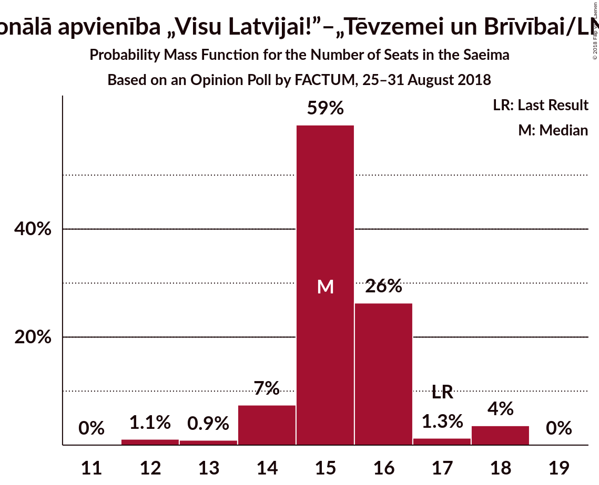
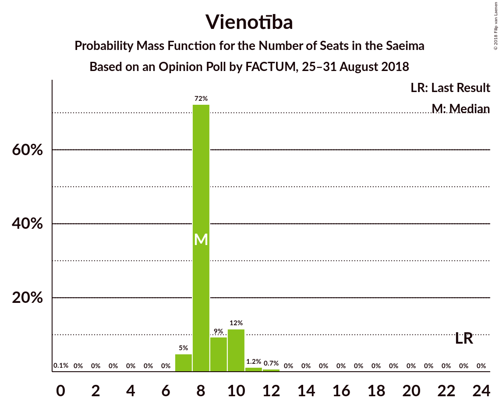

# Opinion Poll by FACTUM, 25–31 August 2018

<a href="#voting-intentions">Voting Intentions</a> | <a href="#seats">Seats</a> | <a href="#coalitions">Coalitions</a> | <a href="#technical-information">Technical Information</a>

## Voting Intentions

### Confidence Intervals

| Party | Last Result | Poll Result | 80% Confidence Interval | 90% Confidence Interval | 95% Confidence Interval | 99% Confidence Interval |
|:-----:|:-----------:|:-----------:|:-----------------------:|:-----------------------:|:-----------------------:|:-----------------------:|
| Sociāldemokrātiskā Partija “Saskaņa” | 23.0% | 22.6% | 21.3–23.9% |21.0–24.3% |20.7–24.6% |20.1–25.2% |
| Jaunā konservatīvā partija | 0.7% | 14.7% | 13.6–15.8% |13.4–16.1% |13.1–16.4% |12.6–17.0% |
| Kam pieder valsts? | 0.0% | 12.7% | 11.8–13.8% |11.5–14.1% |11.3–14.4% |10.8–14.9% |
| Nacionālā apvienība „Visu Latvijai!”–„Tēvzemei un Brīvībai/LNNK” | 16.6% | 11.8% | 10.8–12.8% |10.6–13.1% |10.3–13.4% |9.9–13.9% |
| Kustība Par! | 0.0% | 11.8% | 10.8–12.8% |10.6–13.1% |10.3–13.4% |9.9–13.9% |
| Zaļo un Zemnieku savienība | 19.5% | 9.8% | 9.0–10.8% |8.7–11.1% |8.5–11.3% |8.1–11.8% |
| Vienotība | 21.9% | 6.9% | 6.1–7.7% |5.9–7.9% |5.8–8.1% |5.4–8.6% |
| Latvijas Reģionu apvienība | 6.7% | 2.9% | 2.5–3.5% |2.3–3.7% |2.2–3.8% |2.0–4.1% |
| Latvijas Krievu savienība | 1.6% | 2.9% | 2.5–3.5% |2.3–3.7% |2.2–3.8% |2.0–4.1% |

*Note:* The poll result column reflects the actual value used in the calculations. Published results may vary slightly, and in addition be rounded to fewer digits.

## Seats

### Confidence Intervals

| Party | Last Result | Median | 80% Confidence Interval | 90% Confidence Interval | 95% Confidence Interval | 99% Confidence Interval |
|:-----:|:-----------:|:------:|:-----------------------:|:-----------------------:|:-----------------------:|:-----------------------:|
| <a href="#sociāldemokrātiskā-partija-“saskaņa”">Sociāldemokrātiskā Partija “Saskaņa”</a> | 24 | 25 | 23–26 |23–26 |22–27 |22–28 |
| <a href="#jaunā-konservatīvā-partija">Jaunā konservatīvā partija</a> | 0 | 16 | 15–17 |15–18 |15–18 |14–19 |
| <a href="#kam-pieder-valsts?">Kam pieder valsts?</a> | 0 | 14 | 13–15 |13–15 |12–15 |12–17 |
| <a href="#nacionālā-apvienība-„visu-latvijai!”–„tēvzemei-un-brīvībai/lnnk”">Nacionālā apvienība „Visu Latvijai!”–„Tēvzemei un Brīvībai/LNNK”</a> | 17 | 13 | 12–14 |12–15 |12–15 |12–15 |
| <a href="#kustība-par!">Kustība Par!</a> | 0 | 13 | 12–14 |12–15 |12–15 |11–16 |
| <a href="#zaļo-un-zemnieku-savienība">Zaļo un Zemnieku savienība</a> | 21 | 11 | 11–13 |10–14 |10–14 |9–14 |
| <a href="#vienotība">Vienotība</a> | 23 | 7 | 7–8 |7–9 |7–9 |7–10 |
| <a href="#latvijas-reģionu-apvienība">Latvijas Reģionu apvienība</a> | 8 | 0 | 0 |0 |0 |0 |
| <a href="#latvijas-krievu-savienība">Latvijas Krievu savienība</a> | 0 | 0 | 0 |0 |0 |0 |

### Sociāldemokrātiskā Partija “Saskaņa”

*For a full overview of the results for this party, see the [Sociāldemokrātiskā Partija “Saskaņa”](party-sociāldemokrātiskāpartija“saskaņa”.html) page.*

| Number of Seats | Probability | Accumulated | Special Marks |
|:---------------:|:-----------:|:-----------:|:-------------:|
| 22 | 4% | 100% |  |
| 23 | 10% | 96% |  |
| 24 | 15% | 87% | Last Result |
| 25 | 39% | 71% | Median |
| 26 | 28% | 32% |  |
| 27 | 3% | 4% |  |
| 28 | 1.1% | 1.2% |  |
| 29 | 0.1% | 0.1% |  |
| 30 | 0% | 0% |  |

### Jaunā konservatīvā partija

*For a full overview of the results for this party, see the [Jaunā konservatīvā partija](party-jaunākonservatīvāpartija.html) page.*

| Number of Seats | Probability | Accumulated | Special Marks |
|:---------------:|:-----------:|:-----------:|:-------------:|
| 0 | 0% | 100% | Last Result |
| 1 | 0% | 100% |  |
| 2 | 0% | 100% |  |
| 3 | 0% | 100% |  |
| 4 | 0% | 100% |  |
| 5 | 0% | 100% |  |
| 6 | 0% | 100% |  |
| 7 | 0% | 100% |  |
| 8 | 0% | 100% |  |
| 9 | 0% | 100% |  |
| 10 | 0% | 100% |  |
| 11 | 0% | 100% |  |
| 12 | 0% | 100% |  |
| 13 | 0.2% | 100% |  |
| 14 | 0.8% | 99.8% |  |
| 15 | 39% | 99.0% |  |
| 16 | 37% | 60% | Median |
| 17 | 15% | 23% |  |
| 18 | 6% | 8% |  |
| 19 | 2% | 2% |  |
| 20 | 0.1% | 0.1% |  |
| 21 | 0% | 0% |  |

### Kam pieder valsts?

*For a full overview of the results for this party, see the [Kam pieder valsts?](party-kampiedervalsts.html) page.*

| Number of Seats | Probability | Accumulated | Special Marks |
|:---------------:|:-----------:|:-----------:|:-------------:|
| 0 | 0% | 100% | Last Result |
| 1 | 0% | 100% |  |
| 2 | 0% | 100% |  |
| 3 | 0% | 100% |  |
| 4 | 0% | 100% |  |
| 5 | 0% | 100% |  |
| 6 | 0% | 100% |  |
| 7 | 0% | 100% |  |
| 8 | 0% | 100% |  |
| 9 | 0% | 100% |  |
| 10 | 0.1% | 100% |  |
| 11 | 0.1% | 99.9% |  |
| 12 | 2% | 99.8% |  |
| 13 | 10% | 97% |  |
| 14 | 65% | 88% | Median |
| 15 | 21% | 22% |  |
| 16 | 1.1% | 2% |  |
| 17 | 0.8% | 0.9% |  |
| 18 | 0% | 0% |  |

### Nacionālā apvienība „Visu Latvijai!”–„Tēvzemei un Brīvībai/LNNK”

*For a full overview of the results for this party, see the [Nacionālā apvienība „Visu Latvijai!”–„Tēvzemei un Brīvībai/LNNK”](party-nacionālāapvienība„visulatvijai”–„tēvzemeiunbrīvībailnnk”.html) page.*

| Number of Seats | Probability | Accumulated | Special Marks |
|:---------------:|:-----------:|:-----------:|:-------------:|
| 10 | 0.1% | 100% |  |
| 11 | 0.1% | 99.9% |  |
| 12 | 32% | 99.8% |  |
| 13 | 46% | 68% | Median |
| 14 | 16% | 22% |  |
| 15 | 5% | 6% |  |
| 16 | 0.2% | 0.2% |  |
| 17 | 0% | 0% | Last Result |

### Kustība Par!

*For a full overview of the results for this party, see the [Kustība Par!](party-kustībapar.html) page.*

| Number of Seats | Probability | Accumulated | Special Marks |
|:---------------:|:-----------:|:-----------:|:-------------:|
| 0 | 0% | 100% | Last Result |
| 1 | 0% | 100% |  |
| 2 | 0% | 100% |  |
| 3 | 0% | 100% |  |
| 4 | 0% | 100% |  |
| 5 | 0% | 100% |  |
| 6 | 0% | 100% |  |
| 7 | 0% | 100% |  |
| 8 | 0% | 100% |  |
| 9 | 0% | 100% |  |
| 10 | 0.3% | 100% |  |
| 11 | 2% | 99.7% |  |
| 12 | 24% | 98% |  |
| 13 | 43% | 74% | Median |
| 14 | 24% | 31% |  |
| 15 | 6% | 7% |  |
| 16 | 0.6% | 0.8% |  |
| 17 | 0.1% | 0.1% |  |
| 18 | 0% | 0% |  |

### Zaļo un Zemnieku savienība

*For a full overview of the results for this party, see the [Zaļo un Zemnieku savienība](party-zaļounzemniekusavienība.html) page.*

| Number of Seats | Probability | Accumulated | Special Marks |
|:---------------:|:-----------:|:-----------:|:-------------:|
| 8 | 0.1% | 100% |  |
| 9 | 0.8% | 99.9% |  |
| 10 | 9% | 99.2% |  |
| 11 | 54% | 90% | Median |
| 12 | 20% | 36% |  |
| 13 | 6% | 16% |  |
| 14 | 10% | 10% |  |
| 15 | 0.1% | 0.1% |  |
| 16 | 0% | 0% |  |
| 17 | 0% | 0% |  |
| 18 | 0% | 0% |  |
| 19 | 0% | 0% |  |
| 20 | 0% | 0% |  |
| 21 | 0% | 0% | Last Result |

### Vienotība

*For a full overview of the results for this party, see the [Vienotība](party-vienotība.html) page.*

| Number of Seats | Probability | Accumulated | Special Marks |
|:---------------:|:-----------:|:-----------:|:-------------:|
| 7 | 58% | 100% | Median |
| 8 | 37% | 42% |  |
| 9 | 5% | 5% |  |
| 10 | 0.7% | 0.7% |  |
| 11 | 0% | 0% |  |
| 12 | 0% | 0% |  |
| 13 | 0% | 0% |  |
| 14 | 0% | 0% |  |
| 15 | 0% | 0% |  |
| 16 | 0% | 0% |  |
| 17 | 0% | 0% |  |
| 18 | 0% | 0% |  |
| 19 | 0% | 0% |  |
| 20 | 0% | 0% |  |
| 21 | 0% | 0% |  |
| 22 | 0% | 0% |  |
| 23 | 0% | 0% | Last Result |

### Latvijas Reģionu apvienība

*For a full overview of the results for this party, see the [Latvijas Reģionu apvienība](party-latvijasreģionuapvienība.html) page.*

| Number of Seats | Probability | Accumulated | Special Marks |
|:---------------:|:-----------:|:-----------:|:-------------:|
| 0 | 100% | 100% | Median |
| 1 | 0% | 0% |  |
| 2 | 0% | 0% |  |
| 3 | 0% | 0% |  |
| 4 | 0% | 0% |  |
| 5 | 0% | 0% |  |
| 6 | 0% | 0% |  |
| 7 | 0% | 0% |  |
| 8 | 0% | 0% | Last Result |

### Latvijas Krievu savienība

*For a full overview of the results for this party, see the [Latvijas Krievu savienība](party-latvijaskrievusavienība.html) page.*

| Number of Seats | Probability | Accumulated | Special Marks |
|:---------------:|:-----------:|:-----------:|:-------------:|
| 0 | 100% | 100% | Last Result, Median |

## Coalitions

### Confidence Intervals

| Coalition | Last Result | Median | Majority? | 80% Confidence Interval | 90% Confidence Interval | 95% Confidence Interval | 99% Confidence Interval |
|:---------:|:-----------:|:------:|:---------:|:-----------------------:|:-----------------------:|:-----------------------:|:-----------------------:|
| Jaunā konservatīvā partija – Kustība Par! – Nacionālā apvienība „Visu Latvijai!”–„Tēvzemei un Brīvībai/LNNK” – Zaļo un Zemnieku savienība – Vienotība | 61 | 61 | 100% | 60–63 | 59–63 | 59–64 | 58–64 |
| Jaunā konservatīvā partija – Kustība Par! – Nacionālā apvienība „Visu Latvijai!”–„Tēvzemei un Brīvībai/LNNK” – Zaļo un Zemnieku savienība | 38 | 53 | 98.9% | 52–55 | 52–56 | 51–56 | 50–57 |
| Jaunā konservatīvā partija – Nacionālā apvienība „Visu Latvijai!”–„Tēvzemei un Brīvībai/LNNK” – Zaļo un Zemnieku savienība – Vienotība | 61 | 48 | 2% | 46–49 | 46–50 | 45–50 | 45–51 |
| Kustība Par! – Nacionālā apvienība „Visu Latvijai!”–„Tēvzemei un Brīvībai/LNNK” – Zaļo un Zemnieku savienība – Vienotība | 61 | 45 | 0% | 43–47 | 43–48 | 43–48 | 41–49 |
| Jaunā konservatīvā partija – Nacionālā apvienība „Visu Latvijai!”–„Tēvzemei un Brīvībai/LNNK” – Zaļo un Zemnieku savienība | 38 | 40 | 0% | 39–42 | 39–42 | 38–43 | 37–44 |
| Kustība Par! – Nacionālā apvienība „Visu Latvijai!”–„Tēvzemei un Brīvībai/LNNK” – Zaļo un Zemnieku savienība | 38 | 37 | 0% | 36–39 | 36–40 | 35–41 | 34–41 |
| Nacionālā apvienība „Visu Latvijai!”–„Tēvzemei un Brīvībai/LNNK” – Zaļo un Zemnieku savienība – Vienotība | 61 | 32 | 0% | 30–34 | 30–34 | 29–35 | 29–35 |

### Jaunā konservatīvā partija – Kustība Par! – Nacionālā apvienība „Visu Latvijai!”–„Tēvzemei un Brīvībai/LNNK” – Zaļo un Zemnieku savienība – Vienotība

| Number of Seats | Probability | Accumulated | Special Marks |
|:---------------:|:-----------:|:-----------:|:-------------:|
| 57 | 0.4% | 100% |  |
| 58 | 0.9% | 99.5% |  |
| 59 | 6% | 98.7% |  |
| 60 | 28% | 93% | Median |
| 61 | 37% | 64% | Last Result |
| 62 | 16% | 28% |  |
| 63 | 7% | 11% |  |
| 64 | 4% | 4% |  |
| 65 | 0.2% | 0.2% |  |
| 66 | 0.1% | 0.1% |  |
| 67 | 0% | 0% |  |

### Jaunā konservatīvā partija – Kustība Par! – Nacionālā apvienība „Visu Latvijai!”–„Tēvzemei un Brīvībai/LNNK” – Zaļo un Zemnieku savienība

| Number of Seats | Probability | Accumulated | Special Marks |
|:---------------:|:-----------:|:-----------:|:-------------:|
| 38 | 0% | 100% | Last Result |
| 39 | 0% | 100% |  |
| 40 | 0% | 100% |  |
| 41 | 0% | 100% |  |
| 42 | 0% | 100% |  |
| 43 | 0% | 100% |  |
| 44 | 0% | 100% |  |
| 45 | 0% | 100% |  |
| 46 | 0% | 100% |  |
| 47 | 0% | 100% |  |
| 48 | 0% | 100% |  |
| 49 | 0.1% | 100% |  |
| 50 | 1.0% | 99.9% |  |
| 51 | 2% | 98.9% | Majority |
| 52 | 19% | 97% |  |
| 53 | 32% | 79% | Median |
| 54 | 27% | 47% |  |
| 55 | 13% | 20% |  |
| 56 | 5% | 7% |  |
| 57 | 2% | 2% |  |
| 58 | 0.1% | 0.2% |  |
| 59 | 0% | 0.1% |  |
| 60 | 0% | 0% |  |

### Jaunā konservatīvā partija – Nacionālā apvienība „Visu Latvijai!”–„Tēvzemei un Brīvībai/LNNK” – Zaļo un Zemnieku savienība – Vienotība

| Number of Seats | Probability | Accumulated | Special Marks |
|:---------------:|:-----------:|:-----------:|:-------------:|
| 44 | 0.3% | 100% |  |
| 45 | 2% | 99.7% |  |
| 46 | 9% | 97% |  |
| 47 | 24% | 89% | Median |
| 48 | 38% | 65% |  |
| 49 | 19% | 27% |  |
| 50 | 6% | 8% |  |
| 51 | 1.4% | 2% | Majority |
| 52 | 0.2% | 0.3% |  |
| 53 | 0.1% | 0.1% |  |
| 54 | 0% | 0% |  |
| 55 | 0% | 0% |  |
| 56 | 0% | 0% |  |
| 57 | 0% | 0% |  |
| 58 | 0% | 0% |  |
| 59 | 0% | 0% |  |
| 60 | 0% | 0% |  |
| 61 | 0% | 0% | Last Result |

### Kustība Par! – Nacionālā apvienība „Visu Latvijai!”–„Tēvzemei un Brīvībai/LNNK” – Zaļo un Zemnieku savienība – Vienotība

| Number of Seats | Probability | Accumulated | Special Marks |
|:---------------:|:-----------:|:-----------:|:-------------:|
| 40 | 0.1% | 100% |  |
| 41 | 0.6% | 99.9% |  |
| 42 | 2% | 99.3% |  |
| 43 | 8% | 98% |  |
| 44 | 27% | 90% | Median |
| 45 | 28% | 63% |  |
| 46 | 20% | 35% |  |
| 47 | 10% | 15% |  |
| 48 | 3% | 5% |  |
| 49 | 2% | 2% |  |
| 50 | 0% | 0% |  |
| 51 | 0% | 0% | Majority |
| 52 | 0% | 0% |  |
| 53 | 0% | 0% |  |
| 54 | 0% | 0% |  |
| 55 | 0% | 0% |  |
| 56 | 0% | 0% |  |
| 57 | 0% | 0% |  |
| 58 | 0% | 0% |  |
| 59 | 0% | 0% |  |
| 60 | 0% | 0% |  |
| 61 | 0% | 0% | Last Result |

### Jaunā konservatīvā partija – Nacionālā apvienība „Visu Latvijai!”–„Tēvzemei un Brīvībai/LNNK” – Zaļo un Zemnieku savienība

| Number of Seats | Probability | Accumulated | Special Marks |
|:---------------:|:-----------:|:-----------:|:-------------:|
| 36 | 0.1% | 100% |  |
| 37 | 0.5% | 99.9% |  |
| 38 | 3% | 99.5% | Last Result |
| 39 | 18% | 96% |  |
| 40 | 36% | 79% | Median |
| 41 | 25% | 43% |  |
| 42 | 14% | 18% |  |
| 43 | 2% | 4% |  |
| 44 | 1.0% | 1.2% |  |
| 45 | 0.2% | 0.2% |  |
| 46 | 0% | 0% |  |

### Kustība Par! – Nacionālā apvienība „Visu Latvijai!”–„Tēvzemei un Brīvībai/LNNK” – Zaļo un Zemnieku savienība

| Number of Seats | Probability | Accumulated | Special Marks |
|:---------------:|:-----------:|:-----------:|:-------------:|
| 33 | 0.2% | 100% |  |
| 34 | 0.9% | 99.8% |  |
| 35 | 3% | 98.9% |  |
| 36 | 20% | 96% |  |
| 37 | 26% | 76% | Median |
| 38 | 24% | 50% | Last Result |
| 39 | 19% | 26% |  |
| 40 | 4% | 7% |  |
| 41 | 3% | 3% |  |
| 42 | 0.4% | 0.4% |  |
| 43 | 0% | 0% |  |

### Nacionālā apvienība „Visu Latvijai!”–„Tēvzemei un Brīvībai/LNNK” – Zaļo un Zemnieku savienība – Vienotība

| Number of Seats | Probability | Accumulated | Special Marks |
|:---------------:|:-----------:|:-----------:|:-------------:|
| 28 | 0.2% | 100% |  |
| 29 | 3% | 99.8% |  |
| 30 | 10% | 97% |  |
| 31 | 25% | 87% | Median |
| 32 | 27% | 62% |  |
| 33 | 25% | 35% |  |
| 34 | 7% | 10% |  |
| 35 | 4% | 4% |  |
| 36 | 0.2% | 0.2% |  |
| 37 | 0% | 0% |  |
| 38 | 0% | 0% |  |
| 39 | 0% | 0% |  |
| 40 | 0% | 0% |  |
| 41 | 0% | 0% |  |
| 42 | 0% | 0% |  |
| 43 | 0% | 0% |  |
| 44 | 0% | 0% |  |
| 45 | 0% | 0% |  |
| 46 | 0% | 0% |  |
| 47 | 0% | 0% |  |
| 48 | 0% | 0% |  |
| 49 | 0% | 0% |  |
| 50 | 0% | 0% |  |
| 51 | 0% | 0% | Majority |
| 52 | 0% | 0% |  |
| 53 | 0% | 0% |  |
| 54 | 0% | 0% |  |
| 55 | 0% | 0% |  |
| 56 | 0% | 0% |  |
| 57 | 0% | 0% |  |
| 58 | 0% | 0% |  |
| 59 | 0% | 0% |  |
| 60 | 0% | 0% |  |
| 61 | 0% | 0% | Last Result |

## Technical Information

### Opinion Poll

+ **Polling firm:** FACTUM
+ **Commissioner(s):** —
+ **Fieldwork period:** 25–31 August 2018

### Calculations

+ **Sample size:** 1750
+ **Simulations done:** 1,048,576
+ **Error estimate:** 1.87%

