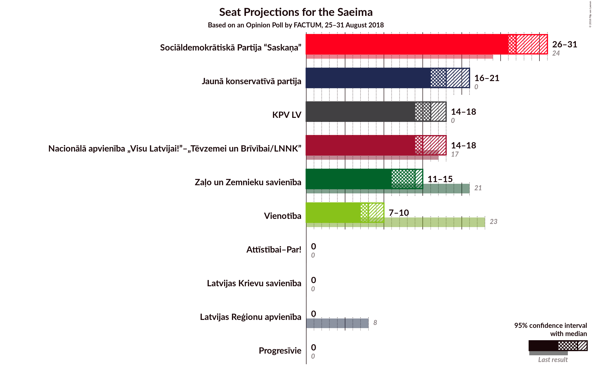

# Opinion Poll by FACTUM, 25–31 August 2018

<a href="#voting-intentions">Voting Intentions</a> | <a href="#seats">Seats</a> | <a href="#coalitions">Coalitions</a> | <a href="#technical-information">Technical Information</a>

## Voting Intentions

### Confidence Intervals

| Party | Last Result | Poll Result | 80% Confidence Interval | 90% Confidence Interval | 95% Confidence Interval | 99% Confidence Interval |
|:-----:|:-----------:|:-----------:|:-----------------------:|:-----------------------:|:-----------------------:|:-----------------------:|
| Sociāldemokrātiskā Partija “Saskaņa” | 23.0% | 22.6% | 21.3–23.9% |21.0–24.3% |20.7–24.6% |20.1–25.2% |
| Jaunā konservatīvā partija | 0.7% | 14.7% | 13.6–15.8% |13.4–16.1% |13.1–16.4% |12.6–17.0% |
| KPV LV | 0.0% | 12.7% | 11.8–13.8% |11.5–14.1% |11.3–14.4% |10.8–14.9% |
| Nacionālā apvienība „Visu Latvijai!”–„Tēvzemei un Brīvībai/LNNK” | 16.6% | 11.8% | 10.8–12.8% |10.6–13.1% |10.3–13.4% |9.9–13.9% |
| Kustība Par! | 0.0% | 11.8% | N/A |N/A |N/A |N/A |
| Zaļo un Zemnieku savienība | 19.5% | 9.8% | 9.0–10.8% |8.7–11.1% |8.5–11.3% |8.1–11.8% |
| Vienotība | 21.9% | 6.9% | 6.1–7.7% |5.9–7.9% |5.8–8.1% |5.4–8.6% |
| Latvijas Reģionu apvienība | 6.7% | 2.9% | 2.5–3.5% |2.3–3.7% |2.2–3.8% |2.0–4.1% |
| Latvijas Krievu savienība | 1.6% | 2.9% | 2.5–3.5% |2.3–3.7% |2.2–3.8% |2.0–4.1% |

*Note:* The poll result column reflects the actual value used in the calculations. Published results may vary slightly, and in addition be rounded to fewer digits.

## Seats

### Confidence Intervals

| Party | Last Result | Median | 80% Confidence Interval | 90% Confidence Interval | 95% Confidence Interval | 99% Confidence Interval |
|:-----:|:-----------:|:------:|:-----------------------:|:-----------------------:|:-----------------------:|:-----------------------:|
| <a href="#sociāldemokrātiskā-partija-“saskaņa”">Sociāldemokrātiskā Partija “Saskaņa”</a> | 24 | 25 | 23–26 |23–26 |22–27 |22–28 |
| <a href="#jaunā-konservatīvā-partija">Jaunā konservatīvā partija</a> | 0 | 16 | 15–17 |15–18 |15–18 |14–19 |
| <a href="#kpv-lv">KPV LV</a> | 0 | 14 | 13–15 |13–15 |12–15 |12–17 |
| <a href="#nacionālā-apvienība-„visu-latvijai!”–„tēvzemei-un-brīvībai/lnnk”">Nacionālā apvienība „Visu Latvijai!”–„Tēvzemei un Brīvībai/LNNK”</a> | 17 | 13 | 12–14 |12–15 |12–15 |12–15 |
| <a href="#kustība-par!">Kustība Par!</a> | 0 | N/A | N/A |N/A |N/A |N/A |
| <a href="#zaļo-un-zemnieku-savienība">Zaļo un Zemnieku savienība</a> | 21 | 11 | 11–13 |10–14 |10–14 |9–14 |
| <a href="#vienotība">Vienotība</a> | 23 | 7 | 7–8 |7–9 |7–9 |7–10 |
| <a href="#latvijas-reģionu-apvienība">Latvijas Reģionu apvienība</a> | 8 | 0 | 0 |0 |0 |0 |
| <a href="#latvijas-krievu-savienība">Latvijas Krievu savienība</a> | 0 | 0 | 0 |0 |0 |0 |

