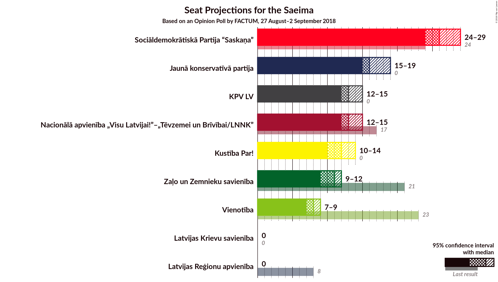
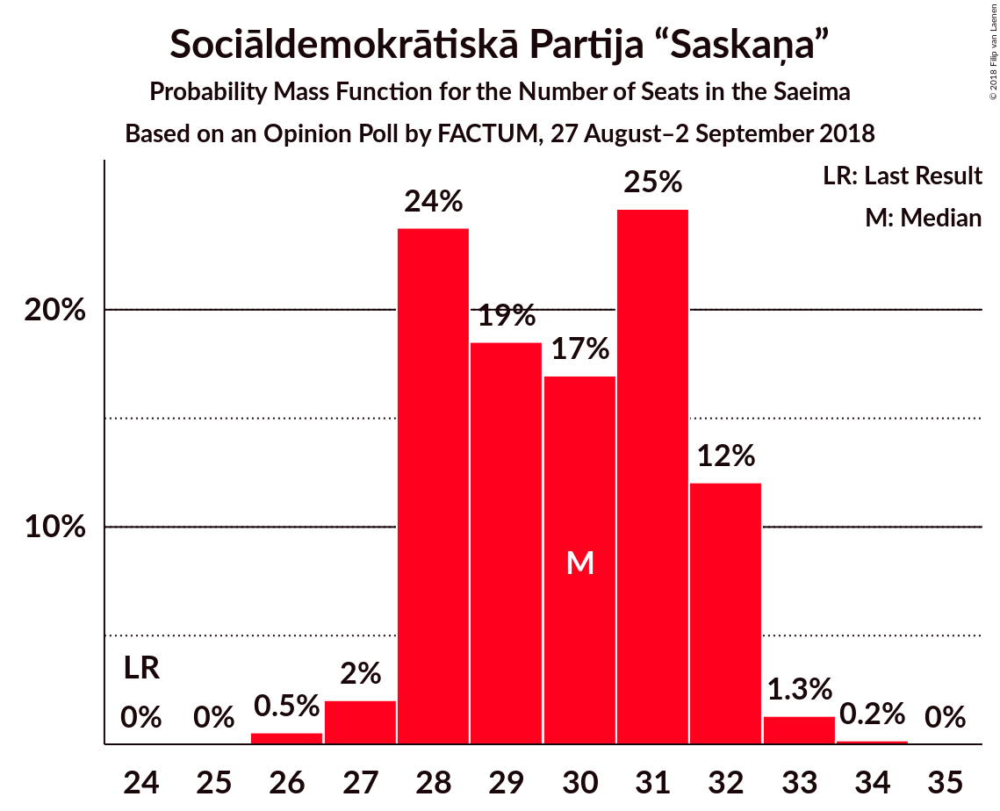
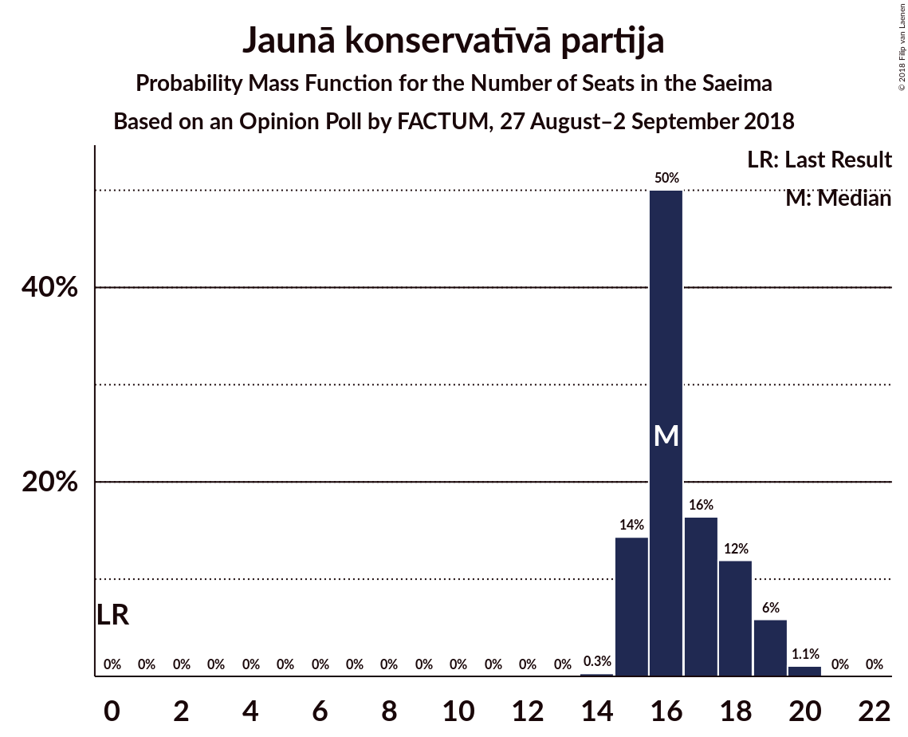
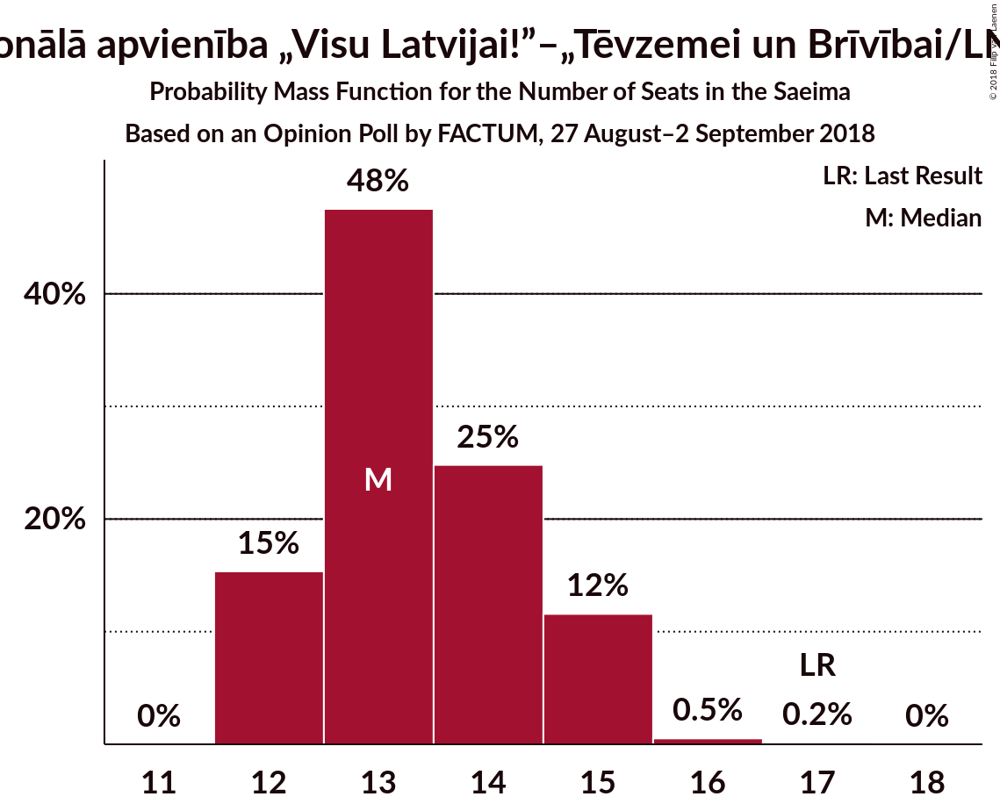
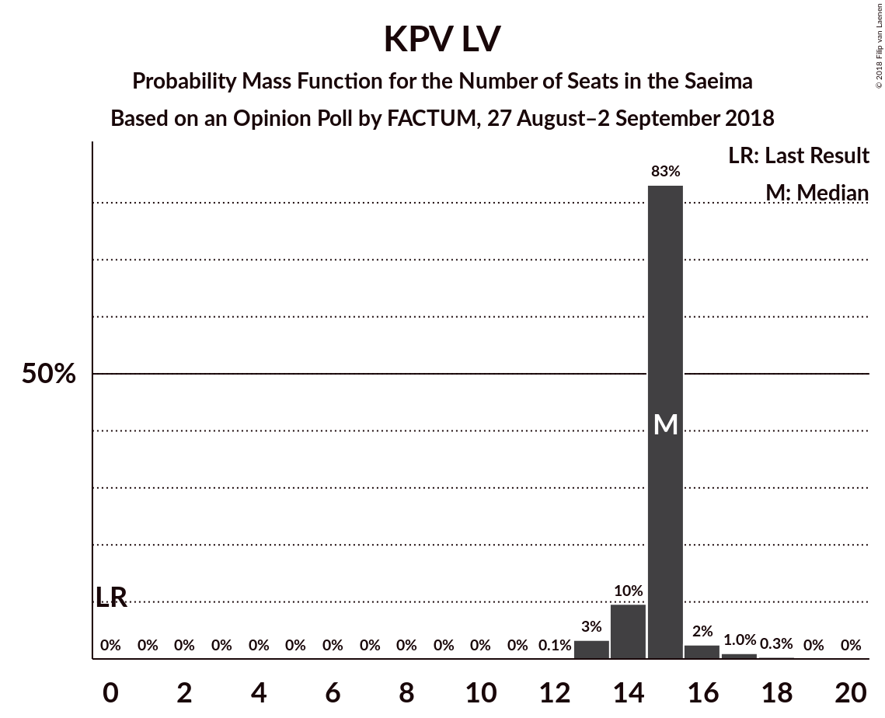
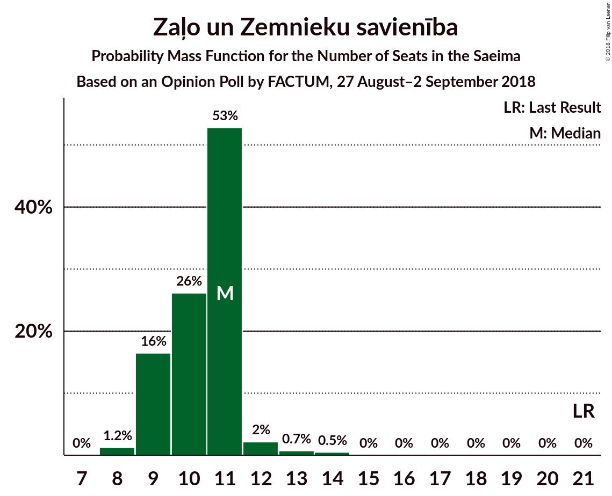
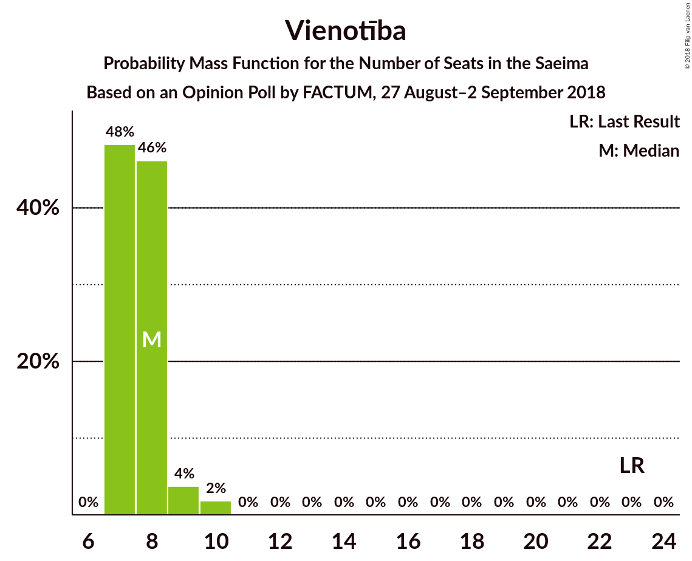
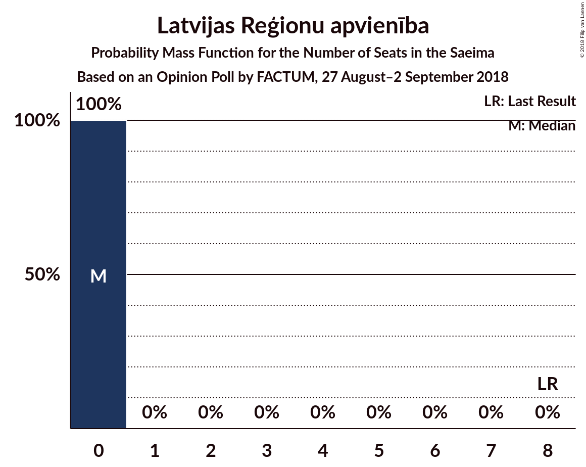
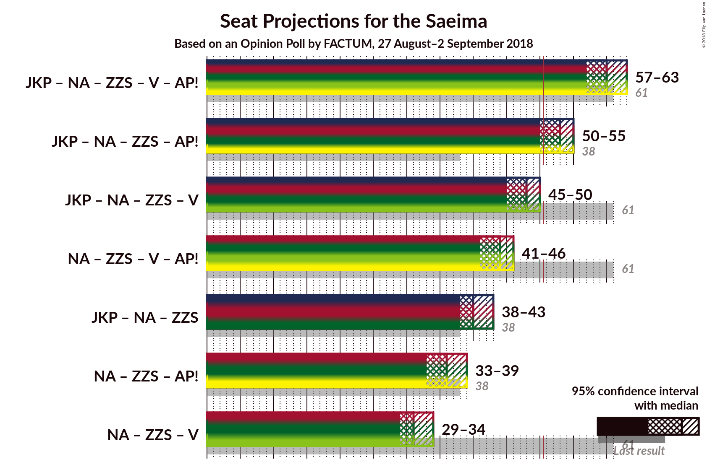

# Opinion Poll by FACTUM, 27 August–2 September 2018

<a href="#voting-intentions">Voting Intentions</a> | <a href="#seats">Seats</a> | <a href="#coalitions">Coalitions</a> | <a href="#technical-information">Technical Information</a>

## Voting Intentions

### Confidence Intervals

| Party | Last Result | Poll Result | 80% Confidence Interval | 90% Confidence Interval | 95% Confidence Interval | 99% Confidence Interval |
|:-----:|:-----------:|:-----------:|:-----------------------:|:-----------------------:|:-----------------------:|:-----------------------:|
| Sociāldemokrātiskā Partija “Saskaņa” | 23.0% | 24.0% | 22.8–25.3% |22.5–25.7% |22.2–26.0% |21.6–26.6% |
| Jaunā konservatīvā partija | 0.7% | 15.0% | 14.0–16.1% |13.7–16.4% |13.5–16.7% |13.0–17.2% |
| Nacionālā apvienība „Visu Latvijai!”–„Tēvzemei un Brīvībai/LNNK” | 16.6% | 12.0% | 11.1–13.0% |10.8–13.3% |10.6–13.5% |10.2–14.0% |
| KPV LV | 0.0% | 12.0% | 11.1–13.0% |10.8–13.3% |10.6–13.5% |10.2–14.0% |
| Kustība Par! | 0.0% | 11.0% | 10.2–12.0% |9.9–12.3% |9.7–12.5% |9.3–13.0% |
| Zaļo un Zemnieku savienība | 19.5% | 9.0% | 8.2–9.9% |8.0–10.1% |7.8–10.3% |7.4–10.8% |
| Vienotība | 21.9% | 7.0% | 6.3–7.8% |6.1–8.0% |5.9–8.2% |5.6–8.6% |
| Latvijas Reģionu apvienība | 6.7% | 3.0% | 2.5–3.5% |2.4–3.7% |2.3–3.8% |2.1–4.1% |
| Latvijas Krievu savienība | 1.6% | 2.0% | 1.6–2.5% |1.5–2.6% |1.4–2.7% |1.3–3.0% |

*Note:* The poll result column reflects the actual value used in the calculations. Published results may vary slightly, and in addition be rounded to fewer digits.

## Seats

### Confidence Intervals

| Party | Last Result | Median | 80% Confidence Interval | 90% Confidence Interval | 95% Confidence Interval | 99% Confidence Interval |
|:-----:|:-----------:|:------:|:-----------------------:|:-----------------------:|:-----------------------:|:-----------------------:|
| <a href="#sociāldemokrātiskā-partija-“saskaņa”">Sociāldemokrātiskā Partija “Saskaņa”</a> | 24 | 26 | 25–29 |25–29 |24–29 |24–29 |
| <a href="#jaunā-konservatīvā-partija">Jaunā konservatīvā partija</a> | 0 | 16 | 15–18 |15–19 |15–19 |15–20 |
| <a href="#nacionālā-apvienība-„visu-latvijai!”–„tēvzemei-un-brīvībai/lnnk”">Nacionālā apvienība „Visu Latvijai!”–„Tēvzemei un Brīvībai/LNNK”</a> | 17 | 13 | 12–15 |12–15 |12–15 |12–16 |
| <a href="#kpv-lv">KPV LV</a> | 0 | 13 | 13–14 |12–15 |12–15 |10–15 |
| <a href="#kustība-par!">Kustība Par!</a> | 0 | 12 | 11–13 |11–13 |10–14 |10–15 |
| <a href="#zaļo-un-zemnieku-savienība">Zaļo un Zemnieku savienība</a> | 21 | 11 | 9–11 |9–11 |9–12 |8–13 |
| <a href="#vienotība">Vienotība</a> | 23 | 8 | 7–8 |7–9 |7–9 |7–10 |
| <a href="#latvijas-reģionu-apvienība">Latvijas Reģionu apvienība</a> | 8 | 0 | 0 |0 |0 |0 |
| <a href="#latvijas-krievu-savienība">Latvijas Krievu savienība</a> | 0 | 0 | 0 |0 |0 |0 |

### Sociāldemokrātiskā Partija “Saskaņa”

*For a full overview of the results for this party, see the [Sociāldemokrātiskā Partija “Saskaņa”](party-sociāldemokrātiskāpartija“saskaņa”.html) page.*

| Number of Seats | Probability | Accumulated | Special Marks |
|:---------------:|:-----------:|:-----------:|:-------------:|
| 23 | 0.2% | 100% |  |
| 24 | 3% | 99.8% | Last Result |
| 25 | 11% | 97% |  |
| 26 | 44% | 86% | Median |
| 27 | 18% | 42% |  |
| 28 | 13% | 24% |  |
| 29 | 11% | 11% |  |
| 30 | 0.2% | 0.2% |  |
| 31 | 0% | 0% |  |

### Jaunā konservatīvā partija

*For a full overview of the results for this party, see the [Jaunā konservatīvā partija](party-jaunākonservatīvāpartija.html) page.*

| Number of Seats | Probability | Accumulated | Special Marks |
|:---------------:|:-----------:|:-----------:|:-------------:|
| 0 | 0% | 100% | Last Result |
| 1 | 0% | 100% |  |
| 2 | 0% | 100% |  |
| 3 | 0% | 100% |  |
| 4 | 0% | 100% |  |
| 5 | 0% | 100% |  |
| 6 | 0% | 100% |  |
| 7 | 0% | 100% |  |
| 8 | 0% | 100% |  |
| 9 | 0% | 100% |  |
| 10 | 0% | 100% |  |
| 11 | 0% | 100% |  |
| 12 | 0% | 100% |  |
| 13 | 0% | 100% |  |
| 14 | 0.3% | 100% |  |
| 15 | 14% | 99.7% |  |
| 16 | 50% | 85% | Median |
| 17 | 16% | 35% |  |
| 18 | 12% | 19% |  |
| 19 | 6% | 7% |  |
| 20 | 1.1% | 1.1% |  |
| 21 | 0% | 0% |  |

### Nacionālā apvienība „Visu Latvijai!”–„Tēvzemei un Brīvībai/LNNK”

*For a full overview of the results for this party, see the [Nacionālā apvienība „Visu Latvijai!”–„Tēvzemei un Brīvībai/LNNK”](party-nacionālāapvienība„visulatvijai”–„tēvzemeiunbrīvībailnnk”.html) page.*

| Number of Seats | Probability | Accumulated | Special Marks |
|:---------------:|:-----------:|:-----------:|:-------------:|
| 12 | 15% | 100% |  |
| 13 | 48% | 85% | Median |
| 14 | 25% | 37% |  |
| 15 | 12% | 12% |  |
| 16 | 0.5% | 0.7% |  |
| 17 | 0.2% | 0.2% | Last Result |
| 18 | 0% | 0% |  |

### KPV LV

*For a full overview of the results for this party, see the [KPV LV](party-kpvlv.html) page.*

| Number of Seats | Probability | Accumulated | Special Marks |
|:---------------:|:-----------:|:-----------:|:-------------:|
| 0 | 0% | 100% | Last Result |
| 1 | 0% | 100% |  |
| 2 | 0% | 100% |  |
| 3 | 0% | 100% |  |
| 4 | 0% | 100% |  |
| 5 | 0% | 100% |  |
| 6 | 0% | 100% |  |
| 7 | 0% | 100% |  |
| 8 | 0% | 100% |  |
| 9 | 0% | 100% |  |
| 10 | 0.5% | 100% |  |
| 11 | 1.3% | 99.5% |  |
| 12 | 8% | 98% |  |
| 13 | 46% | 91% | Median |
| 14 | 39% | 45% |  |
| 15 | 5% | 5% |  |
| 16 | 0.1% | 0.1% |  |
| 17 | 0% | 0% |  |

### Kustība Par!

*For a full overview of the results for this party, see the [Kustība Par!](party-kustībapar.html) page.*

| Number of Seats | Probability | Accumulated | Special Marks |
|:---------------:|:-----------:|:-----------:|:-------------:|
| 0 | 0% | 100% | Last Result |
| 1 | 0% | 100% |  |
| 2 | 0% | 100% |  |
| 3 | 0% | 100% |  |
| 4 | 0% | 100% |  |
| 5 | 0% | 100% |  |
| 6 | 0% | 100% |  |
| 7 | 0% | 100% |  |
| 8 | 0% | 100% |  |
| 9 | 0% | 100% |  |
| 10 | 5% | 100% |  |
| 11 | 8% | 95% |  |
| 12 | 57% | 87% | Median |
| 13 | 26% | 30% |  |
| 14 | 4% | 4% |  |
| 15 | 0.7% | 0.9% |  |
| 16 | 0.2% | 0.2% |  |
| 17 | 0% | 0% |  |

### Zaļo un Zemnieku savienība

*For a full overview of the results for this party, see the [Zaļo un Zemnieku savienība](party-zaļounzemniekusavienība.html) page.*

| Number of Seats | Probability | Accumulated | Special Marks |
|:---------------:|:-----------:|:-----------:|:-------------:|
| 8 | 1.2% | 100% |  |
| 9 | 16% | 98.8% |  |
| 10 | 26% | 82% |  |
| 11 | 53% | 56% | Median |
| 12 | 2% | 3% |  |
| 13 | 0.7% | 1.2% |  |
| 14 | 0.5% | 0.5% |  |
| 15 | 0% | 0% |  |
| 16 | 0% | 0% |  |
| 17 | 0% | 0% |  |
| 18 | 0% | 0% |  |
| 19 | 0% | 0% |  |
| 20 | 0% | 0% |  |
| 21 | 0% | 0% | Last Result |

### Vienotība

*For a full overview of the results for this party, see the [Vienotība](party-vienotība.html) page.*

| Number of Seats | Probability | Accumulated | Special Marks |
|:---------------:|:-----------:|:-----------:|:-------------:|
| 7 | 48% | 100% |  |
| 8 | 46% | 52% | Median |
| 9 | 4% | 6% |  |
| 10 | 2% | 2% |  |
| 11 | 0% | 0% |  |
| 12 | 0% | 0% |  |
| 13 | 0% | 0% |  |
| 14 | 0% | 0% |  |
| 15 | 0% | 0% |  |
| 16 | 0% | 0% |  |
| 17 | 0% | 0% |  |
| 18 | 0% | 0% |  |
| 19 | 0% | 0% |  |
| 20 | 0% | 0% |  |
| 21 | 0% | 0% |  |
| 22 | 0% | 0% |  |
| 23 | 0% | 0% | Last Result |

### Latvijas Reģionu apvienība

*For a full overview of the results for this party, see the [Latvijas Reģionu apvienība](party-latvijasreģionuapvienība.html) page.*

| Number of Seats | Probability | Accumulated | Special Marks |
|:---------------:|:-----------:|:-----------:|:-------------:|
| 0 | 100% | 100% | Median |
| 1 | 0% | 0% |  |
| 2 | 0% | 0% |  |
| 3 | 0% | 0% |  |
| 4 | 0% | 0% |  |
| 5 | 0% | 0% |  |
| 6 | 0% | 0% |  |
| 7 | 0% | 0% |  |
| 8 | 0% | 0% | Last Result |

### Latvijas Krievu savienība

*For a full overview of the results for this party, see the [Latvijas Krievu savienība](party-latvijaskrievusavienība.html) page.*

| Number of Seats | Probability | Accumulated | Special Marks |
|:---------------:|:-----------:|:-----------:|:-------------:|
| 0 | 100% | 100% | Last Result, Median |

## Coalitions

### Confidence Intervals

| Coalition | Last Result | Median | Majority? | 80% Confidence Interval | 90% Confidence Interval | 95% Confidence Interval | 99% Confidence Interval |
|:---------:|:-----------:|:------:|:---------:|:-----------------------:|:-----------------------:|:-----------------------:|:-----------------------:|
| Jaunā konservatīvā partija – Nacionālā apvienība „Visu Latvijai!”–„Tēvzemei un Brīvībai/LNNK” – Kustība Par! – Zaļo un Zemnieku savienība – Vienotība | 61 | 60 | 100% | 58–62 | 58–62 | 57–63 | 56–63 |
| Jaunā konservatīvā partija – Nacionālā apvienība „Visu Latvijai!”–„Tēvzemei un Brīvībai/LNNK” – Kustība Par! – Zaļo un Zemnieku savienība | 38 | 53 | 87% | 50–54 | 50–55 | 50–55 | 49–56 |
| Jaunā konservatīvā partija – Nacionālā apvienība „Visu Latvijai!”–„Tēvzemei un Brīvībai/LNNK” – Zaļo un Zemnieku savienība – Vienotība | 61 | 48 | 2% | 46–49 | 46–50 | 45–50 | 44–51 |
| Nacionālā apvienība „Visu Latvijai!”–„Tēvzemei un Brīvībai/LNNK” – Kustība Par! – Zaļo un Zemnieku savienība – Vienotība | 61 | 44 | 0% | 42–45 | 41–46 | 41–46 | 40–47 |
| Jaunā konservatīvā partija – Nacionālā apvienība „Visu Latvijai!”–„Tēvzemei un Brīvībai/LNNK” – Zaļo un Zemnieku savienība | 38 | 40 | 0% | 38–42 | 38–42 | 38–43 | 37–44 |
| Nacionālā apvienība „Visu Latvijai!”–„Tēvzemei un Brīvībai/LNNK” – Kustība Par! – Zaļo un Zemnieku savienība | 38 | 36 | 0% | 34–38 | 34–39 | 33–39 | 33–39 |
| Nacionālā apvienība „Visu Latvijai!”–„Tēvzemei un Brīvībai/LNNK” – Zaļo un Zemnieku savienība – Vienotība | 61 | 31 | 0% | 30–33 | 29–33 | 29–34 | 28–35 |

### Jaunā konservatīvā partija – Nacionālā apvienība „Visu Latvijai!”–„Tēvzemei un Brīvībai/LNNK” – Kustība Par! – Zaļo un Zemnieku savienība – Vienotība

| Number of Seats | Probability | Accumulated | Special Marks |
|:---------------:|:-----------:|:-----------:|:-------------:|
| 56 | 1.2% | 100% |  |
| 57 | 1.4% | 98.8% |  |
| 58 | 13% | 97% |  |
| 59 | 15% | 85% |  |
| 60 | 35% | 70% | Median |
| 61 | 24% | 35% | Last Result |
| 62 | 9% | 12% |  |
| 63 | 2% | 3% |  |
| 64 | 0.4% | 0.5% |  |
| 65 | 0.1% | 0.1% |  |
| 66 | 0% | 0% |  |

### Jaunā konservatīvā partija – Nacionālā apvienība „Visu Latvijai!”–„Tēvzemei un Brīvībai/LNNK” – Kustība Par! – Zaļo un Zemnieku savienība

| Number of Seats | Probability | Accumulated | Special Marks |
|:---------------:|:-----------:|:-----------:|:-------------:|
| 38 | 0% | 100% | Last Result |
| 39 | 0% | 100% |  |
| 40 | 0% | 100% |  |
| 41 | 0% | 100% |  |
| 42 | 0% | 100% |  |
| 43 | 0% | 100% |  |
| 44 | 0% | 100% |  |
| 45 | 0% | 100% |  |
| 46 | 0% | 100% |  |
| 47 | 0% | 100% |  |
| 48 | 0.2% | 100% |  |
| 49 | 2% | 99.8% |  |
| 50 | 11% | 98% |  |
| 51 | 12% | 87% | Majority |
| 52 | 24% | 75% | Median |
| 53 | 26% | 50% |  |
| 54 | 18% | 25% |  |
| 55 | 6% | 7% |  |
| 56 | 0.4% | 0.6% |  |
| 57 | 0.2% | 0.2% |  |
| 58 | 0% | 0% |  |

### Jaunā konservatīvā partija – Nacionālā apvienība „Visu Latvijai!”–„Tēvzemei un Brīvībai/LNNK” – Zaļo un Zemnieku savienība – Vienotība

| Number of Seats | Probability | Accumulated | Special Marks |
|:---------------:|:-----------:|:-----------:|:-------------:|
| 44 | 1.3% | 100% |  |
| 45 | 2% | 98.7% |  |
| 46 | 12% | 97% |  |
| 47 | 15% | 85% |  |
| 48 | 46% | 70% | Median |
| 49 | 17% | 24% |  |
| 50 | 5% | 7% |  |
| 51 | 1.4% | 2% | Majority |
| 52 | 0.2% | 0.2% |  |
| 53 | 0% | 0% |  |
| 54 | 0% | 0% |  |
| 55 | 0% | 0% |  |
| 56 | 0% | 0% |  |
| 57 | 0% | 0% |  |
| 58 | 0% | 0% |  |
| 59 | 0% | 0% |  |
| 60 | 0% | 0% |  |
| 61 | 0% | 0% | Last Result |

### Nacionālā apvienība „Visu Latvijai!”–„Tēvzemei un Brīvībai/LNNK” – Kustība Par! – Zaļo un Zemnieku savienība – Vienotība

| Number of Seats | Probability | Accumulated | Special Marks |
|:---------------:|:-----------:|:-----------:|:-------------:|
| 40 | 2% | 100% |  |
| 41 | 7% | 98% |  |
| 42 | 16% | 91% |  |
| 43 | 21% | 76% |  |
| 44 | 32% | 55% | Median |
| 45 | 13% | 23% |  |
| 46 | 7% | 9% |  |
| 47 | 2% | 2% |  |
| 48 | 0.2% | 0.2% |  |
| 49 | 0% | 0% |  |
| 50 | 0% | 0% |  |
| 51 | 0% | 0% | Majority |
| 52 | 0% | 0% |  |
| 53 | 0% | 0% |  |
| 54 | 0% | 0% |  |
| 55 | 0% | 0% |  |
| 56 | 0% | 0% |  |
| 57 | 0% | 0% |  |
| 58 | 0% | 0% |  |
| 59 | 0% | 0% |  |
| 60 | 0% | 0% |  |
| 61 | 0% | 0% | Last Result |

### Jaunā konservatīvā partija – Nacionālā apvienība „Visu Latvijai!”–„Tēvzemei un Brīvībai/LNNK” – Zaļo un Zemnieku savienība

| Number of Seats | Probability | Accumulated | Special Marks |
|:---------------:|:-----------:|:-----------:|:-------------:|
| 36 | 0.1% | 100% |  |
| 37 | 2% | 99.9% |  |
| 38 | 10% | 98% | Last Result |
| 39 | 13% | 87% |  |
| 40 | 28% | 74% | Median |
| 41 | 31% | 46% |  |
| 42 | 11% | 15% |  |
| 43 | 3% | 3% |  |
| 44 | 0.4% | 0.6% |  |
| 45 | 0.1% | 0.1% |  |
| 46 | 0% | 0% |  |

### Nacionālā apvienība „Visu Latvijai!”–„Tēvzemei un Brīvībai/LNNK” – Kustība Par! – Zaļo un Zemnieku savienība

| Number of Seats | Probability | Accumulated | Special Marks |
|:---------------:|:-----------:|:-----------:|:-------------:|
| 32 | 0.2% | 100% |  |
| 33 | 5% | 99.8% |  |
| 34 | 14% | 95% |  |
| 35 | 21% | 81% |  |
| 36 | 23% | 61% | Median |
| 37 | 23% | 38% |  |
| 38 | 9% | 15% | Last Result |
| 39 | 5% | 6% |  |
| 40 | 0.1% | 0.1% |  |
| 41 | 0% | 0% |  |

### Nacionālā apvienība „Visu Latvijai!”–„Tēvzemei un Brīvībai/LNNK” – Zaļo un Zemnieku savienība – Vienotība

| Number of Seats | Probability | Accumulated | Special Marks |
|:---------------:|:-----------:|:-----------:|:-------------:|
| 28 | 2% | 100% |  |
| 29 | 4% | 98% |  |
| 30 | 16% | 94% |  |
| 31 | 32% | 78% |  |
| 32 | 30% | 46% | Median |
| 33 | 12% | 16% |  |
| 34 | 3% | 4% |  |
| 35 | 0.6% | 0.7% |  |
| 36 | 0.1% | 0.1% |  |
| 37 | 0% | 0% |  |
| 38 | 0% | 0% |  |
| 39 | 0% | 0% |  |
| 40 | 0% | 0% |  |
| 41 | 0% | 0% |  |
| 42 | 0% | 0% |  |
| 43 | 0% | 0% |  |
| 44 | 0% | 0% |  |
| 45 | 0% | 0% |  |
| 46 | 0% | 0% |  |
| 47 | 0% | 0% |  |
| 48 | 0% | 0% |  |
| 49 | 0% | 0% |  |
| 50 | 0% | 0% |  |
| 51 | 0% | 0% | Majority |
| 52 | 0% | 0% |  |
| 53 | 0% | 0% |  |
| 54 | 0% | 0% |  |
| 55 | 0% | 0% |  |
| 56 | 0% | 0% |  |
| 57 | 0% | 0% |  |
| 58 | 0% | 0% |  |
| 59 | 0% | 0% |  |
| 60 | 0% | 0% |  |
| 61 | 0% | 0% | Last Result |

## Technical Information

### Opinion Poll

+ **Polling firm:** FACTUM
+ **Commissioner(s):** —
+ **Fieldwork period:** 27 August–2 September 2018

### Calculations

+ **Sample size:** 1915
+ **Simulations done:** 1,048,576
+ **Error estimate:** 1.31%

