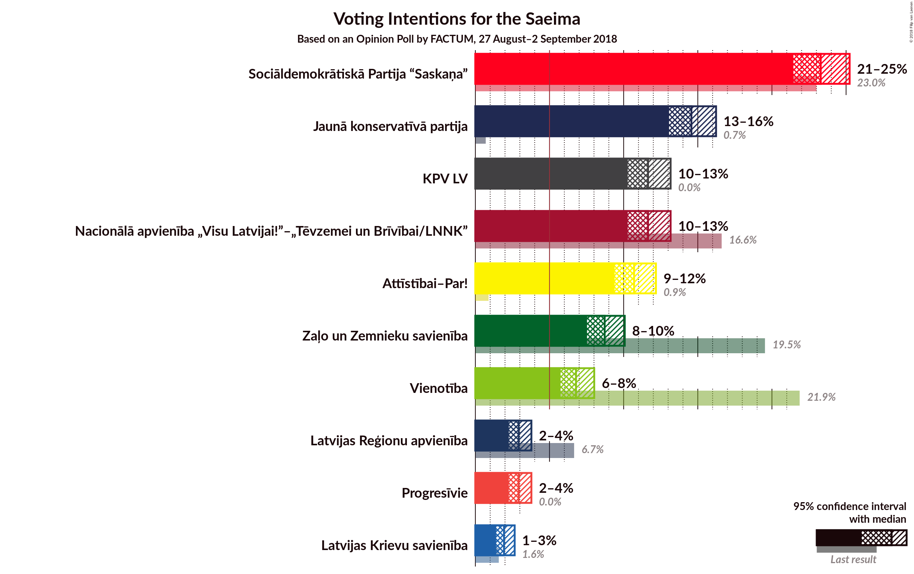

# Opinion Poll by FACTUM, 27 August–2 September 2018

<a href="#voting-intentions">Voting Intentions</a> | <a href="#seats">Seats</a> | <a href="#coalitions">Coalitions</a> | <a href="#technical-information">Technical Information</a>

## Voting Intentions

### Confidence Intervals

| Party | Last Result | Poll Result | 80% Confidence Interval | 90% Confidence Interval | 95% Confidence Interval | 99% Confidence Interval |
|:-----:|:-----------:|:-----------:|:-----------------------:|:-----------------------:|:-----------------------:|:-----------------------:|
| Sociāldemokrātiskā Partija “Saskaņa” | 23.0% | 24.0% | 22.8–25.3% |22.5–25.7% |22.2–26.0% |21.6–26.6% |
| Jaunā konservatīvā partija | 0.7% | 15.0% | 14.0–16.1% |13.7–16.4% |13.5–16.7% |13.0–17.2% |
| Nacionālā apvienība „Visu Latvijai!”–„Tēvzemei un Brīvībai/LNNK” | 16.6% | 12.0% | 11.1–13.0% |10.8–13.3% |10.6–13.5% |10.2–14.0% |
| KPV LV | 0.0% | 12.0% | 11.1–13.0% |10.8–13.3% |10.6–13.5% |10.2–14.0% |
| Kustība Par! | 0.0% | 11.0% | N/A |N/A |N/A |N/A |
| Zaļo un Zemnieku savienība | 19.5% | 9.0% | 8.2–9.9% |8.0–10.1% |7.8–10.3% |7.4–10.8% |
| Vienotība | 21.9% | 7.0% | 6.3–7.8% |6.1–8.0% |5.9–8.2% |5.6–8.6% |
| Latvijas Reģionu apvienība | 6.7% | 3.0% | 2.5–3.5% |2.4–3.7% |2.3–3.8% |2.1–4.1% |
| Latvijas Krievu savienība | 1.6% | 2.0% | 1.6–2.5% |1.5–2.6% |1.4–2.7% |1.3–3.0% |

*Note:* The poll result column reflects the actual value used in the calculations. Published results may vary slightly, and in addition be rounded to fewer digits.

## Seats

### Confidence Intervals

| Party | Last Result | Median | 80% Confidence Interval | 90% Confidence Interval | 95% Confidence Interval | 99% Confidence Interval |
|:-----:|:-----------:|:------:|:-----------------------:|:-----------------------:|:-----------------------:|:-----------------------:|
| <a href="#sociāldemokrātiskā-partija-“saskaņa”">Sociāldemokrātiskā Partija “Saskaņa”</a> | 24 | 26 | 25–29 |25–29 |24–29 |24–29 |
| <a href="#jaunā-konservatīvā-partija">Jaunā konservatīvā partija</a> | 0 | 16 | 15–18 |15–19 |15–19 |15–20 |
| <a href="#nacionālā-apvienība-„visu-latvijai!”–„tēvzemei-un-brīvībai/lnnk”">Nacionālā apvienība „Visu Latvijai!”–„Tēvzemei un Brīvībai/LNNK”</a> | 17 | 13 | 12–15 |12–15 |12–15 |12–16 |
| <a href="#kpv-lv">KPV LV</a> | 0 | 13 | 13–14 |12–15 |12–15 |10–15 |
| <a href="#kustība-par!">Kustība Par!</a> | 0 | N/A | N/A |N/A |N/A |N/A |
| <a href="#zaļo-un-zemnieku-savienība">Zaļo un Zemnieku savienība</a> | 21 | 11 | 9–11 |9–11 |9–12 |8–13 |
| <a href="#vienotība">Vienotība</a> | 23 | 8 | 7–8 |7–9 |7–9 |7–10 |
| <a href="#latvijas-reģionu-apvienība">Latvijas Reģionu apvienība</a> | 8 | 0 | 0 |0 |0 |0 |
| <a href="#latvijas-krievu-savienība">Latvijas Krievu savienība</a> | 0 | 0 | 0 |0 |0 |0 |

