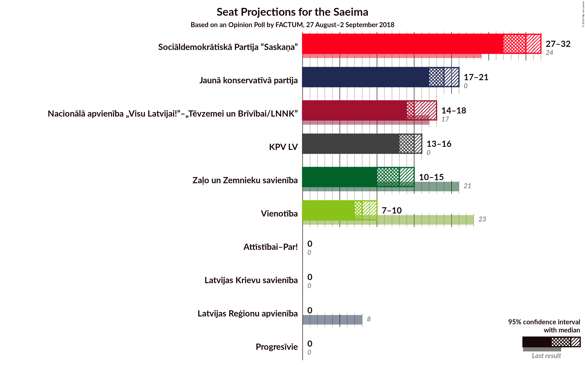
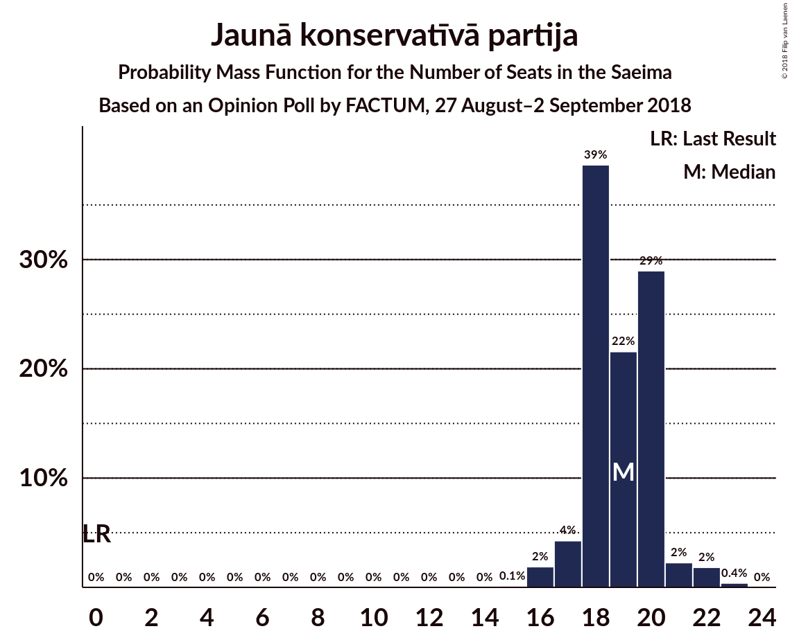
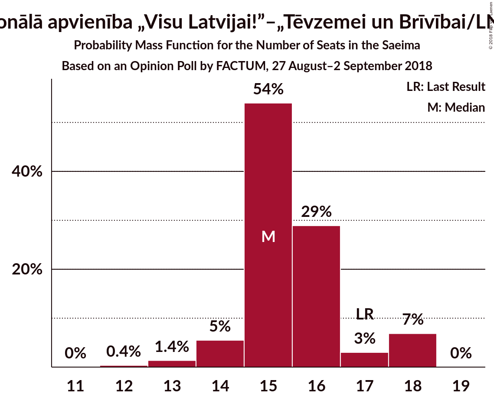
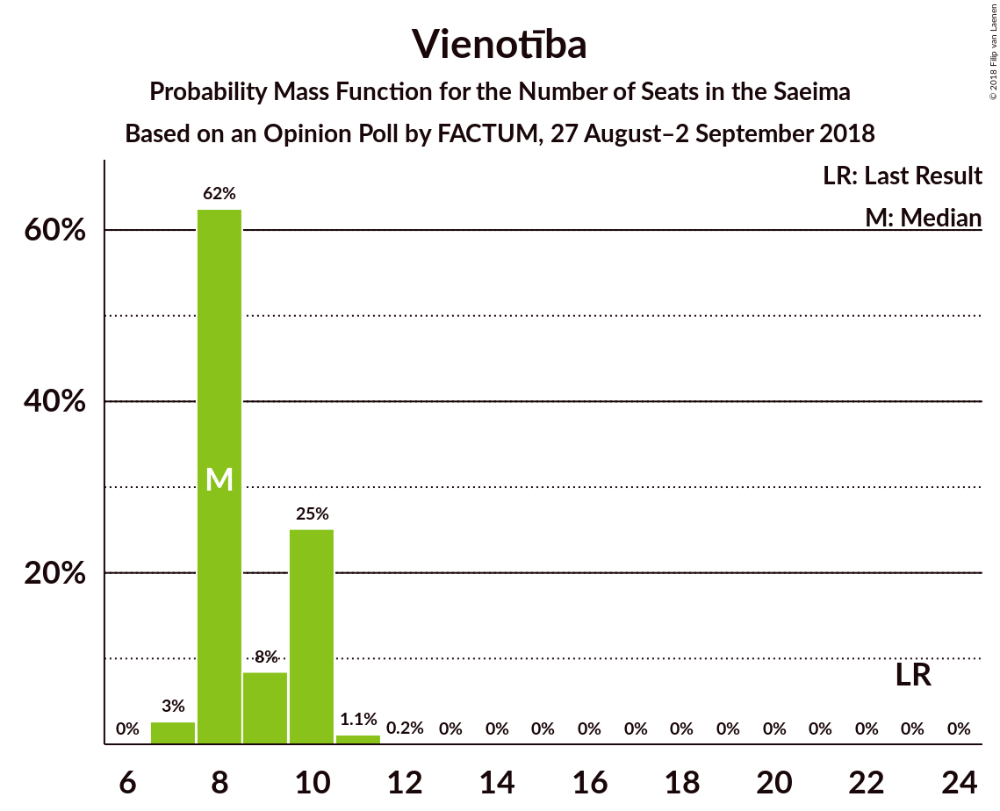
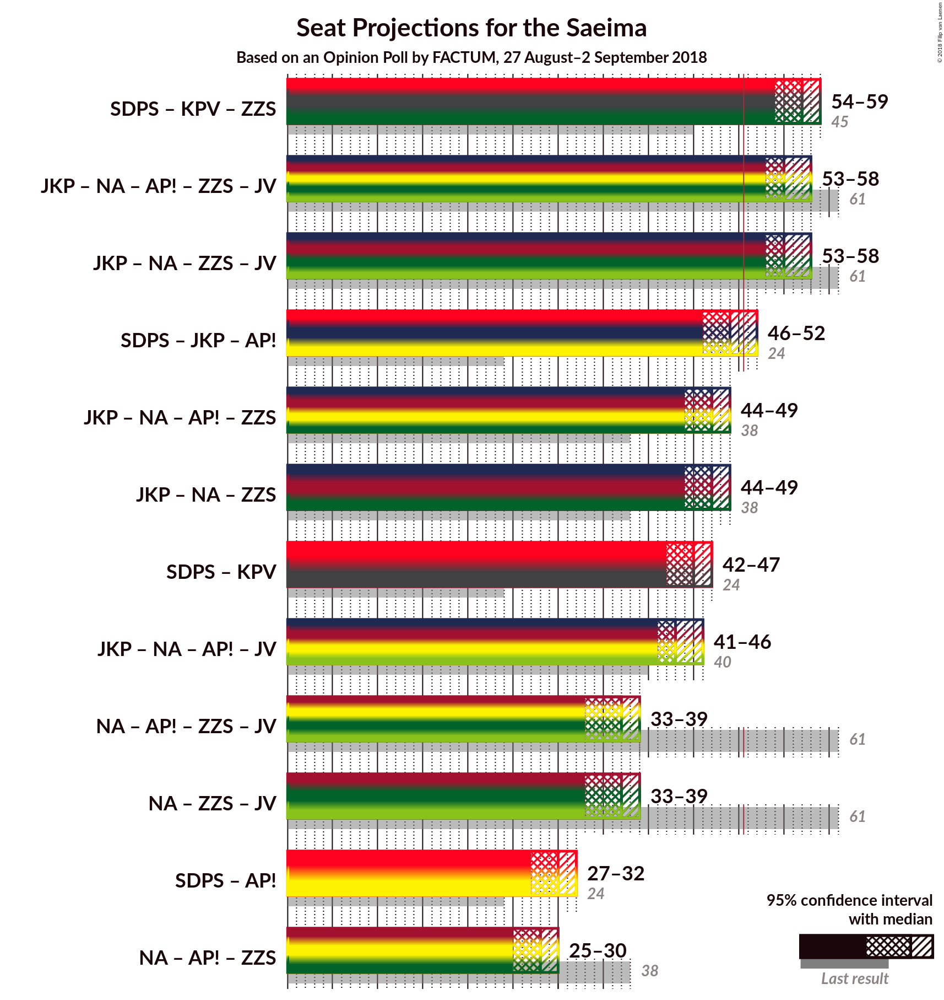

# Opinion Poll by FACTUM, 27 August–2 September 2018

<a href="#voting-intentions">Voting Intentions</a> | <a href="#seats">Seats</a> | <a href="#coalitions">Coalitions</a> | <a href="#technical-information">Technical Information</a>

## Voting Intentions

### Confidence Intervals

| Party | Last Result | Poll Result | 80% Confidence Interval | 90% Confidence Interval | 95% Confidence Interval | 99% Confidence Interval |
|:-----:|:-----------:|:-----------:|:-----------------------:|:-----------------------:|:-----------------------:|:-----------------------:|
| Sociāldemokrātiskā Partija “Saskaņa” | 23.0% | 23.3% | 22.1–24.6% |21.7–24.9% |21.4–25.2% |20.9–25.9% |
| Jaunā konservatīvā partija | 0.7% | 14.6% | 13.6–15.7% |13.3–16.0% |13.1–16.2% |12.6–16.8% |
| Nacionālā apvienība „Visu Latvijai!”–„Tēvzemei un Brīvībai/LNNK” | 16.6% | 11.6% | 10.7–12.6% |10.5–12.9% |10.3–13.2% |9.9–13.7% |
| KPV LV | 0.0% | 11.6% | 10.7–12.6% |10.5–12.9% |10.3–13.2% |9.9–13.7% |
| Attīstībai–Par! | 0.9% | 10.7% | 9.8–11.7% |9.6–11.9% |9.4–12.2% |9.0–12.7% |
| Zaļo un Zemnieku savienība | 19.5% | 8.7% | 7.9–9.6% |7.7–9.9% |7.5–10.1% |7.2–10.5% |
| Vienotība | 21.9% | 6.8% | 6.1–7.6% |5.9–7.8% |5.7–8.0% |5.4–8.4% |
| Latvijas Reģionu apvienība | 6.7% | 2.9% | 2.5–3.5% |2.4–3.6% |2.3–3.8% |2.1–4.1% |
| Progresīvie | 0.0% | 2.9% | 2.5–3.5% |2.4–3.6% |2.3–3.8% |2.1–4.1% |
| Latvijas Krievu savienība | 1.6% | 1.9% | 1.6–2.4% |1.5–2.5% |1.4–2.7% |1.2–2.9% |

*Note:* The poll result column reflects the actual value used in the calculations. Published results may vary slightly, and in addition be rounded to fewer digits.

## Seats

### Confidence Intervals

| Party | Last Result | Median | 80% Confidence Interval | 90% Confidence Interval | 95% Confidence Interval | 99% Confidence Interval |
|:-----:|:-----------:|:------:|:-----------------------:|:-----------------------:|:-----------------------:|:-----------------------:|
| <a href="#sociāldemokrātiskā-partija-“saskaņa”">Sociāldemokrātiskā Partija “Saskaņa”</a> | 24 | 30 | 28–32 |28–32 |27–32 |26–33 |
| <a href="#jaunā-konservatīvā-partija">Jaunā konservatīvā partija</a> | 0 | 19 | 18–20 |17–20 |17–21 |16–22 |
| <a href="#nacionālā-apvienība-„visu-latvijai!”–„tēvzemei-un-brīvībai/lnnk”">Nacionālā apvienība „Visu Latvijai!”–„Tēvzemei un Brīvībai/LNNK”</a> | 17 | 15 | 15–16 |14–18 |14–18 |13–18 |
| <a href="#kpv-lv">KPV LV</a> | 0 | 15 | 14–15 |14–15 |13–16 |13–17 |
| <a href="#attīstībai–par!">Attīstībai–Par!</a> | 0 | 0 | 0 |0 |0 |0 |
| <a href="#zaļo-un-zemnieku-savienība">Zaļo un Zemnieku savienība</a> | 21 | 13 | 11–14 |10–15 |10–15 |9–15 |
| <a href="#vienotība">Vienotība</a> | 23 | 8 | 8–10 |8–10 |7–10 |7–11 |
| <a href="#latvijas-reģionu-apvienība">Latvijas Reģionu apvienība</a> | 8 | 0 | 0 |0 |0 |0 |
| <a href="#progresīvie">Progresīvie</a> | 0 | 0 | 0 |0 |0 |0 |
| <a href="#latvijas-krievu-savienība">Latvijas Krievu savienība</a> | 0 | 0 | 0 |0 |0 |0 |

### Sociāldemokrātiskā Partija “Saskaņa”

*For a full overview of the results for this party, see the [Sociāldemokrātiskā Partija “Saskaņa”](party-sociāldemokrātiskāpartija“saskaņa”.html) page.*

| Number of Seats | Probability | Accumulated | Special Marks |
|:---------------:|:-----------:|:-----------:|:-------------:|
| 24 | 0% | 100% | Last Result |
| 25 | 0% | 100% |  |
| 26 | 0.5% | 100% |  |
| 27 | 2% | 99.5% |  |
| 28 | 24% | 97% |  |
| 29 | 19% | 74% |  |
| 30 | 17% | 55% | Median |
| 31 | 25% | 38% |  |
| 32 | 12% | 14% |  |
| 33 | 1.3% | 1.5% |  |
| 34 | 0.2% | 0.2% |  |
| 35 | 0% | 0% |  |

### Jaunā konservatīvā partija

*For a full overview of the results for this party, see the [Jaunā konservatīvā partija](party-jaunākonservatīvāpartija.html) page.*

| Number of Seats | Probability | Accumulated | Special Marks |
|:---------------:|:-----------:|:-----------:|:-------------:|
| 0 | 0% | 100% | Last Result |
| 1 | 0% | 100% |  |
| 2 | 0% | 100% |  |
| 3 | 0% | 100% |  |
| 4 | 0% | 100% |  |
| 5 | 0% | 100% |  |
| 6 | 0% | 100% |  |
| 7 | 0% | 100% |  |
| 8 | 0% | 100% |  |
| 9 | 0% | 100% |  |
| 10 | 0% | 100% |  |
| 11 | 0% | 100% |  |
| 12 | 0% | 100% |  |
| 13 | 0% | 100% |  |
| 14 | 0% | 100% |  |
| 15 | 0.1% | 100% |  |
| 16 | 2% | 99.9% |  |
| 17 | 4% | 98% |  |
| 18 | 39% | 94% |  |
| 19 | 22% | 55% | Median |
| 20 | 29% | 33% |  |
| 21 | 2% | 4% |  |
| 22 | 2% | 2% |  |
| 23 | 0.4% | 0.4% |  |
| 24 | 0% | 0% |  |

### Nacionālā apvienība „Visu Latvijai!”–„Tēvzemei un Brīvībai/LNNK”

*For a full overview of the results for this party, see the [Nacionālā apvienība „Visu Latvijai!”–„Tēvzemei un Brīvībai/LNNK”](party-nacionālāapvienība„visulatvijai”–„tēvzemeiunbrīvībailnnk”.html) page.*

| Number of Seats | Probability | Accumulated | Special Marks |
|:---------------:|:-----------:|:-----------:|:-------------:|
| 12 | 0.4% | 100% |  |
| 13 | 1.4% | 99.6% |  |
| 14 | 5% | 98% |  |
| 15 | 54% | 93% | Median |
| 16 | 29% | 39% |  |
| 17 | 3% | 10% | Last Result |
| 18 | 7% | 7% |  |
| 19 | 0% | 0% |  |

### KPV LV

*For a full overview of the results for this party, see the [KPV LV](party-kpvlv.html) page.*

| Number of Seats | Probability | Accumulated | Special Marks |
|:---------------:|:-----------:|:-----------:|:-------------:|
| 0 | 0% | 100% | Last Result |
| 1 | 0% | 100% |  |
| 2 | 0% | 100% |  |
| 3 | 0% | 100% |  |
| 4 | 0% | 100% |  |
| 5 | 0% | 100% |  |
| 6 | 0% | 100% |  |
| 7 | 0% | 100% |  |
| 8 | 0% | 100% |  |
| 9 | 0% | 100% |  |
| 10 | 0% | 100% |  |
| 11 | 0% | 100% |  |
| 12 | 0.1% | 100% |  |
| 13 | 3% | 99.9% |  |
| 14 | 10% | 97% |  |
| 15 | 83% | 87% | Median |
| 16 | 2% | 4% |  |
| 17 | 1.0% | 1.3% |  |
| 18 | 0.3% | 0.4% |  |
| 19 | 0% | 0% |  |

### Attīstībai–Par!

*For a full overview of the results for this party, see the [Attīstībai–Par!](party-attīstībai–par.html) page.*

| Number of Seats | Probability | Accumulated | Special Marks |
|:---------------:|:-----------:|:-----------:|:-------------:|
| 0 | 100% | 100% | Last Result, Median |

### Zaļo un Zemnieku savienība

*For a full overview of the results for this party, see the [Zaļo un Zemnieku savienība](party-zaļounzemniekusavienība.html) page.*

| Number of Seats | Probability | Accumulated | Special Marks |
|:---------------:|:-----------:|:-----------:|:-------------:|
| 9 | 1.4% | 100% |  |
| 10 | 8% | 98.6% |  |
| 11 | 22% | 90% |  |
| 12 | 17% | 69% |  |
| 13 | 27% | 51% | Median |
| 14 | 19% | 24% |  |
| 15 | 5% | 5% |  |
| 16 | 0% | 0% |  |
| 17 | 0% | 0% |  |
| 18 | 0% | 0% |  |
| 19 | 0% | 0% |  |
| 20 | 0% | 0% |  |
| 21 | 0% | 0% | Last Result |

### Vienotība

*For a full overview of the results for this party, see the [Vienotība](party-vienotība.html) page.*

| Number of Seats | Probability | Accumulated | Special Marks |
|:---------------:|:-----------:|:-----------:|:-------------:|
| 7 | 3% | 100% |  |
| 8 | 62% | 97% | Median |
| 9 | 8% | 35% |  |
| 10 | 25% | 26% |  |
| 11 | 1.1% | 1.3% |  |
| 12 | 0.2% | 0.2% |  |
| 13 | 0% | 0% |  |
| 14 | 0% | 0% |  |
| 15 | 0% | 0% |  |
| 16 | 0% | 0% |  |
| 17 | 0% | 0% |  |
| 18 | 0% | 0% |  |
| 19 | 0% | 0% |  |
| 20 | 0% | 0% |  |
| 21 | 0% | 0% |  |
| 22 | 0% | 0% |  |
| 23 | 0% | 0% | Last Result |

### Latvijas Reģionu apvienība

*For a full overview of the results for this party, see the [Latvijas Reģionu apvienība](party-latvijasreģionuapvienība.html) page.*

| Number of Seats | Probability | Accumulated | Special Marks |
|:---------------:|:-----------:|:-----------:|:-------------:|
| 0 | 100% | 100% | Median |
| 1 | 0% | 0% |  |
| 2 | 0% | 0% |  |
| 3 | 0% | 0% |  |
| 4 | 0% | 0% |  |
| 5 | 0% | 0% |  |
| 6 | 0% | 0% |  |
| 7 | 0% | 0% |  |
| 8 | 0% | 0% | Last Result |

### Progresīvie

*For a full overview of the results for this party, see the [Progresīvie](party-progresīvie.html) page.*

| Number of Seats | Probability | Accumulated | Special Marks |
|:---------------:|:-----------:|:-----------:|:-------------:|
| 0 | 100% | 100% | Last Result, Median |

### Latvijas Krievu savienība

*For a full overview of the results for this party, see the [Latvijas Krievu savienība](party-latvijaskrievusavienība.html) page.*

| Number of Seats | Probability | Accumulated | Special Marks |
|:---------------:|:-----------:|:-----------:|:-------------:|
| 0 | 100% | 100% | Last Result, Median |

## Coalitions

### Confidence Intervals

| Coalition | Last Result | Median | Majority? | 80% Confidence Interval | 90% Confidence Interval | 95% Confidence Interval | 99% Confidence Interval |
|:---------:|:-----------:|:------:|:---------:|:-----------------------:|:-----------------------:|:-----------------------:|:-----------------------:|
| Sociāldemokrātiskā Partija “Saskaņa” – KPV LV – Zaļo un Zemnieku savienība | 45 | 57 | 100% | 55–58 | 54–59 | 54–59 | 52–61 |
| Jaunā konservatīvā partija – Nacionālā apvienība „Visu Latvijai!”–„Tēvzemei un Brīvībai/LNNK” – Attīstībai–Par! – Zaļo un Zemnieku savienība – Vienotība | 61 | 55 | 100% | 53–57 | 53–57 | 53–58 | 52–59 |
| Jaunā konservatīvā partija – Nacionālā apvienība „Visu Latvijai!”–„Tēvzemei un Brīvībai/LNNK” – Zaļo un Zemnieku savienība – Vienotība | 61 | 55 | 100% | 53–57 | 53–57 | 53–58 | 52–59 |
| Sociāldemokrātiskā Partija “Saskaņa” – Jaunā konservatīvā partija – Attīstībai–Par! | 24 | 49 | 8% | 47–50 | 47–51 | 46–52 | 45–54 |
| Jaunā konservatīvā partija – Nacionālā apvienība „Visu Latvijai!”–„Tēvzemei un Brīvībai/LNNK” – Attīstībai–Par! – Zaļo un Zemnieku savienība | 38 | 47 | 0.2% | 45–49 | 45–49 | 44–49 | 43–50 |
| Jaunā konservatīvā partija – Nacionālā apvienība „Visu Latvijai!”–„Tēvzemei un Brīvībai/LNNK” – Zaļo un Zemnieku savienība | 38 | 47 | 0.2% | 45–49 | 45–49 | 44–49 | 43–50 |
| Sociāldemokrātiskā Partija “Saskaņa” – KPV LV | 24 | 45 | 0% | 43–47 | 43–47 | 42–47 | 41–48 |
| Jaunā konservatīvā partija – Nacionālā apvienība „Visu Latvijai!”–„Tēvzemei un Brīvībai/LNNK” – Attīstībai–Par! – Vienotība | 40 | 43 | 0% | 42–45 | 41–46 | 41–46 | 39–48 |
| Nacionālā apvienība „Visu Latvijai!”–„Tēvzemei un Brīvībai/LNNK” – Attīstībai–Par! – Zaļo un Zemnieku savienība – Vienotība | 61 | 37 | 0% | 35–38 | 34–39 | 33–39 | 33–40 |
| Nacionālā apvienība „Visu Latvijai!”–„Tēvzemei un Brīvībai/LNNK” – Zaļo un Zemnieku savienība – Vienotība | 61 | 37 | 0% | 35–38 | 34–39 | 33–39 | 33–40 |
| Sociāldemokrātiskā Partija “Saskaņa” – Attīstībai–Par! | 24 | 30 | 0% | 28–32 | 28–32 | 27–32 | 26–33 |
| Nacionālā apvienība „Visu Latvijai!”–„Tēvzemei un Brīvībai/LNNK” – Attīstībai–Par! – Zaļo un Zemnieku savienība | 38 | 28 | 0% | 26–30 | 25–30 | 25–30 | 25–31 |

### Sociāldemokrātiskā Partija “Saskaņa” – KPV LV – Zaļo un Zemnieku savienība

| Number of Seats | Probability | Accumulated | Special Marks |
|:---------------:|:-----------:|:-----------:|:-------------:|
| 45 | 0% | 100% | Last Result |
| 46 | 0% | 100% |  |
| 47 | 0% | 100% |  |
| 48 | 0% | 100% |  |
| 49 | 0% | 100% |  |
| 50 | 0% | 100% |  |
| 51 | 0% | 100% | Majority |
| 52 | 0.6% | 100% |  |
| 53 | 2% | 99.4% |  |
| 54 | 3% | 98% |  |
| 55 | 8% | 94% |  |
| 56 | 14% | 87% |  |
| 57 | 30% | 73% |  |
| 58 | 33% | 43% | Median |
| 59 | 7% | 10% |  |
| 60 | 2% | 2% |  |
| 61 | 0.5% | 0.7% |  |
| 62 | 0.2% | 0.2% |  |
| 63 | 0% | 0% |  |

### Jaunā konservatīvā partija – Nacionālā apvienība „Visu Latvijai!”–„Tēvzemei un Brīvībai/LNNK” – Attīstībai–Par! – Zaļo un Zemnieku savienība – Vienotība

| Number of Seats | Probability | Accumulated | Special Marks |
|:---------------:|:-----------:|:-----------:|:-------------:|
| 51 | 0.2% | 100% | Majority |
| 52 | 1.0% | 99.8% |  |
| 53 | 12% | 98.8% |  |
| 54 | 20% | 87% |  |
| 55 | 21% | 67% | Median |
| 56 | 19% | 47% |  |
| 57 | 25% | 28% |  |
| 58 | 2% | 3% |  |
| 59 | 1.2% | 1.2% |  |
| 60 | 0.1% | 0.1% |  |
| 61 | 0% | 0% | Last Result |

### Jaunā konservatīvā partija – Nacionālā apvienība „Visu Latvijai!”–„Tēvzemei un Brīvībai/LNNK” – Zaļo un Zemnieku savienība – Vienotība

| Number of Seats | Probability | Accumulated | Special Marks |
|:---------------:|:-----------:|:-----------:|:-------------:|
| 51 | 0.2% | 100% | Majority |
| 52 | 1.0% | 99.8% |  |
| 53 | 12% | 98.8% |  |
| 54 | 20% | 87% |  |
| 55 | 21% | 67% | Median |
| 56 | 19% | 47% |  |
| 57 | 25% | 28% |  |
| 58 | 2% | 3% |  |
| 59 | 1.2% | 1.2% |  |
| 60 | 0.1% | 0.1% |  |
| 61 | 0% | 0% | Last Result |

### Sociāldemokrātiskā Partija “Saskaņa” – Jaunā konservatīvā partija – Attīstībai–Par!

| Number of Seats | Probability | Accumulated | Special Marks |
|:---------------:|:-----------:|:-----------:|:-------------:|
| 24 | 0% | 100% | Last Result |
| 25 | 0% | 100% |  |
| 26 | 0% | 100% |  |
| 27 | 0% | 100% |  |
| 28 | 0% | 100% |  |
| 29 | 0% | 100% |  |
| 30 | 0% | 100% |  |
| 31 | 0% | 100% |  |
| 32 | 0% | 100% |  |
| 33 | 0% | 100% |  |
| 34 | 0% | 100% |  |
| 35 | 0% | 100% |  |
| 36 | 0% | 100% |  |
| 37 | 0% | 100% |  |
| 38 | 0% | 100% |  |
| 39 | 0% | 100% |  |
| 40 | 0% | 100% |  |
| 41 | 0% | 100% |  |
| 42 | 0% | 100% |  |
| 43 | 0% | 100% |  |
| 44 | 0.1% | 100% |  |
| 45 | 0.5% | 99.9% |  |
| 46 | 2% | 99.3% |  |
| 47 | 18% | 97% |  |
| 48 | 28% | 79% |  |
| 49 | 24% | 51% | Median |
| 50 | 20% | 27% |  |
| 51 | 5% | 8% | Majority |
| 52 | 2% | 3% |  |
| 53 | 0.2% | 0.8% |  |
| 54 | 0.6% | 0.6% |  |
| 55 | 0% | 0% |  |

### Jaunā konservatīvā partija – Nacionālā apvienība „Visu Latvijai!”–„Tēvzemei un Brīvībai/LNNK” – Attīstībai–Par! – Zaļo un Zemnieku savienība

| Number of Seats | Probability | Accumulated | Special Marks |
|:---------------:|:-----------:|:-----------:|:-------------:|
| 38 | 0% | 100% | Last Result |
| 39 | 0% | 100% |  |
| 40 | 0% | 100% |  |
| 41 | 0% | 100% |  |
| 42 | 0.1% | 100% |  |
| 43 | 0.8% | 99.8% |  |
| 44 | 4% | 99.0% |  |
| 45 | 21% | 95% |  |
| 46 | 24% | 75% |  |
| 47 | 21% | 51% | Median |
| 48 | 9% | 30% |  |
| 49 | 20% | 21% |  |
| 50 | 1.2% | 1.4% |  |
| 51 | 0.1% | 0.2% | Majority |
| 52 | 0% | 0.1% |  |
| 53 | 0% | 0% |  |

### Jaunā konservatīvā partija – Nacionālā apvienība „Visu Latvijai!”–„Tēvzemei un Brīvībai/LNNK” – Zaļo un Zemnieku savienība

| Number of Seats | Probability | Accumulated | Special Marks |
|:---------------:|:-----------:|:-----------:|:-------------:|
| 38 | 0% | 100% | Last Result |
| 39 | 0% | 100% |  |
| 40 | 0% | 100% |  |
| 41 | 0% | 100% |  |
| 42 | 0.1% | 100% |  |
| 43 | 0.8% | 99.8% |  |
| 44 | 4% | 99.0% |  |
| 45 | 21% | 95% |  |
| 46 | 24% | 75% |  |
| 47 | 21% | 51% | Median |
| 48 | 9% | 30% |  |
| 49 | 20% | 21% |  |
| 50 | 1.2% | 1.4% |  |
| 51 | 0.1% | 0.2% | Majority |
| 52 | 0% | 0.1% |  |
| 53 | 0% | 0% |  |

### Sociāldemokrātiskā Partija “Saskaņa” – KPV LV

| Number of Seats | Probability | Accumulated | Special Marks |
|:---------------:|:-----------:|:-----------:|:-------------:|
| 24 | 0% | 100% | Last Result |
| 25 | 0% | 100% |  |
| 26 | 0% | 100% |  |
| 27 | 0% | 100% |  |
| 28 | 0% | 100% |  |
| 29 | 0% | 100% |  |
| 30 | 0% | 100% |  |
| 31 | 0% | 100% |  |
| 32 | 0% | 100% |  |
| 33 | 0% | 100% |  |
| 34 | 0% | 100% |  |
| 35 | 0% | 100% |  |
| 36 | 0% | 100% |  |
| 37 | 0% | 100% |  |
| 38 | 0% | 100% |  |
| 39 | 0% | 100% |  |
| 40 | 0.1% | 100% |  |
| 41 | 1.2% | 99.9% |  |
| 42 | 2% | 98.8% |  |
| 43 | 25% | 97% |  |
| 44 | 19% | 72% |  |
| 45 | 21% | 53% | Median |
| 46 | 20% | 33% |  |
| 47 | 12% | 13% |  |
| 48 | 1.0% | 1.2% |  |
| 49 | 0.2% | 0.2% |  |
| 50 | 0% | 0% |  |

### Jaunā konservatīvā partija – Nacionālā apvienība „Visu Latvijai!”–„Tēvzemei un Brīvībai/LNNK” – Attīstībai–Par! – Vienotība

| Number of Seats | Probability | Accumulated | Special Marks |
|:---------------:|:-----------:|:-----------:|:-------------:|
| 38 | 0.2% | 100% |  |
| 39 | 0.5% | 99.8% |  |
| 40 | 2% | 99.3% | Last Result |
| 41 | 7% | 98% |  |
| 42 | 33% | 90% | Median |
| 43 | 30% | 57% |  |
| 44 | 14% | 27% |  |
| 45 | 8% | 13% |  |
| 46 | 3% | 6% |  |
| 47 | 2% | 2% |  |
| 48 | 0.6% | 0.6% |  |
| 49 | 0% | 0% |  |

### Nacionālā apvienība „Visu Latvijai!”–„Tēvzemei un Brīvībai/LNNK” – Attīstībai–Par! – Zaļo un Zemnieku savienība – Vienotība

| Number of Seats | Probability | Accumulated | Special Marks |
|:---------------:|:-----------:|:-----------:|:-------------:|
| 31 | 0% | 100% |  |
| 32 | 0.1% | 99.9% |  |
| 33 | 3% | 99.8% |  |
| 34 | 5% | 97% |  |
| 35 | 17% | 93% |  |
| 36 | 25% | 76% | Median |
| 37 | 30% | 51% |  |
| 38 | 16% | 22% |  |
| 39 | 4% | 5% |  |
| 40 | 0.8% | 0.9% |  |
| 41 | 0.1% | 0.1% |  |
| 42 | 0% | 0% |  |
| 43 | 0% | 0% |  |
| 44 | 0% | 0% |  |
| 45 | 0% | 0% |  |
| 46 | 0% | 0% |  |
| 47 | 0% | 0% |  |
| 48 | 0% | 0% |  |
| 49 | 0% | 0% |  |
| 50 | 0% | 0% |  |
| 51 | 0% | 0% | Majority |
| 52 | 0% | 0% |  |
| 53 | 0% | 0% |  |
| 54 | 0% | 0% |  |
| 55 | 0% | 0% |  |
| 56 | 0% | 0% |  |
| 57 | 0% | 0% |  |
| 58 | 0% | 0% |  |
| 59 | 0% | 0% |  |
| 60 | 0% | 0% |  |
| 61 | 0% | 0% | Last Result |

### Nacionālā apvienība „Visu Latvijai!”–„Tēvzemei un Brīvībai/LNNK” – Zaļo un Zemnieku savienība – Vienotība

| Number of Seats | Probability | Accumulated | Special Marks |
|:---------------:|:-----------:|:-----------:|:-------------:|
| 31 | 0% | 100% |  |
| 32 | 0.1% | 99.9% |  |
| 33 | 3% | 99.8% |  |
| 34 | 5% | 97% |  |
| 35 | 17% | 93% |  |
| 36 | 25% | 76% | Median |
| 37 | 30% | 51% |  |
| 38 | 16% | 22% |  |
| 39 | 4% | 5% |  |
| 40 | 0.8% | 0.9% |  |
| 41 | 0.1% | 0.1% |  |
| 42 | 0% | 0% |  |
| 43 | 0% | 0% |  |
| 44 | 0% | 0% |  |
| 45 | 0% | 0% |  |
| 46 | 0% | 0% |  |
| 47 | 0% | 0% |  |
| 48 | 0% | 0% |  |
| 49 | 0% | 0% |  |
| 50 | 0% | 0% |  |
| 51 | 0% | 0% | Majority |
| 52 | 0% | 0% |  |
| 53 | 0% | 0% |  |
| 54 | 0% | 0% |  |
| 55 | 0% | 0% |  |
| 56 | 0% | 0% |  |
| 57 | 0% | 0% |  |
| 58 | 0% | 0% |  |
| 59 | 0% | 0% |  |
| 60 | 0% | 0% |  |
| 61 | 0% | 0% | Last Result |

### Sociāldemokrātiskā Partija “Saskaņa” – Attīstībai–Par!

| Number of Seats | Probability | Accumulated | Special Marks |
|:---------------:|:-----------:|:-----------:|:-------------:|
| 24 | 0% | 100% | Last Result |
| 25 | 0% | 100% |  |
| 26 | 0.5% | 100% |  |
| 27 | 2% | 99.5% |  |
| 28 | 24% | 97% |  |
| 29 | 19% | 74% |  |
| 30 | 17% | 55% | Median |
| 31 | 25% | 38% |  |
| 32 | 12% | 14% |  |
| 33 | 1.3% | 1.5% |  |
| 34 | 0.2% | 0.2% |  |
| 35 | 0% | 0% |  |

### Nacionālā apvienība „Visu Latvijai!”–„Tēvzemei un Brīvībai/LNNK” – Attīstībai–Par! – Zaļo un Zemnieku savienība

| Number of Seats | Probability | Accumulated | Special Marks |
|:---------------:|:-----------:|:-----------:|:-------------:|
| 22 | 0.1% | 100% |  |
| 23 | 0% | 99.9% |  |
| 24 | 0.2% | 99.9% |  |
| 25 | 8% | 99.7% |  |
| 26 | 8% | 92% |  |
| 27 | 23% | 84% |  |
| 28 | 26% | 61% | Median |
| 29 | 25% | 35% |  |
| 30 | 8% | 10% |  |
| 31 | 2% | 2% |  |
| 32 | 0.4% | 0.4% |  |
| 33 | 0% | 0% |  |
| 34 | 0% | 0% |  |
| 35 | 0% | 0% |  |
| 36 | 0% | 0% |  |
| 37 | 0% | 0% |  |
| 38 | 0% | 0% | Last Result |

## Technical Information

### Opinion Poll

+ **Polling firm:** FACTUM
+ **Commissioner(s):** —
+ **Fieldwork period:** 27 August–2 September 2018

### Calculations

+ **Sample size:** 1915
+ **Simulations done:** 1,048,576
+ **Error estimate:** 1.40%

