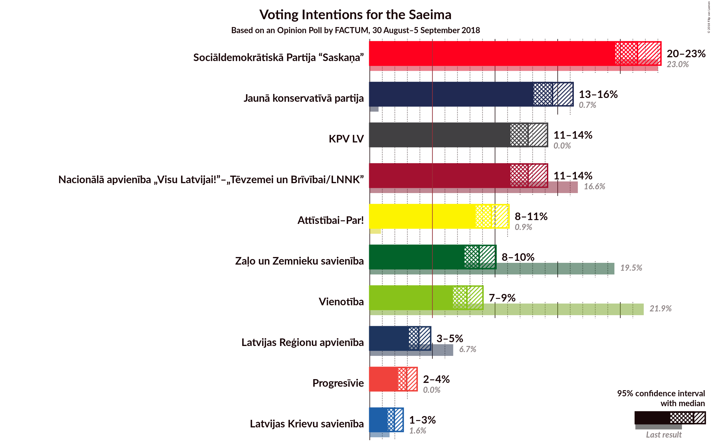
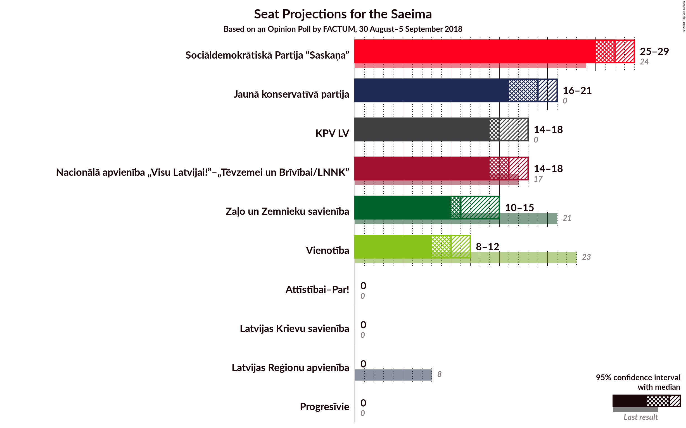
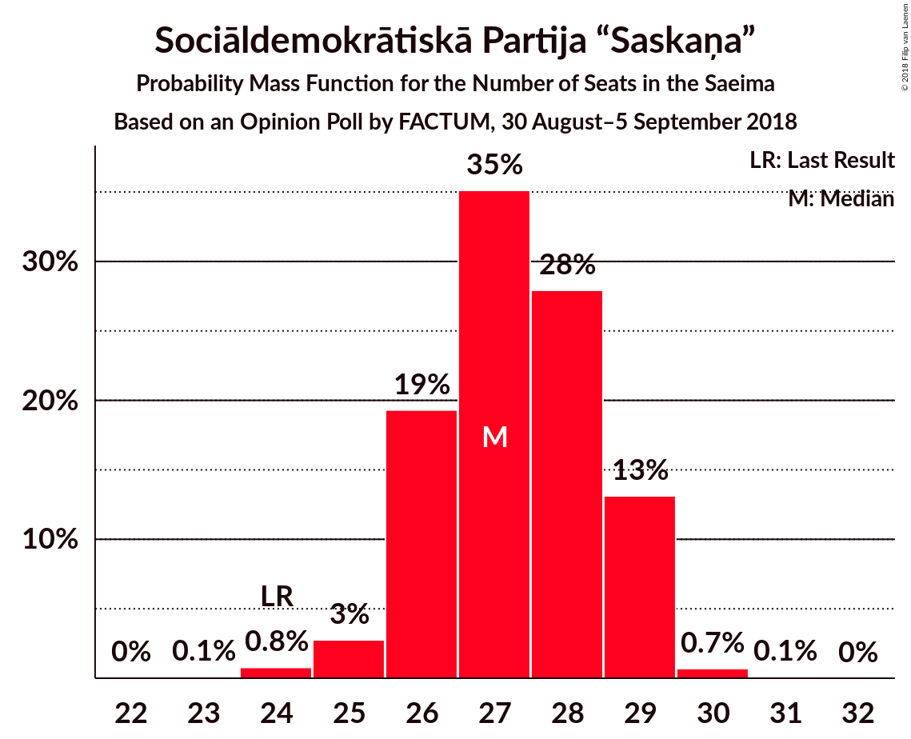
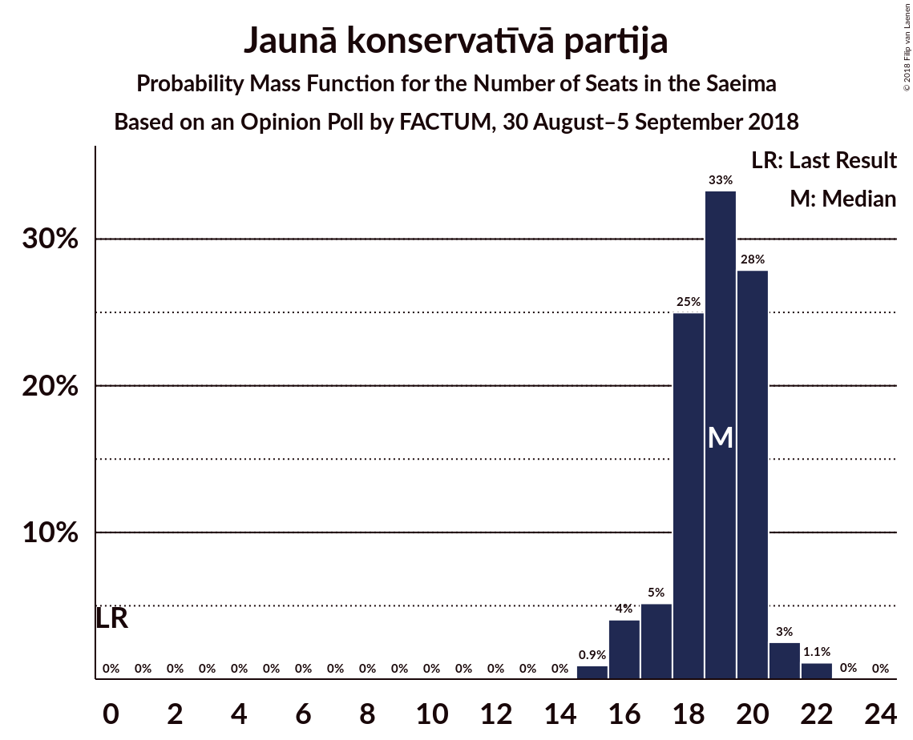
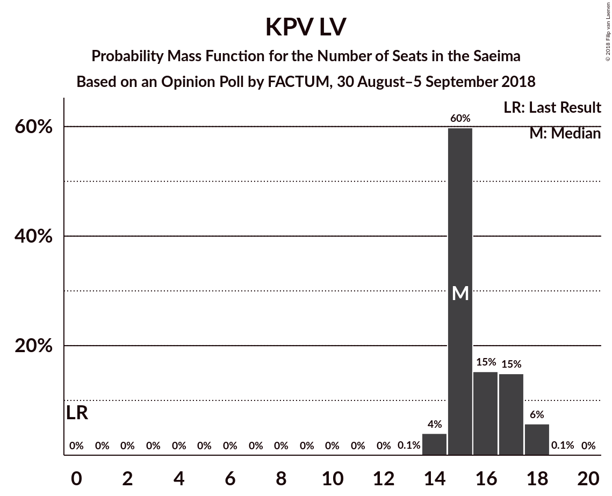
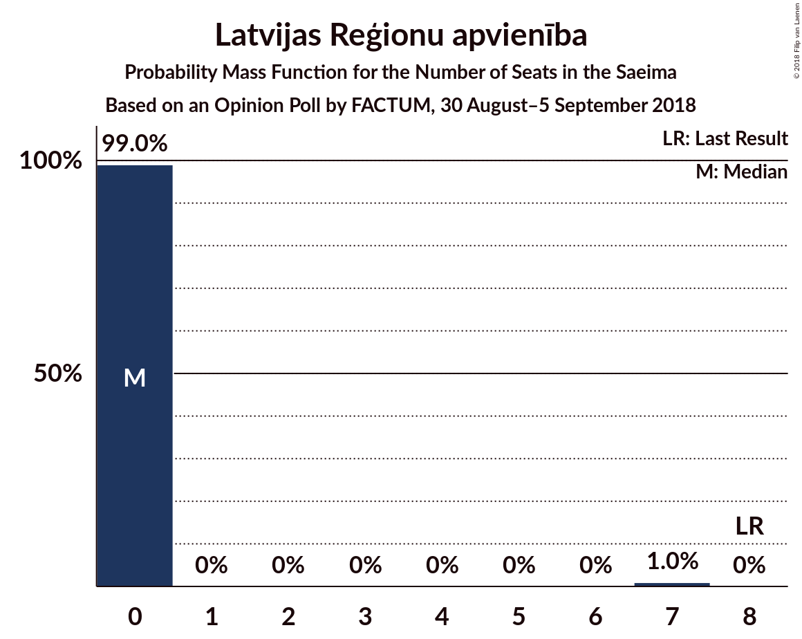

# Opinion Poll by FACTUM, 30 August–5 September 2018

<a href="#voting-intentions">Voting Intentions</a> | <a href="#seats">Seats</a> | <a href="#coalitions">Coalitions</a> | <a href="#technical-information">Technical Information</a>

## Voting Intentions

### Confidence Intervals

| Party | Last Result | Poll Result | 80% Confidence Interval | 90% Confidence Interval | 95% Confidence Interval | 99% Confidence Interval |
|:-----:|:-----------:|:-----------:|:-----------------------:|:-----------------------:|:-----------------------:|:-----------------------:|
| Sociāldemokrātiskā Partija “Saskaņa” | 23.0% | 22.0% | 20.8–23.2% |20.5–23.6% |20.2–23.9% |19.6–24.5% |
| Jaunā konservatīvā partija | 0.7% | 15.0% | 14.0–16.1% |13.7–16.4% |13.5–16.7% |13.0–17.2% |
| Nacionālā apvienība „Visu Latvijai!”–„Tēvzemei un Brīvībai/LNNK” | 16.6% | 13.0% | 12.1–14.0% |11.8–14.3% |11.6–14.6% |11.1–15.1% |
| KPV LV | 0.0% | 13.0% | 12.1–14.0% |11.8–14.3% |11.6–14.6% |11.1–15.1% |
| Attīstībai–Par! | 0.9% | 10.0% | 9.2–10.9% |8.9–11.2% |8.7–11.4% |8.4–11.9% |
| Zaļo un Zemnieku savienība | 19.5% | 9.0% | 8.2–9.9% |8.0–10.1% |7.8–10.3% |7.4–10.8% |
| Vienotība | 21.9% | 8.0% | 7.3–8.9% |7.1–9.1% |6.9–9.3% |6.5–9.7% |
| Latvijas Reģionu apvienība | 6.7% | 4.0% | 3.5–4.6% |3.3–4.8% |3.2–5.0% |3.0–5.3% |
| Latvijas Krievu savienība | 1.6% | 2.0% | 1.6–2.5% |1.5–2.6% |1.5–2.7% |1.3–3.0% |

*Note:* The poll result column reflects the actual value used in the calculations. Published results may vary slightly, and in addition be rounded to fewer digits.

## Seats

### Confidence Intervals

| Party | Last Result | Median | 80% Confidence Interval | 90% Confidence Interval | 95% Confidence Interval | 99% Confidence Interval |
|:-----:|:-----------:|:------:|:-----------------------:|:-----------------------:|:-----------------------:|:-----------------------:|
| <a href="#sociāldemokrātiskā-partija-“saskaņa”">Sociāldemokrātiskā Partija “Saskaņa”</a> | 24 | 25 | 23–26 |23–27 |22–28 |22–28 |
| <a href="#jaunā-konservatīvā-partija">Jaunā konservatīvā partija</a> | 0 | 16 | 15–18 |15–19 |15–20 |15–20 |
| <a href="#nacionālā-apvienība-„visu-latvijai!”–„tēvzemei-un-brīvībai/lnnk”">Nacionālā apvienība „Visu Latvijai!”–„Tēvzemei un Brīvībai/LNNK”</a> | 17 | 14 | 13–16 |13–16 |13–17 |12–17 |
| <a href="#kpv-lv">KPV LV</a> | 0 | 14 | 14–15 |13–16 |13–16 |12–17 |
| <a href="#attīstībai–par!">Attīstībai–Par!</a> | 0 | 11 | 10–12 |10–12 |9–13 |9–14 |
| <a href="#zaļo-un-zemnieku-savienība">Zaļo un Zemnieku savienība</a> | 21 | 11 | 10–11 |9–11 |9–11 |8–13 |
| <a href="#vienotība">Vienotība</a> | 23 | 9 | 8–10 |7–10 |7–10 |7–11 |
| <a href="#latvijas-reģionu-apvienība">Latvijas Reģionu apvienība</a> | 8 | 0 | 0 |0 |0–7 |0–7 |
| <a href="#latvijas-krievu-savienība">Latvijas Krievu savienība</a> | 0 | 0 | 0 |0 |0 |0 |

### Sociāldemokrātiskā Partija “Saskaņa”

*For a full overview of the results for this party, see the [Sociāldemokrātiskā Partija “Saskaņa”](party-sociāldemokrātiskāpartija“saskaņa”.html) page.*

| Number of Seats | Probability | Accumulated | Special Marks |
|:---------------:|:-----------:|:-----------:|:-------------:|
| 21 | 0.2% | 100% |  |
| 22 | 5% | 99.8% |  |
| 23 | 8% | 95% |  |
| 24 | 37% | 88% | Last Result |
| 25 | 26% | 50% | Median |
| 26 | 16% | 24% |  |
| 27 | 4% | 9% |  |
| 28 | 5% | 5% |  |
| 29 | 0.1% | 0.1% |  |
| 30 | 0% | 0% |  |

### Jaunā konservatīvā partija

*For a full overview of the results for this party, see the [Jaunā konservatīvā partija](party-jaunākonservatīvāpartija.html) page.*

| Number of Seats | Probability | Accumulated | Special Marks |
|:---------------:|:-----------:|:-----------:|:-------------:|
| 0 | 0% | 100% | Last Result |
| 1 | 0% | 100% |  |
| 2 | 0% | 100% |  |
| 3 | 0% | 100% |  |
| 4 | 0% | 100% |  |
| 5 | 0% | 100% |  |
| 6 | 0% | 100% |  |
| 7 | 0% | 100% |  |
| 8 | 0% | 100% |  |
| 9 | 0% | 100% |  |
| 10 | 0% | 100% |  |
| 11 | 0% | 100% |  |
| 12 | 0% | 100% |  |
| 13 | 0.1% | 100% |  |
| 14 | 0.3% | 99.9% |  |
| 15 | 39% | 99.6% |  |
| 16 | 28% | 60% | Median |
| 17 | 13% | 33% |  |
| 18 | 12% | 20% |  |
| 19 | 4% | 7% |  |
| 20 | 3% | 3% |  |
| 21 | 0% | 0% |  |

### Nacionālā apvienība „Visu Latvijai!”–„Tēvzemei un Brīvībai/LNNK”

*For a full overview of the results for this party, see the [Nacionālā apvienība „Visu Latvijai!”–„Tēvzemei un Brīvībai/LNNK”](party-nacionālāapvienība„visulatvijai”–„tēvzemeiunbrīvībailnnk”.html) page.*

| Number of Seats | Probability | Accumulated | Special Marks |
|:---------------:|:-----------:|:-----------:|:-------------:|
| 12 | 2% | 100% |  |
| 13 | 20% | 98% |  |
| 14 | 37% | 78% | Median |
| 15 | 24% | 40% |  |
| 16 | 14% | 17% |  |
| 17 | 3% | 3% | Last Result |
| 18 | 0.2% | 0.2% |  |
| 19 | 0% | 0% |  |

### KPV LV

*For a full overview of the results for this party, see the [KPV LV](party-kpvlv.html) page.*

| Number of Seats | Probability | Accumulated | Special Marks |
|:---------------:|:-----------:|:-----------:|:-------------:|
| 0 | 0% | 100% | Last Result |
| 1 | 0% | 100% |  |
| 2 | 0% | 100% |  |
| 3 | 0% | 100% |  |
| 4 | 0% | 100% |  |
| 5 | 0% | 100% |  |
| 6 | 0% | 100% |  |
| 7 | 0% | 100% |  |
| 8 | 0% | 100% |  |
| 9 | 0% | 100% |  |
| 10 | 0% | 100% |  |
| 11 | 0.1% | 100% |  |
| 12 | 1.4% | 99.9% |  |
| 13 | 6% | 98% |  |
| 14 | 65% | 92% | Median |
| 15 | 22% | 27% |  |
| 16 | 4% | 5% |  |
| 17 | 1.3% | 1.3% |  |
| 18 | 0% | 0% |  |

### Attīstībai–Par!

*For a full overview of the results for this party, see the [Attīstībai–Par!](party-attīstībai–par.html) page.*

| Number of Seats | Probability | Accumulated | Special Marks |
|:---------------:|:-----------:|:-----------:|:-------------:|
| 0 | 0% | 100% | Last Result |
| 1 | 0% | 100% |  |
| 2 | 0% | 100% |  |
| 3 | 0% | 100% |  |
| 4 | 0% | 100% |  |
| 5 | 0% | 100% |  |
| 6 | 0% | 100% |  |
| 7 | 0% | 100% |  |
| 8 | 0.1% | 100% |  |
| 9 | 3% | 99.9% |  |
| 10 | 34% | 97% |  |
| 11 | 25% | 63% | Median |
| 12 | 34% | 39% |  |
| 13 | 4% | 5% |  |
| 14 | 0.9% | 0.9% |  |
| 15 | 0% | 0% |  |

### Zaļo un Zemnieku savienība

*For a full overview of the results for this party, see the [Zaļo un Zemnieku savienība](party-zaļounzemniekusavienība.html) page.*

| Number of Seats | Probability | Accumulated | Special Marks |
|:---------------:|:-----------:|:-----------:|:-------------:|
| 8 | 1.2% | 100% |  |
| 9 | 6% | 98.8% |  |
| 10 | 23% | 93% |  |
| 11 | 69% | 70% | Median |
| 12 | 0.9% | 1.5% |  |
| 13 | 0.2% | 0.6% |  |
| 14 | 0.3% | 0.4% |  |
| 15 | 0.1% | 0.1% |  |
| 16 | 0% | 0% |  |
| 17 | 0% | 0% |  |
| 18 | 0% | 0% |  |
| 19 | 0% | 0% |  |
| 20 | 0% | 0% |  |
| 21 | 0% | 0% | Last Result |

### Vienotība

*For a full overview of the results for this party, see the [Vienotība](party-vienotība.html) page.*

| Number of Seats | Probability | Accumulated | Special Marks |
|:---------------:|:-----------:|:-----------:|:-------------:|
| 7 | 10% | 100% |  |
| 8 | 40% | 90% |  |
| 9 | 35% | 50% | Median |
| 10 | 14% | 15% |  |
| 11 | 0.6% | 0.8% |  |
| 12 | 0.1% | 0.1% |  |
| 13 | 0% | 0% |  |
| 14 | 0% | 0% |  |
| 15 | 0% | 0% |  |
| 16 | 0% | 0% |  |
| 17 | 0% | 0% |  |
| 18 | 0% | 0% |  |
| 19 | 0% | 0% |  |
| 20 | 0% | 0% |  |
| 21 | 0% | 0% |  |
| 22 | 0% | 0% |  |
| 23 | 0% | 0% | Last Result |

### Latvijas Reģionu apvienība

*For a full overview of the results for this party, see the [Latvijas Reģionu apvienība](party-latvijasreģionuapvienība.html) page.*

| Number of Seats | Probability | Accumulated | Special Marks |
|:---------------:|:-----------:|:-----------:|:-------------:|
| 0 | 97% | 100% | Median |
| 1 | 0% | 3% |  |
| 2 | 0% | 3% |  |
| 3 | 0% | 3% |  |
| 4 | 0% | 3% |  |
| 5 | 0% | 3% |  |
| 6 | 0.1% | 3% |  |
| 7 | 3% | 3% |  |
| 8 | 0% | 0% | Last Result |

### Latvijas Krievu savienība

*For a full overview of the results for this party, see the [Latvijas Krievu savienība](party-latvijaskrievusavienība.html) page.*

| Number of Seats | Probability | Accumulated | Special Marks |
|:---------------:|:-----------:|:-----------:|:-------------:|
| 0 | 100% | 100% | Last Result, Median |

## Coalitions

### Confidence Intervals

| Coalition | Last Result | Median | Majority? | 80% Confidence Interval | 90% Confidence Interval | 95% Confidence Interval | 99% Confidence Interval |
|:---------:|:-----------:|:------:|:---------:|:-----------------------:|:-----------------------:|:-----------------------:|:-----------------------:|
| Jaunā konservatīvā partija – Nacionālā apvienība „Visu Latvijai!”–„Tēvzemei un Brīvībai/LNNK” – Attīstībai–Par! – Zaļo un Zemnieku savienība – Vienotība | 61 | 61 | 100% | 59–62 | 58–63 | 57–64 | 56–64 |
| Jaunā konservatīvā partija – Nacionālā apvienība „Visu Latvijai!”–„Tēvzemei un Brīvībai/LNNK” – Attīstībai–Par! – Zaļo un Zemnieku savienība | 38 | 52 | 88% | 50–54 | 50–55 | 49–55 | 48–56 |
| Jaunā konservatīvā partija – Nacionālā apvienība „Visu Latvijai!”–„Tēvzemei un Brīvībai/LNNK” – Zaļo un Zemnieku savienība – Vienotība | 61 | 50 | 29% | 48–52 | 48–52 | 46–53 | 45–54 |
| Nacionālā apvienība „Visu Latvijai!”–„Tēvzemei un Brīvībai/LNNK” – Attīstībai–Par! – Zaļo un Zemnieku savienība – Vienotība | 61 | 45 | 0% | 42–47 | 42–47 | 41–47 | 41–48 |
| Jaunā konservatīvā partija – Nacionālā apvienība „Visu Latvijai!”–„Tēvzemei un Brīvībai/LNNK” – Zaļo un Zemnieku savienība | 38 | 41 | 0% | 39–43 | 39–44 | 38–45 | 37–45 |
| Nacionālā apvienība „Visu Latvijai!”–„Tēvzemei un Brīvībai/LNNK” – Attīstībai–Par! – Zaļo un Zemnieku savienība | 38 | 36 | 0% | 34–38 | 34–38 | 33–39 | 32–39 |
| Nacionālā apvienība „Visu Latvijai!”–„Tēvzemei un Brīvībai/LNNK” – Zaļo un Zemnieku savienība – Vienotība | 61 | 34 | 0% | 32–35 | 31–36 | 31–36 | 30–37 |

### Jaunā konservatīvā partija – Nacionālā apvienība „Visu Latvijai!”–„Tēvzemei un Brīvībai/LNNK” – Attīstībai–Par! – Zaļo un Zemnieku savienība – Vienotība

| Number of Seats | Probability | Accumulated | Special Marks |
|:---------------:|:-----------:|:-----------:|:-------------:|
| 55 | 0.2% | 100% |  |
| 56 | 2% | 99.7% |  |
| 57 | 0.9% | 98% |  |
| 58 | 5% | 97% |  |
| 59 | 5% | 92% |  |
| 60 | 21% | 87% |  |
| 61 | 35% | 66% | Last Result, Median |
| 62 | 21% | 31% |  |
| 63 | 6% | 10% |  |
| 64 | 3% | 3% |  |
| 65 | 0.3% | 0.3% |  |
| 66 | 0% | 0% |  |

### Jaunā konservatīvā partija – Nacionālā apvienība „Visu Latvijai!”–„Tēvzemei un Brīvībai/LNNK” – Attīstībai–Par! – Zaļo un Zemnieku savienība

| Number of Seats | Probability | Accumulated | Special Marks |
|:---------------:|:-----------:|:-----------:|:-------------:|
| 38 | 0% | 100% | Last Result |
| 39 | 0% | 100% |  |
| 40 | 0% | 100% |  |
| 41 | 0% | 100% |  |
| 42 | 0% | 100% |  |
| 43 | 0% | 100% |  |
| 44 | 0% | 100% |  |
| 45 | 0% | 100% |  |
| 46 | 0% | 100% |  |
| 47 | 0.3% | 100% |  |
| 48 | 2% | 99.7% |  |
| 49 | 2% | 98% |  |
| 50 | 8% | 96% |  |
| 51 | 15% | 88% | Majority |
| 52 | 29% | 73% | Median |
| 53 | 21% | 44% |  |
| 54 | 17% | 23% |  |
| 55 | 5% | 6% |  |
| 56 | 1.0% | 1.2% |  |
| 57 | 0.1% | 0.2% |  |
| 58 | 0.1% | 0.1% |  |
| 59 | 0% | 0% |  |

### Jaunā konservatīvā partija – Nacionālā apvienība „Visu Latvijai!”–„Tēvzemei un Brīvībai/LNNK” – Zaļo un Zemnieku savienība – Vienotība

| Number of Seats | Probability | Accumulated | Special Marks |
|:---------------:|:-----------:|:-----------:|:-------------:|
| 44 | 0.1% | 100% |  |
| 45 | 0.7% | 99.8% |  |
| 46 | 2% | 99.2% |  |
| 47 | 2% | 97% |  |
| 48 | 11% | 95% |  |
| 49 | 24% | 84% |  |
| 50 | 31% | 60% | Median |
| 51 | 19% | 29% | Majority |
| 52 | 7% | 10% |  |
| 53 | 3% | 4% |  |
| 54 | 0.6% | 0.7% |  |
| 55 | 0.1% | 0.1% |  |
| 56 | 0% | 0% |  |
| 57 | 0% | 0% |  |
| 58 | 0% | 0% |  |
| 59 | 0% | 0% |  |
| 60 | 0% | 0% |  |
| 61 | 0% | 0% | Last Result |

### Nacionālā apvienība „Visu Latvijai!”–„Tēvzemei un Brīvībai/LNNK” – Attīstībai–Par! – Zaļo un Zemnieku savienība – Vienotība

| Number of Seats | Probability | Accumulated | Special Marks |
|:---------------:|:-----------:|:-----------:|:-------------:|
| 39 | 0% | 100% |  |
| 40 | 0.4% | 99.9% |  |
| 41 | 3% | 99.5% |  |
| 42 | 8% | 97% |  |
| 43 | 9% | 88% |  |
| 44 | 26% | 80% |  |
| 45 | 25% | 54% | Median |
| 46 | 14% | 28% |  |
| 47 | 13% | 14% |  |
| 48 | 1.0% | 1.2% |  |
| 49 | 0.1% | 0.2% |  |
| 50 | 0% | 0% |  |
| 51 | 0% | 0% | Majority |
| 52 | 0% | 0% |  |
| 53 | 0% | 0% |  |
| 54 | 0% | 0% |  |
| 55 | 0% | 0% |  |
| 56 | 0% | 0% |  |
| 57 | 0% | 0% |  |
| 58 | 0% | 0% |  |
| 59 | 0% | 0% |  |
| 60 | 0% | 0% |  |
| 61 | 0% | 0% | Last Result |

### Jaunā konservatīvā partija – Nacionālā apvienība „Visu Latvijai!”–„Tēvzemei un Brīvībai/LNNK” – Zaļo un Zemnieku savienība

| Number of Seats | Probability | Accumulated | Special Marks |
|:---------------:|:-----------:|:-----------:|:-------------:|
| 36 | 0.1% | 100% |  |
| 37 | 0.6% | 99.9% |  |
| 38 | 3% | 99.3% | Last Result |
| 39 | 7% | 96% |  |
| 40 | 18% | 89% |  |
| 41 | 30% | 71% | Median |
| 42 | 24% | 41% |  |
| 43 | 12% | 18% |  |
| 44 | 3% | 6% |  |
| 45 | 3% | 3% |  |
| 46 | 0.1% | 0.2% |  |
| 47 | 0.1% | 0.1% |  |
| 48 | 0% | 0% |  |

### Nacionālā apvienība „Visu Latvijai!”–„Tēvzemei un Brīvībai/LNNK” – Attīstībai–Par! – Zaļo un Zemnieku savienība

| Number of Seats | Probability | Accumulated | Special Marks |
|:---------------:|:-----------:|:-----------:|:-------------:|
| 32 | 0.6% | 100% |  |
| 33 | 3% | 99.3% |  |
| 34 | 10% | 96% |  |
| 35 | 17% | 87% |  |
| 36 | 35% | 70% | Median |
| 37 | 20% | 34% |  |
| 38 | 10% | 14% | Last Result |
| 39 | 4% | 5% |  |
| 40 | 0.2% | 0.2% |  |
| 41 | 0% | 0% |  |

### Nacionālā apvienība „Visu Latvijai!”–„Tēvzemei un Brīvībai/LNNK” – Zaļo un Zemnieku savienība – Vienotība

| Number of Seats | Probability | Accumulated | Special Marks |
|:---------------:|:-----------:|:-----------:|:-------------:|
| 29 | 0.3% | 100% |  |
| 30 | 1.4% | 99.6% |  |
| 31 | 8% | 98% |  |
| 32 | 15% | 90% |  |
| 33 | 18% | 75% |  |
| 34 | 29% | 56% | Median |
| 35 | 18% | 27% |  |
| 36 | 8% | 9% |  |
| 37 | 1.3% | 1.5% |  |
| 38 | 0.1% | 0.1% |  |
| 39 | 0% | 0% |  |
| 40 | 0% | 0% |  |
| 41 | 0% | 0% |  |
| 42 | 0% | 0% |  |
| 43 | 0% | 0% |  |
| 44 | 0% | 0% |  |
| 45 | 0% | 0% |  |
| 46 | 0% | 0% |  |
| 47 | 0% | 0% |  |
| 48 | 0% | 0% |  |
| 49 | 0% | 0% |  |
| 50 | 0% | 0% |  |
| 51 | 0% | 0% | Majority |
| 52 | 0% | 0% |  |
| 53 | 0% | 0% |  |
| 54 | 0% | 0% |  |
| 55 | 0% | 0% |  |
| 56 | 0% | 0% |  |
| 57 | 0% | 0% |  |
| 58 | 0% | 0% |  |
| 59 | 0% | 0% |  |
| 60 | 0% | 0% |  |
| 61 | 0% | 0% | Last Result |

## Technical Information

### Opinion Poll

+ **Polling firm:** FACTUM
+ **Commissioner(s):** —
+ **Fieldwork period:** 30 August–5 September 2018

### Calculations

+ **Sample size:** 1947
+ **Simulations done:** 1,048,576
+ **Error estimate:** 1.07%

