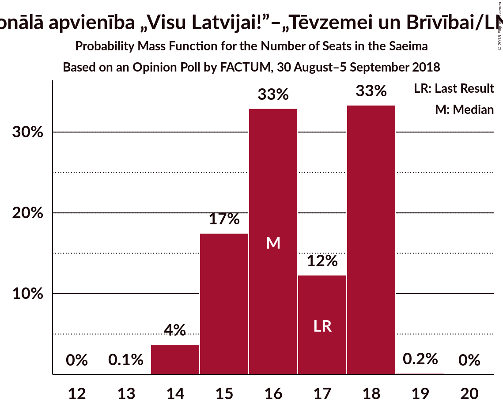
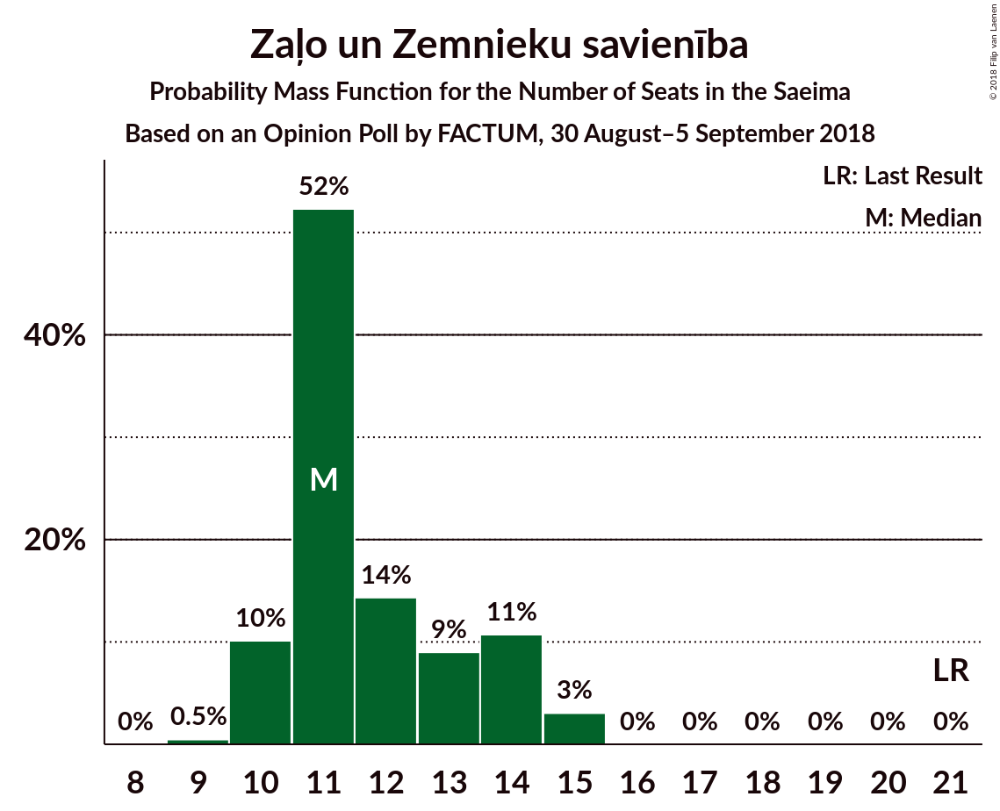
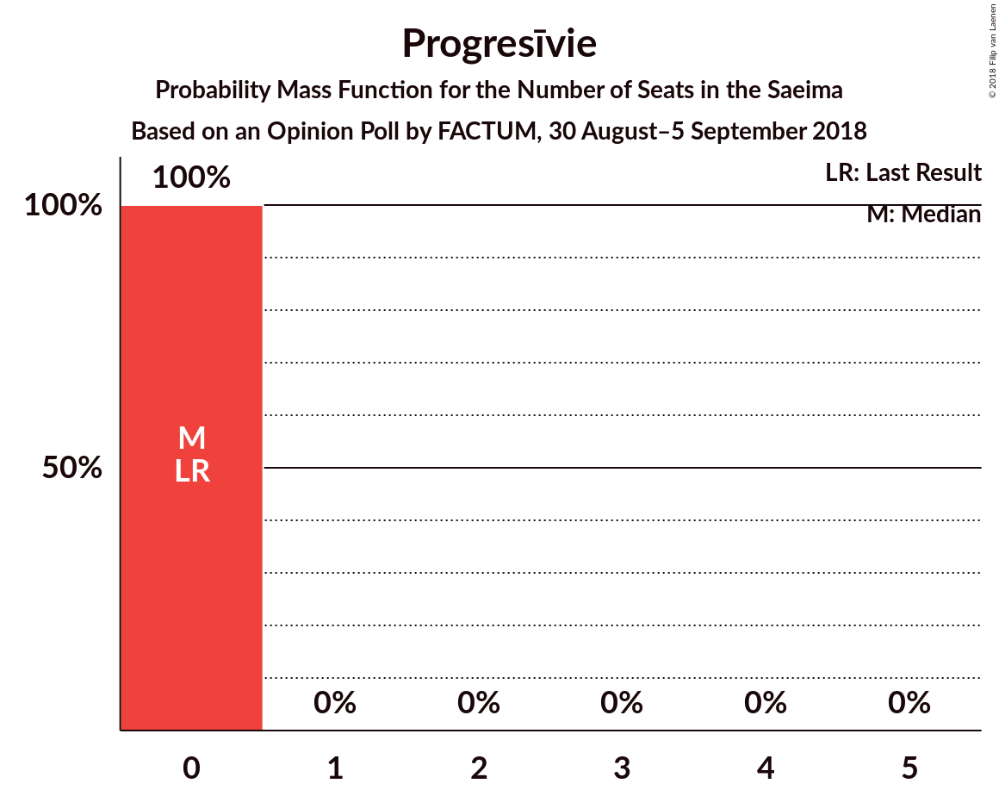
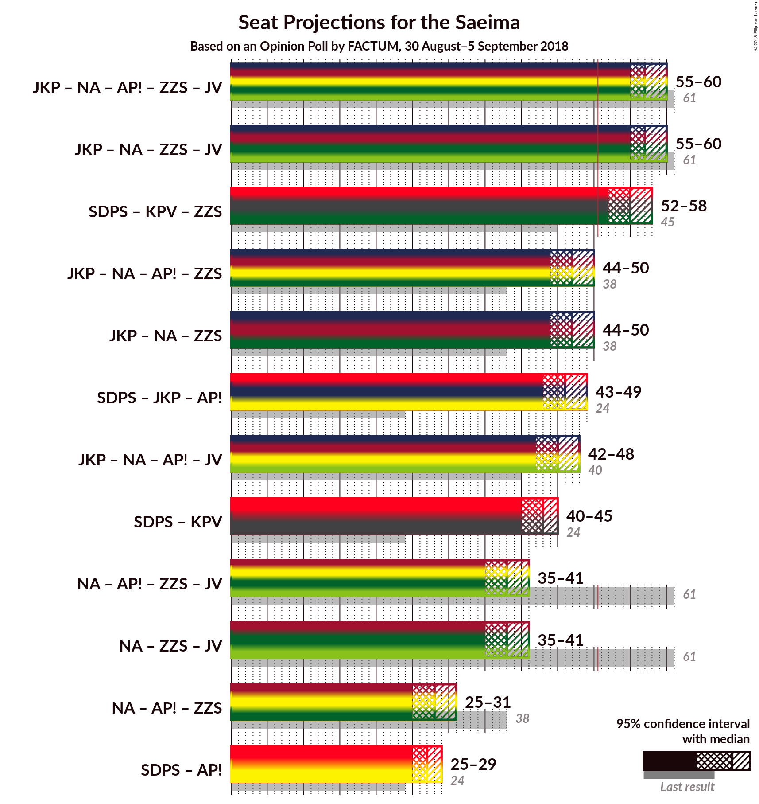

# Opinion Poll by FACTUM, 30 August–5 September 2018

<a href="#voting-intentions">Voting Intentions</a> | <a href="#seats">Seats</a> | <a href="#coalitions">Coalitions</a> | <a href="#technical-information">Technical Information</a>

## Voting Intentions

### Confidence Intervals

| Party | Last Result | Poll Result | 80% Confidence Interval | 90% Confidence Interval | 95% Confidence Interval | 99% Confidence Interval |
|:-----:|:-----------:|:-----------:|:-----------------------:|:-----------------------:|:-----------------------:|:-----------------------:|
| Sociāldemokrātiskā Partija “Saskaņa” | 23.0% | 21.4% | 20.2–22.6% |19.9–22.9% |19.6–23.2% |19.1–23.9% |
| Jaunā konservatīvā partija | 0.7% | 14.6% | 13.6–15.7% |13.3–16.0% |13.1–16.2% |12.6–16.8% |
| Nacionālā apvienība „Visu Latvijai!”–„Tēvzemei un Brīvībai/LNNK” | 16.6% | 12.6% | 11.7–13.7% |11.4–13.9% |11.2–14.2% |10.8–14.7% |
| KPV LV | 0.0% | 12.6% | 11.7–13.7% |11.4–13.9% |11.2–14.2% |10.8–14.7% |
| Attīstībai–Par! | 0.9% | 9.7% | 8.9–10.6% |8.7–10.9% |8.5–11.1% |8.1–11.6% |
| Zaļo un Zemnieku savienība | 19.5% | 8.7% | 8.0–9.6% |7.7–9.9% |7.6–10.1% |7.2–10.5% |
| Vienotība | 21.9% | 7.8% | 7.0–8.6% |6.8–8.8% |6.6–9.0% |6.3–9.4% |
| Latvijas Reģionu apvienība | 6.7% | 3.9% | 3.4–4.5% |3.2–4.7% |3.1–4.9% |2.9–5.2% |
| Progresīvie | 0.0% | 2.9% | 2.5–3.5% |2.4–3.6% |2.3–3.8% |2.1–4.1% |
| Latvijas Krievu savienība | 1.6% | 2.0% | 1.6–2.4% |1.5–2.6% |1.4–2.7% |1.3–2.9% |

*Note:* The poll result column reflects the actual value used in the calculations. Published results may vary slightly, and in addition be rounded to fewer digits.

## Seats

### Confidence Intervals

| Party | Last Result | Median | 80% Confidence Interval | 90% Confidence Interval | 95% Confidence Interval | 99% Confidence Interval |
|:-----:|:-----------:|:------:|:-----------------------:|:-----------------------:|:-----------------------:|:-----------------------:|
| <a href="#sociāldemokrātiskā-partija-“saskaņa”">Sociāldemokrātiskā Partija “Saskaņa”</a> | 24 | 27 | 26–29 |26–29 |25–29 |24–30 |
| <a href="#jaunā-konservatīvā-partija">Jaunā konservatīvā partija</a> | 0 | 19 | 17–20 |17–20 |16–21 |15–22 |
| <a href="#nacionālā-apvienība-„visu-latvijai!”–„tēvzemei-un-brīvībai/lnnk”">Nacionālā apvienība „Visu Latvijai!”–„Tēvzemei un Brīvībai/LNNK”</a> | 17 | 16 | 15–18 |15–18 |14–18 |14–18 |
| <a href="#kpv-lv">KPV LV</a> | 0 | 15 | 15–17 |15–18 |14–18 |14–18 |
| <a href="#attīstībai–par!">Attīstībai–Par!</a> | 0 | 0 | 0 |0 |0 |0 |
| <a href="#zaļo-un-zemnieku-savienība">Zaļo un Zemnieku savienība</a> | 21 | 11 | 10–14 |10–14 |10–15 |10–15 |
| <a href="#vienotība">Vienotība</a> | 23 | 10 | 9–11 |8–12 |8–12 |8–12 |
| <a href="#latvijas-reģionu-apvienība">Latvijas Reģionu apvienība</a> | 8 | 0 | 0 |0 |0 |0–7 |
| <a href="#progresīvie">Progresīvie</a> | 0 | 0 | 0 |0 |0 |0 |
| <a href="#latvijas-krievu-savienība">Latvijas Krievu savienība</a> | 0 | 0 | 0 |0 |0 |0 |

### Sociāldemokrātiskā Partija “Saskaņa”

*For a full overview of the results for this party, see the [Sociāldemokrātiskā Partija “Saskaņa”](party-sociāldemokrātiskāpartija“saskaņa”.html) page.*

| Number of Seats | Probability | Accumulated | Special Marks |
|:---------------:|:-----------:|:-----------:|:-------------:|
| 23 | 0.1% | 100% |  |
| 24 | 0.8% | 99.8% | Last Result |
| 25 | 3% | 99.1% |  |
| 26 | 19% | 96% |  |
| 27 | 35% | 77% | Median |
| 28 | 28% | 42% |  |
| 29 | 13% | 14% |  |
| 30 | 0.7% | 0.8% |  |
| 31 | 0.1% | 0.1% |  |
| 32 | 0% | 0% |  |

### Jaunā konservatīvā partija

*For a full overview of the results for this party, see the [Jaunā konservatīvā partija](party-jaunākonservatīvāpartija.html) page.*

| Number of Seats | Probability | Accumulated | Special Marks |
|:---------------:|:-----------:|:-----------:|:-------------:|
| 0 | 0% | 100% | Last Result |
| 1 | 0% | 100% |  |
| 2 | 0% | 100% |  |
| 3 | 0% | 100% |  |
| 4 | 0% | 100% |  |
| 5 | 0% | 100% |  |
| 6 | 0% | 100% |  |
| 7 | 0% | 100% |  |
| 8 | 0% | 100% |  |
| 9 | 0% | 100% |  |
| 10 | 0% | 100% |  |
| 11 | 0% | 100% |  |
| 12 | 0% | 100% |  |
| 13 | 0% | 100% |  |
| 14 | 0% | 100% |  |
| 15 | 0.9% | 100% |  |
| 16 | 4% | 99.1% |  |
| 17 | 5% | 95% |  |
| 18 | 25% | 90% |  |
| 19 | 33% | 65% | Median |
| 20 | 28% | 32% |  |
| 21 | 3% | 4% |  |
| 22 | 1.1% | 1.2% |  |
| 23 | 0% | 0% |  |

### Nacionālā apvienība „Visu Latvijai!”–„Tēvzemei un Brīvībai/LNNK”

*For a full overview of the results for this party, see the [Nacionālā apvienība „Visu Latvijai!”–„Tēvzemei un Brīvībai/LNNK”](party-nacionālāapvienība„visulatvijai”–„tēvzemeiunbrīvībailnnk”.html) page.*

| Number of Seats | Probability | Accumulated | Special Marks |
|:---------------:|:-----------:|:-----------:|:-------------:|
| 13 | 0.1% | 100% |  |
| 14 | 4% | 99.9% |  |
| 15 | 17% | 96% |  |
| 16 | 33% | 79% | Median |
| 17 | 12% | 46% | Last Result |
| 18 | 33% | 34% |  |
| 19 | 0.2% | 0.2% |  |
| 20 | 0% | 0% |  |

### KPV LV

*For a full overview of the results for this party, see the [KPV LV](party-kpvlv.html) page.*

| Number of Seats | Probability | Accumulated | Special Marks |
|:---------------:|:-----------:|:-----------:|:-------------:|
| 0 | 0% | 100% | Last Result |
| 1 | 0% | 100% |  |
| 2 | 0% | 100% |  |
| 3 | 0% | 100% |  |
| 4 | 0% | 100% |  |
| 5 | 0% | 100% |  |
| 6 | 0% | 100% |  |
| 7 | 0% | 100% |  |
| 8 | 0% | 100% |  |
| 9 | 0% | 100% |  |
| 10 | 0% | 100% |  |
| 11 | 0% | 100% |  |
| 12 | 0% | 100% |  |
| 13 | 0.1% | 100% |  |
| 14 | 4% | 99.8% |  |
| 15 | 60% | 96% | Median |
| 16 | 15% | 36% |  |
| 17 | 15% | 21% |  |
| 18 | 6% | 6% |  |
| 19 | 0.1% | 0.2% |  |
| 20 | 0% | 0% |  |

### Attīstībai–Par!

*For a full overview of the results for this party, see the [Attīstībai–Par!](party-attīstībai–par.html) page.*

| Number of Seats | Probability | Accumulated | Special Marks |
|:---------------:|:-----------:|:-----------:|:-------------:|
| 0 | 100% | 100% | Last Result, Median |

### Zaļo un Zemnieku savienība

*For a full overview of the results for this party, see the [Zaļo un Zemnieku savienība](party-zaļounzemniekusavienība.html) page.*

| Number of Seats | Probability | Accumulated | Special Marks |
|:---------------:|:-----------:|:-----------:|:-------------:|
| 9 | 0.5% | 100% |  |
| 10 | 10% | 99.5% |  |
| 11 | 52% | 89% | Median |
| 12 | 14% | 37% |  |
| 13 | 9% | 23% |  |
| 14 | 11% | 14% |  |
| 15 | 3% | 3% |  |
| 16 | 0% | 0% |  |
| 17 | 0% | 0% |  |
| 18 | 0% | 0% |  |
| 19 | 0% | 0% |  |
| 20 | 0% | 0% |  |
| 21 | 0% | 0% | Last Result |

### Vienotība

*For a full overview of the results for this party, see the [Vienotība](party-vienotība.html) page.*

| Number of Seats | Probability | Accumulated | Special Marks |
|:---------------:|:-----------:|:-----------:|:-------------:|
| 7 | 0.1% | 100% |  |
| 8 | 8% | 99.9% |  |
| 9 | 12% | 92% |  |
| 10 | 57% | 80% | Median |
| 11 | 17% | 23% |  |
| 12 | 6% | 6% |  |
| 13 | 0% | 0% |  |
| 14 | 0% | 0% |  |
| 15 | 0% | 0% |  |
| 16 | 0% | 0% |  |
| 17 | 0% | 0% |  |
| 18 | 0% | 0% |  |
| 19 | 0% | 0% |  |
| 20 | 0% | 0% |  |
| 21 | 0% | 0% |  |
| 22 | 0% | 0% |  |
| 23 | 0% | 0% | Last Result |

### Latvijas Reģionu apvienība

*For a full overview of the results for this party, see the [Latvijas Reģionu apvienība](party-latvijasreģionuapvienība.html) page.*

| Number of Seats | Probability | Accumulated | Special Marks |
|:---------------:|:-----------:|:-----------:|:-------------:|
| 0 | 99.0% | 100% | Median |
| 1 | 0% | 1.0% |  |
| 2 | 0% | 1.0% |  |
| 3 | 0% | 1.0% |  |
| 4 | 0% | 1.0% |  |
| 5 | 0% | 1.0% |  |
| 6 | 0% | 1.0% |  |
| 7 | 1.0% | 1.0% |  |
| 8 | 0% | 0% | Last Result |

### Progresīvie

*For a full overview of the results for this party, see the [Progresīvie](party-progresīvie.html) page.*

| Number of Seats | Probability | Accumulated | Special Marks |
|:---------------:|:-----------:|:-----------:|:-------------:|
| 0 | 100% | 100% | Last Result, Median |

### Latvijas Krievu savienība

*For a full overview of the results for this party, see the [Latvijas Krievu savienība](party-latvijaskrievusavienība.html) page.*

| Number of Seats | Probability | Accumulated | Special Marks |
|:---------------:|:-----------:|:-----------:|:-------------:|
| 0 | 100% | 100% | Last Result, Median |

## Coalitions

### Confidence Intervals

| Coalition | Last Result | Median | Majority? | 80% Confidence Interval | 90% Confidence Interval | 95% Confidence Interval | 99% Confidence Interval |
|:---------:|:-----------:|:------:|:---------:|:-----------------------:|:-----------------------:|:-----------------------:|:-----------------------:|
| Jaunā konservatīvā partija – Nacionālā apvienība „Visu Latvijai!”–„Tēvzemei un Brīvībai/LNNK” – Attīstībai–Par! – Zaļo un Zemnieku savienība – Vienotība | 61 | 57 | 100% | 55–59 | 55–59 | 55–60 | 53–60 |
| Jaunā konservatīvā partija – Nacionālā apvienība „Visu Latvijai!”–„Tēvzemei un Brīvībai/LNNK” – Zaļo un Zemnieku savienība – Vienotība | 61 | 57 | 100% | 55–59 | 55–59 | 55–60 | 53–60 |
| Sociāldemokrātiskā Partija “Saskaņa” – KPV LV – Zaļo un Zemnieku savienība | 45 | 55 | 99.4% | 53–57 | 52–57 | 52–58 | 50–58 |
| Jaunā konservatīvā partija – Nacionālā apvienība „Visu Latvijai!”–„Tēvzemei un Brīvībai/LNNK” – Attīstībai–Par! – Zaļo un Zemnieku savienība | 38 | 47 | 2% | 45–49 | 45–50 | 44–50 | 43–51 |
| Jaunā konservatīvā partija – Nacionālā apvienība „Visu Latvijai!”–„Tēvzemei un Brīvībai/LNNK” – Zaļo un Zemnieku savienība | 38 | 47 | 2% | 45–49 | 45–50 | 44–50 | 43–51 |
| Sociāldemokrātiskā Partija “Saskaņa” – Jaunā konservatīvā partija – Attīstībai–Par! | 24 | 46 | 0.1% | 44–48 | 44–48 | 43–49 | 42–50 |
| Jaunā konservatīvā partija – Nacionālā apvienība „Visu Latvijai!”–„Tēvzemei un Brīvībai/LNNK” – Attīstībai–Par! – Vienotība | 40 | 45 | 0% | 43–47 | 43–48 | 42–48 | 41–49 |
| Sociāldemokrātiskā Partija “Saskaņa” – KPV LV | 24 | 43 | 0% | 41–44 | 41–45 | 40–45 | 39–46 |
| Nacionālā apvienība „Visu Latvijai!”–„Tēvzemei un Brīvībai/LNNK” – Attīstībai–Par! – Zaļo un Zemnieku savienība – Vienotība | 61 | 38 | 0% | 37–40 | 36–40 | 35–41 | 34–42 |
| Nacionālā apvienība „Visu Latvijai!”–„Tēvzemei un Brīvībai/LNNK” – Zaļo un Zemnieku savienība – Vienotība | 61 | 38 | 0% | 37–40 | 36–40 | 35–41 | 34–42 |
| Nacionālā apvienība „Visu Latvijai!”–„Tēvzemei un Brīvībai/LNNK” – Attīstībai–Par! – Zaļo un Zemnieku savienība | 38 | 28 | 0% | 26–30 | 26–30 | 25–31 | 25–32 |
| Sociāldemokrātiskā Partija “Saskaņa” – Attīstībai–Par! | 24 | 27 | 0% | 26–29 | 26–29 | 25–29 | 24–30 |

### Jaunā konservatīvā partija – Nacionālā apvienība „Visu Latvijai!”–„Tēvzemei un Brīvībai/LNNK” – Attīstībai–Par! – Zaļo un Zemnieku savienība – Vienotība

| Number of Seats | Probability | Accumulated | Special Marks |
|:---------------:|:-----------:|:-----------:|:-------------:|
| 51 | 0.2% | 100% | Majority |
| 52 | 0.1% | 99.8% |  |
| 53 | 0.4% | 99.6% |  |
| 54 | 1.3% | 99.3% |  |
| 55 | 8% | 98% |  |
| 56 | 21% | 90% | Median |
| 57 | 34% | 68% |  |
| 58 | 22% | 35% |  |
| 59 | 10% | 13% |  |
| 60 | 2% | 3% |  |
| 61 | 0.3% | 0.3% | Last Result |
| 62 | 0% | 0% |  |

### Jaunā konservatīvā partija – Nacionālā apvienība „Visu Latvijai!”–„Tēvzemei un Brīvībai/LNNK” – Zaļo un Zemnieku savienība – Vienotība

| Number of Seats | Probability | Accumulated | Special Marks |
|:---------------:|:-----------:|:-----------:|:-------------:|
| 51 | 0.2% | 100% | Majority |
| 52 | 0.1% | 99.8% |  |
| 53 | 0.4% | 99.6% |  |
| 54 | 1.3% | 99.3% |  |
| 55 | 8% | 98% |  |
| 56 | 21% | 90% | Median |
| 57 | 34% | 68% |  |
| 58 | 22% | 35% |  |
| 59 | 10% | 13% |  |
| 60 | 2% | 3% |  |
| 61 | 0.3% | 0.3% | Last Result |
| 62 | 0% | 0% |  |

### Sociāldemokrātiskā Partija “Saskaņa” – KPV LV – Zaļo un Zemnieku savienība

| Number of Seats | Probability | Accumulated | Special Marks |
|:---------------:|:-----------:|:-----------:|:-------------:|
| 45 | 0% | 100% | Last Result |
| 46 | 0% | 100% |  |
| 47 | 0% | 100% |  |
| 48 | 0% | 100% |  |
| 49 | 0.4% | 100% |  |
| 50 | 0.1% | 99.6% |  |
| 51 | 1.1% | 99.4% | Majority |
| 52 | 7% | 98% |  |
| 53 | 16% | 92% | Median |
| 54 | 24% | 75% |  |
| 55 | 28% | 51% |  |
| 56 | 13% | 23% |  |
| 57 | 7% | 11% |  |
| 58 | 3% | 3% |  |
| 59 | 0.5% | 0.5% |  |
| 60 | 0% | 0% |  |

### Jaunā konservatīvā partija – Nacionālā apvienība „Visu Latvijai!”–„Tēvzemei un Brīvībai/LNNK” – Attīstībai–Par! – Zaļo un Zemnieku savienība

| Number of Seats | Probability | Accumulated | Special Marks |
|:---------------:|:-----------:|:-----------:|:-------------:|
| 38 | 0% | 100% | Last Result |
| 39 | 0% | 100% |  |
| 40 | 0% | 100% |  |
| 41 | 0.1% | 100% |  |
| 42 | 0.1% | 99.9% |  |
| 43 | 0.7% | 99.8% |  |
| 44 | 2% | 99.0% |  |
| 45 | 15% | 97% |  |
| 46 | 21% | 82% | Median |
| 47 | 24% | 61% |  |
| 48 | 21% | 37% |  |
| 49 | 6% | 16% |  |
| 50 | 8% | 10% |  |
| 51 | 1.2% | 2% | Majority |
| 52 | 0.3% | 0.3% |  |
| 53 | 0% | 0% |  |

### Jaunā konservatīvā partija – Nacionālā apvienība „Visu Latvijai!”–„Tēvzemei un Brīvībai/LNNK” – Zaļo un Zemnieku savienība

| Number of Seats | Probability | Accumulated | Special Marks |
|:---------------:|:-----------:|:-----------:|:-------------:|
| 38 | 0% | 100% | Last Result |
| 39 | 0% | 100% |  |
| 40 | 0% | 100% |  |
| 41 | 0.1% | 100% |  |
| 42 | 0.1% | 99.9% |  |
| 43 | 0.7% | 99.8% |  |
| 44 | 2% | 99.0% |  |
| 45 | 15% | 97% |  |
| 46 | 21% | 82% | Median |
| 47 | 24% | 61% |  |
| 48 | 21% | 37% |  |
| 49 | 6% | 16% |  |
| 50 | 8% | 10% |  |
| 51 | 1.2% | 2% | Majority |
| 52 | 0.3% | 0.3% |  |
| 53 | 0% | 0% |  |

### Sociāldemokrātiskā Partija “Saskaņa” – Jaunā konservatīvā partija – Attīstībai–Par!

| Number of Seats | Probability | Accumulated | Special Marks |
|:---------------:|:-----------:|:-----------:|:-------------:|
| 24 | 0% | 100% | Last Result |
| 25 | 0% | 100% |  |
| 26 | 0% | 100% |  |
| 27 | 0% | 100% |  |
| 28 | 0% | 100% |  |
| 29 | 0% | 100% |  |
| 30 | 0% | 100% |  |
| 31 | 0% | 100% |  |
| 32 | 0% | 100% |  |
| 33 | 0% | 100% |  |
| 34 | 0% | 100% |  |
| 35 | 0% | 100% |  |
| 36 | 0% | 100% |  |
| 37 | 0% | 100% |  |
| 38 | 0% | 100% |  |
| 39 | 0% | 100% |  |
| 40 | 0.1% | 100% |  |
| 41 | 0.2% | 99.9% |  |
| 42 | 2% | 99.8% |  |
| 43 | 2% | 98% |  |
| 44 | 7% | 96% |  |
| 45 | 15% | 89% |  |
| 46 | 33% | 74% | Median |
| 47 | 29% | 41% |  |
| 48 | 10% | 13% |  |
| 49 | 2% | 3% |  |
| 50 | 0.4% | 0.5% |  |
| 51 | 0.1% | 0.1% | Majority |
| 52 | 0% | 0% |  |

### Jaunā konservatīvā partija – Nacionālā apvienība „Visu Latvijai!”–„Tēvzemei un Brīvībai/LNNK” – Attīstībai–Par! – Vienotība

| Number of Seats | Probability | Accumulated | Special Marks |
|:---------------:|:-----------:|:-----------:|:-------------:|
| 40 | 0.2% | 100% | Last Result |
| 41 | 0.6% | 99.7% |  |
| 42 | 3% | 99.1% |  |
| 43 | 7% | 96% |  |
| 44 | 13% | 89% |  |
| 45 | 28% | 76% | Median |
| 46 | 24% | 48% |  |
| 47 | 16% | 24% |  |
| 48 | 7% | 8% |  |
| 49 | 1.0% | 1.1% |  |
| 50 | 0% | 0% |  |

### Sociāldemokrātiskā Partija “Saskaņa” – KPV LV

| Number of Seats | Probability | Accumulated | Special Marks |
|:---------------:|:-----------:|:-----------:|:-------------:|
| 24 | 0% | 100% | Last Result |
| 25 | 0% | 100% |  |
| 26 | 0% | 100% |  |
| 27 | 0% | 100% |  |
| 28 | 0% | 100% |  |
| 29 | 0% | 100% |  |
| 30 | 0% | 100% |  |
| 31 | 0% | 100% |  |
| 32 | 0% | 100% |  |
| 33 | 0% | 100% |  |
| 34 | 0% | 100% |  |
| 35 | 0% | 100% |  |
| 36 | 0% | 100% |  |
| 37 | 0% | 100% |  |
| 38 | 0.3% | 100% |  |
| 39 | 0.5% | 99.7% |  |
| 40 | 3% | 99.2% |  |
| 41 | 10% | 97% |  |
| 42 | 22% | 87% | Median |
| 43 | 34% | 64% |  |
| 44 | 21% | 31% |  |
| 45 | 8% | 9% |  |
| 46 | 1.1% | 1.4% |  |
| 47 | 0.3% | 0.3% |  |
| 48 | 0% | 0% |  |

### Nacionālā apvienība „Visu Latvijai!”–„Tēvzemei un Brīvībai/LNNK” – Attīstībai–Par! – Zaļo un Zemnieku savienība – Vienotība

| Number of Seats | Probability | Accumulated | Special Marks |
|:---------------:|:-----------:|:-----------:|:-------------:|
| 33 | 0.1% | 100% |  |
| 34 | 0.4% | 99.9% |  |
| 35 | 3% | 99.5% |  |
| 36 | 5% | 97% |  |
| 37 | 13% | 92% | Median |
| 38 | 40% | 79% |  |
| 39 | 28% | 38% |  |
| 40 | 6% | 10% |  |
| 41 | 4% | 5% |  |
| 42 | 0.6% | 0.7% |  |
| 43 | 0.1% | 0.1% |  |
| 44 | 0% | 0% |  |
| 45 | 0% | 0% |  |
| 46 | 0% | 0% |  |
| 47 | 0% | 0% |  |
| 48 | 0% | 0% |  |
| 49 | 0% | 0% |  |
| 50 | 0% | 0% |  |
| 51 | 0% | 0% | Majority |
| 52 | 0% | 0% |  |
| 53 | 0% | 0% |  |
| 54 | 0% | 0% |  |
| 55 | 0% | 0% |  |
| 56 | 0% | 0% |  |
| 57 | 0% | 0% |  |
| 58 | 0% | 0% |  |
| 59 | 0% | 0% |  |
| 60 | 0% | 0% |  |
| 61 | 0% | 0% | Last Result |

### Nacionālā apvienība „Visu Latvijai!”–„Tēvzemei un Brīvībai/LNNK” – Zaļo un Zemnieku savienība – Vienotība

| Number of Seats | Probability | Accumulated | Special Marks |
|:---------------:|:-----------:|:-----------:|:-------------:|
| 33 | 0.1% | 100% |  |
| 34 | 0.4% | 99.9% |  |
| 35 | 3% | 99.5% |  |
| 36 | 5% | 97% |  |
| 37 | 13% | 92% | Median |
| 38 | 40% | 79% |  |
| 39 | 28% | 38% |  |
| 40 | 6% | 10% |  |
| 41 | 4% | 5% |  |
| 42 | 0.6% | 0.7% |  |
| 43 | 0.1% | 0.1% |  |
| 44 | 0% | 0% |  |
| 45 | 0% | 0% |  |
| 46 | 0% | 0% |  |
| 47 | 0% | 0% |  |
| 48 | 0% | 0% |  |
| 49 | 0% | 0% |  |
| 50 | 0% | 0% |  |
| 51 | 0% | 0% | Majority |
| 52 | 0% | 0% |  |
| 53 | 0% | 0% |  |
| 54 | 0% | 0% |  |
| 55 | 0% | 0% |  |
| 56 | 0% | 0% |  |
| 57 | 0% | 0% |  |
| 58 | 0% | 0% |  |
| 59 | 0% | 0% |  |
| 60 | 0% | 0% |  |
| 61 | 0% | 0% | Last Result |

### Nacionālā apvienība „Visu Latvijai!”–„Tēvzemei un Brīvībai/LNNK” – Attīstībai–Par! – Zaļo un Zemnieku savienība

| Number of Seats | Probability | Accumulated | Special Marks |
|:---------------:|:-----------:|:-----------:|:-------------:|
| 24 | 0.1% | 100% |  |
| 25 | 3% | 99.9% |  |
| 26 | 7% | 97% |  |
| 27 | 23% | 90% | Median |
| 28 | 19% | 67% |  |
| 29 | 33% | 48% |  |
| 30 | 11% | 14% |  |
| 31 | 2% | 3% |  |
| 32 | 0.8% | 1.1% |  |
| 33 | 0.3% | 0.3% |  |
| 34 | 0% | 0% |  |
| 35 | 0% | 0% |  |
| 36 | 0% | 0% |  |
| 37 | 0% | 0% |  |
| 38 | 0% | 0% | Last Result |

### Sociāldemokrātiskā Partija “Saskaņa” – Attīstībai–Par!

| Number of Seats | Probability | Accumulated | Special Marks |
|:---------------:|:-----------:|:-----------:|:-------------:|
| 23 | 0.1% | 100% |  |
| 24 | 0.8% | 99.8% | Last Result |
| 25 | 3% | 99.1% |  |
| 26 | 19% | 96% |  |
| 27 | 35% | 77% | Median |
| 28 | 28% | 42% |  |
| 29 | 13% | 14% |  |
| 30 | 0.7% | 0.8% |  |
| 31 | 0.1% | 0.1% |  |
| 32 | 0% | 0% |  |

## Technical Information

### Opinion Poll

+ **Polling firm:** FACTUM
+ **Commissioner(s):** —
+ **Fieldwork period:** 30 August–5 September 2018

### Calculations

+ **Sample size:** 1947
+ **Simulations done:** 1,048,576
+ **Error estimate:** 0.94%

