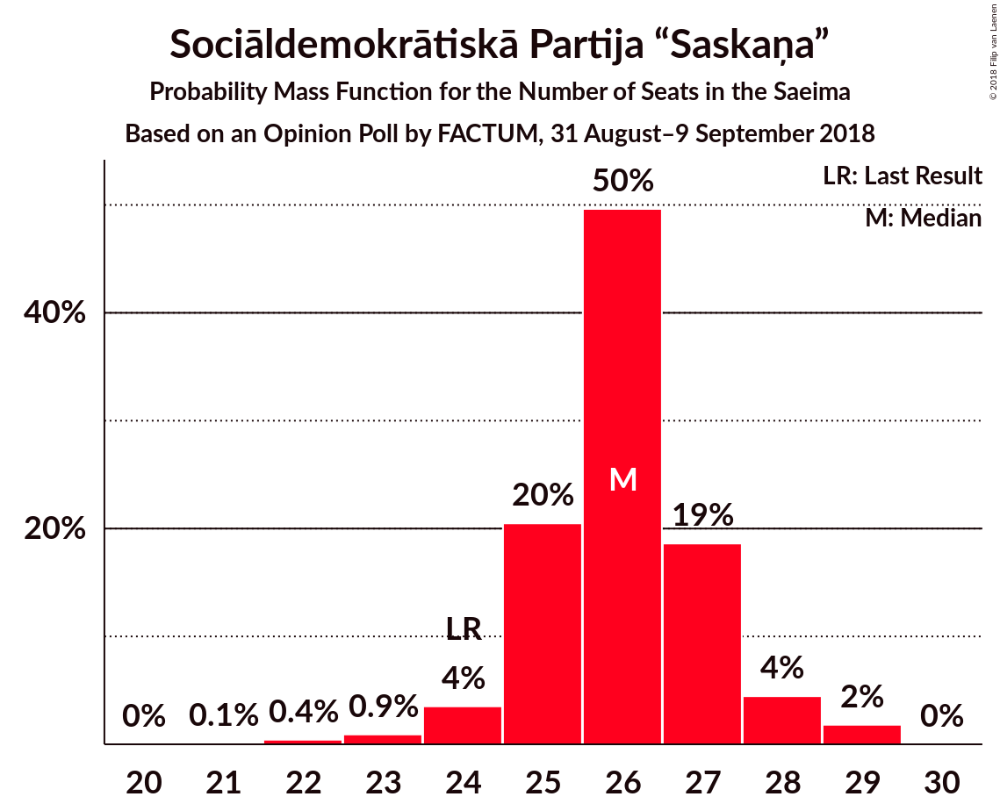
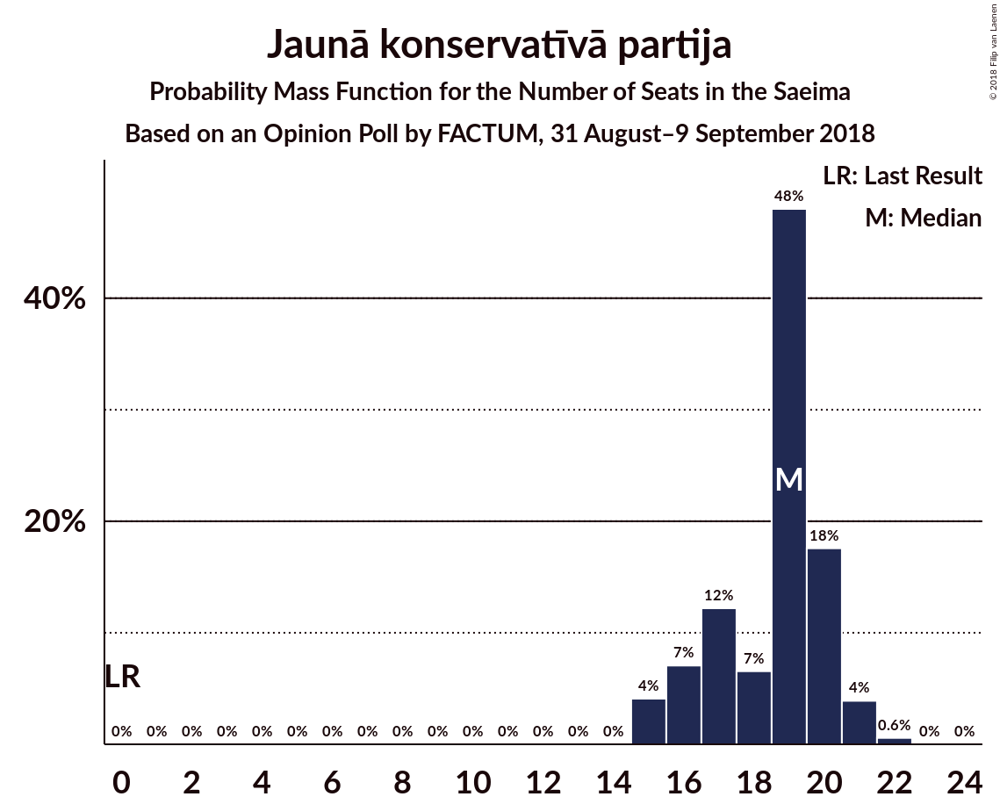
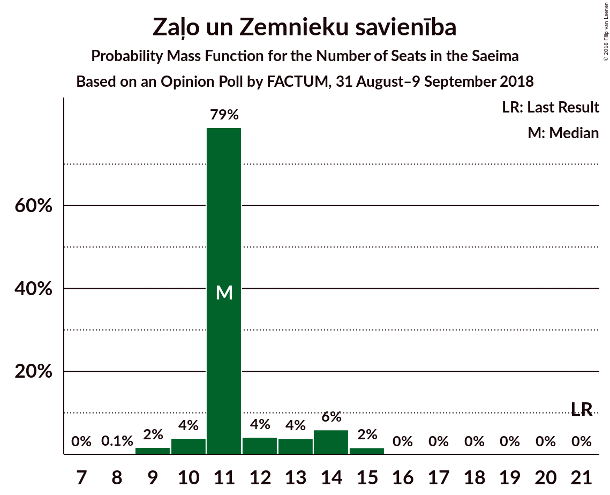
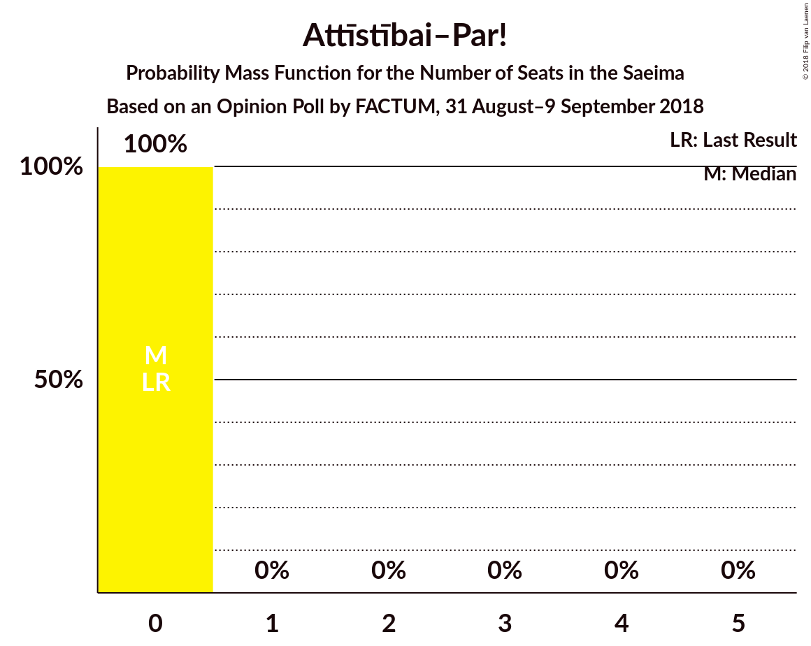

# Opinion Poll by FACTUM, 31 August–9 September 2018

<a href="#voting-intentions">Voting Intentions</a> | <a href="#seats">Seats</a> | <a href="#coalitions">Coalitions</a> | <a href="#technical-information">Technical Information</a>

## Voting Intentions

### Confidence Intervals

| Party | Last Result | Poll Result | 80% Confidence Interval | 90% Confidence Interval | 95% Confidence Interval | 99% Confidence Interval |
|:-----:|:-----------:|:-----------:|:-----------------------:|:-----------------------:|:-----------------------:|:-----------------------:|
| Sociāldemokrātiskā Partija “Saskaņa” | 23.0% | 20.6% | 19.2–22.1% |18.8–22.5% |18.5–22.9% |17.8–23.6% |
| Jaunā konservatīvā partija | 0.7% | 14.7% | 13.5–16.0% |13.2–16.4% |12.9–16.7% |12.3–17.4% |
| Nacionālā apvienība „Visu Latvijai!”–„Tēvzemei un Brīvībai/LNNK” | 16.6% | 13.7% | 12.5–15.0% |12.2–15.4% |11.9–15.7% |11.4–16.3% |
| KPV LV | 0.0% | 12.8% | 11.6–14.0% |11.3–14.4% |11.1–14.7% |10.5–15.3% |
| Vienotība | 21.9% | 8.8% | 7.9–9.9% |7.6–10.2% |7.4–10.5% |7.0–11.0% |
| Zaļo un Zemnieku savienība | 19.5% | 8.8% | 7.9–9.9% |7.6–10.2% |7.4–10.5% |7.0–11.0% |
| Attīstībai–Par! | 0.9% | 8.8% | 7.9–9.9% |7.6–10.2% |7.4–10.5% |7.0–11.0% |
| Latvijas Reģionu apvienība | 6.7% | 3.9% | 3.3–4.7% |3.2–5.0% |3.0–5.2% |2.7–5.6% |
| Latvijas Krievu savienība | 1.6% | 2.9% | 2.4–3.6% |2.3–3.8% |2.1–4.0% |1.9–4.4% |
| Progresīvie | 0.0% | 1.9% | 1.5–2.5% |1.4–2.7% |1.3–2.9% |1.1–3.2% |

*Note:* The poll result column reflects the actual value used in the calculations. Published results may vary slightly, and in addition be rounded to fewer digits.

## Seats

### Confidence Intervals

| Party | Last Result | Median | 80% Confidence Interval | 90% Confidence Interval | 95% Confidence Interval | 99% Confidence Interval |
|:-----:|:-----------:|:------:|:-----------------------:|:-----------------------:|:-----------------------:|:-----------------------:|
| <a href="#sociāldemokrātiskā-partija-“saskaņa”">Sociāldemokrātiskā Partija “Saskaņa”</a> | 24 | 26 | 25–27 |25–28 |24–28 |22–29 |
| <a href="#jaunā-konservatīvā-partija">Jaunā konservatīvā partija</a> | 0 | 19 | 16–20 |16–20 |15–21 |15–22 |
| <a href="#nacionālā-apvienība-„visu-latvijai!”–„tēvzemei-un-brīvībai/lnnk”">Nacionālā apvienība „Visu Latvijai!”–„Tēvzemei un Brīvībai/LNNK”</a> | 17 | 18 | 16–18 |16–18 |15–18 |14–18 |
| <a href="#kpv-lv">KPV LV</a> | 0 | 15 | 14–17 |14–17 |14–17 |14–18 |
| <a href="#vienotība">Vienotība</a> | 23 | 12 | 10–12 |9–12 |9–13 |8–14 |
| <a href="#zaļo-un-zemnieku-savienība">Zaļo un Zemnieku savienība</a> | 21 | 11 | 11–13 |10–14 |10–14 |9–15 |
| <a href="#attīstībai–par!">Attīstībai–Par!</a> | 0 | 0 | 0 |0 |0 |0 |
| <a href="#latvijas-reģionu-apvienība">Latvijas Reģionu apvienība</a> | 8 | 0 | 0 |0 |0–7 |0–7 |
| <a href="#latvijas-krievu-savienība">Latvijas Krievu savienība</a> | 0 | 0 | 0 |0 |0 |0 |
| <a href="#progresīvie">Progresīvie</a> | 0 | 0 | 0 |0 |0 |0 |

### Sociāldemokrātiskā Partija “Saskaņa”

*For a full overview of the results for this party, see the [Sociāldemokrātiskā Partija “Saskaņa”](party-sociāldemokrātiskāpartija“saskaņa”.html) page.*

| Number of Seats | Probability | Accumulated | Special Marks |
|:---------------:|:-----------:|:-----------:|:-------------:|
| 21 | 0.1% | 100% |  |
| 22 | 0.4% | 99.9% |  |
| 23 | 0.9% | 99.5% |  |
| 24 | 4% | 98.5% | Last Result |
| 25 | 20% | 95% |  |
| 26 | 50% | 75% | Median |
| 27 | 19% | 25% |  |
| 28 | 4% | 6% |  |
| 29 | 2% | 2% |  |
| 30 | 0% | 0% |  |

### Jaunā konservatīvā partija

*For a full overview of the results for this party, see the [Jaunā konservatīvā partija](party-jaunākonservatīvāpartija.html) page.*

| Number of Seats | Probability | Accumulated | Special Marks |
|:---------------:|:-----------:|:-----------:|:-------------:|
| 0 | 0% | 100% | Last Result |
| 1 | 0% | 100% |  |
| 2 | 0% | 100% |  |
| 3 | 0% | 100% |  |
| 4 | 0% | 100% |  |
| 5 | 0% | 100% |  |
| 6 | 0% | 100% |  |
| 7 | 0% | 100% |  |
| 8 | 0% | 100% |  |
| 9 | 0% | 100% |  |
| 10 | 0% | 100% |  |
| 11 | 0% | 100% |  |
| 12 | 0% | 100% |  |
| 13 | 0% | 100% |  |
| 14 | 0% | 100% |  |
| 15 | 4% | 100% |  |
| 16 | 7% | 96% |  |
| 17 | 12% | 89% |  |
| 18 | 7% | 77% |  |
| 19 | 48% | 70% | Median |
| 20 | 18% | 22% |  |
| 21 | 4% | 4% |  |
| 22 | 0.6% | 0.6% |  |
| 23 | 0% | 0% |  |

### Nacionālā apvienība „Visu Latvijai!”–„Tēvzemei un Brīvībai/LNNK”

*For a full overview of the results for this party, see the [Nacionālā apvienība „Visu Latvijai!”–„Tēvzemei un Brīvībai/LNNK”](party-nacionālāapvienība„visulatvijai”–„tēvzemeiunbrīvībailnnk”.html) page.*

| Number of Seats | Probability | Accumulated | Special Marks |
|:---------------:|:-----------:|:-----------:|:-------------:|
| 14 | 0.5% | 100% |  |
| 15 | 3% | 99.5% |  |
| 16 | 10% | 97% |  |
| 17 | 37% | 87% | Last Result |
| 18 | 50% | 50% | Median |
| 19 | 0.3% | 0.4% |  |
| 20 | 0.1% | 0.1% |  |
| 21 | 0% | 0% |  |

### KPV LV

*For a full overview of the results for this party, see the [KPV LV](party-kpvlv.html) page.*

| Number of Seats | Probability | Accumulated | Special Marks |
|:---------------:|:-----------:|:-----------:|:-------------:|
| 0 | 0% | 100% | Last Result |
| 1 | 0% | 100% |  |
| 2 | 0% | 100% |  |
| 3 | 0% | 100% |  |
| 4 | 0% | 100% |  |
| 5 | 0% | 100% |  |
| 6 | 0% | 100% |  |
| 7 | 0% | 100% |  |
| 8 | 0% | 100% |  |
| 9 | 0% | 100% |  |
| 10 | 0% | 100% |  |
| 11 | 0% | 100% |  |
| 12 | 0.2% | 100% |  |
| 13 | 0.3% | 99.8% |  |
| 14 | 11% | 99.5% |  |
| 15 | 55% | 89% | Median |
| 16 | 12% | 34% |  |
| 17 | 19% | 22% |  |
| 18 | 2% | 2% |  |
| 19 | 0% | 0% |  |

### Vienotība

*For a full overview of the results for this party, see the [Vienotība](party-vienotība.html) page.*

| Number of Seats | Probability | Accumulated | Special Marks |
|:---------------:|:-----------:|:-----------:|:-------------:|
| 8 | 0.9% | 100% |  |
| 9 | 5% | 99.1% |  |
| 10 | 34% | 94% |  |
| 11 | 6% | 60% |  |
| 12 | 50% | 54% | Median |
| 13 | 4% | 4% |  |
| 14 | 0.7% | 0.8% |  |
| 15 | 0.1% | 0.1% |  |
| 16 | 0% | 0% |  |
| 17 | 0% | 0% |  |
| 18 | 0% | 0% |  |
| 19 | 0% | 0% |  |
| 20 | 0% | 0% |  |
| 21 | 0% | 0% |  |
| 22 | 0% | 0% |  |
| 23 | 0% | 0% | Last Result |

### Zaļo un Zemnieku savienība

*For a full overview of the results for this party, see the [Zaļo un Zemnieku savienība](party-zaļounzemniekusavienība.html) page.*

| Number of Seats | Probability | Accumulated | Special Marks |
|:---------------:|:-----------:|:-----------:|:-------------:|
| 8 | 0.1% | 100% |  |
| 9 | 2% | 99.9% |  |
| 10 | 4% | 98% |  |
| 11 | 79% | 94% | Median |
| 12 | 4% | 15% |  |
| 13 | 4% | 11% |  |
| 14 | 6% | 8% |  |
| 15 | 2% | 2% |  |
| 16 | 0% | 0% |  |
| 17 | 0% | 0% |  |
| 18 | 0% | 0% |  |
| 19 | 0% | 0% |  |
| 20 | 0% | 0% |  |
| 21 | 0% | 0% | Last Result |

### Attīstībai–Par!

*For a full overview of the results for this party, see the [Attīstībai–Par!](party-attīstībai–par.html) page.*

| Number of Seats | Probability | Accumulated | Special Marks |
|:---------------:|:-----------:|:-----------:|:-------------:|
| 0 | 100% | 100% | Last Result, Median |

### Latvijas Reģionu apvienība

*For a full overview of the results for this party, see the [Latvijas Reģionu apvienība](party-latvijasreģionuapvienība.html) page.*

| Number of Seats | Probability | Accumulated | Special Marks |
|:---------------:|:-----------:|:-----------:|:-------------:|
| 0 | 97% | 100% | Median |
| 1 | 0% | 3% |  |
| 2 | 0% | 3% |  |
| 3 | 0% | 3% |  |
| 4 | 0% | 3% |  |
| 5 | 0% | 3% |  |
| 6 | 0% | 3% |  |
| 7 | 3% | 3% |  |
| 8 | 0% | 0% | Last Result |

### Latvijas Krievu savienība

*For a full overview of the results for this party, see the [Latvijas Krievu savienība](party-latvijaskrievusavienība.html) page.*

| Number of Seats | Probability | Accumulated | Special Marks |
|:---------------:|:-----------:|:-----------:|:-------------:|
| 0 | 100% | 100% | Last Result, Median |

### Progresīvie

*For a full overview of the results for this party, see the [Progresīvie](party-progresīvie.html) page.*

| Number of Seats | Probability | Accumulated | Special Marks |
|:---------------:|:-----------:|:-----------:|:-------------:|
| 0 | 100% | 100% | Last Result, Median |

## Coalitions

### Confidence Intervals

| Coalition | Last Result | Median | Majority? | 80% Confidence Interval | 90% Confidence Interval | 95% Confidence Interval | 99% Confidence Interval |
|:---------:|:-----------:|:------:|:---------:|:-----------------------:|:-----------------------:|:-----------------------:|:-----------------------:|
| Jaunā konservatīvā partija – Nacionālā apvienība „Visu Latvijai!”–„Tēvzemei un Brīvībai/LNNK” – Attīstībai–Par! – Vienotība – Zaļo un Zemnieku savienība | 61 | 59 | 100% | 56–60 | 55–61 | 55–61 | 53–62 |
| Jaunā konservatīvā partija – Nacionālā apvienība „Visu Latvijai!”–„Tēvzemei un Brīvībai/LNNK” – Vienotība – Zaļo un Zemnieku savienība | 61 | 59 | 100% | 56–60 | 55–61 | 55–61 | 53–62 |
| Sociāldemokrātiskā Partija “Saskaņa” – KPV LV – Zaļo un Zemnieku savienība | 45 | 52 | 95% | 51–55 | 51–56 | 50–57 | 48–58 |
| Jaunā konservatīvā partija – Nacionālā apvienība „Visu Latvijai!”–„Tēvzemei un Brīvībai/LNNK” – Attīstībai–Par! – Zaļo un Zemnieku savienība | 38 | 47 | 2% | 45–49 | 45–50 | 44–50 | 42–51 |
| Jaunā konservatīvā partija – Nacionālā apvienība „Visu Latvijai!”–„Tēvzemei un Brīvībai/LNNK” – Zaļo un Zemnieku savienība | 38 | 47 | 2% | 45–49 | 45–50 | 44–50 | 42–51 |
| Jaunā konservatīvā partija – Nacionālā apvienība „Visu Latvijai!”–„Tēvzemei un Brīvībai/LNNK” – Attīstībai–Par! – Vienotība | 40 | 48 | 0.3% | 45–49 | 44–49 | 43–50 | 42–50 |
| Sociāldemokrātiskā Partija “Saskaņa” – Jaunā konservatīvā partija – Attīstībai–Par! | 24 | 45 | 0% | 43–46 | 42–46 | 41–46 | 39–47 |
| Sociāldemokrātiskā Partija “Saskaņa” – KPV LV | 24 | 41 | 0% | 40–44 | 39–44 | 39–45 | 38–45 |
| Nacionālā apvienība „Visu Latvijai!”–„Tēvzemei un Brīvībai/LNNK” – Attīstībai–Par! – Vienotība – Zaļo un Zemnieku savienība | 61 | 40 | 0% | 39–41 | 38–42 | 37–43 | 36–44 |
| Nacionālā apvienība „Visu Latvijai!”–„Tēvzemei un Brīvībai/LNNK” – Vienotība – Zaļo un Zemnieku savienība | 61 | 40 | 0% | 39–41 | 38–42 | 37–43 | 36–44 |
| Nacionālā apvienība „Visu Latvijai!”–„Tēvzemei un Brīvībai/LNNK” – Attīstībai–Par! – Zaļo un Zemnieku savienība | 38 | 29 | 0% | 27–30 | 27–31 | 26–32 | 25–33 |
| Sociāldemokrātiskā Partija “Saskaņa” – Attīstībai–Par! | 24 | 26 | 0% | 25–27 | 25–28 | 24–28 | 22–29 |

### Jaunā konservatīvā partija – Nacionālā apvienība „Visu Latvijai!”–„Tēvzemei un Brīvībai/LNNK” – Attīstībai–Par! – Vienotība – Zaļo un Zemnieku savienība

| Number of Seats | Probability | Accumulated | Special Marks |
|:---------------:|:-----------:|:-----------:|:-------------:|
| 52 | 0.1% | 100% |  |
| 53 | 0.4% | 99.9% |  |
| 54 | 2% | 99.5% |  |
| 55 | 3% | 98% |  |
| 56 | 12% | 95% |  |
| 57 | 10% | 82% |  |
| 58 | 9% | 72% |  |
| 59 | 46% | 63% |  |
| 60 | 12% | 17% | Median |
| 61 | 4% | 5% | Last Result |
| 62 | 0.7% | 0.9% |  |
| 63 | 0.1% | 0.1% |  |
| 64 | 0% | 0% |  |

### Jaunā konservatīvā partija – Nacionālā apvienība „Visu Latvijai!”–„Tēvzemei un Brīvībai/LNNK” – Vienotība – Zaļo un Zemnieku savienība

| Number of Seats | Probability | Accumulated | Special Marks |
|:---------------:|:-----------:|:-----------:|:-------------:|
| 52 | 0.1% | 100% |  |
| 53 | 0.4% | 99.9% |  |
| 54 | 2% | 99.5% |  |
| 55 | 3% | 98% |  |
| 56 | 12% | 95% |  |
| 57 | 10% | 82% |  |
| 58 | 9% | 72% |  |
| 59 | 46% | 63% |  |
| 60 | 12% | 17% | Median |
| 61 | 4% | 5% | Last Result |
| 62 | 0.7% | 0.9% |  |
| 63 | 0.1% | 0.1% |  |
| 64 | 0% | 0% |  |

### Sociāldemokrātiskā Partija “Saskaņa” – KPV LV – Zaļo un Zemnieku savienība

| Number of Seats | Probability | Accumulated | Special Marks |
|:---------------:|:-----------:|:-----------:|:-------------:|
| 45 | 0% | 100% | Last Result |
| 46 | 0.1% | 100% |  |
| 47 | 0.2% | 99.9% |  |
| 48 | 0.3% | 99.7% |  |
| 49 | 0.9% | 99.4% |  |
| 50 | 3% | 98% |  |
| 51 | 11% | 95% | Majority |
| 52 | 46% | 84% | Median |
| 53 | 8% | 38% |  |
| 54 | 9% | 30% |  |
| 55 | 15% | 21% |  |
| 56 | 3% | 6% |  |
| 57 | 2% | 3% |  |
| 58 | 0.7% | 0.8% |  |
| 59 | 0.1% | 0.1% |  |
| 60 | 0% | 0% |  |

### Jaunā konservatīvā partija – Nacionālā apvienība „Visu Latvijai!”–„Tēvzemei un Brīvībai/LNNK” – Attīstībai–Par! – Zaļo un Zemnieku savienība

| Number of Seats | Probability | Accumulated | Special Marks |
|:---------------:|:-----------:|:-----------:|:-------------:|
| 38 | 0% | 100% | Last Result |
| 39 | 0% | 100% |  |
| 40 | 0% | 100% |  |
| 41 | 0.1% | 100% |  |
| 42 | 0.6% | 99.9% |  |
| 43 | 0.6% | 99.3% |  |
| 44 | 2% | 98.6% |  |
| 45 | 9% | 97% |  |
| 46 | 15% | 87% |  |
| 47 | 36% | 72% |  |
| 48 | 15% | 36% | Median |
| 49 | 14% | 21% |  |
| 50 | 5% | 7% |  |
| 51 | 2% | 2% | Majority |
| 52 | 0.4% | 0.4% |  |
| 53 | 0% | 0% |  |

### Jaunā konservatīvā partija – Nacionālā apvienība „Visu Latvijai!”–„Tēvzemei un Brīvībai/LNNK” – Zaļo un Zemnieku savienība

| Number of Seats | Probability | Accumulated | Special Marks |
|:---------------:|:-----------:|:-----------:|:-------------:|
| 38 | 0% | 100% | Last Result |
| 39 | 0% | 100% |  |
| 40 | 0% | 100% |  |
| 41 | 0.1% | 100% |  |
| 42 | 0.6% | 99.9% |  |
| 43 | 0.6% | 99.3% |  |
| 44 | 2% | 98.6% |  |
| 45 | 9% | 97% |  |
| 46 | 15% | 87% |  |
| 47 | 36% | 72% |  |
| 48 | 15% | 36% | Median |
| 49 | 14% | 21% |  |
| 50 | 5% | 7% |  |
| 51 | 2% | 2% | Majority |
| 52 | 0.4% | 0.4% |  |
| 53 | 0% | 0% |  |

### Jaunā konservatīvā partija – Nacionālā apvienība „Visu Latvijai!”–„Tēvzemei un Brīvībai/LNNK” – Attīstībai–Par! – Vienotība

| Number of Seats | Probability | Accumulated | Special Marks |
|:---------------:|:-----------:|:-----------:|:-------------:|
| 40 | 0% | 100% | Last Result |
| 41 | 0.2% | 100% |  |
| 42 | 1.1% | 99.8% |  |
| 43 | 3% | 98.7% |  |
| 44 | 3% | 96% |  |
| 45 | 16% | 92% |  |
| 46 | 9% | 76% |  |
| 47 | 8% | 67% |  |
| 48 | 46% | 59% |  |
| 49 | 11% | 13% | Median |
| 50 | 2% | 3% |  |
| 51 | 0.3% | 0.3% | Majority |
| 52 | 0% | 0% |  |

### Sociāldemokrātiskā Partija “Saskaņa” – Jaunā konservatīvā partija – Attīstībai–Par!

| Number of Seats | Probability | Accumulated | Special Marks |
|:---------------:|:-----------:|:-----------:|:-------------:|
| 24 | 0% | 100% | Last Result |
| 25 | 0% | 100% |  |
| 26 | 0% | 100% |  |
| 27 | 0% | 100% |  |
| 28 | 0% | 100% |  |
| 29 | 0% | 100% |  |
| 30 | 0% | 100% |  |
| 31 | 0% | 100% |  |
| 32 | 0% | 100% |  |
| 33 | 0% | 100% |  |
| 34 | 0% | 100% |  |
| 35 | 0% | 100% |  |
| 36 | 0% | 100% |  |
| 37 | 0.1% | 100% |  |
| 38 | 0% | 99.9% |  |
| 39 | 2% | 99.9% |  |
| 40 | 0.4% | 98% |  |
| 41 | 1.2% | 98% |  |
| 42 | 5% | 97% |  |
| 43 | 6% | 92% |  |
| 44 | 24% | 86% |  |
| 45 | 38% | 62% | Median |
| 46 | 22% | 24% |  |
| 47 | 2% | 2% |  |
| 48 | 0.4% | 0.4% |  |
| 49 | 0% | 0.1% |  |
| 50 | 0% | 0% |  |

### Sociāldemokrātiskā Partija “Saskaņa” – KPV LV

| Number of Seats | Probability | Accumulated | Special Marks |
|:---------------:|:-----------:|:-----------:|:-------------:|
| 24 | 0% | 100% | Last Result |
| 25 | 0% | 100% |  |
| 26 | 0% | 100% |  |
| 27 | 0% | 100% |  |
| 28 | 0% | 100% |  |
| 29 | 0% | 100% |  |
| 30 | 0% | 100% |  |
| 31 | 0% | 100% |  |
| 32 | 0% | 100% |  |
| 33 | 0% | 100% |  |
| 34 | 0% | 100% |  |
| 35 | 0% | 100% |  |
| 36 | 0.2% | 100% |  |
| 37 | 0.2% | 99.7% |  |
| 38 | 1.3% | 99.5% |  |
| 39 | 6% | 98% |  |
| 40 | 12% | 92% |  |
| 41 | 46% | 80% | Median |
| 42 | 9% | 34% |  |
| 43 | 10% | 25% |  |
| 44 | 12% | 15% |  |
| 45 | 3% | 3% |  |
| 46 | 0.2% | 0.3% |  |
| 47 | 0% | 0% |  |

### Nacionālā apvienība „Visu Latvijai!”–„Tēvzemei un Brīvībai/LNNK” – Attīstībai–Par! – Vienotība – Zaļo un Zemnieku savienība

| Number of Seats | Probability | Accumulated | Special Marks |
|:---------------:|:-----------:|:-----------:|:-------------:|
| 34 | 0.1% | 100% |  |
| 35 | 0.4% | 99.9% |  |
| 36 | 0.5% | 99.6% |  |
| 37 | 3% | 99.1% |  |
| 38 | 5% | 97% |  |
| 39 | 35% | 92% |  |
| 40 | 36% | 57% |  |
| 41 | 14% | 21% | Median |
| 42 | 4% | 7% |  |
| 43 | 2% | 3% |  |
| 44 | 0.6% | 0.9% |  |
| 45 | 0.2% | 0.3% |  |
| 46 | 0% | 0% |  |
| 47 | 0% | 0% |  |
| 48 | 0% | 0% |  |
| 49 | 0% | 0% |  |
| 50 | 0% | 0% |  |
| 51 | 0% | 0% | Majority |
| 52 | 0% | 0% |  |
| 53 | 0% | 0% |  |
| 54 | 0% | 0% |  |
| 55 | 0% | 0% |  |
| 56 | 0% | 0% |  |
| 57 | 0% | 0% |  |
| 58 | 0% | 0% |  |
| 59 | 0% | 0% |  |
| 60 | 0% | 0% |  |
| 61 | 0% | 0% | Last Result |

### Nacionālā apvienība „Visu Latvijai!”–„Tēvzemei un Brīvībai/LNNK” – Vienotība – Zaļo un Zemnieku savienība

| Number of Seats | Probability | Accumulated | Special Marks |
|:---------------:|:-----------:|:-----------:|:-------------:|
| 34 | 0.1% | 100% |  |
| 35 | 0.4% | 99.9% |  |
| 36 | 0.5% | 99.6% |  |
| 37 | 3% | 99.1% |  |
| 38 | 5% | 97% |  |
| 39 | 35% | 92% |  |
| 40 | 36% | 57% |  |
| 41 | 14% | 21% | Median |
| 42 | 4% | 7% |  |
| 43 | 2% | 3% |  |
| 44 | 0.6% | 0.9% |  |
| 45 | 0.2% | 0.3% |  |
| 46 | 0% | 0% |  |
| 47 | 0% | 0% |  |
| 48 | 0% | 0% |  |
| 49 | 0% | 0% |  |
| 50 | 0% | 0% |  |
| 51 | 0% | 0% | Majority |
| 52 | 0% | 0% |  |
| 53 | 0% | 0% |  |
| 54 | 0% | 0% |  |
| 55 | 0% | 0% |  |
| 56 | 0% | 0% |  |
| 57 | 0% | 0% |  |
| 58 | 0% | 0% |  |
| 59 | 0% | 0% |  |
| 60 | 0% | 0% |  |
| 61 | 0% | 0% | Last Result |

### Nacionālā apvienība „Visu Latvijai!”–„Tēvzemei un Brīvībai/LNNK” – Attīstībai–Par! – Zaļo un Zemnieku savienība

| Number of Seats | Probability | Accumulated | Special Marks |
|:---------------:|:-----------:|:-----------:|:-------------:|
| 24 | 0.1% | 100% |  |
| 25 | 0.9% | 99.9% |  |
| 26 | 3% | 99.0% |  |
| 27 | 7% | 96% |  |
| 28 | 34% | 89% |  |
| 29 | 43% | 55% | Median |
| 30 | 6% | 13% |  |
| 31 | 4% | 7% |  |
| 32 | 2% | 3% |  |
| 33 | 0.7% | 0.7% |  |
| 34 | 0% | 0% |  |
| 35 | 0% | 0% |  |
| 36 | 0% | 0% |  |
| 37 | 0% | 0% |  |
| 38 | 0% | 0% | Last Result |

### Sociāldemokrātiskā Partija “Saskaņa” – Attīstībai–Par!

| Number of Seats | Probability | Accumulated | Special Marks |
|:---------------:|:-----------:|:-----------:|:-------------:|
| 21 | 0.1% | 100% |  |
| 22 | 0.4% | 99.9% |  |
| 23 | 0.9% | 99.5% |  |
| 24 | 4% | 98.5% | Last Result |
| 25 | 20% | 95% |  |
| 26 | 50% | 75% | Median |
| 27 | 19% | 25% |  |
| 28 | 4% | 6% |  |
| 29 | 2% | 2% |  |
| 30 | 0% | 0% |  |

## Technical Information

### Opinion Poll

+ **Polling firm:** FACTUM
+ **Commissioner(s):** —
+ **Fieldwork period:** 31 August–9 September 2018

### Calculations

+ **Sample size:** 1293
+ **Simulations done:** 1,048,576
+ **Error estimate:** 1.59%

