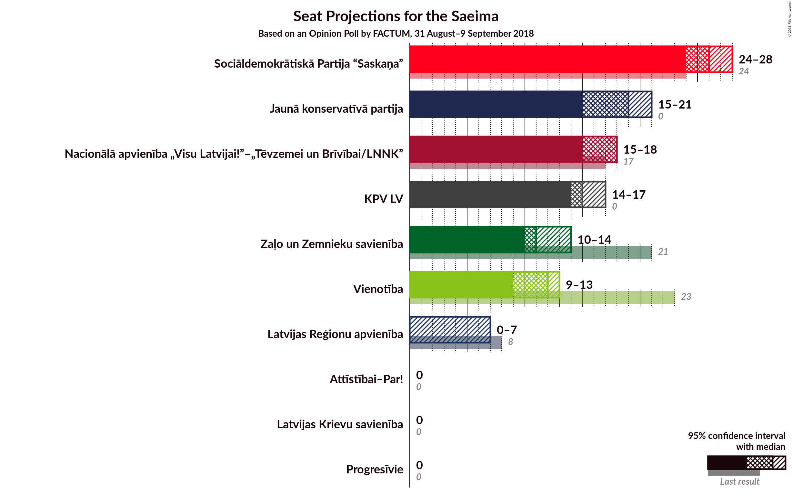
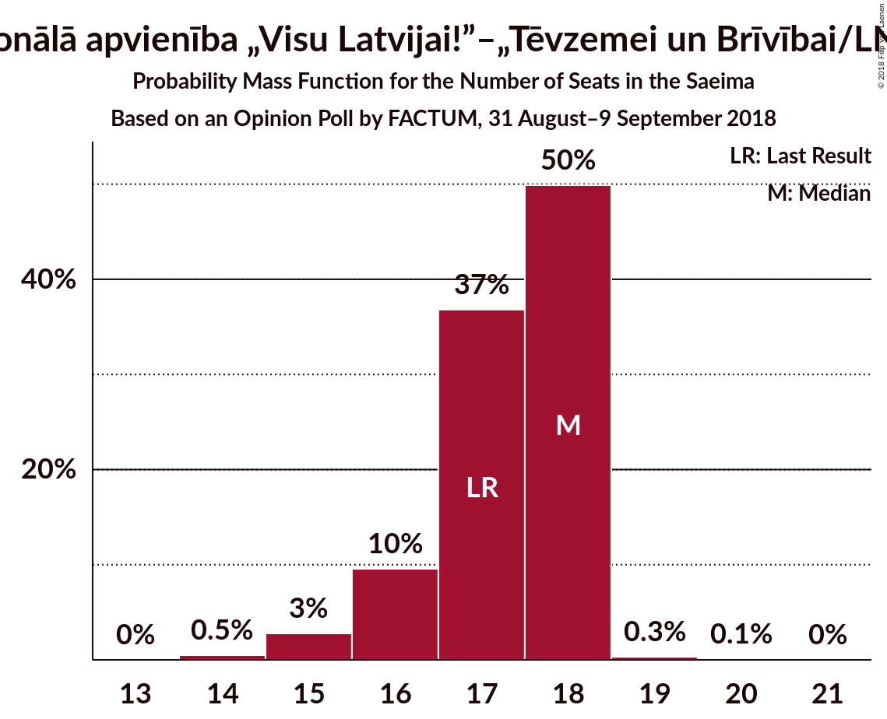
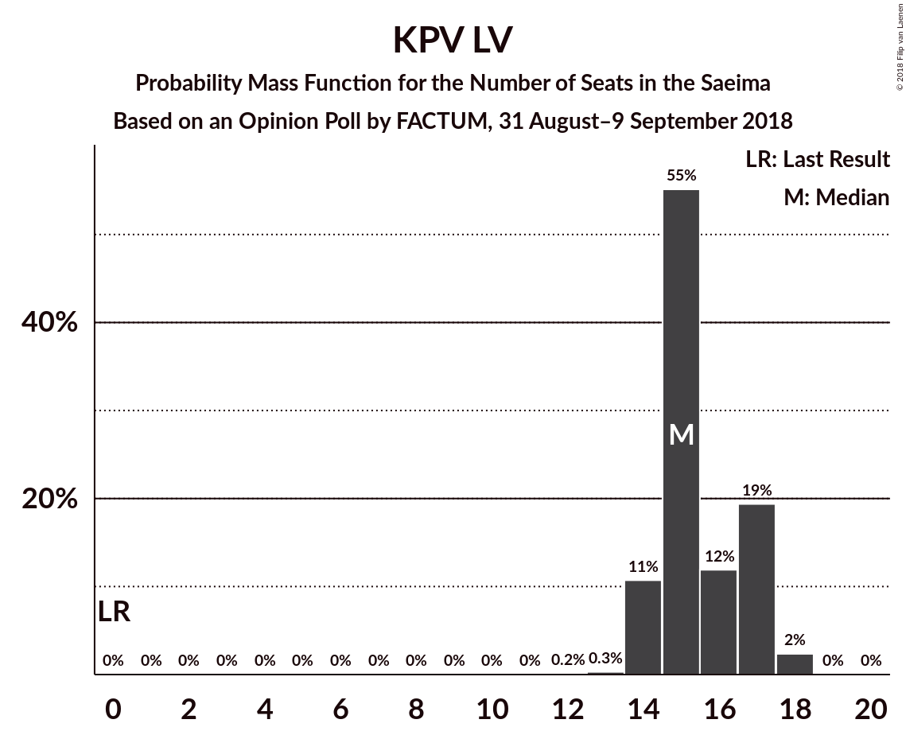
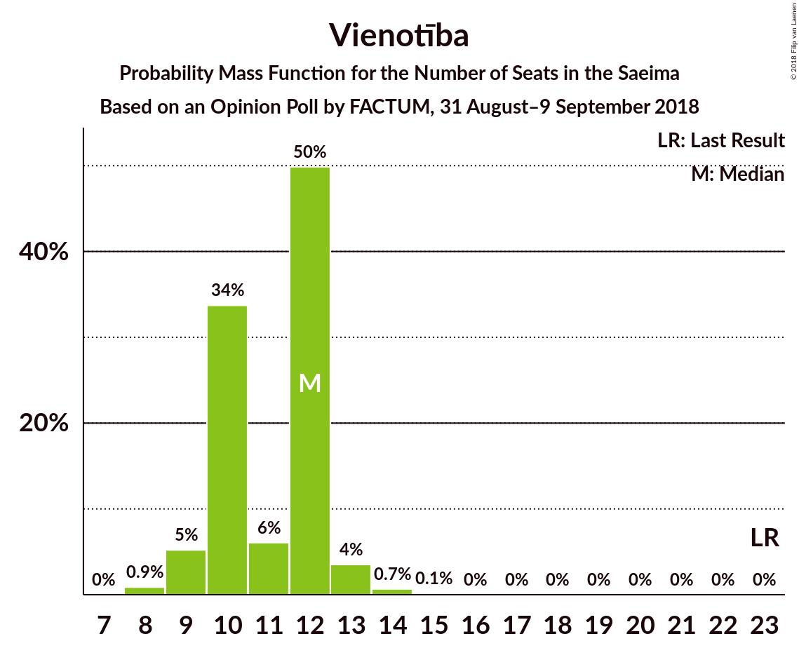

# Opinion Poll by FACTUM, 31 August–9 September 2018

<a href="#voting-intentions">Voting Intentions</a> | <a href="#seats">Seats</a> | <a href="#coalitions">Coalitions</a> | <a href="#technical-information">Technical Information</a>

## Voting Intentions

### Confidence Intervals

| Party | Last Result | Poll Result | 80% Confidence Interval | 90% Confidence Interval | 95% Confidence Interval | 99% Confidence Interval |
|:-----:|:-----------:|:-----------:|:-----------------------:|:-----------------------:|:-----------------------:|:-----------------------:|
| Sociāldemokrātiskā Partija “Saskaņa” | 23.0% | 20.6% | 19.6–22.5% |19.2–23.0% |18.9–23.3% |18.2–24.1% |
| Jaunā konservatīvā partija | 0.7% | 14.7% | 13.8–16.4% |13.4–16.7% |13.2–17.1% |12.6–17.7% |
| Nacionālā apvienība „Visu Latvijai!”–„Tēvzemei un Brīvībai/LNNK” | 16.6% | 13.7% | 12.8–15.3% |12.5–15.7% |12.2–16.0% |11.7–16.6% |
| KPV LV | 0.0% | 12.8% | 11.9–14.3% |11.5–14.6% |11.3–14.9% |10.7–15.6% |
| Vienotība | 21.9% | 8.8% | 8.0–10.1% |7.8–10.4% |7.5–10.7% |7.1–11.2% |
| Zaļo un Zemnieku savienība | 19.5% | 8.8% | 8.0–10.1% |7.8–10.4% |7.5–10.7% |7.1–11.2% |
| Attīstībai–Par! | 0.9% | 8.8% | 8.0–10.1% |7.8–10.4% |7.5–10.7% |7.1–11.2% |
| Latvijas Reģionu apvienība | 6.7% | 3.9% | 3.4–4.8% |3.2–5.0% |3.1–5.2% |2.8–5.7% |
| Latvijas Krievu savienība | 1.6% | 2.9% | 2.5–3.7% |2.3–3.9% |2.2–4.1% |2.0–4.5% |
| Progresīvie | 0.0% | 1.9% | N/A |N/A |N/A |N/A |

*Note:* The poll result column reflects the actual value used in the calculations. Published results may vary slightly, and in addition be rounded to fewer digits.

## Seats

### Confidence Intervals

| Party | Last Result | Median | 80% Confidence Interval | 90% Confidence Interval | 95% Confidence Interval | 99% Confidence Interval |
|:-----:|:-----------:|:------:|:-----------------------:|:-----------------------:|:-----------------------:|:-----------------------:|
| <a href="#sociāldemokrātiskā-partija-“saskaņa”">Sociāldemokrātiskā Partija “Saskaņa”</a> | 24 | 24 | 22–25 |21–26 |21–26 |20–28 |
| <a href="#jaunā-konservatīvā-partija">Jaunā konservatīvā partija</a> | 0 | 15 | 15–19 |15–19 |15–20 |14–20 |
| <a href="#nacionālā-apvienība-„visu-latvijai!”–„tēvzemei-un-brīvībai/lnnk”">Nacionālā apvienība „Visu Latvijai!”–„Tēvzemei un Brīvībai/LNNK”</a> | 17 | 16 | 14–18 |14–18 |13–18 |13–18 |
| <a href="#kpv-lv">KPV LV</a> | 0 | 14 | 13–15 |12–16 |12–17 |11–17 |
| <a href="#vienotība">Vienotība</a> | 23 | 10 | 8–11 |8–12 |8–12 |7–12 |
| <a href="#zaļo-un-zemnieku-savienība">Zaļo un Zemnieku savienība</a> | 21 | 11 | 10–11 |10–11 |8–12 |8–15 |
| <a href="#attīstībai–par!">Attīstībai–Par!</a> | 0 | 9 | 9–11 |8–12 |8–12 |7–13 |
| <a href="#latvijas-reģionu-apvienība">Latvijas Reģionu apvienība</a> | 8 | 0 | 0 |0 |0–7 |0–7 |
| <a href="#latvijas-krievu-savienība">Latvijas Krievu savienība</a> | 0 | 0 | 0 |0 |0 |0 |
| <a href="#progresīvie">Progresīvie</a> | 0 | N/A | N/A |N/A |N/A |N/A |

### Sociāldemokrātiskā Partija “Saskaņa”

*For a full overview of the results for this party, see the [Sociāldemokrātiskā Partija “Saskaņa”](party-sociāldemokrātiskāpartija“saskaņa”.html) page.*

| Number of Seats | Probability | Accumulated | Special Marks |
|:---------------:|:-----------:|:-----------:|:-------------:|
| 19 | 0.1% | 100% |  |
| 20 | 1.3% | 99.9% |  |
| 21 | 4% | 98.6% |  |
| 22 | 20% | 95% |  |
| 23 | 13% | 75% |  |
| 24 | 47% | 62% | Last Result, Median |
| 25 | 8% | 15% |  |
| 26 | 5% | 7% |  |
| 27 | 2% | 2% |  |
| 28 | 0.5% | 0.5% |  |
| 29 | 0% | 0% |  |

### Jaunā konservatīvā partija

*For a full overview of the results for this party, see the [Jaunā konservatīvā partija](party-jaunākonservatīvāpartija.html) page.*

| Number of Seats | Probability | Accumulated | Special Marks |
|:---------------:|:-----------:|:-----------:|:-------------:|
| 0 | 0% | 100% | Last Result |
| 1 | 0% | 100% |  |
| 2 | 0% | 100% |  |
| 3 | 0% | 100% |  |
| 4 | 0% | 100% |  |
| 5 | 0% | 100% |  |
| 6 | 0% | 100% |  |
| 7 | 0% | 100% |  |
| 8 | 0% | 100% |  |
| 9 | 0% | 100% |  |
| 10 | 0% | 100% |  |
| 11 | 0% | 100% |  |
| 12 | 0% | 100% |  |
| 13 | 0.4% | 100% |  |
| 14 | 2% | 99.6% |  |
| 15 | 59% | 98% | Median |
| 16 | 8% | 39% |  |
| 17 | 11% | 31% |  |
| 18 | 9% | 20% |  |
| 19 | 7% | 11% |  |
| 20 | 4% | 5% |  |
| 21 | 0.2% | 0.2% |  |
| 22 | 0% | 0% |  |

### Nacionālā apvienība „Visu Latvijai!”–„Tēvzemei un Brīvībai/LNNK”

*For a full overview of the results for this party, see the [Nacionālā apvienība „Visu Latvijai!”–„Tēvzemei un Brīvībai/LNNK”](party-nacionālāapvienība„visulatvijai”–„tēvzemeiunbrīvībailnnk”.html) page.*

| Number of Seats | Probability | Accumulated | Special Marks |
|:---------------:|:-----------:|:-----------:|:-------------:|
| 12 | 0.3% | 100% |  |
| 13 | 4% | 99.7% |  |
| 14 | 19% | 95% |  |
| 15 | 19% | 77% |  |
| 16 | 34% | 58% | Median |
| 17 | 13% | 24% | Last Result |
| 18 | 11% | 11% |  |
| 19 | 0% | 0% |  |

### KPV LV

*For a full overview of the results for this party, see the [KPV LV](party-kpvlv.html) page.*

| Number of Seats | Probability | Accumulated | Special Marks |
|:---------------:|:-----------:|:-----------:|:-------------:|
| 0 | 0% | 100% | Last Result |
| 1 | 0% | 100% |  |
| 2 | 0% | 100% |  |
| 3 | 0% | 100% |  |
| 4 | 0% | 100% |  |
| 5 | 0% | 100% |  |
| 6 | 0% | 100% |  |
| 7 | 0% | 100% |  |
| 8 | 0% | 100% |  |
| 9 | 0% | 100% |  |
| 10 | 0.3% | 100% |  |
| 11 | 0.3% | 99.7% |  |
| 12 | 7% | 99.4% |  |
| 13 | 8% | 93% |  |
| 14 | 40% | 85% | Median |
| 15 | 37% | 46% |  |
| 16 | 5% | 9% |  |
| 17 | 3% | 3% |  |
| 18 | 0% | 0% |  |

### Vienotība

*For a full overview of the results for this party, see the [Vienotība](party-vienotība.html) page.*

| Number of Seats | Probability | Accumulated | Special Marks |
|:---------------:|:-----------:|:-----------:|:-------------:|
| 7 | 2% | 100% |  |
| 8 | 12% | 98% |  |
| 9 | 13% | 86% |  |
| 10 | 59% | 73% | Median |
| 11 | 6% | 14% |  |
| 12 | 7% | 8% |  |
| 13 | 0.2% | 0.4% |  |
| 14 | 0.1% | 0.1% |  |
| 15 | 0% | 0% |  |
| 16 | 0% | 0% |  |
| 17 | 0% | 0% |  |
| 18 | 0% | 0% |  |
| 19 | 0% | 0% |  |
| 20 | 0% | 0% |  |
| 21 | 0% | 0% |  |
| 22 | 0% | 0% |  |
| 23 | 0% | 0% | Last Result |

### Zaļo un Zemnieku savienība

*For a full overview of the results for this party, see the [Zaļo un Zemnieku savienība](party-zaļounzemniekusavienība.html) page.*

| Number of Seats | Probability | Accumulated | Special Marks |
|:---------------:|:-----------:|:-----------:|:-------------:|
| 7 | 0.2% | 100% |  |
| 8 | 3% | 99.8% |  |
| 9 | 2% | 97% |  |
| 10 | 14% | 95% |  |
| 11 | 78% | 81% | Median |
| 12 | 0.9% | 3% |  |
| 13 | 0.6% | 2% |  |
| 14 | 0.9% | 1.4% |  |
| 15 | 0.5% | 0.5% |  |
| 16 | 0% | 0% |  |
| 17 | 0% | 0% |  |
| 18 | 0% | 0% |  |
| 19 | 0% | 0% |  |
| 20 | 0% | 0% |  |
| 21 | 0% | 0% | Last Result |

### Attīstībai–Par!

*For a full overview of the results for this party, see the [Attīstībai–Par!](party-attīstībai–par.html) page.*

| Number of Seats | Probability | Accumulated | Special Marks |
|:---------------:|:-----------:|:-----------:|:-------------:|
| 0 | 0% | 100% | Last Result |
| 1 | 0% | 100% |  |
| 2 | 0% | 100% |  |
| 3 | 0% | 100% |  |
| 4 | 0% | 100% |  |
| 5 | 0% | 100% |  |
| 6 | 0% | 100% |  |
| 7 | 0.8% | 100% |  |
| 8 | 9% | 99.2% |  |
| 9 | 41% | 90% | Median |
| 10 | 38% | 49% |  |
| 11 | 6% | 11% |  |
| 12 | 4% | 5% |  |
| 13 | 0.3% | 0.7% |  |
| 14 | 0.4% | 0.4% |  |
| 15 | 0% | 0% |  |

### Latvijas Reģionu apvienība

*For a full overview of the results for this party, see the [Latvijas Reģionu apvienība](party-latvijasreģionuapvienība.html) page.*

| Number of Seats | Probability | Accumulated | Special Marks |
|:---------------:|:-----------:|:-----------:|:-------------:|
| 0 | 96% | 100% | Median |
| 1 | 0% | 4% |  |
| 2 | 0% | 4% |  |
| 3 | 0% | 4% |  |
| 4 | 0% | 4% |  |
| 5 | 0% | 4% |  |
| 6 | 0.6% | 4% |  |
| 7 | 3% | 3% |  |
| 8 | 0% | 0% | Last Result |

### Latvijas Krievu savienība

*For a full overview of the results for this party, see the [Latvijas Krievu savienība](party-latvijaskrievusavienība.html) page.*

| Number of Seats | Probability | Accumulated | Special Marks |
|:---------------:|:-----------:|:-----------:|:-------------:|
| 0 | 100% | 100% | Last Result, Median |

## Coalitions

### Confidence Intervals

| Coalition | Last Result | Median | Majority? | 80% Confidence Interval | 90% Confidence Interval | 95% Confidence Interval | 99% Confidence Interval |
|:---------:|:-----------:|:------:|:---------:|:-----------------------:|:-----------------------:|:-----------------------:|:-----------------------:|
| Jaunā konservatīvā partija – Nacionālā apvienība „Visu Latvijai!”–„Tēvzemei un Brīvībai/LNNK” – Attīstībai–Par! – Vienotība – Zaļo un Zemnieku savienība | 61 | 61 | 100% | 60–64 | 59–65 | 57–65 | 56–66 |
| Jaunā konservatīvā partija – Nacionālā apvienība „Visu Latvijai!”–„Tēvzemei un Brīvībai/LNNK” – Vienotība – Zaļo un Zemnieku savienība | 61 | 52 | 86% | 50–54 | 49–55 | 48–56 | 47–57 |
| Jaunā konservatīvā partija – Nacionālā apvienība „Visu Latvijai!”–„Tēvzemei un Brīvībai/LNNK” – Attīstībai–Par! – Zaļo un Zemnieku savienība | 38 | 52 | 86% | 50–55 | 49–55 | 49–55 | 47–57 |
| Jaunā konservatīvā partija – Nacionālā apvienība „Visu Latvijai!”–„Tēvzemei un Brīvībai/LNNK” – Attīstībai–Par! – Vienotība | 40 | 51 | 53% | 50–53 | 48–54 | 47–55 | 46–56 |
| Nacionālā apvienība „Visu Latvijai!”–„Tēvzemei un Brīvībai/LNNK” – Attīstībai–Par! – Vienotība – Zaļo un Zemnieku savienība | 61 | 46 | 0.1% | 43–48 | 43–49 | 42–49 | 41–49 |
| Jaunā konservatīvā partija – Nacionālā apvienība „Visu Latvijai!”–„Tēvzemei un Brīvībai/LNNK” – Zaļo un Zemnieku savienība | 38 | 42 | 0% | 40–45 | 40–45 | 39–47 | 38–47 |
| Nacionālā apvienība „Visu Latvijai!”–„Tēvzemei un Brīvībai/LNNK” – Attīstībai–Par! – Zaļo un Zemnieku savienība | 38 | 36 | 0% | 34–38 | 33–39 | 32–39 | 31–39 |
| Nacionālā apvienība „Visu Latvijai!”–„Tēvzemei un Brīvībai/LNNK” – Vienotība – Zaļo un Zemnieku savienība | 61 | 36 | 0% | 34–39 | 33–39 | 32–39 | 31–40 |

### Jaunā konservatīvā partija – Nacionālā apvienība „Visu Latvijai!”–„Tēvzemei un Brīvībai/LNNK” – Attīstībai–Par! – Vienotība – Zaļo un Zemnieku savienība

| Number of Seats | Probability | Accumulated | Special Marks |
|:---------------:|:-----------:|:-----------:|:-------------:|
| 55 | 0.2% | 100% |  |
| 56 | 1.0% | 99.8% |  |
| 57 | 2% | 98.8% |  |
| 58 | 1.4% | 97% |  |
| 59 | 2% | 96% |  |
| 60 | 6% | 94% |  |
| 61 | 40% | 87% | Last Result, Median |
| 62 | 12% | 48% |  |
| 63 | 15% | 35% |  |
| 64 | 15% | 20% |  |
| 65 | 4% | 6% |  |
| 66 | 2% | 2% |  |
| 67 | 0.2% | 0.3% |  |
| 68 | 0% | 0% |  |

### Jaunā konservatīvā partija – Nacionālā apvienība „Visu Latvijai!”–„Tēvzemei un Brīvībai/LNNK” – Vienotība – Zaļo un Zemnieku savienība

| Number of Seats | Probability | Accumulated | Special Marks |
|:---------------:|:-----------:|:-----------:|:-------------:|
| 45 | 0% | 100% |  |
| 46 | 0.1% | 99.9% |  |
| 47 | 2% | 99.8% |  |
| 48 | 2% | 98% |  |
| 49 | 3% | 97% |  |
| 50 | 7% | 93% |  |
| 51 | 17% | 86% | Majority |
| 52 | 28% | 69% | Median |
| 53 | 14% | 41% |  |
| 54 | 18% | 28% |  |
| 55 | 5% | 9% |  |
| 56 | 2% | 4% |  |
| 57 | 2% | 2% |  |
| 58 | 0.1% | 0.1% |  |
| 59 | 0% | 0% |  |
| 60 | 0% | 0% |  |
| 61 | 0% | 0% | Last Result |

### Jaunā konservatīvā partija – Nacionālā apvienība „Visu Latvijai!”–„Tēvzemei un Brīvībai/LNNK” – Attīstībai–Par! – Zaļo un Zemnieku savienība

| Number of Seats | Probability | Accumulated | Special Marks |
|:---------------:|:-----------:|:-----------:|:-------------:|
| 38 | 0% | 100% | Last Result |
| 39 | 0% | 100% |  |
| 40 | 0% | 100% |  |
| 41 | 0% | 100% |  |
| 42 | 0% | 100% |  |
| 43 | 0% | 100% |  |
| 44 | 0% | 100% |  |
| 45 | 0% | 100% |  |
| 46 | 0.4% | 99.9% |  |
| 47 | 0.8% | 99.6% |  |
| 48 | 1.3% | 98.8% |  |
| 49 | 3% | 98% |  |
| 50 | 9% | 94% |  |
| 51 | 33% | 86% | Median, Majority |
| 52 | 15% | 53% |  |
| 53 | 14% | 38% |  |
| 54 | 14% | 24% |  |
| 55 | 8% | 10% |  |
| 56 | 2% | 2% |  |
| 57 | 0.6% | 0.6% |  |
| 58 | 0.1% | 0.1% |  |
| 59 | 0% | 0% |  |

### Jaunā konservatīvā partija – Nacionālā apvienība „Visu Latvijai!”–„Tēvzemei un Brīvībai/LNNK” – Attīstībai–Par! – Vienotība

| Number of Seats | Probability | Accumulated | Special Marks |
|:---------------:|:-----------:|:-----------:|:-------------:|
| 40 | 0% | 100% | Last Result |
| 41 | 0% | 100% |  |
| 42 | 0% | 100% |  |
| 43 | 0% | 100% |  |
| 44 | 0% | 100% |  |
| 45 | 0.2% | 100% |  |
| 46 | 2% | 99.8% |  |
| 47 | 1.3% | 98% |  |
| 48 | 2% | 97% |  |
| 49 | 4% | 95% |  |
| 50 | 37% | 90% | Median |
| 51 | 16% | 53% | Majority |
| 52 | 16% | 38% |  |
| 53 | 14% | 22% |  |
| 54 | 5% | 8% |  |
| 55 | 2% | 3% |  |
| 56 | 0.7% | 0.8% |  |
| 57 | 0.1% | 0.2% |  |
| 58 | 0% | 0% |  |

### Nacionālā apvienība „Visu Latvijai!”–„Tēvzemei un Brīvībai/LNNK” – Attīstībai–Par! – Vienotība – Zaļo un Zemnieku savienība

| Number of Seats | Probability | Accumulated | Special Marks |
|:---------------:|:-----------:|:-----------:|:-------------:|
| 39 | 0.2% | 100% |  |
| 40 | 0.3% | 99.8% |  |
| 41 | 2% | 99.5% |  |
| 42 | 2% | 98% |  |
| 43 | 7% | 95% |  |
| 44 | 8% | 88% |  |
| 45 | 13% | 80% |  |
| 46 | 38% | 67% | Median |
| 47 | 14% | 29% |  |
| 48 | 9% | 16% |  |
| 49 | 6% | 6% |  |
| 50 | 0.2% | 0.3% |  |
| 51 | 0.1% | 0.1% | Majority |
| 52 | 0% | 0% |  |
| 53 | 0% | 0% |  |
| 54 | 0% | 0% |  |
| 55 | 0% | 0% |  |
| 56 | 0% | 0% |  |
| 57 | 0% | 0% |  |
| 58 | 0% | 0% |  |
| 59 | 0% | 0% |  |
| 60 | 0% | 0% |  |
| 61 | 0% | 0% | Last Result |

### Jaunā konservatīvā partija – Nacionālā apvienība „Visu Latvijai!”–„Tēvzemei un Brīvībai/LNNK” – Zaļo un Zemnieku savienība

| Number of Seats | Probability | Accumulated | Special Marks |
|:---------------:|:-----------:|:-----------:|:-------------:|
| 36 | 0.1% | 100% |  |
| 37 | 0.3% | 99.9% |  |
| 38 | 0.9% | 99.6% | Last Result |
| 39 | 3% | 98.7% |  |
| 40 | 7% | 95% |  |
| 41 | 16% | 88% |  |
| 42 | 27% | 72% | Median |
| 43 | 16% | 45% |  |
| 44 | 18% | 29% |  |
| 45 | 6% | 11% |  |
| 46 | 2% | 5% |  |
| 47 | 2% | 3% |  |
| 48 | 0.2% | 0.2% |  |
| 49 | 0% | 0% |  |

### Nacionālā apvienība „Visu Latvijai!”–„Tēvzemei un Brīvībai/LNNK” – Attīstībai–Par! – Zaļo un Zemnieku savienība

| Number of Seats | Probability | Accumulated | Special Marks |
|:---------------:|:-----------:|:-----------:|:-------------:|
| 30 | 0.1% | 100% |  |
| 31 | 1.0% | 99.9% |  |
| 32 | 2% | 98.9% |  |
| 33 | 4% | 97% |  |
| 34 | 9% | 94% |  |
| 35 | 18% | 85% |  |
| 36 | 35% | 67% | Median |
| 37 | 12% | 31% |  |
| 38 | 11% | 19% | Last Result |
| 39 | 8% | 8% |  |
| 40 | 0.2% | 0.3% |  |
| 41 | 0.1% | 0.1% |  |
| 42 | 0% | 0% |  |

### Nacionālā apvienība „Visu Latvijai!”–„Tēvzemei un Brīvībai/LNNK” – Vienotība – Zaļo un Zemnieku savienība

| Number of Seats | Probability | Accumulated | Special Marks |
|:---------------:|:-----------:|:-----------:|:-------------:|
| 30 | 0.1% | 100% |  |
| 31 | 0.8% | 99.9% |  |
| 32 | 2% | 99.1% |  |
| 33 | 4% | 97% |  |
| 34 | 7% | 93% |  |
| 35 | 17% | 85% |  |
| 36 | 20% | 68% |  |
| 37 | 27% | 48% | Median |
| 38 | 10% | 22% |  |
| 39 | 11% | 11% |  |
| 40 | 0.4% | 0.5% |  |
| 41 | 0.1% | 0.1% |  |
| 42 | 0% | 0% |  |
| 43 | 0% | 0% |  |
| 44 | 0% | 0% |  |
| 45 | 0% | 0% |  |
| 46 | 0% | 0% |  |
| 47 | 0% | 0% |  |
| 48 | 0% | 0% |  |
| 49 | 0% | 0% |  |
| 50 | 0% | 0% |  |
| 51 | 0% | 0% | Majority |
| 52 | 0% | 0% |  |
| 53 | 0% | 0% |  |
| 54 | 0% | 0% |  |
| 55 | 0% | 0% |  |
| 56 | 0% | 0% |  |
| 57 | 0% | 0% |  |
| 58 | 0% | 0% |  |
| 59 | 0% | 0% |  |
| 60 | 0% | 0% |  |
| 61 | 0% | 0% | Last Result |

## Technical Information

### Opinion Poll

+ **Polling firm:** FACTUM
+ **Commissioner(s):** —
+ **Fieldwork period:** 31 August–9 September 2018

### Calculations

+ **Sample size:** 1293
+ **Simulations done:** 1,048,575
+ **Error estimate:** 0.79%

