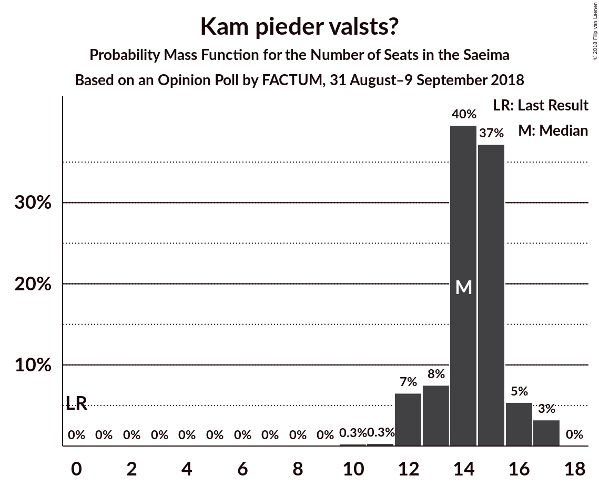
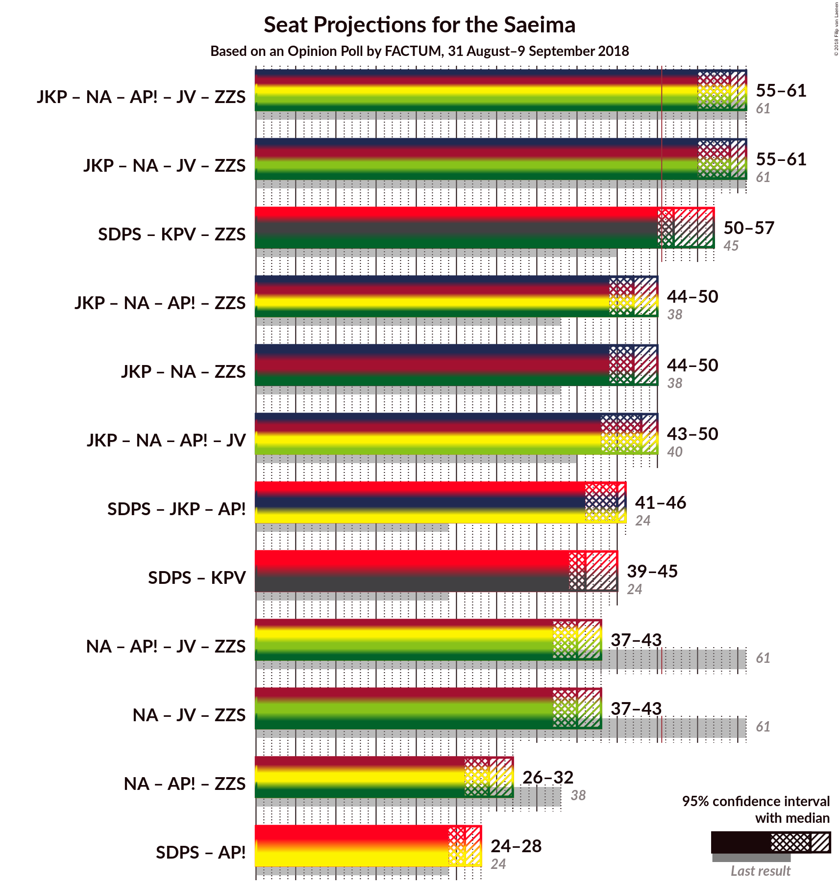

# Opinion Poll by FACTUM, 31 August–9 September 2018

<a href="#voting-intentions">Voting Intentions</a> | <a href="#seats">Seats</a> | <a href="#coalitions">Coalitions</a> | <a href="#technical-information">Technical Information</a>

## Voting Intentions

### Confidence Intervals

| Party | Last Result | Poll Result | 80% Confidence Interval | 90% Confidence Interval | 95% Confidence Interval | 99% Confidence Interval |
|:-----:|:-----------:|:-----------:|:-----------------------:|:-----------------------:|:-----------------------:|:-----------------------:|
| Sociāldemokrātiskā Partija “Saskaņa” | 23.0% | 21.0% | 19.6–22.5% |19.2–23.0% |18.9–23.3% |18.2–24.1% |
| Jaunā konservatīvā partija | 0.7% | 15.0% | 13.8–16.4% |13.4–16.7% |13.2–17.1% |12.6–17.7% |
| Nacionālā apvienība „Visu Latvijai!”–„Tēvzemei un Brīvībai/LNNK” | 16.6% | 14.0% | 12.8–15.3% |12.5–15.7% |12.2–16.0% |11.7–16.6% |
| Kam pieder valsts? | 0.0% | 13.0% | 11.9–14.3% |11.5–14.6% |11.3–14.9% |10.7–15.6% |
| Vienotība | 21.9% | 9.0% | 8.0–10.1% |7.8–10.4% |7.5–10.7% |7.1–11.2% |
| Zaļo un Zemnieku savienība | 19.5% | 9.0% | 8.0–10.1% |7.8–10.4% |7.5–10.7% |7.1–11.2% |
| Kustība Par! | 0.0% | 9.0% | 8.0–10.1% |7.8–10.4% |7.5–10.7% |7.1–11.2% |
| Latvijas Reģionu apvienība | 6.7% | 4.0% | 3.4–4.8% |3.2–5.0% |3.1–5.2% |2.8–5.7% |
| Latvijas Krievu savienība | 1.6% | 3.0% | 2.5–3.7% |2.3–3.9% |2.2–4.1% |2.0–4.5% |

*Note:* The poll result column reflects the actual value used in the calculations. Published results may vary slightly, and in addition be rounded to fewer digits.

## Seats

### Confidence Intervals

| Party | Last Result | Median | 80% Confidence Interval | 90% Confidence Interval | 95% Confidence Interval | 99% Confidence Interval |
|:-----:|:-----------:|:------:|:-----------------------:|:-----------------------:|:-----------------------:|:-----------------------:|
| <a href="#sociāldemokrātiskā-partija-“saskaņa”">Sociāldemokrātiskā Partija “Saskaņa”</a> | 24 | 24 | 22–26 |21–26 |21–26 |20–28 |
| <a href="#jaunā-konservatīvā-partija">Jaunā konservatīvā partija</a> | 0 | 16 | 15–19 |14–20 |14–20 |13–20 |
| <a href="#nacionālā-apvienība-„visu-latvijai!”–„tēvzemei-un-brīvībai/lnnk”">Nacionālā apvienība „Visu Latvijai!”–„Tēvzemei un Brīvībai/LNNK”</a> | 17 | 16 | 13–17 |13–18 |13–18 |13–18 |
| <a href="#kam-pieder-valsts?">Kam pieder valsts?</a> | 0 | 14 | 13–15 |12–16 |12–17 |10–17 |
| <a href="#vienotība">Vienotība</a> | 23 | 9 | 8–11 |7–12 |7–12 |7–14 |
| <a href="#zaļo-un-zemnieku-savienība">Zaļo un Zemnieku savienība</a> | 21 | 11 | 9–11 |8–12 |8–14 |7–15 |
| <a href="#kustība-par!">Kustība Par!</a> | 0 | 9 | 8–12 |8–12 |8–12 |7–13 |
| <a href="#latvijas-reģionu-apvienība">Latvijas Reģionu apvienība</a> | 8 | 0 | 0 |0–7 |0–7 |0–7 |
| <a href="#latvijas-krievu-savienība">Latvijas Krievu savienība</a> | 0 | 0 | 0 |0 |0 |0 |

### Sociāldemokrātiskā Partija “Saskaņa”

*For a full overview of the results for this party, see the [Sociāldemokrātiskā Partija “Saskaņa”](party-sociāldemokrātiskāpartija“saskaņa”.html) page.*

| Number of Seats | Probability | Accumulated | Special Marks |
|:---------------:|:-----------:|:-----------:|:-------------:|
| 20 | 2% | 100% |  |
| 21 | 4% | 98% |  |
| 22 | 10% | 94% |  |
| 23 | 8% | 84% |  |
| 24 | 31% | 76% | Last Result, Median |
| 25 | 22% | 45% |  |
| 26 | 21% | 23% |  |
| 27 | 1.5% | 2% |  |
| 28 | 0.8% | 0.8% |  |
| 29 | 0% | 0% |  |

### Jaunā konservatīvā partija

*For a full overview of the results for this party, see the [Jaunā konservatīvā partija](party-jaunākonservatīvāpartija.html) page.*

| Number of Seats | Probability | Accumulated | Special Marks |
|:---------------:|:-----------:|:-----------:|:-------------:|
| 0 | 0% | 100% | Last Result |
| 1 | 0% | 100% |  |
| 2 | 0% | 100% |  |
| 3 | 0% | 100% |  |
| 4 | 0% | 100% |  |
| 5 | 0% | 100% |  |
| 6 | 0% | 100% |  |
| 7 | 0% | 100% |  |
| 8 | 0% | 100% |  |
| 9 | 0% | 100% |  |
| 10 | 0% | 100% |  |
| 11 | 0% | 100% |  |
| 12 | 0% | 100% |  |
| 13 | 0.6% | 100% |  |
| 14 | 6% | 99.4% |  |
| 15 | 33% | 93% |  |
| 16 | 22% | 61% | Median |
| 17 | 16% | 39% |  |
| 18 | 7% | 23% |  |
| 19 | 8% | 16% |  |
| 20 | 8% | 8% |  |
| 21 | 0.2% | 0.2% |  |
| 22 | 0% | 0% |  |

### Nacionālā apvienība „Visu Latvijai!”–„Tēvzemei un Brīvībai/LNNK”

*For a full overview of the results for this party, see the [Nacionālā apvienība „Visu Latvijai!”–„Tēvzemei un Brīvībai/LNNK”](party-nacionālāapvienība„visulatvijai”–„tēvzemeiunbrīvībailnnk”.html) page.*

| Number of Seats | Probability | Accumulated | Special Marks |
|:---------------:|:-----------:|:-----------:|:-------------:|
| 12 | 0.3% | 100% |  |
| 13 | 13% | 99.7% |  |
| 14 | 22% | 87% |  |
| 15 | 13% | 65% |  |
| 16 | 28% | 52% | Median |
| 17 | 16% | 24% | Last Result |
| 18 | 8% | 8% |  |
| 19 | 0.1% | 0.2% |  |
| 20 | 0% | 0% |  |

### Kam pieder valsts?

*For a full overview of the results for this party, see the [Kam pieder valsts?](party-kampiedervalsts.html) page.*

| Number of Seats | Probability | Accumulated | Special Marks |
|:---------------:|:-----------:|:-----------:|:-------------:|
| 0 | 0% | 100% | Last Result |
| 1 | 0% | 100% |  |
| 2 | 0% | 100% |  |
| 3 | 0% | 100% |  |
| 4 | 0% | 100% |  |
| 5 | 0% | 100% |  |
| 6 | 0% | 100% |  |
| 7 | 0% | 100% |  |
| 8 | 0% | 100% |  |
| 9 | 0% | 100% |  |
| 10 | 0.8% | 100% |  |
| 11 | 0.3% | 99.2% |  |
| 12 | 6% | 98.9% |  |
| 13 | 7% | 93% |  |
| 14 | 60% | 87% | Median |
| 15 | 21% | 27% |  |
| 16 | 3% | 6% |  |
| 17 | 3% | 3% |  |
| 18 | 0% | 0% |  |

### Vienotība

*For a full overview of the results for this party, see the [Vienotība](party-vienotība.html) page.*

| Number of Seats | Probability | Accumulated | Special Marks |
|:---------------:|:-----------:|:-----------:|:-------------:|
| 7 | 5% | 100% |  |
| 8 | 28% | 95% |  |
| 9 | 22% | 67% | Median |
| 10 | 23% | 46% |  |
| 11 | 14% | 22% |  |
| 12 | 8% | 8% |  |
| 13 | 0.2% | 0.7% |  |
| 14 | 0.5% | 0.5% |  |
| 15 | 0% | 0% |  |
| 16 | 0% | 0% |  |
| 17 | 0% | 0% |  |
| 18 | 0% | 0% |  |
| 19 | 0% | 0% |  |
| 20 | 0% | 0% |  |
| 21 | 0% | 0% |  |
| 22 | 0% | 0% |  |
| 23 | 0% | 0% | Last Result |

### Zaļo un Zemnieku savienība

*For a full overview of the results for this party, see the [Zaļo un Zemnieku savienība](party-zaļounzemniekusavienība.html) page.*

| Number of Seats | Probability | Accumulated | Special Marks |
|:---------------:|:-----------:|:-----------:|:-------------:|
| 7 | 1.0% | 100% |  |
| 8 | 6% | 99.0% |  |
| 9 | 4% | 93% |  |
| 10 | 34% | 89% |  |
| 11 | 50% | 55% | Median |
| 12 | 0.8% | 5% |  |
| 13 | 1.1% | 4% |  |
| 14 | 3% | 3% |  |
| 15 | 0.6% | 0.6% |  |
| 16 | 0% | 0% |  |
| 17 | 0% | 0% |  |
| 18 | 0% | 0% |  |
| 19 | 0% | 0% |  |
| 20 | 0% | 0% |  |
| 21 | 0% | 0% | Last Result |

### Kustība Par!

*For a full overview of the results for this party, see the [Kustība Par!](party-kustībapar.html) page.*

| Number of Seats | Probability | Accumulated | Special Marks |
|:---------------:|:-----------:|:-----------:|:-------------:|
| 0 | 0% | 100% | Last Result |
| 1 | 0% | 100% |  |
| 2 | 0% | 100% |  |
| 3 | 0% | 100% |  |
| 4 | 0% | 100% |  |
| 5 | 0% | 100% |  |
| 6 | 0% | 100% |  |
| 7 | 2% | 100% |  |
| 8 | 15% | 98% |  |
| 9 | 39% | 83% | Median |
| 10 | 27% | 44% |  |
| 11 | 7% | 17% |  |
| 12 | 9% | 10% |  |
| 13 | 0.3% | 0.8% |  |
| 14 | 0.5% | 0.5% |  |
| 15 | 0% | 0% |  |

### Latvijas Reģionu apvienība

*For a full overview of the results for this party, see the [Latvijas Reģionu apvienība](party-latvijasreģionuapvienība.html) page.*

| Number of Seats | Probability | Accumulated | Special Marks |
|:---------------:|:-----------:|:-----------:|:-------------:|
| 0 | 94% | 100% | Median |
| 1 | 0% | 6% |  |
| 2 | 0% | 6% |  |
| 3 | 0% | 6% |  |
| 4 | 0% | 6% |  |
| 5 | 0% | 6% |  |
| 6 | 0.2% | 6% |  |
| 7 | 6% | 6% |  |
| 8 | 0% | 0% | Last Result |

### Latvijas Krievu savienība

*For a full overview of the results for this party, see the [Latvijas Krievu savienība](party-latvijaskrievusavienība.html) page.*

| Number of Seats | Probability | Accumulated | Special Marks |
|:---------------:|:-----------:|:-----------:|:-------------:|
| 0 | 99.9% | 100% | Last Result, Median |
| 1 | 0% | 0.1% |  |
| 2 | 0% | 0.1% |  |
| 3 | 0% | 0.1% |  |
| 4 | 0% | 0.1% |  |
| 5 | 0% | 0.1% |  |
| 6 | 0.1% | 0.1% |  |
| 7 | 0% | 0% |  |

## Coalitions

### Confidence Intervals

| Coalition | Last Result | Median | Majority? | 80% Confidence Interval | 90% Confidence Interval | 95% Confidence Interval | 99% Confidence Interval |
|:---------:|:-----------:|:------:|:---------:|:-----------------------:|:-----------------------:|:-----------------------:|:-----------------------:|
| Jaunā konservatīvā partija – Nacionālā apvienība „Visu Latvijai!”–„Tēvzemei un Brīvībai/LNNK” – Kustība Par! – Vienotība – Zaļo un Zemnieku savienība | 61 | 61 | 100% | 60–64 | 58–65 | 56–66 | 56–67 |
| Jaunā konservatīvā partija – Nacionālā apvienība „Visu Latvijai!”–„Tēvzemei un Brīvībai/LNNK” – Vienotība – Zaļo un Zemnieku savienība | 61 | 51 | 79% | 50–54 | 49–56 | 48–56 | 47–57 |
| Jaunā konservatīvā partija – Nacionālā apvienība „Visu Latvijai!”–„Tēvzemei un Brīvībai/LNNK” – Kustība Par! – Vienotība | 40 | 50 | 42% | 50–53 | 48–55 | 47–56 | 46–56 |
| Jaunā konservatīvā partija – Nacionālā apvienība „Visu Latvijai!”–„Tēvzemei un Brīvībai/LNNK” – Kustība Par! – Zaļo un Zemnieku savienība | 38 | 52 | 75% | 49–54 | 48–55 | 47–56 | 46–57 |
| Nacionālā apvienība „Visu Latvijai!”–„Tēvzemei un Brīvībai/LNNK” – Kustība Par! – Vienotība – Zaļo un Zemnieku savienība | 61 | 45 | 0.2% | 41–48 | 41–48 | 41–49 | 40–50 |
| Jaunā konservatīvā partija – Nacionālā apvienība „Visu Latvijai!”–„Tēvzemei un Brīvībai/LNNK” – Zaļo un Zemnieku savienība | 38 | 42 | 0% | 40–45 | 39–46 | 38–47 | 38–47 |
| Nacionālā apvienība „Visu Latvijai!”–„Tēvzemei un Brīvībai/LNNK” – Kustība Par! – Zaļo un Zemnieku savienība | 38 | 35 | 0% | 33–38 | 31–39 | 31–39 | 31–40 |
| Nacionālā apvienība „Visu Latvijai!”–„Tēvzemei un Brīvībai/LNNK” – Vienotība – Zaļo un Zemnieku savienība | 61 | 35 | 0% | 33–38 | 32–39 | 31–39 | 31–41 |

### Jaunā konservatīvā partija – Nacionālā apvienība „Visu Latvijai!”–„Tēvzemei un Brīvībai/LNNK” – Kustība Par! – Vienotība – Zaļo un Zemnieku savienība

| Number of Seats | Probability | Accumulated | Special Marks |
|:---------------:|:-----------:|:-----------:|:-------------:|
| 55 | 0.1% | 100% |  |
| 56 | 4% | 99.9% |  |
| 57 | 0.9% | 96% |  |
| 58 | 2% | 95% |  |
| 59 | 2% | 93% |  |
| 60 | 21% | 91% |  |
| 61 | 34% | 70% | Last Result, Median |
| 62 | 18% | 36% |  |
| 63 | 6% | 18% |  |
| 64 | 6% | 12% |  |
| 65 | 3% | 6% |  |
| 66 | 2% | 3% |  |
| 67 | 0.5% | 0.6% |  |
| 68 | 0% | 0% |  |

### Jaunā konservatīvā partija – Nacionālā apvienība „Visu Latvijai!”–„Tēvzemei un Brīvībai/LNNK” – Vienotība – Zaļo un Zemnieku savienība

| Number of Seats | Probability | Accumulated | Special Marks |
|:---------------:|:-----------:|:-----------:|:-------------:|
| 44 | 0.1% | 100% |  |
| 45 | 0.1% | 99.9% |  |
| 46 | 0% | 99.9% |  |
| 47 | 1.2% | 99.8% |  |
| 48 | 3% | 98.6% |  |
| 49 | 3% | 95% |  |
| 50 | 14% | 93% |  |
| 51 | 36% | 79% | Majority |
| 52 | 20% | 43% | Median |
| 53 | 9% | 23% |  |
| 54 | 5% | 15% |  |
| 55 | 3% | 10% |  |
| 56 | 4% | 7% |  |
| 57 | 2% | 2% |  |
| 58 | 0.2% | 0.2% |  |
| 59 | 0% | 0% |  |
| 60 | 0% | 0% |  |
| 61 | 0% | 0% | Last Result |

### Jaunā konservatīvā partija – Nacionālā apvienība „Visu Latvijai!”–„Tēvzemei un Brīvībai/LNNK” – Kustība Par! – Vienotība

| Number of Seats | Probability | Accumulated | Special Marks |
|:---------------:|:-----------:|:-----------:|:-------------:|
| 40 | 0% | 100% | Last Result |
| 41 | 0% | 100% |  |
| 42 | 0% | 100% |  |
| 43 | 0% | 100% |  |
| 44 | 0% | 100% |  |
| 45 | 0% | 100% |  |
| 46 | 2% | 99.9% |  |
| 47 | 2% | 98% |  |
| 48 | 4% | 96% |  |
| 49 | 1.3% | 92% |  |
| 50 | 49% | 91% | Median |
| 51 | 24% | 42% | Majority |
| 52 | 4% | 18% |  |
| 53 | 4% | 13% |  |
| 54 | 3% | 10% |  |
| 55 | 3% | 7% |  |
| 56 | 3% | 3% |  |
| 57 | 0.1% | 0.1% |  |
| 58 | 0% | 0% |  |

### Jaunā konservatīvā partija – Nacionālā apvienība „Visu Latvijai!”–„Tēvzemei un Brīvībai/LNNK” – Kustība Par! – Zaļo un Zemnieku savienība

| Number of Seats | Probability | Accumulated | Special Marks |
|:---------------:|:-----------:|:-----------:|:-------------:|
| 38 | 0% | 100% | Last Result |
| 39 | 0% | 100% |  |
| 40 | 0% | 100% |  |
| 41 | 0% | 100% |  |
| 42 | 0% | 100% |  |
| 43 | 0% | 100% |  |
| 44 | 0% | 100% |  |
| 45 | 0.1% | 100% |  |
| 46 | 2% | 99.9% |  |
| 47 | 1.2% | 98% |  |
| 48 | 3% | 97% |  |
| 49 | 5% | 94% |  |
| 50 | 14% | 89% |  |
| 51 | 10% | 75% | Majority |
| 52 | 33% | 65% | Median |
| 53 | 15% | 31% |  |
| 54 | 8% | 16% |  |
| 55 | 4% | 8% |  |
| 56 | 2% | 4% |  |
| 57 | 2% | 2% |  |
| 58 | 0% | 0% |  |

### Nacionālā apvienība „Visu Latvijai!”–„Tēvzemei un Brīvībai/LNNK” – Kustība Par! – Vienotība – Zaļo un Zemnieku savienība

| Number of Seats | Probability | Accumulated | Special Marks |
|:---------------:|:-----------:|:-----------:|:-------------:|
| 38 | 0% | 100% |  |
| 39 | 0.2% | 99.9% |  |
| 40 | 1.0% | 99.7% |  |
| 41 | 9% | 98.7% |  |
| 42 | 3% | 89% |  |
| 43 | 19% | 86% |  |
| 44 | 9% | 67% |  |
| 45 | 20% | 58% | Median |
| 46 | 11% | 38% |  |
| 47 | 17% | 27% |  |
| 48 | 7% | 11% |  |
| 49 | 3% | 3% |  |
| 50 | 0.6% | 0.8% |  |
| 51 | 0.2% | 0.2% | Majority |
| 52 | 0% | 0% |  |
| 53 | 0% | 0% |  |
| 54 | 0% | 0% |  |
| 55 | 0% | 0% |  |
| 56 | 0% | 0% |  |
| 57 | 0% | 0% |  |
| 58 | 0% | 0% |  |
| 59 | 0% | 0% |  |
| 60 | 0% | 0% |  |
| 61 | 0% | 0% | Last Result |

### Jaunā konservatīvā partija – Nacionālā apvienība „Visu Latvijai!”–„Tēvzemei un Brīvībai/LNNK” – Zaļo un Zemnieku savienība

| Number of Seats | Probability | Accumulated | Special Marks |
|:---------------:|:-----------:|:-----------:|:-------------:|
| 36 | 0.1% | 100% |  |
| 37 | 0.3% | 99.9% |  |
| 38 | 2% | 99.6% | Last Result |
| 39 | 6% | 97% |  |
| 40 | 7% | 91% |  |
| 41 | 21% | 84% |  |
| 42 | 13% | 63% |  |
| 43 | 31% | 49% | Median |
| 44 | 8% | 18% |  |
| 45 | 2% | 10% |  |
| 46 | 4% | 8% |  |
| 47 | 5% | 5% |  |
| 48 | 0.3% | 0.3% |  |
| 49 | 0% | 0% |  |

### Nacionālā apvienība „Visu Latvijai!”–„Tēvzemei un Brīvībai/LNNK” – Kustība Par! – Zaļo un Zemnieku savienība

| Number of Seats | Probability | Accumulated | Special Marks |
|:---------------:|:-----------:|:-----------:|:-------------:|
| 29 | 0.1% | 100% |  |
| 30 | 0.2% | 99.9% |  |
| 31 | 5% | 99.7% |  |
| 32 | 2% | 94% |  |
| 33 | 8% | 93% |  |
| 34 | 15% | 85% |  |
| 35 | 25% | 70% |  |
| 36 | 20% | 45% | Median |
| 37 | 8% | 25% |  |
| 38 | 10% | 17% | Last Result |
| 39 | 7% | 8% |  |
| 40 | 0.6% | 1.1% |  |
| 41 | 0.5% | 0.5% |  |
| 42 | 0% | 0% |  |

### Nacionālā apvienība „Visu Latvijai!”–„Tēvzemei un Brīvībai/LNNK” – Vienotība – Zaļo un Zemnieku savienība

| Number of Seats | Probability | Accumulated | Special Marks |
|:---------------:|:-----------:|:-----------:|:-------------:|
| 29 | 0.1% | 100% |  |
| 30 | 0.1% | 99.9% |  |
| 31 | 4% | 99.8% |  |
| 32 | 5% | 96% |  |
| 33 | 7% | 91% |  |
| 34 | 22% | 84% |  |
| 35 | 17% | 61% |  |
| 36 | 20% | 44% | Median |
| 37 | 7% | 24% |  |
| 38 | 10% | 17% |  |
| 39 | 5% | 7% |  |
| 40 | 1.1% | 2% |  |
| 41 | 0.7% | 0.7% |  |
| 42 | 0% | 0% |  |
| 43 | 0% | 0% |  |
| 44 | 0% | 0% |  |
| 45 | 0% | 0% |  |
| 46 | 0% | 0% |  |
| 47 | 0% | 0% |  |
| 48 | 0% | 0% |  |
| 49 | 0% | 0% |  |
| 50 | 0% | 0% |  |
| 51 | 0% | 0% | Majority |
| 52 | 0% | 0% |  |
| 53 | 0% | 0% |  |
| 54 | 0% | 0% |  |
| 55 | 0% | 0% |  |
| 56 | 0% | 0% |  |
| 57 | 0% | 0% |  |
| 58 | 0% | 0% |  |
| 59 | 0% | 0% |  |
| 60 | 0% | 0% |  |
| 61 | 0% | 0% | Last Result |

## Technical Information

### Opinion Poll

+ **Polling firm:** FACTUM
+ **Commissioner(s):** —
+ **Fieldwork period:** 31 August–9 September 2018

### Calculations

+ **Sample size:** 1293
+ **Simulations done:** 131,072
+ **Error estimate:** 2.24%

