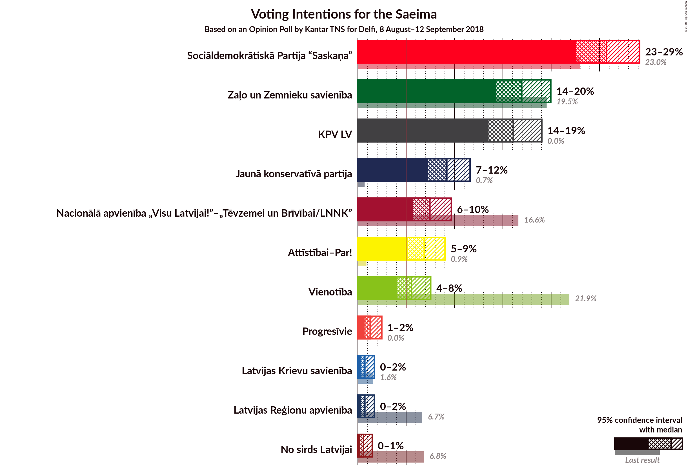
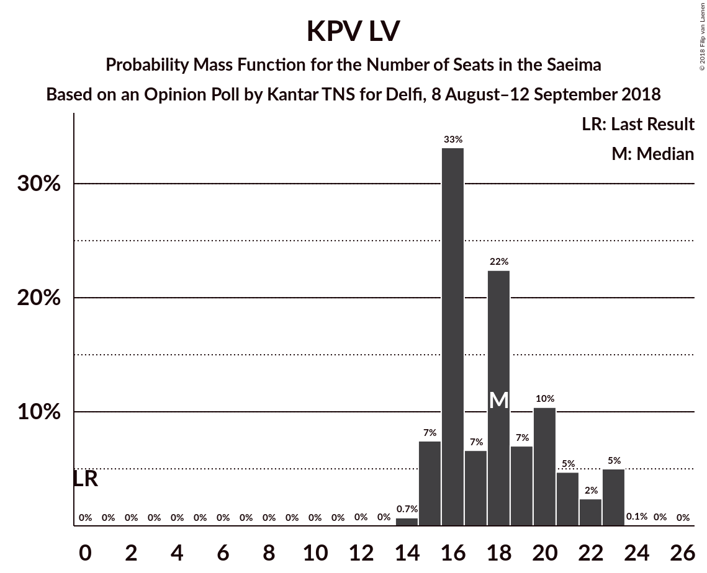
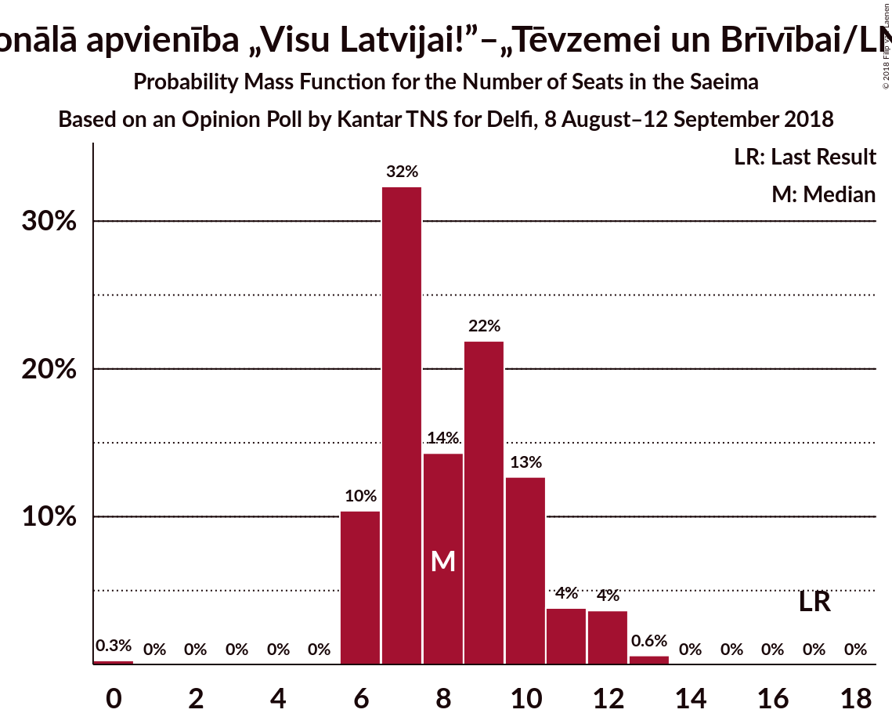

# Opinion Poll by Kantar TNS for Delfi, 8 August–12 September 2018

<a href="#voting-intentions">Voting Intentions</a> | <a href="#seats">Seats</a> | <a href="#coalitions">Coalitions</a> | <a href="#technical-information">Technical Information</a>

## Voting Intentions

### Confidence Intervals

| Party | Last Result | Poll Result | 80% Confidence Interval | 90% Confidence Interval | 95% Confidence Interval | 99% Confidence Interval |
|:-----:|:-----------:|:-----------:|:-----------------------:|:-----------------------:|:-----------------------:|:-----------------------:|
| Sociāldemokrātiskā Partija “Saskaņa” | 23.0% | 26.2% | 24.1–28.4% |23.5–29.1% |23.0–29.6% |22.0–30.7% |
| Zaļo un Zemnieku savienība | 19.5% | 17.3% | 15.5–19.2% |15.0–19.8% |14.6–20.3% |13.8–21.2% |
| KPV LV | 0.0% | 16.4% | 14.7–18.3% |14.2–18.9% |13.8–19.3% |13.0–20.3% |
| Jaunā konservatīvā partija | 0.7% | 9.4% | 8.1–10.9% |7.7–11.4% |7.4–11.8% |6.8–12.6% |
| Nacionālā apvienība „Visu Latvijai!”–„Tēvzemei un Brīvībai/LNNK” | 16.6% | 7.6% | 6.4–9.1% |6.1–9.5% |5.8–9.8% |5.3–10.6% |
| Attīstībai–Par! | 0.9% | 7.0% | 5.9–8.4% |5.6–8.8% |5.3–9.2% |4.8–9.9% |
| Vienotība | 21.9% | 5.6% | 4.6–6.8% |4.3–7.2% |4.1–7.5% |3.6–8.2% |
| Latvijas Reģionu apvienība | 6.7% | 0.7% | 0.5–1.4% |0.4–1.5% |0.3–1.7% |0.2–2.1% |
| Latvijas Krievu savienība | 1.6% | 0.7% | 0.5–1.4% |0.4–1.5% |0.3–1.7% |0.2–2.1% |
| No sirds Latvijai | 6.8% | 0.6% | 0.4–1.2% |0.3–1.3% |0.2–1.5% |0.2–1.8% |

*Note:* The poll result column reflects the actual value used in the calculations. Published results may vary slightly, and in addition be rounded to fewer digits.

## Seats

### Confidence Intervals

| Party | Last Result | Median | 80% Confidence Interval | 90% Confidence Interval | 95% Confidence Interval | 99% Confidence Interval |
|:-----:|:-----------:|:------:|:-----------------------:|:-----------------------:|:-----------------------:|:-----------------------:|
| <a href="#sociāldemokrātiskā-partija-“saskaņa”">Sociāldemokrātiskā Partija “Saskaņa”</a> | 24 | 31 | 29–34 |29–35 |27–36 |26–37 |
| <a href="#zaļo-un-zemnieku-savienība">Zaļo un Zemnieku savienība</a> | 21 | 23 | 20–24 |19–24 |19–25 |17–28 |
| <a href="#kpv-lv">KPV LV</a> | 0 | 19 | 18–23 |17–24 |16–24 |15–25 |
| <a href="#jaunā-konservatīvā-partija">Jaunā konservatīvā partija</a> | 0 | 12 | 10–14 |10–15 |9–15 |8–15 |
| <a href="#nacionālā-apvienība-„visu-latvijai!”–„tēvzemei-un-brīvībai/lnnk”">Nacionālā apvienība „Visu Latvijai!”–„Tēvzemei un Brīvībai/LNNK”</a> | 17 | 9 | 7–11 |6–12 |6–12 |6–13 |
| <a href="#attīstībai–par!">Attīstībai–Par!</a> | 0 | 0 | 0 |0 |0 |0 |
| <a href="#vienotība">Vienotība</a> | 23 | 7 | 0–8 |0–8 |0–9 |0–10 |
| <a href="#latvijas-reģionu-apvienība">Latvijas Reģionu apvienība</a> | 8 | 0 | 0 |0 |0 |0 |
| <a href="#latvijas-krievu-savienība">Latvijas Krievu savienība</a> | 0 | 0 | 0 |0 |0 |0 |
| <a href="#no-sirds-latvijai">No sirds Latvijai</a> | 7 | 0 | 0 |0 |0 |0 |

### Sociāldemokrātiskā Partija “Saskaņa”

*For a full overview of the results for this party, see the [Sociāldemokrātiskā Partija “Saskaņa”](party-sociāldemokrātiskāpartija“saskaņa”.html) page.*

| Number of Seats | Probability | Accumulated | Special Marks |
|:---------------:|:-----------:|:-----------:|:-------------:|
| 24 | 0% | 100% | Last Result |
| 25 | 0% | 100% |  |
| 26 | 0.6% | 100% |  |
| 27 | 3% | 99.3% |  |
| 28 | 1.0% | 96% |  |
| 29 | 23% | 95% |  |
| 30 | 7% | 72% |  |
| 31 | 24% | 65% | Median |
| 32 | 8% | 41% |  |
| 33 | 20% | 33% |  |
| 34 | 5% | 13% |  |
| 35 | 3% | 8% |  |
| 36 | 3% | 5% |  |
| 37 | 1.1% | 1.3% |  |
| 38 | 0.2% | 0.2% |  |
| 39 | 0% | 0% |  |

### Zaļo un Zemnieku savienība

*For a full overview of the results for this party, see the [Zaļo un Zemnieku savienība](party-zaļounzemniekusavienība.html) page.*

| Number of Seats | Probability | Accumulated | Special Marks |
|:---------------:|:-----------:|:-----------:|:-------------:|
| 17 | 0.6% | 100% |  |
| 18 | 1.0% | 99.4% |  |
| 19 | 4% | 98% |  |
| 20 | 14% | 94% |  |
| 21 | 9% | 80% | Last Result |
| 22 | 9% | 71% |  |
| 23 | 33% | 62% | Median |
| 24 | 24% | 29% |  |
| 25 | 3% | 5% |  |
| 26 | 1.1% | 2% |  |
| 27 | 0.4% | 0.9% |  |
| 28 | 0.3% | 0.5% |  |
| 29 | 0.2% | 0.2% |  |
| 30 | 0.1% | 0.1% |  |
| 31 | 0% | 0% |  |

### KPV LV

*For a full overview of the results for this party, see the [KPV LV](party-kpvlv.html) page.*

| Number of Seats | Probability | Accumulated | Special Marks |
|:---------------:|:-----------:|:-----------:|:-------------:|
| 0 | 0% | 100% | Last Result |
| 1 | 0% | 100% |  |
| 2 | 0% | 100% |  |
| 3 | 0% | 100% |  |
| 4 | 0% | 100% |  |
| 5 | 0% | 100% |  |
| 6 | 0% | 100% |  |
| 7 | 0% | 100% |  |
| 8 | 0% | 100% |  |
| 9 | 0% | 100% |  |
| 10 | 0% | 100% |  |
| 11 | 0% | 100% |  |
| 12 | 0% | 100% |  |
| 13 | 0% | 100% |  |
| 14 | 0% | 100% |  |
| 15 | 1.0% | 100% |  |
| 16 | 2% | 99.0% |  |
| 17 | 4% | 97% |  |
| 18 | 30% | 93% |  |
| 19 | 16% | 63% | Median |
| 20 | 12% | 46% |  |
| 21 | 12% | 34% |  |
| 22 | 11% | 22% |  |
| 23 | 5% | 11% |  |
| 24 | 6% | 7% |  |
| 25 | 0.7% | 0.9% |  |
| 26 | 0.2% | 0.2% |  |
| 27 | 0% | 0% |  |

### Jaunā konservatīvā partija

*For a full overview of the results for this party, see the [Jaunā konservatīvā partija](party-jaunākonservatīvāpartija.html) page.*

| Number of Seats | Probability | Accumulated | Special Marks |
|:---------------:|:-----------:|:-----------:|:-------------:|
| 0 | 0% | 100% | Last Result |
| 1 | 0% | 100% |  |
| 2 | 0% | 100% |  |
| 3 | 0% | 100% |  |
| 4 | 0% | 100% |  |
| 5 | 0% | 100% |  |
| 6 | 0% | 100% |  |
| 7 | 0.1% | 100% |  |
| 8 | 2% | 99.9% |  |
| 9 | 2% | 98% |  |
| 10 | 18% | 96% |  |
| 11 | 22% | 78% |  |
| 12 | 24% | 55% | Median |
| 13 | 16% | 31% |  |
| 14 | 8% | 15% |  |
| 15 | 7% | 7% |  |
| 16 | 0.2% | 0.2% |  |
| 17 | 0.1% | 0.1% |  |
| 18 | 0% | 0% |  |

### Nacionālā apvienība „Visu Latvijai!”–„Tēvzemei un Brīvībai/LNNK”

*For a full overview of the results for this party, see the [Nacionālā apvienība „Visu Latvijai!”–„Tēvzemei un Brīvībai/LNNK”](party-nacionālāapvienība„visulatvijai”–„tēvzemeiunbrīvībailnnk”.html) page.*

| Number of Seats | Probability | Accumulated | Special Marks |
|:---------------:|:-----------:|:-----------:|:-------------:|
| 0 | 0.1% | 100% |  |
| 1 | 0% | 99.9% |  |
| 2 | 0% | 99.9% |  |
| 3 | 0% | 99.9% |  |
| 4 | 0% | 99.9% |  |
| 5 | 0% | 99.9% |  |
| 6 | 6% | 99.9% |  |
| 7 | 16% | 93% |  |
| 8 | 8% | 77% |  |
| 9 | 24% | 69% | Median |
| 10 | 10% | 45% |  |
| 11 | 30% | 36% |  |
| 12 | 4% | 6% |  |
| 13 | 1.1% | 1.5% |  |
| 14 | 0.4% | 0.4% |  |
| 15 | 0.1% | 0.1% |  |
| 16 | 0% | 0% |  |
| 17 | 0% | 0% | Last Result |

### Attīstībai–Par!

*For a full overview of the results for this party, see the [Attīstībai–Par!](party-attīstībai–par.html) page.*

| Number of Seats | Probability | Accumulated | Special Marks |
|:---------------:|:-----------:|:-----------:|:-------------:|
| 0 | 100% | 100% | Last Result, Median |

### Vienotība

*For a full overview of the results for this party, see the [Vienotība](party-vienotība.html) page.*

| Number of Seats | Probability | Accumulated | Special Marks |
|:---------------:|:-----------:|:-----------:|:-------------:|
| 0 | 26% | 100% |  |
| 1 | 0% | 74% |  |
| 2 | 0% | 74% |  |
| 3 | 0% | 74% |  |
| 4 | 0% | 74% |  |
| 5 | 0% | 74% |  |
| 6 | 0% | 74% |  |
| 7 | 53% | 74% | Median |
| 8 | 18% | 22% |  |
| 9 | 1.4% | 3% |  |
| 10 | 2% | 2% |  |
| 11 | 0% | 0% |  |
| 12 | 0% | 0% |  |
| 13 | 0% | 0% |  |
| 14 | 0% | 0% |  |
| 15 | 0% | 0% |  |
| 16 | 0% | 0% |  |
| 17 | 0% | 0% |  |
| 18 | 0% | 0% |  |
| 19 | 0% | 0% |  |
| 20 | 0% | 0% |  |
| 21 | 0% | 0% |  |
| 22 | 0% | 0% |  |
| 23 | 0% | 0% | Last Result |

### Latvijas Reģionu apvienība

*For a full overview of the results for this party, see the [Latvijas Reģionu apvienība](party-latvijasreģionuapvienība.html) page.*

| Number of Seats | Probability | Accumulated | Special Marks |
|:---------------:|:-----------:|:-----------:|:-------------:|
| 0 | 100% | 100% | Median |
| 1 | 0% | 0% |  |
| 2 | 0% | 0% |  |
| 3 | 0% | 0% |  |
| 4 | 0% | 0% |  |
| 5 | 0% | 0% |  |
| 6 | 0% | 0% |  |
| 7 | 0% | 0% |  |
| 8 | 0% | 0% | Last Result |

### Latvijas Krievu savienība

*For a full overview of the results for this party, see the [Latvijas Krievu savienība](party-latvijaskrievusavienība.html) page.*

| Number of Seats | Probability | Accumulated | Special Marks |
|:---------------:|:-----------:|:-----------:|:-------------:|
| 0 | 100% | 100% | Last Result, Median |

### No sirds Latvijai

*For a full overview of the results for this party, see the [No sirds Latvijai](party-nosirdslatvijai.html) page.*

| Number of Seats | Probability | Accumulated | Special Marks |
|:---------------:|:-----------:|:-----------:|:-------------:|
| 0 | 100% | 100% | Median |
| 1 | 0% | 0% |  |
| 2 | 0% | 0% |  |
| 3 | 0% | 0% |  |
| 4 | 0% | 0% |  |
| 5 | 0% | 0% |  |
| 6 | 0% | 0% |  |
| 7 | 0% | 0% | Last Result |

## Coalitions

### Confidence Intervals

| Coalition | Last Result | Median | Majority? | 80% Confidence Interval | 90% Confidence Interval | 95% Confidence Interval | 99% Confidence Interval |
|:---------:|:-----------:|:------:|:---------:|:-----------------------:|:-----------------------:|:-----------------------:|:-----------------------:|
| Zaļo un Zemnieku savienība – Jaunā konservatīvā partija – Nacionālā apvienība „Visu Latvijai!”–„Tēvzemei un Brīvībai/LNNK” – Attīstībai–Par! – Vienotība | 61 | 49 | 33% | 44–53 | 43–53 | 43–53 | 41–55 |
| Zaļo un Zemnieku savienība – Jaunā konservatīvā partija – Nacionālā apvienība „Visu Latvijai!”–„Tēvzemei un Brīvībai/LNNK” – Vienotība | 61 | 49 | 33% | 44–53 | 43–53 | 43–53 | 41–55 |
| Sociāldemokrātiskā Partija “Saskaņa” – Jaunā konservatīvā partija – Attīstībai–Par! | 24 | 42 | 0.7% | 41–47 | 40–48 | 39–49 | 38–51 |
| Zaļo un Zemnieku savienība – Jaunā konservatīvā partija – Nacionālā apvienība „Visu Latvijai!”–„Tēvzemei un Brīvībai/LNNK” – Attīstībai–Par! | 38 | 43 | 0.2% | 40–47 | 39–48 | 38–48 | 36–49 |
| Zaļo un Zemnieku savienība – Jaunā konservatīvā partija – Nacionālā apvienība „Visu Latvijai!”–„Tēvzemei un Brīvībai/LNNK” | 38 | 43 | 0.2% | 40–47 | 39–48 | 38–48 | 36–49 |
| Zaļo un Zemnieku savienība – Nacionālā apvienība „Visu Latvijai!”–„Tēvzemei un Brīvībai/LNNK” – Attīstībai–Par! – Vienotība | 61 | 38 | 0% | 32–41 | 32–41 | 30–41 | 29–43 |
| Zaļo un Zemnieku savienība – Nacionālā apvienība „Visu Latvijai!”–„Tēvzemei un Brīvībai/LNNK” – Vienotība | 61 | 38 | 0% | 32–41 | 32–41 | 30–41 | 29–43 |
| Sociāldemokrātiskā Partija “Saskaņa” – Attīstībai–Par! | 24 | 31 | 0% | 29–34 | 29–35 | 27–36 | 26–37 |
| Zaļo un Zemnieku savienība – Nacionālā apvienība „Visu Latvijai!”–„Tēvzemei un Brīvībai/LNNK” – Attīstībai–Par! | 38 | 32 | 0% | 29–34 | 28–34 | 27–35 | 26–37 |
| Jaunā konservatīvā partija – Nacionālā apvienība „Visu Latvijai!”–„Tēvzemei un Brīvībai/LNNK” – Attīstībai–Par! – Vienotība | 40 | 27 | 0% | 22–30 | 21–30 | 19–31 | 17–33 |

### Zaļo un Zemnieku savienība – Jaunā konservatīvā partija – Nacionālā apvienība „Visu Latvijai!”–„Tēvzemei un Brīvībai/LNNK” – Attīstībai–Par! – Vienotība

| Number of Seats | Probability | Accumulated | Special Marks |
|:---------------:|:-----------:|:-----------:|:-------------:|
| 39 | 0.1% | 100% |  |
| 40 | 0.4% | 99.9% |  |
| 41 | 1.2% | 99.6% |  |
| 42 | 0.6% | 98% |  |
| 43 | 7% | 98% |  |
| 44 | 2% | 91% |  |
| 45 | 3% | 89% |  |
| 46 | 7% | 86% |  |
| 47 | 10% | 79% |  |
| 48 | 8% | 69% |  |
| 49 | 13% | 61% |  |
| 50 | 16% | 48% |  |
| 51 | 9% | 33% | Median, Majority |
| 52 | 3% | 23% |  |
| 53 | 18% | 20% |  |
| 54 | 1.1% | 2% |  |
| 55 | 0.4% | 0.5% |  |
| 56 | 0.1% | 0.2% |  |
| 57 | 0.1% | 0.1% |  |
| 58 | 0% | 0% |  |
| 59 | 0% | 0% |  |
| 60 | 0% | 0% |  |
| 61 | 0% | 0% | Last Result |

### Zaļo un Zemnieku savienība – Jaunā konservatīvā partija – Nacionālā apvienība „Visu Latvijai!”–„Tēvzemei un Brīvībai/LNNK” – Vienotība

| Number of Seats | Probability | Accumulated | Special Marks |
|:---------------:|:-----------:|:-----------:|:-------------:|
| 39 | 0.1% | 100% |  |
| 40 | 0.4% | 99.9% |  |
| 41 | 1.2% | 99.6% |  |
| 42 | 0.6% | 98% |  |
| 43 | 7% | 98% |  |
| 44 | 2% | 91% |  |
| 45 | 3% | 89% |  |
| 46 | 7% | 86% |  |
| 47 | 10% | 79% |  |
| 48 | 8% | 69% |  |
| 49 | 13% | 61% |  |
| 50 | 16% | 48% |  |
| 51 | 9% | 33% | Median, Majority |
| 52 | 3% | 23% |  |
| 53 | 18% | 20% |  |
| 54 | 1.1% | 2% |  |
| 55 | 0.4% | 0.5% |  |
| 56 | 0.1% | 0.2% |  |
| 57 | 0.1% | 0.1% |  |
| 58 | 0% | 0% |  |
| 59 | 0% | 0% |  |
| 60 | 0% | 0% |  |
| 61 | 0% | 0% | Last Result |

### Sociāldemokrātiskā Partija “Saskaņa” – Jaunā konservatīvā partija – Attīstībai–Par!

| Number of Seats | Probability | Accumulated | Special Marks |
|:---------------:|:-----------:|:-----------:|:-------------:|
| 24 | 0% | 100% | Last Result |
| 25 | 0% | 100% |  |
| 26 | 0% | 100% |  |
| 27 | 0% | 100% |  |
| 28 | 0% | 100% |  |
| 29 | 0% | 100% |  |
| 30 | 0% | 100% |  |
| 31 | 0% | 100% |  |
| 32 | 0% | 100% |  |
| 33 | 0% | 100% |  |
| 34 | 0% | 100% |  |
| 35 | 0.1% | 100% |  |
| 36 | 0.2% | 99.9% |  |
| 37 | 0.2% | 99.8% |  |
| 38 | 1.2% | 99.6% |  |
| 39 | 2% | 98% |  |
| 40 | 6% | 97% |  |
| 41 | 24% | 91% |  |
| 42 | 19% | 67% |  |
| 43 | 6% | 48% | Median |
| 44 | 21% | 41% |  |
| 45 | 3% | 20% |  |
| 46 | 4% | 18% |  |
| 47 | 4% | 14% |  |
| 48 | 7% | 10% |  |
| 49 | 2% | 3% |  |
| 50 | 0.9% | 2% |  |
| 51 | 0.6% | 0.7% | Majority |
| 52 | 0% | 0% |  |

### Zaļo un Zemnieku savienība – Jaunā konservatīvā partija – Nacionālā apvienība „Visu Latvijai!”–„Tēvzemei un Brīvībai/LNNK” – Attīstībai–Par!

| Number of Seats | Probability | Accumulated | Special Marks |
|:---------------:|:-----------:|:-----------:|:-------------:|
| 35 | 0.1% | 100% |  |
| 36 | 0.4% | 99.9% |  |
| 37 | 1.3% | 99.5% |  |
| 38 | 1.5% | 98% | Last Result |
| 39 | 3% | 97% |  |
| 40 | 6% | 93% |  |
| 41 | 12% | 88% |  |
| 42 | 11% | 75% |  |
| 43 | 19% | 65% |  |
| 44 | 9% | 46% | Median |
| 45 | 5% | 37% |  |
| 46 | 21% | 32% |  |
| 47 | 6% | 11% |  |
| 48 | 4% | 6% |  |
| 49 | 2% | 2% |  |
| 50 | 0.3% | 0.5% |  |
| 51 | 0.1% | 0.2% | Majority |
| 52 | 0.1% | 0.1% |  |
| 53 | 0% | 0% |  |

### Zaļo un Zemnieku savienība – Jaunā konservatīvā partija – Nacionālā apvienība „Visu Latvijai!”–„Tēvzemei un Brīvībai/LNNK”

| Number of Seats | Probability | Accumulated | Special Marks |
|:---------------:|:-----------:|:-----------:|:-------------:|
| 35 | 0.1% | 100% |  |
| 36 | 0.4% | 99.9% |  |
| 37 | 1.3% | 99.5% |  |
| 38 | 1.5% | 98% | Last Result |
| 39 | 3% | 97% |  |
| 40 | 6% | 93% |  |
| 41 | 12% | 88% |  |
| 42 | 11% | 75% |  |
| 43 | 19% | 65% |  |
| 44 | 9% | 46% | Median |
| 45 | 5% | 37% |  |
| 46 | 21% | 32% |  |
| 47 | 6% | 11% |  |
| 48 | 4% | 6% |  |
| 49 | 2% | 2% |  |
| 50 | 0.3% | 0.5% |  |
| 51 | 0.1% | 0.2% | Majority |
| 52 | 0.1% | 0.1% |  |
| 53 | 0% | 0% |  |

### Zaļo un Zemnieku savienība – Nacionālā apvienība „Visu Latvijai!”–„Tēvzemei un Brīvībai/LNNK” – Attīstībai–Par! – Vienotība

| Number of Seats | Probability | Accumulated | Special Marks |
|:---------------:|:-----------:|:-----------:|:-------------:|
| 27 | 0.1% | 100% |  |
| 28 | 0.2% | 99.9% |  |
| 29 | 2% | 99.7% |  |
| 30 | 1.0% | 98% |  |
| 31 | 2% | 97% |  |
| 32 | 10% | 95% |  |
| 33 | 1.3% | 85% |  |
| 34 | 8% | 84% |  |
| 35 | 4% | 76% |  |
| 36 | 6% | 72% |  |
| 37 | 15% | 66% |  |
| 38 | 14% | 51% |  |
| 39 | 5% | 37% | Median |
| 40 | 8% | 32% |  |
| 41 | 21% | 23% |  |
| 42 | 1.2% | 2% |  |
| 43 | 0.7% | 0.9% |  |
| 44 | 0.1% | 0.2% |  |
| 45 | 0% | 0.1% |  |
| 46 | 0% | 0% |  |
| 47 | 0% | 0% |  |
| 48 | 0% | 0% |  |
| 49 | 0% | 0% |  |
| 50 | 0% | 0% |  |
| 51 | 0% | 0% | Majority |
| 52 | 0% | 0% |  |
| 53 | 0% | 0% |  |
| 54 | 0% | 0% |  |
| 55 | 0% | 0% |  |
| 56 | 0% | 0% |  |
| 57 | 0% | 0% |  |
| 58 | 0% | 0% |  |
| 59 | 0% | 0% |  |
| 60 | 0% | 0% |  |
| 61 | 0% | 0% | Last Result |

### Zaļo un Zemnieku savienība – Nacionālā apvienība „Visu Latvijai!”–„Tēvzemei un Brīvībai/LNNK” – Vienotība

| Number of Seats | Probability | Accumulated | Special Marks |
|:---------------:|:-----------:|:-----------:|:-------------:|
| 27 | 0.1% | 100% |  |
| 28 | 0.2% | 99.9% |  |
| 29 | 2% | 99.7% |  |
| 30 | 1.0% | 98% |  |
| 31 | 2% | 97% |  |
| 32 | 10% | 95% |  |
| 33 | 1.3% | 85% |  |
| 34 | 8% | 84% |  |
| 35 | 4% | 76% |  |
| 36 | 6% | 72% |  |
| 37 | 15% | 66% |  |
| 38 | 14% | 51% |  |
| 39 | 5% | 37% | Median |
| 40 | 8% | 32% |  |
| 41 | 21% | 23% |  |
| 42 | 1.2% | 2% |  |
| 43 | 0.7% | 0.9% |  |
| 44 | 0.1% | 0.2% |  |
| 45 | 0% | 0.1% |  |
| 46 | 0% | 0% |  |
| 47 | 0% | 0% |  |
| 48 | 0% | 0% |  |
| 49 | 0% | 0% |  |
| 50 | 0% | 0% |  |
| 51 | 0% | 0% | Majority |
| 52 | 0% | 0% |  |
| 53 | 0% | 0% |  |
| 54 | 0% | 0% |  |
| 55 | 0% | 0% |  |
| 56 | 0% | 0% |  |
| 57 | 0% | 0% |  |
| 58 | 0% | 0% |  |
| 59 | 0% | 0% |  |
| 60 | 0% | 0% |  |
| 61 | 0% | 0% | Last Result |

### Sociāldemokrātiskā Partija “Saskaņa” – Attīstībai–Par!

| Number of Seats | Probability | Accumulated | Special Marks |
|:---------------:|:-----------:|:-----------:|:-------------:|
| 24 | 0% | 100% | Last Result |
| 25 | 0% | 100% |  |
| 26 | 0.6% | 100% |  |
| 27 | 3% | 99.3% |  |
| 28 | 1.0% | 96% |  |
| 29 | 23% | 95% |  |
| 30 | 7% | 72% |  |
| 31 | 24% | 65% | Median |
| 32 | 8% | 41% |  |
| 33 | 20% | 33% |  |
| 34 | 5% | 13% |  |
| 35 | 3% | 8% |  |
| 36 | 3% | 5% |  |
| 37 | 1.1% | 1.3% |  |
| 38 | 0.2% | 0.2% |  |
| 39 | 0% | 0% |  |

### Zaļo un Zemnieku savienība – Nacionālā apvienība „Visu Latvijai!”–„Tēvzemei un Brīvībai/LNNK” – Attīstībai–Par!

| Number of Seats | Probability | Accumulated | Special Marks |
|:---------------:|:-----------:|:-----------:|:-------------:|
| 24 | 0.1% | 100% |  |
| 25 | 0.3% | 99.9% |  |
| 26 | 0.7% | 99.6% |  |
| 27 | 3% | 98.8% |  |
| 28 | 3% | 96% |  |
| 29 | 11% | 93% |  |
| 30 | 16% | 82% |  |
| 31 | 12% | 66% |  |
| 32 | 13% | 54% | Median |
| 33 | 12% | 41% |  |
| 34 | 25% | 29% |  |
| 35 | 3% | 5% |  |
| 36 | 0.9% | 2% |  |
| 37 | 0.8% | 1.3% |  |
| 38 | 0.2% | 0.5% | Last Result |
| 39 | 0.2% | 0.3% |  |
| 40 | 0% | 0.1% |  |
| 41 | 0% | 0% |  |

### Jaunā konservatīvā partija – Nacionālā apvienība „Visu Latvijai!”–„Tēvzemei un Brīvībai/LNNK” – Attīstībai–Par! – Vienotība

| Number of Seats | Probability | Accumulated | Special Marks |
|:---------------:|:-----------:|:-----------:|:-------------:|
| 16 | 0% | 100% |  |
| 17 | 1.4% | 99.9% |  |
| 18 | 0.5% | 98.6% |  |
| 19 | 0.8% | 98% |  |
| 20 | 1.5% | 97% |  |
| 21 | 2% | 96% |  |
| 22 | 7% | 94% |  |
| 23 | 5% | 87% |  |
| 24 | 5% | 81% |  |
| 25 | 14% | 77% |  |
| 26 | 8% | 63% |  |
| 27 | 16% | 55% |  |
| 28 | 5% | 39% | Median |
| 29 | 6% | 34% |  |
| 30 | 24% | 28% |  |
| 31 | 3% | 4% |  |
| 32 | 0.6% | 1.1% |  |
| 33 | 0.4% | 0.5% |  |
| 34 | 0.1% | 0.2% |  |
| 35 | 0% | 0% |  |
| 36 | 0% | 0% |  |
| 37 | 0% | 0% |  |
| 38 | 0% | 0% |  |
| 39 | 0% | 0% |  |
| 40 | 0% | 0% | Last Result |

## Technical Information

### Opinion Poll

+ **Polling firm:** Kantar TNS
+ **Commissioner(s):** Delfi
+ **Fieldwork period:** 8 August–12 September 2018

### Calculations

+ **Sample size:** 684
+ **Simulations done:** 1,048,576
+ **Error estimate:** 3.19%

