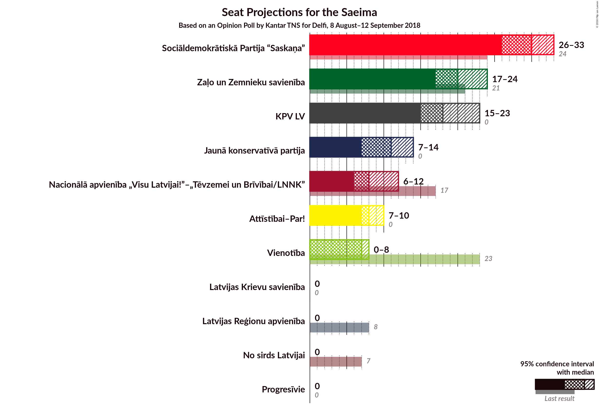
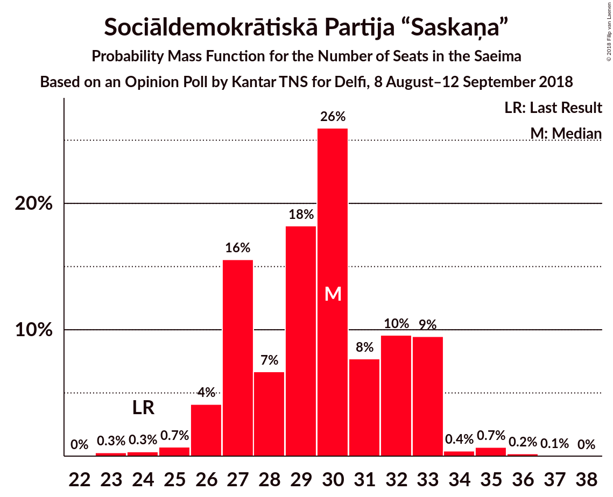
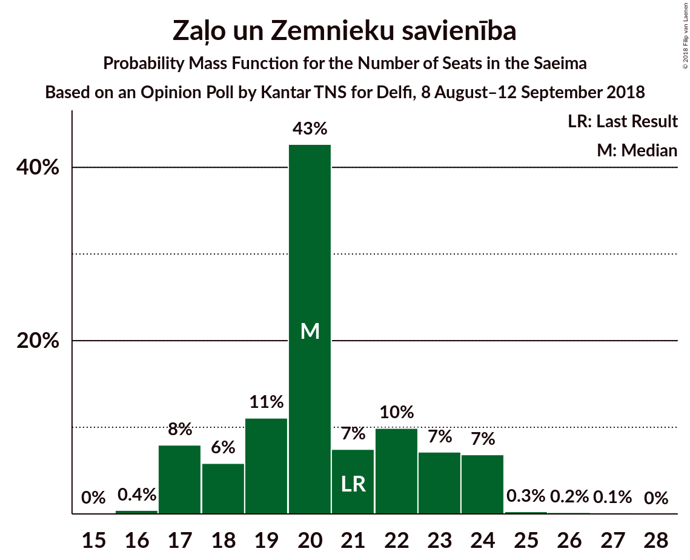
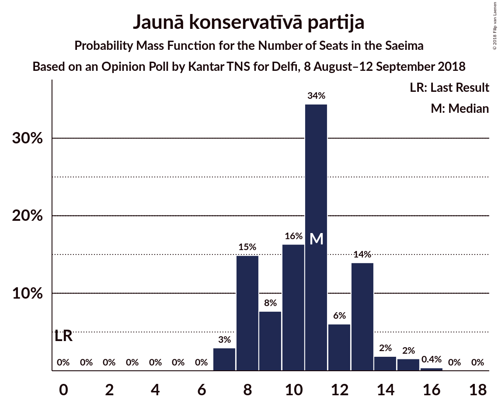
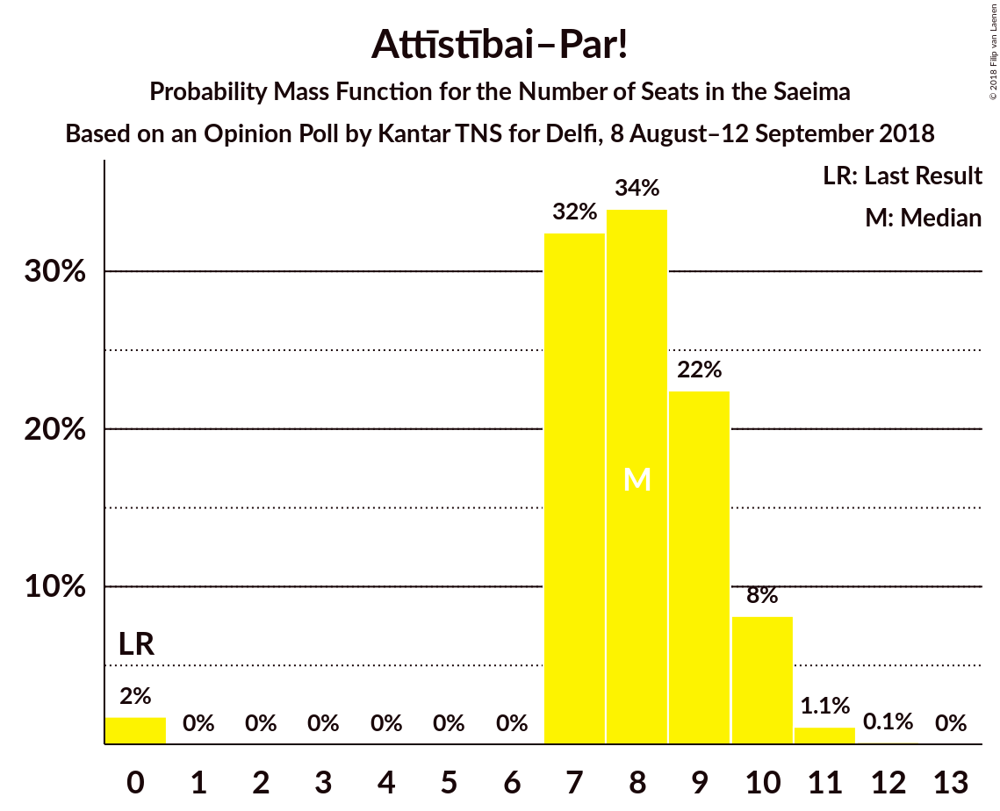

# Opinion Poll by Kantar TNS for Delfi, 8 August–12 September 2018

<a href="#voting-intentions">Voting Intentions</a> | <a href="#seats">Seats</a> | <a href="#coalitions">Coalitions</a> | <a href="#technical-information">Technical Information</a>

## Voting Intentions

### Confidence Intervals

| Party | Last Result | Poll Result | 80% Confidence Interval | 90% Confidence Interval | 95% Confidence Interval | 99% Confidence Interval |
|:-----:|:-----------:|:-----------:|:-----------------------:|:-----------------------:|:-----------------------:|:-----------------------:|
| Sociāldemokrātiskā Partija “Saskaņa” | 23.0% | 25.7% | 23.7–28.0% |23.1–28.6% |22.6–29.1% |21.6–30.2% |
| Zaļo un Zemnieku savienība | 19.5% | 17.0% | 15.2–18.9% |14.7–19.5% |14.3–20.0% |13.5–20.9% |
| KPV LV | 0.0% | 16.1% | 14.4–18.0% |13.9–18.5% |13.5–19.0% |12.7–20.0% |
| Jaunā konservatīvā partija | 0.7% | 9.2% | 7.9–10.8% |7.6–11.2% |7.3–11.6% |6.7–12.4% |
| Nacionālā apvienība „Visu Latvijai!”–„Tēvzemei un Brīvībai/LNNK” | 16.6% | 7.5% | 6.3–8.9% |6.0–9.3% |5.7–9.7% |5.2–10.4% |
| Attīstībai–Par! | 0.9% | 6.9% | 5.8–8.3% |5.5–8.7% |5.2–9.0% |4.7–9.7% |
| Vienotība | 21.9% | 5.6% | 4.6–6.8% |4.3–7.2% |4.1–7.5% |3.6–8.2% |
| Progresīvie | 0.0% | 1.3% | 0.9–2.1% |0.8–2.3% |0.7–2.5% |0.5–2.9% |
| Latvijas Reģionu apvienība | 6.7% | 0.7% | 0.5–1.4% |0.4–1.5% |0.3–1.7% |0.2–2.1% |
| Latvijas Krievu savienība | 1.6% | 0.7% | 0.5–1.4% |0.4–1.5% |0.3–1.7% |0.2–2.1% |
| No sirds Latvijai | 6.8% | 0.6% | 0.4–1.2% |0.3–1.3% |0.2–1.5% |0.2–1.8% |

*Note:* The poll result column reflects the actual value used in the calculations. Published results may vary slightly, and in addition be rounded to fewer digits.

## Seats

### Confidence Intervals

| Party | Last Result | Median | 80% Confidence Interval | 90% Confidence Interval | 95% Confidence Interval | 99% Confidence Interval |
|:-----:|:-----------:|:------:|:-----------------------:|:-----------------------:|:-----------------------:|:-----------------------:|
| <a href="#sociāldemokrātiskā-partija-“saskaņa”">Sociāldemokrātiskā Partija “Saskaņa”</a> | 24 | 30 | 27–33 |26–33 |26–33 |24–35 |
| <a href="#zaļo-un-zemnieku-savienība">Zaļo un Zemnieku savienība</a> | 21 | 20 | 18–23 |17–24 |17–24 |17–25 |
| <a href="#kpv-lv">KPV LV</a> | 0 | 18 | 16–21 |15–23 |15–23 |14–23 |
| <a href="#jaunā-konservatīvā-partija">Jaunā konservatīvā partija</a> | 0 | 11 | 8–13 |8–13 |7–14 |7–15 |
| <a href="#nacionālā-apvienība-„visu-latvijai!”–„tēvzemei-un-brīvībai/lnnk”">Nacionālā apvienība „Visu Latvijai!”–„Tēvzemei un Brīvībai/LNNK”</a> | 17 | 8 | 6–10 |6–11 |6–12 |6–13 |
| <a href="#attīstībai–par!">Attīstībai–Par!</a> | 0 | 8 | 7–9 |7–10 |7–10 |0–11 |
| <a href="#vienotība">Vienotība</a> | 23 | 7 | 0–8 |0–8 |0–8 |0–10 |
| <a href="#progresīvie">Progresīvie</a> | 0 | 0 | 0 |0 |0 |0 |
| <a href="#latvijas-reģionu-apvienība">Latvijas Reģionu apvienība</a> | 8 | 0 | 0 |0 |0 |0 |
| <a href="#latvijas-krievu-savienība">Latvijas Krievu savienība</a> | 0 | 0 | 0 |0 |0 |0 |
| <a href="#no-sirds-latvijai">No sirds Latvijai</a> | 7 | 0 | 0 |0 |0 |0 |

### Sociāldemokrātiskā Partija “Saskaņa”

*For a full overview of the results for this party, see the [Sociāldemokrātiskā Partija “Saskaņa”](party-sociāldemokrātiskāpartija“saskaņa”.html) page.*

| Number of Seats | Probability | Accumulated | Special Marks |
|:---------------:|:-----------:|:-----------:|:-------------:|
| 23 | 0.3% | 100% |  |
| 24 | 0.3% | 99.7% | Last Result |
| 25 | 0.7% | 99.4% |  |
| 26 | 4% | 98.6% |  |
| 27 | 16% | 95% |  |
| 28 | 7% | 79% |  |
| 29 | 18% | 72% |  |
| 30 | 26% | 54% | Median |
| 31 | 8% | 28% |  |
| 32 | 10% | 20% |  |
| 33 | 9% | 11% |  |
| 34 | 0.4% | 1.4% |  |
| 35 | 0.7% | 1.0% |  |
| 36 | 0.2% | 0.2% |  |
| 37 | 0.1% | 0.1% |  |
| 38 | 0% | 0% |  |

### Zaļo un Zemnieku savienība

*For a full overview of the results for this party, see the [Zaļo un Zemnieku savienība](party-zaļounzemniekusavienība.html) page.*

| Number of Seats | Probability | Accumulated | Special Marks |
|:---------------:|:-----------:|:-----------:|:-------------:|
| 16 | 0.4% | 100% |  |
| 17 | 8% | 99.5% |  |
| 18 | 6% | 92% |  |
| 19 | 11% | 86% |  |
| 20 | 43% | 75% | Median |
| 21 | 7% | 32% | Last Result |
| 22 | 10% | 25% |  |
| 23 | 7% | 15% |  |
| 24 | 7% | 7% |  |
| 25 | 0.3% | 0.6% |  |
| 26 | 0.2% | 0.3% |  |
| 27 | 0.1% | 0.2% |  |
| 28 | 0% | 0% |  |

### KPV LV

*For a full overview of the results for this party, see the [KPV LV](party-kpvlv.html) page.*

| Number of Seats | Probability | Accumulated | Special Marks |
|:---------------:|:-----------:|:-----------:|:-------------:|
| 0 | 0% | 100% | Last Result |
| 1 | 0% | 100% |  |
| 2 | 0% | 100% |  |
| 3 | 0% | 100% |  |
| 4 | 0% | 100% |  |
| 5 | 0% | 100% |  |
| 6 | 0% | 100% |  |
| 7 | 0% | 100% |  |
| 8 | 0% | 100% |  |
| 9 | 0% | 100% |  |
| 10 | 0% | 100% |  |
| 11 | 0% | 100% |  |
| 12 | 0% | 100% |  |
| 13 | 0% | 100% |  |
| 14 | 0.7% | 100% |  |
| 15 | 7% | 99.3% |  |
| 16 | 33% | 92% |  |
| 17 | 7% | 59% |  |
| 18 | 22% | 52% | Median |
| 19 | 7% | 30% |  |
| 20 | 10% | 23% |  |
| 21 | 5% | 12% |  |
| 22 | 2% | 8% |  |
| 23 | 5% | 5% |  |
| 24 | 0.1% | 0.1% |  |
| 25 | 0% | 0% |  |

### Jaunā konservatīvā partija

*For a full overview of the results for this party, see the [Jaunā konservatīvā partija](party-jaunākonservatīvāpartija.html) page.*

| Number of Seats | Probability | Accumulated | Special Marks |
|:---------------:|:-----------:|:-----------:|:-------------:|
| 0 | 0% | 100% | Last Result |
| 1 | 0% | 100% |  |
| 2 | 0% | 100% |  |
| 3 | 0% | 100% |  |
| 4 | 0% | 100% |  |
| 5 | 0% | 100% |  |
| 6 | 0% | 100% |  |
| 7 | 3% | 100% |  |
| 8 | 15% | 97% |  |
| 9 | 8% | 82% |  |
| 10 | 16% | 74% |  |
| 11 | 34% | 58% | Median |
| 12 | 6% | 24% |  |
| 13 | 14% | 18% |  |
| 14 | 2% | 4% |  |
| 15 | 2% | 2% |  |
| 16 | 0.4% | 0.4% |  |
| 17 | 0% | 0% |  |

### Nacionālā apvienība „Visu Latvijai!”–„Tēvzemei un Brīvībai/LNNK”

*For a full overview of the results for this party, see the [Nacionālā apvienība „Visu Latvijai!”–„Tēvzemei un Brīvībai/LNNK”](party-nacionālāapvienība„visulatvijai”–„tēvzemeiunbrīvībailnnk”.html) page.*

| Number of Seats | Probability | Accumulated | Special Marks |
|:---------------:|:-----------:|:-----------:|:-------------:|
| 0 | 0.3% | 100% |  |
| 1 | 0% | 99.7% |  |
| 2 | 0% | 99.7% |  |
| 3 | 0% | 99.7% |  |
| 4 | 0% | 99.7% |  |
| 5 | 0% | 99.7% |  |
| 6 | 10% | 99.7% |  |
| 7 | 32% | 89% |  |
| 8 | 14% | 57% | Median |
| 9 | 22% | 43% |  |
| 10 | 13% | 21% |  |
| 11 | 4% | 8% |  |
| 12 | 4% | 4% |  |
| 13 | 0.6% | 0.6% |  |
| 14 | 0% | 0% |  |
| 15 | 0% | 0% |  |
| 16 | 0% | 0% |  |
| 17 | 0% | 0% | Last Result |

### Attīstībai–Par!

*For a full overview of the results for this party, see the [Attīstībai–Par!](party-attīstībai–par.html) page.*

| Number of Seats | Probability | Accumulated | Special Marks |
|:---------------:|:-----------:|:-----------:|:-------------:|
| 0 | 2% | 100% | Last Result |
| 1 | 0% | 98% |  |
| 2 | 0% | 98% |  |
| 3 | 0% | 98% |  |
| 4 | 0% | 98% |  |
| 5 | 0% | 98% |  |
| 6 | 0% | 98% |  |
| 7 | 32% | 98% |  |
| 8 | 34% | 66% | Median |
| 9 | 22% | 32% |  |
| 10 | 8% | 9% |  |
| 11 | 1.1% | 1.3% |  |
| 12 | 0.1% | 0.2% |  |
| 13 | 0% | 0% |  |

### Vienotība

*For a full overview of the results for this party, see the [Vienotība](party-vienotība.html) page.*

| Number of Seats | Probability | Accumulated | Special Marks |
|:---------------:|:-----------:|:-----------:|:-------------:|
| 0 | 24% | 100% |  |
| 1 | 0% | 76% |  |
| 2 | 0% | 76% |  |
| 3 | 0% | 76% |  |
| 4 | 0% | 76% |  |
| 5 | 0% | 76% |  |
| 6 | 0% | 76% |  |
| 7 | 61% | 76% | Median |
| 8 | 13% | 15% |  |
| 9 | 0.9% | 2% |  |
| 10 | 1.3% | 1.3% |  |
| 11 | 0% | 0% |  |
| 12 | 0% | 0% |  |
| 13 | 0% | 0% |  |
| 14 | 0% | 0% |  |
| 15 | 0% | 0% |  |
| 16 | 0% | 0% |  |
| 17 | 0% | 0% |  |
| 18 | 0% | 0% |  |
| 19 | 0% | 0% |  |
| 20 | 0% | 0% |  |
| 21 | 0% | 0% |  |
| 22 | 0% | 0% |  |
| 23 | 0% | 0% | Last Result |

### Progresīvie

*For a full overview of the results for this party, see the [Progresīvie](party-progresīvie.html) page.*

| Number of Seats | Probability | Accumulated | Special Marks |
|:---------------:|:-----------:|:-----------:|:-------------:|
| 0 | 100% | 100% | Last Result, Median |

### Latvijas Reģionu apvienība

*For a full overview of the results for this party, see the [Latvijas Reģionu apvienība](party-latvijasreģionuapvienība.html) page.*

| Number of Seats | Probability | Accumulated | Special Marks |
|:---------------:|:-----------:|:-----------:|:-------------:|
| 0 | 100% | 100% | Median |
| 1 | 0% | 0% |  |
| 2 | 0% | 0% |  |
| 3 | 0% | 0% |  |
| 4 | 0% | 0% |  |
| 5 | 0% | 0% |  |
| 6 | 0% | 0% |  |
| 7 | 0% | 0% |  |
| 8 | 0% | 0% | Last Result |

### Latvijas Krievu savienība

*For a full overview of the results for this party, see the [Latvijas Krievu savienība](party-latvijaskrievusavienība.html) page.*

| Number of Seats | Probability | Accumulated | Special Marks |
|:---------------:|:-----------:|:-----------:|:-------------:|
| 0 | 100% | 100% | Last Result, Median |

### No sirds Latvijai

*For a full overview of the results for this party, see the [No sirds Latvijai](party-nosirdslatvijai.html) page.*

| Number of Seats | Probability | Accumulated | Special Marks |
|:---------------:|:-----------:|:-----------:|:-------------:|
| 0 | 100% | 100% | Median |
| 1 | 0% | 0% |  |
| 2 | 0% | 0% |  |
| 3 | 0% | 0% |  |
| 4 | 0% | 0% |  |
| 5 | 0% | 0% |  |
| 6 | 0% | 0% |  |
| 7 | 0% | 0% | Last Result |

## Coalitions

### Confidence Intervals

| Coalition | Last Result | Median | Majority? | 80% Confidence Interval | 90% Confidence Interval | 95% Confidence Interval | 99% Confidence Interval |
|:---------:|:-----------:|:------:|:---------:|:-----------------------:|:-----------------------:|:-----------------------:|:-----------------------:|
| Sociāldemokrātiskā Partija “Saskaņa” – Zaļo un Zemnieku savienība – KPV LV | 45 | 67 | 100% | 64–72 | 63–73 | 63–74 | 62–77 |
| Zaļo un Zemnieku savienība – Jaunā konservatīvā partija – Nacionālā apvienība „Visu Latvijai!”–„Tēvzemei un Brīvībai/LNNK” – Attīstībai–Par! – Vienotība | 61 | 53 | 80% | 49–56 | 48–57 | 45–57 | 45–58 |
| Sociāldemokrātiskā Partija “Saskaņa” – KPV LV | 24 | 47 | 13% | 44–51 | 43–52 | 43–55 | 42–55 |
| Sociāldemokrātiskā Partija “Saskaņa” – Jaunā konservatīvā partija – Attīstībai–Par! | 24 | 49 | 18% | 43–51 | 43–53 | 43–53 | 41–55 |
| Zaļo un Zemnieku savienība – Jaunā konservatīvā partija – Nacionālā apvienība „Visu Latvijai!”–„Tēvzemei un Brīvībai/LNNK” – Attīstībai–Par! | 38 | 47 | 15% | 43–51 | 42–53 | 42–53 | 41–56 |
| Zaļo un Zemnieku savienība – Jaunā konservatīvā partija – Nacionālā apvienība „Visu Latvijai!”–„Tēvzemei un Brīvībai/LNNK” – Vienotība | 61 | 45 | 1.2% | 41–48 | 40–49 | 37–50 | 37–51 |
| Zaļo un Zemnieku savienība – Nacionālā apvienība „Visu Latvijai!”–„Tēvzemei un Brīvībai/LNNK” – Attīstībai–Par! – Vienotība | 61 | 43 | 0% | 38–45 | 36–46 | 35–47 | 32–50 |
| Zaļo un Zemnieku savienība – Jaunā konservatīvā partija – Nacionālā apvienība „Visu Latvijai!”–„Tēvzemei un Brīvībai/LNNK” | 38 | 38 | 0% | 36–43 | 35–45 | 34–45 | 33–47 |
| Sociāldemokrātiskā Partija “Saskaņa” – Attīstībai–Par! | 24 | 38 | 0% | 35–40 | 34–41 | 33–42 | 31–43 |
| Zaļo un Zemnieku savienība – Nacionālā apvienība „Visu Latvijai!”–„Tēvzemei un Brīvībai/LNNK” – Attīstībai–Par! | 38 | 36 | 0% | 33–40 | 32–41 | 31–42 | 27–43 |
| Zaļo un Zemnieku savienība – Nacionālā apvienība „Visu Latvijai!”–„Tēvzemei un Brīvībai/LNNK” – Vienotība | 61 | 34 | 0% | 30–37 | 29–38 | 27–39 | 24–41 |
| Jaunā konservatīvā partija – Nacionālā apvienība „Visu Latvijai!”–„Tēvzemei un Brīvībai/LNNK” – Attīstībai–Par! – Vienotība | 40 | 33 | 0% | 28–36 | 27–37 | 26–37 | 23–38 |

### Sociāldemokrātiskā Partija “Saskaņa” – Zaļo un Zemnieku savienība – KPV LV

| Number of Seats | Probability | Accumulated | Special Marks |
|:---------------:|:-----------:|:-----------:|:-------------:|
| 45 | 0% | 100% | Last Result |
| 46 | 0% | 100% |  |
| 47 | 0% | 100% |  |
| 48 | 0% | 100% |  |
| 49 | 0% | 100% |  |
| 50 | 0% | 100% |  |
| 51 | 0% | 100% | Majority |
| 52 | 0% | 100% |  |
| 53 | 0% | 100% |  |
| 54 | 0% | 100% |  |
| 55 | 0% | 100% |  |
| 56 | 0% | 100% |  |
| 57 | 0% | 100% |  |
| 58 | 0% | 100% |  |
| 59 | 0% | 100% |  |
| 60 | 0.1% | 100% |  |
| 61 | 0.2% | 99.9% |  |
| 62 | 1.3% | 99.7% |  |
| 63 | 4% | 98% |  |
| 64 | 4% | 94% |  |
| 65 | 5% | 90% |  |
| 66 | 31% | 84% |  |
| 67 | 12% | 53% |  |
| 68 | 6% | 41% | Median |
| 69 | 7% | 36% |  |
| 70 | 11% | 28% |  |
| 71 | 7% | 17% |  |
| 72 | 2% | 10% |  |
| 73 | 4% | 8% |  |
| 74 | 3% | 5% |  |
| 75 | 0.7% | 2% |  |
| 76 | 0.7% | 1.4% |  |
| 77 | 0.7% | 0.8% |  |
| 78 | 0% | 0.1% |  |
| 79 | 0% | 0% |  |

### Zaļo un Zemnieku savienība – Jaunā konservatīvā partija – Nacionālā apvienība „Visu Latvijai!”–„Tēvzemei un Brīvībai/LNNK” – Attīstībai–Par! – Vienotība

| Number of Seats | Probability | Accumulated | Special Marks |
|:---------------:|:-----------:|:-----------:|:-------------:|
| 43 | 0.2% | 100% |  |
| 44 | 0.1% | 99.8% |  |
| 45 | 2% | 99.7% |  |
| 46 | 0.5% | 97% |  |
| 47 | 0.8% | 97% |  |
| 48 | 2% | 96% |  |
| 49 | 7% | 94% |  |
| 50 | 7% | 87% |  |
| 51 | 8% | 80% | Majority |
| 52 | 9% | 71% |  |
| 53 | 21% | 63% |  |
| 54 | 25% | 41% | Median |
| 55 | 6% | 16% |  |
| 56 | 3% | 10% |  |
| 57 | 5% | 7% |  |
| 58 | 2% | 2% |  |
| 59 | 0.4% | 0.4% |  |
| 60 | 0% | 0.1% |  |
| 61 | 0% | 0% | Last Result |

### Sociāldemokrātiskā Partija “Saskaņa” – KPV LV

| Number of Seats | Probability | Accumulated | Special Marks |
|:---------------:|:-----------:|:-----------:|:-------------:|
| 24 | 0% | 100% | Last Result |
| 25 | 0% | 100% |  |
| 26 | 0% | 100% |  |
| 27 | 0% | 100% |  |
| 28 | 0% | 100% |  |
| 29 | 0% | 100% |  |
| 30 | 0% | 100% |  |
| 31 | 0% | 100% |  |
| 32 | 0% | 100% |  |
| 33 | 0% | 100% |  |
| 34 | 0% | 100% |  |
| 35 | 0% | 100% |  |
| 36 | 0% | 100% |  |
| 37 | 0% | 100% |  |
| 38 | 0% | 100% |  |
| 39 | 0% | 100% |  |
| 40 | 0% | 100% |  |
| 41 | 0.4% | 99.9% |  |
| 42 | 2% | 99.6% |  |
| 43 | 5% | 98% |  |
| 44 | 3% | 93% |  |
| 45 | 6% | 90% |  |
| 46 | 25% | 84% |  |
| 47 | 21% | 59% |  |
| 48 | 9% | 37% | Median |
| 49 | 8% | 29% |  |
| 50 | 7% | 20% |  |
| 51 | 7% | 13% | Majority |
| 52 | 2% | 6% |  |
| 53 | 0.8% | 4% |  |
| 54 | 0.5% | 3% |  |
| 55 | 2% | 3% |  |
| 56 | 0.1% | 0.3% |  |
| 57 | 0.2% | 0.2% |  |
| 58 | 0% | 0% |  |

### Sociāldemokrātiskā Partija “Saskaņa” – Jaunā konservatīvā partija – Attīstībai–Par!

| Number of Seats | Probability | Accumulated | Special Marks |
|:---------------:|:-----------:|:-----------:|:-------------:|
| 24 | 0% | 100% | Last Result |
| 25 | 0% | 100% |  |
| 26 | 0% | 100% |  |
| 27 | 0% | 100% |  |
| 28 | 0% | 100% |  |
| 29 | 0% | 100% |  |
| 30 | 0% | 100% |  |
| 31 | 0% | 100% |  |
| 32 | 0% | 100% |  |
| 33 | 0% | 100% |  |
| 34 | 0% | 100% |  |
| 35 | 0% | 100% |  |
| 36 | 0% | 100% |  |
| 37 | 0% | 100% |  |
| 38 | 0% | 100% |  |
| 39 | 0% | 100% |  |
| 40 | 0% | 99.9% |  |
| 41 | 0.4% | 99.9% |  |
| 42 | 2% | 99.5% |  |
| 43 | 8% | 98% |  |
| 44 | 3% | 89% |  |
| 45 | 5% | 86% |  |
| 46 | 7% | 81% |  |
| 47 | 15% | 74% |  |
| 48 | 9% | 59% |  |
| 49 | 6% | 50% | Median |
| 50 | 26% | 44% |  |
| 51 | 8% | 18% | Majority |
| 52 | 2% | 9% |  |
| 53 | 6% | 7% |  |
| 54 | 0.8% | 1.4% |  |
| 55 | 0.2% | 0.6% |  |
| 56 | 0.3% | 0.4% |  |
| 57 | 0.1% | 0.2% |  |
| 58 | 0% | 0% |  |

### Zaļo un Zemnieku savienība – Jaunā konservatīvā partija – Nacionālā apvienība „Visu Latvijai!”–„Tēvzemei un Brīvībai/LNNK” – Attīstībai–Par!

| Number of Seats | Probability | Accumulated | Special Marks |
|:---------------:|:-----------:|:-----------:|:-------------:|
| 38 | 0% | 100% | Last Result |
| 39 | 0.1% | 100% |  |
| 40 | 0.3% | 99.9% |  |
| 41 | 1.3% | 99.6% |  |
| 42 | 4% | 98% |  |
| 43 | 7% | 94% |  |
| 44 | 3% | 87% |  |
| 45 | 13% | 84% |  |
| 46 | 13% | 71% |  |
| 47 | 26% | 58% | Median |
| 48 | 4% | 32% |  |
| 49 | 6% | 28% |  |
| 50 | 7% | 23% |  |
| 51 | 7% | 15% | Majority |
| 52 | 3% | 9% |  |
| 53 | 4% | 6% |  |
| 54 | 1.0% | 2% |  |
| 55 | 0.1% | 0.6% |  |
| 56 | 0.5% | 0.6% |  |
| 57 | 0% | 0.1% |  |
| 58 | 0% | 0% |  |

### Zaļo un Zemnieku savienība – Jaunā konservatīvā partija – Nacionālā apvienība „Visu Latvijai!”–„Tēvzemei un Brīvībai/LNNK” – Vienotība

| Number of Seats | Probability | Accumulated | Special Marks |
|:---------------:|:-----------:|:-----------:|:-------------:|
| 36 | 0.2% | 100% |  |
| 37 | 2% | 99.7% |  |
| 38 | 0.4% | 97% |  |
| 39 | 0.5% | 97% |  |
| 40 | 3% | 96% |  |
| 41 | 5% | 94% |  |
| 42 | 4% | 89% |  |
| 43 | 12% | 85% |  |
| 44 | 9% | 73% |  |
| 45 | 37% | 64% |  |
| 46 | 9% | 27% | Median |
| 47 | 4% | 18% |  |
| 48 | 6% | 14% |  |
| 49 | 5% | 8% |  |
| 50 | 1.3% | 3% |  |
| 51 | 0.9% | 1.2% | Majority |
| 52 | 0.2% | 0.3% |  |
| 53 | 0.1% | 0.1% |  |
| 54 | 0% | 0% |  |
| 55 | 0% | 0% |  |
| 56 | 0% | 0% |  |
| 57 | 0% | 0% |  |
| 58 | 0% | 0% |  |
| 59 | 0% | 0% |  |
| 60 | 0% | 0% |  |
| 61 | 0% | 0% | Last Result |

### Zaļo un Zemnieku savienība – Nacionālā apvienība „Visu Latvijai!”–„Tēvzemei un Brīvībai/LNNK” – Attīstībai–Par! – Vienotība

| Number of Seats | Probability | Accumulated | Special Marks |
|:---------------:|:-----------:|:-----------:|:-------------:|
| 31 | 0% | 100% |  |
| 32 | 0.8% | 99.9% |  |
| 33 | 0% | 99.1% |  |
| 34 | 1.3% | 99.1% |  |
| 35 | 2% | 98% |  |
| 36 | 2% | 96% |  |
| 37 | 2% | 94% |  |
| 38 | 4% | 92% |  |
| 39 | 6% | 88% |  |
| 40 | 11% | 82% |  |
| 41 | 6% | 72% |  |
| 42 | 10% | 65% |  |
| 43 | 26% | 55% | Median |
| 44 | 10% | 29% |  |
| 45 | 12% | 19% |  |
| 46 | 4% | 7% |  |
| 47 | 2% | 3% |  |
| 48 | 0.5% | 1.5% |  |
| 49 | 0.3% | 1.0% |  |
| 50 | 0.7% | 0.7% |  |
| 51 | 0% | 0% | Majority |
| 52 | 0% | 0% |  |
| 53 | 0% | 0% |  |
| 54 | 0% | 0% |  |
| 55 | 0% | 0% |  |
| 56 | 0% | 0% |  |
| 57 | 0% | 0% |  |
| 58 | 0% | 0% |  |
| 59 | 0% | 0% |  |
| 60 | 0% | 0% |  |
| 61 | 0% | 0% | Last Result |

### Zaļo un Zemnieku savienība – Jaunā konservatīvā partija – Nacionālā apvienība „Visu Latvijai!”–„Tēvzemei un Brīvībai/LNNK”

| Number of Seats | Probability | Accumulated | Special Marks |
|:---------------:|:-----------:|:-----------:|:-------------:|
| 32 | 0.2% | 100% |  |
| 33 | 1.2% | 99.8% |  |
| 34 | 3% | 98.6% |  |
| 35 | 1.0% | 95% |  |
| 36 | 8% | 94% |  |
| 37 | 9% | 86% |  |
| 38 | 38% | 77% | Last Result |
| 39 | 3% | 39% | Median |
| 40 | 6% | 36% |  |
| 41 | 5% | 29% |  |
| 42 | 10% | 24% |  |
| 43 | 7% | 15% |  |
| 44 | 2% | 8% |  |
| 45 | 5% | 6% |  |
| 46 | 0.9% | 1.5% |  |
| 47 | 0.5% | 0.6% |  |
| 48 | 0.1% | 0.1% |  |
| 49 | 0% | 0.1% |  |
| 50 | 0% | 0% |  |

### Sociāldemokrātiskā Partija “Saskaņa” – Attīstībai–Par!

| Number of Seats | Probability | Accumulated | Special Marks |
|:---------------:|:-----------:|:-----------:|:-------------:|
| 24 | 0% | 100% | Last Result |
| 25 | 0% | 100% |  |
| 26 | 0% | 100% |  |
| 27 | 0% | 100% |  |
| 28 | 0.1% | 99.9% |  |
| 29 | 0% | 99.9% |  |
| 30 | 0.1% | 99.8% |  |
| 31 | 1.3% | 99.7% |  |
| 32 | 0.6% | 98% |  |
| 33 | 2% | 98% |  |
| 34 | 4% | 96% |  |
| 35 | 14% | 91% |  |
| 36 | 16% | 77% |  |
| 37 | 7% | 61% |  |
| 38 | 7% | 54% | Median |
| 39 | 25% | 47% |  |
| 40 | 13% | 22% |  |
| 41 | 6% | 8% |  |
| 42 | 2% | 3% |  |
| 43 | 0.9% | 1.2% |  |
| 44 | 0.1% | 0.3% |  |
| 45 | 0.2% | 0.2% |  |
| 46 | 0% | 0% |  |

### Zaļo un Zemnieku savienība – Nacionālā apvienība „Visu Latvijai!”–„Tēvzemei un Brīvībai/LNNK” – Attīstībai–Par!

| Number of Seats | Probability | Accumulated | Special Marks |
|:---------------:|:-----------:|:-----------:|:-------------:|
| 27 | 1.1% | 100% |  |
| 28 | 0.1% | 98.9% |  |
| 29 | 0.1% | 98.8% |  |
| 30 | 0.2% | 98.7% |  |
| 31 | 3% | 98% |  |
| 32 | 4% | 96% |  |
| 33 | 2% | 92% |  |
| 34 | 11% | 89% |  |
| 35 | 5% | 78% |  |
| 36 | 27% | 73% | Median |
| 37 | 13% | 46% |  |
| 38 | 12% | 32% | Last Result |
| 39 | 5% | 21% |  |
| 40 | 10% | 16% |  |
| 41 | 2% | 6% |  |
| 42 | 2% | 4% |  |
| 43 | 1.0% | 1.3% |  |
| 44 | 0.3% | 0.3% |  |
| 45 | 0% | 0% |  |

### Zaļo un Zemnieku savienība – Nacionālā apvienība „Visu Latvijai!”–„Tēvzemei un Brīvībai/LNNK” – Vienotība

| Number of Seats | Probability | Accumulated | Special Marks |
|:---------------:|:-----------:|:-----------:|:-------------:|
| 24 | 0.7% | 100% |  |
| 25 | 0% | 99.2% |  |
| 26 | 0.1% | 99.2% |  |
| 27 | 3% | 99.1% |  |
| 28 | 1.0% | 97% |  |
| 29 | 2% | 96% |  |
| 30 | 3% | 93% |  |
| 31 | 6% | 90% |  |
| 32 | 11% | 83% |  |
| 33 | 4% | 72% |  |
| 34 | 26% | 68% |  |
| 35 | 11% | 42% | Median |
| 36 | 12% | 31% |  |
| 37 | 12% | 20% |  |
| 38 | 4% | 8% |  |
| 39 | 2% | 4% |  |
| 40 | 0.8% | 2% |  |
| 41 | 1.2% | 1.2% |  |
| 42 | 0% | 0.1% |  |
| 43 | 0% | 0% |  |
| 44 | 0% | 0% |  |
| 45 | 0% | 0% |  |
| 46 | 0% | 0% |  |
| 47 | 0% | 0% |  |
| 48 | 0% | 0% |  |
| 49 | 0% | 0% |  |
| 50 | 0% | 0% |  |
| 51 | 0% | 0% | Majority |
| 52 | 0% | 0% |  |
| 53 | 0% | 0% |  |
| 54 | 0% | 0% |  |
| 55 | 0% | 0% |  |
| 56 | 0% | 0% |  |
| 57 | 0% | 0% |  |
| 58 | 0% | 0% |  |
| 59 | 0% | 0% |  |
| 60 | 0% | 0% |  |
| 61 | 0% | 0% | Last Result |

### Jaunā konservatīvā partija – Nacionālā apvienība „Visu Latvijai!”–„Tēvzemei un Brīvībai/LNNK” – Attīstībai–Par! – Vienotība

| Number of Seats | Probability | Accumulated | Special Marks |
|:---------------:|:-----------:|:-----------:|:-------------:|
| 22 | 0% | 100% |  |
| 23 | 0.7% | 99.9% |  |
| 24 | 0.7% | 99.2% |  |
| 25 | 0.7% | 98.6% |  |
| 26 | 3% | 98% |  |
| 27 | 4% | 95% |  |
| 28 | 2% | 92% |  |
| 29 | 7% | 90% |  |
| 30 | 11% | 83% |  |
| 31 | 7% | 72% |  |
| 32 | 6% | 64% |  |
| 33 | 12% | 59% |  |
| 34 | 31% | 47% | Median |
| 35 | 5% | 16% |  |
| 36 | 4% | 10% |  |
| 37 | 4% | 6% |  |
| 38 | 1.3% | 2% |  |
| 39 | 0.2% | 0.3% |  |
| 40 | 0.1% | 0.1% | Last Result |
| 41 | 0% | 0% |  |

## Technical Information

### Opinion Poll

+ **Polling firm:** Kantar TNS
+ **Commissioner(s):** Delfi
+ **Fieldwork period:** 8 August–12 September 2018

### Calculations

+ **Sample size:** 684
+ **Simulations done:** 1,048,576
+ **Error estimate:** 1.46%

