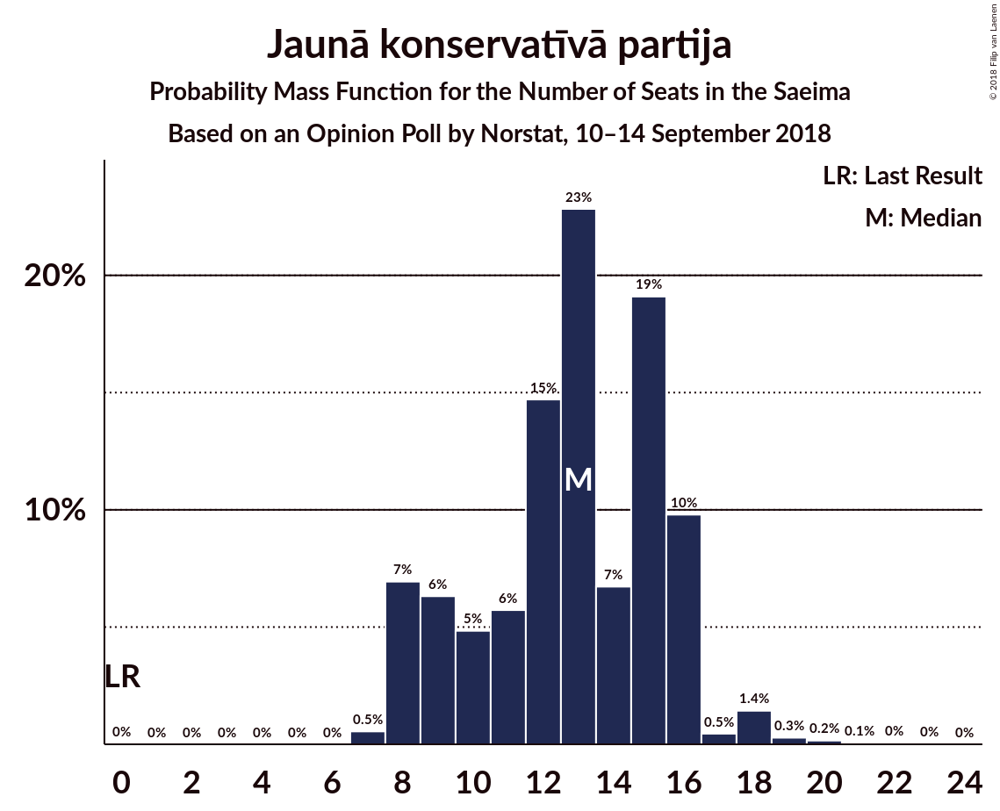

# Opinion Poll by Norstat, 10–14 September 2018

<a href="#voting-intentions">Voting Intentions</a> | <a href="#seats">Seats</a> | <a href="#coalitions">Coalitions</a> | <a href="#technical-information">Technical Information</a>

## Voting Intentions

### Confidence Intervals

| Party | Last Result | Poll Result | 80% Confidence Interval | 90% Confidence Interval | 95% Confidence Interval | 99% Confidence Interval |
|:-----:|:-----------:|:-----------:|:-----------------------:|:-----------------------:|:-----------------------:|:-----------------------:|
| Sociāldemokrātiskā Partija “Saskaņa” | 23.0% | 23.2% | 20.2–26.6% |19.3–27.6% |18.6–28.4% |17.3–30.1% |
| Zaļo un Zemnieku savienība | 19.5% | 15.1% | 12.7–18.1% |12.0–19.0% |11.4–19.7% |10.3–21.2% |
| Kam pieder valsts? | 0.0% | 13.3% | 11.1–16.2% |10.4–17.1% |9.9–17.8% |8.9–19.2% |
| Jaunā konservatīvā partija | 0.7% | 10.2% | 8.2–12.8% |7.7–13.6% |7.2–14.3% |6.3–15.6% |
| Nacionālā apvienība „Visu Latvijai!”–„Tēvzemei un Brīvībai/LNNK” | 16.6% | 9.1% | 7.3–11.7% |6.7–12.4% |6.3–13.0% |5.5–14.4% |
| Kustība Par! | 0.0% | 7.7% | 6.0–10.1% |5.5–10.8% |5.2–11.4% |4.5–12.7% |
| Vienotība | 21.9% | 5.6% | 4.2–7.8% |3.8–8.4% |3.5–8.9% |2.9–10.1% |
| Latvijas Krievu savienība | 1.6% | 3.2% | 2.2–4.9% |1.9–5.4% |1.7–5.9% |1.3–6.9% |
| Latvijas Reģionu apvienība | 6.7% | 2.5% | 1.6–4.1% |1.4–4.6% |1.2–5.0% |0.9–5.9% |

*Note:* The poll result column reflects the actual value used in the calculations. Published results may vary slightly, and in addition be rounded to fewer digits.

## Seats

### Confidence Intervals

| Party | Last Result | Median | 80% Confidence Interval | 90% Confidence Interval | 95% Confidence Interval | 99% Confidence Interval |
|:-----:|:-----------:|:------:|:-----------------------:|:-----------------------:|:-----------------------:|:-----------------------:|
| <a href="#sociāldemokrātiskā-partija-“saskaņa”">Sociāldemokrātiskā Partija “Saskaņa”</a> | 24 | 27 | 25–29 |23–32 |23–33 |20–34 |
| <a href="#zaļo-un-zemnieku-savienība">Zaļo un Zemnieku savienība</a> | 21 | 19 | 16–22 |16–23 |15–23 |13–24 |
| <a href="#kam-pieder-valsts?">Kam pieder valsts?</a> | 0 | 15 | 14–18 |14–19 |11–20 |10–22 |
| <a href="#jaunā-konservatīvā-partija">Jaunā konservatīvā partija</a> | 0 | 12 | 10–14 |8–15 |8–15 |7–18 |
| <a href="#nacionālā-apvienība-„visu-latvijai!”–„tēvzemei-un-brīvībai/lnnk”">Nacionālā apvienība „Visu Latvijai!”–„Tēvzemei un Brīvībai/LNNK”</a> | 17 | 11 | 9–14 |7–14 |6–16 |6–18 |
| <a href="#kustība-par!">Kustība Par!</a> | 0 | 9 | 7–12 |7–12 |7–13 |0–15 |
| <a href="#vienotība">Vienotība</a> | 23 | 7 | 0–8 |0–10 |0–10 |0–11 |
| <a href="#latvijas-krievu-savienība">Latvijas Krievu savienība</a> | 0 | 0 | 0 |0–6 |0–7 |0–7 |
| <a href="#latvijas-reģionu-apvienība">Latvijas Reģionu apvienība</a> | 8 | 0 | 0 |0 |0 |0–7 |

### Sociāldemokrātiskā Partija “Saskaņa”

*For a full overview of the results for this party, see the [Sociāldemokrātiskā Partija “Saskaņa”](party-sociāldemokrātiskāpartija“saskaņa”.html) page.*

| Number of Seats | Probability | Accumulated | Special Marks |
|:---------------:|:-----------:|:-----------:|:-------------:|
| 19 | 0.2% | 100% |  |
| 20 | 0.4% | 99.8% |  |
| 21 | 0.4% | 99.4% |  |
| 22 | 0.5% | 99.0% |  |
| 23 | 7% | 98.5% |  |
| 24 | 2% | 92% | Last Result |
| 25 | 2% | 90% |  |
| 26 | 32% | 88% |  |
| 27 | 34% | 56% | Median |
| 28 | 8% | 22% |  |
| 29 | 5% | 14% |  |
| 30 | 2% | 10% |  |
| 31 | 1.2% | 8% |  |
| 32 | 4% | 7% |  |
| 33 | 1.2% | 3% |  |
| 34 | 1.0% | 1.5% |  |
| 35 | 0.2% | 0.5% |  |
| 36 | 0.2% | 0.3% |  |
| 37 | 0% | 0.1% |  |
| 38 | 0% | 0% |  |

### Zaļo un Zemnieku savienība

*For a full overview of the results for this party, see the [Zaļo un Zemnieku savienība](party-zaļounzemniekusavienība.html) page.*

| Number of Seats | Probability | Accumulated | Special Marks |
|:---------------:|:-----------:|:-----------:|:-------------:|
| 11 | 0% | 100% |  |
| 12 | 0.1% | 99.9% |  |
| 13 | 0.4% | 99.8% |  |
| 14 | 0.4% | 99.5% |  |
| 15 | 3% | 99.1% |  |
| 16 | 9% | 96% |  |
| 17 | 29% | 87% |  |
| 18 | 2% | 58% |  |
| 19 | 8% | 56% | Median |
| 20 | 31% | 48% |  |
| 21 | 7% | 17% | Last Result |
| 22 | 5% | 10% |  |
| 23 | 3% | 5% |  |
| 24 | 1.3% | 2% |  |
| 25 | 0.3% | 0.4% |  |
| 26 | 0% | 0.1% |  |
| 27 | 0.1% | 0.1% |  |
| 28 | 0% | 0% |  |

### Kam pieder valsts?

*For a full overview of the results for this party, see the [Kam pieder valsts?](party-kampiedervalsts.html) page.*

| Number of Seats | Probability | Accumulated | Special Marks |
|:---------------:|:-----------:|:-----------:|:-------------:|
| 0 | 0% | 100% | Last Result |
| 1 | 0% | 100% |  |
| 2 | 0% | 100% |  |
| 3 | 0% | 100% |  |
| 4 | 0% | 100% |  |
| 5 | 0% | 100% |  |
| 6 | 0% | 100% |  |
| 7 | 0% | 100% |  |
| 8 | 0% | 100% |  |
| 9 | 0.4% | 100% |  |
| 10 | 0.3% | 99.6% |  |
| 11 | 2% | 99.2% |  |
| 12 | 1.4% | 97% |  |
| 13 | 0.5% | 96% |  |
| 14 | 34% | 95% |  |
| 15 | 38% | 61% | Median |
| 16 | 9% | 23% |  |
| 17 | 3% | 14% |  |
| 18 | 3% | 11% |  |
| 19 | 4% | 8% |  |
| 20 | 2% | 3% |  |
| 21 | 0.4% | 1.4% |  |
| 22 | 0.6% | 1.0% |  |
| 23 | 0.2% | 0.3% |  |
| 24 | 0.1% | 0.1% |  |
| 25 | 0% | 0% |  |

### Jaunā konservatīvā partija

*For a full overview of the results for this party, see the [Jaunā konservatīvā partija](party-jaunākonservatīvāpartija.html) page.*

| Number of Seats | Probability | Accumulated | Special Marks |
|:---------------:|:-----------:|:-----------:|:-------------:|
| 0 | 0% | 100% | Last Result |
| 1 | 0% | 100% |  |
| 2 | 0% | 100% |  |
| 3 | 0% | 100% |  |
| 4 | 0% | 100% |  |
| 5 | 0% | 100% |  |
| 6 | 0% | 100% |  |
| 7 | 0.6% | 100% |  |
| 8 | 6% | 99.4% |  |
| 9 | 2% | 93% |  |
| 10 | 9% | 92% |  |
| 11 | 28% | 82% |  |
| 12 | 4% | 54% | Median |
| 13 | 32% | 49% |  |
| 14 | 10% | 17% |  |
| 15 | 6% | 8% |  |
| 16 | 0.7% | 2% |  |
| 17 | 0.2% | 1.0% |  |
| 18 | 0.4% | 0.8% |  |
| 19 | 0.3% | 0.4% |  |
| 20 | 0.1% | 0.1% |  |
| 21 | 0% | 0% |  |

### Nacionālā apvienība „Visu Latvijai!”–„Tēvzemei un Brīvībai/LNNK”

*For a full overview of the results for this party, see the [Nacionālā apvienība „Visu Latvijai!”–„Tēvzemei un Brīvībai/LNNK”](party-nacionālāapvienība„visulatvijai”–„tēvzemeiunbrīvībailnnk”.html) page.*

| Number of Seats | Probability | Accumulated | Special Marks |
|:---------------:|:-----------:|:-----------:|:-------------:|
| 0 | 0.1% | 100% |  |
| 1 | 0% | 99.9% |  |
| 2 | 0% | 99.9% |  |
| 3 | 0% | 99.9% |  |
| 4 | 0% | 99.9% |  |
| 5 | 0% | 99.9% |  |
| 6 | 4% | 99.9% |  |
| 7 | 2% | 96% |  |
| 8 | 1.3% | 94% |  |
| 9 | 32% | 93% |  |
| 10 | 7% | 61% |  |
| 11 | 6% | 54% | Median |
| 12 | 5% | 48% |  |
| 13 | 31% | 43% |  |
| 14 | 7% | 11% |  |
| 15 | 2% | 5% |  |
| 16 | 2% | 3% |  |
| 17 | 0.2% | 0.8% | Last Result |
| 18 | 0.6% | 0.6% |  |
| 19 | 0% | 0% |  |

### Kustība Par!

*For a full overview of the results for this party, see the [Kustība Par!](party-kustībapar.html) page.*

| Number of Seats | Probability | Accumulated | Special Marks |
|:---------------:|:-----------:|:-----------:|:-------------:|
| 0 | 2% | 100% | Last Result |
| 1 | 0% | 98% |  |
| 2 | 0% | 98% |  |
| 3 | 0% | 98% |  |
| 4 | 0% | 98% |  |
| 5 | 0% | 98% |  |
| 6 | 0% | 98% |  |
| 7 | 9% | 98% |  |
| 8 | 10% | 89% |  |
| 9 | 32% | 79% | Median |
| 10 | 11% | 47% |  |
| 11 | 8% | 37% |  |
| 12 | 25% | 28% |  |
| 13 | 1.1% | 3% |  |
| 14 | 0.6% | 2% |  |
| 15 | 1.1% | 1.3% |  |
| 16 | 0% | 0.2% |  |
| 17 | 0.2% | 0.2% |  |
| 18 | 0% | 0% |  |

### Vienotība

*For a full overview of the results for this party, see the [Vienotība](party-vienotība.html) page.*

| Number of Seats | Probability | Accumulated | Special Marks |
|:---------------:|:-----------:|:-----------:|:-------------:|
| 0 | 19% | 100% |  |
| 1 | 0% | 81% |  |
| 2 | 0% | 81% |  |
| 3 | 0% | 81% |  |
| 4 | 0% | 81% |  |
| 5 | 0% | 81% |  |
| 6 | 0% | 81% |  |
| 7 | 68% | 81% | Median |
| 8 | 5% | 13% |  |
| 9 | 4% | 9% |  |
| 10 | 5% | 5% |  |
| 11 | 0.1% | 0.5% |  |
| 12 | 0.2% | 0.4% |  |
| 13 | 0.1% | 0.2% |  |
| 14 | 0% | 0% |  |
| 15 | 0% | 0% |  |
| 16 | 0% | 0% |  |
| 17 | 0% | 0% |  |
| 18 | 0% | 0% |  |
| 19 | 0% | 0% |  |
| 20 | 0% | 0% |  |
| 21 | 0% | 0% |  |
| 22 | 0% | 0% |  |
| 23 | 0% | 0% | Last Result |

### Latvijas Krievu savienība

*For a full overview of the results for this party, see the [Latvijas Krievu savienība](party-latvijaskrievusavienība.html) page.*

| Number of Seats | Probability | Accumulated | Special Marks |
|:---------------:|:-----------:|:-----------:|:-------------:|
| 0 | 93% | 100% | Last Result, Median |
| 1 | 0% | 7% |  |
| 2 | 0% | 7% |  |
| 3 | 0% | 7% |  |
| 4 | 0% | 7% |  |
| 5 | 0% | 7% |  |
| 6 | 3% | 7% |  |
| 7 | 3% | 4% |  |
| 8 | 0.3% | 0.5% |  |
| 9 | 0.1% | 0.1% |  |
| 10 | 0% | 0% |  |

### Latvijas Reģionu apvienība

*For a full overview of the results for this party, see the [Latvijas Reģionu apvienība](party-latvijasreģionuapvienība.html) page.*

| Number of Seats | Probability | Accumulated | Special Marks |
|:---------------:|:-----------:|:-----------:|:-------------:|
| 0 | 99.0% | 100% | Median |
| 1 | 0% | 1.0% |  |
| 2 | 0% | 1.0% |  |
| 3 | 0% | 1.0% |  |
| 4 | 0% | 1.0% |  |
| 5 | 0% | 1.0% |  |
| 6 | 0.1% | 1.0% |  |
| 7 | 0.7% | 0.9% |  |
| 8 | 0.2% | 0.2% | Last Result |
| 9 | 0% | 0% |  |

## Coalitions

### Confidence Intervals

| Coalition | Last Result | Median | Majority? | 80% Confidence Interval | 90% Confidence Interval | 95% Confidence Interval | 99% Confidence Interval |
|:---------:|:-----------:|:------:|:---------:|:-----------------------:|:-----------------------:|:-----------------------:|:-----------------------:|
| Zaļo un Zemnieku savienība – Jaunā konservatīvā partija – Nacionālā apvienība „Visu Latvijai!”–„Tēvzemei un Brīvībai/LNNK” – Kustība Par! – Vienotība | 61 | 58 | 97% | 53–60 | 51–61 | 50–63 | 48–65 |
| Zaļo un Zemnieku savienība – Jaunā konservatīvā partija – Nacionālā apvienība „Visu Latvijai!”–„Tēvzemei un Brīvībai/LNNK” – Kustība Par! | 38 | 51 | 79% | 47–54 | 45–56 | 44–58 | 42–61 |
| Zaļo un Zemnieku savienība – Jaunā konservatīvā partija – Nacionālā apvienība „Visu Latvijai!”–„Tēvzemei un Brīvībai/LNNK” – Vienotība | 61 | 47 | 37% | 43–51 | 41–53 | 39–56 | 38–57 |
| Zaļo un Zemnieku savienība – Nacionālā apvienība „Visu Latvijai!”–„Tēvzemei un Brīvībai/LNNK” – Kustība Par! – Vienotība | 61 | 45 | 2% | 39–49 | 39–49 | 38–50 | 35–53 |
| Zaļo un Zemnieku savienība – Jaunā konservatīvā partija – Nacionālā apvienība „Visu Latvijai!”–„Tēvzemei un Brīvībai/LNNK” | 38 | 42 | 0.7% | 38–46 | 37–48 | 35–50 | 33–51 |
| Zaļo un Zemnieku savienība – Nacionālā apvienība „Visu Latvijai!”–„Tēvzemei un Brīvībai/LNNK” – Kustība Par! | 38 | 39 | 0.1% | 37–42 | 35–43 | 33–44 | 30–47 |
| Jaunā konservatīvā partija – Nacionālā apvienība „Visu Latvijai!”–„Tēvzemei un Brīvībai/LNNK” – Kustība Par! – Vienotība | 40 | 40 | 0% | 33–41 | 32–42 | 30–44 | 27–47 |
| Zaļo un Zemnieku savienība – Nacionālā apvienība „Visu Latvijai!”–„Tēvzemei un Brīvībai/LNNK” – Vienotība | 61 | 36 | 0% | 29–40 | 29–41 | 28–43 | 26–45 |

### Zaļo un Zemnieku savienība – Jaunā konservatīvā partija – Nacionālā apvienība „Visu Latvijai!”–„Tēvzemei un Brīvībai/LNNK” – Kustība Par! – Vienotība

| Number of Seats | Probability | Accumulated | Special Marks |
|:---------------:|:-----------:|:-----------:|:-------------:|
| 43 | 0.2% | 100% |  |
| 44 | 0.1% | 99.8% |  |
| 45 | 0.1% | 99.8% |  |
| 46 | 0% | 99.6% |  |
| 47 | 0.1% | 99.6% |  |
| 48 | 0.7% | 99.5% |  |
| 49 | 0.6% | 98.9% |  |
| 50 | 0.9% | 98% |  |
| 51 | 4% | 97% | Majority |
| 52 | 3% | 93% |  |
| 53 | 5% | 90% |  |
| 54 | 6% | 86% |  |
| 55 | 3% | 80% |  |
| 56 | 3% | 77% |  |
| 57 | 6% | 74% |  |
| 58 | 30% | 68% | Median |
| 59 | 2% | 37% |  |
| 60 | 27% | 35% |  |
| 61 | 5% | 8% | Last Result |
| 62 | 0.6% | 4% |  |
| 63 | 2% | 3% |  |
| 64 | 0.3% | 1.2% |  |
| 65 | 0.7% | 1.0% |  |
| 66 | 0.1% | 0.3% |  |
| 67 | 0.1% | 0.1% |  |
| 68 | 0% | 0% |  |

### Zaļo un Zemnieku savienība – Jaunā konservatīvā partija – Nacionālā apvienība „Visu Latvijai!”–„Tēvzemei un Brīvībai/LNNK” – Kustība Par!

| Number of Seats | Probability | Accumulated | Special Marks |
|:---------------:|:-----------:|:-----------:|:-------------:|
| 38 | 0.1% | 100% | Last Result |
| 39 | 0% | 99.9% |  |
| 40 | 0.1% | 99.8% |  |
| 41 | 0.2% | 99.8% |  |
| 42 | 0.5% | 99.5% |  |
| 43 | 0.4% | 99.0% |  |
| 44 | 2% | 98.6% |  |
| 45 | 3% | 97% |  |
| 46 | 2% | 94% |  |
| 47 | 4% | 92% |  |
| 48 | 2% | 89% |  |
| 49 | 2% | 87% |  |
| 50 | 6% | 86% |  |
| 51 | 32% | 79% | Median, Majority |
| 52 | 3% | 48% |  |
| 53 | 30% | 45% |  |
| 54 | 6% | 15% |  |
| 55 | 2% | 8% |  |
| 56 | 2% | 7% |  |
| 57 | 1.1% | 5% |  |
| 58 | 2% | 4% |  |
| 59 | 1.1% | 2% |  |
| 60 | 0.2% | 0.7% |  |
| 61 | 0.3% | 0.5% |  |
| 62 | 0% | 0.2% |  |
| 63 | 0% | 0.2% |  |
| 64 | 0.1% | 0.1% |  |
| 65 | 0% | 0% |  |

### Zaļo un Zemnieku savienība – Jaunā konservatīvā partija – Nacionālā apvienība „Visu Latvijai!”–„Tēvzemei un Brīvībai/LNNK” – Vienotība

| Number of Seats | Probability | Accumulated | Special Marks |
|:---------------:|:-----------:|:-----------:|:-------------:|
| 35 | 0.2% | 100% |  |
| 36 | 0% | 99.8% |  |
| 37 | 0.1% | 99.7% |  |
| 38 | 0.3% | 99.7% |  |
| 39 | 2% | 99.3% |  |
| 40 | 0.6% | 97% |  |
| 41 | 2% | 97% |  |
| 42 | 1.2% | 95% |  |
| 43 | 7% | 93% |  |
| 44 | 3% | 86% |  |
| 45 | 3% | 83% |  |
| 46 | 23% | 80% |  |
| 47 | 13% | 57% |  |
| 48 | 1.5% | 44% |  |
| 49 | 2% | 43% | Median |
| 50 | 4% | 40% |  |
| 51 | 27% | 37% | Majority |
| 52 | 2% | 9% |  |
| 53 | 4% | 7% |  |
| 54 | 0.4% | 3% |  |
| 55 | 0.2% | 3% |  |
| 56 | 2% | 3% |  |
| 57 | 0.4% | 0.8% |  |
| 58 | 0.3% | 0.4% |  |
| 59 | 0.1% | 0.1% |  |
| 60 | 0% | 0% |  |
| 61 | 0% | 0% | Last Result |

### Zaļo un Zemnieku savienība – Nacionālā apvienība „Visu Latvijai!”–„Tēvzemei un Brīvībai/LNNK” – Kustība Par! – Vienotība

| Number of Seats | Probability | Accumulated | Special Marks |
|:---------------:|:-----------:|:-----------:|:-------------:|
| 31 | 0% | 100% |  |
| 32 | 0.1% | 99.9% |  |
| 33 | 0.1% | 99.8% |  |
| 34 | 0.2% | 99.8% |  |
| 35 | 0.3% | 99.6% |  |
| 36 | 0.5% | 99.3% |  |
| 37 | 1.2% | 98.8% |  |
| 38 | 1.4% | 98% |  |
| 39 | 6% | 96% |  |
| 40 | 1.1% | 90% |  |
| 41 | 5% | 89% |  |
| 42 | 2% | 84% |  |
| 43 | 3% | 82% |  |
| 44 | 7% | 80% |  |
| 45 | 28% | 73% |  |
| 46 | 2% | 45% | Median |
| 47 | 8% | 43% |  |
| 48 | 4% | 35% |  |
| 49 | 27% | 31% |  |
| 50 | 2% | 4% |  |
| 51 | 0.9% | 2% | Majority |
| 52 | 0.2% | 1.0% |  |
| 53 | 0.6% | 0.9% |  |
| 54 | 0.1% | 0.3% |  |
| 55 | 0.1% | 0.2% |  |
| 56 | 0.1% | 0.1% |  |
| 57 | 0% | 0% |  |
| 58 | 0% | 0% |  |
| 59 | 0% | 0% |  |
| 60 | 0% | 0% |  |
| 61 | 0% | 0% | Last Result |

### Zaļo un Zemnieku savienība – Jaunā konservatīvā partija – Nacionālā apvienība „Visu Latvijai!”–„Tēvzemei un Brīvībai/LNNK”

| Number of Seats | Probability | Accumulated | Special Marks |
|:---------------:|:-----------:|:-----------:|:-------------:|
| 29 | 0.1% | 100% |  |
| 30 | 0% | 99.9% |  |
| 31 | 0% | 99.9% |  |
| 32 | 0.3% | 99.8% |  |
| 33 | 0.3% | 99.5% |  |
| 34 | 1.1% | 99.2% |  |
| 35 | 0.9% | 98% |  |
| 36 | 0.6% | 97% |  |
| 37 | 3% | 97% |  |
| 38 | 5% | 94% | Last Result |
| 39 | 24% | 89% |  |
| 40 | 10% | 65% |  |
| 41 | 3% | 55% |  |
| 42 | 3% | 52% | Median |
| 43 | 7% | 50% |  |
| 44 | 29% | 42% |  |
| 45 | 2% | 13% |  |
| 46 | 5% | 12% |  |
| 47 | 0.8% | 7% |  |
| 48 | 0.7% | 6% |  |
| 49 | 2% | 5% |  |
| 50 | 3% | 3% |  |
| 51 | 0.5% | 0.7% | Majority |
| 52 | 0.1% | 0.2% |  |
| 53 | 0% | 0.2% |  |
| 54 | 0.1% | 0.2% |  |
| 55 | 0% | 0% |  |

### Zaļo un Zemnieku savienība – Nacionālā apvienība „Visu Latvijai!”–„Tēvzemei un Brīvībai/LNNK” – Kustība Par!

| Number of Seats | Probability | Accumulated | Special Marks |
|:---------------:|:-----------:|:-----------:|:-------------:|
| 26 | 0% | 100% |  |
| 27 | 0% | 99.9% |  |
| 28 | 0.1% | 99.9% |  |
| 29 | 0.1% | 99.8% |  |
| 30 | 0.4% | 99.7% |  |
| 31 | 0.4% | 99.2% |  |
| 32 | 0.7% | 98.9% |  |
| 33 | 0.8% | 98% |  |
| 34 | 1.5% | 97% |  |
| 35 | 4% | 96% |  |
| 36 | 2% | 92% |  |
| 37 | 5% | 90% |  |
| 38 | 29% | 86% | Last Result |
| 39 | 9% | 57% | Median |
| 40 | 6% | 48% |  |
| 41 | 7% | 42% |  |
| 42 | 27% | 35% |  |
| 43 | 4% | 8% |  |
| 44 | 2% | 4% |  |
| 45 | 0.2% | 2% |  |
| 46 | 1.2% | 2% |  |
| 47 | 0.4% | 0.7% |  |
| 48 | 0% | 0.4% |  |
| 49 | 0.1% | 0.3% |  |
| 50 | 0.1% | 0.2% |  |
| 51 | 0.1% | 0.1% | Majority |
| 52 | 0% | 0% |  |

### Jaunā konservatīvā partija – Nacionālā apvienība „Visu Latvijai!”–„Tēvzemei un Brīvībai/LNNK” – Kustība Par! – Vienotība

| Number of Seats | Probability | Accumulated | Special Marks |
|:---------------:|:-----------:|:-----------:|:-------------:|
| 23 | 0% | 100% |  |
| 24 | 0.1% | 99.9% |  |
| 25 | 0.1% | 99.9% |  |
| 26 | 0.2% | 99.7% |  |
| 27 | 0.1% | 99.6% |  |
| 28 | 0.2% | 99.5% |  |
| 29 | 1.3% | 99.3% |  |
| 30 | 1.0% | 98% |  |
| 31 | 1.2% | 97% |  |
| 32 | 2% | 96% |  |
| 33 | 7% | 94% |  |
| 34 | 2% | 87% |  |
| 35 | 8% | 85% |  |
| 36 | 2% | 77% |  |
| 37 | 2% | 75% |  |
| 38 | 2% | 73% |  |
| 39 | 4% | 71% | Median |
| 40 | 30% | 67% | Last Result |
| 41 | 32% | 37% |  |
| 42 | 0.5% | 5% |  |
| 43 | 2% | 5% |  |
| 44 | 0.7% | 3% |  |
| 45 | 0.9% | 2% |  |
| 46 | 0.4% | 1.1% |  |
| 47 | 0.3% | 0.7% |  |
| 48 | 0.3% | 0.4% |  |
| 49 | 0.1% | 0.1% |  |
| 50 | 0.1% | 0.1% |  |
| 51 | 0% | 0% | Majority |

### Zaļo un Zemnieku savienība – Nacionālā apvienība „Visu Latvijai!”–„Tēvzemei un Brīvībai/LNNK” – Vienotība

| Number of Seats | Probability | Accumulated | Special Marks |
|:---------------:|:-----------:|:-----------:|:-------------:|
| 23 | 0.1% | 100% |  |
| 24 | 0.1% | 99.9% |  |
| 25 | 0.1% | 99.8% |  |
| 26 | 0.2% | 99.7% |  |
| 27 | 0.4% | 99.5% |  |
| 28 | 3% | 99.1% |  |
| 29 | 6% | 96% |  |
| 30 | 2% | 89% |  |
| 31 | 2% | 88% |  |
| 32 | 3% | 86% |  |
| 33 | 23% | 83% |  |
| 34 | 7% | 60% |  |
| 35 | 2% | 53% |  |
| 36 | 2% | 51% |  |
| 37 | 7% | 49% | Median |
| 38 | 3% | 42% |  |
| 39 | 8% | 39% |  |
| 40 | 26% | 31% |  |
| 41 | 0.7% | 5% |  |
| 42 | 2% | 5% |  |
| 43 | 1.3% | 3% |  |
| 44 | 1.2% | 2% |  |
| 45 | 0.5% | 0.6% |  |
| 46 | 0.1% | 0.1% |  |
| 47 | 0% | 0% |  |
| 48 | 0% | 0% |  |
| 49 | 0% | 0% |  |
| 50 | 0% | 0% |  |
| 51 | 0% | 0% | Majority |
| 52 | 0% | 0% |  |
| 53 | 0% | 0% |  |
| 54 | 0% | 0% |  |
| 55 | 0% | 0% |  |
| 56 | 0% | 0% |  |
| 57 | 0% | 0% |  |
| 58 | 0% | 0% |  |
| 59 | 0% | 0% |  |
| 60 | 0% | 0% |  |
| 61 | 0% | 0% | Last Result |

## Technical Information

### Opinion Poll

+ **Polling firm:** Norstat
+ **Commissioner(s):** —
+ **Fieldwork period:** 10–14 September 2018

### Calculations

+ **Sample size:** 285
+ **Simulations done:** 131,072
+ **Error estimate:** 2.23%

