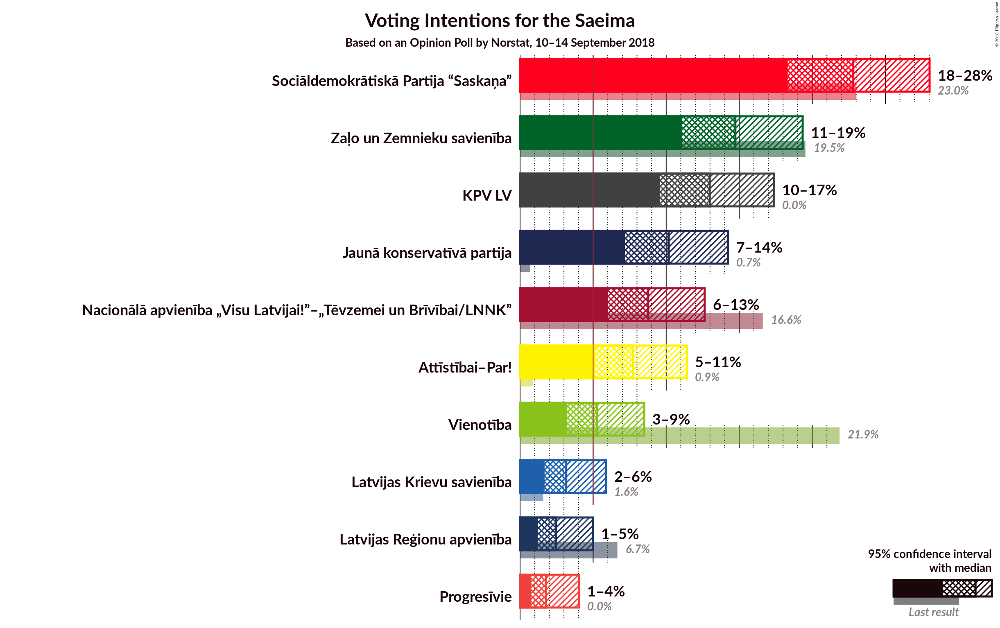

# Opinion Poll by Norstat, 10–14 September 2018

<a href="#voting-intentions">Voting Intentions</a> | <a href="#seats">Seats</a> | <a href="#coalitions">Coalitions</a> | <a href="#technical-information">Technical Information</a>

## Voting Intentions

### Confidence Intervals

| Party | Last Result | Poll Result | 80% Confidence Interval | 90% Confidence Interval | 95% Confidence Interval | 99% Confidence Interval |
|:-----:|:-----------:|:-----------:|:-----------------------:|:-----------------------:|:-----------------------:|:-----------------------:|
| Sociāldemokrātiskā Partija “Saskaņa” | 23.0% | 22.8% | 20.2–26.6% |19.3–27.6% |18.6–28.4% |17.3–30.1% |
| Zaļo un Zemnieku savienība | 19.5% | 14.7% | 12.7–18.1% |12.0–19.0% |11.4–19.7% |10.3–21.2% |
| KPV LV | 0.0% | 13.0% | 11.1–16.2% |10.4–17.1% |9.9–17.8% |8.9–19.2% |
| Jaunā konservatīvā partija | 0.7% | 10.2% | 8.2–12.8% |7.7–13.6% |7.2–14.3% |6.3–15.6% |
| Nacionālā apvienība „Visu Latvijai!”–„Tēvzemei un Brīvībai/LNNK” | 16.6% | 8.8% | 7.3–11.7% |6.7–12.4% |6.3–13.0% |5.5–14.4% |
| Kustība Par! | 0.0% | 7.7% | N/A |N/A |N/A |N/A |
| Vienotība | 21.9% | 5.3% | 4.2–7.8% |3.8–8.4% |3.5–8.9% |2.9–10.1% |
| Latvijas Krievu savienība | 1.6% | 3.2% | 2.2–4.9% |1.9–5.4% |1.7–5.9% |1.3–6.9% |
| Latvijas Reģionu apvienība | 6.7% | 2.5% | 1.6–4.1% |1.4–4.6% |1.2–5.0% |0.9–5.9% |
| Progresīvie | 0.0% | 1.8% | N/A |N/A |N/A |N/A |

*Note:* The poll result column reflects the actual value used in the calculations. Published results may vary slightly, and in addition be rounded to fewer digits.

## Seats

### Confidence Intervals

| Party | Last Result | Median | 80% Confidence Interval | 90% Confidence Interval | 95% Confidence Interval | 99% Confidence Interval |
|:-----:|:-----------:|:------:|:-----------------------:|:-----------------------:|:-----------------------:|:-----------------------:|
| <a href="#sociāldemokrātiskā-partija-“saskaņa”">Sociāldemokrātiskā Partija “Saskaņa”</a> | 24 | 30 | 26–33 |25–35 |24–36 |22–37 |
| <a href="#zaļo-un-zemnieku-savienība">Zaļo un Zemnieku savienība</a> | 21 | 21 | 17–24 |17–25 |16–27 |15–28 |
| <a href="#kpv-lv">KPV LV</a> | 0 | 17 | 14–21 |13–22 |12–23 |11–24 |
| <a href="#jaunā-konservatīvā-partija">Jaunā konservatīvā partija</a> | 0 | 14 | 10–17 |10–18 |9–18 |8–20 |
| <a href="#nacionālā-apvienība-„visu-latvijai!”–„tēvzemei-un-brīvībai/lnnk”">Nacionālā apvienība „Visu Latvijai!”–„Tēvzemei un Brīvībai/LNNK”</a> | 17 | 12 | 9–15 |8–15 |7–17 |6–18 |
| <a href="#kustība-par!">Kustība Par!</a> | 0 | N/A | N/A |N/A |N/A |N/A |
| <a href="#vienotība">Vienotība</a> | 23 | 7 | 0–10 |0–10 |0–11 |0–13 |
| <a href="#latvijas-krievu-savienība">Latvijas Krievu savienība</a> | 0 | 0 | 0 |0–7 |0–7 |0–8 |
| <a href="#latvijas-reģionu-apvienība">Latvijas Reģionu apvienība</a> | 8 | 0 | 0 |0 |0 |0–8 |
| <a href="#progresīvie">Progresīvie</a> | 0 | N/A | N/A |N/A |N/A |N/A |

