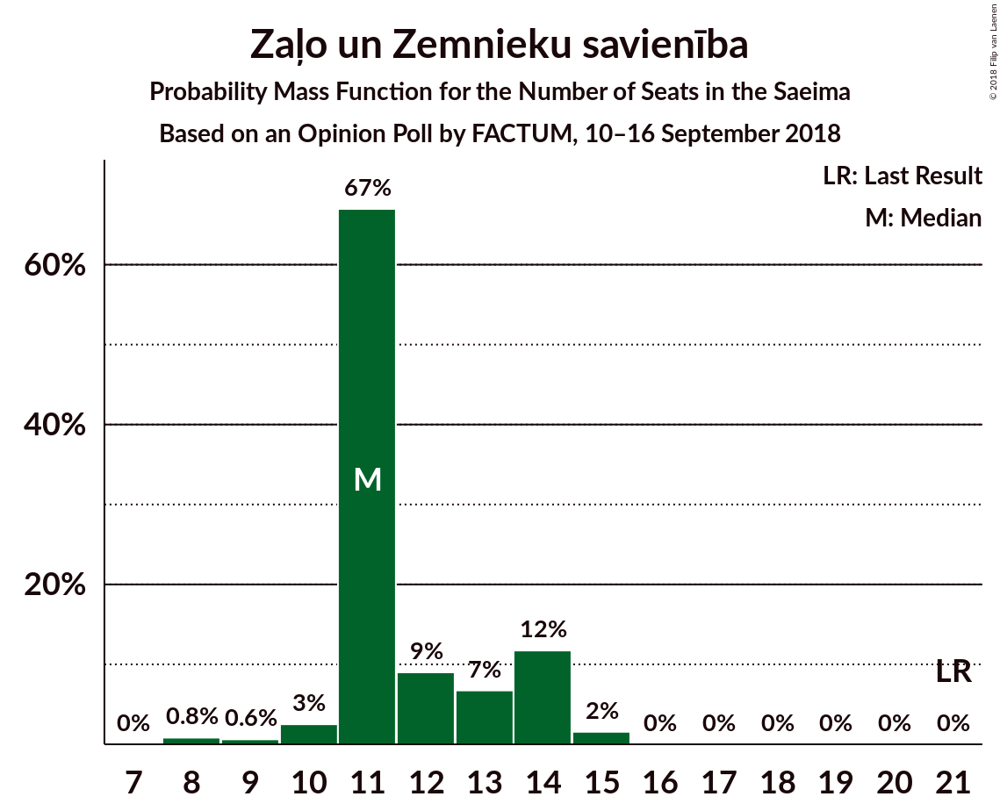
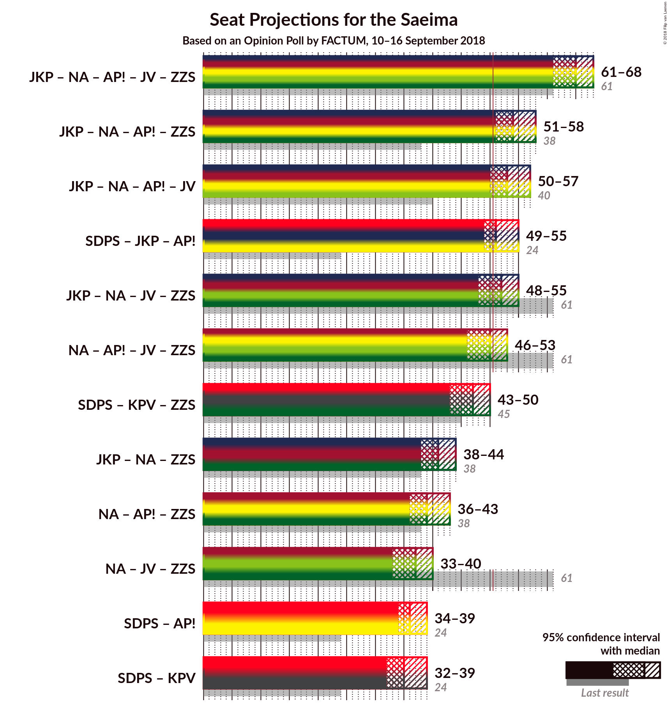

# Opinion Poll by FACTUM, 10–16 September 2018

<a href="#voting-intentions">Voting Intentions</a> | <a href="#seats">Seats</a> | <a href="#coalitions">Coalitions</a> | <a href="#technical-information">Technical Information</a>

## Voting Intentions

### Confidence Intervals

| Party | Last Result | Poll Result | 80% Confidence Interval | 90% Confidence Interval | 95% Confidence Interval | 99% Confidence Interval |
|:-----:|:-----------:|:-----------:|:-----------------------:|:-----------------------:|:-----------------------:|:-----------------------:|
| Sociāldemokrātiskā Partija “Saskaņa” | 23.0% | 20.6% | 19.2–22.2% |18.7–22.6% |18.4–23.0% |17.7–23.8% |
| Jaunā konservatīvā partija | 0.7% | 13.7% | 12.5–15.1% |12.2–15.5% |11.9–15.9% |11.3–16.5% |
| Nacionālā apvienība „Visu Latvijai!”–„Tēvzemei un Brīvībai/LNNK” | 16.6% | 12.7% | 11.5–14.1% |11.2–14.4% |10.9–14.8% |10.4–15.4% |
| Attīstībai–Par! | 0.9% | 11.8% | 10.6–13.1% |10.3–13.4% |10.0–13.8% |9.5–14.4% |
| KPV LV | 0.0% | 10.8% | 9.7–12.1% |9.4–12.4% |9.2–12.7% |8.7–13.4% |
| Vienotība | 21.9% | 9.8% | 8.7–11.0% |8.5–11.3% |8.2–11.6% |7.7–12.2% |
| Zaļo un Zemnieku savienība | 19.5% | 9.8% | 8.7–11.0% |8.5–11.3% |8.2–11.6% |7.7–12.2% |
| Latvijas Reģionu apvienība | 6.7% | 2.9% | 2.4–3.7% |2.2–3.9% |2.1–4.1% |1.9–4.5% |
| Latvijas Krievu savienība | 1.6% | 2.9% | 2.4–3.7% |2.2–3.9% |2.1–4.1% |1.9–4.5% |
| Progresīvie | 0.0% | 2.0% | 1.5–2.6% |1.4–2.8% |1.3–3.0% |1.1–3.3% |

*Note:* The poll result column reflects the actual value used in the calculations. Published results may vary slightly, and in addition be rounded to fewer digits.

## Seats

### Confidence Intervals

| Party | Last Result | Median | 80% Confidence Interval | 90% Confidence Interval | 95% Confidence Interval | 99% Confidence Interval |
|:-----:|:-----------:|:------:|:-----------------------:|:-----------------------:|:-----------------------:|:-----------------------:|
| <a href="#sociāldemokrātiskā-partija-“saskaņa”">Sociāldemokrātiskā Partija “Saskaņa”</a> | 24 | 24 | 22–25 |22–25 |22–26 |20–26 |
| <a href="#jaunā-konservatīvā-partija">Jaunā konservatīvā partija</a> | 0 | 15 | 15–16 |14–17 |14–18 |13–18 |
| <a href="#nacionālā-apvienība-„visu-latvijai!”–„tēvzemei-un-brīvībai/lnnk”">Nacionālā apvienība „Visu Latvijai!”–„Tēvzemei un Brīvībai/LNNK”</a> | 17 | 16 | 13–17 |13–17 |13–17 |12–17 |
| <a href="#attīstībai–par!">Attīstībai–Par!</a> | 0 | 12 | 12–14 |10–15 |10–15 |10–16 |
| <a href="#kpv-lv">KPV LV</a> | 0 | 11 | 10–14 |10–14 |10–14 |9–15 |
| <a href="#vienotība">Vienotība</a> | 23 | 10 | 10–12 |9–13 |9–13 |8–14 |
| <a href="#zaļo-un-zemnieku-savienība">Zaļo un Zemnieku savienība</a> | 21 | 11 | 11–12 |10–14 |8–14 |8–15 |
| <a href="#latvijas-reģionu-apvienība">Latvijas Reģionu apvienība</a> | 8 | 0 | 0 |0 |0 |0 |
| <a href="#latvijas-krievu-savienība">Latvijas Krievu savienība</a> | 0 | 0 | 0 |0 |0 |0 |
| <a href="#progresīvie">Progresīvie</a> | 0 | 0 | 0 |0 |0 |0 |

### Sociāldemokrātiskā Partija “Saskaņa”

*For a full overview of the results for this party, see the [Sociāldemokrātiskā Partija “Saskaņa”](party-sociāldemokrātiskāpartija“saskaņa”.html) page.*

| Number of Seats | Probability | Accumulated | Special Marks |
|:---------------:|:-----------:|:-----------:|:-------------:|
| 18 | 0.1% | 100% |  |
| 19 | 0.1% | 99.9% |  |
| 20 | 2% | 99.8% |  |
| 21 | 0.4% | 98% |  |
| 22 | 11% | 98% |  |
| 23 | 21% | 87% |  |
| 24 | 53% | 66% | Last Result, Median |
| 25 | 9% | 13% |  |
| 26 | 5% | 5% |  |
| 27 | 0.1% | 0.2% |  |
| 28 | 0% | 0% |  |

### Jaunā konservatīvā partija

*For a full overview of the results for this party, see the [Jaunā konservatīvā partija](party-jaunākonservatīvāpartija.html) page.*

| Number of Seats | Probability | Accumulated | Special Marks |
|:---------------:|:-----------:|:-----------:|:-------------:|
| 0 | 0% | 100% | Last Result |
| 1 | 0% | 100% |  |
| 2 | 0% | 100% |  |
| 3 | 0% | 100% |  |
| 4 | 0% | 100% |  |
| 5 | 0% | 100% |  |
| 6 | 0% | 100% |  |
| 7 | 0% | 100% |  |
| 8 | 0% | 100% |  |
| 9 | 0% | 100% |  |
| 10 | 0% | 100% |  |
| 11 | 0% | 100% |  |
| 12 | 0% | 100% |  |
| 13 | 1.3% | 100% |  |
| 14 | 5% | 98.7% |  |
| 15 | 80% | 94% | Median |
| 16 | 8% | 14% |  |
| 17 | 2% | 6% |  |
| 18 | 3% | 3% |  |
| 19 | 0.2% | 0.4% |  |
| 20 | 0.2% | 0.2% |  |
| 21 | 0% | 0% |  |

### Nacionālā apvienība „Visu Latvijai!”–„Tēvzemei un Brīvībai/LNNK”

*For a full overview of the results for this party, see the [Nacionālā apvienība „Visu Latvijai!”–„Tēvzemei un Brīvībai/LNNK”](party-nacionālāapvienība„visulatvijai”–„tēvzemeiunbrīvībailnnk”.html) page.*

| Number of Seats | Probability | Accumulated | Special Marks |
|:---------------:|:-----------:|:-----------:|:-------------:|
| 12 | 2% | 100% |  |
| 13 | 16% | 98% |  |
| 14 | 24% | 82% |  |
| 15 | 8% | 58% |  |
| 16 | 2% | 50% | Median |
| 17 | 48% | 48% | Last Result |
| 18 | 0.2% | 0.2% |  |
| 19 | 0% | 0% |  |

### Attīstībai–Par!

*For a full overview of the results for this party, see the [Attīstībai–Par!](party-attīstībai–par.html) page.*

| Number of Seats | Probability | Accumulated | Special Marks |
|:---------------:|:-----------:|:-----------:|:-------------:|
| 0 | 0% | 100% | Last Result |
| 1 | 0% | 100% |  |
| 2 | 0% | 100% |  |
| 3 | 0% | 100% |  |
| 4 | 0% | 100% |  |
| 5 | 0% | 100% |  |
| 6 | 0% | 100% |  |
| 7 | 0% | 100% |  |
| 8 | 0% | 100% |  |
| 9 | 0% | 100% |  |
| 10 | 5% | 100% |  |
| 11 | 0.5% | 95% |  |
| 12 | 54% | 95% | Median |
| 13 | 19% | 41% |  |
| 14 | 16% | 21% |  |
| 15 | 5% | 5% |  |
| 16 | 0.1% | 0.5% |  |
| 17 | 0.4% | 0.4% |  |
| 18 | 0% | 0% |  |

### KPV LV

*For a full overview of the results for this party, see the [KPV LV](party-kpvlv.html) page.*

| Number of Seats | Probability | Accumulated | Special Marks |
|:---------------:|:-----------:|:-----------:|:-------------:|
| 0 | 0% | 100% | Last Result |
| 1 | 0% | 100% |  |
| 2 | 0% | 100% |  |
| 3 | 0% | 100% |  |
| 4 | 0% | 100% |  |
| 5 | 0% | 100% |  |
| 6 | 0% | 100% |  |
| 7 | 0% | 100% |  |
| 8 | 0% | 100% |  |
| 9 | 2% | 100% |  |
| 10 | 12% | 98% |  |
| 11 | 50% | 87% | Median |
| 12 | 10% | 36% |  |
| 13 | 6% | 26% |  |
| 14 | 19% | 20% |  |
| 15 | 2% | 2% |  |
| 16 | 0% | 0.1% |  |
| 17 | 0.1% | 0.1% |  |
| 18 | 0% | 0% |  |

### Vienotība

*For a full overview of the results for this party, see the [Vienotība](party-vienotība.html) page.*

| Number of Seats | Probability | Accumulated | Special Marks |
|:---------------:|:-----------:|:-----------:|:-------------:|
| 8 | 2% | 100% |  |
| 9 | 4% | 98% |  |
| 10 | 71% | 94% | Median |
| 11 | 7% | 23% |  |
| 12 | 11% | 17% |  |
| 13 | 5% | 6% |  |
| 14 | 0.6% | 0.7% |  |
| 15 | 0% | 0% |  |
| 16 | 0% | 0% |  |
| 17 | 0% | 0% |  |
| 18 | 0% | 0% |  |
| 19 | 0% | 0% |  |
| 20 | 0% | 0% |  |
| 21 | 0% | 0% |  |
| 22 | 0% | 0% |  |
| 23 | 0% | 0% | Last Result |

### Zaļo un Zemnieku savienība

*For a full overview of the results for this party, see the [Zaļo un Zemnieku savienība](party-zaļounzemniekusavienība.html) page.*

| Number of Seats | Probability | Accumulated | Special Marks |
|:---------------:|:-----------:|:-----------:|:-------------:|
| 8 | 4% | 100% |  |
| 9 | 0.2% | 96% |  |
| 10 | 3% | 96% |  |
| 11 | 80% | 94% | Median |
| 12 | 6% | 13% |  |
| 13 | 1.4% | 7% |  |
| 14 | 5% | 6% |  |
| 15 | 0.8% | 0.8% |  |
| 16 | 0% | 0% |  |
| 17 | 0% | 0% |  |
| 18 | 0% | 0% |  |
| 19 | 0% | 0% |  |
| 20 | 0% | 0% |  |
| 21 | 0% | 0% | Last Result |

### Latvijas Reģionu apvienība

*For a full overview of the results for this party, see the [Latvijas Reģionu apvienība](party-latvijasreģionuapvienība.html) page.*

| Number of Seats | Probability | Accumulated | Special Marks |
|:---------------:|:-----------:|:-----------:|:-------------:|
| 0 | 100% | 100% | Median |
| 1 | 0% | 0% |  |
| 2 | 0% | 0% |  |
| 3 | 0% | 0% |  |
| 4 | 0% | 0% |  |
| 5 | 0% | 0% |  |
| 6 | 0% | 0% |  |
| 7 | 0% | 0% |  |
| 8 | 0% | 0% | Last Result |

### Latvijas Krievu savienība

*For a full overview of the results for this party, see the [Latvijas Krievu savienība](party-latvijaskrievusavienība.html) page.*

| Number of Seats | Probability | Accumulated | Special Marks |
|:---------------:|:-----------:|:-----------:|:-------------:|
| 0 | 100% | 100% | Last Result, Median |

### Progresīvie

*For a full overview of the results for this party, see the [Progresīvie](party-progresīvie.html) page.*

| Number of Seats | Probability | Accumulated | Special Marks |
|:---------------:|:-----------:|:-----------:|:-------------:|
| 0 | 100% | 100% | Last Result, Median |

## Coalitions

### Confidence Intervals

| Coalition | Last Result | Median | Majority? | 80% Confidence Interval | 90% Confidence Interval | 95% Confidence Interval | 99% Confidence Interval |
|:---------:|:-----------:|:------:|:---------:|:-----------------------:|:-----------------------:|:-----------------------:|:-----------------------:|
| Jaunā konservatīvā partija – Nacionālā apvienība „Visu Latvijai!”–„Tēvzemei un Brīvībai/LNNK” – Attīstībai–Par! – Vienotība – Zaļo un Zemnieku savienība | 61 | 65 | 100% | 63–66 | 62–68 | 61–68 | 61–69 |
| Jaunā konservatīvā partija – Nacionālā apvienība „Visu Latvijai!”–„Tēvzemei un Brīvībai/LNNK” – Attīstībai–Par! – Zaļo un Zemnieku savienība | 38 | 55 | 99.6% | 52–55 | 52–57 | 51–57 | 51–60 |
| Jaunā konservatīvā partija – Nacionālā apvienība „Visu Latvijai!”–„Tēvzemei un Brīvībai/LNNK” – Attīstībai–Par! – Vienotība | 40 | 54 | 96% | 52–55 | 51–56 | 50–56 | 50–57 |
| Sociāldemokrātiskā Partija “Saskaņa” – Jaunā konservatīvā partija – Attīstībai–Par! | 24 | 51 | 91% | 51–53 | 49–54 | 49–55 | 49–56 |
| Jaunā konservatīvā partija – Nacionālā apvienība „Visu Latvijai!”–„Tēvzemei un Brīvībai/LNNK” – Vienotība – Zaļo un Zemnieku savienība | 61 | 53 | 72% | 50–54 | 49–55 | 49–55 | 48–56 |
| Nacionālā apvienība „Visu Latvijai!”–„Tēvzemei un Brīvībai/LNNK” – Attīstībai–Par! – Vienotība – Zaļo un Zemnieku savienība | 61 | 50 | 13% | 48–51 | 46–53 | 46–54 | 46–54 |
| Sociāldemokrātiskā Partija “Saskaņa” – KPV LV – Zaļo un Zemnieku savienība | 45 | 46 | 0.5% | 45–48 | 44–49 | 44–50 | 43–50 |
| Jaunā konservatīvā partija – Nacionālā apvienība „Visu Latvijai!”–„Tēvzemei un Brīvībai/LNNK” – Zaļo un Zemnieku savienība | 38 | 43 | 0% | 39–43 | 39–43 | 38–43 | 37–47 |
| Nacionālā apvienība „Visu Latvijai!”–„Tēvzemei un Brīvībai/LNNK” – Attīstībai–Par! – Zaļo un Zemnieku savienība | 38 | 40 | 0% | 37–40 | 36–41 | 36–43 | 35–43 |
| Nacionālā apvienība „Visu Latvijai!”–„Tēvzemei un Brīvībai/LNNK” – Vienotība – Zaļo un Zemnieku savienība | 61 | 38 | 0% | 34–39 | 34–39 | 34–40 | 32–40 |
| Sociāldemokrātiskā Partija “Saskaņa” – KPV LV | 24 | 35 | 0% | 34–37 | 32–38 | 32–39 | 31–39 |
| Sociāldemokrātiskā Partija “Saskaņa” – Attīstībai–Par! | 24 | 36 | 0% | 36–38 | 34–38 | 34–38 | 33–39 |

### Jaunā konservatīvā partija – Nacionālā apvienība „Visu Latvijai!”–„Tēvzemei un Brīvībai/LNNK” – Attīstībai–Par! – Vienotība – Zaļo un Zemnieku savienība

| Number of Seats | Probability | Accumulated | Special Marks |
|:---------------:|:-----------:|:-----------:|:-------------:|
| 60 | 0.2% | 100% |  |
| 61 | 3% | 99.8% | Last Result |
| 62 | 3% | 96% |  |
| 63 | 17% | 93% |  |
| 64 | 11% | 76% | Median |
| 65 | 51% | 65% |  |
| 66 | 4% | 14% |  |
| 67 | 2% | 10% |  |
| 68 | 7% | 8% |  |
| 69 | 1.1% | 1.4% |  |
| 70 | 0.3% | 0.3% |  |
| 71 | 0% | 0% |  |

### Jaunā konservatīvā partija – Nacionālā apvienība „Visu Latvijai!”–„Tēvzemei un Brīvībai/LNNK” – Attīstībai–Par! – Zaļo un Zemnieku savienība

| Number of Seats | Probability | Accumulated | Special Marks |
|:---------------:|:-----------:|:-----------:|:-------------:|
| 38 | 0% | 100% | Last Result |
| 39 | 0% | 100% |  |
| 40 | 0% | 100% |  |
| 41 | 0% | 100% |  |
| 42 | 0% | 100% |  |
| 43 | 0% | 100% |  |
| 44 | 0% | 100% |  |
| 45 | 0% | 100% |  |
| 46 | 0% | 100% |  |
| 47 | 0% | 100% |  |
| 48 | 0% | 100% |  |
| 49 | 0% | 100% |  |
| 50 | 0.4% | 99.9% |  |
| 51 | 4% | 99.6% | Majority |
| 52 | 7% | 95% |  |
| 53 | 21% | 88% |  |
| 54 | 10% | 67% | Median |
| 55 | 49% | 57% |  |
| 56 | 2% | 8% |  |
| 57 | 3% | 5% |  |
| 58 | 0.9% | 2% |  |
| 59 | 0.2% | 1.2% |  |
| 60 | 0.9% | 0.9% |  |
| 61 | 0% | 0% |  |

### Jaunā konservatīvā partija – Nacionālā apvienība „Visu Latvijai!”–„Tēvzemei un Brīvībai/LNNK” – Attīstībai–Par! – Vienotība

| Number of Seats | Probability | Accumulated | Special Marks |
|:---------------:|:-----------:|:-----------:|:-------------:|
| 40 | 0% | 100% | Last Result |
| 41 | 0% | 100% |  |
| 42 | 0% | 100% |  |
| 43 | 0% | 100% |  |
| 44 | 0% | 100% |  |
| 45 | 0% | 100% |  |
| 46 | 0% | 100% |  |
| 47 | 0% | 100% |  |
| 48 | 0.1% | 100% |  |
| 49 | 0.3% | 99.9% |  |
| 50 | 3% | 99.5% |  |
| 51 | 4% | 96% | Majority |
| 52 | 18% | 92% |  |
| 53 | 10% | 74% | Median |
| 54 | 51% | 64% |  |
| 55 | 3% | 12% |  |
| 56 | 7% | 9% |  |
| 57 | 2% | 2% |  |
| 58 | 0.3% | 0.4% |  |
| 59 | 0.1% | 0.1% |  |
| 60 | 0% | 0% |  |

### Sociāldemokrātiskā Partija “Saskaņa” – Jaunā konservatīvā partija – Attīstībai–Par!

| Number of Seats | Probability | Accumulated | Special Marks |
|:---------------:|:-----------:|:-----------:|:-------------:|
| 24 | 0% | 100% | Last Result |
| 25 | 0% | 100% |  |
| 26 | 0% | 100% |  |
| 27 | 0% | 100% |  |
| 28 | 0% | 100% |  |
| 29 | 0% | 100% |  |
| 30 | 0% | 100% |  |
| 31 | 0% | 100% |  |
| 32 | 0% | 100% |  |
| 33 | 0% | 100% |  |
| 34 | 0% | 100% |  |
| 35 | 0% | 100% |  |
| 36 | 0% | 100% |  |
| 37 | 0% | 100% |  |
| 38 | 0% | 100% |  |
| 39 | 0% | 100% |  |
| 40 | 0% | 100% |  |
| 41 | 0% | 100% |  |
| 42 | 0% | 100% |  |
| 43 | 0% | 100% |  |
| 44 | 0% | 100% |  |
| 45 | 0% | 100% |  |
| 46 | 0.1% | 100% |  |
| 47 | 0.1% | 99.9% |  |
| 48 | 0.3% | 99.8% |  |
| 49 | 5% | 99.5% |  |
| 50 | 3% | 94% |  |
| 51 | 65% | 91% | Median, Majority |
| 52 | 13% | 27% |  |
| 53 | 4% | 14% |  |
| 54 | 7% | 10% |  |
| 55 | 1.4% | 3% |  |
| 56 | 2% | 2% |  |
| 57 | 0% | 0% |  |

### Jaunā konservatīvā partija – Nacionālā apvienība „Visu Latvijai!”–„Tēvzemei un Brīvībai/LNNK” – Vienotība – Zaļo un Zemnieku savienība

| Number of Seats | Probability | Accumulated | Special Marks |
|:---------------:|:-----------:|:-----------:|:-------------:|
| 47 | 0.2% | 100% |  |
| 48 | 0.7% | 99.8% |  |
| 49 | 7% | 99.1% |  |
| 50 | 20% | 93% |  |
| 51 | 7% | 72% | Majority |
| 52 | 7% | 65% | Median |
| 53 | 46% | 58% |  |
| 54 | 6% | 12% |  |
| 55 | 4% | 6% |  |
| 56 | 1.0% | 1.2% |  |
| 57 | 0.1% | 0.2% |  |
| 58 | 0.1% | 0.1% |  |
| 59 | 0% | 0% |  |
| 60 | 0% | 0% |  |
| 61 | 0% | 0% | Last Result |

### Nacionālā apvienība „Visu Latvijai!”–„Tēvzemei un Brīvībai/LNNK” – Attīstībai–Par! – Vienotība – Zaļo un Zemnieku savienība

| Number of Seats | Probability | Accumulated | Special Marks |
|:---------------:|:-----------:|:-----------:|:-------------:|
| 45 | 0.3% | 100% |  |
| 46 | 8% | 99.7% |  |
| 47 | 2% | 92% |  |
| 48 | 19% | 90% |  |
| 49 | 7% | 71% | Median |
| 50 | 51% | 63% |  |
| 51 | 4% | 13% | Majority |
| 52 | 2% | 9% |  |
| 53 | 4% | 7% |  |
| 54 | 3% | 3% |  |
| 55 | 0.1% | 0.1% |  |
| 56 | 0% | 0% |  |
| 57 | 0% | 0% |  |
| 58 | 0% | 0% |  |
| 59 | 0% | 0% |  |
| 60 | 0% | 0% |  |
| 61 | 0% | 0% | Last Result |

### Sociāldemokrātiskā Partija “Saskaņa” – KPV LV – Zaļo un Zemnieku savienība

| Number of Seats | Probability | Accumulated | Special Marks |
|:---------------:|:-----------:|:-----------:|:-------------:|
| 41 | 0.1% | 100% |  |
| 42 | 0.3% | 99.9% |  |
| 43 | 2% | 99.6% |  |
| 44 | 7% | 98% |  |
| 45 | 3% | 91% | Last Result |
| 46 | 51% | 88% | Median |
| 47 | 10% | 36% |  |
| 48 | 18% | 26% |  |
| 49 | 4% | 8% |  |
| 50 | 3% | 4% |  |
| 51 | 0.3% | 0.5% | Majority |
| 52 | 0.1% | 0.1% |  |
| 53 | 0% | 0% |  |

### Jaunā konservatīvā partija – Nacionālā apvienība „Visu Latvijai!”–„Tēvzemei un Brīvībai/LNNK” – Zaļo un Zemnieku savienība

| Number of Seats | Probability | Accumulated | Special Marks |
|:---------------:|:-----------:|:-----------:|:-------------:|
| 36 | 0.1% | 100% |  |
| 37 | 0.4% | 99.9% |  |
| 38 | 4% | 99.5% | Last Result |
| 39 | 7% | 96% |  |
| 40 | 20% | 88% |  |
| 41 | 9% | 68% |  |
| 42 | 8% | 59% | Median |
| 43 | 48% | 50% |  |
| 44 | 0.9% | 2% |  |
| 45 | 0.3% | 1.5% |  |
| 46 | 0.2% | 1.1% |  |
| 47 | 0.9% | 0.9% |  |
| 48 | 0% | 0% |  |

### Nacionālā apvienība „Visu Latvijai!”–„Tēvzemei un Brīvībai/LNNK” – Attīstībai–Par! – Zaļo un Zemnieku savienība

| Number of Seats | Probability | Accumulated | Special Marks |
|:---------------:|:-----------:|:-----------:|:-------------:|
| 34 | 0.3% | 100% |  |
| 35 | 0.8% | 99.6% |  |
| 36 | 9% | 98.8% |  |
| 37 | 4% | 90% |  |
| 38 | 23% | 86% | Last Result |
| 39 | 9% | 63% | Median |
| 40 | 48% | 55% |  |
| 41 | 2% | 7% |  |
| 42 | 2% | 5% |  |
| 43 | 3% | 3% |  |
| 44 | 0.1% | 0.1% |  |
| 45 | 0% | 0% |  |

### Nacionālā apvienība „Visu Latvijai!”–„Tēvzemei un Brīvībai/LNNK” – Vienotība – Zaļo un Zemnieku savienība

| Number of Seats | Probability | Accumulated | Special Marks |
|:---------------:|:-----------:|:-----------:|:-------------:|
| 32 | 0.8% | 100% |  |
| 33 | 0.8% | 99.2% |  |
| 34 | 10% | 98% |  |
| 35 | 22% | 89% |  |
| 36 | 6% | 67% |  |
| 37 | 4% | 61% | Median |
| 38 | 44% | 57% |  |
| 39 | 8% | 13% |  |
| 40 | 5% | 5% |  |
| 41 | 0.1% | 0.2% |  |
| 42 | 0% | 0% |  |
| 43 | 0% | 0% |  |
| 44 | 0% | 0% |  |
| 45 | 0% | 0% |  |
| 46 | 0% | 0% |  |
| 47 | 0% | 0% |  |
| 48 | 0% | 0% |  |
| 49 | 0% | 0% |  |
| 50 | 0% | 0% |  |
| 51 | 0% | 0% | Majority |
| 52 | 0% | 0% |  |
| 53 | 0% | 0% |  |
| 54 | 0% | 0% |  |
| 55 | 0% | 0% |  |
| 56 | 0% | 0% |  |
| 57 | 0% | 0% |  |
| 58 | 0% | 0% |  |
| 59 | 0% | 0% |  |
| 60 | 0% | 0% |  |
| 61 | 0% | 0% | Last Result |

### Sociāldemokrātiskā Partija “Saskaņa” – KPV LV

| Number of Seats | Probability | Accumulated | Special Marks |
|:---------------:|:-----------:|:-----------:|:-------------:|
| 24 | 0% | 100% | Last Result |
| 25 | 0% | 100% |  |
| 26 | 0% | 100% |  |
| 27 | 0% | 100% |  |
| 28 | 0% | 100% |  |
| 29 | 0% | 100% |  |
| 30 | 0.3% | 100% |  |
| 31 | 1.1% | 99.7% |  |
| 32 | 7% | 98.6% |  |
| 33 | 2% | 92% |  |
| 34 | 4% | 90% |  |
| 35 | 51% | 86% | Median |
| 36 | 11% | 35% |  |
| 37 | 17% | 24% |  |
| 38 | 3% | 7% |  |
| 39 | 3% | 4% |  |
| 40 | 0.2% | 0.2% |  |
| 41 | 0% | 0% |  |

### Sociāldemokrātiskā Partija “Saskaņa” – Attīstībai–Par!

| Number of Seats | Probability | Accumulated | Special Marks |
|:---------------:|:-----------:|:-----------:|:-------------:|
| 24 | 0% | 100% | Last Result |
| 25 | 0% | 100% |  |
| 26 | 0% | 100% |  |
| 27 | 0% | 100% |  |
| 28 | 0% | 100% |  |
| 29 | 0.1% | 100% |  |
| 30 | 0% | 99.9% |  |
| 31 | 0% | 99.9% |  |
| 32 | 0.1% | 99.8% |  |
| 33 | 1.2% | 99.8% |  |
| 34 | 5% | 98.6% |  |
| 35 | 2% | 94% |  |
| 36 | 64% | 91% | Median |
| 37 | 15% | 27% |  |
| 38 | 11% | 12% |  |
| 39 | 1.2% | 2% |  |
| 40 | 0.2% | 0.4% |  |
| 41 | 0.1% | 0.2% |  |
| 42 | 0% | 0.1% |  |
| 43 | 0% | 0% |  |

## Technical Information

### Opinion Poll

+ **Polling firm:** FACTUM
+ **Commissioner(s):** —
+ **Fieldwork period:** 10–16 September 2018

### Calculations

+ **Sample size:** 1164
+ **Simulations done:** 131,072
+ **Error estimate:** 2.03%

