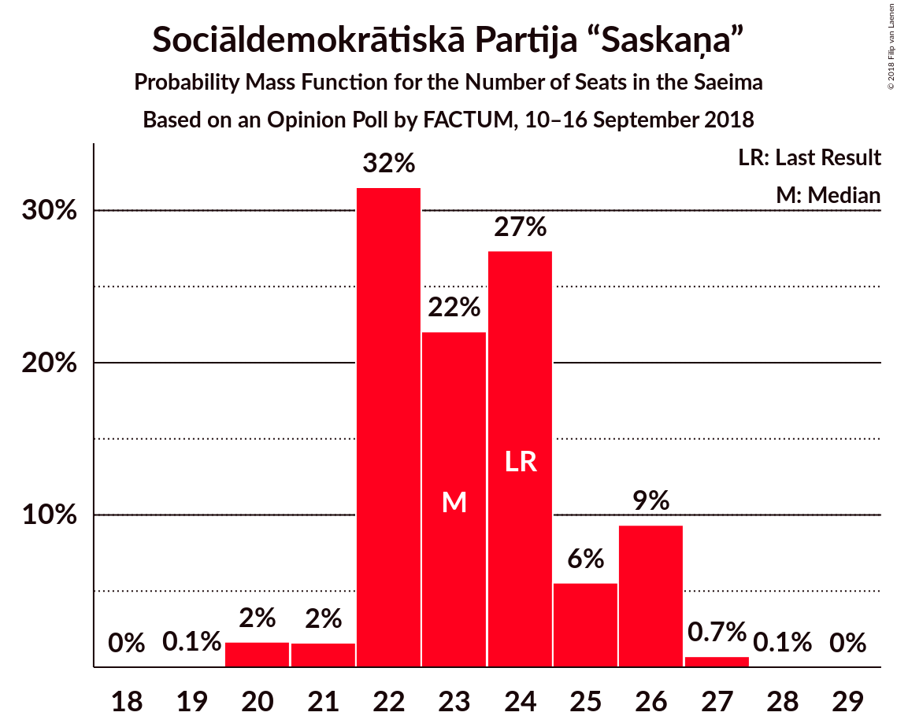

# Opinion Poll by FACTUM, 10–16 September 2018

<a href="#voting-intentions">Voting Intentions</a> | <a href="#seats">Seats</a> | <a href="#coalitions">Coalitions</a> | <a href="#technical-information">Technical Information</a>

## Voting Intentions

### Confidence Intervals

| Party | Last Result | Poll Result | 80% Confidence Interval | 90% Confidence Interval | 95% Confidence Interval | 99% Confidence Interval |
|:-----:|:-----------:|:-----------:|:-----------------------:|:-----------------------:|:-----------------------:|:-----------------------:|
| Sociāldemokrātiskā Partija “Saskaņa” | 23.0% | 21.0% | 19.5–22.6% |19.1–23.0% |18.7–23.4% |18.0–24.2% |
| Jaunā konservatīvā partija | 0.7% | 14.0% | 12.8–15.4% |12.4–15.8% |12.1–16.1% |11.6–16.8% |
| Nacionālā apvienība „Visu Latvijai!”–„Tēvzemei un Brīvībai/LNNK” | 16.6% | 13.0% | 11.8–14.3% |11.4–14.7% |11.2–15.0% |10.6–15.7% |
| Attīstībai–Par! | 0.9% | 12.0% | 10.9–13.3% |10.5–13.7% |10.3–14.0% |9.8–14.7% |
| KPV LV | 0.0% | 11.0% | 9.9–12.3% |9.6–12.6% |9.3–12.9% |8.8–13.6% |
| Vienotība | 21.9% | 10.0% | 8.9–11.2% |8.6–11.5% |8.4–11.8% |7.9–12.4% |
| Zaļo un Zemnieku savienība | 19.5% | 10.0% | 8.9–11.2% |8.6–11.5% |8.4–11.8% |7.9–12.4% |
| Latvijas Reģionu apvienība | 6.7% | 3.0% | 2.5–3.8% |2.3–4.0% |2.2–4.2% |1.9–4.5% |
| Latvijas Krievu savienība | 1.6% | 3.0% | 2.5–3.8% |2.3–4.0% |2.2–4.2% |1.9–4.5% |

*Note:* The poll result column reflects the actual value used in the calculations. Published results may vary slightly, and in addition be rounded to fewer digits.

## Seats

### Confidence Intervals

| Party | Last Result | Median | 80% Confidence Interval | 90% Confidence Interval | 95% Confidence Interval | 99% Confidence Interval |
|:-----:|:-----------:|:------:|:-----------------------:|:-----------------------:|:-----------------------:|:-----------------------:|
| <a href="#sociāldemokrātiskā-partija-“saskaņa”">Sociāldemokrātiskā Partija “Saskaņa”</a> | 24 | 23 | 22–25 |22–25 |21–26 |20–27 |
| <a href="#jaunā-konservatīvā-partija">Jaunā konservatīvā partija</a> | 0 | 15 | 15–16 |13–17 |13–18 |13–19 |
| <a href="#nacionālā-apvienība-„visu-latvijai!”–„tēvzemei-un-brīvībai/lnnk”">Nacionālā apvienība „Visu Latvijai!”–„Tēvzemei un Brīvībai/LNNK”</a> | 17 | 14 | 13–16 |13–16 |12–17 |12–18 |
| <a href="#attīstībai–par!">Attīstībai–Par!</a> | 0 | 14 | 12–15 |12–15 |11–15 |10–17 |
| <a href="#kpv-lv">KPV LV</a> | 0 | 12 | 10–14 |10–14 |10–14 |9–14 |
| <a href="#vienotība">Vienotība</a> | 23 | 10 | 10–13 |9–13 |9–13 |8–14 |
| <a href="#zaļo-un-zemnieku-savienība">Zaļo un Zemnieku savienība</a> | 21 | 11 | 11–14 |10–14 |10–15 |8–15 |
| <a href="#latvijas-reģionu-apvienība">Latvijas Reģionu apvienība</a> | 8 | 0 | 0 |0 |0 |0 |
| <a href="#latvijas-krievu-savienība">Latvijas Krievu savienība</a> | 0 | 0 | 0 |0 |0 |0 |

### Sociāldemokrātiskā Partija “Saskaņa”

*For a full overview of the results for this party, see the [Sociāldemokrātiskā Partija “Saskaņa”](party-sociāldemokrātiskāpartija“saskaņa”.html) page.*

| Number of Seats | Probability | Accumulated | Special Marks |
|:---------------:|:-----------:|:-----------:|:-------------:|
| 19 | 0.1% | 100% |  |
| 20 | 2% | 99.9% |  |
| 21 | 2% | 98% |  |
| 22 | 34% | 95% |  |
| 23 | 21% | 61% | Median |
| 24 | 20% | 40% | Last Result |
| 25 | 16% | 20% |  |
| 26 | 2% | 3% |  |
| 27 | 0.9% | 1.0% |  |
| 28 | 0.1% | 0.1% |  |
| 29 | 0% | 0% |  |

### Jaunā konservatīvā partija

*For a full overview of the results for this party, see the [Jaunā konservatīvā partija](party-jaunākonservatīvāpartija.html) page.*

| Number of Seats | Probability | Accumulated | Special Marks |
|:---------------:|:-----------:|:-----------:|:-------------:|
| 0 | 0% | 100% | Last Result |
| 1 | 0% | 100% |  |
| 2 | 0% | 100% |  |
| 3 | 0% | 100% |  |
| 4 | 0% | 100% |  |
| 5 | 0% | 100% |  |
| 6 | 0% | 100% |  |
| 7 | 0% | 100% |  |
| 8 | 0% | 100% |  |
| 9 | 0% | 100% |  |
| 10 | 0% | 100% |  |
| 11 | 0% | 100% |  |
| 12 | 0% | 100% |  |
| 13 | 5% | 100% |  |
| 14 | 4% | 95% |  |
| 15 | 74% | 90% | Median |
| 16 | 7% | 17% |  |
| 17 | 5% | 9% |  |
| 18 | 3% | 4% |  |
| 19 | 0.8% | 1.2% |  |
| 20 | 0.3% | 0.4% |  |
| 21 | 0% | 0% |  |

### Nacionālā apvienība „Visu Latvijai!”–„Tēvzemei un Brīvībai/LNNK”

*For a full overview of the results for this party, see the [Nacionālā apvienība „Visu Latvijai!”–„Tēvzemei un Brīvībai/LNNK”](party-nacionālāapvienība„visulatvijai”–„tēvzemeiunbrīvībailnnk”.html) page.*

| Number of Seats | Probability | Accumulated | Special Marks |
|:---------------:|:-----------:|:-----------:|:-------------:|
| 12 | 5% | 100% |  |
| 13 | 32% | 95% |  |
| 14 | 30% | 63% | Median |
| 15 | 21% | 33% |  |
| 16 | 8% | 12% |  |
| 17 | 4% | 5% | Last Result |
| 18 | 0.5% | 0.5% |  |
| 19 | 0% | 0% |  |

### Attīstībai–Par!

*For a full overview of the results for this party, see the [Attīstībai–Par!](party-attīstībai–par.html) page.*

| Number of Seats | Probability | Accumulated | Special Marks |
|:---------------:|:-----------:|:-----------:|:-------------:|
| 0 | 0% | 100% | Last Result |
| 1 | 0% | 100% |  |
| 2 | 0% | 100% |  |
| 3 | 0% | 100% |  |
| 4 | 0% | 100% |  |
| 5 | 0% | 100% |  |
| 6 | 0% | 100% |  |
| 7 | 0% | 100% |  |
| 8 | 0% | 100% |  |
| 9 | 0% | 100% |  |
| 10 | 2% | 100% |  |
| 11 | 3% | 98% |  |
| 12 | 17% | 95% |  |
| 13 | 26% | 78% |  |
| 14 | 36% | 52% | Median |
| 15 | 15% | 17% |  |
| 16 | 1.5% | 2% |  |
| 17 | 0.9% | 0.9% |  |
| 18 | 0% | 0% |  |

### KPV LV

*For a full overview of the results for this party, see the [KPV LV](party-kpvlv.html) page.*

| Number of Seats | Probability | Accumulated | Special Marks |
|:---------------:|:-----------:|:-----------:|:-------------:|
| 0 | 0% | 100% | Last Result |
| 1 | 0% | 100% |  |
| 2 | 0% | 100% |  |
| 3 | 0% | 100% |  |
| 4 | 0% | 100% |  |
| 5 | 0% | 100% |  |
| 6 | 0% | 100% |  |
| 7 | 0% | 100% |  |
| 8 | 0% | 100% |  |
| 9 | 2% | 100% |  |
| 10 | 33% | 98% |  |
| 11 | 9% | 65% |  |
| 12 | 23% | 56% | Median |
| 13 | 10% | 32% |  |
| 14 | 22% | 22% |  |
| 15 | 0.2% | 0.3% |  |
| 16 | 0% | 0% |  |

### Vienotība

*For a full overview of the results for this party, see the [Vienotība](party-vienotība.html) page.*

| Number of Seats | Probability | Accumulated | Special Marks |
|:---------------:|:-----------:|:-----------:|:-------------:|
| 7 | 0.1% | 100% |  |
| 8 | 1.1% | 99.9% |  |
| 9 | 4% | 98.8% |  |
| 10 | 53% | 95% | Median |
| 11 | 12% | 42% |  |
| 12 | 19% | 30% |  |
| 13 | 8% | 10% |  |
| 14 | 2% | 2% |  |
| 15 | 0% | 0% |  |
| 16 | 0% | 0% |  |
| 17 | 0% | 0% |  |
| 18 | 0% | 0% |  |
| 19 | 0% | 0% |  |
| 20 | 0% | 0% |  |
| 21 | 0% | 0% |  |
| 22 | 0% | 0% |  |
| 23 | 0% | 0% | Last Result |

### Zaļo un Zemnieku savienība

*For a full overview of the results for this party, see the [Zaļo un Zemnieku savienība](party-zaļounzemniekusavienība.html) page.*

| Number of Seats | Probability | Accumulated | Special Marks |
|:---------------:|:-----------:|:-----------:|:-------------:|
| 8 | 0.6% | 100% |  |
| 9 | 2% | 99.4% |  |
| 10 | 7% | 98% |  |
| 11 | 57% | 91% | Median |
| 12 | 13% | 33% |  |
| 13 | 5% | 20% |  |
| 14 | 11% | 15% |  |
| 15 | 4% | 4% |  |
| 16 | 0% | 0% |  |
| 17 | 0% | 0% |  |
| 18 | 0% | 0% |  |
| 19 | 0% | 0% |  |
| 20 | 0% | 0% |  |
| 21 | 0% | 0% | Last Result |

### Latvijas Reģionu apvienība

*For a full overview of the results for this party, see the [Latvijas Reģionu apvienība](party-latvijasreģionuapvienība.html) page.*

| Number of Seats | Probability | Accumulated | Special Marks |
|:---------------:|:-----------:|:-----------:|:-------------:|
| 0 | 100% | 100% | Median |
| 1 | 0% | 0% |  |
| 2 | 0% | 0% |  |
| 3 | 0% | 0% |  |
| 4 | 0% | 0% |  |
| 5 | 0% | 0% |  |
| 6 | 0% | 0% |  |
| 7 | 0% | 0% |  |
| 8 | 0% | 0% | Last Result |

### Latvijas Krievu savienība

*For a full overview of the results for this party, see the [Latvijas Krievu savienība](party-latvijaskrievusavienība.html) page.*

| Number of Seats | Probability | Accumulated | Special Marks |
|:---------------:|:-----------:|:-----------:|:-------------:|
| 0 | 99.9% | 100% | Last Result, Median |
| 1 | 0% | 0.1% |  |
| 2 | 0% | 0.1% |  |
| 3 | 0% | 0.1% |  |
| 4 | 0% | 0.1% |  |
| 5 | 0% | 0.1% |  |
| 6 | 0.1% | 0.1% |  |
| 7 | 0% | 0% |  |

## Coalitions

### Confidence Intervals

| Coalition | Last Result | Median | Majority? | 80% Confidence Interval | 90% Confidence Interval | 95% Confidence Interval | 99% Confidence Interval |
|:---------:|:-----------:|:------:|:---------:|:-----------------------:|:-----------------------:|:-----------------------:|:-----------------------:|
| Jaunā konservatīvā partija – Nacionālā apvienība „Visu Latvijai!”–„Tēvzemei un Brīvībai/LNNK” – Attīstībai–Par! – Vienotība – Zaļo un Zemnieku savienība | 61 | 65 | 100% | 63–68 | 62–68 | 62–68 | 60–69 |
| Jaunā konservatīvā partija – Nacionālā apvienība „Visu Latvijai!”–„Tēvzemei un Brīvībai/LNNK” – Attīstībai–Par! – Zaļo un Zemnieku savienība | 38 | 54 | 97% | 52–57 | 51–57 | 50–58 | 50–59 |
| Jaunā konservatīvā partija – Nacionālā apvienība „Visu Latvijai!”–„Tēvzemei un Brīvībai/LNNK” – Attīstībai–Par! – Vienotība | 40 | 53 | 96% | 51–56 | 51–57 | 50–57 | 49–58 |
| Jaunā konservatīvā partija – Nacionālā apvienība „Visu Latvijai!”–„Tēvzemei un Brīvībai/LNNK” – Vienotība – Zaļo un Zemnieku savienība | 61 | 52 | 69% | 49–54 | 49–54 | 48–55 | 47–57 |
| Nacionālā apvienība „Visu Latvijai!”–„Tēvzemei un Brīvībai/LNNK” – Attīstībai–Par! – Vienotība – Zaļo un Zemnieku savienība | 61 | 50 | 37% | 47–53 | 47–53 | 47–53 | 45–54 |
| Jaunā konservatīvā partija – Nacionālā apvienība „Visu Latvijai!”–„Tēvzemei un Brīvībai/LNNK” – Zaļo un Zemnieku savienība | 38 | 41 | 0% | 39–43 | 38–44 | 38–44 | 37–46 |
| Nacionālā apvienība „Visu Latvijai!”–„Tēvzemei un Brīvībai/LNNK” – Attīstībai–Par! – Zaļo un Zemnieku savienība | 38 | 39 | 0% | 36–42 | 36–42 | 35–43 | 34–44 |
| Nacionālā apvienība „Visu Latvijai!”–„Tēvzemei un Brīvībai/LNNK” – Vienotība – Zaļo un Zemnieku savienība | 61 | 36 | 0% | 34–39 | 34–39 | 33–40 | 33–41 |

### Jaunā konservatīvā partija – Nacionālā apvienība „Visu Latvijai!”–„Tēvzemei un Brīvībai/LNNK” – Attīstībai–Par! – Vienotība – Zaļo un Zemnieku savienība

| Number of Seats | Probability | Accumulated | Special Marks |
|:---------------:|:-----------:|:-----------:|:-------------:|
| 59 | 0.1% | 100% |  |
| 60 | 0.5% | 99.9% |  |
| 61 | 2% | 99.4% | Last Result |
| 62 | 6% | 98% |  |
| 63 | 11% | 92% |  |
| 64 | 25% | 81% | Median |
| 65 | 16% | 56% |  |
| 66 | 13% | 39% |  |
| 67 | 11% | 26% |  |
| 68 | 14% | 15% |  |
| 69 | 1.1% | 1.5% |  |
| 70 | 0.3% | 0.4% |  |
| 71 | 0.1% | 0.1% |  |
| 72 | 0% | 0% |  |

### Jaunā konservatīvā partija – Nacionālā apvienība „Visu Latvijai!”–„Tēvzemei un Brīvībai/LNNK” – Attīstībai–Par! – Zaļo un Zemnieku savienība

| Number of Seats | Probability | Accumulated | Special Marks |
|:---------------:|:-----------:|:-----------:|:-------------:|
| 38 | 0% | 100% | Last Result |
| 39 | 0% | 100% |  |
| 40 | 0% | 100% |  |
| 41 | 0% | 100% |  |
| 42 | 0% | 100% |  |
| 43 | 0% | 100% |  |
| 44 | 0% | 100% |  |
| 45 | 0% | 100% |  |
| 46 | 0% | 100% |  |
| 47 | 0% | 100% |  |
| 48 | 0% | 100% |  |
| 49 | 0.4% | 100% |  |
| 50 | 3% | 99.5% |  |
| 51 | 6% | 97% | Majority |
| 52 | 5% | 91% |  |
| 53 | 16% | 86% |  |
| 54 | 30% | 71% | Median |
| 55 | 16% | 41% |  |
| 56 | 12% | 25% |  |
| 57 | 9% | 13% |  |
| 58 | 3% | 4% |  |
| 59 | 0.7% | 0.9% |  |
| 60 | 0.2% | 0.2% |  |
| 61 | 0% | 0% |  |

### Jaunā konservatīvā partija – Nacionālā apvienība „Visu Latvijai!”–„Tēvzemei un Brīvībai/LNNK” – Attīstībai–Par! – Vienotība

| Number of Seats | Probability | Accumulated | Special Marks |
|:---------------:|:-----------:|:-----------:|:-------------:|
| 40 | 0% | 100% | Last Result |
| 41 | 0% | 100% |  |
| 42 | 0% | 100% |  |
| 43 | 0% | 100% |  |
| 44 | 0% | 100% |  |
| 45 | 0% | 100% |  |
| 46 | 0% | 100% |  |
| 47 | 0% | 100% |  |
| 48 | 0.3% | 100% |  |
| 49 | 1.0% | 99.7% |  |
| 50 | 3% | 98.7% |  |
| 51 | 9% | 96% | Majority |
| 52 | 13% | 87% |  |
| 53 | 32% | 74% | Median |
| 54 | 14% | 42% |  |
| 55 | 11% | 27% |  |
| 56 | 8% | 16% |  |
| 57 | 7% | 8% |  |
| 58 | 0.5% | 0.7% |  |
| 59 | 0.1% | 0.2% |  |
| 60 | 0% | 0.1% |  |
| 61 | 0% | 0% |  |

### Jaunā konservatīvā partija – Nacionālā apvienība „Visu Latvijai!”–„Tēvzemei un Brīvībai/LNNK” – Vienotība – Zaļo un Zemnieku savienība

| Number of Seats | Probability | Accumulated | Special Marks |
|:---------------:|:-----------:|:-----------:|:-------------:|
| 46 | 0.1% | 100% |  |
| 47 | 0.6% | 99.9% |  |
| 48 | 2% | 99.2% |  |
| 49 | 7% | 97% |  |
| 50 | 21% | 90% | Median |
| 51 | 17% | 69% | Majority |
| 52 | 19% | 52% |  |
| 53 | 17% | 33% |  |
| 54 | 12% | 16% |  |
| 55 | 3% | 5% |  |
| 56 | 0.7% | 1.3% |  |
| 57 | 0.4% | 0.5% |  |
| 58 | 0.1% | 0.1% |  |
| 59 | 0% | 0% |  |
| 60 | 0% | 0% |  |
| 61 | 0% | 0% | Last Result |

### Nacionālā apvienība „Visu Latvijai!”–„Tēvzemei un Brīvībai/LNNK” – Attīstībai–Par! – Vienotība – Zaļo un Zemnieku savienība

| Number of Seats | Probability | Accumulated | Special Marks |
|:---------------:|:-----------:|:-----------:|:-------------:|
| 44 | 0.1% | 100% |  |
| 45 | 0.7% | 99.9% |  |
| 46 | 1.5% | 99.2% |  |
| 47 | 9% | 98% |  |
| 48 | 11% | 89% |  |
| 49 | 27% | 78% | Median |
| 50 | 15% | 51% |  |
| 51 | 11% | 37% | Majority |
| 52 | 14% | 26% |  |
| 53 | 10% | 12% |  |
| 54 | 1.4% | 2% |  |
| 55 | 0.3% | 0.4% |  |
| 56 | 0% | 0% |  |
| 57 | 0% | 0% |  |
| 58 | 0% | 0% |  |
| 59 | 0% | 0% |  |
| 60 | 0% | 0% |  |
| 61 | 0% | 0% | Last Result |

### Jaunā konservatīvā partija – Nacionālā apvienība „Visu Latvijai!”–„Tēvzemei un Brīvībai/LNNK” – Zaļo un Zemnieku savienība

| Number of Seats | Probability | Accumulated | Special Marks |
|:---------------:|:-----------:|:-----------:|:-------------:|
| 35 | 0.1% | 100% |  |
| 36 | 0.3% | 99.9% |  |
| 37 | 2% | 99.6% |  |
| 38 | 4% | 98% | Last Result |
| 39 | 12% | 93% |  |
| 40 | 27% | 82% | Median |
| 41 | 21% | 55% |  |
| 42 | 18% | 34% |  |
| 43 | 10% | 16% |  |
| 44 | 4% | 6% |  |
| 45 | 2% | 2% |  |
| 46 | 0.4% | 0.6% |  |
| 47 | 0.2% | 0.2% |  |
| 48 | 0% | 0% |  |

### Nacionālā apvienība „Visu Latvijai!”–„Tēvzemei un Brīvībai/LNNK” – Attīstībai–Par! – Zaļo un Zemnieku savienība

| Number of Seats | Probability | Accumulated | Special Marks |
|:---------------:|:-----------:|:-----------:|:-------------:|
| 34 | 0.5% | 100% |  |
| 35 | 3% | 99.5% |  |
| 36 | 7% | 96% |  |
| 37 | 7% | 89% |  |
| 38 | 15% | 83% | Last Result |
| 39 | 30% | 68% | Median |
| 40 | 13% | 37% |  |
| 41 | 11% | 24% |  |
| 42 | 10% | 13% |  |
| 43 | 2% | 3% |  |
| 44 | 0.4% | 0.6% |  |
| 45 | 0.1% | 0.1% |  |
| 46 | 0% | 0% |  |

### Nacionālā apvienība „Visu Latvijai!”–„Tēvzemei un Brīvībai/LNNK” – Vienotība – Zaļo un Zemnieku savienība

| Number of Seats | Probability | Accumulated | Special Marks |
|:---------------:|:-----------:|:-----------:|:-------------:|
| 31 | 0.1% | 100% |  |
| 32 | 0.3% | 99.9% |  |
| 33 | 3% | 99.6% |  |
| 34 | 8% | 96% |  |
| 35 | 21% | 88% | Median |
| 36 | 18% | 67% |  |
| 37 | 22% | 49% |  |
| 38 | 13% | 28% |  |
| 39 | 10% | 14% |  |
| 40 | 3% | 4% |  |
| 41 | 0.4% | 0.7% |  |
| 42 | 0.2% | 0.2% |  |
| 43 | 0% | 0% |  |
| 44 | 0% | 0% |  |
| 45 | 0% | 0% |  |
| 46 | 0% | 0% |  |
| 47 | 0% | 0% |  |
| 48 | 0% | 0% |  |
| 49 | 0% | 0% |  |
| 50 | 0% | 0% |  |
| 51 | 0% | 0% | Majority |
| 52 | 0% | 0% |  |
| 53 | 0% | 0% |  |
| 54 | 0% | 0% |  |
| 55 | 0% | 0% |  |
| 56 | 0% | 0% |  |
| 57 | 0% | 0% |  |
| 58 | 0% | 0% |  |
| 59 | 0% | 0% |  |
| 60 | 0% | 0% |  |
| 61 | 0% | 0% | Last Result |

## Technical Information

### Opinion Poll

+ **Polling firm:** FACTUM
+ **Commissioner(s):** —
+ **Fieldwork period:** 10–16 September 2018

### Calculations

+ **Sample size:** 1164
+ **Simulations done:** 1,048,575
+ **Error estimate:** 1.72%

