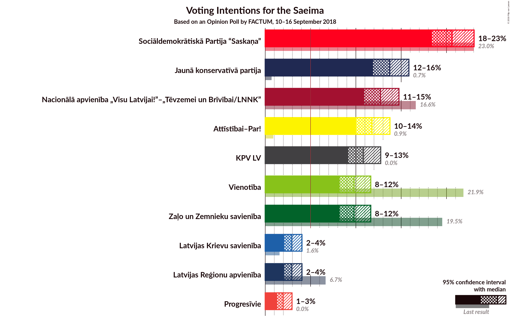
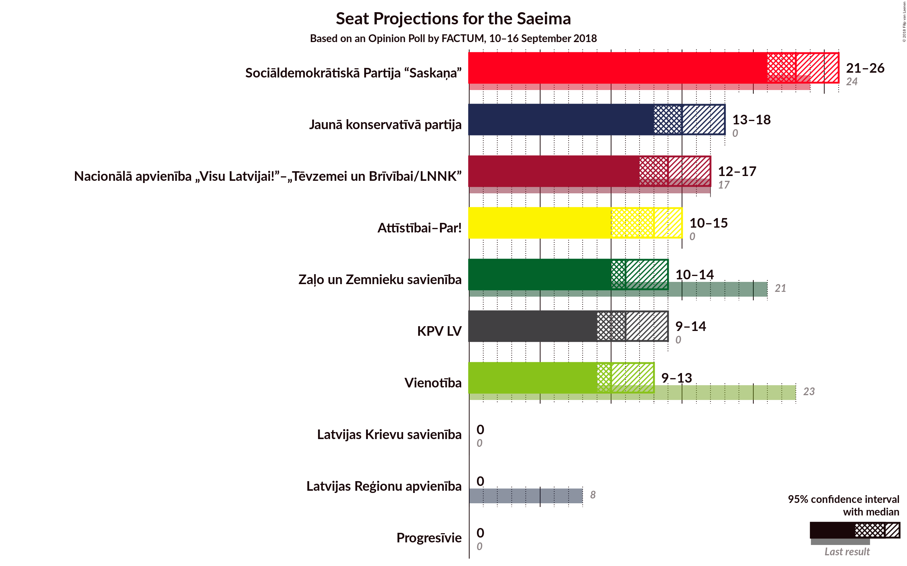
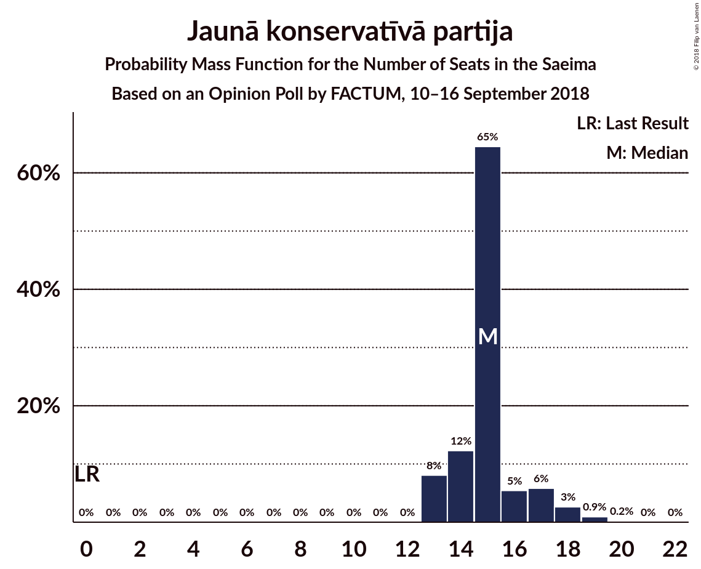
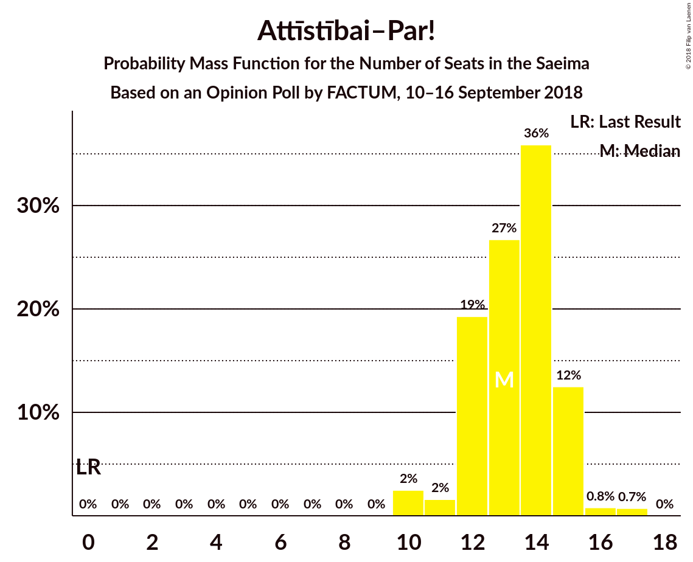
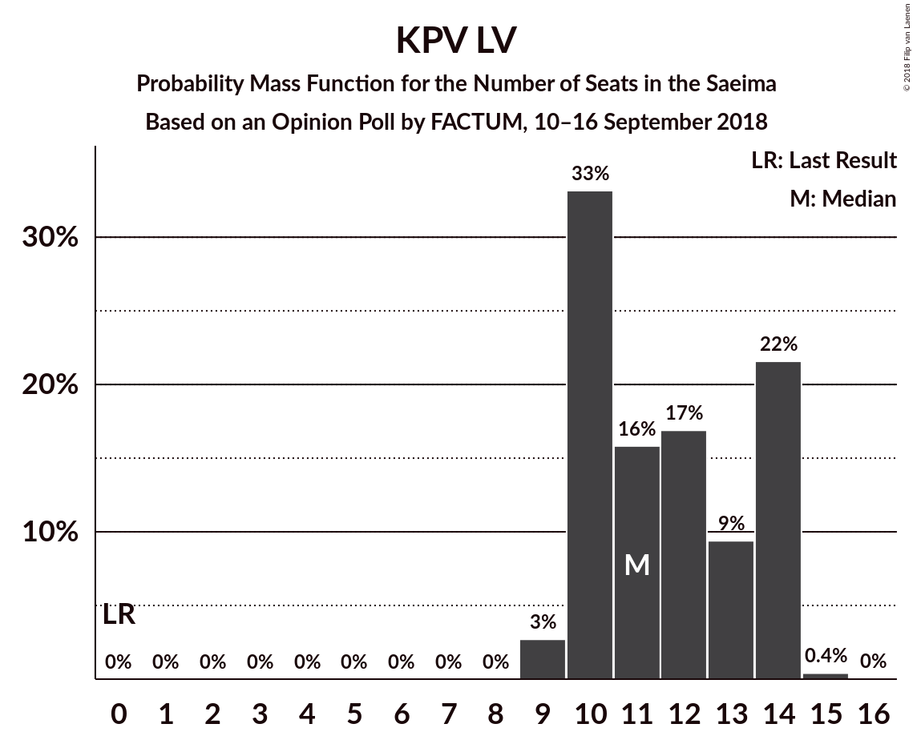

# Opinion Poll by FACTUM, 10–16 September 2018

<a href="#voting-intentions">Voting Intentions</a> | <a href="#seats">Seats</a> | <a href="#coalitions">Coalitions</a> | <a href="#technical-information">Technical Information</a>

## Voting Intentions

### Confidence Intervals

| Party | Last Result | Poll Result | 80% Confidence Interval | 90% Confidence Interval | 95% Confidence Interval | 99% Confidence Interval |
|:-----:|:-----------:|:-----------:|:-----------------------:|:-----------------------:|:-----------------------:|:-----------------------:|
| Sociāldemokrātiskā Partija “Saskaņa” | 23.0% | 20.6% | 19.2–22.2% |18.7–22.6% |18.4–23.0% |17.7–23.8% |
| Jaunā konservatīvā partija | 0.7% | 13.7% | 12.5–15.1% |12.2–15.5% |11.9–15.9% |11.3–16.5% |
| Nacionālā apvienība „Visu Latvijai!”–„Tēvzemei un Brīvībai/LNNK” | 16.6% | 12.7% | 11.5–14.1% |11.2–14.4% |10.9–14.8% |10.4–15.4% |
| Attīstībai–Par! | 0.9% | 11.8% | 10.6–13.1% |10.3–13.4% |10.0–13.8% |9.5–14.4% |
| KPV LV | 0.0% | 10.8% | 9.7–12.1% |9.4–12.4% |9.2–12.7% |8.7–13.4% |
| Vienotība | 21.9% | 9.8% | 8.7–11.0% |8.5–11.3% |8.2–11.6% |7.7–12.2% |
| Zaļo un Zemnieku savienība | 19.5% | 9.8% | 8.7–11.0% |8.5–11.3% |8.2–11.6% |7.7–12.2% |
| Latvijas Reģionu apvienība | 6.7% | 2.9% | 2.4–3.7% |2.2–3.9% |2.1–4.1% |1.9–4.5% |
| Latvijas Krievu savienība | 1.6% | 2.9% | 2.4–3.7% |2.2–3.9% |2.1–4.1% |1.9–4.5% |
| Progresīvie | 0.0% | 2.0% | 1.5–2.6% |1.4–2.8% |1.3–3.0% |1.1–3.3% |

*Note:* The poll result column reflects the actual value used in the calculations. Published results may vary slightly, and in addition be rounded to fewer digits.

## Seats

### Confidence Intervals

| Party | Last Result | Median | 80% Confidence Interval | 90% Confidence Interval | 95% Confidence Interval | 99% Confidence Interval |
|:-----:|:-----------:|:------:|:-----------------------:|:-----------------------:|:-----------------------:|:-----------------------:|
| <a href="#sociāldemokrātiskā-partija-“saskaņa”">Sociāldemokrātiskā Partija “Saskaņa”</a> | 24 | 23 | 22–26 |22–26 |21–26 |20–27 |
| <a href="#jaunā-konservatīvā-partija">Jaunā konservatīvā partija</a> | 0 | 15 | 14–16 |13–17 |13–18 |13–19 |
| <a href="#nacionālā-apvienība-„visu-latvijai!”–„tēvzemei-un-brīvībai/lnnk”">Nacionālā apvienība „Visu Latvijai!”–„Tēvzemei un Brīvībai/LNNK”</a> | 17 | 14 | 12–17 |12–17 |12–17 |12–17 |
| <a href="#attīstībai–par!">Attīstībai–Par!</a> | 0 | 13 | 12–15 |12–15 |10–15 |10–17 |
| <a href="#kpv-lv">KPV LV</a> | 0 | 11 | 10–14 |10–14 |9–14 |9–14 |
| <a href="#vienotība">Vienotība</a> | 23 | 10 | 10–13 |10–13 |9–13 |8–14 |
| <a href="#zaļo-un-zemnieku-savienība">Zaļo un Zemnieku savienība</a> | 21 | 11 | 11–14 |11–14 |10–14 |8–15 |
| <a href="#latvijas-reģionu-apvienība">Latvijas Reģionu apvienība</a> | 8 | 0 | 0 |0 |0 |0 |
| <a href="#latvijas-krievu-savienība">Latvijas Krievu savienība</a> | 0 | 0 | 0 |0 |0 |0 |
| <a href="#progresīvie">Progresīvie</a> | 0 | 0 | 0 |0 |0 |0 |

### Sociāldemokrātiskā Partija “Saskaņa”

*For a full overview of the results for this party, see the [Sociāldemokrātiskā Partija “Saskaņa”](party-sociāldemokrātiskāpartija“saskaņa”.html) page.*

| Number of Seats | Probability | Accumulated | Special Marks |
|:---------------:|:-----------:|:-----------:|:-------------:|
| 19 | 0.1% | 100% |  |
| 20 | 2% | 99.9% |  |
| 21 | 2% | 98% |  |
| 22 | 32% | 97% |  |
| 23 | 22% | 65% | Median |
| 24 | 27% | 43% | Last Result |
| 25 | 6% | 16% |  |
| 26 | 9% | 10% |  |
| 27 | 0.7% | 0.8% |  |
| 28 | 0.1% | 0.1% |  |
| 29 | 0% | 0% |  |

### Jaunā konservatīvā partija

*For a full overview of the results for this party, see the [Jaunā konservatīvā partija](party-jaunākonservatīvāpartija.html) page.*

| Number of Seats | Probability | Accumulated | Special Marks |
|:---------------:|:-----------:|:-----------:|:-------------:|
| 0 | 0% | 100% | Last Result |
| 1 | 0% | 100% |  |
| 2 | 0% | 100% |  |
| 3 | 0% | 100% |  |
| 4 | 0% | 100% |  |
| 5 | 0% | 100% |  |
| 6 | 0% | 100% |  |
| 7 | 0% | 100% |  |
| 8 | 0% | 100% |  |
| 9 | 0% | 100% |  |
| 10 | 0% | 100% |  |
| 11 | 0% | 100% |  |
| 12 | 0% | 100% |  |
| 13 | 8% | 100% |  |
| 14 | 12% | 92% |  |
| 15 | 65% | 80% | Median |
| 16 | 5% | 15% |  |
| 17 | 6% | 10% |  |
| 18 | 3% | 4% |  |
| 19 | 0.9% | 1.2% |  |
| 20 | 0.2% | 0.2% |  |
| 21 | 0% | 0% |  |

### Nacionālā apvienība „Visu Latvijai!”–„Tēvzemei un Brīvībai/LNNK”

*For a full overview of the results for this party, see the [Nacionālā apvienība „Visu Latvijai!”–„Tēvzemei un Brīvībai/LNNK”](party-nacionālāapvienība„visulatvijai”–„tēvzemeiunbrīvībailnnk”.html) page.*

| Number of Seats | Probability | Accumulated | Special Marks |
|:---------------:|:-----------:|:-----------:|:-------------:|
| 12 | 10% | 100% |  |
| 13 | 29% | 90% |  |
| 14 | 21% | 61% | Median |
| 15 | 24% | 39% |  |
| 16 | 5% | 15% |  |
| 17 | 10% | 10% | Last Result |
| 18 | 0.4% | 0.4% |  |
| 19 | 0% | 0% |  |

### Attīstībai–Par!

*For a full overview of the results for this party, see the [Attīstībai–Par!](party-attīstībai–par.html) page.*

| Number of Seats | Probability | Accumulated | Special Marks |
|:---------------:|:-----------:|:-----------:|:-------------:|
| 0 | 0% | 100% | Last Result |
| 1 | 0% | 100% |  |
| 2 | 0% | 100% |  |
| 3 | 0% | 100% |  |
| 4 | 0% | 100% |  |
| 5 | 0% | 100% |  |
| 6 | 0% | 100% |  |
| 7 | 0% | 100% |  |
| 8 | 0% | 100% |  |
| 9 | 0% | 100% |  |
| 10 | 2% | 100% |  |
| 11 | 2% | 97% |  |
| 12 | 19% | 96% |  |
| 13 | 27% | 77% | Median |
| 14 | 36% | 50% |  |
| 15 | 12% | 14% |  |
| 16 | 0.8% | 2% |  |
| 17 | 0.7% | 0.8% |  |
| 18 | 0% | 0% |  |

### KPV LV

*For a full overview of the results for this party, see the [KPV LV](party-kpvlv.html) page.*

| Number of Seats | Probability | Accumulated | Special Marks |
|:---------------:|:-----------:|:-----------:|:-------------:|
| 0 | 0% | 100% | Last Result |
| 1 | 0% | 100% |  |
| 2 | 0% | 100% |  |
| 3 | 0% | 100% |  |
| 4 | 0% | 100% |  |
| 5 | 0% | 100% |  |
| 6 | 0% | 100% |  |
| 7 | 0% | 100% |  |
| 8 | 0% | 100% |  |
| 9 | 3% | 100% |  |
| 10 | 33% | 97% |  |
| 11 | 16% | 64% | Median |
| 12 | 17% | 48% |  |
| 13 | 9% | 31% |  |
| 14 | 22% | 22% |  |
| 15 | 0.4% | 0.4% |  |
| 16 | 0% | 0% |  |

### Vienotība

*For a full overview of the results for this party, see the [Vienotība](party-vienotība.html) page.*

| Number of Seats | Probability | Accumulated | Special Marks |
|:---------------:|:-----------:|:-----------:|:-------------:|
| 7 | 0.1% | 100% |  |
| 8 | 0.9% | 99.9% |  |
| 9 | 4% | 99.0% |  |
| 10 | 47% | 95% | Median |
| 11 | 12% | 48% |  |
| 12 | 22% | 37% |  |
| 13 | 13% | 15% |  |
| 14 | 2% | 2% |  |
| 15 | 0% | 0% |  |
| 16 | 0% | 0% |  |
| 17 | 0% | 0% |  |
| 18 | 0% | 0% |  |
| 19 | 0% | 0% |  |
| 20 | 0% | 0% |  |
| 21 | 0% | 0% |  |
| 22 | 0% | 0% |  |
| 23 | 0% | 0% | Last Result |

### Zaļo un Zemnieku savienība

*For a full overview of the results for this party, see the [Zaļo un Zemnieku savienība](party-zaļounzemniekusavienība.html) page.*

| Number of Seats | Probability | Accumulated | Special Marks |
|:---------------:|:-----------:|:-----------:|:-------------:|
| 8 | 0.8% | 100% |  |
| 9 | 0.6% | 99.2% |  |
| 10 | 3% | 98.5% |  |
| 11 | 67% | 96% | Median |
| 12 | 9% | 29% |  |
| 13 | 7% | 20% |  |
| 14 | 12% | 13% |  |
| 15 | 2% | 2% |  |
| 16 | 0% | 0% |  |
| 17 | 0% | 0% |  |
| 18 | 0% | 0% |  |
| 19 | 0% | 0% |  |
| 20 | 0% | 0% |  |
| 21 | 0% | 0% | Last Result |

### Latvijas Reģionu apvienība

*For a full overview of the results for this party, see the [Latvijas Reģionu apvienība](party-latvijasreģionuapvienība.html) page.*

| Number of Seats | Probability | Accumulated | Special Marks |
|:---------------:|:-----------:|:-----------:|:-------------:|
| 0 | 100% | 100% | Median |
| 1 | 0% | 0% |  |
| 2 | 0% | 0% |  |
| 3 | 0% | 0% |  |
| 4 | 0% | 0% |  |
| 5 | 0% | 0% |  |
| 6 | 0% | 0% |  |
| 7 | 0% | 0% |  |
| 8 | 0% | 0% | Last Result |

### Latvijas Krievu savienība

*For a full overview of the results for this party, see the [Latvijas Krievu savienība](party-latvijaskrievusavienība.html) page.*

| Number of Seats | Probability | Accumulated | Special Marks |
|:---------------:|:-----------:|:-----------:|:-------------:|
| 0 | 100% | 100% | Last Result, Median |

### Progresīvie

*For a full overview of the results for this party, see the [Progresīvie](party-progresīvie.html) page.*

| Number of Seats | Probability | Accumulated | Special Marks |
|:---------------:|:-----------:|:-----------:|:-------------:|
| 0 | 100% | 100% | Last Result, Median |

## Coalitions

### Confidence Intervals

| Coalition | Last Result | Median | Majority? | 80% Confidence Interval | 90% Confidence Interval | 95% Confidence Interval | 99% Confidence Interval |
|:---------:|:-----------:|:------:|:---------:|:-----------------------:|:-----------------------:|:-----------------------:|:-----------------------:|
| Jaunā konservatīvā partija – Nacionālā apvienība „Visu Latvijai!”–„Tēvzemei un Brīvībai/LNNK” – Attīstībai–Par! – Vienotība – Zaļo un Zemnieku savienība | 61 | 65 | 100% | 63–68 | 61–68 | 61–68 | 61–69 |
| Jaunā konservatīvā partija – Nacionālā apvienība „Visu Latvijai!”–„Tēvzemei un Brīvībai/LNNK” – Attīstībai–Par! – Zaļo un Zemnieku savienība | 38 | 54 | 98% | 52–56 | 51–57 | 51–58 | 50–59 |
| Jaunā konservatīvā partija – Nacionālā apvienība „Visu Latvijai!”–„Tēvzemei un Brīvībai/LNNK” – Attīstībai–Par! – Vienotība | 40 | 53 | 90% | 51–57 | 50–57 | 50–57 | 49–58 |
| Sociāldemokrātiskā Partija “Saskaņa” – Jaunā konservatīvā partija – Attīstībai–Par! | 24 | 51 | 88% | 50–54 | 49–55 | 49–55 | 48–56 |
| Jaunā konservatīvā partija – Nacionālā apvienība „Visu Latvijai!”–„Tēvzemei un Brīvībai/LNNK” – Vienotība – Zaļo un Zemnieku savienība | 61 | 52 | 70% | 49–54 | 48–54 | 48–55 | 47–56 |
| Nacionālā apvienība „Visu Latvijai!”–„Tēvzemei un Brīvībai/LNNK” – Attīstībai–Par! – Vienotība – Zaļo un Zemnieku savienība | 61 | 50 | 42% | 48–53 | 46–53 | 46–53 | 45–55 |
| Sociāldemokrātiskā Partija “Saskaņa” – KPV LV – Zaļo un Zemnieku savienība | 45 | 47 | 2% | 43–49 | 43–50 | 43–50 | 42–51 |
| Jaunā konservatīvā partija – Nacionālā apvienība „Visu Latvijai!”–„Tēvzemei un Brīvībai/LNNK” – Zaļo un Zemnieku savienība | 38 | 41 | 0% | 39–43 | 38–43 | 38–44 | 37–46 |
| Nacionālā apvienība „Visu Latvijai!”–„Tēvzemei un Brīvībai/LNNK” – Attīstībai–Par! – Zaļo un Zemnieku savienība | 38 | 39 | 0% | 37–41 | 36–42 | 36–43 | 35–44 |
| Nacionālā apvienība „Visu Latvijai!”–„Tēvzemei un Brīvībai/LNNK” – Vienotība – Zaļo un Zemnieku savienība | 61 | 37 | 0% | 34–39 | 33–39 | 33–40 | 32–41 |
| Sociāldemokrātiskā Partija “Saskaņa” – Attīstībai–Par! | 24 | 36 | 0% | 35–39 | 34–39 | 34–39 | 33–40 |
| Sociāldemokrātiskā Partija “Saskaņa” – KPV LV | 24 | 35 | 0% | 32–37 | 32–39 | 32–39 | 31–39 |

### Jaunā konservatīvā partija – Nacionālā apvienība „Visu Latvijai!”–„Tēvzemei un Brīvībai/LNNK” – Attīstībai–Par! – Vienotība – Zaļo un Zemnieku savienība

| Number of Seats | Probability | Accumulated | Special Marks |
|:---------------:|:-----------:|:-----------:|:-------------:|
| 60 | 0.2% | 100% |  |
| 61 | 5% | 99.7% | Last Result |
| 62 | 5% | 95% |  |
| 63 | 7% | 90% | Median |
| 64 | 23% | 83% |  |
| 65 | 23% | 60% |  |
| 66 | 11% | 36% |  |
| 67 | 9% | 25% |  |
| 68 | 15% | 16% |  |
| 69 | 1.3% | 2% |  |
| 70 | 0.2% | 0.3% |  |
| 71 | 0% | 0% |  |

### Jaunā konservatīvā partija – Nacionālā apvienība „Visu Latvijai!”–„Tēvzemei un Brīvībai/LNNK” – Attīstībai–Par! – Zaļo un Zemnieku savienība

| Number of Seats | Probability | Accumulated | Special Marks |
|:---------------:|:-----------:|:-----------:|:-------------:|
| 38 | 0% | 100% | Last Result |
| 39 | 0% | 100% |  |
| 40 | 0% | 100% |  |
| 41 | 0% | 100% |  |
| 42 | 0% | 100% |  |
| 43 | 0% | 100% |  |
| 44 | 0% | 100% |  |
| 45 | 0% | 100% |  |
| 46 | 0% | 100% |  |
| 47 | 0% | 100% |  |
| 48 | 0.1% | 100% |  |
| 49 | 0.2% | 99.9% |  |
| 50 | 1.5% | 99.8% |  |
| 51 | 6% | 98% | Majority |
| 52 | 8% | 92% |  |
| 53 | 19% | 84% | Median |
| 54 | 25% | 65% |  |
| 55 | 21% | 40% |  |
| 56 | 11% | 19% |  |
| 57 | 5% | 8% |  |
| 58 | 2% | 3% |  |
| 59 | 0.8% | 1.1% |  |
| 60 | 0.3% | 0.3% |  |
| 61 | 0% | 0% |  |

### Jaunā konservatīvā partija – Nacionālā apvienība „Visu Latvijai!”–„Tēvzemei un Brīvībai/LNNK” – Attīstībai–Par! – Vienotība

| Number of Seats | Probability | Accumulated | Special Marks |
|:---------------:|:-----------:|:-----------:|:-------------:|
| 40 | 0% | 100% | Last Result |
| 41 | 0% | 100% |  |
| 42 | 0% | 100% |  |
| 43 | 0% | 100% |  |
| 44 | 0% | 100% |  |
| 45 | 0% | 100% |  |
| 46 | 0% | 100% |  |
| 47 | 0% | 100% |  |
| 48 | 0.2% | 100% |  |
| 49 | 2% | 99.8% |  |
| 50 | 8% | 98% |  |
| 51 | 7% | 90% | Majority |
| 52 | 12% | 83% | Median |
| 53 | 21% | 71% |  |
| 54 | 23% | 49% |  |
| 55 | 6% | 27% |  |
| 56 | 10% | 20% |  |
| 57 | 10% | 10% |  |
| 58 | 0.5% | 0.7% |  |
| 59 | 0.1% | 0.1% |  |
| 60 | 0% | 0% |  |

### Sociāldemokrātiskā Partija “Saskaņa” – Jaunā konservatīvā partija – Attīstībai–Par!

| Number of Seats | Probability | Accumulated | Special Marks |
|:---------------:|:-----------:|:-----------:|:-------------:|
| 24 | 0% | 100% | Last Result |
| 25 | 0% | 100% |  |
| 26 | 0% | 100% |  |
| 27 | 0% | 100% |  |
| 28 | 0% | 100% |  |
| 29 | 0% | 100% |  |
| 30 | 0% | 100% |  |
| 31 | 0% | 100% |  |
| 32 | 0% | 100% |  |
| 33 | 0% | 100% |  |
| 34 | 0% | 100% |  |
| 35 | 0% | 100% |  |
| 36 | 0% | 100% |  |
| 37 | 0% | 100% |  |
| 38 | 0% | 100% |  |
| 39 | 0% | 100% |  |
| 40 | 0% | 100% |  |
| 41 | 0% | 100% |  |
| 42 | 0% | 100% |  |
| 43 | 0% | 100% |  |
| 44 | 0% | 100% |  |
| 45 | 0% | 100% |  |
| 46 | 0.1% | 100% |  |
| 47 | 0.2% | 99.9% |  |
| 48 | 1.4% | 99.7% |  |
| 49 | 4% | 98% |  |
| 50 | 6% | 94% |  |
| 51 | 48% | 88% | Median, Majority |
| 52 | 17% | 40% |  |
| 53 | 8% | 24% |  |
| 54 | 11% | 16% |  |
| 55 | 4% | 5% |  |
| 56 | 0.8% | 0.9% |  |
| 57 | 0.1% | 0.2% |  |
| 58 | 0% | 0% |  |

### Jaunā konservatīvā partija – Nacionālā apvienība „Visu Latvijai!”–„Tēvzemei un Brīvībai/LNNK” – Vienotība – Zaļo un Zemnieku savienība

| Number of Seats | Probability | Accumulated | Special Marks |
|:---------------:|:-----------:|:-----------:|:-------------:|
| 46 | 0.1% | 100% |  |
| 47 | 0.5% | 99.9% |  |
| 48 | 5% | 99.5% |  |
| 49 | 5% | 95% |  |
| 50 | 20% | 90% | Median |
| 51 | 15% | 70% | Majority |
| 52 | 18% | 55% |  |
| 53 | 20% | 37% |  |
| 54 | 12% | 17% |  |
| 55 | 3% | 5% |  |
| 56 | 1.4% | 2% |  |
| 57 | 0.3% | 0.4% |  |
| 58 | 0% | 0.1% |  |
| 59 | 0% | 0% |  |
| 60 | 0% | 0% |  |
| 61 | 0% | 0% | Last Result |

### Nacionālā apvienība „Visu Latvijai!”–„Tēvzemei un Brīvībai/LNNK” – Attīstībai–Par! – Vienotība – Zaļo un Zemnieku savienība

| Number of Seats | Probability | Accumulated | Special Marks |
|:---------------:|:-----------:|:-----------:|:-------------:|
| 44 | 0.1% | 100% |  |
| 45 | 0.4% | 99.9% |  |
| 46 | 5% | 99.5% |  |
| 47 | 4% | 95% |  |
| 48 | 12% | 91% | Median |
| 49 | 23% | 78% |  |
| 50 | 13% | 55% |  |
| 51 | 18% | 42% | Majority |
| 52 | 6% | 24% |  |
| 53 | 16% | 18% |  |
| 54 | 2% | 2% |  |
| 55 | 0.5% | 0.6% |  |
| 56 | 0% | 0% |  |
| 57 | 0% | 0% |  |
| 58 | 0% | 0% |  |
| 59 | 0% | 0% |  |
| 60 | 0% | 0% |  |
| 61 | 0% | 0% | Last Result |

### Sociāldemokrātiskā Partija “Saskaņa” – KPV LV – Zaļo un Zemnieku savienība

| Number of Seats | Probability | Accumulated | Special Marks |
|:---------------:|:-----------:|:-----------:|:-------------:|
| 41 | 0.1% | 100% |  |
| 42 | 0.5% | 99.9% |  |
| 43 | 10% | 99.3% |  |
| 44 | 10% | 89% |  |
| 45 | 6% | 80% | Last Result, Median |
| 46 | 23% | 73% |  |
| 47 | 21% | 51% |  |
| 48 | 12% | 29% |  |
| 49 | 7% | 17% |  |
| 50 | 8% | 10% |  |
| 51 | 2% | 2% | Majority |
| 52 | 0.2% | 0.2% |  |
| 53 | 0% | 0% |  |

### Jaunā konservatīvā partija – Nacionālā apvienība „Visu Latvijai!”–„Tēvzemei un Brīvībai/LNNK” – Zaļo un Zemnieku savienība

| Number of Seats | Probability | Accumulated | Special Marks |
|:---------------:|:-----------:|:-----------:|:-------------:|
| 35 | 0.1% | 100% |  |
| 36 | 0.2% | 99.9% |  |
| 37 | 2% | 99.8% |  |
| 38 | 6% | 98% | Last Result |
| 39 | 13% | 92% |  |
| 40 | 29% | 79% | Median |
| 41 | 20% | 50% |  |
| 42 | 13% | 30% |  |
| 43 | 13% | 17% |  |
| 44 | 3% | 5% |  |
| 45 | 0.6% | 2% |  |
| 46 | 0.8% | 1.0% |  |
| 47 | 0.2% | 0.2% |  |
| 48 | 0% | 0% |  |

### Nacionālā apvienība „Visu Latvijai!”–„Tēvzemei un Brīvībai/LNNK” – Attīstībai–Par! – Zaļo un Zemnieku savienība

| Number of Seats | Probability | Accumulated | Special Marks |
|:---------------:|:-----------:|:-----------:|:-------------:|
| 34 | 0.2% | 100% |  |
| 35 | 1.3% | 99.8% |  |
| 36 | 7% | 98% |  |
| 37 | 8% | 92% |  |
| 38 | 17% | 83% | Last Result, Median |
| 39 | 27% | 66% |  |
| 40 | 23% | 39% |  |
| 41 | 7% | 16% |  |
| 42 | 6% | 9% |  |
| 43 | 3% | 4% |  |
| 44 | 0.7% | 0.9% |  |
| 45 | 0.1% | 0.2% |  |
| 46 | 0% | 0% |  |

### Nacionālā apvienība „Visu Latvijai!”–„Tēvzemei un Brīvībai/LNNK” – Vienotība – Zaļo un Zemnieku savienība

| Number of Seats | Probability | Accumulated | Special Marks |
|:---------------:|:-----------:|:-----------:|:-------------:|
| 31 | 0.1% | 100% |  |
| 32 | 0.6% | 99.9% |  |
| 33 | 5% | 99.4% |  |
| 34 | 7% | 94% |  |
| 35 | 20% | 88% | Median |
| 36 | 14% | 67% |  |
| 37 | 12% | 53% |  |
| 38 | 21% | 41% |  |
| 39 | 17% | 20% |  |
| 40 | 2% | 4% |  |
| 41 | 1.4% | 2% |  |
| 42 | 0.3% | 0.3% |  |
| 43 | 0% | 0% |  |
| 44 | 0% | 0% |  |
| 45 | 0% | 0% |  |
| 46 | 0% | 0% |  |
| 47 | 0% | 0% |  |
| 48 | 0% | 0% |  |
| 49 | 0% | 0% |  |
| 50 | 0% | 0% |  |
| 51 | 0% | 0% | Majority |
| 52 | 0% | 0% |  |
| 53 | 0% | 0% |  |
| 54 | 0% | 0% |  |
| 55 | 0% | 0% |  |
| 56 | 0% | 0% |  |
| 57 | 0% | 0% |  |
| 58 | 0% | 0% |  |
| 59 | 0% | 0% |  |
| 60 | 0% | 0% |  |
| 61 | 0% | 0% | Last Result |

### Sociāldemokrātiskā Partija “Saskaņa” – Attīstībai–Par!

| Number of Seats | Probability | Accumulated | Special Marks |
|:---------------:|:-----------:|:-----------:|:-------------:|
| 24 | 0% | 100% | Last Result |
| 25 | 0% | 100% |  |
| 26 | 0% | 100% |  |
| 27 | 0% | 100% |  |
| 28 | 0% | 100% |  |
| 29 | 0% | 100% |  |
| 30 | 0% | 100% |  |
| 31 | 0.1% | 100% |  |
| 32 | 0.2% | 99.8% |  |
| 33 | 2% | 99.6% |  |
| 34 | 3% | 98% |  |
| 35 | 6% | 94% |  |
| 36 | 38% | 88% | Median |
| 37 | 27% | 50% |  |
| 38 | 12% | 23% |  |
| 39 | 9% | 11% |  |
| 40 | 1.4% | 2% |  |
| 41 | 0.2% | 0.3% |  |
| 42 | 0.1% | 0.1% |  |
| 43 | 0% | 0% |  |

### Sociāldemokrātiskā Partija “Saskaņa” – KPV LV

| Number of Seats | Probability | Accumulated | Special Marks |
|:---------------:|:-----------:|:-----------:|:-------------:|
| 24 | 0% | 100% | Last Result |
| 25 | 0% | 100% |  |
| 26 | 0% | 100% |  |
| 27 | 0% | 100% |  |
| 28 | 0% | 100% |  |
| 29 | 0% | 100% |  |
| 30 | 0.2% | 100% |  |
| 31 | 1.3% | 99.7% |  |
| 32 | 15% | 98% |  |
| 33 | 9% | 84% |  |
| 34 | 11% | 75% | Median |
| 35 | 23% | 64% |  |
| 36 | 23% | 40% |  |
| 37 | 7% | 17% |  |
| 38 | 5% | 10% |  |
| 39 | 5% | 5% |  |
| 40 | 0.2% | 0.2% |  |
| 41 | 0% | 0% |  |

## Technical Information

### Opinion Poll

+ **Polling firm:** FACTUM
+ **Commissioner(s):** —
+ **Fieldwork period:** 10–16 September 2018

### Calculations

+ **Sample size:** 1164
+ **Simulations done:** 1,048,576
+ **Error estimate:** 2.73%

