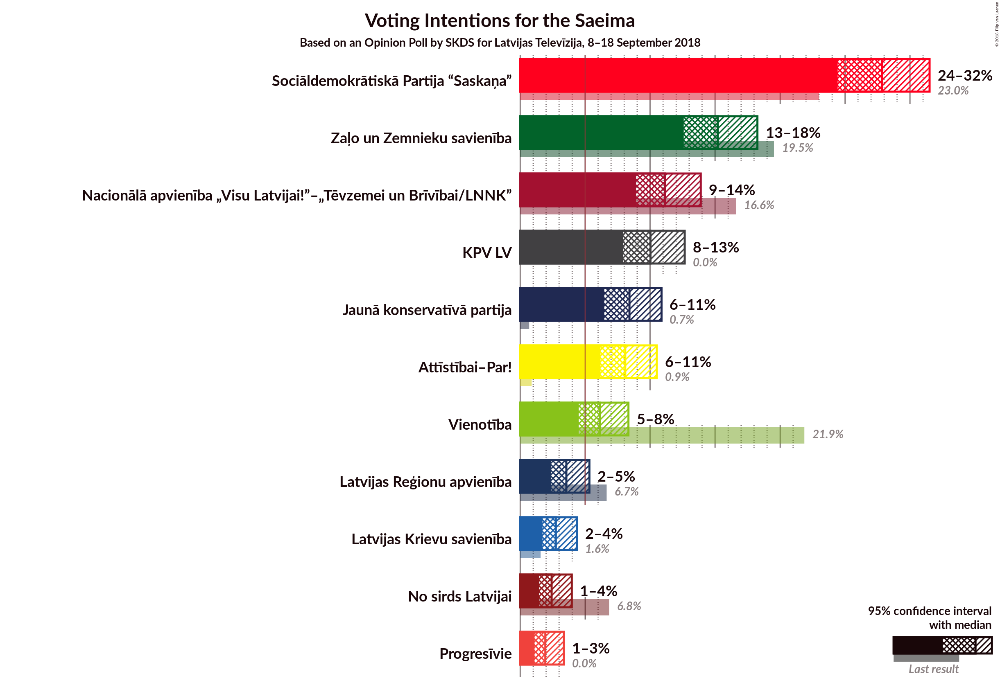
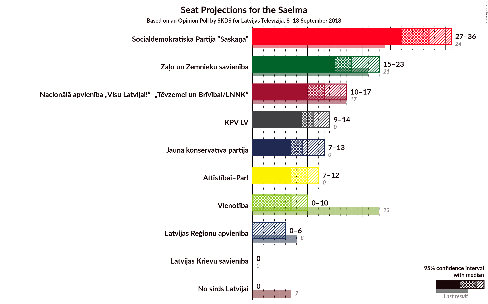

# Opinion Poll by SKDS for Latvijas Televīzija, 8–18 September 2018

<a href="#voting-intentions">Voting Intentions</a> | <a href="#seats">Seats</a> | <a href="#coalitions">Coalitions</a> | <a href="#technical-information">Technical Information</a>

## Voting Intentions

### Confidence Intervals

| Party | Last Result | Poll Result | 80% Confidence Interval | 90% Confidence Interval | 95% Confidence Interval | 99% Confidence Interval |
|:-----:|:-----------:|:-----------:|:-----------------------:|:-----------------------:|:-----------------------:|:-----------------------:|
| Sociāldemokrātiskā Partija “Saskaņa” | 23.0% | 27.8% | 25.6–30.2% |25.0–30.9% |24.4–31.5% |23.4–32.7% |
| Zaļo un Zemnieku savienība | 19.5% | 15.2% | 13.5–17.2% |13.0–17.8% |12.6–18.3% |11.8–19.2% |
| Nacionālā apvienība „Visu Latvijai!”–„Tēvzemei un Brīvībai/LNNK” | 16.6% | 11.2% | 9.7–13.0% |9.3–13.5% |8.9–13.9% |8.2–14.8% |
| KPV LV | 0.0% | 10.0% | 8.6–11.8% |8.2–12.2% |7.9–12.7% |7.3–13.5% |
| Jaunā konservatīvā partija | 0.7% | 8.4% | 7.1–10.0% |6.8–10.5% |6.5–10.9% |5.9–11.7% |
| Kustība Par! | 0.0% | 8.1% | N/A |N/A |N/A |N/A |
| Vienotība | 21.9% | 6.1% | 5.1–7.6% |4.8–8.0% |4.5–8.3% |4.0–9.1% |
| Latvijas Reģionu apvienība | 6.7% | 3.6% | 2.8–4.7% |2.5–5.0% |2.4–5.3% |2.0–5.9% |
| Latvijas Krievu savienība | 1.6% | 2.8% | 2.1–3.8% |1.9–4.1% |1.7–4.4% |1.4–4.9% |
| No sirds Latvijai | 6.8% | 2.4% | 1.8–3.4% |1.6–3.7% |1.5–4.0% |1.2–4.5% |
| Progresīvie | 0.0% | 1.9% | N/A |N/A |N/A |N/A |

*Note:* The poll result column reflects the actual value used in the calculations. Published results may vary slightly, and in addition be rounded to fewer digits.

## Seats

### Confidence Intervals

| Party | Last Result | Median | 80% Confidence Interval | 90% Confidence Interval | 95% Confidence Interval | 99% Confidence Interval |
|:-----:|:-----------:|:------:|:-----------------------:|:-----------------------:|:-----------------------:|:-----------------------:|
| <a href="#sociāldemokrātiskā-partija-“saskaņa”">Sociāldemokrātiskā Partija “Saskaņa”</a> | 24 | 34 | 32–37 |31–38 |31–39 |29–41 |
| <a href="#zaļo-un-zemnieku-savienība">Zaļo un Zemnieku savienība</a> | 21 | 21 | 18–24 |17–24 |17–25 |16–25 |
| <a href="#nacionālā-apvienība-„visu-latvijai!”–„tēvzemei-un-brīvībai/lnnk”">Nacionālā apvienība „Visu Latvijai!”–„Tēvzemei un Brīvībai/LNNK”</a> | 17 | 15 | 12–17 |12–18 |11–18 |11–19 |
| <a href="#kpv-lv">KPV LV</a> | 0 | 13 | 10–15 |9–15 |9–15 |9–17 |
| <a href="#jaunā-konservatīvā-partija">Jaunā konservatīvā partija</a> | 0 | 10 | 9–12 |8–14 |8–14 |7–15 |
| <a href="#kustība-par!">Kustība Par!</a> | 0 | N/A | N/A |N/A |N/A |N/A |
| <a href="#vienotība">Vienotība</a> | 23 | 8 | 0–10 |0–10 |0–11 |0–12 |
| <a href="#latvijas-reģionu-apvienība">Latvijas Reģionu apvienība</a> | 8 | 0 | 0 |0 |0–6 |0–7 |
| <a href="#latvijas-krievu-savienība">Latvijas Krievu savienība</a> | 0 | 0 | 0 |0 |0 |0 |
| <a href="#no-sirds-latvijai">No sirds Latvijai</a> | 7 | 0 | 0 |0 |0 |0 |
| <a href="#progresīvie">Progresīvie</a> | 0 | N/A | N/A |N/A |N/A |N/A |

