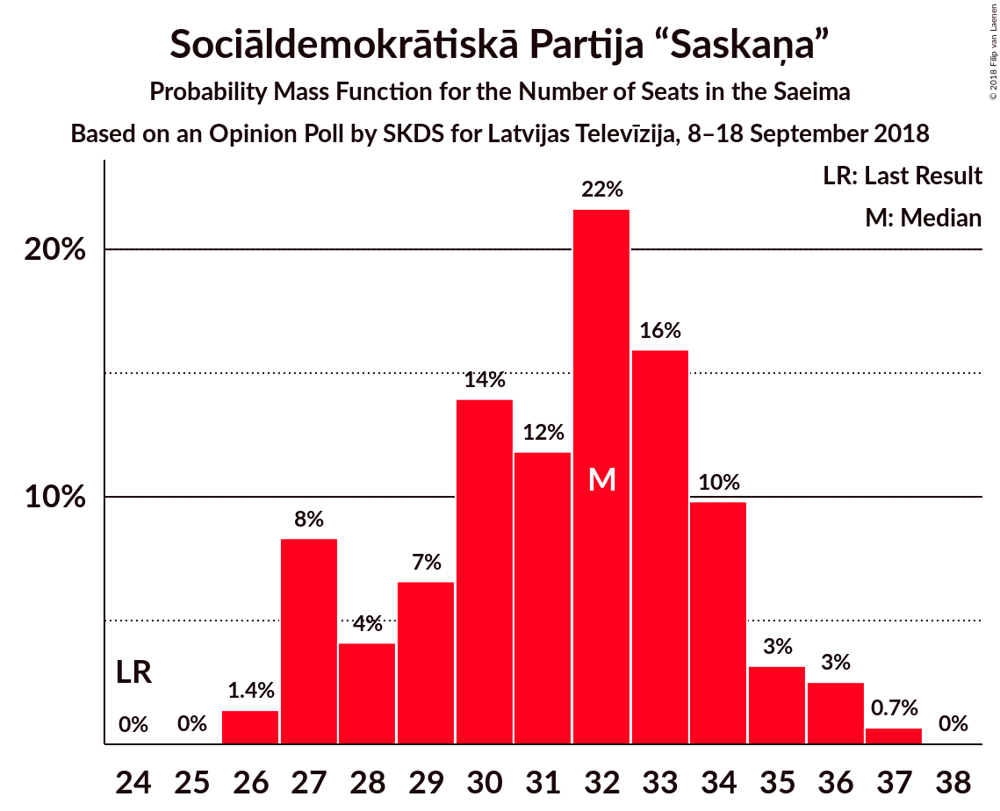
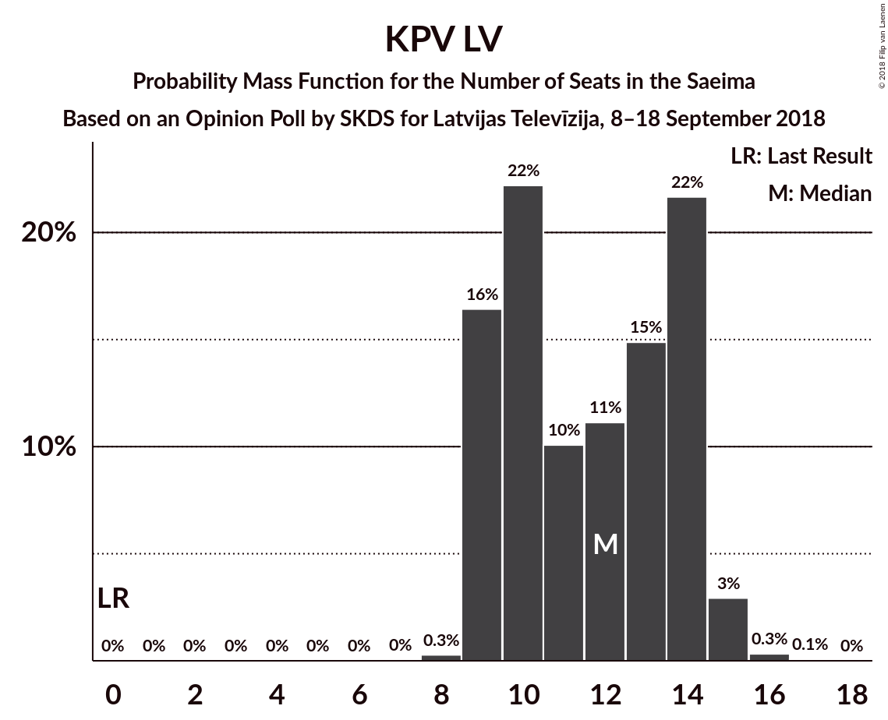
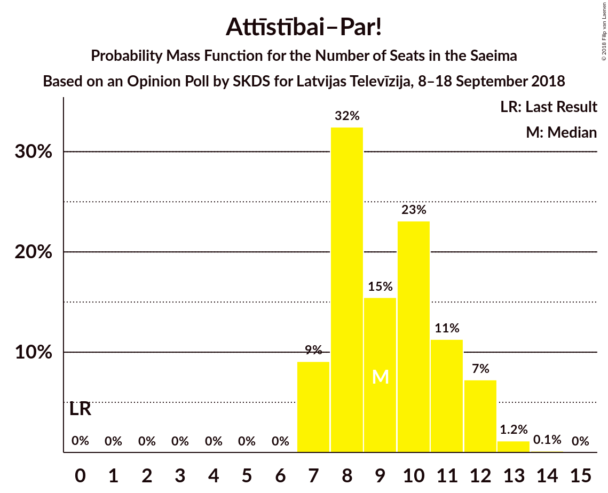

# Opinion Poll by SKDS for Latvijas Televīzija, 8–18 September 2018

<a href="#voting-intentions">Voting Intentions</a> | <a href="#seats">Seats</a> | <a href="#coalitions">Coalitions</a> | <a href="#technical-information">Technical Information</a>

## Voting Intentions

### Confidence Intervals

| Party | Last Result | Poll Result | 80% Confidence Interval | 90% Confidence Interval | 95% Confidence Interval | 99% Confidence Interval |
|:-----:|:-----------:|:-----------:|:-----------------------:|:-----------------------:|:-----------------------:|:-----------------------:|
| Sociāldemokrātiskā Partija “Saskaņa” | 23.0% | 27.8% | 25.6–30.2% |25.0–30.9% |24.4–31.5% |23.4–32.7% |
| Zaļo un Zemnieku savienība | 19.5% | 15.2% | 13.5–17.2% |13.0–17.8% |12.6–18.3% |11.8–19.2% |
| Nacionālā apvienība „Visu Latvijai!”–„Tēvzemei un Brīvībai/LNNK” | 16.6% | 11.2% | 9.7–13.0% |9.3–13.5% |8.9–13.9% |8.2–14.8% |
| KPV LV | 0.0% | 10.0% | 8.6–11.8% |8.2–12.2% |7.9–12.7% |7.3–13.5% |
| Jaunā konservatīvā partija | 0.7% | 8.4% | 7.1–10.0% |6.8–10.5% |6.5–10.9% |5.9–11.7% |
| Attīstībai–Par! | 0.9% | 8.1% | 6.8–9.7% |6.5–10.1% |6.2–10.5% |5.6–11.3% |
| Vienotība | 21.9% | 6.1% | 5.1–7.6% |4.8–8.0% |4.5–8.3% |4.0–9.1% |
| Latvijas Reģionu apvienība | 6.7% | 3.6% | 2.8–4.7% |2.5–5.0% |2.4–5.3% |2.0–5.9% |
| Latvijas Krievu savienība | 1.6% | 2.8% | 2.1–3.8% |1.9–4.1% |1.7–4.4% |1.4–4.9% |
| No sirds Latvijai | 6.8% | 2.4% | 1.8–3.4% |1.6–3.7% |1.5–4.0% |1.2–4.5% |
| Progresīvie | 0.0% | 1.9% | 1.4–2.9% |1.2–3.1% |1.1–3.4% |0.9–3.9% |

*Note:* The poll result column reflects the actual value used in the calculations. Published results may vary slightly, and in addition be rounded to fewer digits.

## Seats

### Confidence Intervals

| Party | Last Result | Median | 80% Confidence Interval | 90% Confidence Interval | 95% Confidence Interval | 99% Confidence Interval |
|:-----:|:-----------:|:------:|:-----------------------:|:-----------------------:|:-----------------------:|:-----------------------:|
| <a href="#sociāldemokrātiskā-partija-“saskaņa”">Sociāldemokrātiskā Partija “Saskaņa”</a> | 24 | 32 | 28–34 |27–35 |27–36 |26–37 |
| <a href="#zaļo-un-zemnieku-savienība">Zaļo un Zemnieku savienība</a> | 21 | 18 | 16–20 |16–22 |15–23 |15–24 |
| <a href="#nacionālā-apvienība-„visu-latvijai!”–„tēvzemei-un-brīvībai/lnnk”">Nacionālā apvienība „Visu Latvijai!”–„Tēvzemei un Brīvībai/LNNK”</a> | 17 | 13 | 11–15 |10–15 |10–15 |9–18 |
| <a href="#kpv-lv">KPV LV</a> | 0 | 12 | 9–14 |9–14 |9–15 |9–15 |
| <a href="#jaunā-konservatīvā-partija">Jaunā konservatīvā partija</a> | 0 | 10 | 8–11 |7–13 |7–13 |7–14 |
| <a href="#attīstībai–par!">Attīstībai–Par!</a> | 0 | 9 | 8–11 |7–12 |7–12 |7–13 |
| <a href="#vienotība">Vienotība</a> | 23 | 7 | 0–8 |0–9 |0–10 |0–10 |
| <a href="#latvijas-reģionu-apvienība">Latvijas Reģionu apvienība</a> | 8 | 0 | 0 |0–7 |0–7 |0–7 |
| <a href="#latvijas-krievu-savienība">Latvijas Krievu savienība</a> | 0 | 0 | 0 |0 |0 |0 |
| <a href="#no-sirds-latvijai">No sirds Latvijai</a> | 7 | 0 | 0 |0 |0 |0 |
| <a href="#progresīvie">Progresīvie</a> | 0 | 0 | 0 |0 |0 |0 |

### Sociāldemokrātiskā Partija “Saskaņa”

*For a full overview of the results for this party, see the [Sociāldemokrātiskā Partija “Saskaņa”](party-sociāldemokrātiskāpartija“saskaņa”.html) page.*

| Number of Seats | Probability | Accumulated | Special Marks |
|:---------------:|:-----------:|:-----------:|:-------------:|
| 24 | 0% | 100% | Last Result |
| 25 | 0% | 100% |  |
| 26 | 1.4% | 99.9% |  |
| 27 | 8% | 98.6% |  |
| 28 | 4% | 90% |  |
| 29 | 7% | 86% |  |
| 30 | 14% | 80% |  |
| 31 | 12% | 66% |  |
| 32 | 22% | 54% | Median |
| 33 | 16% | 32% |  |
| 34 | 10% | 16% |  |
| 35 | 3% | 6% |  |
| 36 | 3% | 3% |  |
| 37 | 0.7% | 0.7% |  |
| 38 | 0% | 0% |  |

### Zaļo un Zemnieku savienība

*For a full overview of the results for this party, see the [Zaļo un Zemnieku savienība](party-zaļounzemniekusavienība.html) page.*

| Number of Seats | Probability | Accumulated | Special Marks |
|:---------------:|:-----------:|:-----------:|:-------------:|
| 14 | 0.3% | 100% |  |
| 15 | 4% | 99.6% |  |
| 16 | 8% | 96% |  |
| 17 | 25% | 88% |  |
| 18 | 22% | 63% | Median |
| 19 | 16% | 41% |  |
| 20 | 15% | 25% |  |
| 21 | 3% | 10% | Last Result |
| 22 | 4% | 6% |  |
| 23 | 2% | 3% |  |
| 24 | 1.3% | 1.3% |  |
| 25 | 0% | 0% |  |

### Nacionālā apvienība „Visu Latvijai!”–„Tēvzemei un Brīvībai/LNNK”

*For a full overview of the results for this party, see the [Nacionālā apvienība „Visu Latvijai!”–„Tēvzemei un Brīvībai/LNNK”](party-nacionālāapvienība„visulatvijai”–„tēvzemeiunbrīvībailnnk”.html) page.*

| Number of Seats | Probability | Accumulated | Special Marks |
|:---------------:|:-----------:|:-----------:|:-------------:|
| 8 | 0.4% | 100% |  |
| 9 | 2% | 99.5% |  |
| 10 | 5% | 98% |  |
| 11 | 8% | 93% |  |
| 12 | 24% | 85% |  |
| 13 | 15% | 61% | Median |
| 14 | 24% | 46% |  |
| 15 | 20% | 22% |  |
| 16 | 0.9% | 2% |  |
| 17 | 0.5% | 1.3% | Last Result |
| 18 | 0.9% | 0.9% |  |
| 19 | 0% | 0% |  |

### KPV LV

*For a full overview of the results for this party, see the [KPV LV](party-kpvlv.html) page.*

| Number of Seats | Probability | Accumulated | Special Marks |
|:---------------:|:-----------:|:-----------:|:-------------:|
| 0 | 0% | 100% | Last Result |
| 1 | 0% | 100% |  |
| 2 | 0% | 100% |  |
| 3 | 0% | 100% |  |
| 4 | 0% | 100% |  |
| 5 | 0% | 100% |  |
| 6 | 0% | 100% |  |
| 7 | 0% | 100% |  |
| 8 | 0.3% | 100% |  |
| 9 | 16% | 99.7% |  |
| 10 | 22% | 83% |  |
| 11 | 10% | 61% |  |
| 12 | 11% | 51% | Median |
| 13 | 15% | 40% |  |
| 14 | 22% | 25% |  |
| 15 | 3% | 3% |  |
| 16 | 0.3% | 0.4% |  |
| 17 | 0.1% | 0.1% |  |
| 18 | 0% | 0% |  |

### Jaunā konservatīvā partija

*For a full overview of the results for this party, see the [Jaunā konservatīvā partija](party-jaunākonservatīvāpartija.html) page.*

| Number of Seats | Probability | Accumulated | Special Marks |
|:---------------:|:-----------:|:-----------:|:-------------:|
| 0 | 0% | 100% | Last Result |
| 1 | 0% | 100% |  |
| 2 | 0% | 100% |  |
| 3 | 0% | 100% |  |
| 4 | 0% | 100% |  |
| 5 | 0% | 100% |  |
| 6 | 0% | 100% |  |
| 7 | 7% | 99.9% |  |
| 8 | 23% | 93% |  |
| 9 | 10% | 70% |  |
| 10 | 31% | 60% | Median |
| 11 | 20% | 29% |  |
| 12 | 2% | 9% |  |
| 13 | 5% | 7% |  |
| 14 | 1.2% | 1.4% |  |
| 15 | 0.2% | 0.2% |  |
| 16 | 0% | 0% |  |

### Attīstībai–Par!

*For a full overview of the results for this party, see the [Attīstībai–Par!](party-attīstībai–par.html) page.*

| Number of Seats | Probability | Accumulated | Special Marks |
|:---------------:|:-----------:|:-----------:|:-------------:|
| 0 | 0% | 100% | Last Result |
| 1 | 0% | 100% |  |
| 2 | 0% | 100% |  |
| 3 | 0% | 100% |  |
| 4 | 0% | 100% |  |
| 5 | 0% | 100% |  |
| 6 | 0% | 100% |  |
| 7 | 9% | 100% |  |
| 8 | 32% | 91% |  |
| 9 | 15% | 58% | Median |
| 10 | 23% | 43% |  |
| 11 | 11% | 20% |  |
| 12 | 7% | 9% |  |
| 13 | 1.2% | 1.3% |  |
| 14 | 0.1% | 0.2% |  |
| 15 | 0% | 0% |  |

### Vienotība

*For a full overview of the results for this party, see the [Vienotība](party-vienotība.html) page.*

| Number of Seats | Probability | Accumulated | Special Marks |
|:---------------:|:-----------:|:-----------:|:-------------:|
| 0 | 19% | 100% |  |
| 1 | 0% | 81% |  |
| 2 | 0% | 81% |  |
| 3 | 0% | 81% |  |
| 4 | 0% | 81% |  |
| 5 | 0% | 81% |  |
| 6 | 0% | 81% |  |
| 7 | 52% | 81% | Median |
| 8 | 20% | 29% |  |
| 9 | 5% | 9% |  |
| 10 | 4% | 4% |  |
| 11 | 0.2% | 0.2% |  |
| 12 | 0% | 0% |  |
| 13 | 0% | 0% |  |
| 14 | 0% | 0% |  |
| 15 | 0% | 0% |  |
| 16 | 0% | 0% |  |
| 17 | 0% | 0% |  |
| 18 | 0% | 0% |  |
| 19 | 0% | 0% |  |
| 20 | 0% | 0% |  |
| 21 | 0% | 0% |  |
| 22 | 0% | 0% |  |
| 23 | 0% | 0% | Last Result |

### Latvijas Reģionu apvienība

*For a full overview of the results for this party, see the [Latvijas Reģionu apvienība](party-latvijasreģionuapvienība.html) page.*

| Number of Seats | Probability | Accumulated | Special Marks |
|:---------------:|:-----------:|:-----------:|:-------------:|
| 0 | 91% | 100% | Median |
| 1 | 0% | 9% |  |
| 2 | 0% | 9% |  |
| 3 | 0% | 9% |  |
| 4 | 0% | 9% |  |
| 5 | 0% | 9% |  |
| 6 | 1.1% | 9% |  |
| 7 | 8% | 8% |  |
| 8 | 0.1% | 0.1% | Last Result |
| 9 | 0% | 0% |  |

### Latvijas Krievu savienība

*For a full overview of the results for this party, see the [Latvijas Krievu savienība](party-latvijaskrievusavienība.html) page.*

| Number of Seats | Probability | Accumulated | Special Marks |
|:---------------:|:-----------:|:-----------:|:-------------:|
| 0 | 99.7% | 100% | Last Result, Median |
| 1 | 0% | 0.3% |  |
| 2 | 0% | 0.3% |  |
| 3 | 0% | 0.3% |  |
| 4 | 0% | 0.3% |  |
| 5 | 0% | 0.3% |  |
| 6 | 0.3% | 0.3% |  |
| 7 | 0% | 0% |  |

### No sirds Latvijai

*For a full overview of the results for this party, see the [No sirds Latvijai](party-nosirdslatvijai.html) page.*

| Number of Seats | Probability | Accumulated | Special Marks |
|:---------------:|:-----------:|:-----------:|:-------------:|
| 0 | 99.8% | 100% | Median |
| 1 | 0% | 0.2% |  |
| 2 | 0% | 0.2% |  |
| 3 | 0% | 0.2% |  |
| 4 | 0% | 0.2% |  |
| 5 | 0% | 0.2% |  |
| 6 | 0.1% | 0.1% |  |
| 7 | 0% | 0% | Last Result |

### Progresīvie

*For a full overview of the results for this party, see the [Progresīvie](party-progresīvie.html) page.*

| Number of Seats | Probability | Accumulated | Special Marks |
|:---------------:|:-----------:|:-----------:|:-------------:|
| 0 | 100% | 100% | Last Result, Median |

## Coalitions

### Confidence Intervals

| Coalition | Last Result | Median | Majority? | 80% Confidence Interval | 90% Confidence Interval | 95% Confidence Interval | 99% Confidence Interval |
|:---------:|:-----------:|:------:|:---------:|:-----------------------:|:-----------------------:|:-----------------------:|:-----------------------:|
| Sociāldemokrātiskā Partija “Saskaņa” – Zaļo un Zemnieku savienība – KPV LV | 45 | 61 | 100% | 56–66 | 55–66 | 55–68 | 54–69 |
| Zaļo un Zemnieku savienība – Nacionālā apvienība „Visu Latvijai!”–„Tēvzemei un Brīvībai/LNNK” – Jaunā konservatīvā partija – Attīstībai–Par! – Vienotība | 61 | 56 | 98.9% | 53–60 | 52–61 | 51–62 | 50–63 |
| Zaļo un Zemnieku savienība – Nacionālā apvienība „Visu Latvijai!”–„Tēvzemei un Brīvībai/LNNK” – Jaunā konservatīvā partija – Attīstībai–Par! | 38 | 50 | 45% | 46–54 | 46–56 | 45–56 | 43–59 |
| Sociāldemokrātiskā Partija “Saskaņa” – Jaunā konservatīvā partija – Attīstībai–Par! | 24 | 51 | 51% | 46–54 | 46–55 | 45–56 | 43–57 |
| Zaļo un Zemnieku savienība – Nacionālā apvienība „Visu Latvijai!”–„Tēvzemei un Brīvībai/LNNK” – Jaunā konservatīvā partija – Vienotība | 61 | 47 | 12% | 44–51 | 43–52 | 42–53 | 40–54 |
| Zaļo un Zemnieku savienība – Nacionālā apvienība „Visu Latvijai!”–„Tēvzemei un Brīvībai/LNNK” – Attīstībai–Par! – Vienotība | 61 | 46 | 12% | 44–51 | 42–52 | 42–52 | 40–54 |
| Sociāldemokrātiskā Partija “Saskaņa” – KPV LV | 24 | 43 | 0.2% | 39–47 | 37–48 | 37–48 | 37–50 |
| Zaļo un Zemnieku savienība – Nacionālā apvienība „Visu Latvijai!”–„Tēvzemei un Brīvībai/LNNK” – Attīstībai–Par! | 38 | 40 | 0% | 37–45 | 37–45 | 36–46 | 33–48 |
| Zaļo un Zemnieku savienība – Nacionālā apvienība „Visu Latvijai!”–„Tēvzemei un Brīvībai/LNNK” – Jaunā konservatīvā partija | 38 | 41 | 0% | 37–45 | 37–45 | 36–46 | 34–48 |
| Sociāldemokrātiskā Partija “Saskaņa” – Attīstībai–Par! | 24 | 41 | 0% | 37–44 | 36–44 | 35–45 | 34–48 |
| Nacionālā apvienība „Visu Latvijai!”–„Tēvzemei un Brīvībai/LNNK” – Jaunā konservatīvā partija – Attīstībai–Par! – Vienotība | 40 | 38 | 0% | 34–42 | 33–43 | 32–45 | 31–46 |
| Zaļo un Zemnieku savienība – Nacionālā apvienība „Visu Latvijai!”–„Tēvzemei un Brīvībai/LNNK” – Vienotība | 61 | 38 | 0% | 34–41 | 33–42 | 31–43 | 30–44 |

### Sociāldemokrātiskā Partija “Saskaņa” – Zaļo un Zemnieku savienība – KPV LV

| Number of Seats | Probability | Accumulated | Special Marks |
|:---------------:|:-----------:|:-----------:|:-------------:|
| 45 | 0% | 100% | Last Result |
| 46 | 0% | 100% |  |
| 47 | 0% | 100% |  |
| 48 | 0% | 100% |  |
| 49 | 0% | 100% |  |
| 50 | 0% | 100% |  |
| 51 | 0% | 100% | Majority |
| 52 | 0% | 100% |  |
| 53 | 0.2% | 99.9% |  |
| 54 | 0.8% | 99.7% |  |
| 55 | 7% | 98.9% |  |
| 56 | 3% | 92% |  |
| 57 | 3% | 89% |  |
| 58 | 5% | 86% |  |
| 59 | 9% | 81% |  |
| 60 | 8% | 72% |  |
| 61 | 19% | 64% |  |
| 62 | 9% | 45% | Median |
| 63 | 11% | 36% |  |
| 64 | 7% | 25% |  |
| 65 | 6% | 18% |  |
| 66 | 7% | 12% |  |
| 67 | 2% | 5% |  |
| 68 | 2% | 3% |  |
| 69 | 0.7% | 0.9% |  |
| 70 | 0.1% | 0.2% |  |
| 71 | 0.1% | 0.1% |  |
| 72 | 0% | 0% |  |

### Zaļo un Zemnieku savienība – Nacionālā apvienība „Visu Latvijai!”–„Tēvzemei un Brīvībai/LNNK” – Jaunā konservatīvā partija – Attīstībai–Par! – Vienotība

| Number of Seats | Probability | Accumulated | Special Marks |
|:---------------:|:-----------:|:-----------:|:-------------:|
| 48 | 0.1% | 100% |  |
| 49 | 0.2% | 99.9% |  |
| 50 | 0.7% | 99.6% |  |
| 51 | 2% | 98.9% | Majority |
| 52 | 4% | 97% |  |
| 53 | 7% | 93% |  |
| 54 | 12% | 86% |  |
| 55 | 9% | 74% |  |
| 56 | 21% | 65% |  |
| 57 | 12% | 45% | Median |
| 58 | 9% | 32% |  |
| 59 | 9% | 23% |  |
| 60 | 6% | 14% |  |
| 61 | 3% | 8% | Last Result |
| 62 | 4% | 5% |  |
| 63 | 0.7% | 1.0% |  |
| 64 | 0.3% | 0.3% |  |
| 65 | 0% | 0% |  |

### Zaļo un Zemnieku savienība – Nacionālā apvienība „Visu Latvijai!”–„Tēvzemei un Brīvībai/LNNK” – Jaunā konservatīvā partija – Attīstībai–Par!

| Number of Seats | Probability | Accumulated | Special Marks |
|:---------------:|:-----------:|:-----------:|:-------------:|
| 38 | 0% | 100% | Last Result |
| 39 | 0% | 100% |  |
| 40 | 0% | 100% |  |
| 41 | 0% | 100% |  |
| 42 | 0% | 100% |  |
| 43 | 1.4% | 100% |  |
| 44 | 0.9% | 98.6% |  |
| 45 | 2% | 98% |  |
| 46 | 9% | 96% |  |
| 47 | 7% | 87% |  |
| 48 | 7% | 80% |  |
| 49 | 20% | 73% |  |
| 50 | 7% | 52% | Median |
| 51 | 9% | 45% | Majority |
| 52 | 9% | 36% |  |
| 53 | 6% | 27% |  |
| 54 | 11% | 21% |  |
| 55 | 3% | 10% |  |
| 56 | 5% | 7% |  |
| 57 | 0.5% | 2% |  |
| 58 | 0.2% | 1.3% |  |
| 59 | 1.1% | 1.1% |  |
| 60 | 0% | 0% |  |

### Sociāldemokrātiskā Partija “Saskaņa” – Jaunā konservatīvā partija – Attīstībai–Par!

| Number of Seats | Probability | Accumulated | Special Marks |
|:---------------:|:-----------:|:-----------:|:-------------:|
| 24 | 0% | 100% | Last Result |
| 25 | 0% | 100% |  |
| 26 | 0% | 100% |  |
| 27 | 0% | 100% |  |
| 28 | 0% | 100% |  |
| 29 | 0% | 100% |  |
| 30 | 0% | 100% |  |
| 31 | 0% | 100% |  |
| 32 | 0% | 100% |  |
| 33 | 0% | 100% |  |
| 34 | 0% | 100% |  |
| 35 | 0% | 100% |  |
| 36 | 0% | 100% |  |
| 37 | 0% | 100% |  |
| 38 | 0% | 100% |  |
| 39 | 0% | 100% |  |
| 40 | 0% | 100% |  |
| 41 | 0.1% | 100% |  |
| 42 | 0.2% | 99.9% |  |
| 43 | 0.9% | 99.6% |  |
| 44 | 1.1% | 98.7% |  |
| 45 | 3% | 98% |  |
| 46 | 6% | 95% |  |
| 47 | 5% | 89% |  |
| 48 | 11% | 84% |  |
| 49 | 11% | 73% |  |
| 50 | 11% | 62% |  |
| 51 | 21% | 51% | Median, Majority |
| 52 | 14% | 31% |  |
| 53 | 6% | 17% |  |
| 54 | 3% | 12% |  |
| 55 | 6% | 9% |  |
| 56 | 1.5% | 3% |  |
| 57 | 0.8% | 1.3% |  |
| 58 | 0.2% | 0.4% |  |
| 59 | 0.1% | 0.2% |  |
| 60 | 0.1% | 0.1% |  |
| 61 | 0% | 0% |  |

### Zaļo un Zemnieku savienība – Nacionālā apvienība „Visu Latvijai!”–„Tēvzemei un Brīvībai/LNNK” – Jaunā konservatīvā partija – Vienotība

| Number of Seats | Probability | Accumulated | Special Marks |
|:---------------:|:-----------:|:-----------:|:-------------:|
| 37 | 0% | 100% |  |
| 38 | 0.1% | 99.9% |  |
| 39 | 0.1% | 99.8% |  |
| 40 | 1.1% | 99.7% |  |
| 41 | 0.6% | 98.6% |  |
| 42 | 1.5% | 98% |  |
| 43 | 3% | 97% |  |
| 44 | 9% | 93% |  |
| 45 | 16% | 84% |  |
| 46 | 8% | 68% |  |
| 47 | 13% | 60% |  |
| 48 | 14% | 47% | Median |
| 49 | 14% | 32% |  |
| 50 | 7% | 19% |  |
| 51 | 6% | 12% | Majority |
| 52 | 3% | 6% |  |
| 53 | 2% | 3% |  |
| 54 | 0.6% | 0.7% |  |
| 55 | 0.1% | 0.1% |  |
| 56 | 0% | 0% |  |
| 57 | 0% | 0% |  |
| 58 | 0% | 0% |  |
| 59 | 0% | 0% |  |
| 60 | 0% | 0% |  |
| 61 | 0% | 0% | Last Result |

### Zaļo un Zemnieku savienība – Nacionālā apvienība „Visu Latvijai!”–„Tēvzemei un Brīvībai/LNNK” – Attīstībai–Par! – Vienotība

| Number of Seats | Probability | Accumulated | Special Marks |
|:---------------:|:-----------:|:-----------:|:-------------:|
| 38 | 0.1% | 100% |  |
| 39 | 0.2% | 99.8% |  |
| 40 | 0.7% | 99.6% |  |
| 41 | 1.4% | 98.9% |  |
| 42 | 3% | 98% |  |
| 43 | 3% | 95% |  |
| 44 | 13% | 92% |  |
| 45 | 11% | 79% |  |
| 46 | 22% | 67% |  |
| 47 | 10% | 45% | Median |
| 48 | 11% | 35% |  |
| 49 | 8% | 25% |  |
| 50 | 4% | 17% |  |
| 51 | 7% | 12% | Majority |
| 52 | 3% | 5% |  |
| 53 | 1.2% | 2% |  |
| 54 | 1.1% | 1.2% |  |
| 55 | 0.1% | 0.2% |  |
| 56 | 0.1% | 0.1% |  |
| 57 | 0% | 0% |  |
| 58 | 0% | 0% |  |
| 59 | 0% | 0% |  |
| 60 | 0% | 0% |  |
| 61 | 0% | 0% | Last Result |

### Sociāldemokrātiskā Partija “Saskaņa” – KPV LV

| Number of Seats | Probability | Accumulated | Special Marks |
|:---------------:|:-----------:|:-----------:|:-------------:|
| 24 | 0% | 100% | Last Result |
| 25 | 0% | 100% |  |
| 26 | 0% | 100% |  |
| 27 | 0% | 100% |  |
| 28 | 0% | 100% |  |
| 29 | 0% | 100% |  |
| 30 | 0% | 100% |  |
| 31 | 0% | 100% |  |
| 32 | 0% | 100% |  |
| 33 | 0% | 100% |  |
| 34 | 0% | 100% |  |
| 35 | 0% | 100% |  |
| 36 | 0.4% | 99.9% |  |
| 37 | 5% | 99.5% |  |
| 38 | 4% | 95% |  |
| 39 | 4% | 91% |  |
| 40 | 8% | 86% |  |
| 41 | 10% | 79% |  |
| 42 | 10% | 69% |  |
| 43 | 12% | 59% |  |
| 44 | 17% | 47% | Median |
| 45 | 8% | 30% |  |
| 46 | 11% | 22% |  |
| 47 | 5% | 11% |  |
| 48 | 3% | 6% |  |
| 49 | 2% | 2% |  |
| 50 | 0.6% | 0.8% |  |
| 51 | 0.2% | 0.2% | Majority |
| 52 | 0% | 0% |  |

### Zaļo un Zemnieku savienība – Nacionālā apvienība „Visu Latvijai!”–„Tēvzemei un Brīvībai/LNNK” – Attīstībai–Par!

| Number of Seats | Probability | Accumulated | Special Marks |
|:---------------:|:-----------:|:-----------:|:-------------:|
| 33 | 0.5% | 100% |  |
| 34 | 0.1% | 99.5% |  |
| 35 | 1.1% | 99.4% |  |
| 36 | 3% | 98% |  |
| 37 | 9% | 95% |  |
| 38 | 11% | 87% | Last Result |
| 39 | 18% | 76% |  |
| 40 | 11% | 58% | Median |
| 41 | 10% | 46% |  |
| 42 | 8% | 36% |  |
| 43 | 5% | 28% |  |
| 44 | 13% | 23% |  |
| 45 | 7% | 10% |  |
| 46 | 1.4% | 4% |  |
| 47 | 0.8% | 2% |  |
| 48 | 1.1% | 1.4% |  |
| 49 | 0.3% | 0.3% |  |
| 50 | 0% | 0% |  |

### Zaļo un Zemnieku savienība – Nacionālā apvienība „Visu Latvijai!”–„Tēvzemei un Brīvībai/LNNK” – Jaunā konservatīvā partija

| Number of Seats | Probability | Accumulated | Special Marks |
|:---------------:|:-----------:|:-----------:|:-------------:|
| 33 | 0.1% | 100% |  |
| 34 | 0.6% | 99.8% |  |
| 35 | 2% | 99.2% |  |
| 36 | 2% | 98% |  |
| 37 | 7% | 95% |  |
| 38 | 8% | 88% | Last Result |
| 39 | 7% | 80% |  |
| 40 | 15% | 73% |  |
| 41 | 18% | 58% | Median |
| 42 | 8% | 40% |  |
| 43 | 7% | 33% |  |
| 44 | 12% | 25% |  |
| 45 | 9% | 13% |  |
| 46 | 3% | 4% |  |
| 47 | 0.3% | 2% |  |
| 48 | 1.1% | 1.4% |  |
| 49 | 0.2% | 0.3% |  |
| 50 | 0.1% | 0.1% |  |
| 51 | 0% | 0% | Majority |

### Sociāldemokrātiskā Partija “Saskaņa” – Attīstībai–Par!

| Number of Seats | Probability | Accumulated | Special Marks |
|:---------------:|:-----------:|:-----------:|:-------------:|
| 24 | 0% | 100% | Last Result |
| 25 | 0% | 100% |  |
| 26 | 0% | 100% |  |
| 27 | 0% | 100% |  |
| 28 | 0% | 100% |  |
| 29 | 0% | 100% |  |
| 30 | 0% | 100% |  |
| 31 | 0% | 100% |  |
| 32 | 0% | 100% |  |
| 33 | 0.2% | 100% |  |
| 34 | 0.8% | 99.8% |  |
| 35 | 2% | 98.9% |  |
| 36 | 5% | 97% |  |
| 37 | 5% | 92% |  |
| 38 | 11% | 87% |  |
| 39 | 8% | 76% |  |
| 40 | 8% | 68% |  |
| 41 | 23% | 59% | Median |
| 42 | 17% | 36% |  |
| 43 | 6% | 19% |  |
| 44 | 9% | 13% |  |
| 45 | 2% | 4% |  |
| 46 | 0.9% | 2% |  |
| 47 | 0.5% | 1.2% |  |
| 48 | 0.6% | 0.7% |  |
| 49 | 0% | 0.1% |  |
| 50 | 0.1% | 0.1% |  |
| 51 | 0% | 0% | Majority |

### Nacionālā apvienība „Visu Latvijai!”–„Tēvzemei un Brīvībai/LNNK” – Jaunā konservatīvā partija – Attīstībai–Par! – Vienotība

| Number of Seats | Probability | Accumulated | Special Marks |
|:---------------:|:-----------:|:-----------:|:-------------:|
| 29 | 0.1% | 100% |  |
| 30 | 0.2% | 99.9% |  |
| 31 | 0.8% | 99.7% |  |
| 32 | 3% | 98.9% |  |
| 33 | 2% | 96% |  |
| 34 | 7% | 94% |  |
| 35 | 6% | 87% |  |
| 36 | 9% | 81% |  |
| 37 | 12% | 72% |  |
| 38 | 14% | 60% |  |
| 39 | 19% | 46% | Median |
| 40 | 8% | 27% | Last Result |
| 41 | 9% | 19% |  |
| 42 | 4% | 11% |  |
| 43 | 2% | 7% |  |
| 44 | 2% | 5% |  |
| 45 | 2% | 3% |  |
| 46 | 0.6% | 0.7% |  |
| 47 | 0% | 0% |  |

### Zaļo un Zemnieku savienība – Nacionālā apvienība „Visu Latvijai!”–„Tēvzemei un Brīvībai/LNNK” – Vienotība

| Number of Seats | Probability | Accumulated | Special Marks |
|:---------------:|:-----------:|:-----------:|:-------------:|
| 28 | 0.1% | 100% |  |
| 29 | 0.2% | 99.9% |  |
| 30 | 0.6% | 99.7% |  |
| 31 | 2% | 99.1% |  |
| 32 | 1.0% | 97% |  |
| 33 | 5% | 96% |  |
| 34 | 5% | 91% |  |
| 35 | 8% | 86% |  |
| 36 | 11% | 77% |  |
| 37 | 16% | 67% |  |
| 38 | 20% | 51% | Median |
| 39 | 9% | 31% |  |
| 40 | 7% | 22% |  |
| 41 | 7% | 16% |  |
| 42 | 5% | 9% |  |
| 43 | 2% | 4% |  |
| 44 | 1.0% | 1.4% |  |
| 45 | 0.2% | 0.4% |  |
| 46 | 0.1% | 0.2% |  |
| 47 | 0% | 0% |  |
| 48 | 0% | 0% |  |
| 49 | 0% | 0% |  |
| 50 | 0% | 0% |  |
| 51 | 0% | 0% | Majority |
| 52 | 0% | 0% |  |
| 53 | 0% | 0% |  |
| 54 | 0% | 0% |  |
| 55 | 0% | 0% |  |
| 56 | 0% | 0% |  |
| 57 | 0% | 0% |  |
| 58 | 0% | 0% |  |
| 59 | 0% | 0% |  |
| 60 | 0% | 0% |  |
| 61 | 0% | 0% | Last Result |

## Technical Information

### Opinion Poll

+ **Polling firm:** SKDS
+ **Commissioner(s):** Latvijas Televīzija
+ **Fieldwork period:** 8–18 September 2018

### Calculations

+ **Sample size:** 618
+ **Simulations done:** 1,048,576
+ **Error estimate:** 4.54%

