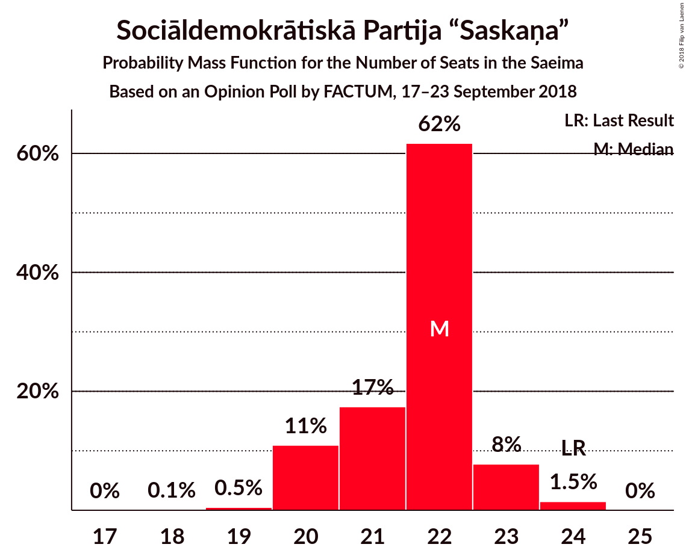
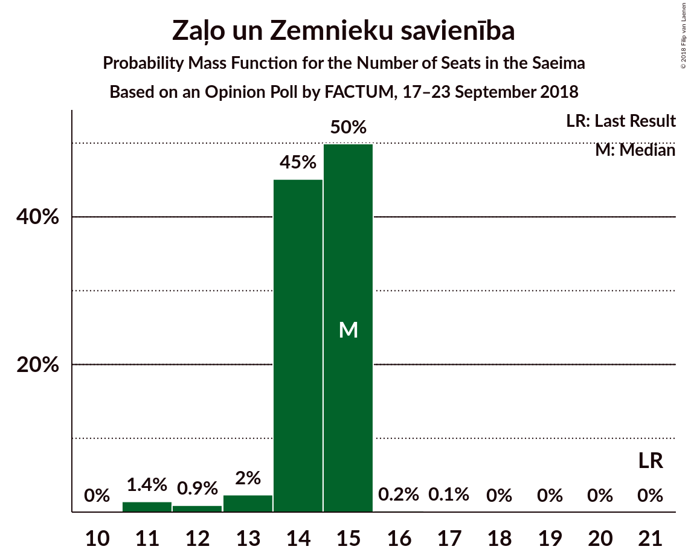
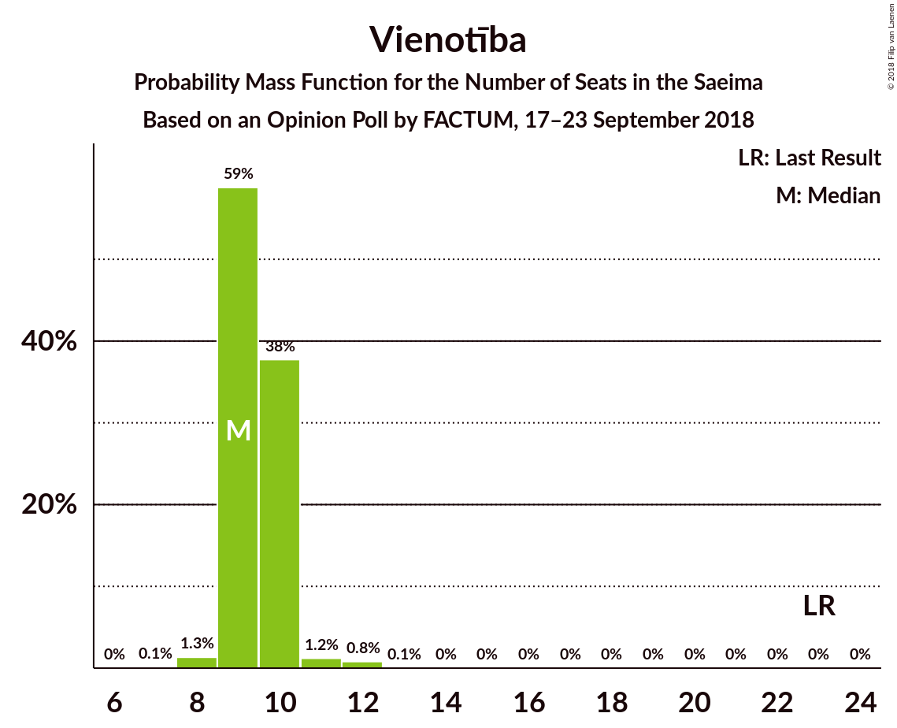

# Opinion Poll by FACTUM, 17–23 September 2018

<a href="#voting-intentions">Voting Intentions</a> | <a href="#seats">Seats</a> | <a href="#coalitions">Coalitions</a> | <a href="#technical-information">Technical Information</a>

## Voting Intentions

### Confidence Intervals

| Party | Last Result | Poll Result | 80% Confidence Interval | 90% Confidence Interval | 95% Confidence Interval | 99% Confidence Interval |
|:-----:|:-----------:|:-----------:|:-----------------------:|:-----------------------:|:-----------------------:|:-----------------------:|
| Sociāldemokrātiskā Partija “Saskaņa” | 23.0% | 19.2% | 18.2–20.3% |17.9–20.6% |17.6–20.8% |17.2–21.4% |
| Jaunā konservatīvā partija | 0.7% | 16.2% | 15.2–17.2% |15.0–17.5% |14.7–17.7% |14.3–18.2% |
| Zaļo un Zemnieku savienība | 19.5% | 12.1% | 11.3–13.0% |11.1–13.3% |10.9–13.5% |10.5–14.0% |
| Nacionālā apvienība „Visu Latvijai!”–„Tēvzemei un Brīvībai/LNNK” | 16.6% | 12.1% | 11.3–13.0% |11.1–13.3% |10.9–13.5% |10.5–14.0% |
| KPV LV | 0.0% | 11.1% | 10.3–12.0% |10.1–12.3% |9.9–12.5% |9.6–12.9% |
| Attīstībai–Par! | 0.9% | 11.1% | 10.3–12.0% |10.1–12.3% |9.9–12.5% |9.6–12.9% |
| Vienotība | 21.9% | 9.1% | 8.4–9.9% |8.2–10.1% |8.0–10.3% |7.7–10.7% |
| Latvijas Reģionu apvienība | 6.7% | 3.0% | 2.6–3.5% |2.5–3.7% |2.4–3.8% |2.2–4.1% |
| Latvijas Krievu savienība | 1.6% | 2.0% | 1.7–2.4% |1.6–2.6% |1.5–2.7% |1.4–2.9% |
| Progresīvie | 0.0% | 2.0% | 1.7–2.4% |1.6–2.6% |1.5–2.7% |1.4–2.9% |

*Note:* The poll result column reflects the actual value used in the calculations. Published results may vary slightly, and in addition be rounded to fewer digits.

## Seats

### Confidence Intervals

| Party | Last Result | Median | 80% Confidence Interval | 90% Confidence Interval | 95% Confidence Interval | 99% Confidence Interval |
|:-----:|:-----------:|:------:|:-----------------------:|:-----------------------:|:-----------------------:|:-----------------------:|
| <a href="#sociāldemokrātiskā-partija-“saskaņa”">Sociāldemokrātiskā Partija “Saskaņa”</a> | 24 | 22 | 22 |20–22 |20–22 |20–24 |
| <a href="#jaunā-konservatīvā-partija">Jaunā konservatīvā partija</a> | 0 | 18 | 18 |18–19 |17–19 |15–21 |
| <a href="#zaļo-un-zemnieku-savienība">Zaļo un Zemnieku savienība</a> | 21 | 14 | 14–15 |14–15 |14–15 |11–15 |
| <a href="#nacionālā-apvienība-„visu-latvijai!”–„tēvzemei-un-brīvībai/lnnk”">Nacionālā apvienība „Visu Latvijai!”–„Tēvzemei un Brīvībai/LNNK”</a> | 17 | 13 | 13 |13 |12–14 |12–14 |
| <a href="#kpv-lv">KPV LV</a> | 0 | 12 | 12 |10–12 |10–14 |10–14 |
| <a href="#attīstībai–par!">Attīstībai–Par!</a> | 0 | 12 | 12 |12–13 |10–13 |10–14 |
| <a href="#vienotība">Vienotība</a> | 23 | 9 | 9 |9–10 |9–10 |9–11 |
| <a href="#latvijas-reģionu-apvienība">Latvijas Reģionu apvienība</a> | 8 | 0 | 0 |0 |0 |0 |
| <a href="#latvijas-krievu-savienība">Latvijas Krievu savienība</a> | 0 | 0 | 0 |0 |0 |0 |
| <a href="#progresīvie">Progresīvie</a> | 0 | 0 | 0 |0 |0 |0 |

### Sociāldemokrātiskā Partija “Saskaņa”

*For a full overview of the results for this party, see the [Sociāldemokrātiskā Partija “Saskaņa”](party-sociāldemokrātiskāpartija“saskaņa”.html) page.*

| Number of Seats | Probability | Accumulated | Special Marks |
|:---------------:|:-----------:|:-----------:|:-------------:|
| 18 | 0.3% | 100% |  |
| 19 | 0.1% | 99.7% |  |
| 20 | 8% | 99.7% |  |
| 21 | 1.2% | 92% |  |
| 22 | 89% | 90% | Median |
| 23 | 0.5% | 1.4% |  |
| 24 | 0.8% | 0.8% | Last Result |
| 25 | 0% | 0% |  |

### Jaunā konservatīvā partija

*For a full overview of the results for this party, see the [Jaunā konservatīvā partija](party-jaunākonservatīvāpartija.html) page.*

| Number of Seats | Probability | Accumulated | Special Marks |
|:---------------:|:-----------:|:-----------:|:-------------:|
| 0 | 0% | 100% | Last Result |
| 1 | 0% | 100% |  |
| 2 | 0% | 100% |  |
| 3 | 0% | 100% |  |
| 4 | 0% | 100% |  |
| 5 | 0% | 100% |  |
| 6 | 0% | 100% |  |
| 7 | 0% | 100% |  |
| 8 | 0% | 100% |  |
| 9 | 0% | 100% |  |
| 10 | 0% | 100% |  |
| 11 | 0% | 100% |  |
| 12 | 0% | 100% |  |
| 13 | 0% | 100% |  |
| 14 | 0% | 100% |  |
| 15 | 1.4% | 100% |  |
| 16 | 0.5% | 98.6% |  |
| 17 | 2% | 98% |  |
| 18 | 90% | 96% | Median |
| 19 | 5% | 7% |  |
| 20 | 0.8% | 2% |  |
| 21 | 1.3% | 1.3% |  |
| 22 | 0% | 0% |  |

### Zaļo un Zemnieku savienība

*For a full overview of the results for this party, see the [Zaļo un Zemnieku savienība](party-zaļounzemniekusavienība.html) page.*

| Number of Seats | Probability | Accumulated | Special Marks |
|:---------------:|:-----------:|:-----------:|:-------------:|
| 11 | 0.7% | 100% |  |
| 12 | 0.8% | 99.3% |  |
| 13 | 0.3% | 98.6% |  |
| 14 | 88% | 98% | Median |
| 15 | 10% | 10% |  |
| 16 | 0.1% | 0.1% |  |
| 17 | 0% | 0% |  |
| 18 | 0% | 0% |  |
| 19 | 0% | 0% |  |
| 20 | 0% | 0% |  |
| 21 | 0% | 0% | Last Result |

### Nacionālā apvienība „Visu Latvijai!”–„Tēvzemei un Brīvībai/LNNK”

*For a full overview of the results for this party, see the [Nacionālā apvienība „Visu Latvijai!”–„Tēvzemei un Brīvībai/LNNK”](party-nacionālāapvienība„visulatvijai”–„tēvzemeiunbrīvībailnnk”.html) page.*

| Number of Seats | Probability | Accumulated | Special Marks |
|:---------------:|:-----------:|:-----------:|:-------------:|
| 12 | 3% | 100% |  |
| 13 | 94% | 97% | Median |
| 14 | 3% | 3% |  |
| 15 | 0.3% | 0.3% |  |
| 16 | 0.1% | 0.1% |  |
| 17 | 0% | 0% | Last Result |

### KPV LV

*For a full overview of the results for this party, see the [KPV LV](party-kpvlv.html) page.*

| Number of Seats | Probability | Accumulated | Special Marks |
|:---------------:|:-----------:|:-----------:|:-------------:|
| 0 | 0% | 100% | Last Result |
| 1 | 0% | 100% |  |
| 2 | 0% | 100% |  |
| 3 | 0% | 100% |  |
| 4 | 0% | 100% |  |
| 5 | 0% | 100% |  |
| 6 | 0% | 100% |  |
| 7 | 0% | 100% |  |
| 8 | 0% | 100% |  |
| 9 | 0% | 100% |  |
| 10 | 6% | 100% |  |
| 11 | 3% | 94% |  |
| 12 | 87% | 91% | Median |
| 13 | 0.4% | 4% |  |
| 14 | 4% | 4% |  |
| 15 | 0% | 0% |  |

### Attīstībai–Par!

*For a full overview of the results for this party, see the [Attīstībai–Par!](party-attīstībai–par.html) page.*

| Number of Seats | Probability | Accumulated | Special Marks |
|:---------------:|:-----------:|:-----------:|:-------------:|
| 0 | 0% | 100% | Last Result |
| 1 | 0% | 100% |  |
| 2 | 0% | 100% |  |
| 3 | 0% | 100% |  |
| 4 | 0% | 100% |  |
| 5 | 0% | 100% |  |
| 6 | 0% | 100% |  |
| 7 | 0% | 100% |  |
| 8 | 0% | 100% |  |
| 9 | 0% | 100% |  |
| 10 | 3% | 100% |  |
| 11 | 0.5% | 97% |  |
| 12 | 88% | 97% | Median |
| 13 | 7% | 9% |  |
| 14 | 2% | 2% |  |
| 15 | 0% | 0% |  |

### Vienotība

*For a full overview of the results for this party, see the [Vienotība](party-vienotība.html) page.*

| Number of Seats | Probability | Accumulated | Special Marks |
|:---------------:|:-----------:|:-----------:|:-------------:|
| 8 | 0.4% | 100% |  |
| 9 | 91% | 99.5% | Median |
| 10 | 8% | 9% |  |
| 11 | 0.5% | 0.8% |  |
| 12 | 0.1% | 0.3% |  |
| 13 | 0.1% | 0.2% |  |
| 14 | 0% | 0% |  |
| 15 | 0% | 0% |  |
| 16 | 0% | 0% |  |
| 17 | 0% | 0% |  |
| 18 | 0% | 0% |  |
| 19 | 0% | 0% |  |
| 20 | 0% | 0% |  |
| 21 | 0% | 0% |  |
| 22 | 0% | 0% |  |
| 23 | 0% | 0% | Last Result |

### Latvijas Reģionu apvienība

*For a full overview of the results for this party, see the [Latvijas Reģionu apvienība](party-latvijasreģionuapvienība.html) page.*

| Number of Seats | Probability | Accumulated | Special Marks |
|:---------------:|:-----------:|:-----------:|:-------------:|
| 0 | 100% | 100% | Median |
| 1 | 0% | 0% |  |
| 2 | 0% | 0% |  |
| 3 | 0% | 0% |  |
| 4 | 0% | 0% |  |
| 5 | 0% | 0% |  |
| 6 | 0% | 0% |  |
| 7 | 0% | 0% |  |
| 8 | 0% | 0% | Last Result |

### Latvijas Krievu savienība

*For a full overview of the results for this party, see the [Latvijas Krievu savienība](party-latvijaskrievusavienība.html) page.*

| Number of Seats | Probability | Accumulated | Special Marks |
|:---------------:|:-----------:|:-----------:|:-------------:|
| 0 | 100% | 100% | Last Result, Median |

### Progresīvie

*For a full overview of the results for this party, see the [Progresīvie](party-progresīvie.html) page.*

| Number of Seats | Probability | Accumulated | Special Marks |
|:---------------:|:-----------:|:-----------:|:-------------:|
| 0 | 100% | 100% | Last Result, Median |

## Coalitions

### Confidence Intervals

| Coalition | Last Result | Median | Majority? | 80% Confidence Interval | 90% Confidence Interval | 95% Confidence Interval | 99% Confidence Interval |
|:---------:|:-----------:|:------:|:---------:|:-----------------------:|:-----------------------:|:-----------------------:|:-----------------------:|
| Jaunā konservatīvā partija – Nacionālā apvienība „Visu Latvijai!”–„Tēvzemei un Brīvībai/LNNK” – Zaļo un Zemnieku savienība – Attīstībai–Par! – Vienotība | 61 | 66 | 100% | 66–67 | 66–69 | 66–70 | 64–70 |
| Jaunā konservatīvā partija – Nacionālā apvienība „Visu Latvijai!”–„Tēvzemei un Brīvībai/LNNK” – Zaļo un Zemnieku savienība – Attīstībai–Par! | 38 | 57 | 100% | 57 | 57–59 | 56–60 | 54–60 |
| Jaunā konservatīvā partija – Nacionālā apvienība „Visu Latvijai!”–„Tēvzemei un Brīvībai/LNNK” – Zaļo un Zemnieku savienība – Vienotība | 61 | 54 | 99.9% | 54 | 54–57 | 53–57 | 52–59 |
| Jaunā konservatīvā partija – Nacionālā apvienība „Visu Latvijai!”–„Tēvzemei un Brīvībai/LNNK” – Attīstībai–Par! – Vienotība | 40 | 52 | 99.1% | 52 | 52–54 | 52–55 | 50–56 |
| Sociāldemokrātiskā Partija “Saskaņa” – Jaunā konservatīvā partija – Attīstībai–Par! | 24 | 52 | 96% | 52 | 51–52 | 50–53 | 48–55 |
| Nacionālā apvienība „Visu Latvijai!”–„Tēvzemei un Brīvībai/LNNK” – Zaļo un Zemnieku savienība – Attīstībai–Par! – Vienotība | 61 | 48 | 6% | 48 | 48–51 | 48–51 | 47–53 |
| Sociāldemokrātiskā Partija “Saskaņa” – Zaļo un Zemnieku savienība – KPV LV | 45 | 48 | 0.1% | 48 | 46–48 | 45–48 | 44–50 |
| Jaunā konservatīvā partija – Nacionālā apvienība „Visu Latvijai!”–„Tēvzemei un Brīvībai/LNNK” – Zaļo un Zemnieku savienība | 38 | 45 | 0% | 45 | 45–47 | 44–47 | 42–49 |
| Nacionālā apvienība „Visu Latvijai!”–„Tēvzemei un Brīvībai/LNNK” – Zaļo un Zemnieku savienība – Attīstībai–Par! | 38 | 39 | 0% | 39 | 39–41 | 38–41 | 37–42 |
| Nacionālā apvienība „Visu Latvijai!”–„Tēvzemei un Brīvībai/LNNK” – Zaļo un Zemnieku savienība – Vienotība | 61 | 36 | 0% | 36 | 36–38 | 36–38 | 35–39 |
| Sociāldemokrātiskā Partija “Saskaņa” – Attīstībai–Par! | 24 | 34 | 0% | 34 | 32–35 | 31–35 | 30–36 |
| Sociāldemokrātiskā Partija “Saskaņa” – KPV LV | 24 | 34 | 0% | 33–34 | 31–34 | 30–34 | 30–36 |

### Jaunā konservatīvā partija – Nacionālā apvienība „Visu Latvijai!”–„Tēvzemei un Brīvībai/LNNK” – Zaļo un Zemnieku savienība – Attīstībai–Par! – Vienotība

| Number of Seats | Probability | Accumulated | Special Marks |
|:---------------:|:-----------:|:-----------:|:-------------:|
| 61 | 0% | 100% | Last Result |
| 62 | 0% | 100% |  |
| 63 | 0.1% | 100% |  |
| 64 | 0.8% | 99.9% |  |
| 65 | 0.7% | 99.1% |  |
| 66 | 88% | 98% | Median |
| 67 | 3% | 10% |  |
| 68 | 3% | 8% |  |
| 69 | 2% | 5% |  |
| 70 | 4% | 4% |  |
| 71 | 0.1% | 0.1% |  |
| 72 | 0% | 0% |  |

### Jaunā konservatīvā partija – Nacionālā apvienība „Visu Latvijai!”–„Tēvzemei un Brīvībai/LNNK” – Zaļo un Zemnieku savienība – Attīstībai–Par!

| Number of Seats | Probability | Accumulated | Special Marks |
|:---------------:|:-----------:|:-----------:|:-------------:|
| 38 | 0% | 100% | Last Result |
| 39 | 0% | 100% |  |
| 40 | 0% | 100% |  |
| 41 | 0% | 100% |  |
| 42 | 0% | 100% |  |
| 43 | 0% | 100% |  |
| 44 | 0% | 100% |  |
| 45 | 0% | 100% |  |
| 46 | 0% | 100% |  |
| 47 | 0% | 100% |  |
| 48 | 0% | 100% |  |
| 49 | 0% | 100% |  |
| 50 | 0% | 100% |  |
| 51 | 0% | 100% | Majority |
| 52 | 0% | 100% |  |
| 53 | 0% | 100% |  |
| 54 | 0.8% | 100% |  |
| 55 | 0.4% | 99.1% |  |
| 56 | 1.5% | 98.8% |  |
| 57 | 88% | 97% | Median |
| 58 | 2% | 9% |  |
| 59 | 3% | 7% |  |
| 60 | 3% | 3% |  |
| 61 | 0% | 0.1% |  |
| 62 | 0.1% | 0.1% |  |
| 63 | 0% | 0% |  |

### Jaunā konservatīvā partija – Nacionālā apvienība „Visu Latvijai!”–„Tēvzemei un Brīvībai/LNNK” – Zaļo un Zemnieku savienība – Vienotība

| Number of Seats | Probability | Accumulated | Special Marks |
|:---------------:|:-----------:|:-----------:|:-------------:|
| 50 | 0.1% | 100% |  |
| 51 | 0% | 99.9% | Majority |
| 52 | 1.1% | 99.9% |  |
| 53 | 1.5% | 98.8% |  |
| 54 | 88% | 97% | Median |
| 55 | 2% | 9% |  |
| 56 | 2% | 7% |  |
| 57 | 4% | 5% |  |
| 58 | 0.1% | 1.4% |  |
| 59 | 1.2% | 1.2% |  |
| 60 | 0% | 0% |  |
| 61 | 0% | 0% | Last Result |

### Jaunā konservatīvā partija – Nacionālā apvienība „Visu Latvijai!”–„Tēvzemei un Brīvībai/LNNK” – Attīstībai–Par! – Vienotība

| Number of Seats | Probability | Accumulated | Special Marks |
|:---------------:|:-----------:|:-----------:|:-------------:|
| 40 | 0% | 100% | Last Result |
| 41 | 0% | 100% |  |
| 42 | 0% | 100% |  |
| 43 | 0% | 100% |  |
| 44 | 0% | 100% |  |
| 45 | 0% | 100% |  |
| 46 | 0% | 100% |  |
| 47 | 0% | 100% |  |
| 48 | 0% | 100% |  |
| 49 | 0% | 100% |  |
| 50 | 0.9% | 99.9% |  |
| 51 | 2% | 99.1% | Majority |
| 52 | 89% | 98% | Median |
| 53 | 2% | 9% |  |
| 54 | 2% | 7% |  |
| 55 | 4% | 5% |  |
| 56 | 0.7% | 0.8% |  |
| 57 | 0.1% | 0.1% |  |
| 58 | 0% | 0% |  |

### Sociāldemokrātiskā Partija “Saskaņa” – Jaunā konservatīvā partija – Attīstībai–Par!

| Number of Seats | Probability | Accumulated | Special Marks |
|:---------------:|:-----------:|:-----------:|:-------------:|
| 24 | 0% | 100% | Last Result |
| 25 | 0% | 100% |  |
| 26 | 0% | 100% |  |
| 27 | 0% | 100% |  |
| 28 | 0% | 100% |  |
| 29 | 0% | 100% |  |
| 30 | 0% | 100% |  |
| 31 | 0% | 100% |  |
| 32 | 0% | 100% |  |
| 33 | 0% | 100% |  |
| 34 | 0% | 100% |  |
| 35 | 0% | 100% |  |
| 36 | 0% | 100% |  |
| 37 | 0% | 100% |  |
| 38 | 0% | 100% |  |
| 39 | 0% | 100% |  |
| 40 | 0% | 100% |  |
| 41 | 0% | 100% |  |
| 42 | 0% | 100% |  |
| 43 | 0% | 100% |  |
| 44 | 0% | 100% |  |
| 45 | 0% | 100% |  |
| 46 | 0% | 100% |  |
| 47 | 0% | 100% |  |
| 48 | 0.5% | 100% |  |
| 49 | 0.5% | 99.4% |  |
| 50 | 3% | 99.0% |  |
| 51 | 4% | 96% | Majority |
| 52 | 89% | 92% | Median |
| 53 | 2% | 3% |  |
| 54 | 0.6% | 1.1% |  |
| 55 | 0.5% | 0.5% |  |
| 56 | 0% | 0% |  |

### Nacionālā apvienība „Visu Latvijai!”–„Tēvzemei un Brīvībai/LNNK” – Zaļo un Zemnieku savienība – Attīstībai–Par! – Vienotība

| Number of Seats | Probability | Accumulated | Special Marks |
|:---------------:|:-----------:|:-----------:|:-------------:|
| 45 | 0.2% | 100% |  |
| 46 | 0.2% | 99.8% |  |
| 47 | 0.7% | 99.6% |  |
| 48 | 89% | 98.9% | Median |
| 49 | 3% | 10% |  |
| 50 | 1.0% | 7% |  |
| 51 | 5% | 6% | Majority |
| 52 | 0.4% | 0.9% |  |
| 53 | 0.4% | 0.5% |  |
| 54 | 0.1% | 0.1% |  |
| 55 | 0% | 0% |  |
| 56 | 0% | 0% |  |
| 57 | 0% | 0% |  |
| 58 | 0% | 0% |  |
| 59 | 0% | 0% |  |
| 60 | 0% | 0% |  |
| 61 | 0% | 0% | Last Result |

### Sociāldemokrātiskā Partija “Saskaņa” – Zaļo un Zemnieku savienība – KPV LV

| Number of Seats | Probability | Accumulated | Special Marks |
|:---------------:|:-----------:|:-----------:|:-------------:|
| 43 | 0.1% | 100% |  |
| 44 | 0.7% | 99.9% |  |
| 45 | 4% | 99.2% | Last Result |
| 46 | 2% | 95% |  |
| 47 | 2% | 93% |  |
| 48 | 89% | 91% | Median |
| 49 | 2% | 2% |  |
| 50 | 0.9% | 0.9% |  |
| 51 | 0% | 0.1% | Majority |
| 52 | 0% | 0% |  |

### Jaunā konservatīvā partija – Nacionālā apvienība „Visu Latvijai!”–„Tēvzemei un Brīvībai/LNNK” – Zaļo un Zemnieku savienība

| Number of Seats | Probability | Accumulated | Special Marks |
|:---------------:|:-----------:|:-----------:|:-------------:|
| 38 | 0% | 100% | Last Result |
| 39 | 0% | 100% |  |
| 40 | 0.1% | 100% |  |
| 41 | 0% | 99.9% |  |
| 42 | 1.0% | 99.9% |  |
| 43 | 1.2% | 98.8% |  |
| 44 | 0.7% | 98% |  |
| 45 | 89% | 97% | Median |
| 46 | 2% | 8% |  |
| 47 | 5% | 6% |  |
| 48 | 0.3% | 2% |  |
| 49 | 1.3% | 1.3% |  |
| 50 | 0% | 0% |  |

### Nacionālā apvienība „Visu Latvijai!”–„Tēvzemei un Brīvībai/LNNK” – Zaļo un Zemnieku savienība – Attīstībai–Par!

| Number of Seats | Probability | Accumulated | Special Marks |
|:---------------:|:-----------:|:-----------:|:-------------:|
| 36 | 0.3% | 100% |  |
| 37 | 0.4% | 99.7% |  |
| 38 | 3% | 99.3% | Last Result |
| 39 | 89% | 96% | Median |
| 40 | 2% | 8% |  |
| 41 | 5% | 6% |  |
| 42 | 1.4% | 2% |  |
| 43 | 0.2% | 0.4% |  |
| 44 | 0.1% | 0.1% |  |
| 45 | 0% | 0% |  |

### Nacionālā apvienība „Visu Latvijai!”–„Tēvzemei un Brīvībai/LNNK” – Zaļo un Zemnieku savienība – Vienotība

| Number of Seats | Probability | Accumulated | Special Marks |
|:---------------:|:-----------:|:-----------:|:-------------:|
| 34 | 0.3% | 100% |  |
| 35 | 1.5% | 99.7% |  |
| 36 | 88% | 98% | Median |
| 37 | 2% | 10% |  |
| 38 | 7% | 8% |  |
| 39 | 1.0% | 1.2% |  |
| 40 | 0.2% | 0.3% |  |
| 41 | 0% | 0% |  |
| 42 | 0% | 0% |  |
| 43 | 0% | 0% |  |
| 44 | 0% | 0% |  |
| 45 | 0% | 0% |  |
| 46 | 0% | 0% |  |
| 47 | 0% | 0% |  |
| 48 | 0% | 0% |  |
| 49 | 0% | 0% |  |
| 50 | 0% | 0% |  |
| 51 | 0% | 0% | Majority |
| 52 | 0% | 0% |  |
| 53 | 0% | 0% |  |
| 54 | 0% | 0% |  |
| 55 | 0% | 0% |  |
| 56 | 0% | 0% |  |
| 57 | 0% | 0% |  |
| 58 | 0% | 0% |  |
| 59 | 0% | 0% |  |
| 60 | 0% | 0% |  |
| 61 | 0% | 0% | Last Result |

### Sociāldemokrātiskā Partija “Saskaņa” – Attīstībai–Par!

| Number of Seats | Probability | Accumulated | Special Marks |
|:---------------:|:-----------:|:-----------:|:-------------:|
| 24 | 0% | 100% | Last Result |
| 25 | 0% | 100% |  |
| 26 | 0% | 100% |  |
| 27 | 0% | 100% |  |
| 28 | 0% | 100% |  |
| 29 | 0% | 100% |  |
| 30 | 2% | 100% |  |
| 31 | 0.8% | 98% |  |
| 32 | 3% | 97% |  |
| 33 | 4% | 95% |  |
| 34 | 85% | 90% | Median |
| 35 | 4% | 5% |  |
| 36 | 2% | 2% |  |
| 37 | 0% | 0% |  |

### Sociāldemokrātiskā Partija “Saskaņa” – KPV LV

| Number of Seats | Probability | Accumulated | Special Marks |
|:---------------:|:-----------:|:-----------:|:-------------:|
| 24 | 0% | 100% | Last Result |
| 25 | 0% | 100% |  |
| 26 | 0% | 100% |  |
| 27 | 0% | 100% |  |
| 28 | 0% | 100% |  |
| 29 | 0.1% | 100% |  |
| 30 | 4% | 99.9% |  |
| 31 | 2% | 96% |  |
| 32 | 3% | 95% |  |
| 33 | 3% | 92% |  |
| 34 | 88% | 90% | Median |
| 35 | 0.7% | 2% |  |
| 36 | 0.8% | 0.9% |  |
| 37 | 0.1% | 0.1% |  |
| 38 | 0% | 0% |  |

## Technical Information

### Opinion Poll

+ **Polling firm:** FACTUM
+ **Commissioner(s):** —
+ **Fieldwork period:** 17–23 September 2018

### Calculations

+ **Sample size:** 2381
+ **Simulations done:** 131,072
+ **Error estimate:** 2.30%

