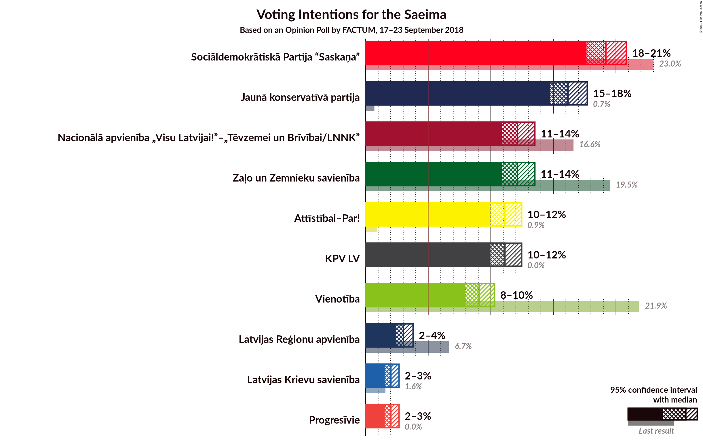

# Opinion Poll by FACTUM, 17–23 September 2018

<a href="#voting-intentions">Voting Intentions</a> | <a href="#seats">Seats</a> | <a href="#coalitions">Coalitions</a> | <a href="#technical-information">Technical Information</a>

## Voting Intentions

### Confidence Intervals

| Party | Last Result | Poll Result | 80% Confidence Interval | 90% Confidence Interval | 95% Confidence Interval | 99% Confidence Interval |
|:-----:|:-----------:|:-----------:|:-----------------------:|:-----------------------:|:-----------------------:|:-----------------------:|
| Sociāldemokrātiskā Partija “Saskaņa” | 23.0% | 19.2% | 18.2–20.3% |17.9–20.6% |17.6–20.8% |17.2–21.4% |
| Jaunā konservatīvā partija | 0.7% | 16.2% | 15.2–17.2% |15.0–17.5% |14.7–17.7% |14.3–18.2% |
| Zaļo un Zemnieku savienība | 19.5% | 12.1% | 11.3–13.0% |11.1–13.3% |10.9–13.5% |10.5–14.0% |
| Nacionālā apvienība „Visu Latvijai!”–„Tēvzemei un Brīvībai/LNNK” | 16.6% | 12.1% | 11.3–13.0% |11.1–13.3% |10.9–13.5% |10.5–14.0% |
| KPV LV | 0.0% | 11.1% | 10.3–12.0% |10.1–12.3% |9.9–12.5% |9.6–12.9% |
| Attīstībai–Par! | 0.9% | 11.1% | 10.3–12.0% |10.1–12.3% |9.9–12.5% |9.6–12.9% |
| Vienotība | 21.9% | 9.1% | 8.4–9.9% |8.2–10.1% |8.0–10.3% |7.7–10.7% |
| Latvijas Reģionu apvienība | 6.7% | 3.0% | 2.6–3.5% |2.5–3.7% |2.4–3.8% |2.2–4.1% |
| Latvijas Krievu savienība | 1.6% | 2.0% | 1.7–2.4% |1.6–2.6% |1.5–2.7% |1.4–2.9% |

*Note:* The poll result column reflects the actual value used in the calculations. Published results may vary slightly, and in addition be rounded to fewer digits.

## Seats

### Confidence Intervals

| Party | Last Result | Median | 80% Confidence Interval | 90% Confidence Interval | 95% Confidence Interval | 99% Confidence Interval |
|:-----:|:-----------:|:------:|:-----------------------:|:-----------------------:|:-----------------------:|:-----------------------:|
| <a href="#sociāldemokrātiskā-partija-“saskaņa”">Sociāldemokrātiskā Partija “Saskaņa”</a> | 24 | 21 | 20–22 |20–22 |20–23 |19–24 |
| <a href="#jaunā-konservatīvā-partija">Jaunā konservatīvā partija</a> | 0 | 18 | 16–19 |15–19 |15–20 |15–21 |
| <a href="#zaļo-un-zemnieku-savienība">Zaļo un Zemnieku savienība</a> | 21 | 15 | 14–15 |13–15 |12–15 |11–15 |
| <a href="#nacionālā-apvienība-„visu-latvijai!”–„tēvzemei-un-brīvībai/lnnk”">Nacionālā apvienība „Visu Latvijai!”–„Tēvzemei un Brīvībai/LNNK”</a> | 17 | 13 | 12–14 |12–14 |12–14 |12–15 |
| <a href="#kpv-lv">KPV LV</a> | 0 | 12 | 10–13 |10–14 |10–14 |10–14 |
| <a href="#attīstībai–par!">Attīstībai–Par!</a> | 0 | 12 | 11–14 |11–14 |10–14 |10–14 |
| <a href="#vienotība">Vienotība</a> | 23 | 10 | 9–10 |9–10 |8–10 |8–12 |
| <a href="#latvijas-reģionu-apvienība">Latvijas Reģionu apvienība</a> | 8 | 0 | 0 |0 |0 |0 |
| <a href="#latvijas-krievu-savienība">Latvijas Krievu savienība</a> | 0 | 0 | 0 |0 |0 |0 |

### Sociāldemokrātiskā Partija “Saskaņa”

*For a full overview of the results for this party, see the [Sociāldemokrātiskā Partija “Saskaņa”](party-sociāldemokrātiskāpartija“saskaņa”.html) page.*

| Number of Seats | Probability | Accumulated | Special Marks |
|:---------------:|:-----------:|:-----------:|:-------------:|
| 19 | 1.3% | 100% |  |
| 20 | 23% | 98.7% |  |
| 21 | 27% | 76% | Median |
| 22 | 44% | 49% |  |
| 23 | 3% | 5% |  |
| 24 | 2% | 2% | Last Result |
| 25 | 0% | 0% |  |

### Jaunā konservatīvā partija

*For a full overview of the results for this party, see the [Jaunā konservatīvā partija](party-jaunākonservatīvāpartija.html) page.*

| Number of Seats | Probability | Accumulated | Special Marks |
|:---------------:|:-----------:|:-----------:|:-------------:|
| 0 | 0% | 100% | Last Result |
| 1 | 0% | 100% |  |
| 2 | 0% | 100% |  |
| 3 | 0% | 100% |  |
| 4 | 0% | 100% |  |
| 5 | 0% | 100% |  |
| 6 | 0% | 100% |  |
| 7 | 0% | 100% |  |
| 8 | 0% | 100% |  |
| 9 | 0% | 100% |  |
| 10 | 0% | 100% |  |
| 11 | 0% | 100% |  |
| 12 | 0% | 100% |  |
| 13 | 0% | 100% |  |
| 14 | 0% | 100% |  |
| 15 | 7% | 100% |  |
| 16 | 9% | 93% |  |
| 17 | 10% | 84% |  |
| 18 | 47% | 75% | Median |
| 19 | 24% | 27% |  |
| 20 | 3% | 3% |  |
| 21 | 0.6% | 0.6% |  |
| 22 | 0% | 0% |  |

### Zaļo un Zemnieku savienība

*For a full overview of the results for this party, see the [Zaļo un Zemnieku savienība](party-zaļounzemniekusavienība.html) page.*

| Number of Seats | Probability | Accumulated | Special Marks |
|:---------------:|:-----------:|:-----------:|:-------------:|
| 11 | 0.9% | 100% |  |
| 12 | 3% | 99.1% |  |
| 13 | 6% | 96% |  |
| 14 | 36% | 91% |  |
| 15 | 55% | 55% | Median |
| 16 | 0.3% | 0.4% |  |
| 17 | 0.1% | 0.1% |  |
| 18 | 0% | 0% |  |
| 19 | 0% | 0% |  |
| 20 | 0% | 0% |  |
| 21 | 0% | 0% | Last Result |

### Nacionālā apvienība „Visu Latvijai!”–„Tēvzemei un Brīvībai/LNNK”

*For a full overview of the results for this party, see the [Nacionālā apvienība „Visu Latvijai!”–„Tēvzemei un Brīvībai/LNNK”](party-nacionālāapvienība„visulatvijai”–„tēvzemeiunbrīvībailnnk”.html) page.*

| Number of Seats | Probability | Accumulated | Special Marks |
|:---------------:|:-----------:|:-----------:|:-------------:|
| 12 | 12% | 100% |  |
| 13 | 73% | 88% | Median |
| 14 | 14% | 15% |  |
| 15 | 0.7% | 0.8% |  |
| 16 | 0.1% | 0.1% |  |
| 17 | 0% | 0% | Last Result |

### KPV LV

*For a full overview of the results for this party, see the [KPV LV](party-kpvlv.html) page.*

| Number of Seats | Probability | Accumulated | Special Marks |
|:---------------:|:-----------:|:-----------:|:-------------:|
| 0 | 0% | 100% | Last Result |
| 1 | 0% | 100% |  |
| 2 | 0% | 100% |  |
| 3 | 0% | 100% |  |
| 4 | 0% | 100% |  |
| 5 | 0% | 100% |  |
| 6 | 0% | 100% |  |
| 7 | 0% | 100% |  |
| 8 | 0% | 100% |  |
| 9 | 0.2% | 100% |  |
| 10 | 28% | 99.8% |  |
| 11 | 21% | 71% |  |
| 12 | 34% | 50% | Median |
| 13 | 8% | 16% |  |
| 14 | 8% | 8% |  |
| 15 | 0% | 0% |  |

### Attīstībai–Par!

*For a full overview of the results for this party, see the [Attīstībai–Par!](party-attīstībai–par.html) page.*

| Number of Seats | Probability | Accumulated | Special Marks |
|:---------------:|:-----------:|:-----------:|:-------------:|
| 0 | 0% | 100% | Last Result |
| 1 | 0% | 100% |  |
| 2 | 0% | 100% |  |
| 3 | 0% | 100% |  |
| 4 | 0% | 100% |  |
| 5 | 0% | 100% |  |
| 6 | 0% | 100% |  |
| 7 | 0% | 100% |  |
| 8 | 0% | 100% |  |
| 9 | 0.1% | 100% |  |
| 10 | 4% | 99.9% |  |
| 11 | 12% | 96% |  |
| 12 | 40% | 84% | Median |
| 13 | 31% | 44% |  |
| 14 | 13% | 13% |  |
| 15 | 0.2% | 0.2% |  |
| 16 | 0% | 0% |  |

### Vienotība

*For a full overview of the results for this party, see the [Vienotība](party-vienotība.html) page.*

| Number of Seats | Probability | Accumulated | Special Marks |
|:---------------:|:-----------:|:-----------:|:-------------:|
| 7 | 0.1% | 100% |  |
| 8 | 4% | 99.9% |  |
| 9 | 38% | 96% |  |
| 10 | 57% | 59% | Median |
| 11 | 0.9% | 2% |  |
| 12 | 0.8% | 0.9% |  |
| 13 | 0.1% | 0.1% |  |
| 14 | 0% | 0% |  |
| 15 | 0% | 0% |  |
| 16 | 0% | 0% |  |
| 17 | 0% | 0% |  |
| 18 | 0% | 0% |  |
| 19 | 0% | 0% |  |
| 20 | 0% | 0% |  |
| 21 | 0% | 0% |  |
| 22 | 0% | 0% |  |
| 23 | 0% | 0% | Last Result |

### Latvijas Reģionu apvienība

*For a full overview of the results for this party, see the [Latvijas Reģionu apvienība](party-latvijasreģionuapvienība.html) page.*

| Number of Seats | Probability | Accumulated | Special Marks |
|:---------------:|:-----------:|:-----------:|:-------------:|
| 0 | 100% | 100% | Median |
| 1 | 0% | 0% |  |
| 2 | 0% | 0% |  |
| 3 | 0% | 0% |  |
| 4 | 0% | 0% |  |
| 5 | 0% | 0% |  |
| 6 | 0% | 0% |  |
| 7 | 0% | 0% |  |
| 8 | 0% | 0% | Last Result |

### Latvijas Krievu savienība

*For a full overview of the results for this party, see the [Latvijas Krievu savienība](party-latvijaskrievusavienība.html) page.*

| Number of Seats | Probability | Accumulated | Special Marks |
|:---------------:|:-----------:|:-----------:|:-------------:|
| 0 | 100% | 100% | Last Result, Median |

## Coalitions

### Confidence Intervals

| Coalition | Last Result | Median | Majority? | 80% Confidence Interval | 90% Confidence Interval | 95% Confidence Interval | 99% Confidence Interval |
|:---------:|:-----------:|:------:|:---------:|:-----------------------:|:-----------------------:|:-----------------------:|:-----------------------:|
| Jaunā konservatīvā partija – Nacionālā apvienība „Visu Latvijai!”–„Tēvzemei un Brīvībai/LNNK” – Zaļo un Zemnieku savienība – Attīstībai–Par! – Vienotība | 61 | 67 | 100% | 66–69 | 65–70 | 65–70 | 64–71 |
| Jaunā konservatīvā partija – Nacionālā apvienība „Visu Latvijai!”–„Tēvzemei un Brīvībai/LNNK” – Zaļo un Zemnieku savienība – Attīstībai–Par! | 38 | 58 | 100% | 56–59 | 56–60 | 55–60 | 54–61 |
| Jaunā konservatīvā partija – Nacionālā apvienība „Visu Latvijai!”–„Tēvzemei un Brīvībai/LNNK” – Zaļo un Zemnieku savienība – Vienotība | 61 | 55 | 99.9% | 53–57 | 52–57 | 52–57 | 51–58 |
| Jaunā konservatīvā partija – Nacionālā apvienība „Visu Latvijai!”–„Tēvzemei un Brīvībai/LNNK” – Attīstībai–Par! – Vienotība | 40 | 53 | 97% | 51–54 | 51–55 | 50–55 | 49–57 |
| Sociāldemokrātiskā Partija “Saskaņa” – Jaunā konservatīvā partija – Attīstībai–Par! | 24 | 52 | 90% | 51–53 | 49–53 | 49–54 | 48–55 |
| Nacionālā apvienība „Visu Latvijai!”–„Tēvzemei un Brīvībai/LNNK” – Zaļo un Zemnieku savienība – Attīstībai–Par! – Vienotība | 61 | 49 | 21% | 48–51 | 47–52 | 47–52 | 46–53 |
| Jaunā konservatīvā partija – Nacionālā apvienība „Visu Latvijai!”–„Tēvzemei un Brīvībai/LNNK” – Zaļo un Zemnieku savienība | 38 | 45 | 0% | 43–47 | 43–47 | 42–47 | 42–48 |
| Nacionālā apvienība „Visu Latvijai!”–„Tēvzemei un Brīvībai/LNNK” – Zaļo un Zemnieku savienība – Attīstībai–Par! | 38 | 40 | 0% | 38–41 | 38–42 | 37–42 | 37–43 |
| Nacionālā apvienība „Visu Latvijai!”–„Tēvzemei un Brīvībai/LNNK” – Zaļo un Zemnieku savienība – Vienotība | 61 | 37 | 0% | 36–38 | 35–39 | 35–39 | 34–39 |
| Sociāldemokrātiskā Partija “Saskaņa” – Attīstībai–Par! | 24 | 34 | 0% | 32–36 | 32–36 | 31–36 | 30–36 |

### Jaunā konservatīvā partija – Nacionālā apvienība „Visu Latvijai!”–„Tēvzemei un Brīvībai/LNNK” – Zaļo un Zemnieku savienība – Attīstībai–Par! – Vienotība

| Number of Seats | Probability | Accumulated | Special Marks |
|:---------------:|:-----------:|:-----------:|:-------------:|
| 61 | 0% | 100% | Last Result |
| 62 | 0.1% | 100% |  |
| 63 | 0.4% | 99.9% |  |
| 64 | 1.3% | 99.6% |  |
| 65 | 6% | 98% |  |
| 66 | 28% | 92% |  |
| 67 | 23% | 64% |  |
| 68 | 20% | 41% | Median |
| 69 | 15% | 21% |  |
| 70 | 5% | 6% |  |
| 71 | 0.6% | 0.6% |  |
| 72 | 0% | 0% |  |

### Jaunā konservatīvā partija – Nacionālā apvienība „Visu Latvijai!”–„Tēvzemei un Brīvībai/LNNK” – Zaļo un Zemnieku savienība – Attīstībai–Par!

| Number of Seats | Probability | Accumulated | Special Marks |
|:---------------:|:-----------:|:-----------:|:-------------:|
| 38 | 0% | 100% | Last Result |
| 39 | 0% | 100% |  |
| 40 | 0% | 100% |  |
| 41 | 0% | 100% |  |
| 42 | 0% | 100% |  |
| 43 | 0% | 100% |  |
| 44 | 0% | 100% |  |
| 45 | 0% | 100% |  |
| 46 | 0% | 100% |  |
| 47 | 0% | 100% |  |
| 48 | 0% | 100% |  |
| 49 | 0% | 100% |  |
| 50 | 0% | 100% |  |
| 51 | 0% | 100% | Majority |
| 52 | 0% | 100% |  |
| 53 | 0.1% | 100% |  |
| 54 | 0.8% | 99.8% |  |
| 55 | 3% | 99.1% |  |
| 56 | 13% | 96% |  |
| 57 | 32% | 83% |  |
| 58 | 21% | 51% | Median |
| 59 | 22% | 29% |  |
| 60 | 6% | 7% |  |
| 61 | 1.2% | 1.2% |  |
| 62 | 0.1% | 0.1% |  |
| 63 | 0% | 0% |  |

### Jaunā konservatīvā partija – Nacionālā apvienība „Visu Latvijai!”–„Tēvzemei un Brīvībai/LNNK” – Zaļo un Zemnieku savienība – Vienotība

| Number of Seats | Probability | Accumulated | Special Marks |
|:---------------:|:-----------:|:-----------:|:-------------:|
| 50 | 0.1% | 100% |  |
| 51 | 1.0% | 99.9% | Majority |
| 52 | 7% | 98.9% |  |
| 53 | 11% | 92% |  |
| 54 | 21% | 82% |  |
| 55 | 26% | 60% |  |
| 56 | 17% | 34% | Median |
| 57 | 16% | 18% |  |
| 58 | 1.3% | 2% |  |
| 59 | 0.2% | 0.3% |  |
| 60 | 0% | 0% |  |
| 61 | 0% | 0% | Last Result |

### Jaunā konservatīvā partija – Nacionālā apvienība „Visu Latvijai!”–„Tēvzemei un Brīvībai/LNNK” – Attīstībai–Par! – Vienotība

| Number of Seats | Probability | Accumulated | Special Marks |
|:---------------:|:-----------:|:-----------:|:-------------:|
| 40 | 0% | 100% | Last Result |
| 41 | 0% | 100% |  |
| 42 | 0% | 100% |  |
| 43 | 0% | 100% |  |
| 44 | 0% | 100% |  |
| 45 | 0% | 100% |  |
| 46 | 0% | 100% |  |
| 47 | 0% | 100% |  |
| 48 | 0.2% | 100% |  |
| 49 | 0.6% | 99.7% |  |
| 50 | 2% | 99.2% |  |
| 51 | 11% | 97% | Majority |
| 52 | 30% | 86% |  |
| 53 | 23% | 56% | Median |
| 54 | 24% | 33% |  |
| 55 | 6% | 8% |  |
| 56 | 1.5% | 2% |  |
| 57 | 0.5% | 0.5% |  |
| 58 | 0% | 0% |  |

### Sociāldemokrātiskā Partija “Saskaņa” – Jaunā konservatīvā partija – Attīstībai–Par!

| Number of Seats | Probability | Accumulated | Special Marks |
|:---------------:|:-----------:|:-----------:|:-------------:|
| 24 | 0% | 100% | Last Result |
| 25 | 0% | 100% |  |
| 26 | 0% | 100% |  |
| 27 | 0% | 100% |  |
| 28 | 0% | 100% |  |
| 29 | 0% | 100% |  |
| 30 | 0% | 100% |  |
| 31 | 0% | 100% |  |
| 32 | 0% | 100% |  |
| 33 | 0% | 100% |  |
| 34 | 0% | 100% |  |
| 35 | 0% | 100% |  |
| 36 | 0% | 100% |  |
| 37 | 0% | 100% |  |
| 38 | 0% | 100% |  |
| 39 | 0% | 100% |  |
| 40 | 0% | 100% |  |
| 41 | 0% | 100% |  |
| 42 | 0% | 100% |  |
| 43 | 0% | 100% |  |
| 44 | 0% | 100% |  |
| 45 | 0% | 100% |  |
| 46 | 0% | 100% |  |
| 47 | 0.3% | 100% |  |
| 48 | 1.0% | 99.7% |  |
| 49 | 4% | 98.7% |  |
| 50 | 4% | 95% |  |
| 51 | 40% | 90% | Median, Majority |
| 52 | 38% | 51% |  |
| 53 | 10% | 13% |  |
| 54 | 2% | 3% |  |
| 55 | 0.7% | 0.7% |  |
| 56 | 0% | 0% |  |

### Nacionālā apvienība „Visu Latvijai!”–„Tēvzemei un Brīvībai/LNNK” – Zaļo un Zemnieku savienība – Attīstībai–Par! – Vienotība

| Number of Seats | Probability | Accumulated | Special Marks |
|:---------------:|:-----------:|:-----------:|:-------------:|
| 45 | 0.2% | 100% |  |
| 46 | 0.8% | 99.8% |  |
| 47 | 7% | 98.9% |  |
| 48 | 20% | 92% |  |
| 49 | 23% | 73% |  |
| 50 | 29% | 49% | Median |
| 51 | 15% | 21% | Majority |
| 52 | 5% | 6% |  |
| 53 | 0.8% | 0.9% |  |
| 54 | 0.1% | 0.1% |  |
| 55 | 0% | 0% |  |
| 56 | 0% | 0% |  |
| 57 | 0% | 0% |  |
| 58 | 0% | 0% |  |
| 59 | 0% | 0% |  |
| 60 | 0% | 0% |  |
| 61 | 0% | 0% | Last Result |

### Jaunā konservatīvā partija – Nacionālā apvienība „Visu Latvijai!”–„Tēvzemei un Brīvībai/LNNK” – Zaļo un Zemnieku savienība

| Number of Seats | Probability | Accumulated | Special Marks |
|:---------------:|:-----------:|:-----------:|:-------------:|
| 38 | 0% | 100% | Last Result |
| 39 | 0% | 100% |  |
| 40 | 0% | 100% |  |
| 41 | 0.3% | 100% |  |
| 42 | 4% | 99.6% |  |
| 43 | 9% | 95% |  |
| 44 | 15% | 87% |  |
| 45 | 25% | 72% |  |
| 46 | 22% | 47% | Median |
| 47 | 23% | 25% |  |
| 48 | 2% | 2% |  |
| 49 | 0.4% | 0.5% |  |
| 50 | 0% | 0% |  |

### Nacionālā apvienība „Visu Latvijai!”–„Tēvzemei un Brīvībai/LNNK” – Zaļo un Zemnieku savienība – Attīstībai–Par!

| Number of Seats | Probability | Accumulated | Special Marks |
|:---------------:|:-----------:|:-----------:|:-------------:|
| 36 | 0.4% | 100% |  |
| 37 | 2% | 99.5% |  |
| 38 | 9% | 97% | Last Result |
| 39 | 26% | 88% |  |
| 40 | 37% | 63% | Median |
| 41 | 19% | 26% |  |
| 42 | 6% | 7% |  |
| 43 | 1.2% | 1.3% |  |
| 44 | 0.1% | 0.1% |  |
| 45 | 0% | 0% |  |

### Nacionālā apvienība „Visu Latvijai!”–„Tēvzemei un Brīvībai/LNNK” – Zaļo un Zemnieku savienība – Vienotība

| Number of Seats | Probability | Accumulated | Special Marks |
|:---------------:|:-----------:|:-----------:|:-------------:|
| 33 | 0.2% | 100% |  |
| 34 | 1.0% | 99.8% |  |
| 35 | 6% | 98.8% |  |
| 36 | 24% | 92% |  |
| 37 | 31% | 68% |  |
| 38 | 31% | 37% | Median |
| 39 | 6% | 6% |  |
| 40 | 0.4% | 0.4% |  |
| 41 | 0% | 0.1% |  |
| 42 | 0% | 0% |  |
| 43 | 0% | 0% |  |
| 44 | 0% | 0% |  |
| 45 | 0% | 0% |  |
| 46 | 0% | 0% |  |
| 47 | 0% | 0% |  |
| 48 | 0% | 0% |  |
| 49 | 0% | 0% |  |
| 50 | 0% | 0% |  |
| 51 | 0% | 0% | Majority |
| 52 | 0% | 0% |  |
| 53 | 0% | 0% |  |
| 54 | 0% | 0% |  |
| 55 | 0% | 0% |  |
| 56 | 0% | 0% |  |
| 57 | 0% | 0% |  |
| 58 | 0% | 0% |  |
| 59 | 0% | 0% |  |
| 60 | 0% | 0% |  |
| 61 | 0% | 0% | Last Result |

### Sociāldemokrātiskā Partija “Saskaņa” – Attīstībai–Par!

| Number of Seats | Probability | Accumulated | Special Marks |
|:---------------:|:-----------:|:-----------:|:-------------:|
| 24 | 0% | 100% | Last Result |
| 25 | 0% | 100% |  |
| 26 | 0% | 100% |  |
| 27 | 0% | 100% |  |
| 28 | 0% | 100% |  |
| 29 | 0% | 100% |  |
| 30 | 0.8% | 100% |  |
| 31 | 4% | 99.2% |  |
| 32 | 8% | 96% |  |
| 33 | 38% | 88% | Median |
| 34 | 28% | 50% |  |
| 35 | 12% | 23% |  |
| 36 | 10% | 11% |  |
| 37 | 0.3% | 0.3% |  |
| 38 | 0% | 0% |  |

## Technical Information

### Opinion Poll

+ **Polling firm:** FACTUM
+ **Commissioner(s):** —
+ **Fieldwork period:** 17–23 September 2018

### Calculations

+ **Sample size:** 2381
+ **Simulations done:** 1,048,576
+ **Error estimate:** 1.11%

