# Opinion Poll by FACTUM, 24–30 September 2018

<a href="#voting-intentions">Voting Intentions</a> | <a href="#seats">Seats</a> | <a href="#coalitions">Coalitions</a> | <a href="#technical-information">Technical Information</a>

## Voting Intentions

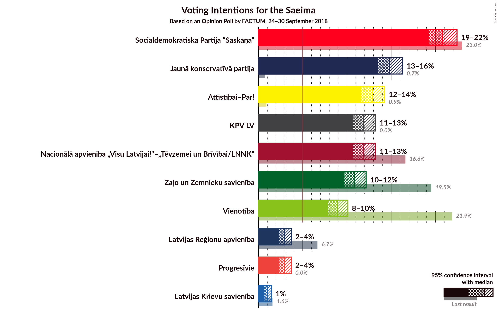

### Confidence Intervals

| Party | Last Result | Poll Result | 80% Confidence Interval | 90% Confidence Interval | 95% Confidence Interval | 99% Confidence Interval |
|:-----:|:-----------:|:-----------:|:-----------------------:|:-----------------------:|:-----------------------:|:-----------------------:|
| Sociāldemokrātiskā Partija “Saskaņa” | 23.0% | 20.8% | 19.8–21.9% |19.5–22.2% |19.2–22.4% |18.8–23.0% |
| Jaunā konservatīvā partija | 0.7% | 14.8% | 14.0–15.8% |13.7–16.1% |13.5–16.3% |13.1–16.8% |
| Attīstībai–Par! | 0.9% | 12.9% | 12.1–13.8% |11.8–14.0% |11.6–14.3% |11.2–14.7% |
| Nacionālā apvienība „Visu Latvijai!”–„Tēvzemei un Brīvībai/LNNK” | 16.6% | 11.9% | 11.1–12.8% |10.9–13.0% |10.7–13.2% |10.3–13.6% |
| KPV LV | 0.0% | 11.9% | 11.1–12.8% |10.9–13.0% |10.7–13.2% |10.3–13.6% |
| Zaļo un Zemnieku savienība | 19.5% | 10.9% | 10.1–11.7% |9.9–12.0% |9.7–12.2% |9.4–12.6% |
| Vienotība | 21.9% | 8.9% | 8.2–9.7% |8.0–9.9% |7.9–10.1% |7.5–10.5% |
| Latvijas Reģionu apvienība | 6.7% | 3.0% | 2.6–3.4% |2.5–3.6% |2.4–3.7% |2.2–3.9% |
| Progresīvie | 0.0% | 3.0% | 2.6–3.4% |2.5–3.6% |2.4–3.7% |2.2–3.9% |
| Latvijas Krievu savienība | 1.6% | 1.0% | 0.8–1.3% |0.7–1.4% |0.7–1.5% |0.6–1.6% |

*Note:* The poll result column reflects the actual value used in the calculations. Published results may vary slightly, and in addition be rounded to fewer digits.

## Seats

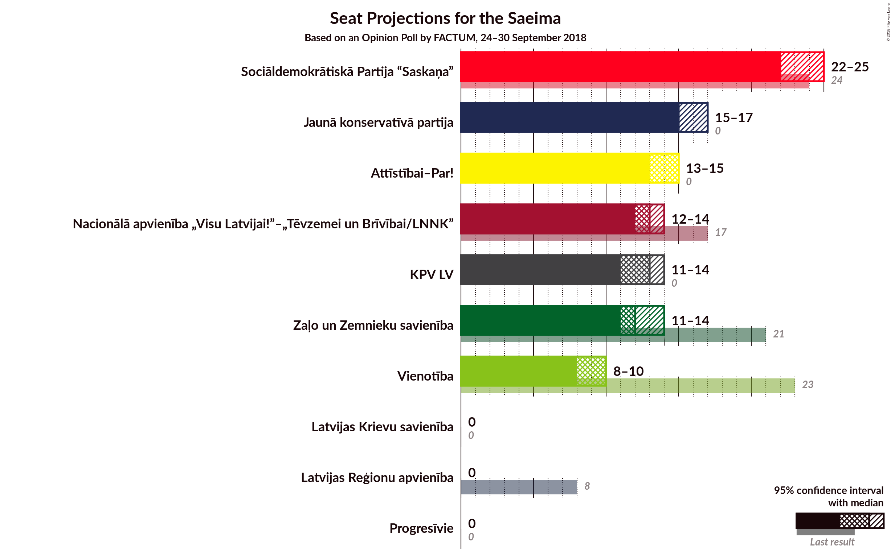

### Confidence Intervals

| Party | Last Result | Median | 80% Confidence Interval | 90% Confidence Interval | 95% Confidence Interval | 99% Confidence Interval |
|:-----:|:-----------:|:------:|:-----------------------:|:-----------------------:|:-----------------------:|:-----------------------:|
| <a href="#sociāldemokrātiskā-partija-“saskaņa”">Sociāldemokrātiskā Partija “Saskaņa”</a> | 24 | 22 | 22–23 |22–24 |22–25 |20–26 |
| <a href="#jaunā-konservatīvā-partija">Jaunā konservatīvā partija</a> | 0 | 15 | 15–16 |15–17 |15–17 |14–19 |
| <a href="#attīstībai–par!">Attīstībai–Par!</a> | 0 | 15 | 13–15 |13–15 |13–15 |12–17 |
| <a href="#nacionālā-apvienība-„visu-latvijai!”–„tēvzemei-un-brīvībai/lnnk”">Nacionālā apvienība „Visu Latvijai!”–„Tēvzemei un Brīvībai/LNNK”</a> | 17 | 13 | 12–14 |12–14 |12–14 |12–15 |
| <a href="#kpv-lv">KPV LV</a> | 0 | 13 | 12–14 |12–14 |11–14 |10–15 |
| <a href="#zaļo-un-zemnieku-savienība">Zaļo un Zemnieku savienība</a> | 21 | 12 | 11–14 |11–14 |11–14 |11–15 |
| <a href="#vienotība">Vienotība</a> | 23 | 10 | 9–10 |8–10 |8–10 |8–11 |
| <a href="#latvijas-reģionu-apvienība">Latvijas Reģionu apvienība</a> | 8 | 0 | 0 |0 |0 |0 |
| <a href="#progresīvie">Progresīvie</a> | 0 | 0 | 0 |0 |0 |0 |
| <a href="#latvijas-krievu-savienība">Latvijas Krievu savienība</a> | 0 | 0 | 0 |0 |0 |0 |

### Sociāldemokrātiskā Partija “Saskaņa”

*For a full overview of the results for this party, see the [Sociāldemokrātiskā Partija “Saskaņa”](party-sociāldemokrātiskāpartija“saskaņa”.html) page.*

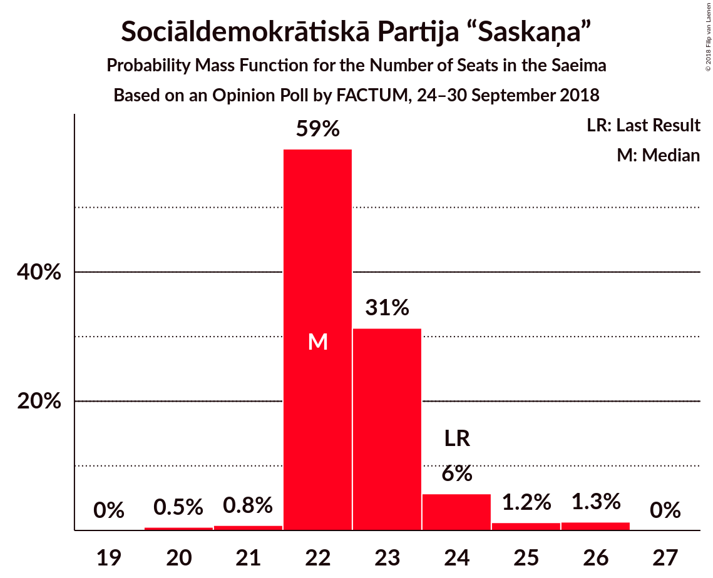

| Number of Seats | Probability | Accumulated | Special Marks |
|:---------------:|:-----------:|:-----------:|:-------------:|
| 20 | 0.5% | 100% |  |
| 21 | 0.8% | 99.4% |  |
| 22 | 59% | 98.6% | Median |
| 23 | 31% | 40% |  |
| 24 | 6% | 8% | Last Result |
| 25 | 1.2% | 3% |  |
| 26 | 1.3% | 1.3% |  |
| 27 | 0% | 0% |  |

### Jaunā konservatīvā partija

*For a full overview of the results for this party, see the [Jaunā konservatīvā partija](party-jaunākonservatīvāpartija.html) page.*

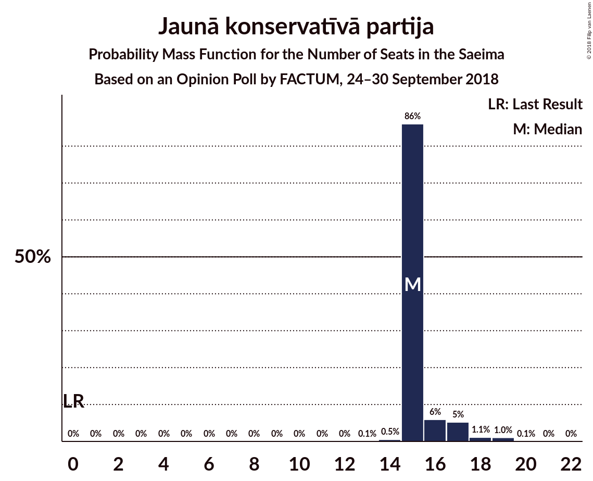

| Number of Seats | Probability | Accumulated | Special Marks |
|:---------------:|:-----------:|:-----------:|:-------------:|
| 0 | 0% | 100% | Last Result |
| 1 | 0% | 100% |  |
| 2 | 0% | 100% |  |
| 3 | 0% | 100% |  |
| 4 | 0% | 100% |  |
| 5 | 0% | 100% |  |
| 6 | 0% | 100% |  |
| 7 | 0% | 100% |  |
| 8 | 0% | 100% |  |
| 9 | 0% | 100% |  |
| 10 | 0% | 100% |  |
| 11 | 0% | 100% |  |
| 12 | 0% | 100% |  |
| 13 | 0.1% | 100% |  |
| 14 | 0.5% | 99.9% |  |
| 15 | 86% | 99.4% | Median |
| 16 | 6% | 13% |  |
| 17 | 5% | 7% |  |
| 18 | 1.1% | 2% |  |
| 19 | 1.0% | 1.1% |  |
| 20 | 0.1% | 0.1% |  |
| 21 | 0% | 0% |  |

### Attīstībai–Par!

*For a full overview of the results for this party, see the [Attīstībai–Par!](party-attīstībai–par.html) page.*

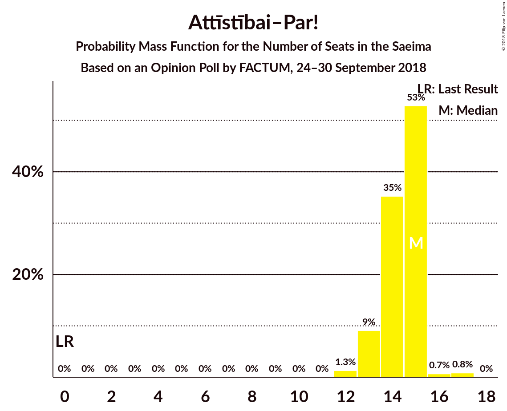

| Number of Seats | Probability | Accumulated | Special Marks |
|:---------------:|:-----------:|:-----------:|:-------------:|
| 0 | 0% | 100% | Last Result |
| 1 | 0% | 100% |  |
| 2 | 0% | 100% |  |
| 3 | 0% | 100% |  |
| 4 | 0% | 100% |  |
| 5 | 0% | 100% |  |
| 6 | 0% | 100% |  |
| 7 | 0% | 100% |  |
| 8 | 0% | 100% |  |
| 9 | 0% | 100% |  |
| 10 | 0% | 100% |  |
| 11 | 0% | 100% |  |
| 12 | 1.3% | 100% |  |
| 13 | 9% | 98.7% |  |
| 14 | 35% | 90% |  |
| 15 | 53% | 54% | Median |
| 16 | 0.7% | 2% |  |
| 17 | 0.8% | 0.8% |  |
| 18 | 0% | 0% |  |

### Nacionālā apvienība „Visu Latvijai!”–„Tēvzemei un Brīvībai/LNNK”

*For a full overview of the results for this party, see the [Nacionālā apvienība „Visu Latvijai!”–„Tēvzemei un Brīvībai/LNNK”](party-nacionālāapvienība„visulatvijai”–„tēvzemeiunbrīvībailnnk”.html) page.*

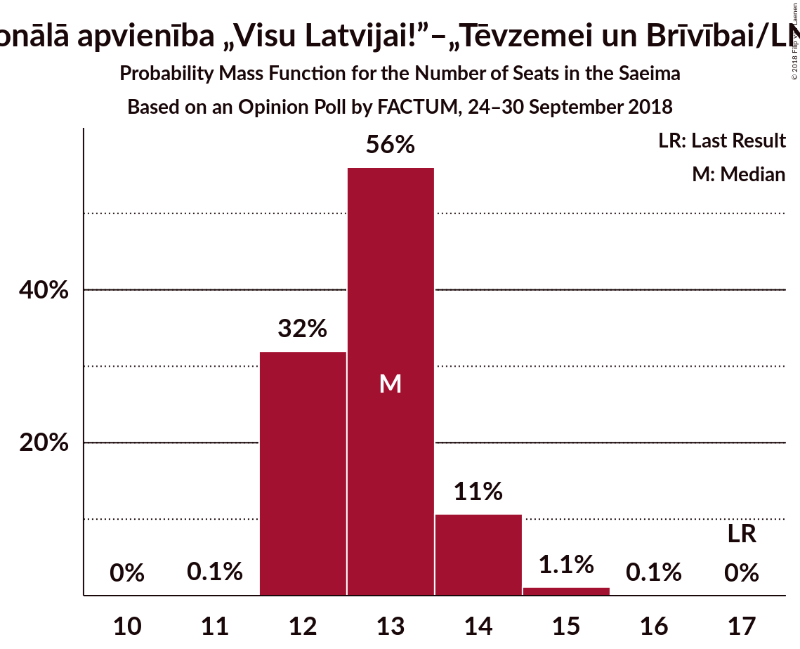

| Number of Seats | Probability | Accumulated | Special Marks |
|:---------------:|:-----------:|:-----------:|:-------------:|
| 11 | 0.1% | 100% |  |
| 12 | 32% | 99.9% |  |
| 13 | 56% | 68% | Median |
| 14 | 11% | 12% |  |
| 15 | 1.1% | 1.2% |  |
| 16 | 0.1% | 0.1% |  |
| 17 | 0% | 0% | Last Result |

### KPV LV

*For a full overview of the results for this party, see the [KPV LV](party-kpvlv.html) page.*

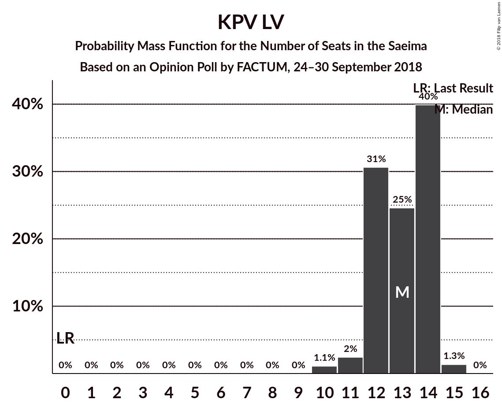

| Number of Seats | Probability | Accumulated | Special Marks |
|:---------------:|:-----------:|:-----------:|:-------------:|
| 0 | 0% | 100% | Last Result |
| 1 | 0% | 100% |  |
| 2 | 0% | 100% |  |
| 3 | 0% | 100% |  |
| 4 | 0% | 100% |  |
| 5 | 0% | 100% |  |
| 6 | 0% | 100% |  |
| 7 | 0% | 100% |  |
| 8 | 0% | 100% |  |
| 9 | 0% | 100% |  |
| 10 | 1.1% | 100% |  |
| 11 | 2% | 98.9% |  |
| 12 | 31% | 96% |  |
| 13 | 25% | 66% | Median |
| 14 | 40% | 41% |  |
| 15 | 1.3% | 1.3% |  |
| 16 | 0% | 0% |  |

### Zaļo un Zemnieku savienība

*For a full overview of the results for this party, see the [Zaļo un Zemnieku savienība](party-zaļounzemniekusavienība.html) page.*

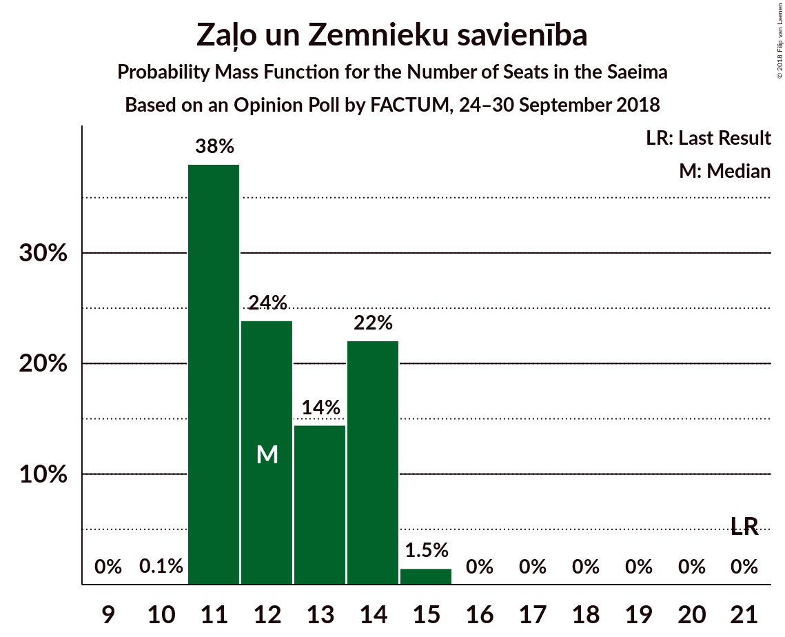

| Number of Seats | Probability | Accumulated | Special Marks |
|:---------------:|:-----------:|:-----------:|:-------------:|
| 10 | 0.1% | 100% |  |
| 11 | 38% | 99.9% |  |
| 12 | 24% | 62% | Median |
| 13 | 14% | 38% |  |
| 14 | 22% | 24% |  |
| 15 | 1.5% | 1.5% |  |
| 16 | 0% | 0% |  |
| 17 | 0% | 0% |  |
| 18 | 0% | 0% |  |
| 19 | 0% | 0% |  |
| 20 | 0% | 0% |  |
| 21 | 0% | 0% | Last Result |

### Vienotība

*For a full overview of the results for this party, see the [Vienotība](party-vienotība.html) page.*

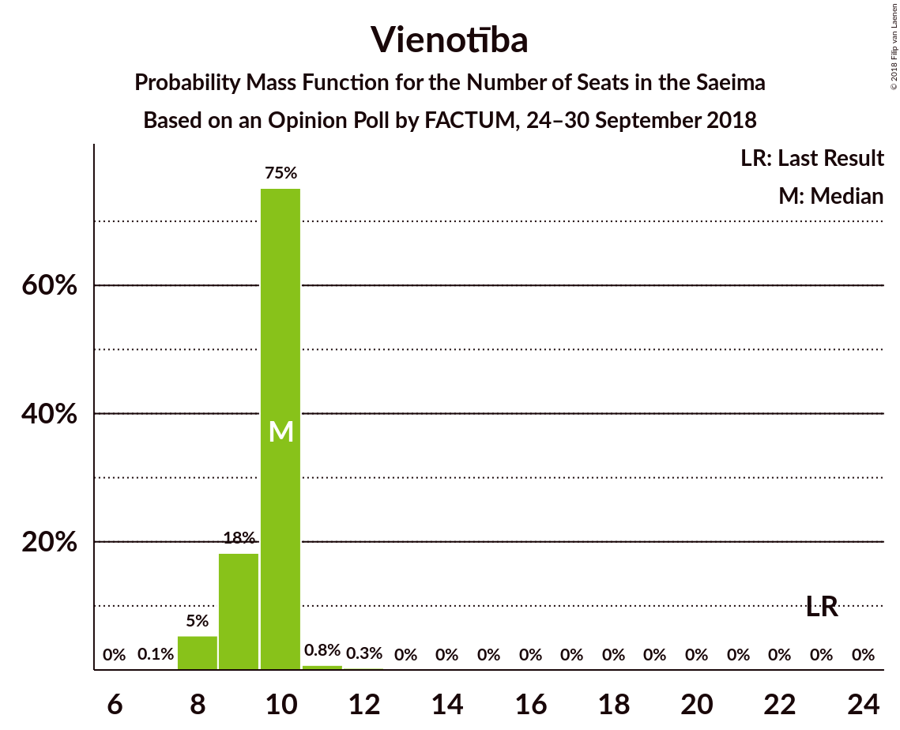

| Number of Seats | Probability | Accumulated | Special Marks |
|:---------------:|:-----------:|:-----------:|:-------------:|
| 7 | 0.1% | 100% |  |
| 8 | 5% | 99.9% |  |
| 9 | 18% | 95% |  |
| 10 | 75% | 76% | Median |
| 11 | 0.8% | 1.1% |  |
| 12 | 0.3% | 0.3% |  |
| 13 | 0% | 0% |  |
| 14 | 0% | 0% |  |
| 15 | 0% | 0% |  |
| 16 | 0% | 0% |  |
| 17 | 0% | 0% |  |
| 18 | 0% | 0% |  |
| 19 | 0% | 0% |  |
| 20 | 0% | 0% |  |
| 21 | 0% | 0% |  |
| 22 | 0% | 0% |  |
| 23 | 0% | 0% | Last Result |

### Latvijas Reģionu apvienība

*For a full overview of the results for this party, see the [Latvijas Reģionu apvienība](party-latvijasreģionuapvienība.html) page.*

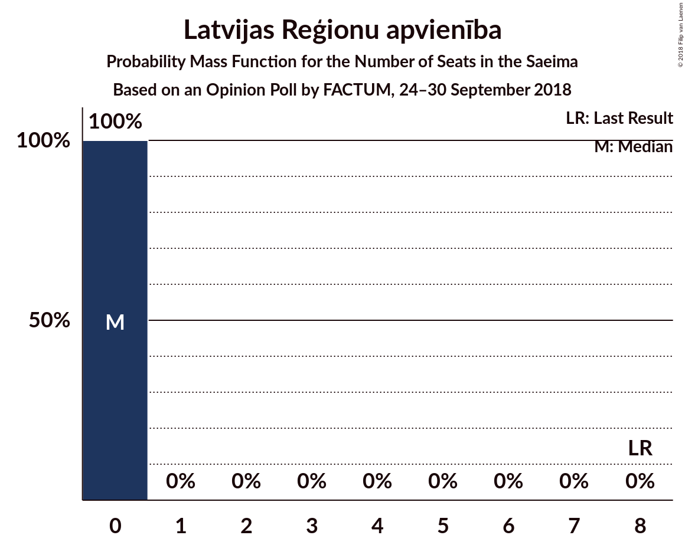

| Number of Seats | Probability | Accumulated | Special Marks |
|:---------------:|:-----------:|:-----------:|:-------------:|
| 0 | 100% | 100% | Median |
| 1 | 0% | 0% |  |
| 2 | 0% | 0% |  |
| 3 | 0% | 0% |  |
| 4 | 0% | 0% |  |
| 5 | 0% | 0% |  |
| 6 | 0% | 0% |  |
| 7 | 0% | 0% |  |
| 8 | 0% | 0% | Last Result |

### Progresīvie

*For a full overview of the results for this party, see the [Progresīvie](party-progresīvie.html) page.*

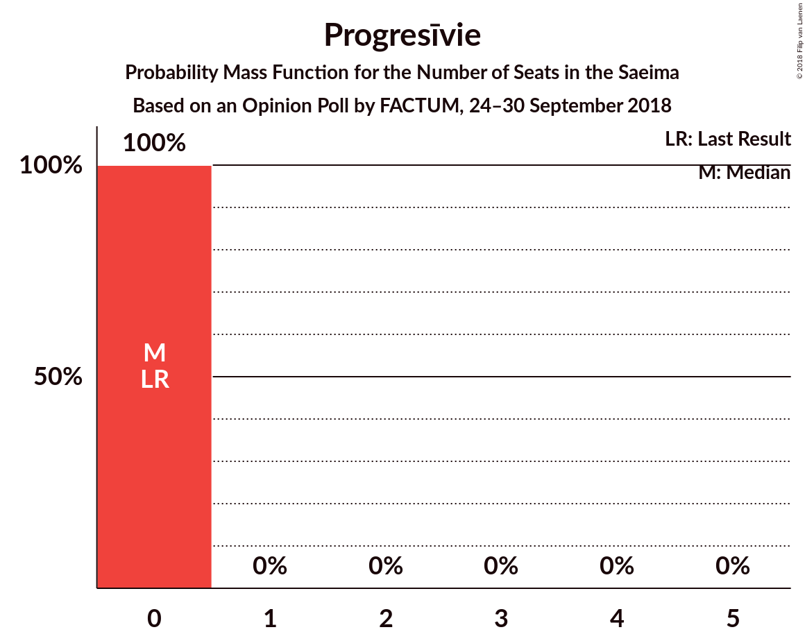

| Number of Seats | Probability | Accumulated | Special Marks |
|:---------------:|:-----------:|:-----------:|:-------------:|
| 0 | 100% | 100% | Last Result, Median |

### Latvijas Krievu savienība

*For a full overview of the results for this party, see the [Latvijas Krievu savienība](party-latvijaskrievusavienība.html) page.*

| Number of Seats | Probability | Accumulated | Special Marks |
|:---------------:|:-----------:|:-----------:|:-------------:|
| 0 | 100% | 100% | Last Result, Median |

## Coalitions

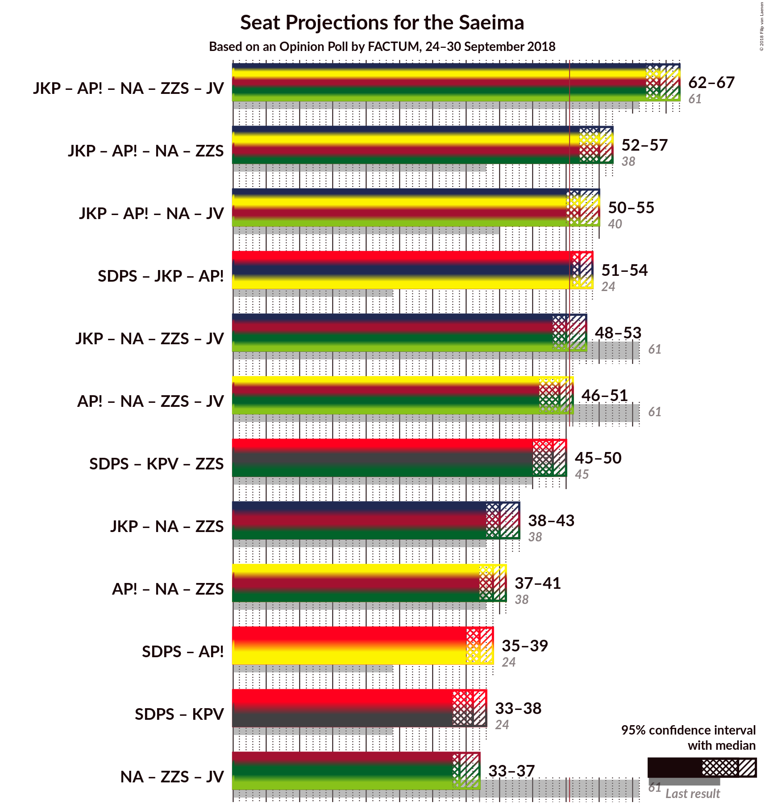

### Confidence Intervals

| Coalition | Last Result | Median | Majority? | 80% Confidence Interval | 90% Confidence Interval | 95% Confidence Interval | 99% Confidence Interval |
|:---------:|:-----------:|:------:|:---------:|:-----------------------:|:-----------------------:|:-----------------------:|:-----------------------:|
| Jaunā konservatīvā partija – Attīstībai–Par! – Nacionālā apvienība „Visu Latvijai!”–„Tēvzemei un Brīvībai/LNNK” – Zaļo un Zemnieku savienība – Vienotība | 61 | 64 | 100% | 63–66 | 63–66 | 62–67 | 61–68 |
| Jaunā konservatīvā partija – Attīstībai–Par! – Nacionālā apvienība „Visu Latvijai!”–„Tēvzemei un Brīvībai/LNNK” – Zaļo un Zemnieku savienība | 38 | 55 | 100% | 54–56 | 53–57 | 52–57 | 52–58 |
| Jaunā konservatīvā partija – Attīstībai–Par! – Nacionālā apvienība „Visu Latvijai!”–„Tēvzemei un Brīvībai/LNNK” – Vienotība | 40 | 52 | 89% | 50–53 | 50–54 | 50–55 | 49–55 |
| Sociāldemokrātiskā Partija “Saskaņa” – Jaunā konservatīvā partija – Attīstībai–Par! | 24 | 52 | 98.6% | 51–53 | 51–54 | 51–54 | 50–55 |
| Jaunā konservatīvā partija – Nacionālā apvienība „Visu Latvijai!”–„Tēvzemei un Brīvībai/LNNK” – Zaļo un Zemnieku savienība – Vienotība | 61 | 50 | 33% | 49–52 | 48–52 | 48–53 | 47–54 |
| Attīstībai–Par! – Nacionālā apvienība „Visu Latvijai!”–„Tēvzemei un Brīvībai/LNNK” – Zaļo un Zemnieku savienība – Vienotība | 61 | 49 | 15% | 48–51 | 47–51 | 46–51 | 46–53 |
| Sociāldemokrātiskā Partija “Saskaņa” – KPV LV – Zaļo un Zemnieku savienība | 45 | 48 | 2% | 47–50 | 46–50 | 45–50 | 45–51 |
| Jaunā konservatīvā partija – Nacionālā apvienība „Visu Latvijai!”–„Tēvzemei un Brīvībai/LNNK” – Zaļo un Zemnieku savienība | 38 | 40 | 0% | 39–42 | 39–42 | 38–43 | 38–44 |
| Attīstībai–Par! – Nacionālā apvienība „Visu Latvijai!”–„Tēvzemei un Brīvībai/LNNK” – Zaļo un Zemnieku savienība | 38 | 39 | 0% | 38–41 | 37–41 | 37–41 | 36–43 |
| Sociāldemokrātiskā Partija “Saskaņa” – Attīstībai–Par! | 24 | 37 | 0% | 36–38 | 36–38 | 35–39 | 34–39 |
| Sociāldemokrātiskā Partija “Saskaņa” – KPV LV | 24 | 36 | 0% | 34–37 | 34–37 | 33–38 | 32–39 |
| Nacionālā apvienība „Visu Latvijai!”–„Tēvzemei un Brīvībai/LNNK” – Zaļo un Zemnieku savienība – Vienotība | 61 | 34 | 0% | 33–37 | 33–37 | 33–37 | 32–38 |

### Jaunā konservatīvā partija – Attīstībai–Par! – Nacionālā apvienība „Visu Latvijai!”–„Tēvzemei un Brīvībai/LNNK” – Zaļo un Zemnieku savienība – Vienotība

| Number of Seats | Probability | Accumulated | Special Marks |
|:---------------:|:-----------:|:-----------:|:-------------:|
| 61 | 2% | 100% | Last Result |
| 62 | 2% | 98% |  |
| 63 | 7% | 96% |  |
| 64 | 51% | 89% |  |
| 65 | 18% | 39% | Median |
| 66 | 17% | 20% |  |
| 67 | 2% | 3% |  |
| 68 | 0.9% | 1.0% |  |
| 69 | 0.1% | 0.1% |  |
| 70 | 0% | 0% |  |

### Jaunā konservatīvā partija – Attīstībai–Par! – Nacionālā apvienība „Visu Latvijai!”–„Tēvzemei un Brīvībai/LNNK” – Zaļo un Zemnieku savienība

| Number of Seats | Probability | Accumulated | Special Marks |
|:---------------:|:-----------:|:-----------:|:-------------:|
| 38 | 0% | 100% | Last Result |
| 39 | 0% | 100% |  |
| 40 | 0% | 100% |  |
| 41 | 0% | 100% |  |
| 42 | 0% | 100% |  |
| 43 | 0% | 100% |  |
| 44 | 0% | 100% |  |
| 45 | 0% | 100% |  |
| 46 | 0% | 100% |  |
| 47 | 0% | 100% |  |
| 48 | 0% | 100% |  |
| 49 | 0% | 100% |  |
| 50 | 0% | 100% |  |
| 51 | 0.2% | 100% | Majority |
| 52 | 3% | 99.8% |  |
| 53 | 6% | 97% |  |
| 54 | 41% | 91% |  |
| 55 | 21% | 50% | Median |
| 56 | 24% | 29% |  |
| 57 | 3% | 5% |  |
| 58 | 1.4% | 2% |  |
| 59 | 0.3% | 0.4% |  |
| 60 | 0% | 0% |  |

### Jaunā konservatīvā partija – Attīstībai–Par! – Nacionālā apvienība „Visu Latvijai!”–„Tēvzemei un Brīvībai/LNNK” – Vienotība

| Number of Seats | Probability | Accumulated | Special Marks |
|:---------------:|:-----------:|:-----------:|:-------------:|
| 40 | 0% | 100% | Last Result |
| 41 | 0% | 100% |  |
| 42 | 0% | 100% |  |
| 43 | 0% | 100% |  |
| 44 | 0% | 100% |  |
| 45 | 0% | 100% |  |
| 46 | 0% | 100% |  |
| 47 | 0% | 100% |  |
| 48 | 0.3% | 100% |  |
| 49 | 2% | 99.7% |  |
| 50 | 9% | 98% |  |
| 51 | 12% | 89% | Majority |
| 52 | 27% | 77% |  |
| 53 | 43% | 50% | Median |
| 54 | 4% | 6% |  |
| 55 | 2% | 3% |  |
| 56 | 0.3% | 0.3% |  |
| 57 | 0% | 0% |  |

### Sociāldemokrātiskā Partija “Saskaņa” – Jaunā konservatīvā partija – Attīstībai–Par!

| Number of Seats | Probability | Accumulated | Special Marks |
|:---------------:|:-----------:|:-----------:|:-------------:|
| 24 | 0% | 100% | Last Result |
| 25 | 0% | 100% |  |
| 26 | 0% | 100% |  |
| 27 | 0% | 100% |  |
| 28 | 0% | 100% |  |
| 29 | 0% | 100% |  |
| 30 | 0% | 100% |  |
| 31 | 0% | 100% |  |
| 32 | 0% | 100% |  |
| 33 | 0% | 100% |  |
| 34 | 0% | 100% |  |
| 35 | 0% | 100% |  |
| 36 | 0% | 100% |  |
| 37 | 0% | 100% |  |
| 38 | 0% | 100% |  |
| 39 | 0% | 100% |  |
| 40 | 0% | 100% |  |
| 41 | 0% | 100% |  |
| 42 | 0% | 100% |  |
| 43 | 0% | 100% |  |
| 44 | 0% | 100% |  |
| 45 | 0% | 100% |  |
| 46 | 0% | 100% |  |
| 47 | 0% | 100% |  |
| 48 | 0% | 100% |  |
| 49 | 0.2% | 100% |  |
| 50 | 1.1% | 99.7% |  |
| 51 | 28% | 98.6% | Majority |
| 52 | 31% | 70% | Median |
| 53 | 30% | 39% |  |
| 54 | 8% | 9% |  |
| 55 | 1.0% | 1.0% |  |
| 56 | 0.1% | 0.1% |  |
| 57 | 0% | 0% |  |

### Jaunā konservatīvā partija – Nacionālā apvienība „Visu Latvijai!”–„Tēvzemei un Brīvībai/LNNK” – Zaļo un Zemnieku savienība – Vienotība

| Number of Seats | Probability | Accumulated | Special Marks |
|:---------------:|:-----------:|:-----------:|:-------------:|
| 47 | 0.7% | 100% |  |
| 48 | 6% | 99.2% |  |
| 49 | 39% | 93% |  |
| 50 | 21% | 55% | Median |
| 51 | 17% | 33% | Majority |
| 52 | 13% | 16% |  |
| 53 | 3% | 4% |  |
| 54 | 0.7% | 0.8% |  |
| 55 | 0.1% | 0.1% |  |
| 56 | 0% | 0% |  |
| 57 | 0% | 0% |  |
| 58 | 0% | 0% |  |
| 59 | 0% | 0% |  |
| 60 | 0% | 0% |  |
| 61 | 0% | 0% | Last Result |

### Attīstībai–Par! – Nacionālā apvienība „Visu Latvijai!”–„Tēvzemei un Brīvībai/LNNK” – Zaļo un Zemnieku savienība – Vienotība

| Number of Seats | Probability | Accumulated | Special Marks |
|:---------------:|:-----------:|:-----------:|:-------------:|
| 45 | 0.3% | 100% |  |
| 46 | 2% | 99.7% |  |
| 47 | 4% | 97% |  |
| 48 | 10% | 94% |  |
| 49 | 53% | 84% |  |
| 50 | 16% | 31% | Median |
| 51 | 13% | 15% | Majority |
| 52 | 1.1% | 2% |  |
| 53 | 0.7% | 0.7% |  |
| 54 | 0% | 0% |  |
| 55 | 0% | 0% |  |
| 56 | 0% | 0% |  |
| 57 | 0% | 0% |  |
| 58 | 0% | 0% |  |
| 59 | 0% | 0% |  |
| 60 | 0% | 0% |  |
| 61 | 0% | 0% | Last Result |

### Sociāldemokrātiskā Partija “Saskaņa” – KPV LV – Zaļo un Zemnieku savienība

| Number of Seats | Probability | Accumulated | Special Marks |
|:---------------:|:-----------:|:-----------:|:-------------:|
| 44 | 0.3% | 100% |  |
| 45 | 2% | 99.7% | Last Result |
| 46 | 4% | 97% |  |
| 47 | 43% | 94% | Median |
| 48 | 27% | 50% |  |
| 49 | 12% | 23% |  |
| 50 | 9% | 11% |  |
| 51 | 2% | 2% | Majority |
| 52 | 0.3% | 0.3% |  |
| 53 | 0% | 0% |  |

### Jaunā konservatīvā partija – Nacionālā apvienība „Visu Latvijai!”–„Tēvzemei un Brīvībai/LNNK” – Zaļo un Zemnieku savienība

| Number of Seats | Probability | Accumulated | Special Marks |
|:---------------:|:-----------:|:-----------:|:-------------:|
| 38 | 5% | 100% | Last Result |
| 39 | 38% | 95% |  |
| 40 | 14% | 57% | Median |
| 41 | 18% | 44% |  |
| 42 | 21% | 26% |  |
| 43 | 4% | 5% |  |
| 44 | 0.9% | 1.3% |  |
| 45 | 0.3% | 0.4% |  |
| 46 | 0.1% | 0.1% |  |
| 47 | 0% | 0% |  |

### Attīstībai–Par! – Nacionālā apvienība „Visu Latvijai!”–„Tēvzemei un Brīvībai/LNNK” – Zaļo un Zemnieku savienība

| Number of Seats | Probability | Accumulated | Special Marks |
|:---------------:|:-----------:|:-----------:|:-------------:|
| 36 | 0.6% | 100% |  |
| 37 | 5% | 99.4% |  |
| 38 | 6% | 95% | Last Result |
| 39 | 46% | 88% |  |
| 40 | 19% | 42% | Median |
| 41 | 21% | 23% |  |
| 42 | 1.4% | 2% |  |
| 43 | 0.7% | 0.8% |  |
| 44 | 0.1% | 0.1% |  |
| 45 | 0% | 0% |  |

### Sociāldemokrātiskā Partija “Saskaņa” – Attīstībai–Par!

| Number of Seats | Probability | Accumulated | Special Marks |
|:---------------:|:-----------:|:-----------:|:-------------:|
| 24 | 0% | 100% | Last Result |
| 25 | 0% | 100% |  |
| 26 | 0% | 100% |  |
| 27 | 0% | 100% |  |
| 28 | 0% | 100% |  |
| 29 | 0% | 100% |  |
| 30 | 0% | 100% |  |
| 31 | 0% | 100% |  |
| 32 | 0% | 100% |  |
| 33 | 0.1% | 100% |  |
| 34 | 0.6% | 99.9% |  |
| 35 | 2% | 99.3% |  |
| 36 | 31% | 97% |  |
| 37 | 37% | 66% | Median |
| 38 | 27% | 29% |  |
| 39 | 2% | 3% |  |
| 40 | 0.3% | 0.4% |  |
| 41 | 0% | 0% |  |

### Sociāldemokrātiskā Partija “Saskaņa” – KPV LV

| Number of Seats | Probability | Accumulated | Special Marks |
|:---------------:|:-----------:|:-----------:|:-------------:|
| 24 | 0% | 100% | Last Result |
| 25 | 0% | 100% |  |
| 26 | 0% | 100% |  |
| 27 | 0% | 100% |  |
| 28 | 0% | 100% |  |
| 29 | 0% | 100% |  |
| 30 | 0% | 100% |  |
| 31 | 0.1% | 100% |  |
| 32 | 0.9% | 99.9% |  |
| 33 | 2% | 99.0% |  |
| 34 | 17% | 97% |  |
| 35 | 18% | 80% | Median |
| 36 | 51% | 61% |  |
| 37 | 7% | 11% |  |
| 38 | 2% | 4% |  |
| 39 | 2% | 2% |  |
| 40 | 0% | 0% |  |

### Nacionālā apvienība „Visu Latvijai!”–„Tēvzemei un Brīvībai/LNNK” – Zaļo un Zemnieku savienība – Vienotība

| Number of Seats | Probability | Accumulated | Special Marks |
|:---------------:|:-----------:|:-----------:|:-------------:|
| 31 | 0.1% | 100% |  |
| 32 | 2% | 99.9% |  |
| 33 | 9% | 98% |  |
| 34 | 41% | 90% |  |
| 35 | 23% | 49% | Median |
| 36 | 14% | 26% |  |
| 37 | 11% | 13% |  |
| 38 | 1.5% | 2% |  |
| 39 | 0.4% | 0.4% |  |
| 40 | 0% | 0% |  |
| 41 | 0% | 0% |  |
| 42 | 0% | 0% |  |
| 43 | 0% | 0% |  |
| 44 | 0% | 0% |  |
| 45 | 0% | 0% |  |
| 46 | 0% | 0% |  |
| 47 | 0% | 0% |  |
| 48 | 0% | 0% |  |
| 49 | 0% | 0% |  |
| 50 | 0% | 0% |  |
| 51 | 0% | 0% | Majority |
| 52 | 0% | 0% |  |
| 53 | 0% | 0% |  |
| 54 | 0% | 0% |  |
| 55 | 0% | 0% |  |
| 56 | 0% | 0% |  |
| 57 | 0% | 0% |  |
| 58 | 0% | 0% |  |
| 59 | 0% | 0% |  |
| 60 | 0% | 0% |  |
| 61 | 0% | 0% | Last Result |

## Technical Information

### Opinion Poll

+ **Polling firm:** FACTUM
+ **Commissioner(s):** —
+ **Fieldwork period:** 24–30 September 2018

### Calculations

+ **Sample size:** 2500
+ **Simulations done:** 1,048,576
+ **Error estimate:** 0.95%

