# Opinion Poll by SKDS for Latvijas Televīzija, 1–31 May 2018

<a href="#voting-intentions">Voting Intentions</a> | <a href="#seats">Seats</a> | <a href="#coalitions">Coalitions</a> | <a href="#technical-information">Technical Information</a>

## Voting Intentions

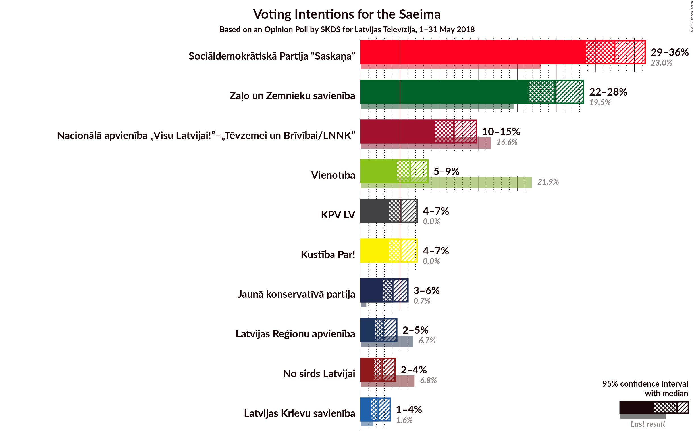

### Confidence Intervals

| Party | Last Result | Poll Result | 80% Confidence Interval | 90% Confidence Interval | 95% Confidence Interval | 99% Confidence Interval |
|:-----:|:-----------:|:-----------:|:-----------------------:|:-----------------------:|:-----------------------:|:-----------------------:|
| Sociāldemokrātiskā Partija “Saskaņa” | 23.0% | 32.7% | 30.1–35.0% |29.4–35.8% |28.8–36.4% |27.7–37.6% |
| Zaļo un Zemnieku savienība | 19.5% | 25.0% | 22.6–27.2% |22.0–27.9% |21.5–28.5% |20.5–29.7% |
| Nacionālā apvienība „Visu Latvijai!”–„Tēvzemei un Brīvībai/LNNK” | 16.6% | 11.9% | 10.3–13.8% |9.9–14.3% |9.5–14.8% |8.8–15.7% |
| Vienotība | 21.9% | 6.3% | 5.2–7.8% |4.9–8.2% |4.6–8.6% |4.1–9.3% |
| KPV LV | 0.0% | 5.1% | 4.1–6.5% |3.8–6.9% |3.6–7.2% |3.2–7.9% |
| Kustība Par! | 0.0% | 5.1% | 4.1–6.5% |3.8–6.9% |3.6–7.2% |3.2–7.9% |
| Jaunā konservatīvā partija | 0.7% | 4.1% | 3.2–5.3% |3.0–5.7% |2.8–6.0% |2.4–6.7% |
| Latvijas Reģionu apvienība | 6.7% | 2.9% | 2.2–4.0% |2.0–4.3% |1.8–4.6% |1.5–5.2% |
| No sirds Latvijai | 6.8% | 2.7% | 2.0–3.8% |1.8–4.1% |1.7–4.4% |1.4–5.0% |
| Latvijas Krievu savienība | 1.6% | 2.2% | 1.6–3.2% |1.4–3.5% |1.3–3.7% |1.1–4.3% |
| Progresīvie | 0.0% | 1.0% | N/A |N/A |N/A |N/A |

*Note:* The poll result column reflects the actual value used in the calculations. Published results may vary slightly, and in addition be rounded to fewer digits.

## Seats

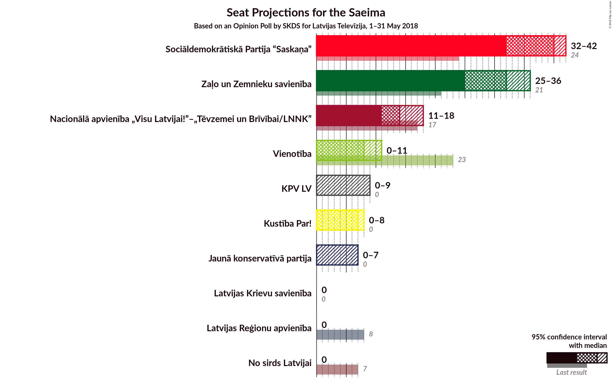

### Confidence Intervals

| Party | Last Result | Median | 80% Confidence Interval | 90% Confidence Interval | 95% Confidence Interval | 99% Confidence Interval |
|:-----:|:-----------:|:------:|:-----------------------:|:-----------------------:|:-----------------------:|:-----------------------:|
| <a href="#sociāldemokrātiskā-partija-“saskaņa”">Sociāldemokrātiskā Partija “Saskaņa”</a> | 24 | 40 | 35–42 |33–42 |32–42 |31–45 |
| <a href="#zaļo-un-zemnieku-savienība">Zaļo un Zemnieku savienība</a> | 21 | 32 | 28–34 |26–34 |25–36 |24–37 |
| <a href="#nacionālā-apvienība-„visu-latvijai!”–„tēvzemei-un-brīvībai/lnnk”">Nacionālā apvienība „Visu Latvijai!”–„Tēvzemei un Brīvībai/LNNK”</a> | 17 | 14 | 12–17 |11–17 |11–18 |10–20 |
| <a href="#vienotība">Vienotība</a> | 23 | 8 | 7–10 |7–10 |0–11 |0–11 |
| <a href="#kpv-lv">KPV LV</a> | 0 | 0 | 0–8 |0–9 |0–9 |0–9 |
| <a href="#kustība-par!">Kustība Par!</a> | 0 | 7 | 0–7 |0–8 |0–8 |0–10 |
| <a href="#jaunā-konservatīvā-partija">Jaunā konservatīvā partija</a> | 0 | 0 | 0–7 |0–7 |0–7 |0–8 |
| <a href="#latvijas-reģionu-apvienība">Latvijas Reģionu apvienība</a> | 8 | 0 | 0 |0 |0 |0 |
| <a href="#no-sirds-latvijai">No sirds Latvijai</a> | 7 | 0 | 0 |0 |0 |0 |
| <a href="#latvijas-krievu-savienība">Latvijas Krievu savienība</a> | 0 | 0 | 0 |0 |0 |0 |
| <a href="#progresīvie">Progresīvie</a> | 0 | N/A | N/A |N/A |N/A |N/A |

### Sociāldemokrātiskā Partija “Saskaņa”

*For a full overview of the results for this party, see the [Sociāldemokrātiskā Partija “Saskaņa”](party-sociāldemokrātiskāpartija“saskaņa”.html) page.*

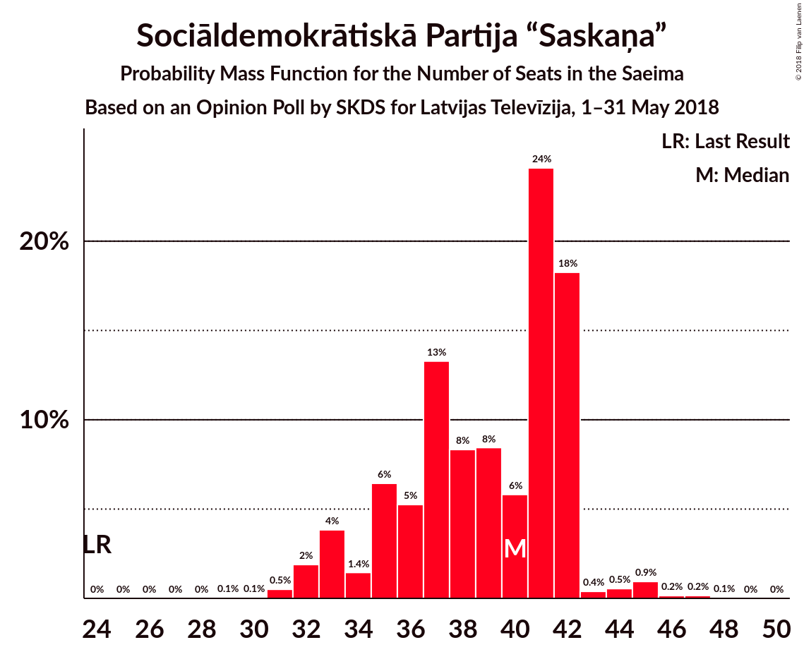

| Number of Seats | Probability | Accumulated | Special Marks |
|:---------------:|:-----------:|:-----------:|:-------------:|
| 24 | 0% | 100% | Last Result |
| 25 | 0% | 100% |  |
| 26 | 0% | 100% |  |
| 27 | 0% | 100% |  |
| 28 | 0% | 100% |  |
| 29 | 0.1% | 100% |  |
| 30 | 0.1% | 99.9% |  |
| 31 | 0.5% | 99.9% |  |
| 32 | 2% | 99.4% |  |
| 33 | 4% | 97% |  |
| 34 | 1.4% | 94% |  |
| 35 | 6% | 92% |  |
| 36 | 5% | 86% |  |
| 37 | 13% | 81% |  |
| 38 | 8% | 67% |  |
| 39 | 8% | 59% |  |
| 40 | 6% | 50% | Median |
| 41 | 24% | 45% |  |
| 42 | 18% | 21% |  |
| 43 | 0.4% | 2% |  |
| 44 | 0.5% | 2% |  |
| 45 | 0.9% | 1.3% |  |
| 46 | 0.2% | 0.4% |  |
| 47 | 0.2% | 0.2% |  |
| 48 | 0.1% | 0.1% |  |
| 49 | 0% | 0% |  |

### Zaļo un Zemnieku savienība

*For a full overview of the results for this party, see the [Zaļo un Zemnieku savienība](party-zaļounzemniekusavienība.html) page.*

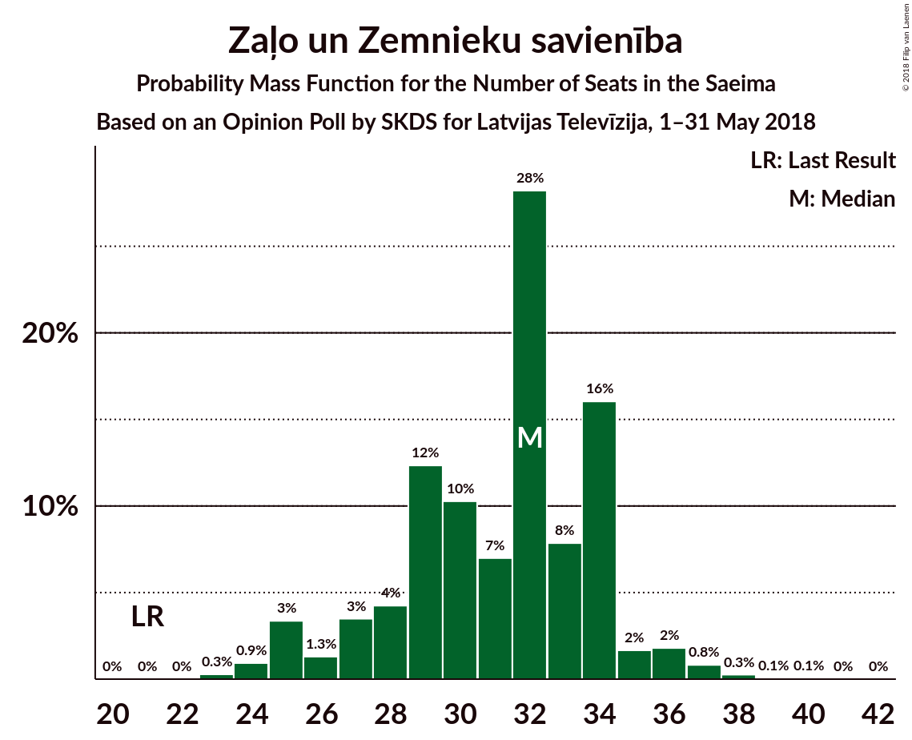

| Number of Seats | Probability | Accumulated | Special Marks |
|:---------------:|:-----------:|:-----------:|:-------------:|
| 21 | 0% | 100% | Last Result |
| 22 | 0% | 100% |  |
| 23 | 0.3% | 100% |  |
| 24 | 0.9% | 99.7% |  |
| 25 | 3% | 98.8% |  |
| 26 | 1.3% | 95% |  |
| 27 | 3% | 94% |  |
| 28 | 4% | 91% |  |
| 29 | 12% | 86% |  |
| 30 | 10% | 74% |  |
| 31 | 7% | 64% |  |
| 32 | 28% | 57% | Median |
| 33 | 8% | 29% |  |
| 34 | 16% | 21% |  |
| 35 | 2% | 5% |  |
| 36 | 2% | 3% |  |
| 37 | 0.8% | 1.2% |  |
| 38 | 0.3% | 0.4% |  |
| 39 | 0.1% | 0.1% |  |
| 40 | 0.1% | 0.1% |  |
| 41 | 0% | 0% |  |

### Nacionālā apvienība „Visu Latvijai!”–„Tēvzemei un Brīvībai/LNNK”

*For a full overview of the results for this party, see the [Nacionālā apvienība „Visu Latvijai!”–„Tēvzemei un Brīvībai/LNNK”](party-nacionālāapvienība„visulatvijai”–„tēvzemeiunbrīvībailnnk”.html) page.*

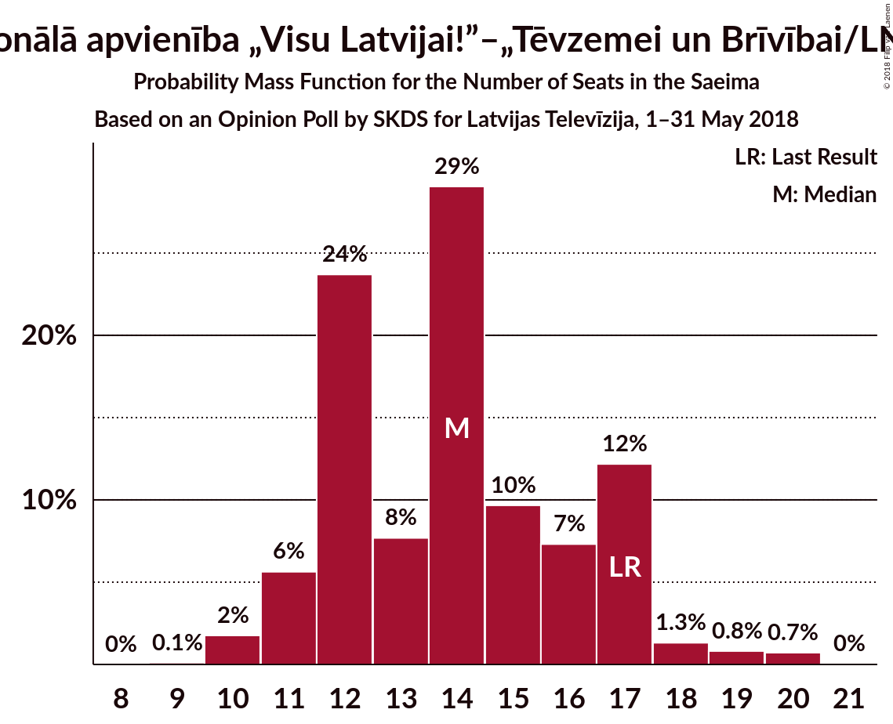

| Number of Seats | Probability | Accumulated | Special Marks |
|:---------------:|:-----------:|:-----------:|:-------------:|
| 9 | 0.1% | 100% |  |
| 10 | 2% | 99.9% |  |
| 11 | 6% | 98% |  |
| 12 | 24% | 92% |  |
| 13 | 8% | 69% |  |
| 14 | 29% | 61% | Median |
| 15 | 10% | 32% |  |
| 16 | 7% | 22% |  |
| 17 | 12% | 15% | Last Result |
| 18 | 1.3% | 3% |  |
| 19 | 0.8% | 2% |  |
| 20 | 0.7% | 0.8% |  |
| 21 | 0% | 0% |  |

### Vienotība

*For a full overview of the results for this party, see the [Vienotība](party-vienotība.html) page.*

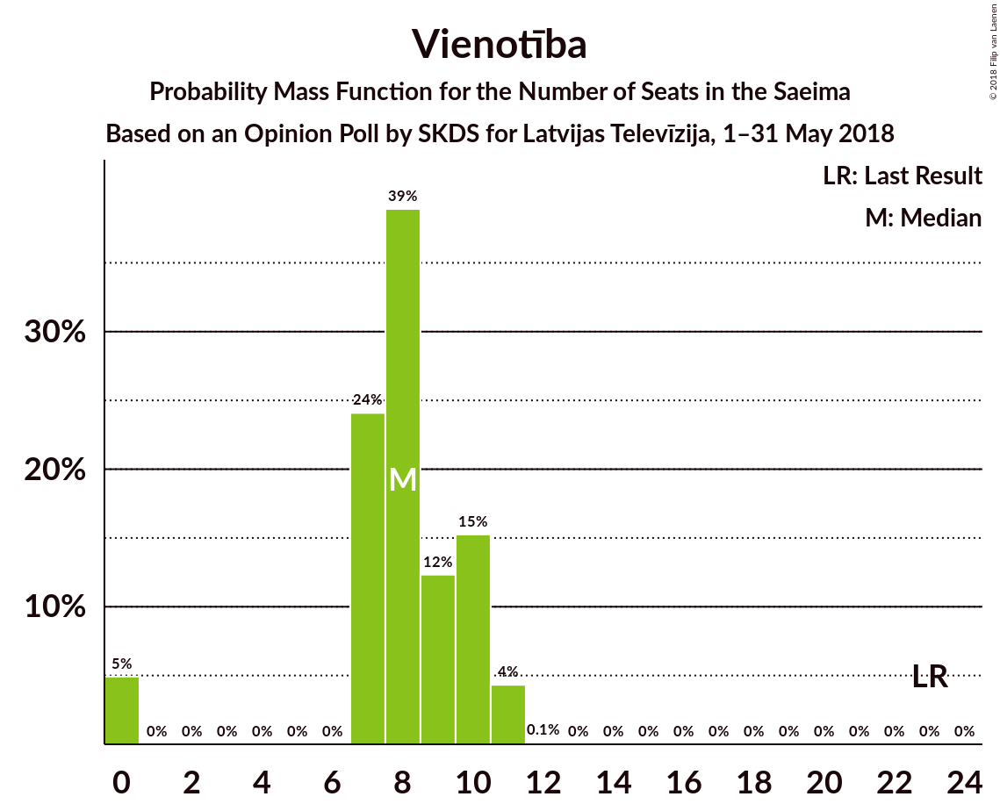

| Number of Seats | Probability | Accumulated | Special Marks |
|:---------------:|:-----------:|:-----------:|:-------------:|
| 0 | 5% | 100% |  |
| 1 | 0% | 95% |  |
| 2 | 0% | 95% |  |
| 3 | 0% | 95% |  |
| 4 | 0% | 95% |  |
| 5 | 0% | 95% |  |
| 6 | 0% | 95% |  |
| 7 | 24% | 95% |  |
| 8 | 39% | 71% | Median |
| 9 | 12% | 32% |  |
| 10 | 15% | 20% |  |
| 11 | 4% | 4% |  |
| 12 | 0.1% | 0.1% |  |
| 13 | 0% | 0% |  |
| 14 | 0% | 0% |  |
| 15 | 0% | 0% |  |
| 16 | 0% | 0% |  |
| 17 | 0% | 0% |  |
| 18 | 0% | 0% |  |
| 19 | 0% | 0% |  |
| 20 | 0% | 0% |  |
| 21 | 0% | 0% |  |
| 22 | 0% | 0% |  |
| 23 | 0% | 0% | Last Result |

### KPV LV

*For a full overview of the results for this party, see the [KPV LV](party-kpvlv.html) page.*

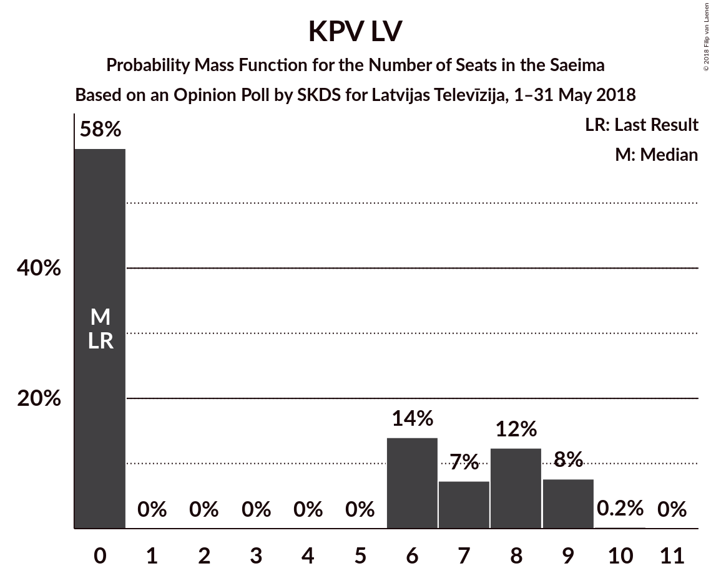

| Number of Seats | Probability | Accumulated | Special Marks |
|:---------------:|:-----------:|:-----------:|:-------------:|
| 0 | 58% | 100% | Last Result, Median |
| 1 | 0% | 42% |  |
| 2 | 0% | 42% |  |
| 3 | 0% | 42% |  |
| 4 | 0% | 42% |  |
| 5 | 0% | 42% |  |
| 6 | 14% | 42% |  |
| 7 | 7% | 28% |  |
| 8 | 12% | 20% |  |
| 9 | 8% | 8% |  |
| 10 | 0.2% | 0.3% |  |
| 11 | 0% | 0% |  |

### Kustība Par!

*For a full overview of the results for this party, see the [Kustība Par!](party-kustībapar.html) page.*

| Number of Seats | Probability | Accumulated | Special Marks |
|:---------------:|:-----------:|:-----------:|:-------------:|
| 0 | 44% | 100% | Last Result |
| 1 | 0% | 56% |  |
| 2 | 0% | 56% |  |
| 3 | 0% | 56% |  |
| 4 | 0% | 56% |  |
| 5 | 0% | 56% |  |
| 6 | 0% | 56% |  |
| 7 | 47% | 56% | Median |
| 8 | 7% | 9% |  |
| 9 | 2% | 2% |  |
| 10 | 0.5% | 0.6% |  |
| 11 | 0.1% | 0.1% |  |
| 12 | 0% | 0% |  |

### Jaunā konservatīvā partija

*For a full overview of the results for this party, see the [Jaunā konservatīvā partija](party-jaunākonservatīvāpartija.html) page.*

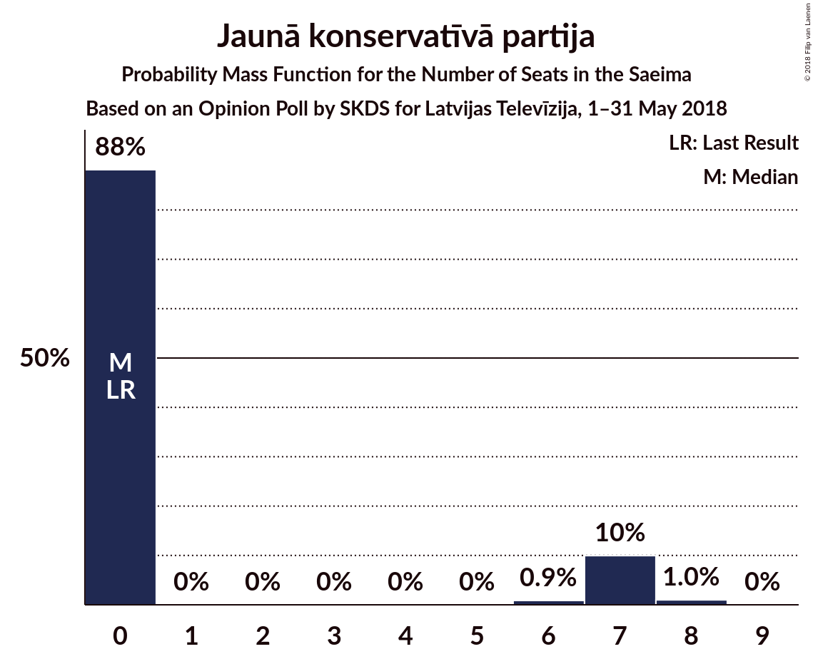

| Number of Seats | Probability | Accumulated | Special Marks |
|:---------------:|:-----------:|:-----------:|:-------------:|
| 0 | 88% | 100% | Last Result, Median |
| 1 | 0% | 12% |  |
| 2 | 0% | 12% |  |
| 3 | 0% | 12% |  |
| 4 | 0% | 12% |  |
| 5 | 0% | 12% |  |
| 6 | 0.9% | 12% |  |
| 7 | 10% | 11% |  |
| 8 | 1.0% | 1.0% |  |
| 9 | 0% | 0% |  |

### Latvijas Reģionu apvienība

*For a full overview of the results for this party, see the [Latvijas Reģionu apvienība](party-latvijasreģionuapvienība.html) page.*

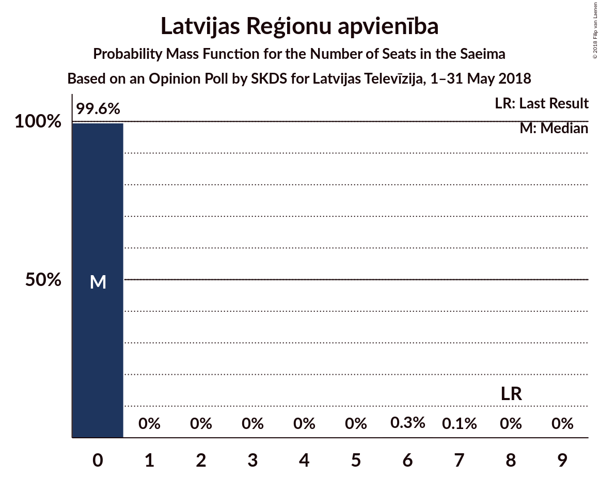

| Number of Seats | Probability | Accumulated | Special Marks |
|:---------------:|:-----------:|:-----------:|:-------------:|
| 0 | 99.6% | 100% | Median |
| 1 | 0% | 0.4% |  |
| 2 | 0% | 0.4% |  |
| 3 | 0% | 0.4% |  |
| 4 | 0% | 0.4% |  |
| 5 | 0% | 0.4% |  |
| 6 | 0.3% | 0.4% |  |
| 7 | 0.1% | 0.1% |  |
| 8 | 0% | 0.1% | Last Result |
| 9 | 0% | 0% |  |

### No sirds Latvijai

*For a full overview of the results for this party, see the [No sirds Latvijai](party-nosirdslatvijai.html) page.*

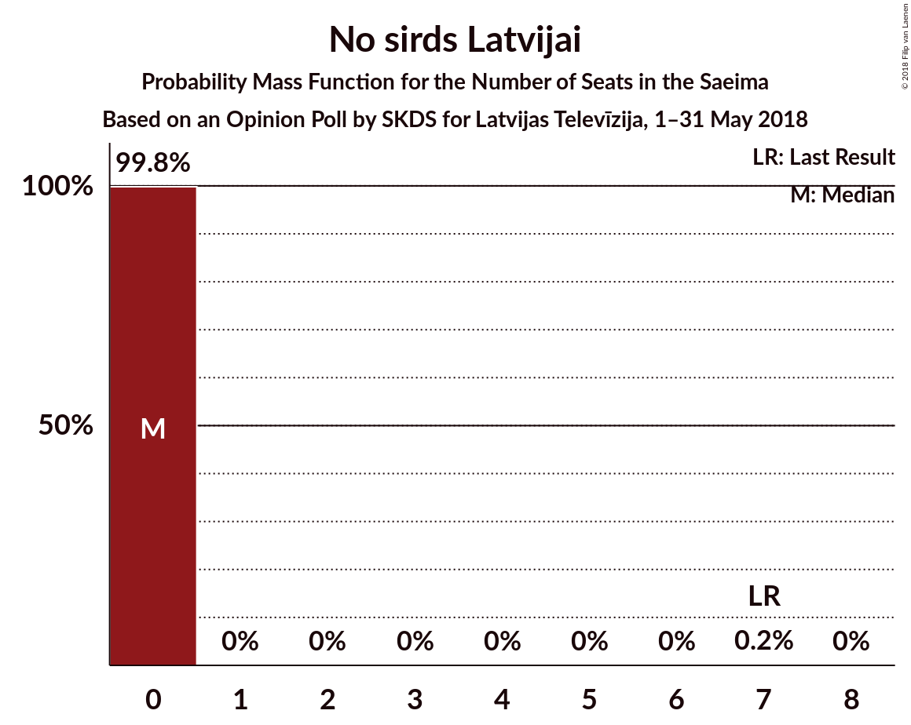

| Number of Seats | Probability | Accumulated | Special Marks |
|:---------------:|:-----------:|:-----------:|:-------------:|
| 0 | 99.8% | 100% | Median |
| 1 | 0% | 0.2% |  |
| 2 | 0% | 0.2% |  |
| 3 | 0% | 0.2% |  |
| 4 | 0% | 0.2% |  |
| 5 | 0% | 0.2% |  |
| 6 | 0% | 0.2% |  |
| 7 | 0.2% | 0.2% | Last Result |
| 8 | 0% | 0% |  |

### Latvijas Krievu savienība

*For a full overview of the results for this party, see the [Latvijas Krievu savienība](party-latvijaskrievusavienība.html) page.*

| Number of Seats | Probability | Accumulated | Special Marks |
|:---------------:|:-----------:|:-----------:|:-------------:|
| 0 | 100% | 100% | Last Result, Median |

## Coalitions

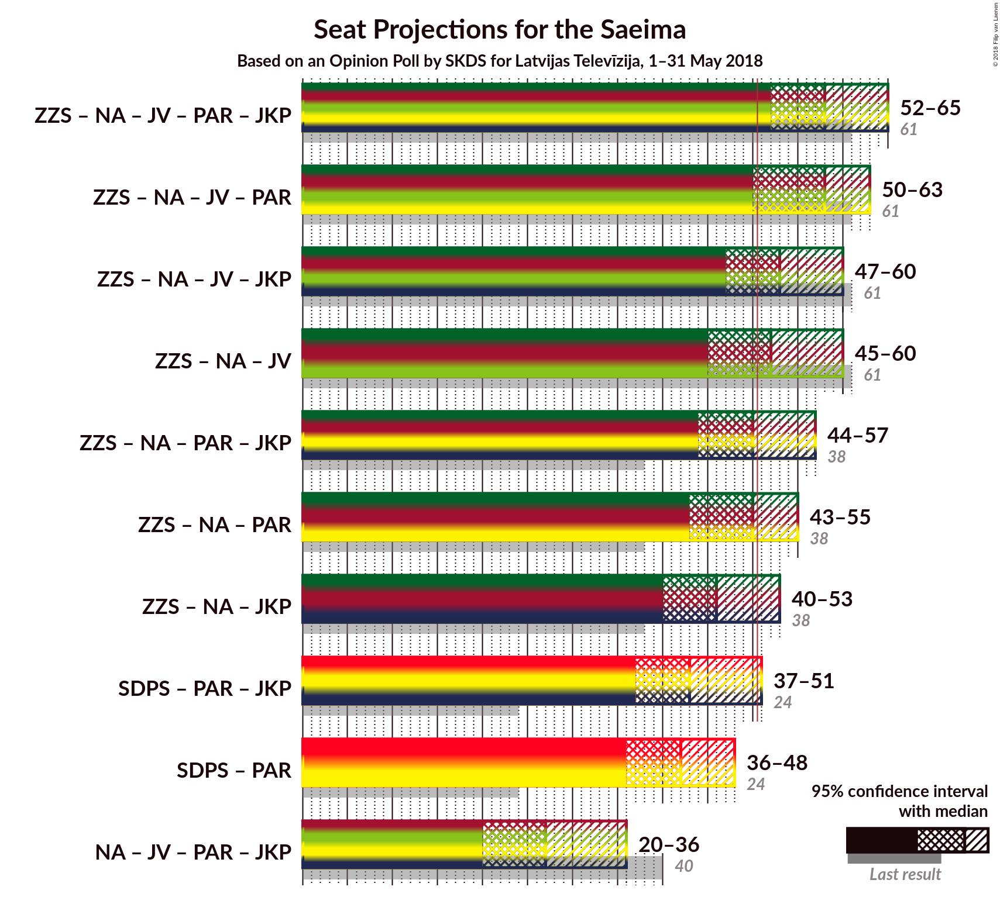

### Confidence Intervals

| Coalition | Last Result | Median | Majority? | 80% Confidence Interval | 90% Confidence Interval | 95% Confidence Interval | 99% Confidence Interval |
|:---------:|:-----------:|:------:|:---------:|:-----------------------:|:-----------------------:|:-----------------------:|:-----------------------:|
| Zaļo un Zemnieku savienība – Nacionālā apvienība „Visu Latvijai!”–„Tēvzemei un Brīvībai/LNNK” – Vienotība – Kustība Par! – Jaunā konservatīvā partija | 61 | 58 | 99.2% | 53–62 | 52–63 | 52–65 | 50–67 |
| Zaļo un Zemnieku savienība – Nacionālā apvienība „Visu Latvijai!”–„Tēvzemei un Brīvībai/LNNK” – Vienotība – Kustība Par! | 61 | 58 | 97% | 52–61 | 52–62 | 50–63 | 47–65 |
| Zaļo un Zemnieku savienība – Nacionālā apvienība „Visu Latvijai!”–„Tēvzemei un Brīvībai/LNNK” – Vienotība – Jaunā konservatīvā partija | 61 | 53 | 86% | 50–58 | 48–60 | 47–60 | 45–62 |
| Zaļo un Zemnieku savienība – Nacionālā apvienība „Visu Latvijai!”–„Tēvzemei un Brīvībai/LNNK” – Vienotība | 61 | 52 | 78% | 48–58 | 46–58 | 45–60 | 43–61 |
| Zaļo un Zemnieku savienība – Nacionālā apvienība „Visu Latvijai!”–„Tēvzemei un Brīvībai/LNNK” – Kustība Par! – Jaunā konservatīvā partija | 38 | 50 | 49% | 45–55 | 44–55 | 44–57 | 43–60 |
| Zaļo un Zemnieku savienība – Nacionālā apvienība „Visu Latvijai!”–„Tēvzemei un Brīvībai/LNNK” – Kustība Par! | 38 | 50 | 41% | 45–54 | 44–55 | 43–55 | 40–58 |
| Zaļo un Zemnieku savienība – Nacionālā apvienība „Visu Latvijai!”–„Tēvzemei un Brīvībai/LNNK” – Jaunā konservatīvā partija | 38 | 46 | 8% | 43–50 | 41–52 | 40–53 | 39–58 |
| Sociāldemokrātiskā Partija “Saskaņa” – Kustība Par! – Jaunā konservatīvā partija | 24 | 43 | 3% | 39–48 | 37–50 | 37–51 | 35–53 |
| Sociāldemokrātiskā Partija “Saskaņa” – Kustība Par! | 24 | 42 | 0.6% | 38–48 | 37–48 | 36–48 | 34–52 |
| Nacionālā apvienība „Visu Latvijai!”–„Tēvzemei un Brīvībai/LNNK” – Vienotība – Kustība Par! – Jaunā konservatīvā partija | 40 | 27 | 0% | 22–33 | 21–34 | 20–36 | 16–38 |

### Zaļo un Zemnieku savienība – Nacionālā apvienība „Visu Latvijai!”–„Tēvzemei un Brīvībai/LNNK” – Vienotība – Kustība Par! – Jaunā konservatīvā partija

| Number of Seats | Probability | Accumulated | Special Marks |
|:---------------:|:-----------:|:-----------:|:-------------:|
| 45 | 0% | 100% |  |
| 46 | 0.1% | 99.9% |  |
| 47 | 0.1% | 99.9% |  |
| 48 | 0.1% | 99.8% |  |
| 49 | 0.1% | 99.8% |  |
| 50 | 0.5% | 99.6% |  |
| 51 | 1.0% | 99.2% | Majority |
| 52 | 5% | 98% |  |
| 53 | 6% | 93% |  |
| 54 | 4% | 87% |  |
| 55 | 6% | 83% |  |
| 56 | 4% | 78% |  |
| 57 | 8% | 74% |  |
| 58 | 21% | 66% |  |
| 59 | 22% | 45% |  |
| 60 | 5% | 23% |  |
| 61 | 4% | 18% | Last Result, Median |
| 62 | 6% | 14% |  |
| 63 | 4% | 8% |  |
| 64 | 1.1% | 4% |  |
| 65 | 2% | 3% |  |
| 66 | 0.3% | 1.0% |  |
| 67 | 0.7% | 0.8% |  |
| 68 | 0% | 0.1% |  |
| 69 | 0% | 0% |  |

### Zaļo un Zemnieku savienība – Nacionālā apvienība „Visu Latvijai!”–„Tēvzemei un Brīvībai/LNNK” – Vienotība – Kustība Par!

| Number of Seats | Probability | Accumulated | Special Marks |
|:---------------:|:-----------:|:-----------:|:-------------:|
| 44 | 0.2% | 100% |  |
| 45 | 0.1% | 99.8% |  |
| 46 | 0.2% | 99.7% |  |
| 47 | 0.2% | 99.5% |  |
| 48 | 0.5% | 99.3% |  |
| 49 | 0.7% | 98.8% |  |
| 50 | 1.0% | 98% |  |
| 51 | 2% | 97% | Majority |
| 52 | 6% | 95% |  |
| 53 | 7% | 89% |  |
| 54 | 6% | 82% |  |
| 55 | 6% | 77% |  |
| 56 | 4% | 70% |  |
| 57 | 8% | 66% |  |
| 58 | 20% | 58% |  |
| 59 | 21% | 37% |  |
| 60 | 4% | 16% |  |
| 61 | 3% | 12% | Last Result, Median |
| 62 | 5% | 9% |  |
| 63 | 3% | 4% |  |
| 64 | 0.2% | 1.4% |  |
| 65 | 1.0% | 1.2% |  |
| 66 | 0.1% | 0.1% |  |
| 67 | 0% | 0% |  |

### Zaļo un Zemnieku savienība – Nacionālā apvienība „Visu Latvijai!”–„Tēvzemei un Brīvībai/LNNK” – Vienotība – Jaunā konservatīvā partija

| Number of Seats | Probability | Accumulated | Special Marks |
|:---------------:|:-----------:|:-----------:|:-------------:|
| 42 | 0.1% | 100% |  |
| 43 | 0.1% | 99.9% |  |
| 44 | 0.2% | 99.8% |  |
| 45 | 0.2% | 99.7% |  |
| 46 | 2% | 99.4% |  |
| 47 | 2% | 98% |  |
| 48 | 2% | 96% |  |
| 49 | 2% | 94% |  |
| 50 | 6% | 92% |  |
| 51 | 4% | 86% | Majority |
| 52 | 27% | 82% |  |
| 53 | 6% | 55% |  |
| 54 | 9% | 48% | Median |
| 55 | 6% | 39% |  |
| 56 | 5% | 33% |  |
| 57 | 3% | 29% |  |
| 58 | 19% | 26% |  |
| 59 | 1.1% | 6% |  |
| 60 | 3% | 5% |  |
| 61 | 1.3% | 2% | Last Result |
| 62 | 0.3% | 0.5% |  |
| 63 | 0.1% | 0.2% |  |
| 64 | 0.1% | 0.1% |  |
| 65 | 0% | 0.1% |  |
| 66 | 0% | 0% |  |

### Zaļo un Zemnieku savienība – Nacionālā apvienība „Visu Latvijai!”–„Tēvzemei un Brīvībai/LNNK” – Vienotība

| Number of Seats | Probability | Accumulated | Special Marks |
|:---------------:|:-----------:|:-----------:|:-------------:|
| 41 | 0.1% | 100% |  |
| 42 | 0.2% | 99.8% |  |
| 43 | 0.4% | 99.6% |  |
| 44 | 0.6% | 99.2% |  |
| 45 | 1.2% | 98.6% |  |
| 46 | 3% | 97% |  |
| 47 | 4% | 95% |  |
| 48 | 3% | 91% |  |
| 49 | 3% | 88% |  |
| 50 | 7% | 85% |  |
| 51 | 5% | 78% | Majority |
| 52 | 26% | 73% |  |
| 53 | 7% | 47% |  |
| 54 | 8% | 40% | Median |
| 55 | 4% | 32% |  |
| 56 | 4% | 28% |  |
| 57 | 2% | 24% |  |
| 58 | 18% | 22% |  |
| 59 | 0.7% | 4% |  |
| 60 | 2% | 3% |  |
| 61 | 1.1% | 1.4% | Last Result |
| 62 | 0.2% | 0.3% |  |
| 63 | 0% | 0.1% |  |
| 64 | 0.1% | 0.1% |  |
| 65 | 0% | 0% |  |

### Zaļo un Zemnieku savienība – Nacionālā apvienība „Visu Latvijai!”–„Tēvzemei un Brīvībai/LNNK” – Kustība Par! – Jaunā konservatīvā partija

| Number of Seats | Probability | Accumulated | Special Marks |
|:---------------:|:-----------:|:-----------:|:-------------:|
| 38 | 0% | 100% | Last Result |
| 39 | 0% | 100% |  |
| 40 | 0% | 100% |  |
| 41 | 0.1% | 99.9% |  |
| 42 | 0.3% | 99.9% |  |
| 43 | 0.9% | 99.6% |  |
| 44 | 5% | 98.6% |  |
| 45 | 4% | 94% |  |
| 46 | 4% | 89% |  |
| 47 | 8% | 86% |  |
| 48 | 17% | 78% |  |
| 49 | 3% | 61% |  |
| 50 | 9% | 58% |  |
| 51 | 25% | 49% | Majority |
| 52 | 4% | 24% |  |
| 53 | 4% | 20% | Median |
| 54 | 5% | 17% |  |
| 55 | 6% | 11% |  |
| 56 | 2% | 5% |  |
| 57 | 0.9% | 3% |  |
| 58 | 0.5% | 2% |  |
| 59 | 0.7% | 2% |  |
| 60 | 1.0% | 1.2% |  |
| 61 | 0.1% | 0.2% |  |
| 62 | 0.1% | 0.1% |  |
| 63 | 0% | 0% |  |

### Zaļo un Zemnieku savienība – Nacionālā apvienība „Visu Latvijai!”–„Tēvzemei un Brīvībai/LNNK” – Kustība Par!

| Number of Seats | Probability | Accumulated | Special Marks |
|:---------------:|:-----------:|:-----------:|:-------------:|
| 38 | 0% | 100% | Last Result |
| 39 | 0.1% | 99.9% |  |
| 40 | 0.4% | 99.8% |  |
| 41 | 0.4% | 99.5% |  |
| 42 | 0.8% | 99.1% |  |
| 43 | 1.3% | 98% |  |
| 44 | 6% | 97% |  |
| 45 | 5% | 91% |  |
| 46 | 6% | 86% |  |
| 47 | 8% | 80% |  |
| 48 | 19% | 72% |  |
| 49 | 4% | 54% |  |
| 50 | 10% | 50% |  |
| 51 | 24% | 41% | Majority |
| 52 | 4% | 17% |  |
| 53 | 2% | 13% | Median |
| 54 | 5% | 11% |  |
| 55 | 5% | 6% |  |
| 56 | 0.7% | 1.5% |  |
| 57 | 0.1% | 0.8% |  |
| 58 | 0.2% | 0.6% |  |
| 59 | 0.2% | 0.4% |  |
| 60 | 0.2% | 0.3% |  |
| 61 | 0% | 0% |  |

### Zaļo un Zemnieku savienība – Nacionālā apvienība „Visu Latvijai!”–„Tēvzemei un Brīvībai/LNNK” – Jaunā konservatīvā partija

| Number of Seats | Probability | Accumulated | Special Marks |
|:---------------:|:-----------:|:-----------:|:-------------:|
| 36 | 0.1% | 100% |  |
| 37 | 0.2% | 99.9% |  |
| 38 | 0.2% | 99.7% | Last Result |
| 39 | 2% | 99.6% |  |
| 40 | 2% | 98% |  |
| 41 | 2% | 96% |  |
| 42 | 2% | 94% |  |
| 43 | 8% | 93% |  |
| 44 | 27% | 84% |  |
| 45 | 6% | 57% |  |
| 46 | 5% | 51% | Median |
| 47 | 15% | 46% |  |
| 48 | 17% | 31% |  |
| 49 | 3% | 14% |  |
| 50 | 3% | 12% |  |
| 51 | 3% | 8% | Majority |
| 52 | 2% | 5% |  |
| 53 | 1.3% | 3% |  |
| 54 | 0.6% | 2% |  |
| 55 | 0.4% | 1.1% |  |
| 56 | 0.1% | 0.7% |  |
| 57 | 0% | 0.6% |  |
| 58 | 0.2% | 0.6% |  |
| 59 | 0.1% | 0.3% |  |
| 60 | 0.3% | 0.3% |  |
| 61 | 0% | 0% |  |

### Sociāldemokrātiskā Partija “Saskaņa” – Kustība Par! – Jaunā konservatīvā partija

| Number of Seats | Probability | Accumulated | Special Marks |
|:---------------:|:-----------:|:-----------:|:-------------:|
| 24 | 0% | 100% | Last Result |
| 25 | 0% | 100% |  |
| 26 | 0% | 100% |  |
| 27 | 0% | 100% |  |
| 28 | 0% | 100% |  |
| 29 | 0% | 100% |  |
| 30 | 0% | 100% |  |
| 31 | 0% | 100% |  |
| 32 | 0% | 100% |  |
| 33 | 0% | 100% |  |
| 34 | 0.1% | 99.9% |  |
| 35 | 0.8% | 99.9% |  |
| 36 | 0.6% | 99.1% |  |
| 37 | 5% | 98.5% |  |
| 38 | 2% | 94% |  |
| 39 | 6% | 92% |  |
| 40 | 6% | 86% |  |
| 41 | 6% | 80% |  |
| 42 | 21% | 74% |  |
| 43 | 3% | 52% |  |
| 44 | 8% | 49% |  |
| 45 | 4% | 41% |  |
| 46 | 6% | 37% |  |
| 47 | 3% | 32% | Median |
| 48 | 20% | 28% |  |
| 49 | 3% | 8% |  |
| 50 | 2% | 5% |  |
| 51 | 1.0% | 3% | Majority |
| 52 | 0.3% | 2% |  |
| 53 | 2% | 2% |  |
| 54 | 0.3% | 0.4% |  |
| 55 | 0% | 0.1% |  |
| 56 | 0.1% | 0.1% |  |
| 57 | 0% | 0% |  |

### Sociāldemokrātiskā Partija “Saskaņa” – Kustība Par!

| Number of Seats | Probability | Accumulated | Special Marks |
|:---------------:|:-----------:|:-----------:|:-------------:|
| 24 | 0% | 100% | Last Result |
| 25 | 0% | 100% |  |
| 26 | 0% | 100% |  |
| 27 | 0% | 100% |  |
| 28 | 0% | 100% |  |
| 29 | 0% | 100% |  |
| 30 | 0% | 100% |  |
| 31 | 0% | 100% |  |
| 32 | 0.2% | 100% |  |
| 33 | 0.2% | 99.7% |  |
| 34 | 0.3% | 99.5% |  |
| 35 | 0.9% | 99.2% |  |
| 36 | 0.8% | 98% |  |
| 37 | 6% | 97% |  |
| 38 | 3% | 92% |  |
| 39 | 7% | 89% |  |
| 40 | 8% | 83% |  |
| 41 | 6% | 75% |  |
| 42 | 23% | 69% |  |
| 43 | 4% | 46% |  |
| 44 | 8% | 41% |  |
| 45 | 3% | 33% |  |
| 46 | 6% | 30% |  |
| 47 | 2% | 24% | Median |
| 48 | 20% | 21% |  |
| 49 | 0.7% | 2% |  |
| 50 | 0.3% | 0.9% |  |
| 51 | 0.1% | 0.6% | Majority |
| 52 | 0.2% | 0.5% |  |
| 53 | 0.3% | 0.3% |  |
| 54 | 0% | 0% |  |

### Nacionālā apvienība „Visu Latvijai!”–„Tēvzemei un Brīvībai/LNNK” – Vienotība – Kustība Par! – Jaunā konservatīvā partija

| Number of Seats | Probability | Accumulated | Special Marks |
|:---------------:|:-----------:|:-----------:|:-------------:|
| 13 | 0.1% | 100% |  |
| 14 | 0.1% | 99.9% |  |
| 15 | 0.3% | 99.8% |  |
| 16 | 0% | 99.5% |  |
| 17 | 0.4% | 99.5% |  |
| 18 | 0.2% | 99.1% |  |
| 19 | 0.5% | 98.9% |  |
| 20 | 3% | 98% |  |
| 21 | 2% | 96% |  |
| 22 | 4% | 94% |  |
| 23 | 4% | 90% |  |
| 24 | 19% | 85% |  |
| 25 | 9% | 66% |  |
| 26 | 6% | 58% |  |
| 27 | 22% | 52% |  |
| 28 | 4% | 31% |  |
| 29 | 5% | 27% | Median |
| 30 | 2% | 22% |  |
| 31 | 7% | 20% |  |
| 32 | 3% | 13% |  |
| 33 | 4% | 10% |  |
| 34 | 2% | 6% |  |
| 35 | 0.9% | 4% |  |
| 36 | 1.1% | 3% |  |
| 37 | 1.2% | 2% |  |
| 38 | 0.7% | 0.8% |  |
| 39 | 0.1% | 0.1% |  |
| 40 | 0% | 0% | Last Result |

## Technical Information

### Opinion Poll

+ **Polling firm:** SKDS
+ **Commissioner(s):** Latvijas Televīzija
+ **Fieldwork period:** 1–31 May 2018

### Calculations

+ **Sample size:** 588
+ **Simulations done:** 1,048,576
+ **Error estimate:** 5.12%

