# Opinion Poll by FACTUM, 25–31 August 2018

<a href="#voting-intentions">Voting Intentions</a> | <a href="#seats">Seats</a> | <a href="#coalitions">Coalitions</a> | <a href="#technical-information">Technical Information</a>

## Voting Intentions

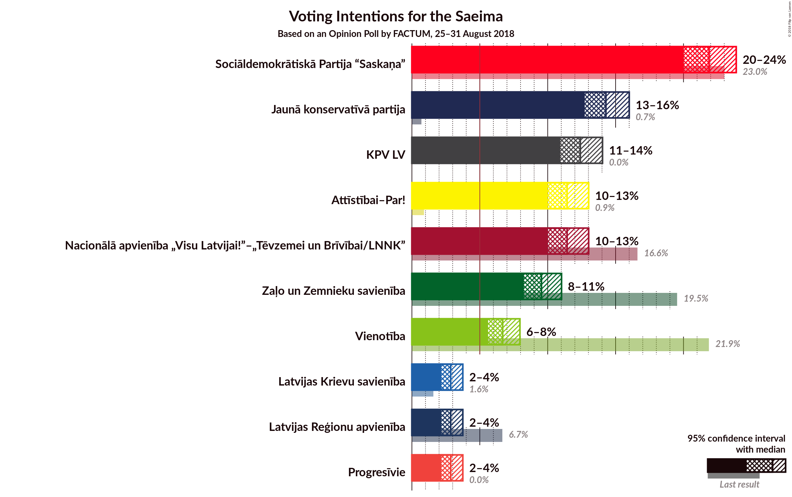

### Confidence Intervals

| Party | Last Result | Poll Result | 80% Confidence Interval | 90% Confidence Interval | 95% Confidence Interval | 99% Confidence Interval |
|:-----:|:-----------:|:-----------:|:-----------------------:|:-----------------------:|:-----------------------:|:-----------------------:|
| Sociāldemokrātiskā Partija “Saskaņa” | 23.0% | 21.9% | 20.7–23.2% |20.3–23.6% |20.0–23.9% |19.4–24.5% |
| Jaunā konservatīvā partija | 0.7% | 14.3% | 13.3–15.4% |13.0–15.7% |12.7–16.0% |12.2–16.6% |
| KPV LV | 0.0% | 12.4% | 11.4–13.5% |11.2–13.8% |10.9–14.0% |10.5–14.6% |
| Nacionālā apvienība „Visu Latvijai!”–„Tēvzemei un Brīvībai/LNNK” | 16.6% | 11.4% | 10.5–12.5% |10.2–12.8% |10.0–13.0% |9.6–13.5% |
| Attīstībai–Par! | 0.9% | 11.4% | 10.5–12.5% |10.2–12.8% |10.0–13.0% |9.6–13.5% |
| Zaļo un Zemnieku savienība | 19.5% | 9.5% | 8.7–10.5% |8.5–10.8% |8.2–11.0% |7.9–11.5% |
| Vienotība | 21.9% | 6.7% | 6.0–7.5% |5.8–7.8% |5.6–8.0% |5.3–8.4% |
| Latvijas Reģionu apvienība | 6.7% | 2.9% | 2.4–3.4% |2.3–3.6% |2.2–3.7% |2.0–4.1% |
| Latvijas Krievu savienība | 1.6% | 2.9% | 2.4–3.4% |2.3–3.6% |2.2–3.7% |2.0–4.1% |
| Progresīvie | 0.0% | 2.9% | 2.4–3.4% |2.3–3.6% |2.2–3.7% |2.0–4.1% |

*Note:* The poll result column reflects the actual value used in the calculations. Published results may vary slightly, and in addition be rounded to fewer digits.

## Seats

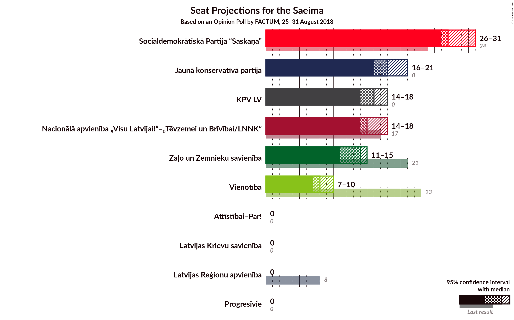

### Confidence Intervals

| Party | Last Result | Median | 80% Confidence Interval | 90% Confidence Interval | 95% Confidence Interval | 99% Confidence Interval |
|:-----:|:-----------:|:------:|:-----------------------:|:-----------------------:|:-----------------------:|:-----------------------:|
| <a href="#sociāldemokrātiskā-partija-“saskaņa”">Sociāldemokrātiskā Partija “Saskaņa”</a> | 24 | 27 | 27–30 |26–31 |26–31 |25–31 |
| <a href="#jaunā-konservatīvā-partija">Jaunā konservatīvā partija</a> | 0 | 18 | 17–20 |16–20 |16–21 |16–22 |
| <a href="#kpv-lv">KPV LV</a> | 0 | 16 | 15–17 |15–18 |14–18 |14–18 |
| <a href="#nacionālā-apvienība-„visu-latvijai!”–„tēvzemei-un-brīvībai/lnnk”">Nacionālā apvienība „Visu Latvijai!”–„Tēvzemei un Brīvībai/LNNK”</a> | 17 | 15 | 15–16 |14–16 |14–18 |12–18 |
| <a href="#attīstībai–par!">Attīstībai–Par!</a> | 0 | 0 | 0 |0 |0 |0 |
| <a href="#zaļo-un-zemnieku-savienība">Zaļo un Zemnieku savienība</a> | 21 | 14 | 12–15 |11–15 |11–15 |11–16 |
| <a href="#vienotība">Vienotība</a> | 23 | 8 | 8–10 |8–10 |7–10 |7–12 |
| <a href="#latvijas-reģionu-apvienība">Latvijas Reģionu apvienība</a> | 8 | 0 | 0 |0 |0 |0 |
| <a href="#latvijas-krievu-savienība">Latvijas Krievu savienība</a> | 0 | 0 | 0 |0 |0 |0 |
| <a href="#progresīvie">Progresīvie</a> | 0 | 0 | 0 |0 |0 |0 |

### Sociāldemokrātiskā Partija “Saskaņa”

*For a full overview of the results for this party, see the [Sociāldemokrātiskā Partija “Saskaņa”](party-sociāldemokrātiskāpartija“saskaņa”.html) page.*

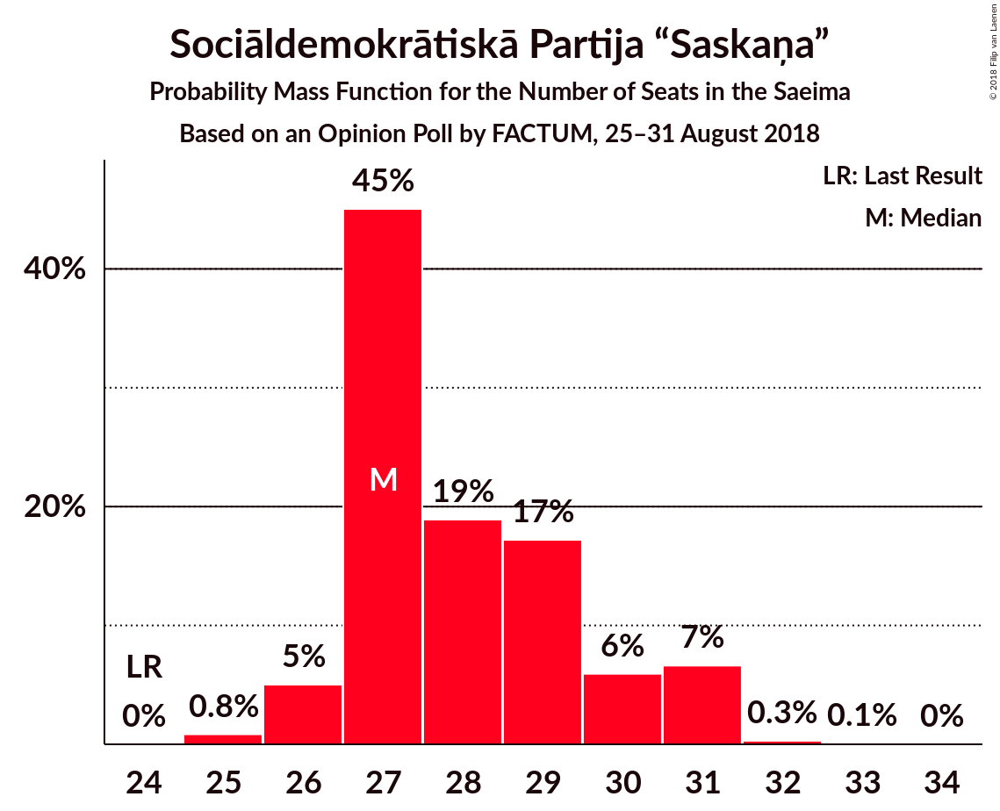

| Number of Seats | Probability | Accumulated | Special Marks |
|:---------------:|:-----------:|:-----------:|:-------------:|
| 24 | 0% | 100% | Last Result |
| 25 | 0.8% | 100% |  |
| 26 | 5% | 99.1% |  |
| 27 | 45% | 94% | Median |
| 28 | 19% | 49% |  |
| 29 | 17% | 30% |  |
| 30 | 6% | 13% |  |
| 31 | 7% | 7% |  |
| 32 | 0.3% | 0.4% |  |
| 33 | 0.1% | 0.1% |  |
| 34 | 0% | 0% |  |

### Jaunā konservatīvā partija

*For a full overview of the results for this party, see the [Jaunā konservatīvā partija](party-jaunākonservatīvāpartija.html) page.*

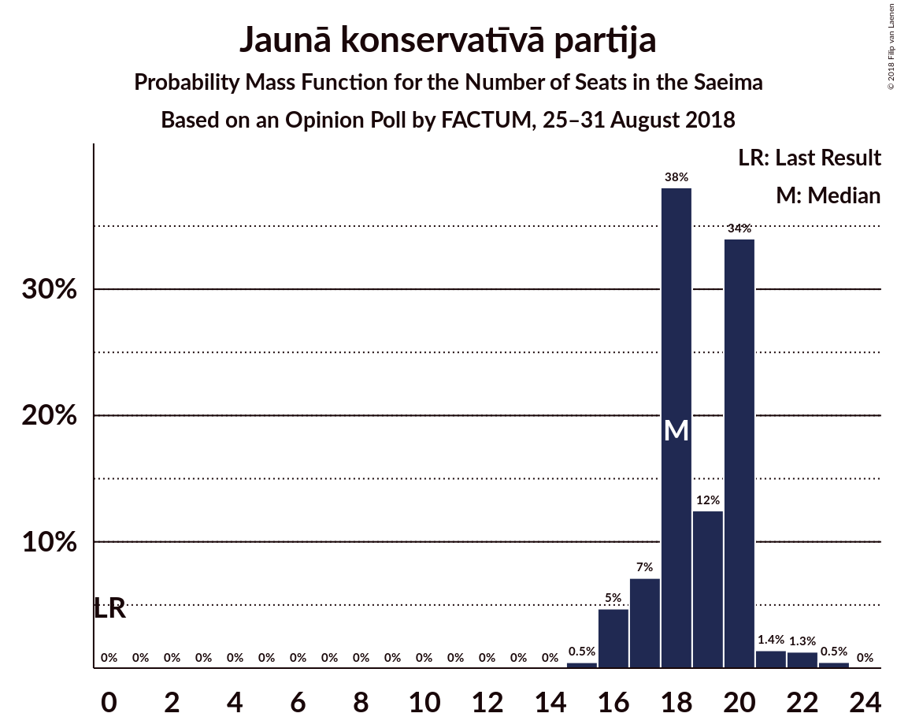

| Number of Seats | Probability | Accumulated | Special Marks |
|:---------------:|:-----------:|:-----------:|:-------------:|
| 0 | 0% | 100% | Last Result |
| 1 | 0% | 100% |  |
| 2 | 0% | 100% |  |
| 3 | 0% | 100% |  |
| 4 | 0% | 100% |  |
| 5 | 0% | 100% |  |
| 6 | 0% | 100% |  |
| 7 | 0% | 100% |  |
| 8 | 0% | 100% |  |
| 9 | 0% | 100% |  |
| 10 | 0% | 100% |  |
| 11 | 0% | 100% |  |
| 12 | 0% | 100% |  |
| 13 | 0% | 100% |  |
| 14 | 0% | 100% |  |
| 15 | 0.5% | 100% |  |
| 16 | 5% | 99.5% |  |
| 17 | 7% | 95% |  |
| 18 | 38% | 88% | Median |
| 19 | 12% | 50% |  |
| 20 | 34% | 37% |  |
| 21 | 1.4% | 3% |  |
| 22 | 1.3% | 2% |  |
| 23 | 0.5% | 0.5% |  |
| 24 | 0% | 0% |  |

### KPV LV

*For a full overview of the results for this party, see the [KPV LV](party-kpvlv.html) page.*

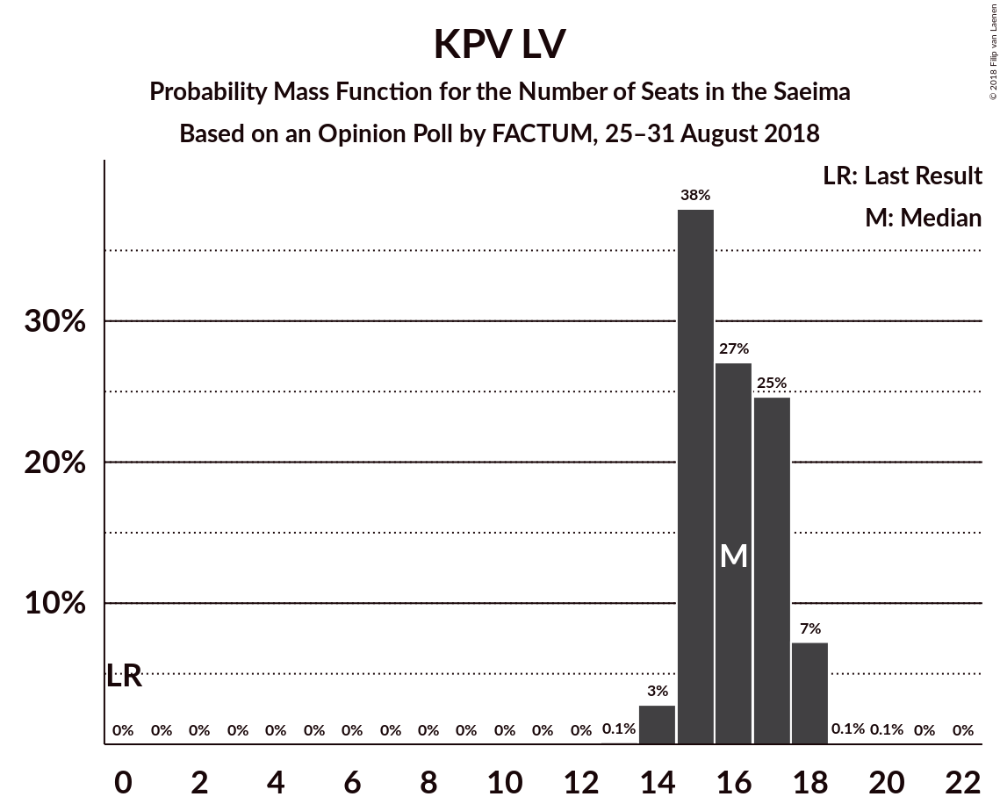

| Number of Seats | Probability | Accumulated | Special Marks |
|:---------------:|:-----------:|:-----------:|:-------------:|
| 0 | 0% | 100% | Last Result |
| 1 | 0% | 100% |  |
| 2 | 0% | 100% |  |
| 3 | 0% | 100% |  |
| 4 | 0% | 100% |  |
| 5 | 0% | 100% |  |
| 6 | 0% | 100% |  |
| 7 | 0% | 100% |  |
| 8 | 0% | 100% |  |
| 9 | 0% | 100% |  |
| 10 | 0% | 100% |  |
| 11 | 0% | 100% |  |
| 12 | 0% | 100% |  |
| 13 | 0.1% | 100% |  |
| 14 | 3% | 99.9% |  |
| 15 | 38% | 97% |  |
| 16 | 27% | 59% | Median |
| 17 | 25% | 32% |  |
| 18 | 7% | 7% |  |
| 19 | 0.1% | 0.2% |  |
| 20 | 0.1% | 0.1% |  |
| 21 | 0% | 0% |  |

### Nacionālā apvienība „Visu Latvijai!”–„Tēvzemei un Brīvībai/LNNK”

*For a full overview of the results for this party, see the [Nacionālā apvienība „Visu Latvijai!”–„Tēvzemei un Brīvībai/LNNK”](party-nacionālāapvienība„visulatvijai”–„tēvzemeiunbrīvībailnnk”.html) page.*

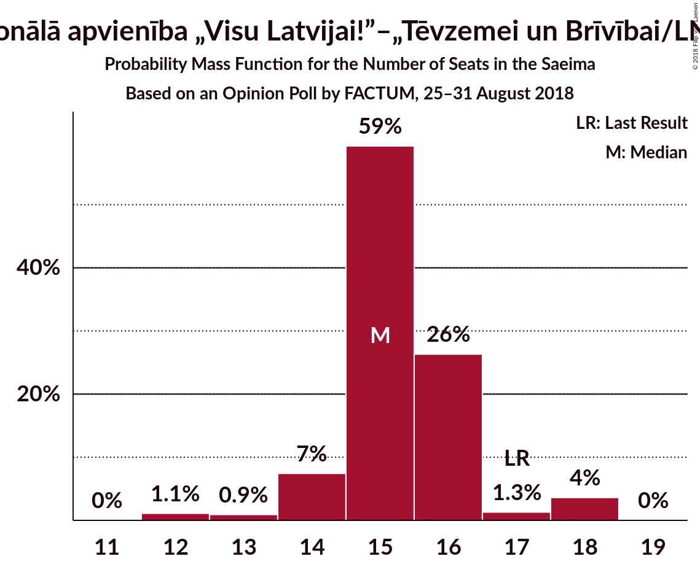

| Number of Seats | Probability | Accumulated | Special Marks |
|:---------------:|:-----------:|:-----------:|:-------------:|
| 12 | 1.1% | 100% |  |
| 13 | 0.9% | 98.9% |  |
| 14 | 7% | 98% |  |
| 15 | 59% | 91% | Median |
| 16 | 26% | 31% |  |
| 17 | 1.3% | 5% | Last Result |
| 18 | 4% | 4% |  |
| 19 | 0% | 0% |  |

### Attīstībai–Par!

*For a full overview of the results for this party, see the [Attīstībai–Par!](party-attīstībai–par.html) page.*

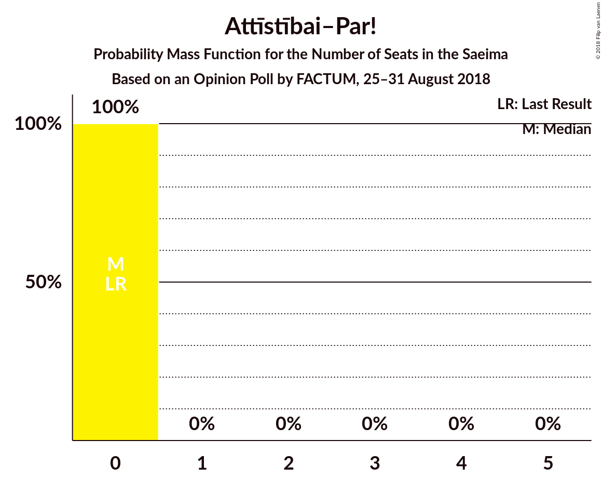

| Number of Seats | Probability | Accumulated | Special Marks |
|:---------------:|:-----------:|:-----------:|:-------------:|
| 0 | 100% | 100% | Last Result, Median |

### Zaļo un Zemnieku savienība

*For a full overview of the results for this party, see the [Zaļo un Zemnieku savienība](party-zaļounzemniekusavienība.html) page.*

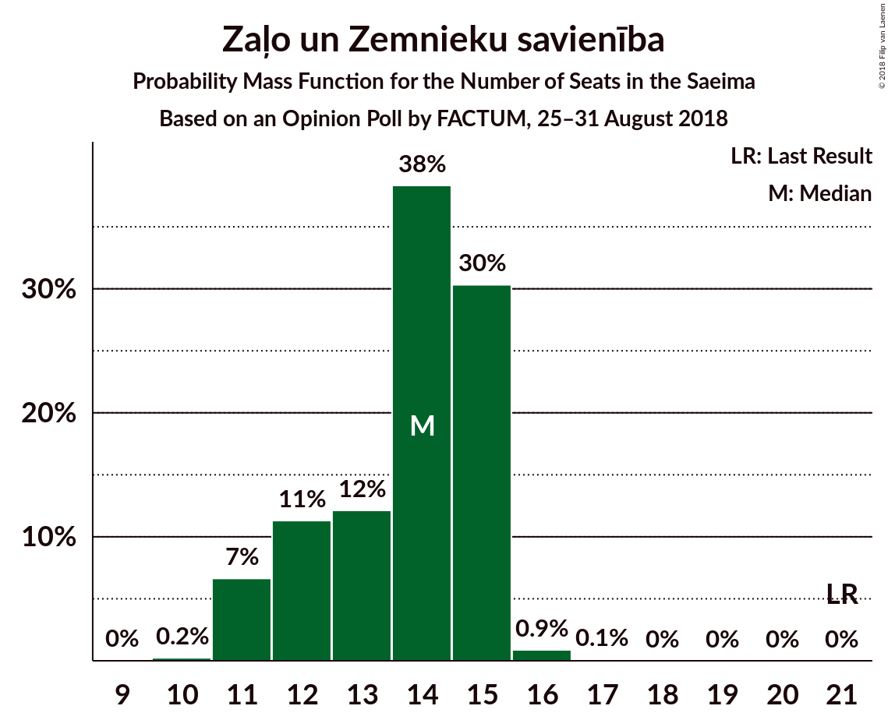

| Number of Seats | Probability | Accumulated | Special Marks |
|:---------------:|:-----------:|:-----------:|:-------------:|
| 10 | 0.2% | 100% |  |
| 11 | 7% | 99.7% |  |
| 12 | 11% | 93% |  |
| 13 | 12% | 82% |  |
| 14 | 38% | 70% | Median |
| 15 | 30% | 31% |  |
| 16 | 0.9% | 1.0% |  |
| 17 | 0.1% | 0.1% |  |
| 18 | 0% | 0% |  |
| 19 | 0% | 0% |  |
| 20 | 0% | 0% |  |
| 21 | 0% | 0% | Last Result |

### Vienotība

*For a full overview of the results for this party, see the [Vienotība](party-vienotība.html) page.*

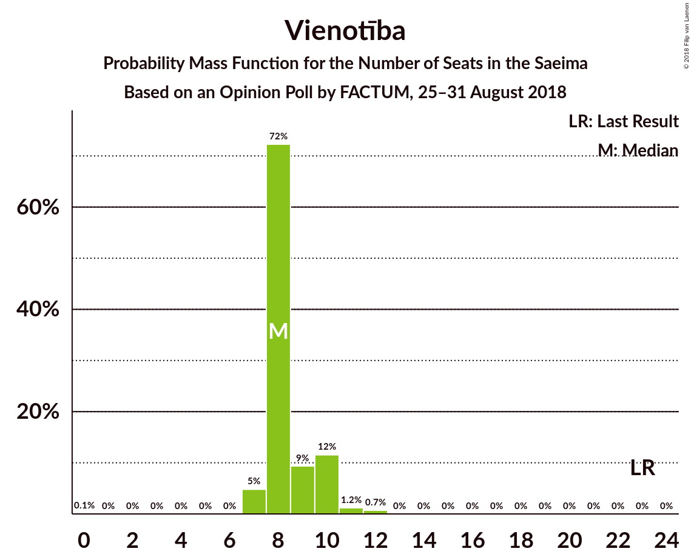

| Number of Seats | Probability | Accumulated | Special Marks |
|:---------------:|:-----------:|:-----------:|:-------------:|
| 0 | 0.1% | 100% |  |
| 1 | 0% | 99.9% |  |
| 2 | 0% | 99.9% |  |
| 3 | 0% | 99.9% |  |
| 4 | 0% | 99.9% |  |
| 5 | 0% | 99.9% |  |
| 6 | 0% | 99.9% |  |
| 7 | 5% | 99.9% |  |
| 8 | 72% | 95% | Median |
| 9 | 9% | 23% |  |
| 10 | 12% | 13% |  |
| 11 | 1.2% | 2% |  |
| 12 | 0.7% | 0.7% |  |
| 13 | 0% | 0% |  |
| 14 | 0% | 0% |  |
| 15 | 0% | 0% |  |
| 16 | 0% | 0% |  |
| 17 | 0% | 0% |  |
| 18 | 0% | 0% |  |
| 19 | 0% | 0% |  |
| 20 | 0% | 0% |  |
| 21 | 0% | 0% |  |
| 22 | 0% | 0% |  |
| 23 | 0% | 0% | Last Result |

### Latvijas Reģionu apvienība

*For a full overview of the results for this party, see the [Latvijas Reģionu apvienība](party-latvijasreģionuapvienība.html) page.*

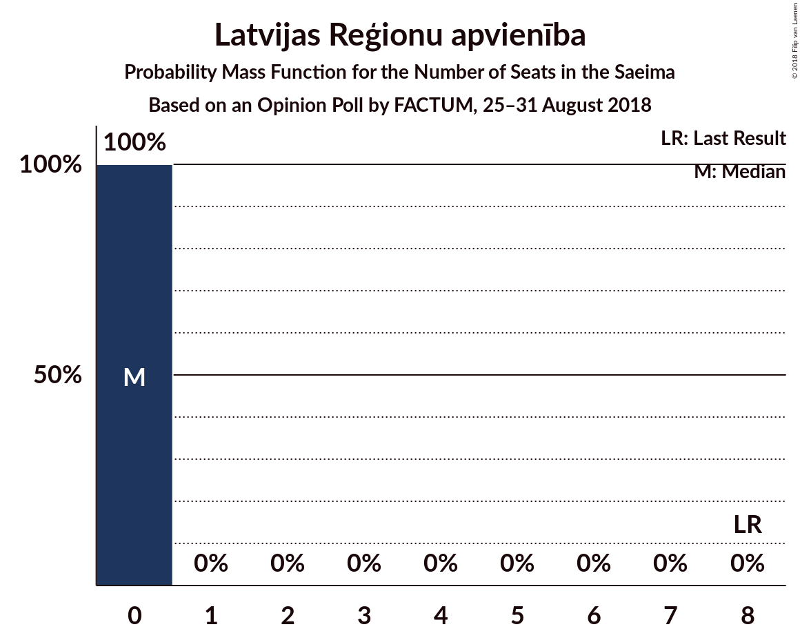

| Number of Seats | Probability | Accumulated | Special Marks |
|:---------------:|:-----------:|:-----------:|:-------------:|
| 0 | 100% | 100% | Median |
| 1 | 0% | 0% |  |
| 2 | 0% | 0% |  |
| 3 | 0% | 0% |  |
| 4 | 0% | 0% |  |
| 5 | 0% | 0% |  |
| 6 | 0% | 0% |  |
| 7 | 0% | 0% |  |
| 8 | 0% | 0% | Last Result |

### Latvijas Krievu savienība

*For a full overview of the results for this party, see the [Latvijas Krievu savienība](party-latvijaskrievusavienība.html) page.*

| Number of Seats | Probability | Accumulated | Special Marks |
|:---------------:|:-----------:|:-----------:|:-------------:|
| 0 | 100% | 100% | Last Result, Median |

### Progresīvie

*For a full overview of the results for this party, see the [Progresīvie](party-progresīvie.html) page.*

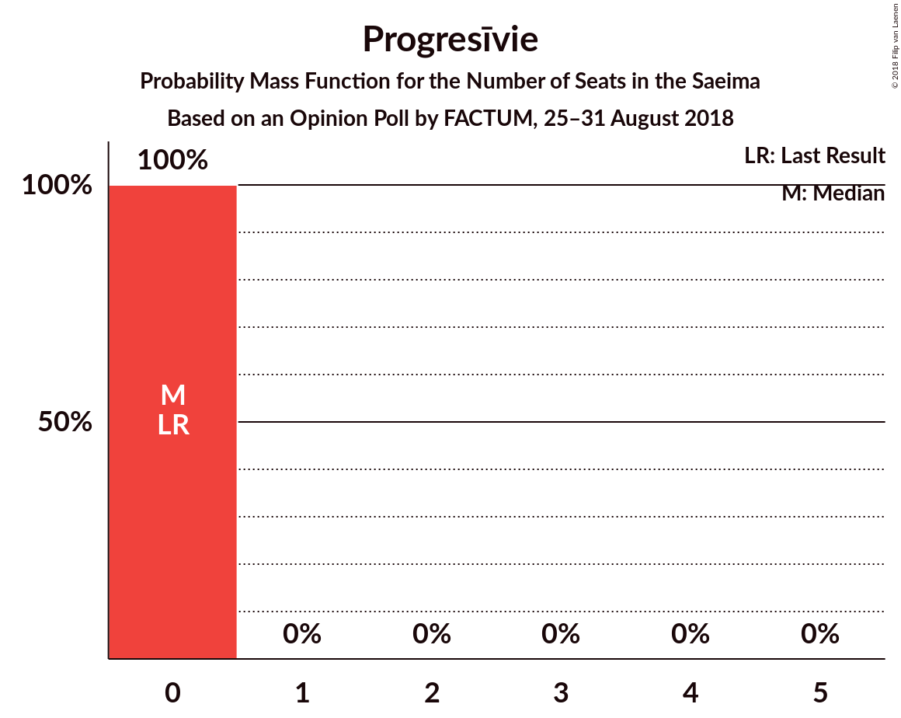

| Number of Seats | Probability | Accumulated | Special Marks |
|:---------------:|:-----------:|:-----------:|:-------------:|
| 0 | 100% | 100% | Last Result, Median |

## Coalitions

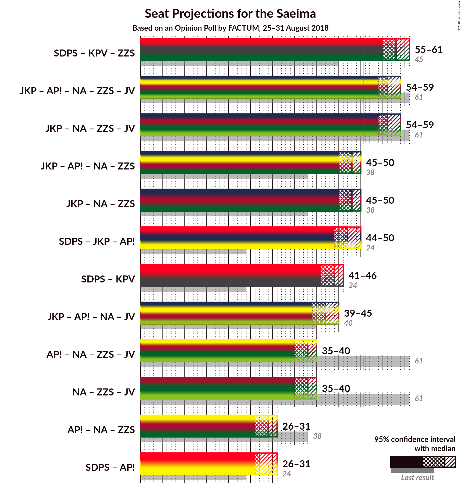

### Confidence Intervals

| Coalition | Last Result | Median | Majority? | 80% Confidence Interval | 90% Confidence Interval | 95% Confidence Interval | 99% Confidence Interval |
|:---------:|:-----------:|:------:|:---------:|:-----------------------:|:-----------------------:|:-----------------------:|:-----------------------:|
| Sociāldemokrātiskā Partija “Saskaņa” – KPV LV – Zaļo un Zemnieku savienība | 45 | 58 | 100% | 56–59 | 55–60 | 55–61 | 53–61 |
| Jaunā konservatīvā partija – Attīstībai–Par! – Nacionālā apvienība „Visu Latvijai!”–„Tēvzemei un Brīvībai/LNNK” – Zaļo un Zemnieku savienība – Vienotība | 61 | 56 | 100% | 54–58 | 54–58 | 54–59 | 53–59 |
| Jaunā konservatīvā partija – Nacionālā apvienība „Visu Latvijai!”–„Tēvzemei un Brīvībai/LNNK” – Zaļo un Zemnieku savienība – Vienotība | 61 | 56 | 100% | 54–58 | 54–58 | 54–59 | 53–59 |
| Jaunā konservatīvā partija – Attīstībai–Par! – Nacionālā apvienība „Visu Latvijai!”–„Tēvzemei un Brīvībai/LNNK” – Zaļo un Zemnieku savienība | 38 | 48 | 2% | 46–49 | 45–50 | 45–50 | 44–51 |
| Jaunā konservatīvā partija – Nacionālā apvienība „Visu Latvijai!”–„Tēvzemei un Brīvībai/LNNK” – Zaļo un Zemnieku savienība | 38 | 48 | 2% | 46–49 | 45–50 | 45–50 | 44–51 |
| Sociāldemokrātiskā Partija “Saskaņa” – Jaunā konservatīvā partija – Attīstībai–Par! | 24 | 47 | 0.6% | 45–48 | 45–49 | 44–50 | 42–51 |
| Sociāldemokrātiskā Partija “Saskaņa” – KPV LV | 24 | 44 | 0% | 42–46 | 42–46 | 41–46 | 41–47 |
| Jaunā konservatīvā partija – Attīstībai–Par! – Nacionālā apvienība „Visu Latvijai!”–„Tēvzemei un Brīvībai/LNNK” – Vienotība | 40 | 42 | 0% | 41–44 | 40–45 | 39–45 | 39–47 |
| Attīstībai–Par! – Nacionālā apvienība „Visu Latvijai!”–„Tēvzemei un Brīvībai/LNNK” – Zaļo un Zemnieku savienība – Vienotība | 61 | 38 | 0% | 36–39 | 35–39 | 35–40 | 34–41 |
| Nacionālā apvienība „Visu Latvijai!”–„Tēvzemei un Brīvībai/LNNK” – Zaļo un Zemnieku savienība – Vienotība | 61 | 38 | 0% | 36–39 | 35–39 | 35–40 | 34–41 |
| Attīstībai–Par! – Nacionālā apvienība „Visu Latvijai!”–„Tēvzemei un Brīvībai/LNNK” – Zaļo un Zemnieku savienība | 38 | 29 | 0% | 27–30 | 27–30 | 26–31 | 26–32 |
| Sociāldemokrātiskā Partija “Saskaņa” – Attīstībai–Par! | 24 | 27 | 0% | 27–30 | 26–31 | 26–31 | 25–31 |

### Sociāldemokrātiskā Partija “Saskaņa” – KPV LV – Zaļo un Zemnieku savienība

| Number of Seats | Probability | Accumulated | Special Marks |
|:---------------:|:-----------:|:-----------:|:-------------:|
| 45 | 0% | 100% | Last Result |
| 46 | 0% | 100% |  |
| 47 | 0% | 100% |  |
| 48 | 0% | 100% |  |
| 49 | 0% | 100% |  |
| 50 | 0% | 100% |  |
| 51 | 0% | 100% | Majority |
| 52 | 0.1% | 100% |  |
| 53 | 0.4% | 99.8% |  |
| 54 | 0.8% | 99.4% |  |
| 55 | 5% | 98.6% |  |
| 56 | 13% | 94% |  |
| 57 | 28% | 80% | Median |
| 58 | 24% | 53% |  |
| 59 | 20% | 28% |  |
| 60 | 5% | 8% |  |
| 61 | 3% | 3% |  |
| 62 | 0.3% | 0.3% |  |
| 63 | 0% | 0.1% |  |
| 64 | 0% | 0% |  |

### Jaunā konservatīvā partija – Attīstībai–Par! – Nacionālā apvienība „Visu Latvijai!”–„Tēvzemei un Brīvībai/LNNK” – Zaļo un Zemnieku savienība – Vienotība

| Number of Seats | Probability | Accumulated | Special Marks |
|:---------------:|:-----------:|:-----------:|:-------------:|
| 51 | 0% | 100% | Majority |
| 52 | 0.2% | 99.9% |  |
| 53 | 1.0% | 99.7% |  |
| 54 | 11% | 98.7% |  |
| 55 | 14% | 87% | Median |
| 56 | 33% | 73% |  |
| 57 | 29% | 40% |  |
| 58 | 8% | 10% |  |
| 59 | 2% | 3% |  |
| 60 | 0.4% | 0.5% |  |
| 61 | 0% | 0% | Last Result |

### Jaunā konservatīvā partija – Nacionālā apvienība „Visu Latvijai!”–„Tēvzemei un Brīvībai/LNNK” – Zaļo un Zemnieku savienība – Vienotība

| Number of Seats | Probability | Accumulated | Special Marks |
|:---------------:|:-----------:|:-----------:|:-------------:|
| 51 | 0% | 100% | Majority |
| 52 | 0.2% | 99.9% |  |
| 53 | 1.0% | 99.7% |  |
| 54 | 11% | 98.7% |  |
| 55 | 14% | 87% | Median |
| 56 | 33% | 73% |  |
| 57 | 29% | 40% |  |
| 58 | 8% | 10% |  |
| 59 | 2% | 3% |  |
| 60 | 0.4% | 0.5% |  |
| 61 | 0% | 0% | Last Result |

### Jaunā konservatīvā partija – Attīstībai–Par! – Nacionālā apvienība „Visu Latvijai!”–„Tēvzemei un Brīvībai/LNNK” – Zaļo un Zemnieku savienība

| Number of Seats | Probability | Accumulated | Special Marks |
|:---------------:|:-----------:|:-----------:|:-------------:|
| 38 | 0% | 100% | Last Result |
| 39 | 0% | 100% |  |
| 40 | 0% | 100% |  |
| 41 | 0% | 100% |  |
| 42 | 0% | 100% |  |
| 43 | 0.1% | 100% |  |
| 44 | 1.3% | 99.9% |  |
| 45 | 7% | 98.6% |  |
| 46 | 11% | 92% |  |
| 47 | 15% | 81% | Median |
| 48 | 34% | 66% |  |
| 49 | 25% | 32% |  |
| 50 | 5% | 7% |  |
| 51 | 1.4% | 2% | Majority |
| 52 | 0.3% | 0.4% |  |
| 53 | 0% | 0.1% |  |
| 54 | 0% | 0% |  |

### Jaunā konservatīvā partija – Nacionālā apvienība „Visu Latvijai!”–„Tēvzemei un Brīvībai/LNNK” – Zaļo un Zemnieku savienība

| Number of Seats | Probability | Accumulated | Special Marks |
|:---------------:|:-----------:|:-----------:|:-------------:|
| 38 | 0% | 100% | Last Result |
| 39 | 0% | 100% |  |
| 40 | 0% | 100% |  |
| 41 | 0% | 100% |  |
| 42 | 0% | 100% |  |
| 43 | 0.1% | 100% |  |
| 44 | 1.3% | 99.9% |  |
| 45 | 7% | 98.6% |  |
| 46 | 11% | 92% |  |
| 47 | 15% | 81% | Median |
| 48 | 34% | 66% |  |
| 49 | 25% | 32% |  |
| 50 | 5% | 7% |  |
| 51 | 1.4% | 2% | Majority |
| 52 | 0.3% | 0.4% |  |
| 53 | 0% | 0.1% |  |
| 54 | 0% | 0% |  |

### Sociāldemokrātiskā Partija “Saskaņa” – Jaunā konservatīvā partija – Attīstībai–Par!

| Number of Seats | Probability | Accumulated | Special Marks |
|:---------------:|:-----------:|:-----------:|:-------------:|
| 24 | 0% | 100% | Last Result |
| 25 | 0% | 100% |  |
| 26 | 0% | 100% |  |
| 27 | 0% | 100% |  |
| 28 | 0% | 100% |  |
| 29 | 0% | 100% |  |
| 30 | 0% | 100% |  |
| 31 | 0% | 100% |  |
| 32 | 0% | 100% |  |
| 33 | 0% | 100% |  |
| 34 | 0% | 100% |  |
| 35 | 0% | 100% |  |
| 36 | 0% | 100% |  |
| 37 | 0% | 100% |  |
| 38 | 0% | 100% |  |
| 39 | 0% | 100% |  |
| 40 | 0% | 100% |  |
| 41 | 0% | 100% |  |
| 42 | 0.7% | 100% |  |
| 43 | 0.3% | 99.3% |  |
| 44 | 3% | 99.0% |  |
| 45 | 23% | 96% | Median |
| 46 | 10% | 73% |  |
| 47 | 37% | 63% |  |
| 48 | 17% | 26% |  |
| 49 | 6% | 9% |  |
| 50 | 2% | 3% |  |
| 51 | 0.5% | 0.6% | Majority |
| 52 | 0.1% | 0.1% |  |
| 53 | 0% | 0% |  |

### Sociāldemokrātiskā Partija “Saskaņa” – KPV LV

| Number of Seats | Probability | Accumulated | Special Marks |
|:---------------:|:-----------:|:-----------:|:-------------:|
| 24 | 0% | 100% | Last Result |
| 25 | 0% | 100% |  |
| 26 | 0% | 100% |  |
| 27 | 0% | 100% |  |
| 28 | 0% | 100% |  |
| 29 | 0% | 100% |  |
| 30 | 0% | 100% |  |
| 31 | 0% | 100% |  |
| 32 | 0% | 100% |  |
| 33 | 0% | 100% |  |
| 34 | 0% | 100% |  |
| 35 | 0% | 100% |  |
| 36 | 0% | 100% |  |
| 37 | 0% | 100% |  |
| 38 | 0% | 100% |  |
| 39 | 0% | 100% |  |
| 40 | 0.4% | 100% |  |
| 41 | 2% | 99.5% |  |
| 42 | 8% | 97% |  |
| 43 | 29% | 90% | Median |
| 44 | 33% | 60% |  |
| 45 | 14% | 27% |  |
| 46 | 11% | 13% |  |
| 47 | 1.0% | 1.3% |  |
| 48 | 0.2% | 0.3% |  |
| 49 | 0% | 0.1% |  |
| 50 | 0% | 0% |  |

### Jaunā konservatīvā partija – Attīstībai–Par! – Nacionālā apvienība „Visu Latvijai!”–„Tēvzemei un Brīvībai/LNNK” – Vienotība

| Number of Seats | Probability | Accumulated | Special Marks |
|:---------------:|:-----------:|:-----------:|:-------------:|
| 37 | 0% | 100% |  |
| 38 | 0.3% | 99.9% |  |
| 39 | 3% | 99.7% |  |
| 40 | 5% | 97% | Last Result |
| 41 | 20% | 92% | Median |
| 42 | 24% | 72% |  |
| 43 | 28% | 47% |  |
| 44 | 13% | 20% |  |
| 45 | 5% | 6% |  |
| 46 | 0.8% | 1.4% |  |
| 47 | 0.4% | 0.6% |  |
| 48 | 0.1% | 0.2% |  |
| 49 | 0% | 0% |  |

### Attīstībai–Par! – Nacionālā apvienība „Visu Latvijai!”–„Tēvzemei un Brīvībai/LNNK” – Zaļo un Zemnieku savienība – Vienotība

| Number of Seats | Probability | Accumulated | Special Marks |
|:---------------:|:-----------:|:-----------:|:-------------:|
| 32 | 0.1% | 100% |  |
| 33 | 0.1% | 99.9% |  |
| 34 | 0.7% | 99.8% |  |
| 35 | 8% | 99.1% |  |
| 36 | 11% | 91% |  |
| 37 | 28% | 80% | Median |
| 38 | 40% | 52% |  |
| 39 | 9% | 12% |  |
| 40 | 2% | 3% |  |
| 41 | 0.8% | 0.8% |  |
| 42 | 0% | 0.1% |  |
| 43 | 0% | 0% |  |
| 44 | 0% | 0% |  |
| 45 | 0% | 0% |  |
| 46 | 0% | 0% |  |
| 47 | 0% | 0% |  |
| 48 | 0% | 0% |  |
| 49 | 0% | 0% |  |
| 50 | 0% | 0% |  |
| 51 | 0% | 0% | Majority |
| 52 | 0% | 0% |  |
| 53 | 0% | 0% |  |
| 54 | 0% | 0% |  |
| 55 | 0% | 0% |  |
| 56 | 0% | 0% |  |
| 57 | 0% | 0% |  |
| 58 | 0% | 0% |  |
| 59 | 0% | 0% |  |
| 60 | 0% | 0% |  |
| 61 | 0% | 0% | Last Result |

### Nacionālā apvienība „Visu Latvijai!”–„Tēvzemei un Brīvībai/LNNK” – Zaļo un Zemnieku savienība – Vienotība

| Number of Seats | Probability | Accumulated | Special Marks |
|:---------------:|:-----------:|:-----------:|:-------------:|
| 32 | 0.1% | 100% |  |
| 33 | 0.1% | 99.9% |  |
| 34 | 0.7% | 99.8% |  |
| 35 | 8% | 99.1% |  |
| 36 | 11% | 91% |  |
| 37 | 28% | 80% | Median |
| 38 | 40% | 52% |  |
| 39 | 9% | 12% |  |
| 40 | 2% | 3% |  |
| 41 | 0.8% | 0.8% |  |
| 42 | 0% | 0.1% |  |
| 43 | 0% | 0% |  |
| 44 | 0% | 0% |  |
| 45 | 0% | 0% |  |
| 46 | 0% | 0% |  |
| 47 | 0% | 0% |  |
| 48 | 0% | 0% |  |
| 49 | 0% | 0% |  |
| 50 | 0% | 0% |  |
| 51 | 0% | 0% | Majority |
| 52 | 0% | 0% |  |
| 53 | 0% | 0% |  |
| 54 | 0% | 0% |  |
| 55 | 0% | 0% |  |
| 56 | 0% | 0% |  |
| 57 | 0% | 0% |  |
| 58 | 0% | 0% |  |
| 59 | 0% | 0% |  |
| 60 | 0% | 0% |  |
| 61 | 0% | 0% | Last Result |

### Attīstībai–Par! – Nacionālā apvienība „Visu Latvijai!”–„Tēvzemei un Brīvībai/LNNK” – Zaļo un Zemnieku savienība

| Number of Seats | Probability | Accumulated | Special Marks |
|:---------------:|:-----------:|:-----------:|:-------------:|
| 25 | 0.4% | 100% |  |
| 26 | 3% | 99.6% |  |
| 27 | 13% | 97% |  |
| 28 | 12% | 84% |  |
| 29 | 25% | 72% | Median |
| 30 | 43% | 46% |  |
| 31 | 2% | 4% |  |
| 32 | 2% | 2% |  |
| 33 | 0.2% | 0.2% |  |
| 34 | 0% | 0% |  |
| 35 | 0% | 0% |  |
| 36 | 0% | 0% |  |
| 37 | 0% | 0% |  |
| 38 | 0% | 0% | Last Result |

### Sociāldemokrātiskā Partija “Saskaņa” – Attīstībai–Par!

| Number of Seats | Probability | Accumulated | Special Marks |
|:---------------:|:-----------:|:-----------:|:-------------:|
| 24 | 0% | 100% | Last Result |
| 25 | 0.8% | 100% |  |
| 26 | 5% | 99.1% |  |
| 27 | 45% | 94% | Median |
| 28 | 19% | 49% |  |
| 29 | 17% | 30% |  |
| 30 | 6% | 13% |  |
| 31 | 7% | 7% |  |
| 32 | 0.3% | 0.4% |  |
| 33 | 0.1% | 0.1% |  |
| 34 | 0% | 0% |  |

## Technical Information

### Opinion Poll

+ **Polling firm:** FACTUM
+ **Commissioner(s):** —
+ **Fieldwork period:** 25–31 August 2018

### Calculations

+ **Sample size:** 1750
+ **Simulations done:** 1,048,576
+ **Error estimate:** 1.14%

