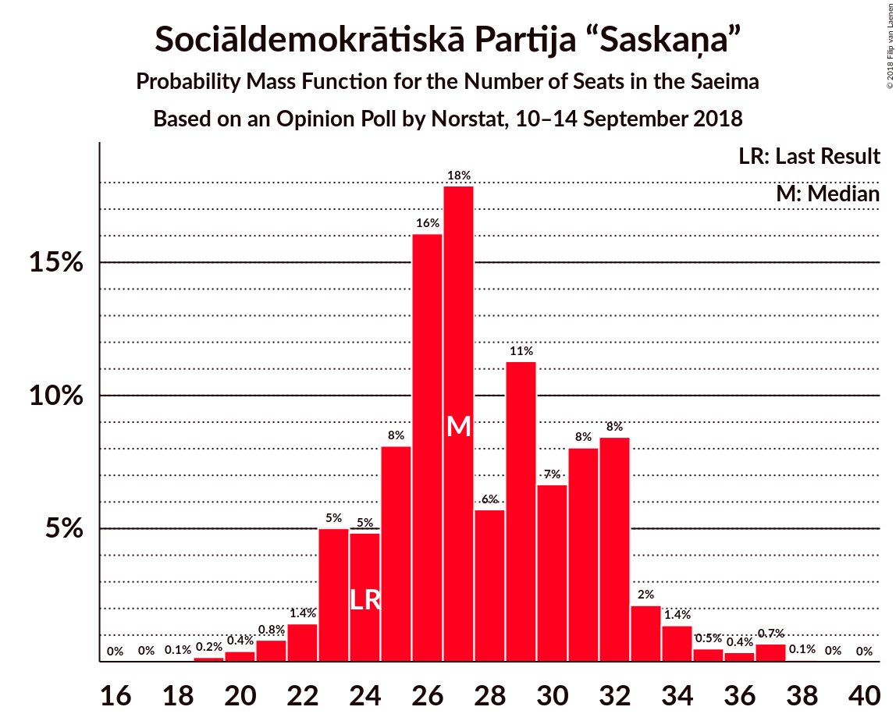
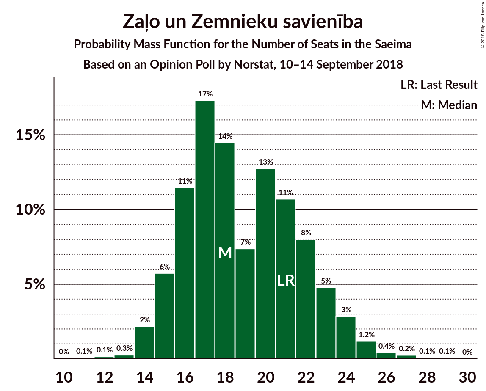
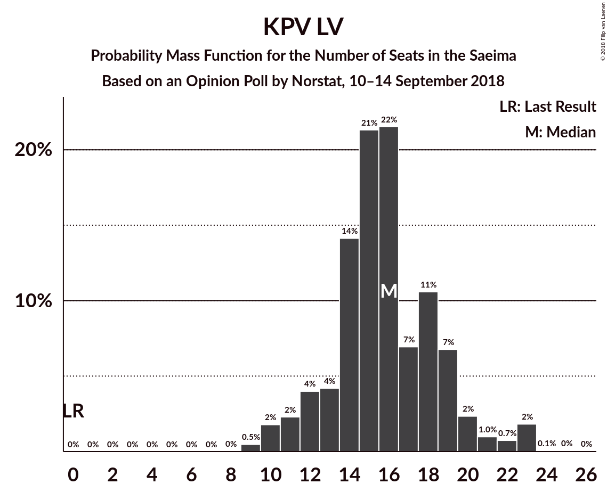
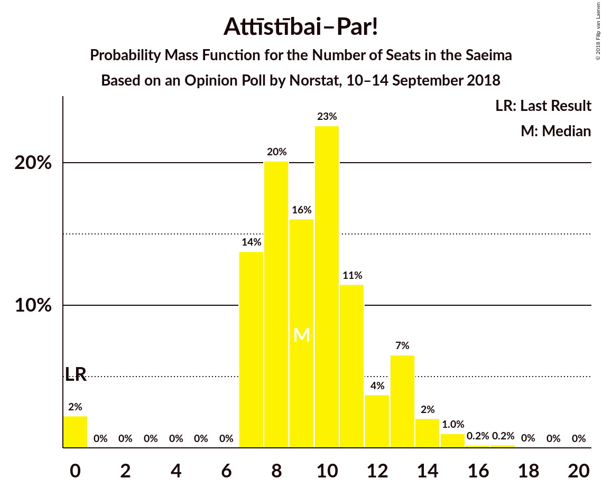

# Opinion Poll by Norstat, 10–14 September 2018

<a href="#voting-intentions">Voting Intentions</a> | <a href="#seats">Seats</a> | <a href="#coalitions">Coalitions</a> | <a href="#technical-information">Technical Information</a>

## Voting Intentions

### Confidence Intervals

| Party | Last Result | Poll Result | 80% Confidence Interval | 90% Confidence Interval | 95% Confidence Interval | 99% Confidence Interval |
|:-----:|:-----------:|:-----------:|:-----------------------:|:-----------------------:|:-----------------------:|:-----------------------:|
| Sociāldemokrātiskā Partija “Saskaņa” | 23.0% | 22.8% | 19.8–26.2% |19.0–27.2% |18.3–28.0% |17.0–29.7% |
| Zaļo un Zemnieku savienība | 19.5% | 14.7% | 12.3–17.7% |11.7–18.6% |11.1–19.3% |10.0–20.9% |
| KPV LV | 0.0% | 13.0% | 10.7–15.9% |10.1–16.7% |9.6–17.4% |8.6–18.9% |
| Jaunā konservatīvā partija | 0.7% | 10.2% | 8.2–12.8% |7.7–13.6% |7.2–14.3% |6.3–15.6% |
| Nacionālā apvienība „Visu Latvijai!”–„Tēvzemei un Brīvībai/LNNK” | 16.6% | 8.8% | 7.0–11.3% |6.4–12.0% |6.0–12.6% |5.2–13.9% |
| Attīstībai–Par! | 0.9% | 7.7% | 6.0–10.1% |5.5–10.8% |5.2–11.4% |4.5–12.7% |
| Vienotība | 21.9% | 5.3% | 3.9–7.4% |3.5–8.0% |3.2–8.5% |2.7–9.6% |
| Latvijas Krievu savienība | 1.6% | 3.2% | 2.2–4.9% |1.9–5.4% |1.7–5.9% |1.3–6.9% |
| Latvijas Reģionu apvienība | 6.7% | 2.5% | 1.6–4.1% |1.4–4.6% |1.2–5.0% |0.9–5.9% |
| Progresīvie | 0.0% | 1.8% | 1.1–3.2% |0.9–3.6% |0.8–4.0% |0.5–4.9% |

*Note:* The poll result column reflects the actual value used in the calculations. Published results may vary slightly, and in addition be rounded to fewer digits.

## Seats

### Confidence Intervals

| Party | Last Result | Median | 80% Confidence Interval | 90% Confidence Interval | 95% Confidence Interval | 99% Confidence Interval |
|:-----:|:-----------:|:------:|:-----------------------:|:-----------------------:|:-----------------------:|:-----------------------:|
| <a href="#sociāldemokrātiskā-partija-“saskaņa”">Sociāldemokrātiskā Partija “Saskaņa”</a> | 24 | 27 | 24–32 |23–33 |22–34 |20–37 |
| <a href="#zaļo-un-zemnieku-savienība">Zaļo un Zemnieku savienība</a> | 21 | 18 | 16–22 |15–23 |14–24 |13–26 |
| <a href="#kpv-lv">KPV LV</a> | 0 | 16 | 13–19 |12–20 |11–22 |10–23 |
| <a href="#jaunā-konservatīvā-partija">Jaunā konservatīvā partija</a> | 0 | 13 | 9–16 |8–16 |8–16 |7–19 |
| <a href="#nacionālā-apvienība-„visu-latvijai!”–„tēvzemei-un-brīvībai/lnnk”">Nacionālā apvienība „Visu Latvijai!”–„Tēvzemei un Brīvībai/LNNK”</a> | 17 | 11 | 7–13 |7–15 |6–15 |6–17 |
| <a href="#attīstībai–par!">Attīstībai–Par!</a> | 0 | 9 | 7–13 |7–13 |7–14 |0–15 |
| <a href="#vienotība">Vienotība</a> | 23 | 7 | 0–8 |0–10 |0–10 |0–11 |
| <a href="#latvijas-krievu-savienība">Latvijas Krievu savienība</a> | 0 | 0 | 0 |0–7 |0–7 |0–8 |
| <a href="#latvijas-reģionu-apvienība">Latvijas Reģionu apvienība</a> | 8 | 0 | 0 |0 |0 |0–7 |
| <a href="#progresīvie">Progresīvie</a> | 0 | 0 | 0 |0 |0 |0 |

### Sociāldemokrātiskā Partija “Saskaņa”

*For a full overview of the results for this party, see the [Sociāldemokrātiskā Partija “Saskaņa”](party-sociāldemokrātiskāpartija“saskaņa”.html) page.*

| Number of Seats | Probability | Accumulated | Special Marks |
|:---------------:|:-----------:|:-----------:|:-------------:|
| 18 | 0.1% | 100% |  |
| 19 | 0.2% | 99.9% |  |
| 20 | 0.4% | 99.8% |  |
| 21 | 0.8% | 99.4% |  |
| 22 | 1.4% | 98.6% |  |
| 23 | 5% | 97% |  |
| 24 | 5% | 92% | Last Result |
| 25 | 8% | 87% |  |
| 26 | 16% | 79% |  |
| 27 | 18% | 63% | Median |
| 28 | 6% | 45% |  |
| 29 | 11% | 39% |  |
| 30 | 7% | 28% |  |
| 31 | 8% | 22% |  |
| 32 | 8% | 14% |  |
| 33 | 2% | 5% |  |
| 34 | 1.4% | 3% |  |
| 35 | 0.5% | 2% |  |
| 36 | 0.4% | 1.1% |  |
| 37 | 0.7% | 0.8% |  |
| 38 | 0.1% | 0.1% |  |
| 39 | 0% | 0% |  |

### Zaļo un Zemnieku savienība

*For a full overview of the results for this party, see the [Zaļo un Zemnieku savienība](party-zaļounzemniekusavienība.html) page.*

| Number of Seats | Probability | Accumulated | Special Marks |
|:---------------:|:-----------:|:-----------:|:-------------:|
| 11 | 0.1% | 100% |  |
| 12 | 0.1% | 99.9% |  |
| 13 | 0.3% | 99.7% |  |
| 14 | 2% | 99.5% |  |
| 15 | 6% | 97% |  |
| 16 | 11% | 92% |  |
| 17 | 17% | 80% |  |
| 18 | 14% | 63% | Median |
| 19 | 7% | 48% |  |
| 20 | 13% | 41% |  |
| 21 | 11% | 28% | Last Result |
| 22 | 8% | 18% |  |
| 23 | 5% | 10% |  |
| 24 | 3% | 5% |  |
| 25 | 1.2% | 2% |  |
| 26 | 0.4% | 0.8% |  |
| 27 | 0.2% | 0.4% |  |
| 28 | 0.1% | 0.2% |  |
| 29 | 0.1% | 0.1% |  |
| 30 | 0% | 0% |  |

### KPV LV

*For a full overview of the results for this party, see the [KPV LV](party-kpvlv.html) page.*

| Number of Seats | Probability | Accumulated | Special Marks |
|:---------------:|:-----------:|:-----------:|:-------------:|
| 0 | 0% | 100% | Last Result |
| 1 | 0% | 100% |  |
| 2 | 0% | 100% |  |
| 3 | 0% | 100% |  |
| 4 | 0% | 100% |  |
| 5 | 0% | 100% |  |
| 6 | 0% | 100% |  |
| 7 | 0% | 100% |  |
| 8 | 0% | 100% |  |
| 9 | 0.5% | 100% |  |
| 10 | 2% | 99.5% |  |
| 11 | 2% | 98% |  |
| 12 | 4% | 95% |  |
| 13 | 4% | 91% |  |
| 14 | 14% | 87% |  |
| 15 | 21% | 73% |  |
| 16 | 22% | 52% | Median |
| 17 | 7% | 30% |  |
| 18 | 11% | 23% |  |
| 19 | 7% | 13% |  |
| 20 | 2% | 6% |  |
| 21 | 1.0% | 4% |  |
| 22 | 0.7% | 3% |  |
| 23 | 2% | 2% |  |
| 24 | 0.1% | 0.1% |  |
| 25 | 0% | 0% |  |

### Jaunā konservatīvā partija

*For a full overview of the results for this party, see the [Jaunā konservatīvā partija](party-jaunākonservatīvāpartija.html) page.*

| Number of Seats | Probability | Accumulated | Special Marks |
|:---------------:|:-----------:|:-----------:|:-------------:|
| 0 | 0% | 100% | Last Result |
| 1 | 0% | 100% |  |
| 2 | 0% | 100% |  |
| 3 | 0% | 100% |  |
| 4 | 0% | 100% |  |
| 5 | 0% | 100% |  |
| 6 | 0% | 100% |  |
| 7 | 0.5% | 100% |  |
| 8 | 7% | 99.4% |  |
| 9 | 6% | 92% |  |
| 10 | 5% | 86% |  |
| 11 | 6% | 81% |  |
| 12 | 15% | 76% |  |
| 13 | 23% | 61% | Median |
| 14 | 7% | 38% |  |
| 15 | 19% | 31% |  |
| 16 | 10% | 12% |  |
| 17 | 0.5% | 2% |  |
| 18 | 1.4% | 2% |  |
| 19 | 0.3% | 0.6% |  |
| 20 | 0.2% | 0.3% |  |
| 21 | 0.1% | 0.1% |  |
| 22 | 0% | 0.1% |  |
| 23 | 0% | 0% |  |

### Nacionālā apvienība „Visu Latvijai!”–„Tēvzemei un Brīvībai/LNNK”

*For a full overview of the results for this party, see the [Nacionālā apvienība „Visu Latvijai!”–„Tēvzemei un Brīvībai/LNNK”](party-nacionālāapvienība„visulatvijai”–„tēvzemeiunbrīvībailnnk”.html) page.*

| Number of Seats | Probability | Accumulated | Special Marks |
|:---------------:|:-----------:|:-----------:|:-------------:|
| 0 | 0.5% | 100% |  |
| 1 | 0% | 99.5% |  |
| 2 | 0% | 99.5% |  |
| 3 | 0% | 99.5% |  |
| 4 | 0% | 99.5% |  |
| 5 | 0% | 99.5% |  |
| 6 | 3% | 99.5% |  |
| 7 | 10% | 97% |  |
| 8 | 8% | 87% |  |
| 9 | 8% | 79% |  |
| 10 | 12% | 71% |  |
| 11 | 14% | 59% | Median |
| 12 | 25% | 45% |  |
| 13 | 10% | 20% |  |
| 14 | 5% | 10% |  |
| 15 | 3% | 5% |  |
| 16 | 1.2% | 2% |  |
| 17 | 0.4% | 0.8% | Last Result |
| 18 | 0.4% | 0.4% |  |
| 19 | 0% | 0% |  |

### Attīstībai–Par!

*For a full overview of the results for this party, see the [Attīstībai–Par!](party-attīstībai–par.html) page.*

| Number of Seats | Probability | Accumulated | Special Marks |
|:---------------:|:-----------:|:-----------:|:-------------:|
| 0 | 2% | 100% | Last Result |
| 1 | 0% | 98% |  |
| 2 | 0% | 98% |  |
| 3 | 0% | 98% |  |
| 4 | 0% | 98% |  |
| 5 | 0% | 98% |  |
| 6 | 0% | 98% |  |
| 7 | 14% | 98% |  |
| 8 | 20% | 84% |  |
| 9 | 16% | 64% | Median |
| 10 | 23% | 48% |  |
| 11 | 11% | 25% |  |
| 12 | 4% | 14% |  |
| 13 | 7% | 10% |  |
| 14 | 2% | 4% |  |
| 15 | 1.0% | 1.5% |  |
| 16 | 0.2% | 0.5% |  |
| 17 | 0.2% | 0.3% |  |
| 18 | 0% | 0.1% |  |
| 19 | 0% | 0% |  |

### Vienotība

*For a full overview of the results for this party, see the [Vienotība](party-vienotība.html) page.*

| Number of Seats | Probability | Accumulated | Special Marks |
|:---------------:|:-----------:|:-----------:|:-------------:|
| 0 | 47% | 100% |  |
| 1 | 0% | 53% |  |
| 2 | 0% | 53% |  |
| 3 | 0% | 53% |  |
| 4 | 0% | 53% |  |
| 5 | 0% | 53% |  |
| 6 | 0% | 53% |  |
| 7 | 35% | 53% | Median |
| 8 | 9% | 18% |  |
| 9 | 4% | 9% |  |
| 10 | 4% | 5% |  |
| 11 | 0.5% | 0.8% |  |
| 12 | 0.2% | 0.3% |  |
| 13 | 0.1% | 0.1% |  |
| 14 | 0% | 0% |  |
| 15 | 0% | 0% |  |
| 16 | 0% | 0% |  |
| 17 | 0% | 0% |  |
| 18 | 0% | 0% |  |
| 19 | 0% | 0% |  |
| 20 | 0% | 0% |  |
| 21 | 0% | 0% |  |
| 22 | 0% | 0% |  |
| 23 | 0% | 0% | Last Result |

### Latvijas Krievu savienība

*For a full overview of the results for this party, see the [Latvijas Krievu savienība](party-latvijaskrievusavienība.html) page.*

| Number of Seats | Probability | Accumulated | Special Marks |
|:---------------:|:-----------:|:-----------:|:-------------:|
| 0 | 93% | 100% | Last Result, Median |
| 1 | 0% | 7% |  |
| 2 | 0% | 7% |  |
| 3 | 0% | 7% |  |
| 4 | 0% | 7% |  |
| 5 | 0% | 7% |  |
| 6 | 1.1% | 7% |  |
| 7 | 6% | 6% |  |
| 8 | 0.5% | 0.6% |  |
| 9 | 0.1% | 0.1% |  |
| 10 | 0% | 0% |  |

### Latvijas Reģionu apvienība

*For a full overview of the results for this party, see the [Latvijas Reģionu apvienība](party-latvijasreģionuapvienība.html) page.*

| Number of Seats | Probability | Accumulated | Special Marks |
|:---------------:|:-----------:|:-----------:|:-------------:|
| 0 | 98% | 100% | Median |
| 1 | 0% | 2% |  |
| 2 | 0% | 2% |  |
| 3 | 0% | 2% |  |
| 4 | 0% | 2% |  |
| 5 | 0% | 2% |  |
| 6 | 0% | 2% |  |
| 7 | 2% | 2% |  |
| 8 | 0.2% | 0.2% | Last Result |
| 9 | 0.1% | 0.1% |  |
| 10 | 0% | 0% |  |

### Progresīvie

*For a full overview of the results for this party, see the [Progresīvie](party-progresīvie.html) page.*

| Number of Seats | Probability | Accumulated | Special Marks |
|:---------------:|:-----------:|:-----------:|:-------------:|
| 0 | 99.7% | 100% | Last Result, Median |
| 1 | 0% | 0.3% |  |
| 2 | 0% | 0.3% |  |
| 3 | 0% | 0.3% |  |
| 4 | 0% | 0.3% |  |
| 5 | 0.1% | 0.3% |  |
| 6 | 0.1% | 0.2% |  |
| 7 | 0.1% | 0.1% |  |
| 8 | 0% | 0% |  |

## Coalitions

### Confidence Intervals

| Coalition | Last Result | Median | Majority? | 80% Confidence Interval | 90% Confidence Interval | 95% Confidence Interval | 99% Confidence Interval |
|:---------:|:-----------:|:------:|:---------:|:-----------------------:|:-----------------------:|:-----------------------:|:-----------------------:|
| Sociāldemokrātiskā Partija “Saskaņa” – Zaļo un Zemnieku savienība – KPV LV | 45 | 63 | 99.8% | 57–68 | 55–70 | 54–70 | 52–74 |
| Zaļo un Zemnieku savienība – Jaunā konservatīvā partija – Nacionālā apvienība „Visu Latvijai!”–„Tēvzemei un Brīvībai/LNNK” – Attīstībai–Par! – Vienotība | 61 | 56 | 93% | 52–60 | 50–61 | 49–63 | 46–65 |
| Zaļo un Zemnieku savienība – Jaunā konservatīvā partija – Nacionālā apvienība „Visu Latvijai!”–„Tēvzemei un Brīvībai/LNNK” – Attīstībai–Par! | 38 | 52 | 70% | 47–56 | 45–58 | 43–60 | 41–62 |
| Sociāldemokrātiskā Partija “Saskaņa” – Jaunā konservatīvā partija – Attīstībai–Par! | 24 | 50 | 45% | 44–56 | 42–56 | 41–57 | 39–60 |
| Zaļo un Zemnieku savienība – Jaunā konservatīvā partija – Nacionālā apvienība „Visu Latvijai!”–„Tēvzemei un Brīvībai/LNNK” – Vienotība | 61 | 46 | 16% | 42–51 | 41–53 | 39–54 | 37–58 |
| Zaļo un Zemnieku savienība – Nacionālā apvienība „Visu Latvijai!”–„Tēvzemei un Brīvībai/LNNK” – Attīstībai–Par! – Vienotība | 61 | 44 | 2% | 37–48 | 37–50 | 36–50 | 33–53 |
| Sociāldemokrātiskā Partija “Saskaņa” – KPV LV | 24 | 43 | 2% | 39–48 | 38–50 | 36–50 | 34–52 |
| Zaļo un Zemnieku savienība – Jaunā konservatīvā partija – Nacionālā apvienība „Visu Latvijai!”–„Tēvzemei un Brīvībai/LNNK” | 38 | 42 | 2% | 38–46 | 36–49 | 35–50 | 32–52 |
| Zaļo un Zemnieku savienība – Nacionālā apvienība „Visu Latvijai!”–„Tēvzemei un Brīvībai/LNNK” – Attīstībai–Par! | 38 | 38 | 0.1% | 35–43 | 33–45 | 31–46 | 30–49 |
| Jaunā konservatīvā partija – Nacionālā apvienība „Visu Latvijai!”–„Tēvzemei un Brīvībai/LNNK” – Attīstībai–Par! – Vienotība | 40 | 37 | 0% | 31–42 | 30–44 | 29–45 | 26–47 |
| Sociāldemokrātiskā Partija “Saskaņa” – Attīstībai–Par! | 24 | 37 | 0% | 32–41 | 32–43 | 30–44 | 27–46 |
| Zaļo un Zemnieku savienība – Nacionālā apvienība „Visu Latvijai!”–„Tēvzemei un Brīvībai/LNNK” – Vienotība | 61 | 34 | 0% | 29–39 | 28–41 | 27–42 | 24–44 |

### Sociāldemokrātiskā Partija “Saskaņa” – Zaļo un Zemnieku savienība – KPV LV

| Number of Seats | Probability | Accumulated | Special Marks |
|:---------------:|:-----------:|:-----------:|:-------------:|
| 45 | 0% | 100% | Last Result |
| 46 | 0% | 100% |  |
| 47 | 0% | 100% |  |
| 48 | 0.1% | 100% |  |
| 49 | 0% | 99.9% |  |
| 50 | 0.1% | 99.9% |  |
| 51 | 0.2% | 99.8% | Majority |
| 52 | 0.3% | 99.6% |  |
| 53 | 1.0% | 99.3% |  |
| 54 | 2% | 98% |  |
| 55 | 3% | 96% |  |
| 56 | 3% | 94% |  |
| 57 | 3% | 91% |  |
| 58 | 7% | 88% |  |
| 59 | 5% | 81% |  |
| 60 | 9% | 76% |  |
| 61 | 7% | 67% | Median |
| 62 | 9% | 60% |  |
| 63 | 9% | 51% |  |
| 64 | 11% | 42% |  |
| 65 | 14% | 32% |  |
| 66 | 2% | 17% |  |
| 67 | 4% | 15% |  |
| 68 | 3% | 11% |  |
| 69 | 2% | 8% |  |
| 70 | 3% | 6% |  |
| 71 | 1.2% | 2% |  |
| 72 | 0.3% | 1.3% |  |
| 73 | 0.2% | 1.0% |  |
| 74 | 0.5% | 0.8% |  |
| 75 | 0.2% | 0.3% |  |
| 76 | 0% | 0.1% |  |
| 77 | 0% | 0.1% |  |
| 78 | 0% | 0% |  |

### Zaļo un Zemnieku savienība – Jaunā konservatīvā partija – Nacionālā apvienība „Visu Latvijai!”–„Tēvzemei un Brīvībai/LNNK” – Attīstībai–Par! – Vienotība

| Number of Seats | Probability | Accumulated | Special Marks |
|:---------------:|:-----------:|:-----------:|:-------------:|
| 42 | 0.1% | 100% |  |
| 43 | 0% | 99.9% |  |
| 44 | 0.1% | 99.9% |  |
| 45 | 0.1% | 99.8% |  |
| 46 | 0.2% | 99.7% |  |
| 47 | 0.5% | 99.4% |  |
| 48 | 0.6% | 98.9% |  |
| 49 | 2% | 98% |  |
| 50 | 4% | 97% |  |
| 51 | 3% | 93% | Majority |
| 52 | 7% | 90% |  |
| 53 | 19% | 83% |  |
| 54 | 6% | 64% |  |
| 55 | 5% | 58% |  |
| 56 | 6% | 53% |  |
| 57 | 11% | 47% |  |
| 58 | 11% | 37% | Median |
| 59 | 7% | 26% |  |
| 60 | 11% | 19% |  |
| 61 | 3% | 8% | Last Result |
| 62 | 2% | 4% |  |
| 63 | 1.3% | 3% |  |
| 64 | 0.3% | 2% |  |
| 65 | 0.9% | 1.3% |  |
| 66 | 0.3% | 0.4% |  |
| 67 | 0.1% | 0.1% |  |
| 68 | 0% | 0% |  |

### Zaļo un Zemnieku savienība – Jaunā konservatīvā partija – Nacionālā apvienība „Visu Latvijai!”–„Tēvzemei un Brīvībai/LNNK” – Attīstībai–Par!

| Number of Seats | Probability | Accumulated | Special Marks |
|:---------------:|:-----------:|:-----------:|:-------------:|
| 38 | 0% | 100% | Last Result |
| 39 | 0.1% | 99.9% |  |
| 40 | 0.1% | 99.9% |  |
| 41 | 0.5% | 99.8% |  |
| 42 | 0.6% | 99.3% |  |
| 43 | 1.3% | 98.7% |  |
| 44 | 2% | 97% |  |
| 45 | 1.4% | 96% |  |
| 46 | 4% | 94% |  |
| 47 | 3% | 90% |  |
| 48 | 3% | 88% |  |
| 49 | 5% | 85% |  |
| 50 | 11% | 81% |  |
| 51 | 12% | 70% | Median, Majority |
| 52 | 14% | 58% |  |
| 53 | 23% | 44% |  |
| 54 | 5% | 21% |  |
| 55 | 3% | 16% |  |
| 56 | 3% | 12% |  |
| 57 | 4% | 9% |  |
| 58 | 1.4% | 6% |  |
| 59 | 1.4% | 4% |  |
| 60 | 2% | 3% |  |
| 61 | 0.3% | 1.1% |  |
| 62 | 0.4% | 0.8% |  |
| 63 | 0.2% | 0.4% |  |
| 64 | 0.1% | 0.1% |  |
| 65 | 0% | 0% |  |

### Sociāldemokrātiskā Partija “Saskaņa” – Jaunā konservatīvā partija – Attīstībai–Par!

| Number of Seats | Probability | Accumulated | Special Marks |
|:---------------:|:-----------:|:-----------:|:-------------:|
| 24 | 0% | 100% | Last Result |
| 25 | 0% | 100% |  |
| 26 | 0% | 100% |  |
| 27 | 0% | 100% |  |
| 28 | 0% | 100% |  |
| 29 | 0% | 100% |  |
| 30 | 0% | 100% |  |
| 31 | 0% | 100% |  |
| 32 | 0% | 100% |  |
| 33 | 0% | 100% |  |
| 34 | 0% | 100% |  |
| 35 | 0% | 100% |  |
| 36 | 0% | 100% |  |
| 37 | 0.1% | 99.9% |  |
| 38 | 0.2% | 99.8% |  |
| 39 | 0.2% | 99.7% |  |
| 40 | 0.7% | 99.5% |  |
| 41 | 3% | 98.8% |  |
| 42 | 1.2% | 96% |  |
| 43 | 4% | 95% |  |
| 44 | 4% | 91% |  |
| 45 | 4% | 87% |  |
| 46 | 2% | 83% |  |
| 47 | 6% | 81% |  |
| 48 | 6% | 75% |  |
| 49 | 11% | 68% | Median |
| 50 | 12% | 57% |  |
| 51 | 7% | 45% | Majority |
| 52 | 9% | 38% |  |
| 53 | 12% | 29% |  |
| 54 | 3% | 17% |  |
| 55 | 2% | 14% |  |
| 56 | 10% | 13% |  |
| 57 | 1.4% | 3% |  |
| 58 | 0.9% | 2% |  |
| 59 | 0.2% | 0.8% |  |
| 60 | 0.2% | 0.6% |  |
| 61 | 0.1% | 0.4% |  |
| 62 | 0.1% | 0.2% |  |
| 63 | 0.1% | 0.1% |  |
| 64 | 0% | 0% |  |

### Zaļo un Zemnieku savienība – Jaunā konservatīvā partija – Nacionālā apvienība „Visu Latvijai!”–„Tēvzemei un Brīvībai/LNNK” – Vienotība

| Number of Seats | Probability | Accumulated | Special Marks |
|:---------------:|:-----------:|:-----------:|:-------------:|
| 33 | 0% | 100% |  |
| 34 | 0% | 99.9% |  |
| 35 | 0.1% | 99.9% |  |
| 36 | 0.2% | 99.8% |  |
| 37 | 0.4% | 99.6% |  |
| 38 | 0.8% | 99.2% |  |
| 39 | 1.1% | 98% |  |
| 40 | 0.9% | 97% |  |
| 41 | 3% | 96% |  |
| 42 | 10% | 94% |  |
| 43 | 4% | 84% |  |
| 44 | 14% | 80% |  |
| 45 | 12% | 66% |  |
| 46 | 8% | 55% |  |
| 47 | 6% | 46% |  |
| 48 | 8% | 40% |  |
| 49 | 11% | 32% | Median |
| 50 | 5% | 21% |  |
| 51 | 7% | 16% | Majority |
| 52 | 3% | 9% |  |
| 53 | 2% | 5% |  |
| 54 | 1.4% | 3% |  |
| 55 | 0.4% | 2% |  |
| 56 | 0.4% | 1.1% |  |
| 57 | 0.1% | 0.7% |  |
| 58 | 0.3% | 0.5% |  |
| 59 | 0.2% | 0.2% |  |
| 60 | 0.1% | 0.1% |  |
| 61 | 0% | 0% | Last Result |

### Zaļo un Zemnieku savienība – Nacionālā apvienība „Visu Latvijai!”–„Tēvzemei un Brīvībai/LNNK” – Attīstībai–Par! – Vienotība

| Number of Seats | Probability | Accumulated | Special Marks |
|:---------------:|:-----------:|:-----------:|:-------------:|
| 28 | 0% | 100% |  |
| 29 | 0.1% | 99.9% |  |
| 30 | 0.1% | 99.9% |  |
| 31 | 0.1% | 99.8% |  |
| 32 | 0.1% | 99.7% |  |
| 33 | 0.2% | 99.5% |  |
| 34 | 0.4% | 99.3% |  |
| 35 | 0.9% | 98.9% |  |
| 36 | 1.0% | 98% |  |
| 37 | 8% | 97% |  |
| 38 | 9% | 89% |  |
| 39 | 7% | 80% |  |
| 40 | 6% | 72% |  |
| 41 | 3% | 66% |  |
| 42 | 6% | 63% |  |
| 43 | 7% | 57% |  |
| 44 | 7% | 50% |  |
| 45 | 14% | 43% | Median |
| 46 | 6% | 29% |  |
| 47 | 6% | 22% |  |
| 48 | 7% | 16% |  |
| 49 | 4% | 9% |  |
| 50 | 3% | 5% |  |
| 51 | 1.3% | 2% | Majority |
| 52 | 0.3% | 1.1% |  |
| 53 | 0.4% | 0.8% |  |
| 54 | 0.3% | 0.4% |  |
| 55 | 0% | 0.1% |  |
| 56 | 0% | 0.1% |  |
| 57 | 0% | 0% |  |
| 58 | 0% | 0% |  |
| 59 | 0% | 0% |  |
| 60 | 0% | 0% |  |
| 61 | 0% | 0% | Last Result |

### Sociāldemokrātiskā Partija “Saskaņa” – KPV LV

| Number of Seats | Probability | Accumulated | Special Marks |
|:---------------:|:-----------:|:-----------:|:-------------:|
| 24 | 0% | 100% | Last Result |
| 25 | 0% | 100% |  |
| 26 | 0% | 100% |  |
| 27 | 0% | 100% |  |
| 28 | 0% | 100% |  |
| 29 | 0% | 100% |  |
| 30 | 0% | 100% |  |
| 31 | 0% | 100% |  |
| 32 | 0% | 100% |  |
| 33 | 0.1% | 99.9% |  |
| 34 | 0.4% | 99.8% |  |
| 35 | 1.3% | 99.4% |  |
| 36 | 0.6% | 98% |  |
| 37 | 2% | 97% |  |
| 38 | 3% | 96% |  |
| 39 | 4% | 93% |  |
| 40 | 12% | 89% |  |
| 41 | 9% | 77% |  |
| 42 | 11% | 68% |  |
| 43 | 11% | 57% | Median |
| 44 | 6% | 46% |  |
| 45 | 4% | 40% |  |
| 46 | 5% | 36% |  |
| 47 | 18% | 30% |  |
| 48 | 5% | 12% |  |
| 49 | 2% | 7% |  |
| 50 | 4% | 5% |  |
| 51 | 1.0% | 2% | Majority |
| 52 | 0.4% | 0.8% |  |
| 53 | 0.2% | 0.5% |  |
| 54 | 0.2% | 0.3% |  |
| 55 | 0% | 0.1% |  |
| 56 | 0% | 0.1% |  |
| 57 | 0% | 0% |  |

### Zaļo un Zemnieku savienība – Jaunā konservatīvā partija – Nacionālā apvienība „Visu Latvijai!”–„Tēvzemei un Brīvībai/LNNK”

| Number of Seats | Probability | Accumulated | Special Marks |
|:---------------:|:-----------:|:-----------:|:-------------:|
| 30 | 0% | 100% |  |
| 31 | 0.1% | 99.9% |  |
| 32 | 0.5% | 99.8% |  |
| 33 | 0.4% | 99.3% |  |
| 34 | 0.6% | 98.9% |  |
| 35 | 2% | 98% |  |
| 36 | 2% | 96% |  |
| 37 | 4% | 94% |  |
| 38 | 5% | 90% | Last Result |
| 39 | 5% | 85% |  |
| 40 | 6% | 80% |  |
| 41 | 8% | 74% |  |
| 42 | 17% | 67% | Median |
| 43 | 10% | 50% |  |
| 44 | 14% | 40% |  |
| 45 | 11% | 25% |  |
| 46 | 6% | 14% |  |
| 47 | 1.5% | 9% |  |
| 48 | 2% | 7% |  |
| 49 | 2% | 5% |  |
| 50 | 1.2% | 3% |  |
| 51 | 0.8% | 2% | Majority |
| 52 | 0.6% | 1.0% |  |
| 53 | 0.2% | 0.4% |  |
| 54 | 0.1% | 0.2% |  |
| 55 | 0% | 0.1% |  |
| 56 | 0% | 0% |  |

### Zaļo un Zemnieku savienība – Nacionālā apvienība „Visu Latvijai!”–„Tēvzemei un Brīvībai/LNNK” – Attīstībai–Par!

| Number of Seats | Probability | Accumulated | Special Marks |
|:---------------:|:-----------:|:-----------:|:-------------:|
| 26 | 0.1% | 100% |  |
| 27 | 0.1% | 99.9% |  |
| 28 | 0.1% | 99.8% |  |
| 29 | 0.2% | 99.7% |  |
| 30 | 0.6% | 99.5% |  |
| 31 | 1.5% | 98.9% |  |
| 32 | 1.2% | 97% |  |
| 33 | 3% | 96% |  |
| 34 | 2% | 93% |  |
| 35 | 3% | 91% |  |
| 36 | 4% | 88% |  |
| 37 | 14% | 84% |  |
| 38 | 21% | 70% | Last Result, Median |
| 39 | 10% | 49% |  |
| 40 | 11% | 39% |  |
| 41 | 6% | 28% |  |
| 42 | 8% | 22% |  |
| 43 | 5% | 14% |  |
| 44 | 3% | 9% |  |
| 45 | 2% | 6% |  |
| 46 | 2% | 4% |  |
| 47 | 1.3% | 2% |  |
| 48 | 0.4% | 0.9% |  |
| 49 | 0.3% | 0.5% |  |
| 50 | 0.2% | 0.3% |  |
| 51 | 0% | 0.1% | Majority |
| 52 | 0% | 0% |  |

### Jaunā konservatīvā partija – Nacionālā apvienība „Visu Latvijai!”–„Tēvzemei un Brīvībai/LNNK” – Attīstībai–Par! – Vienotība

| Number of Seats | Probability | Accumulated | Special Marks |
|:---------------:|:-----------:|:-----------:|:-------------:|
| 23 | 0.1% | 100% |  |
| 24 | 0% | 99.9% |  |
| 25 | 0.3% | 99.9% |  |
| 26 | 0.5% | 99.6% |  |
| 27 | 0.4% | 99.0% |  |
| 28 | 0.4% | 98.7% |  |
| 29 | 2% | 98% |  |
| 30 | 5% | 96% |  |
| 31 | 3% | 92% |  |
| 32 | 4% | 89% |  |
| 33 | 5% | 85% |  |
| 34 | 3% | 80% |  |
| 35 | 15% | 78% |  |
| 36 | 10% | 63% |  |
| 37 | 8% | 53% |  |
| 38 | 9% | 45% |  |
| 39 | 7% | 35% |  |
| 40 | 8% | 28% | Last Result, Median |
| 41 | 5% | 20% |  |
| 42 | 7% | 15% |  |
| 43 | 3% | 9% |  |
| 44 | 2% | 6% |  |
| 45 | 2% | 4% |  |
| 46 | 1.2% | 2% |  |
| 47 | 0.6% | 0.8% |  |
| 48 | 0.1% | 0.2% |  |
| 49 | 0% | 0.1% |  |
| 50 | 0% | 0% |  |

### Sociāldemokrātiskā Partija “Saskaņa” – Attīstībai–Par!

| Number of Seats | Probability | Accumulated | Special Marks |
|:---------------:|:-----------:|:-----------:|:-------------:|
| 24 | 0% | 100% | Last Result |
| 25 | 0.1% | 99.9% |  |
| 26 | 0.1% | 99.8% |  |
| 27 | 0.4% | 99.7% |  |
| 28 | 0.5% | 99.2% |  |
| 29 | 0.7% | 98.7% |  |
| 30 | 1.4% | 98% |  |
| 31 | 1.1% | 97% |  |
| 32 | 6% | 96% |  |
| 33 | 4% | 90% |  |
| 34 | 5% | 86% |  |
| 35 | 14% | 81% |  |
| 36 | 8% | 67% | Median |
| 37 | 16% | 58% |  |
| 38 | 7% | 42% |  |
| 39 | 7% | 35% |  |
| 40 | 10% | 28% |  |
| 41 | 9% | 17% |  |
| 42 | 2% | 8% |  |
| 43 | 3% | 6% |  |
| 44 | 1.4% | 3% |  |
| 45 | 0.8% | 2% |  |
| 46 | 0.4% | 0.9% |  |
| 47 | 0.2% | 0.4% |  |
| 48 | 0.2% | 0.3% |  |
| 49 | 0.1% | 0.1% |  |
| 50 | 0% | 0% |  |

### Zaļo un Zemnieku savienība – Nacionālā apvienība „Visu Latvijai!”–„Tēvzemei un Brīvībai/LNNK” – Vienotība

| Number of Seats | Probability | Accumulated | Special Marks |
|:---------------:|:-----------:|:-----------:|:-------------:|
| 22 | 0.1% | 100% |  |
| 23 | 0.2% | 99.9% |  |
| 24 | 0.4% | 99.7% |  |
| 25 | 0.7% | 99.3% |  |
| 26 | 1.0% | 98.6% |  |
| 27 | 1.2% | 98% |  |
| 28 | 2% | 96% |  |
| 29 | 17% | 94% |  |
| 30 | 6% | 77% |  |
| 31 | 8% | 71% |  |
| 32 | 7% | 64% |  |
| 33 | 5% | 57% |  |
| 34 | 8% | 52% |  |
| 35 | 12% | 44% |  |
| 36 | 5% | 32% | Median |
| 37 | 8% | 27% |  |
| 38 | 4% | 19% |  |
| 39 | 5% | 14% |  |
| 40 | 3% | 10% |  |
| 41 | 4% | 6% |  |
| 42 | 0.9% | 3% |  |
| 43 | 0.7% | 2% |  |
| 44 | 0.6% | 1.0% |  |
| 45 | 0.3% | 0.4% |  |
| 46 | 0.1% | 0.1% |  |
| 47 | 0% | 0.1% |  |
| 48 | 0% | 0% |  |
| 49 | 0% | 0% |  |
| 50 | 0% | 0% |  |
| 51 | 0% | 0% | Majority |
| 52 | 0% | 0% |  |
| 53 | 0% | 0% |  |
| 54 | 0% | 0% |  |
| 55 | 0% | 0% |  |
| 56 | 0% | 0% |  |
| 57 | 0% | 0% |  |
| 58 | 0% | 0% |  |
| 59 | 0% | 0% |  |
| 60 | 0% | 0% |  |
| 61 | 0% | 0% | Last Result |

## Technical Information

### Opinion Poll

+ **Polling firm:** Norstat
+ **Commissioner(s):** —
+ **Fieldwork period:** 10–14 September 2018

### Calculations

+ **Sample size:** 285
+ **Simulations done:** 1,048,576
+ **Error estimate:** 3.09%

