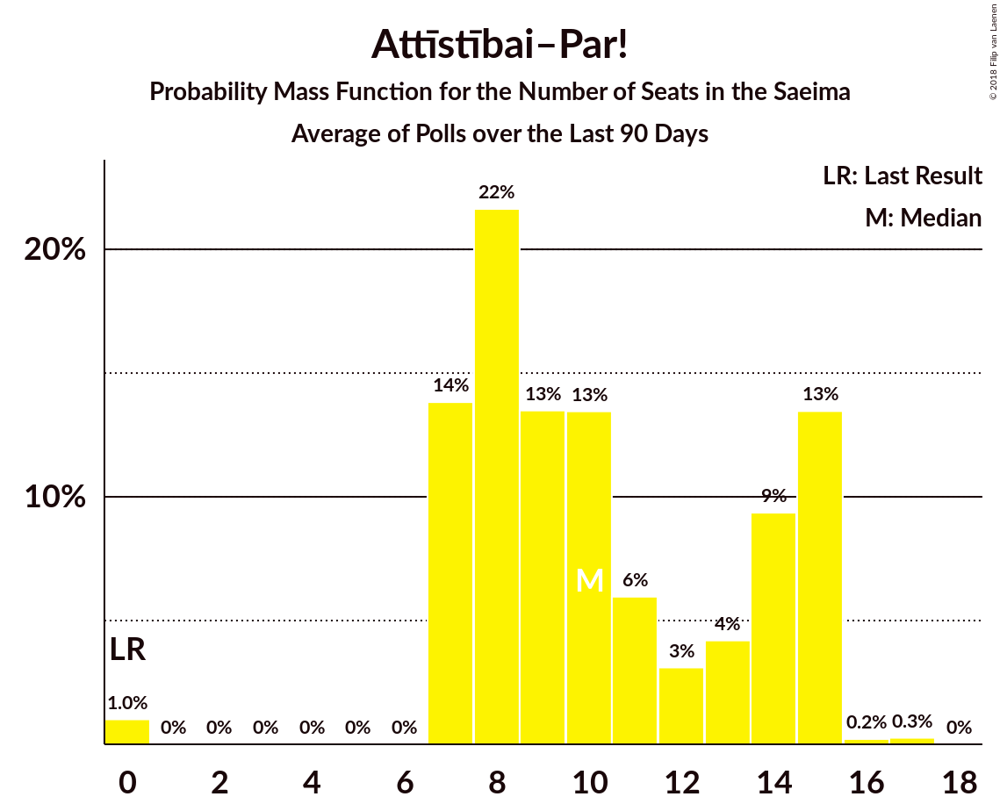

# Attīstībai–Par!

<a href="#voting-intentions">Voting Intentions</a> | <a href="#seats">Seats</a>

## Voting Intentions

Last result: **0.9%** (General Election of 4 October 2014)

### Confidence Intervals

| Period     | Polling firm/Commissioner(s) | Median | 80% Confidence Interval | 90% Confidence Interval | 95% Confidence Interval | 99% Confidence Interval |
|:----------:|:----------------:|:-----------:|:-----------------------:|:-----------------------:|:-----------------------:|:-----------------------:|
| N/A | [Poll Average](average.html) | 8.2% | 6.3–13.1% | 5.8–13.5% | 5.5–13.8% | 4.8–14.3% |
| [24–30 September 2018](2018-09-30-FACTUM.html) | FACTUM | 12.9% | 12.1–13.8% | 11.8–14.0% | 11.6–14.3% | 11.2–14.7% |
| [17–23 September 2018](2018-09-23-FACTUM.html) | FACTUM | 11.1% | 10.3–12.0% | 10.1–12.3% | 9.9–12.5% | 9.6–12.9% |
| [8–18 September 2018](2018-09-18-SKDS.html) | SKDS   Latvijas Televīzija | 8.1% | 6.8–9.7% | 6.5–10.1% | 6.2–10.5% | 5.6–11.3% |
| [10–16 September 2018](2018-09-16-FACTUM.html) | FACTUM | 11.8% | 10.6–13.1% | 10.3–13.4% | 10.0–13.8% | 9.5–14.4% |
| [10–14 September 2018](2018-09-14-Norstat.html) | Norstat | 7.7% | 6.0–10.1% | 5.5–10.8% | 5.2–11.4% | 4.5–12.7% |
| [8 August–12 September 2018](2018-09-12-KantarTNS.html) | Kantar TNS   Delfi | 6.9% | 5.8–8.3% | 5.5–8.7% | 5.2–9.0% | 4.7–9.7% |
| [31 August–9 September 2018](2018-09-09-FACTUM.html) | FACTUM | 8.8% | 7.9–9.9% | 7.6–10.2% | 7.4–10.5% | 7.0–11.0% |
| [30 August–5 September 2018](2018-09-05-FACTUM.html) | FACTUM | 9.7% | 8.9–10.6% | 8.7–10.9% | 8.5–11.1% | 8.1–11.6% |
| [27 August–2 September 2018](2018-09-02-FACTUM.html) | FACTUM | 10.7% | 9.8–11.7% | 9.6–11.9% | 9.4–12.2% | 9.0–12.7% |
| [25–31 August 2018](2018-08-31-FACTUM.html) | FACTUM | 11.4% | 10.5–12.5% | 10.2–12.8% | 10.0–13.0% | 9.6–13.5% |
| [22–28 August 2018](2018-08-28-FACTUM.html) | FACTUM | 10.7% | 10.0–12.2% | 9.7–12.5% | 9.4–12.8% | 8.9–13.4% |
| [20–26 August 2018](2018-08-26-FACTUM.html) | FACTUM | 10.4% | 9.8–12.0% | 9.5–12.3% | 9.3–12.6% | 8.8–13.2% |
| [1–23 August 2018](2018-08-23-SKDS.html) | SKDS   Latvijas Televīzija | 4.8% | 3.8–6.1% | 3.6–6.5% | 3.3–6.8% | 2.9–7.5% |
| [13–19 August 2018](2018-08-19-FACTUM.html) | FACTUM | 9.7% | 8.8–10.8% | 8.5–11.1% | 8.3–11.4% | 7.8–11.9% |
| [17–23 July 2018](2018-07-23-FACTUM.html) | FACTUM | 0.0% | N/A | N/A | N/A | N/A |
| [1–30 June 2018](2018-06-30-SKDS.html) | SKDS   Latvijas Televīzija | 0.0% | N/A | N/A | N/A | N/A |
| [1–31 May 2018](2018-05-31-SKDS.html) | SKDS   Latvijas Televīzija | 0.0% | N/A | N/A | N/A | N/A |
| [1–31 May 2018](2018-05-31-Norstat.html) | Norstat   TV3 Latvija | 0.0% | N/A | N/A | N/A | N/A |
| [1–30 April 2018](2018-04-30-SKDS.html) | SKDS   Latvijas Televīzija | 0.0% | N/A | N/A | N/A | N/A |
| [1–31 March 2018](2018-03-31-SKDS.html) | SKDS   Latvijas Televīzija | 0.0% | N/A | N/A | N/A | N/A |
| [1–28 February 2018](2018-02-28-SKDS.html) | SKDS   Latvijas Televīzija | 0.0% | N/A | N/A | N/A | N/A |
| [1–31 January 2018](2018-01-31-SKDS.html) | SKDS   Latvijas Televīzija | 0.0% | N/A | N/A | N/A | N/A |

### Probability Mass Function

The following table shows the probability mass function per percentage block of voting intentions for the [poll average](average.html) for Attīstībai–Par!.

| Voting Intentions | Probability | Accumulated | Special Marks |
|:-----------------:|:-----------:|:-----------:|:-------------:|
| 0.5–1.5% | 0% | 100% | Last Result |
| 1.5–2.5% | 0% | 100% |  |
| 2.5–3.5% | 0% | 100% |  |
| 3.5–4.5% | 0.2% | 100% |  |
| 4.5–5.5% | 3% | 99.8% |  |
| 5.5–6.5% | 12% | 97% |  |
| 6.5–7.5% | 21% | 86% |  |
| 7.5–8.5% | 20% | 65% | Median |
| 8.5–9.5% | 12% | 45% |  |
| 9.5–10.5% | 5% | 32% |  |
| 10.5–11.5% | 2% | 27% |  |
| 11.5–12.5% | 7% | 25% |  |
| 12.5–13.5% | 13% | 18% |  |
| 13.5–14.5% | 4% | 4% |  |
| 14.5–15.5% | 0.2% | 0.2% |  |
| 15.5–16.5% | 0% | 0% |  |

## Seats

Last result: **0** seats (General Election of 4 October 2014)

### Confidence Intervals

| Period     | Polling firm/Commissioner(s) | Median | 80% Confidence Interval | 90% Confidence Interval | 95% Confidence Interval | 99% Confidence Interval |
|:----------:|:----------------:|:------:|:-----------------------:|:-----------------------:|:-----------------------:|:-----------------------:|
| N/A | [Poll Average](average.html) | 10 | 7–15 | 7–15 | 7–15 | 0–15 |
| [24–30 September 2018](2018-09-30-FACTUM.html) | FACTUM | 15 | 13–15 | 13–15 | 13–15 | 12–17 |
| [17–23 September 2018](2018-09-23-FACTUM.html) | FACTUM | 12 | 12–14 | 11–14 | 10–14 | 10–14 |
| [8–18 September 2018](2018-09-18-SKDS.html) | SKDS   Latvijas Televīzija | 9 | 8–11 | 7–12 | 7–12 | 7–13 |
| [10–16 September 2018](2018-09-16-FACTUM.html) | FACTUM | 13 | 12–15 | 12–15 | 10–15 | 10–17 |
| [10–14 September 2018](2018-09-14-Norstat.html) | Norstat | 9 | 7–13 | 7–13 | 7–14 | 0–15 |
| [8 August–12 September 2018](2018-09-12-KantarTNS.html) | Kantar TNS   Delfi | 8 | 7–9 | 7–10 | 7–10 | 0–11 |
| [31 August–9 September 2018](2018-09-09-FACTUM.html) | FACTUM | 0 | 0 | 0 | 0 | 0 |
| [30 August–5 September 2018](2018-09-05-FACTUM.html) | FACTUM | 0 | 0 | 0 | 0 | 0 |
| [27 August–2 September 2018](2018-09-02-FACTUM.html) | FACTUM | 0 | 0 | 0 | 0 | 0 |
| [25–31 August 2018](2018-08-31-FACTUM.html) | FACTUM | 0 | 0 | 0 | 0 | 0 |
| [22–28 August 2018](2018-08-28-FACTUM.html) | FACTUM | 0 | 0 | 0 | 0 | 0 |
| [20–26 August 2018](2018-08-26-FACTUM.html) | FACTUM | 12 | 10–13 | 10–13 | 10–14 | 10–15 |
| [1–23 August 2018](2018-08-23-SKDS.html) | SKDS   Latvijas Televīzija | 0 | 0 | 0 | 0 | 0 |
| [13–19 August 2018](2018-08-19-FACTUM.html) | FACTUM | 0 | 0 | 0 | 0 | 0 |
| [17–23 July 2018](2018-07-23-FACTUM.html) | FACTUM |  |  |  |  |  |
| [1–30 June 2018](2018-06-30-SKDS.html) | SKDS   Latvijas Televīzija |  |  |  |  |  |
| [1–31 May 2018](2018-05-31-SKDS.html) | SKDS   Latvijas Televīzija |  |  |  |  |  |
| [1–31 May 2018](2018-05-31-Norstat.html) | Norstat   TV3 Latvija |  |  |  |  |  |
| [1–30 April 2018](2018-04-30-SKDS.html) | SKDS   Latvijas Televīzija |  |  |  |  |  |
| [1–31 March 2018](2018-03-31-SKDS.html) | SKDS   Latvijas Televīzija |  |  |  |  |  |
| [1–28 February 2018](2018-02-28-SKDS.html) | SKDS   Latvijas Televīzija |  |  |  |  |  |
| [1–31 January 2018](2018-01-31-SKDS.html) | SKDS   Latvijas Televīzija |  |  |  |  |  |

### Probability Mass Function

The following table shows the probability mass function per seat for the [poll average](average.html) for Attīstībai–Par!.

| Number of Seats | Probability | Accumulated | Special Marks |
|:---------------:|:-----------:|:-----------:|:-------------:|
| 0 | 1.0% | 100% | Last Result |
| 1 | 0% | 99.0% |  |
| 2 | 0% | 99.0% |  |
| 3 | 0% | 99.0% |  |
| 4 | 0% | 99.0% |  |
| 5 | 0% | 99.0% |  |
| 6 | 0% | 99.0% |  |
| 7 | 14% | 99.0% |  |
| 8 | 22% | 85% |  |
| 9 | 13% | 64% |  |
| 10 | 13% | 50% | Median |
| 11 | 6% | 37% |  |
| 12 | 3% | 31% |  |
| 13 | 4% | 28% |  |
| 14 | 9% | 23% |  |
| 15 | 13% | 14% |  |
| 16 | 0.2% | 0.5% |  |
| 17 | 0.3% | 0.3% |  |
| 18 | 0% | 0% |  |

